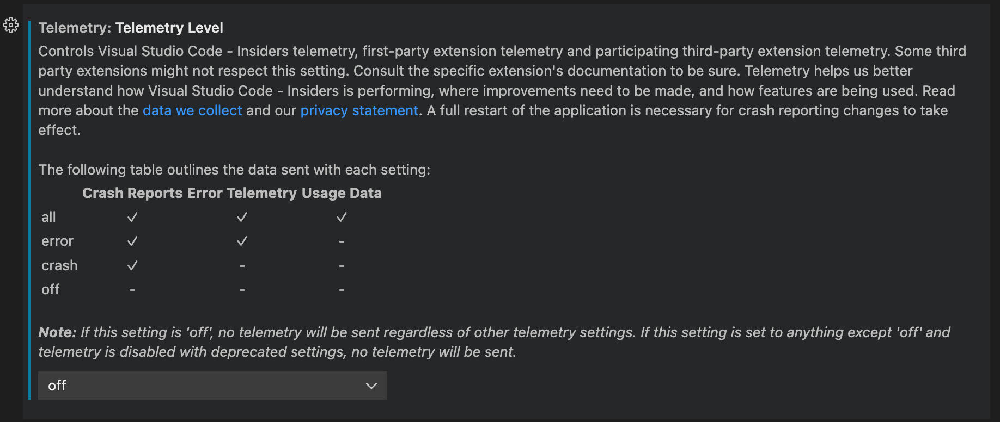
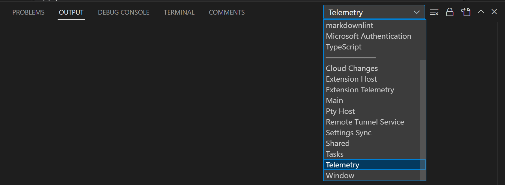
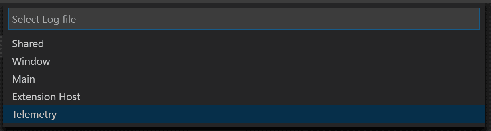
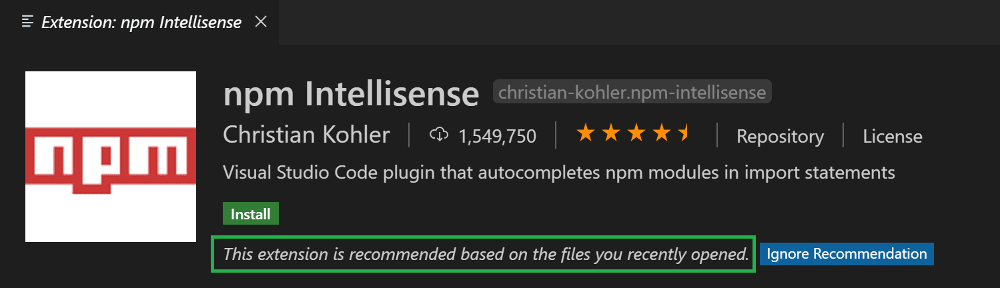

+++
title = "Telemetry"
date = 2024-01-12T22:36:24+08:00
weight = 70
type = "docs"
description = ""
isCJKLanguage = true
draft = false
+++

> 原文: [https://code.visualstudio.com/docs/getstarted/telemetry](https://code.visualstudio.com/docs/getstarted/telemetry)

# Telemetry 遥测


Visual Studio Code collects telemetry data, which is used to help understand how to improve the product. For example, this usage data helps to debug issues, such as slow start-up times, and to prioritize new features. While we appreciate the insights this data provides, we also know that not everyone wants to send usage data and you can disable telemetry as described in [disable telemetry reporting](https://code.visualstudio.com/docs/getstarted/telemetry#_disable-telemetry-reporting). You can also read our [privacy statement](https://go.microsoft.com/fwlink/?LinkID=528096&clcid=0x409) to learn more.

​​	Visual Studio Code 收集遥测数据，用于帮助了解如何改进产品。例如，此使用情况数据有助于调试问题，例如启动时间慢，以及确定新功能的优先级。虽然我们很感谢这些数据提供的见解，但我们也知道并非所有人都想发送使用情况数据，您可以按照禁用遥测报告中的说明禁用遥测。您还可以阅读我们的隐私声明以了解更多信息。

## [Types of telemetry data 遥测数据类型](https://code.visualstudio.com/docs/getstarted/telemetry#_types-of-telemetry-data)

VS Code and this page refer to three different types of data with respect to telemetry.

​​	VS Code 和此页面在遥测方面涉及三种不同类型的数据。

**Crash Reports** - Crash reports collect diagnostic information when VS Code crashes and sends it to Microsoft to help understand why the crash occurred and what changes are needed to prevent the crash in the future.

​​	崩溃报告 - 崩溃报告在 VS Code 崩溃时收集诊断信息，并将其发送给 Microsoft 以帮助了解崩溃发生的原因以及需要进行哪些更改以防止将来发生崩溃。

**Error Telemetry** - Error telemetry collects information about errors that do not crash the application but are unexpected.

​​	错误遥测 - 错误遥测收集有关不会导致应用程序崩溃但意外发生的错误的信息。

**Usage Data** - Usage data collects information about how features are used and perform in VS Code which helps us prioritize future product improvements.

​​	使用情况数据 - 使用情况数据收集有关 VS Code 中功能的使用方式和性能的信息，这有助于我们确定未来产品改进的优先级。

## [Disable telemetry reporting 禁用遥测报告](https://code.visualstudio.com/docs/getstarted/telemetry#_disable-telemetry-reporting)

With the `telemetry.telemetryLevel` user [setting](https://code.visualstudio.com/docs/getstarted/settings), you can control the different types of telemetry we send with a single setting. Here is a table of the different types of data sent with each value of `telemetry.telemetryLevel`:

​​	通过 `telemetry.telemetryLevel` 用户设置，您可以使用单个设置控制我们发送的不同类型的遥测。下表列出了 `telemetry.telemetryLevel` 的每个值发送的不同类型的数据：

|            | Crash Reports 崩溃报告 | Error Telemetry 错误遥测 | Usage Data 使用情况数据 |
| :--------- | :--------------------: | :----------------------: | :---------------------: |
| all        |           ✓            |            ✓             |            ✓            |
| error 错误 |           ✓            |            ✓             |            -            |
| crash 崩溃 |           ✓            |            -             |            -            |
| off        |           -            |            -             |            -            |

For example, if you don't want to send any telemetry data to Microsoft, you can set the `telemetry.telemetryLevel` user [setting](https://code.visualstudio.com/docs/getstarted/settings) to `off`.

​​	例如，如果您不想向 Microsoft 发送任何遥测数据，可以将 `telemetry.telemetryLevel` 用户设置设为 `off` 。

From **File** > **Preferences** > **Settings**, search for `telemetry`, and set the **Telemetry: Telemetry Level** setting to `off`. This will silence all telemetry events from VS Code going forward. Telemetry information may have been collected and sent up until the point when you disable the setting.

​​	从“文件”>“首选项”>“设置”中，搜索 `telemetry` ，并将“遥测：遥测级别”设置设为 `off` 。这将使 VS Code 从此不再发送任何遥测事件。在您禁用该设置之前，遥测信息可能已被收集并发送。



If you use the JSON editor for your settings, add the following line:

​​	如果您对设置使用 JSON 编辑器，请添加以下行：

```
    "telemetry.telemetryLevel": "off"
```

## [Extensions and telemetry 扩展和遥测](https://code.visualstudio.com/docs/getstarted/telemetry#_extensions-and-telemetry)

VS Code lets you add features to the product by installing Microsoft and third-party extensions. These extensions may be collecting their own usage data and are not controlled by the `telemetry.telemetryLevel` setting. Consult the specific extension's documentation to learn about its telemetry reporting and whether it can be disabled.

​​	VS Code 允许您通过安装 Microsoft 和第三方扩展来向产品添加功能。这些扩展可能会收集它们自己的使用数据，并且不受 `telemetry.telemetryLevel` 设置控制。查阅特定扩展的文档以了解其遥测报告以及是否可以禁用它。

Extension authors may refer to the ["For Extension Authors"](https://code.visualstudio.com/docs/getstarted/telemetry#_for-extension-authors) section for guidance on implementing telemetry best practices within their extension.

​​	扩展作者可以参考“适用于扩展作者”部分，以获取有关在其扩展中实施遥测最佳实践的指导。

## [Output channel for telemetry events 遥测事件的输出通道](https://code.visualstudio.com/docs/getstarted/telemetry#_output-channel-for-telemetry-events)

If you'd like to review the telemetry events in VS Code as they are sent, you can enable tracing and it will record telemetry events. Using the **Developer: Set Log Level...** command and select log level **Trace**. To view the logging output, go to the Output panel (Ctrl+Shift+U) and pick **Telemetry** from the dropdown.

​​	如果您想在发送时查看 VS Code 中的遥测事件，可以启用跟踪，它将记录遥测事件。使用“开发人员：设置日志级别...”命令并选择日志级别“跟踪”。若要查看日志记录输出，请转到“输出”面板 (Ctrl+Shift+U) 并从下拉列表中选择“遥测”。



When tracing telemetry events, the events are also logged to a local file `telemetry.log`, which you can view using the **Developer: Open Log File...** command and choosing **Telemetry** from the dropdown.

​​	在跟踪遥测事件时，事件还会记录到本地文件 `telemetry.log` 中，您可以使用“开发人员：打开日志文件...”命令并从下拉列表中选择“遥测”来查看该文件。



## [Viewing all telemetry events 查看所有遥测事件](https://code.visualstudio.com/docs/getstarted/telemetry#_viewing-all-telemetry-events)

If you'd like to view all the possible telemetry events that VS Code could send, you can use the `--telemetry` flag in the CLI. This will generate a JSON report that you can then view within VS Code. These reports are generated per build and do not contain extension telemetry unless the extension author adds a `telemetry.json` file to their root build directory.

​​	如果您想查看 VS Code 可能发送的所有可能的遥测事件，可以在 CLI 中使用 `--telemetry` 标志。这将生成一个 JSON 报告，您可以在 VS Code 中查看该报告。这些报告是按内部版本生成的，不包含扩展遥测，除非扩展作者将 `telemetry.json` 文件添加到其根内部版本目录中。

For example, running `code --telemetry > telemetry.json && code telemetry.json` will create a `telemetry.json` file in your current working directory and then open it in VS Code. You cannot pipe the output like this, `code --telemetry | code -`, due to the length of the telemetry report.

​​	例如，运行 `code --telemetry > telemetry.json && code telemetry.json` 将在您当前的工作目录中创建一个 `telemetry.json` 文件，然后在 VS Code 中将其打开。您无法像这样管道输出， `code --telemetry | code -` ，因为遥测报告很长。

The sections below detail the event metadata used to classify the telemetry, describe its purpose, and indicate any special handling.

​​	以下部分详细介绍了用于对遥测进行分类的事件元数据，描述了其用途，并指出了任何特殊处理。

### [Event classification 事件分类](https://code.visualstudio.com/docs/getstarted/telemetry#_event-classification)

The `classification` field describes the type of data.

​​	 `classification` 字段描述了数据类型。

- `SystemMetaData` - Values generated by VS Code that are not personally identifiable.
- `SystemMetaData` - 由 VS Code 生成的值，这些值不具有个人身份。
- `CallstackOrException` - Errors caused by failures in program execution. These contain stack traces that have been scrubbed of user paths.
- `CallstackOrException` - 由程序执行失败引起的错误。这些错误包含已清除用户路径的堆栈跟踪。
- `PublicNonPersonalData` - User generated data that is available to the public, for example, published extension IDs.
- `PublicNonPersonalData` - 可供公众使用的用户生成数据，例如，已发布的扩展 ID。
- `EndUserPseudonymizedInformation` - Hashes used to identify a unique user without being able to identify who that user is. For example, a hashed Mac Address.
- `EndUserPseudonymizedInformation` - 用于识别唯一用户而无法识别该用户是谁的哈希。例如，哈希的 Mac 地址。

### [Event purpose 事件目的](https://code.visualstudio.com/docs/getstarted/telemetry#_event-purpose)

The `purpose` field describes why the data is collected.

​​	 `purpose` 字段描述收集数据的原因。

- `PerformanceAndHealth` - To ensure that VS Code product and services are healthy and fast.
- `PerformanceAndHealth` - 确保 VS Code 产品和服务健康且快速。
- `FeatureInsight` - To understand feature usage and where to continue development investment.
- `FeatureInsight` - 了解功能使用情况以及继续进行开发投资的位置。
- `BusinessInsight` - To make decisions related to the business of VS Code, Microsoft, and GitHub.
- `BusinessInsight` - 就 VS Code、Microsoft 和 GitHub 的业务做出决策。

### [Event endpoint 事件端点](https://code.visualstudio.com/docs/getstarted/telemetry#_event-endpoint)

The `endpoint` field describes what data handler the data is sent to. This is normally applied to special data that requires additional scrubbing and security to protect user privacy.

​​	 `endpoint` 字段描述将数据发送到的数据处理程序。这通常应用于需要额外清理和安全保护以保护用户隐私的特殊数据。

- `GoogleAnalyticsId` - Used on our website for Google Analytics and tracking page views. These are handled in a more sensitive manner than our normal data.
- `GoogleAnalyticsId` - 在我们的网站上用于 Google Analytics 和跟踪页面浏览量。这些数据的处理方式比我们的正常数据更敏感。
- `MacAddressHash` - Used to identify a user of VS Code. This is hashed once on the client side and then hashed again on the pipeline side to make it impossible to identify a given user. On [VS Code for the Web](https://code.visualstudio.com/docs/editor/vscode-web), a UUID is generated for this case.
- `MacAddressHash` - 用于识别 VS Code 的用户。这在客户端哈希一次，然后在管道端再次哈希，以使无法识别给定用户。在 VS Code for the Web 上，为此案例生成 UUID。
- `none` - Data does not require any special handling.
- `none` - 数据不需要任何特殊处理。

## [GDPR and VS Code GDPR 和 VS Code](https://code.visualstudio.com/docs/getstarted/telemetry#_gdpr-and-vs-code)

In addition to supporting the General Data Protection Regulation (GDPR), the VS Code team takes privacy very seriously. That's both for Microsoft as a company and specifically within the VS Code team.

​​	除了支持《通用数据保护条例》(GDPR) 外，VS Code 团队非常重视隐私。这既适用于微软公司，也适用于 VS Code 团队本身。

To ensure GDPR compliance, we made several updates to VS Code, these include:

​​	为了确保符合 GDPR，我们对 VS Code 做了多项更新，其中包括：

- Making it easier to opt out of telemetry collection by placing a notification in product for all existing and new users.
- 通过在产品中为所有现有和新用户放置通知，使其更轻松地选择退出遥测收集。
- Reviewing and classifying the telemetry that we send (documented in [our OSS codebase](https://github.com/microsoft/vscode/pull/34997)).
- 查看和分类我们发送的遥测（记录在我们的 OSS 代码库中）。
- Ensuring that we have valid data retention policies in place for any data we do collect, for example crash dumps.
- 确保我们对收集的任何数据（例如崩溃转储）都有有效的数据保留政策。

In short, we have worked hard to do the right thing, for all users, as these practices apply to all geographies, not just Europe.

​​	简而言之，我们一直努力为所有用户做正确的事情，因为这些做法适用于所有地区，而不仅仅是欧洲。

One question we expect people to ask is to see the data we collect. However, we don't have a reliable way to do this as VS Code does not have a 'sign-in' experience that would uniquely identify a user. We do send information that helps us approximate a single user for diagnostic purposes (this is based on a hash of the network adapter NIC on the desktop and a randomly assigned UUID on the web) but this is not guaranteed to be unique. For example, virtual machines (VMs) often rotate NIC IDs or allocate from a pool. This technique is sufficient to help us when working through problems, but it is not reliable enough for us to 'provide your data'.

​​	我们预计人们会问的一个问题是查看我们收集的数据。但是，我们没有可靠的方法来做到这一点，因为 VS Code 没有“登录”体验，无法唯一标识用户。我们确实会发送有助于我们估算单个用户的信息以进行诊断目的（这基于桌面上网络适配器 NIC 的哈希和 Web 上随机分配的 UUID），但这并不能保证是唯一的。例如，虚拟机 (VM) 通常会轮换 NIC ID 或从池中分配。这种技术足以帮助我们在解决问题时提供帮助，但对于我们“提供您的数据”来说还不够可靠。

We expect our approach to evolve as we learn more about GDPR and the expectations of our users. We greatly appreciate the data users do send to us, as it is very valuable and VS Code is a better product for everyone because of it. And again, if you are worried about privacy, we offer the ability to disable sending telemetry as described in [disable telemetry reporting](https://code.visualstudio.com/docs/getstarted/telemetry#_disable-telemetry-reporting).

​​	我们预计随着我们更多地了解 GDPR 和我们用户的期望，我们的方法会不断发展。我们非常感谢用户发送给我们的数据，因为这些数据非常有价值，VS Code 也因此成为了一款对每个人都更好的产品。而且，如果您担心隐私问题，我们提供了禁用遥测功能的方法，如禁用遥测报告中所述。

You can find more information about how the Visual Studio family approaches GDPR at [Visual Studio Family Data Subject Requests for the GDPR](https://learn.microsoft.com/compliance/regulatory/gdpr-dsr-visual-studio-family).

​​	您可以在 Visual Studio 系列数据主体请求 GDPR 中找到有关 Visual Studio 系列如何处理 GDPR 的更多信息。

## [Managing online services 管理在线服务](https://code.visualstudio.com/docs/getstarted/telemetry#_managing-online-services)

Beyond crash reporting and telemetry, VS Code uses online services for various other purposes such as downloading product updates, finding, installing, and updating extensions, Settings Sync, or providing Natural Language Search within the Settings editor. You can choose to turn on/off features that use these services.

​​	除了崩溃报告和遥测之外，VS Code 还将在线服务用于各种其他目的，例如下载产品更新、查找、安装和更新扩展、设置同步或在设置编辑器中提供自然语言搜索。您可以选择启用/禁用使用这些服务的各项功能。

Please note, that turning off these features does not put VS Code into offline mode. For example, if you search for extensions in the **Extensions** view, VS Code still searches the online VS Code Marketplace. The settings ensure that VS Code does not talk to online services without you requesting it.

​​	请注意，禁用这些功能不会使 VS Code 进入脱机模式。例如，如果您在“扩展”视图中搜索扩展，VS Code 仍会搜索联机 VS Code 市场。这些设置可确保 VS Code 不会在您请求时与在线服务通信。

From **File** > **Preferences** > **Settings**, and type the tag `@tag:usesOnlineServices`. This will display all settings that control the usage of online services and you can individually switch them on or off.

​​	从“文件”>“首选项”>“设置”中，键入标记 `@tag:usesOnlineServices` 。这将显示控制在线服务使用情况的所有设置，您可以单独将其打开或关闭。


> **Note**: VS Code extensions may also use online services and may not provide settings to configure the usage of these online services, or they may not register their settings to show up when searching for `@tag:usesOnlineServices`. Consult the specific extension's documentation to learn about its usage of online services.
>
> ​​	注意：VS Code 扩展也可能使用在线服务，并且可能不提供用于配置这些在线服务使用情况的设置，或者可能不会在搜索 `@tag:usesOnlineServices` 时注册其设置以显示。查阅特定扩展的文档以了解其对在线服务的使用情况。

### [Non-Microsoft online services used by VS Code VS Code 使用的非 Microsoft 在线服务](https://code.visualstudio.com/docs/getstarted/telemetry#_nonmicrosoft-online-services-used-by-vs-code)

The built-in **npm support for VS Code** extension sends requests to `https://registry.npmjs.org` and `https://registry.bower.io`.

​​	VS Code 扩展的内置 npm 支持向 `https://registry.npmjs.org` 和 `https://registry.bower.io` 发送请求。

The built-in **TypeScript and JavaScript Language Features** extension queries the `@types` domain at `https://registry.npmjs.org`.

​​	内置 TypeScript 和 JavaScript 语言功能扩展在 `https://registry.npmjs.org` 查询 `@types` 域。

When you use **Developer: Toggle Developer Tools** or **Developer: Open Webview Developer Tools**, VS Code may talk to Google servers to fetch data needed to launch Developer Tools.

​​	当您使用“开发人员：切换开发人员工具”或“开发人员：打开 Webview 开发人员工具”时，VS Code 可能会与 Google 服务器通信以获取启动开发人员工具所需的数据。

## [Extension recommendations 扩展建议](https://code.visualstudio.com/docs/getstarted/telemetry#_extension-recommendations)

VS Code provides extension recommendations based on your file types, your workspace, and your environment. File type recommendations are either precomputed or dynamic. Workspace and environment recommendations are always precomputed.

​​	VS Code 会根据您的文件类型、工作区和环境提供扩展建议。文件类型建议是预先计算的或动态的。工作区和环境建议始终是预先计算的。

If you want to know why an extension is being recommended, open the extension's detail page. You can find the recommendation reason in the page header.

​​	如果您想知道为什么推荐某个扩展，请打开该扩展的详细信息页面。您可以在页面标题中找到推荐原因。



### [Precomputed recommendations 预先计算的建议](https://code.visualstudio.com/docs/getstarted/telemetry#_precomputed-recommendations)

VS Code collects telemetry about which extensions are being activated for what file types and what workspaces/folders. Specific folders are identified by computing a hash of each of the folder's Git remotes.

​​	VS Code 会收集有关为哪些文件类型和哪些工作区/文件夹激活了哪些扩展的遥测数据。通过计算每个文件夹的 Git 远程的哈希来识别特定文件夹。

We use this information to precompute anonymous recommendations. Precomputed recommendations are instructions that spell out under which conditions an extension should be recommended. For example, when we see an interesting correlation between two extensions A and B, one instruction might be: Recommend extension B if the user has installed extension A but not B.

​​	我们使用此信息来预先计算匿名建议。预先计算的建议是说明在何种条件下应推荐扩展的说明。例如，当我们看到两个扩展 A 和 B 之间存在有趣的相关性时，一条说明可能是：如果用户已安装扩展 A 但未安装扩展 B，则推荐扩展 B。

Some precomputed recommendations are shipped as part of the product while additional precomputed recommendations are fetched at runtime from an online Microsoft service. VS Code independently evaluates and executes precomputed recommendations without sending any user information to any online service.

​​	一些预先计算的建议作为产品的一部分提供，而其他预先计算的建议则在运行时从在线 Microsoft 服务中获取。VS Code 独立评估和执行预先计算的建议，而不会将任何用户信息发送到任何在线服务。

### [Dynamic recommendations 动态建议](https://code.visualstudio.com/docs/getstarted/telemetry#_dynamic-recommendations)

When you open a file type for which VS Code does not have any precomputed recommendation, it asks the Extension Marketplace for extensions that declare that they support this file type. If the query returns extensions you don't have installed, VS Code will provide a notification.

​​	当您打开 VS Code 没有任何预先计算建议的文件类型时，它会向扩展市场询问声明支持此文件类型的扩展。如果查询返回您尚未安装的扩展，VS Code 将提供通知。

## [For extension authors 对于扩展作者](https://code.visualstudio.com/docs/getstarted/telemetry#_for-extension-authors)

Please read the [extension guides telemetry document](https://code.visualstudio.com/api/extension-guides/telemetry).

​​	请阅读扩展指南遥测文档。

## [Next steps 后续步骤](https://code.visualstudio.com/docs/getstarted/telemetry#_next-steps)

- [Visual Studio Code FAQ](https://code.visualstudio.com/docs/supporting/faq) - Consult the Frequently Asked Questions to learn more.
  Visual Studio Code 常见问题解答 - 查阅常见问题解答以了解更多信息。
- [User and Workspace Settings](https://code.visualstudio.com/docs/getstarted/settings) - Read about available options to customize VS Code.
  用户和工作区设置 - 阅读有关自定义 VS Code 的可用选项。
- [Key Bindings](https://code.visualstudio.com/docs/getstarted/keybindings) - You can easily modify commonly used keyboard shortcuts.
  键绑定 - 您可以轻松修改常用的键盘快捷键。
