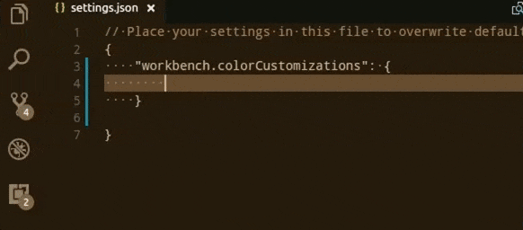

+++
title = "Themes"
date = 2024-01-12T22:36:24+08:00
weight = 30
type = "docs"
description = ""
isCJKLanguage = true
draft = false
+++

> 原文: [https://code.visualstudio.com/docs/getstarted/themes](https://code.visualstudio.com/docs/getstarted/themes)

# Color Themes 配色方案


Color themes let you modify the colors in Visual Studio Code's user interface to suit your preferences and work environment.

​​	颜色主题允许您修改 Visual Studio Code 用户界面中的颜色，以适应您的偏好和工作环境。


## [Selecting the Color Theme 选择颜色主题]()

1. In VS Code, open the Color Theme picker with **File** > **Preferences** > **Theme** > **Color Theme**.
   在 VS Code 中，使用“文件”>“首选项”>“主题”>“颜色主题”打开“颜色主题”选取器。
2. You can also use the keyboard shortcut Ctrl+K Ctrl+T to display the picker.
   您还可以使用键盘快捷键 Ctrl+K Ctrl+T 显示选取器。
3. Use the cursor keys to preview the colors of the theme.
   使用光标键预览主题的颜色。
4. Select the theme you want and press Enter.
   选择所需的主题，然后按 Enter。


The active color theme is stored in your user [settings]() (keyboard shortcut Ctrl+,).

​​	活动颜色主题存储在您的用户设置中（键盘快捷键 Ctrl+,）。

```
  // Specifies the color theme used in the workbench.
  "workbench.colorTheme": "Solarized Dark"
```

> **Tip:** By default, the theme is stored in your user settings and applies globally to all workspaces. You can also configure a workspace specific theme. To do so, set a theme in the Workspace [settings]().
>
> ​​	提示：默认情况下，主题存储在您的用户设置中，并全局应用于所有工作区。您还可以配置特定于工作区主题。为此，请在“工作区”设置中设置主题。

## [Color Themes from the Marketplace 来自 Marketplace 的颜色主题]()

There are several out-of-the-box color themes in VS Code for you to try.

​​	VS Code 中有几个开箱即用的颜色主题供您尝试。

Many more themes have been uploaded to the VS Code [Extension Marketplace]() by the community. If you find one you want to use, install it and restart VS Code and the new theme will be available.

​​	社区已将更多主题上传到 VS Code 扩展市场。如果您找到想要使用的主题，请安装它并重新启动 VS Code，新主题即可用。

You can search for themes in the Extensions view (Ctrl+Shift+X) search box using the `@category:"themes"` filter.

​​	您可以在扩展视图 (Ctrl+Shift+X) 搜索框中使用 `@category:"themes"` 筛选器搜索主题。


## [Auto switch based on OS color scheme 根据操作系统配色方案自动切换]()

Windows and macOS support light and dark color schemes. There is a setting, `window.autoDetectColorScheme`, that instructs VS Code to listen to changes to the OS's color scheme and switch to a matching theme accordingly.

​​	Windows 和 macOS 支持浅色和深色配色方案。有一个设置 `window.autoDetectColorScheme` ，指示 VS Code 侦听操作系统配色方案的更改，并相应地切换到匹配的主题。

To customize the themes that are used when a color scheme changes, you can set the preferred light, dark, and high contrast themes in the Settings editor:

​​	若要自定义在配色方案更改时使用的主题，您可以在设置编辑器中设置首选浅色、深色和高对比度主题：

- **Workbench: Preferred Dark Color Theme** - defaults to "Dark Modern"
  工作台：首选深色配色方案 - 默认值为“深色现代”
- **Workbench: Preferred Light Color Theme** - defaults to "Light Modern"
  工作台：首选浅色配色方案 - 默认值为“浅色现代”
- **Workbench: Preferred High Contrast Color Theme** - defaults to "Dark High Contrast"
  工作台：首选高对比度配色方案 - 默认值为“深色高对比度”
- **Workbench: Preferred High Contrast Light Color Theme** - defaults to "Light High Contrast"
  工作台：首选高对比度浅色配色方案 - 默认值为“浅色高对比度”


## [Customizing a Color Theme 自定义配色方案]()

### [Workbench colors 工作台颜色]()

You can customize your active color theme with the `workbench.colorCustomizations` and `editor.tokenColorCustomizations` user [settings]().

​​	您可以使用 `workbench.colorCustomizations` 和 `editor.tokenColorCustomizations` 用户设置自定义活动颜色主题。

To set the colors of VS Code UI elements such as list & trees (File Explorer, suggestions widget), diff editor, Activity Bar, notifications, scroll bar, split view, buttons, and more, use `workbench.colorCustomizations`.

​​	若要设置 VS Code UI 元素（如列表和树（文件资源管理器、建议小组件）、差异编辑器、活动栏、通知、滚动条、拆分视图、按钮等）的颜色，请使用 `workbench.colorCustomizations` 。



You can use IntelliSense while setting `workbench.colorCustomizations` values or, for a list of all customizable colors, see the [Theme Color Reference](https://code.visualstudio.com/api/references/theme-color).

​​	设置 `workbench.colorCustomizations` 值时，可以使用 IntelliSense，或者，有关所有可自定义颜色的列表，请参阅主题颜色参考。

To customize a specific theme only, use the following syntax:

​​	若要仅自定义特定主题，请使用以下语法：

```
"workbench.colorCustomizations": {
    "[Monokai]": {
        "sideBar.background": "#347890"
    }
}
```

If a customization applies to more than one themes, you can name multiple themes or use `*` as wildcard at the beginning and the end of the name:

​​	如果自定义适用于多个主题，则可以命名多个主题或在名称的开头和结尾使用 `*` 作为通配符：

```
"workbench.colorCustomizations": {
    "[Abyss][Red]": {
        "activityBar.background": "#ff0000"
    },
    "[Monokai*]": {
        "activityBar.background": "#ff0000"
    }
}
```

### [Editor syntax highlighting 编辑器语法突出显示]()

To tune the editor's syntax highlighting colors, use `editor.tokenColorCustomizations` in your user [settings]() `settings.json` file:

​​	若要调整编辑器的语法突出显示颜色，请在用户设置 `settings.json` 文件中使用 `editor.tokenColorCustomizations` ：


A pre-configured set of syntax tokens ('comments', 'strings', ...) is available for the most common constructs. If you want more, you can do so by directly specifying TextMate theme color rules:

​​	预先配置的一组语法标记（“注释”、“字符串”等）可用于最常见的构造。如果您需要更多，可以通过直接指定 TextMate 主题颜色规则来实现：


> **Note**: Directly configuring TextMate rules is an advanced skill as you need to understand on how TextMate grammars work. Go to the [Color Theme guide](https://code.visualstudio.com/api/extension-guides/color-theme) for more information.
>
> ​​	注意：直接配置 TextMate 规则是一项高级技能，因为您需要了解 TextMate 语法的工作原理。有关详细信息，请转到颜色主题指南。

Again, to customize specific themes, you can do this in one of the following ways:

​​	再次，要自定义特定主题，您可以通过以下方式之一进行：

```
"editor.tokenColorCustomizations": {
    "[Monokai]": {
        "comments": "#229977"
    },
    "[*Dark*]": {
        "variables": "#229977"
    },
    "[Abyss][Red]": {
        "keywords": "#f00"
    }
}
```

### [Editor semantic highlighting 编辑器语义突出显示]()

Some languages (currently: TypeScript, JavaScript, Java) provide semantic tokens. Semantic tokens are based on the language service's symbol understanding and are more accurate than the syntax tokens coming from the TextMate grammars that are driven by regular expressions. The semantic highlighting that is computed from the semantic tokens goes on top of syntax highlighting and can correct and enrich the highlighting as seen in the following example:

​​	某些语言（当前：TypeScript、JavaScript、Java）提供语义标记。语义标记基于语言服务的符号理解，并且比由正则表达式驱动的 TextMate 语法的语法标记更准确。从语义标记计算出的语义突出显示位于语法突出显示之上，并且可以更正和丰富突出显示，如下例所示：

The "Tomorrow Night Blue" color theme without semantic highlighting:

​​	“Tomorrow Night Blue”配色主题，无语义突出显示：


The "Tomorrow Night Blue" color theme with semantic highlighting:

​​	“Tomorrow Night Blue”配色主题，带语义突出显示：


Notice the color differences based on language service symbol understanding:

​​	注意基于语言服务符号理解的颜色差异：

- line 10: `languageModes` is colored as a parameter.
  第 10 行： `languageModes` 被着色为参数。
- line 11: `Range` and `Position` are colored as classes and `document` as a parameter.
  第 11 行： `Range` 和 `Position` 被着色为类， `document` 被着色为参数。
- line 13: `getFoldingRanges` is colored as a function.
  第 13 行： `getFoldingRanges` 被着色为函数。

The settings `editor.semanticHighlighting.enabled` serves as the main control on whether semantic highlighting is applied. It can have values `true`, `false`, and `configuredByTheme`.

​​	设置 `editor.semanticHighlighting.enabled` 用作是否应用语义突出显示的主要控件。它可以具有值 `true` 、 `false` 和 `configuredByTheme` 。

- `true` and `false` turn semantic highlighting on or off for all themes.
  `true` 和 `false` 为所有主题启用或禁用语义突出显示。
- `configuredByTheme` is the default and lets each theme control whether semantic highlighting is enabled or not. All the themes that ship with VS Code (for example, the "Dark+" default) have semantic highlighting enabled by default.
  `configuredByTheme` 是默认设置，允许每个主题控制是否启用语义突出显示。所有随 VS Code 一起提供的主题（例如，“Dark+”默认主题）默认启用语义突出显示。

Users can override the theme setting by:

​​	用户可以通过以下方式覆盖主题设置：

```
"editor.semanticTokenColorCustomizations": {
    "[Rouge]": {
        "enabled": true
    }
}
```

When semantic highlighting is enabled and available for a language, it is up to the theme to configure whether and how semantic tokens are colored. Some semantic tokens are standardized and map to well-established TextMate scopes. If the theme has a coloring rule for these TextMate scopes, the semantic token will be rendered with that color, without the need for any additional coloring rules.

​​	当语义突出显示已启用并可用于某种语言时，由主题配置是否以及如何对语义标记着色。某些语义标记是标准化的，并映射到完善的 TextMate 范围。如果主题对这些 TextMate 范围具有着色规则，则语义标记将使用该颜色呈现，而无需任何其他着色规则。

Additional styling rules can be configured by the user in `editor.semanticTokenColorCustomizations"`:

​​	用户可以在 `editor.semanticTokenColorCustomizations"` 中配置其他样式规则：

```
"editor.semanticTokenColorCustomizations": {
    "[Rouge]": {
        "enabled": true,
        "rules": {
            "*.declaration": { "bold": true }
        }
    }
}
```

To see what semantic tokens are computed and how they are styled, users can use the scope inspector (**Developer: Inspect Editor Tokens and Scopes**), which displays information for the text at the current cursor position.

​​	为了查看计算了哪些语义标记以及如何设置其样式，用户可以使用范围检查器（开发人员：检查编辑器标记和范围），它会显示当前光标位置的文本信息。


If semantic tokens are available for the language at the given position and enabled by theme, the inspect tool shows a section `semantic token type`. The section shows the semantic token information (type and any number of modifiers) as well as the styling rules that apply.

​​	如果语义标记对给定位置的语言可用且由主题启用，则检查工具会显示一个部分 `semantic token type` 。该部分显示语义标记信息（类型和任意数量的修饰符）以及适用的样式规则。

More information on semantic tokens and styling rule syntax can be found in the [Semantic Highlighting Guide](https://code.visualstudio.com/api/language-extensions/semantic-highlight-guide).

​​	有关语义标记和样式规则语法的更多信息，请参阅语义突出显示指南。

## [Creating your own Color Theme 创建您自己的配色方案]()

Creating and publishing a theme extension is easy. Customize your colors in your user settings then generate a theme definition file with the **Developer: Generate Color Theme From Current Settings** command.

​​	创建和发布主题扩展非常简单。在用户设置中自定义颜色，然后使用“开发人员：从当前设置生成颜色主题”命令生成主题定义文件。

VS Code's Yeoman [extension generator](https://code.visualstudio.com/api/get-started/your-first-extension) will help you generate the rest of the extension.

​​	VS Code 的 Yeoman 扩展生成器将帮助您生成扩展的其余部分。

See the [Create a new Color Theme](https://code.visualstudio.com/api/extension-guides/color-theme#_create-a-new-color-theme) topic in our Extension API section to learn more.

​​	请参阅扩展 API 部分中的“创建新颜色主题”主题以了解更多信息。

## [Remove default Color Themes 删除默认配色方案]()

If you'd like to remove some of the default themes shipped with VS Code from the Color Theme picker, you can disable them from the Extensions view (Ctrl+Shift+X). Click the **Filter Extensions** button from the top of the Extensions view, select the **Built-in** option, and you'll see a **THEMES** section listing the default themes.

​​	如果您想从颜色主题选择器中删除 VS Code 附带的一些默认主题，可以从扩展视图 (Ctrl+Shift+X) 中禁用它们。单击扩展视图顶部的“筛选扩展”按钮，选择“内置”选项，您将看到列出默认主题的“主题”部分。


You can disable a built-in theme extension as you would any other VS Code [extension]() with the **Disable** command on the gear context menu.

​​	您可以使用齿轮上下文菜单上的“禁用”命令禁用内置主题扩展，就像禁用任何其他 VS Code 扩展一样。


## [File Icon Themes 文件图标主题]()

File icon themes can be contributed by extensions and selected by users as their favorite set of file icons. File icons are shown in the File Explorer and tabbed headings.

​​	文件图标主题可以由扩展提供，并由用户选择作为他们最喜欢的一组文件图标。文件图标显示在文件资源管理器和选项卡标题中。

### [Selecting the File Icon Theme 选择文件图标主题]()

1. In VS Code, open the File Icon Theme picker with **File** > **Preferences** > **Theme** > **File Icon Theme**.
   在 VS Code 中，通过文件 > 首选项 > 主题 > 文件图标主题打开文件图标主题选择器。
2. You can also use the **Preferences: File Icon Theme** command from the **Command Palette** (Ctrl+Shift+P).
   您还可以从命令面板 (Ctrl+Shift+P) 中使用“首选项：文件图标主题”命令。
3. Use the cursor keys to preview the icons of the theme.
   使用光标键预览主题的图标。
4. Select the theme you want and hit Enter.
   选择所需的主题并按 Enter。


By default, the **Seti** file icon set is used and those are the icons you see in the File Explorer. Once a file icon theme is selected, the selected theme will be remembered and appear again whenever VS Code is restarted. You can disable file icons by selecting **None**.

​​	默认情况下，使用 Seti 文件图标集，这些图标是您在文件资源管理器中看到的图标。选择文件图标主题后，所选主题将被记住，并在每次重新启动 VS Code 时再次出现。您可以通过选择“无”来禁用文件图标。

VS code ships with two file icon themes; **Minimal** and **Seti**. To install more file icon themes, select the **Install Additional File Icon Themes** item in the file icon theme picker and you'll see a query for file icon themes (tag:icon-theme) in the Extensions view.

​​	VS Code 附带两个文件图标主题：Minimal 和 Seti。要安装更多文件图标主题，请在文件图标主题选择器中选择“安装其他文件图标主题”项，您将在“扩展”视图中看到文件图标主题的查询 (标签：icon-theme)。

You can also browse the [VS Code Marketplace](https://marketplace.visualstudio.com/vscode/Themes) site directly to find available themes.

​​	您还可以直接浏览 VS Code Marketplace 网站以查找可用主题。

The active File Icon theme is persisted in your user [settings]() (keyboard shortcut Ctrl+,).

​​	活动的文件图标主题保存在您的用户设置中（键盘快捷键 Ctrl+,）。

```
  // Specifies the file icon theme used in the workbench.
  "workbench.iconTheme": "vs-seti"
```

## [Creating your own File Icon Theme 创建您自己的文件图标主题]()

You can create your own File Icon Theme from icons (preferably SVG), see the [File Icon Theme](https://code.visualstudio.com/api/extension-guides/file-icon-theme) topic in our Extension API section for details.

​​	您可以使用图标（最好是 SVG）创建自己的文件图标主题，有关详细信息，请参阅扩展 API 部分中的文件图标主题主题。

## [VS Code for the Web]()

VS Code for the Web provides a free, zero-install VS Code experience running entirely in your browser at [https://vscode.dev](https://vscode.dev/).

​​	VS Code for the Web 提供免费的零安装 VS Code 体验，完全在您的浏览器中运行，网址为 https://vscode.dev。

You can share and experience color themes through VS Code for the Web through the URL schema: `https://vscode.dev/editor/theme/<extensionId>`.

​​	您可以通过 URL 架构在 VS Code for the Web 中共享和体验颜色主题： `https://vscode.dev/editor/theme/<extensionId>` 。

For instance, you can go to https://vscode.dev/editor/theme/sdras.night-owl to experience the [Night Owl theme](https://marketplace.visualstudio.com/items?itemName=sdras.night-owl) without having to go through the download and install process.

​​	例如，您可以访问 https://vscode.dev/editor/theme/sdras.night-owl 来体验 Night Owl 主题，而无需经历下载和安装过程。

You can learn more about previewing and sharing themes with VS Code for the Web in its [documentation]().

​​	您可以在其文档中了解有关在 VS Code for the Web 中预览和共享主题的更多信息。

## [Next steps 后续步骤]()

Themes are just one way to customize VS Code. If you'd like to learn more about VS Code customization and extensibility, try these topics:

​​	主题只是自定义 VS Code 的一种方式。如果您想了解有关 VS Code 自定义和可扩展性的更多信息，请尝试以下主题：

- [Settings]() - Learn how to configure VS Code to your preferences through user and workspace settings.
  设置 - 了解如何通过用户和工作区设置将 VS Code 配置为您的首选项。
- [Snippets]() - Add additional snippets to your favorite language.
  代码片段 - 向您喜欢的语言添加其他代码片段。
- [Extension API](https://code.visualstudio.com/api) - Learn about other ways to extend VS Code.
  扩展 API - 了解扩展 VS Code 的其他方法。
- [Color Theme](https://code.visualstudio.com/api/extension-guides/color-theme) - Color Theme extension API.
  颜色主题 - 颜色主题扩展 API。
- [File Icon Theme](https://code.visualstudio.com/api/extension-guides/file-icon-theme) - File Icon Theme extension API.
  文件图标主题 - 文件图标主题扩展 API。
