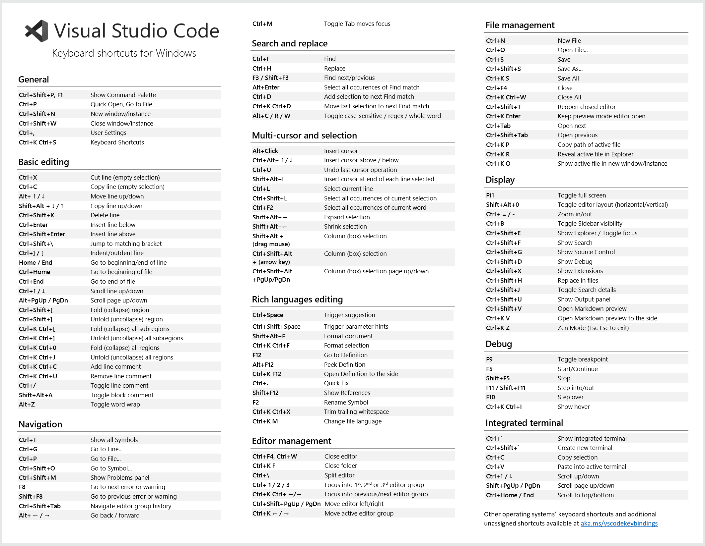
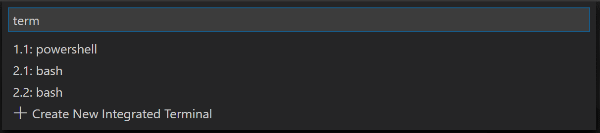
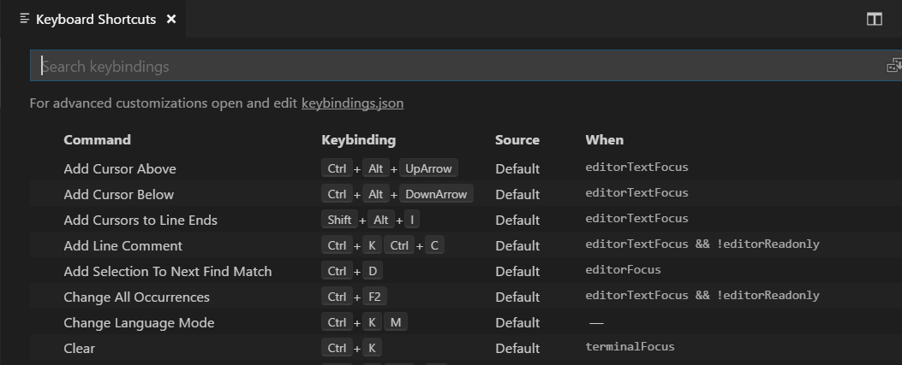
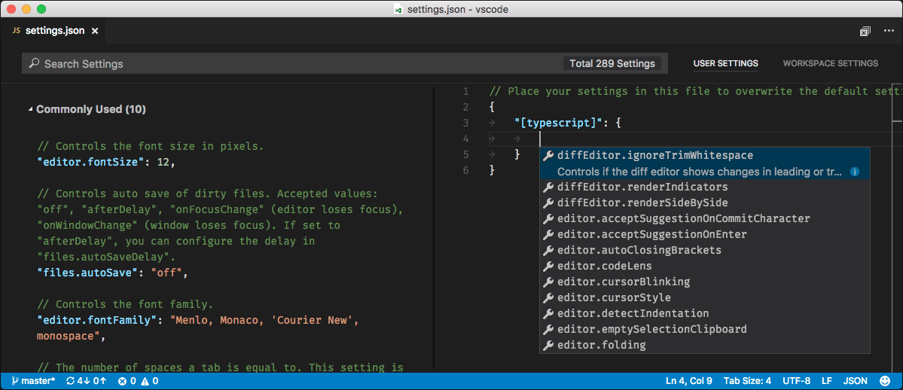
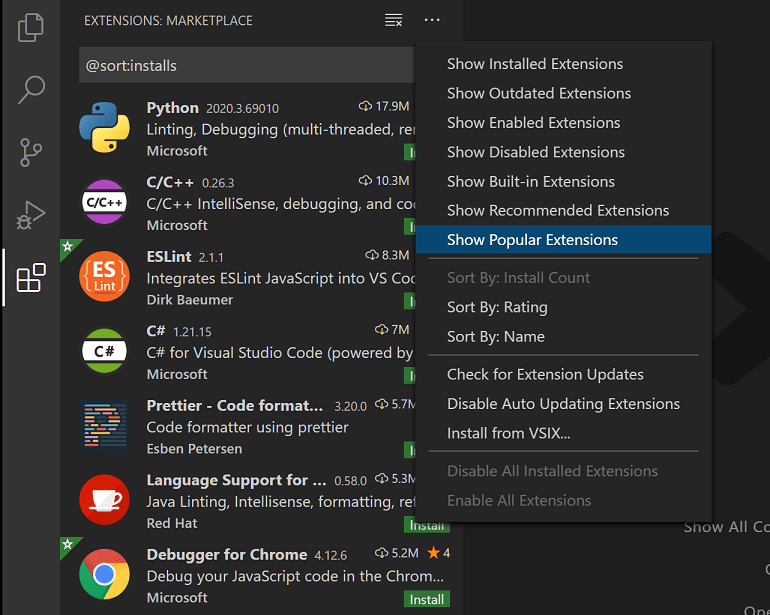
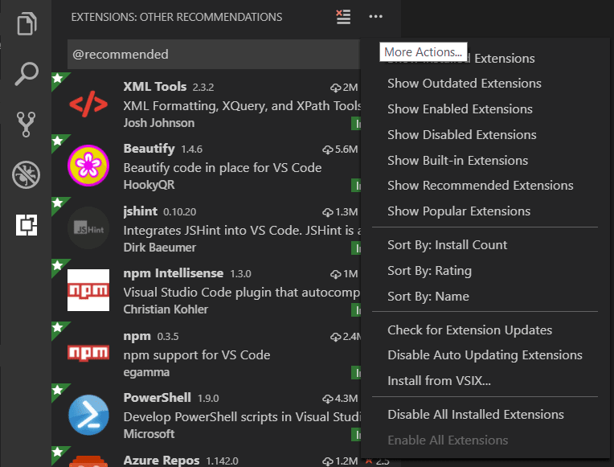
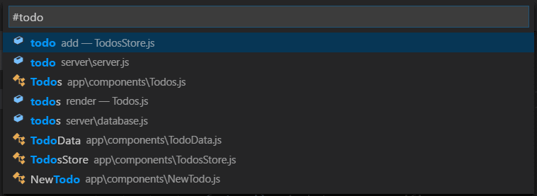
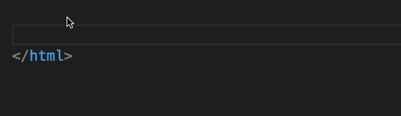
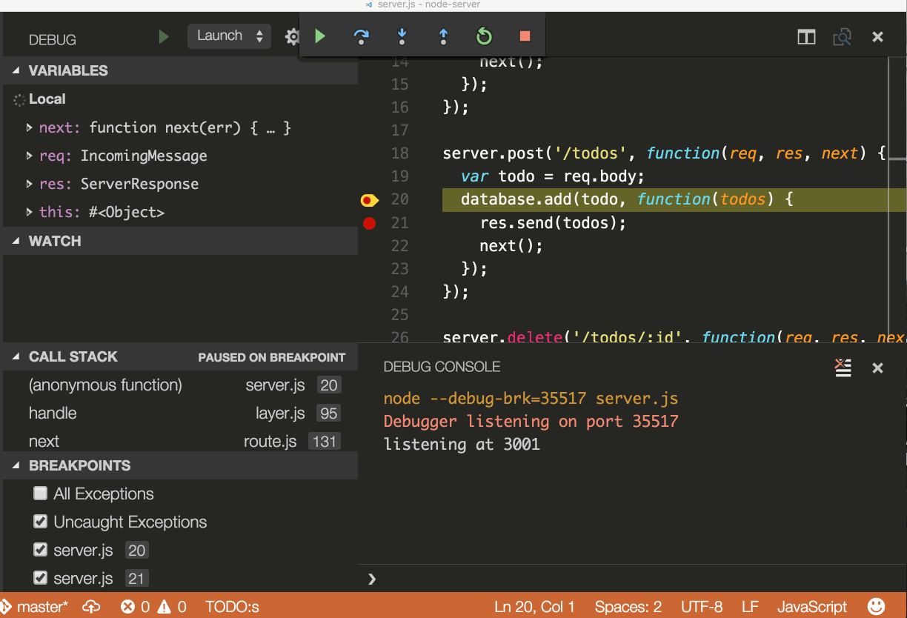

+++
title = "Tips and Tricks"
date = 2024-01-12T22:36:24+08:00
weight = 10
type = "docs"
description = ""
isCJKLanguage = true
draft = false
+++

> 原文: [https://code.visualstudio.com/docs/getstarted/tips-and-tricks](https://code.visualstudio.com/docs/getstarted/tips-and-tricks)

# Visual Studio Code Tips and Tricks Visual Studio Code 技巧和窍门


"Tips and Tricks" lets you jump right in and learn how to be productive with Visual Studio Code. You'll become familiar with its powerful editing, code intelligence, and source code control features and learn useful keyboard shortcuts. This topic goes pretty fast and provides a broad overview, so be sure to look at the other in-depth topics in [Getting Started](https://code.visualstudio.com/docs/getstarted/userinterface) and the [User Guide](https://code.visualstudio.com/docs/editor/codebasics) to learn more.

​​	“提示和技巧”可让您直接上手并学习如何高效使用 Visual Studio Code。您将熟悉其强大的编辑、代码智能和源代码控制功能，并学习有用的键盘快捷键。本主题进行得很快，并提供了广泛的概述，因此务必查看入门和用户指南中的其他深入主题以了解更多信息。

> If you don't have Visual Studio Code installed, go to the [Download](https://code.visualstudio.com/download) page. You can find platform specific setup instructions at [Running VS Code on Linux](https://code.visualstudio.com/docs/setup/linux), [macOS](https://code.visualstudio.com/docs/setup/mac), and [Windows](https://code.visualstudio.com/docs/setup/windows).
>
> ​​	如果您尚未安装 Visual Studio Code，请转到下载页面。您可以在 Linux、macOS 和 Windows 上运行 VS Code 中找到特定于平台的安装说明。

Prefer a video? You can watch a recent Microsoft Build talk [Visual Studio Code tips and tricks](https://aka.ms/Build2020AppDev-VSCodeTips), which describes 20 tips and tricks for working productively with VS Code.

​​	喜欢视频吗？您可以观看最近的 Microsoft Build 演讲 Visual Studio Code 提示和技巧，其中介绍了 20 个使用 VS Code 高效工作的提示和技巧。

## [Basics 基础知识](https://code.visualstudio.com/docs/getstarted/tips-and-tricks#_basics)

### [Getting started 入门](https://code.visualstudio.com/docs/getstarted/tips-and-tricks#_getting-started)

The best way of exploring VS Code hands-on is to open the **Welcome** page. You will get an overview of VS Code's customizations and features. **Help** > **Welcome**.

​​	探索 VS Code 的最佳方法是打开欢迎页。您将获得 VS Code 的自定义项和功能的概述。帮助 > 欢迎。


Pick a **Walkthrough** for a self-guided tour through the setup steps, features, and deeper customizations that VS Code offers. As you discover and learn, the walkthroughs track your progress.

​​	选择演练以自导游览 VS Code 提供的设置步骤、功能和更深入的自定义项。随着您的发现和学习，演练将跟踪您的进度。

If you are looking to improve your code editing skills open the **Interactive Editor Playground**. Try out VS Code's [code editing features](https://code.visualstudio.com/docs/editor/codebasics), like multi-cursor editing, [IntelliSense](https://code.visualstudio.com/docs/editor/intellisense), Snippets, [Emmet](https://code.visualstudio.com/docs/editor/emmet), and many more. **Help** > **Editor Playground**.

​​	如果您想提高代码编辑技能，请打开交互式编辑器游乐场。试用 VS Code 的代码编辑功能，如多光标编辑、IntelliSense、代码片段、Emmet 等。帮助 > 编辑器游乐场。


### [Command Palette 命令面板](https://code.visualstudio.com/docs/getstarted/tips-and-tricks#_command-palette)

Access all available commands based on your current context.

​​	根据当前上下文访问所有可用命令。

Keyboard Shortcut: Ctrl+Shift+P

​​	键盘快捷键：Ctrl+Shift+P


### [Default keyboard shortcuts 默认键盘快捷键](https://code.visualstudio.com/docs/getstarted/tips-and-tricks#_default-keyboard-shortcuts)

All of the commands are in the **Command Palette** with the associated key binding (if it exists). If you forget a keyboard shortcut, use the **Command Palette** to help you out.

​​	所有命令都在命令面板中，并带有关联的键绑定（如果存在）。如果您忘记了键盘快捷键，请使用命令面板来帮助您。


### [Keyboard reference sheets 键盘参考表](https://code.visualstudio.com/docs/getstarted/tips-and-tricks#_keyboard-reference-sheets)

Download the keyboard shortcut reference sheet for your platform ([macOS](https://go.microsoft.com/fwlink/?linkid=832143), [Windows](https://go.microsoft.com/fwlink/?linkid=832145), [Linux](https://go.microsoft.com/fwlink/?linkid=832144)).

​​	下载适用于您平台（macOS、Windows、Linux）的键盘快捷键参考表。



### [Quick Open 快速打开](https://code.visualstudio.com/docs/getstarted/tips-and-tricks#_quick-open)

Quickly open files.

​​	快速打开文件。

Keyboard Shortcut: Ctrl+P

​​	键盘快捷键：Ctrl+P


**Tip:** Type ? to view command suggestions.

​​	提示：键入 ? 以查看命令建议。


Typing commands such as `edt` and `term` followed by a space will bring up dropdown lists.

​​	键入命令（例如 `edt` 和 `term` ），后跟空格，将显示下拉列表。



### [Navigate between recently opened files 在最近打开的文件之间导航](https://code.visualstudio.com/docs/getstarted/tips-and-tricks#_navigate-between-recently-opened-files)

Repeat the **Quick Open** keyboard shortcut to cycle quickly between recently opened files.

​​	重复快速打开键盘快捷键，可在最近打开的文件之间快速循环。

### [Open multiple files from Quick Open 从快速打开中打开多个文件](https://code.visualstudio.com/docs/getstarted/tips-and-tricks#_open-multiple-files-from-quick-open)

You can open multiple files from **Quick Open** by pressing the Right arrow key. This will open the currently selected file in the background and you can continue selecting files from **Quick Open**.

​​	您可以通过按向右箭头键从快速打开中打开多个文件。这将在后台打开当前选定的文件，您可以继续从快速打开中选择文件。

### [Navigate between recently opened folders and workspaces 在最近打开的文件夹和工作区之间导航](https://code.visualstudio.com/docs/getstarted/tips-and-tricks#_navigate-between-recently-opened-folders-and-workspaces)

Open Recent

​​	打开最近

Keyboard Shortcut: Ctrl+R

​​	键盘快捷键：Ctrl+R

Displays a Quick Pick dropdown with the list from **File** > **Open Recent** with recently opened folders and workspaces followed by files.

​​	显示一个快速选择下拉列表，其中包含“文件”>“打开最近”中的列表，其中包含最近打开的文件夹和工作区，后跟文件。

## [Command line 命令行](https://code.visualstudio.com/docs/getstarted/tips-and-tricks#_command-line)

VS Code has a powerful command line interface (CLI) which allows you to customize how the editor is launched to support various scenarios.

​​	VS Code 具有强大的命令行界面 (CLI)，可让您自定义编辑器的启动方式以支持各种方案。

> Make sure the VS Code binary is on your path so you can simply type 'code' to launch VS Code. See the platform specific setup topics if VS Code is added to your environment path during installation ([Running VS Code on Linux](https://code.visualstudio.com/docs/setup/linux), [macOS](https://code.visualstudio.com/docs/setup/mac), [Windows](https://code.visualstudio.com/docs/setup/windows)).
>
> ​​	确保 VS Code 二进制文件位于您的路径中，以便您可以简单地键入“code”来启动 VS Code。如果在安装期间将 VS Code 添加到您的环境路径中，请参阅特定于平台的设置主题（在 Linux、macOS、Windows 上运行 VS Code）。

```
# open code with current directory
code .

# open the current directory in the most recently used code window
code -r .

# create a new window
code -n

# change the language
code --locale=es

# open diff editor
code --diff <file1> <file2>

# open file at specific line and column <file:line[:character]>
code --goto package.json:10:5

# see help options
code --help

# disable all extensions
code --disable-extensions .
```

### [.vscode folder .vscode 文件夹](https://code.visualstudio.com/docs/getstarted/tips-and-tricks#_vscode-folder)

Workspace specific files are in a `.vscode` folder at the root. For example, `tasks.json` for the Task Runner and `launch.json` for the debugger.

​​	特定于工作区的文件位于根目录下的 `.vscode` 文件夹中。例如， `tasks.json` 用于任务运行程序， `launch.json` 用于调试器。

## [Status Bar 状态栏](https://code.visualstudio.com/docs/getstarted/tips-and-tricks#_status-bar)

### [Errors and warnings 错误和警告](https://code.visualstudio.com/docs/getstarted/tips-and-tricks#_errors-and-warnings)

Keyboard Shortcut: Ctrl+Shift+M

​​	键盘快捷键：Ctrl+Shift+M

Quickly jump to errors and warnings in the project.

​​	快速跳转到项目中的错误和警告。

Cycle through errors with F8 or Shift+F8

​​	使用 F8 或 Shift+F8 循环浏览错误


You can filter problems either by type ('errors', 'warnings') or text matching.

​​	您可以按类型（“错误”、“警告”）或匹配的文本筛选问题。

### [Change language mode 更改语言模式](https://code.visualstudio.com/docs/getstarted/tips-and-tricks#_change-language-mode)

Keyboard Shortcut: Ctrl+K M

​​	键盘快捷键：Ctrl+K M


If you want to persist the new language mode for that file type, you can use the **Configure File Association for** command to associate the current file extension with an installed language.

​​	如果您想对该文件类型永久保留新的语言模式，可以使用“配置文件关联”命令将当前文件扩展名与已安装的语言关联。

## [Customization 自定义](https://code.visualstudio.com/docs/getstarted/tips-and-tricks#_customization)

There are many things you can do to customize VS Code.

​​	您可以执行许多操作来自定义 VS Code。

- Change your theme
  更改主题
- Change your keyboard shortcuts
  更改键盘快捷键
- Tune your settings
  调整设置
- Add JSON validation
  添加 JSON 验证
- Create snippets
  创建代码段
- Install extensions
  安装扩展

### [Change your theme 更改主题](https://code.visualstudio.com/docs/getstarted/tips-and-tricks#_change-your-theme)

Keyboard Shortcut: Ctrl+K Ctrl+T

​​	键盘快捷键：Ctrl+K Ctrl+T

You can install more themes from the VS Code extension [Marketplace](https://marketplace.visualstudio.com/search?target=VSCode&category=Themes&sortBy=Installs).

​​	您可以从 VS Code 扩展市场安装更多主题。


Additionally, you can install and change your File Icon themes.

​​	此外，您还可以安装和更改文件图标主题。


### [Keymaps 按键映射](https://code.visualstudio.com/docs/getstarted/tips-and-tricks#_keymaps)

Are you used to keyboard shortcuts from another editor? You can install a Keymap extension that brings the keyboard shortcuts from your favorite editor to VS Code. Go to **Preferences** > **Migrate Keyboard Shortcuts from...** to see the current list on the [Marketplace](https://marketplace.visualstudio.com/search?target=VSCode&category=Keymaps&sortBy=Installs). Some of the more popular ones:

​​	您是否习惯于其他编辑器的键盘快捷键？您可以安装一个按键映射扩展，将您最喜欢的编辑器的键盘快捷键引入 VS Code。转到“首选项”>“从...迁移键盘快捷键”以查看市场上的当前列表。一些更受欢迎的扩展包括：

- [Vim](https://marketplace.visualstudio.com/items?itemName=vscodevim.vim)
- [Sublime Text Keymap
  Sublime Text 按键映射](https://marketplace.visualstudio.com/items?itemName=ms-vscode.sublime-keybindings)
- [Emacs Keymap
  Emacs 键映射](https://marketplace.visualstudio.com/items?itemName=hiro-sun.vscode-emacs)
- [Atom Keymap
  Atom 键映射](https://marketplace.visualstudio.com/items?itemName=ms-vscode.atom-keybindings)
- [Brackets Keymap
  Brackets 键映射](https://marketplace.visualstudio.com/items?itemName=ms-vscode.brackets-keybindings)
- [Eclipse Keymap
  Eclipse 键映射](https://marketplace.visualstudio.com/items?itemName=alphabotsec.vscode-eclipse-keybindings)
- [Visual Studio Keymap
  Visual Studio 键映射](https://marketplace.visualstudio.com/items?itemName=ms-vscode.vs-keybindings)

### [Customize your keyboard shortcuts 自定义键盘快捷键](https://code.visualstudio.com/docs/getstarted/tips-and-tricks#_customize-your-keyboard-shortcuts)

Keyboard Shortcut: Ctrl+K Ctrl+S

​​	键盘快捷键：Ctrl+K Ctrl+S



You can search for shortcuts and add your own keybindings to the `keybindings.json` file.

​​	您可以在 `keybindings.json` 文件中搜索快捷键并添加您自己的键绑定。


See more in [Key Bindings for Visual Studio Code](https://code.visualstudio.com/docs/getstarted/keybindings).

​​	在 Visual Studio Code 的键绑定中查看更多内容。

### [Tune your settings 调整您的设置](https://code.visualstudio.com/docs/getstarted/tips-and-tricks#_tune-your-settings)

By default VS Code shows the Settings editor, you can find settings listed below in a search bar, but you can still edit the underlying `settings.json` file by using the **Open User Settings (JSON)** command or by changing your default settings editor with the `workbench.settings.editor` setting.

​​	默认情况下，VS Code 会显示“设置”编辑器，您可以在搜索栏中找到下面列出的设置，但您仍可以使用“打开用户设置 (JSON)”命令或通过使用 `workbench.settings.editor` 设置更改默认设置编辑器来编辑基础 `settings.json` 文件。

Open User Settings `settings.json`

​​	打开用户设置 `settings.json`

Keyboard Shortcut: Ctrl+,

​​	键盘快捷键：Ctrl+,

Change the font size of various UI elements

​​	更改各种 UI 元素的字体大小

```
// Main editor
"editor.fontSize": 18,
// Terminal panel
"terminal.integrated.fontSize": 14,
// Output panel
"[Log]": {
    "editor.fontSize": 15
}
```

Change the zoom level

​​	更改缩放级别

```
"window.zoomLevel": 5
```

Font ligatures

​​	字体连字

```
"editor.fontFamily": "Fira Code",
"editor.fontLigatures": true
```

> **Tip:** You will need to have a font installed that supports font ligatures. [FiraCode](https://github.com/tonsky/FiraCode) is a popular font on the VS Code team.
>
> ​​	提示：您需要安装支持字体连字的字体。FiraCode 是 VS Code 团队中流行的字体。


Auto Save

​​	自动保存

```
"files.autoSave": "afterDelay"
```

You can also toggle Auto Save from the top-level menu with the **File** > **Auto Save**.

​​	您还可以通过“文件”>“自动保存”从顶级菜单切换自动保存。

Format on save

​​	保存时格式化

```
"editor.formatOnSave": true
```

Format on paste

​​	粘贴时格式化

```
"editor.formatOnPaste": true
```

Change the size of Tab characters

​​	更改制表符字符的大小

```
"editor.tabSize": 4
```

Spaces or Tabs

​​	空格或制表符

```
"editor.insertSpaces": true
```

Render whitespace

​​	呈现空白

```
"editor.renderWhitespace": "all"
```

Whitespace characters are rendered by default in text selection.

​​	默认情况下，在文本选择中呈现空白字符。

Ignore files / folders

​​	忽略文件/文件夹

Removes these files / folders from your editor window.

​​	从编辑器窗口中删除这些文件/文件夹。

```
"files.exclude": {
    "somefolder/": true,
    "somefile": true
}
```

Remove these files / folders from search results.

​​	从搜索结果中删除这些文件/文件夹。

```
"search.exclude": {
    "someFolder/": true,
    "somefile": true
}
```

And many, many [other customizations](https://code.visualstudio.com/docs/getstarted/settings).

​​	还有许多其他自定义设置。

### [Language specific settings 特定语言设置](https://code.visualstudio.com/docs/getstarted/tips-and-tricks#_language-specific-settings)

You can scope the settings that you only want for specific languages by the language identifier. You can find a list of commonly used language IDs in the [Language Identifiers](https://code.visualstudio.com/docs/languages/identifiers) reference.

​​	您可以通过语言标识符限定您仅针对特定语言所需的设置。您可以在语言标识符参考中找到常用语言 ID 的列表。

```
"[languageid]": {

}
```

> **Tip:** You can also create language specific settings with the **Configure Language Specific Settings** command.
>
> ​​	提示：您还可以使用“配置特定语言设置”命令创建特定语言设置。



### [Add JSON validation 添加 JSON 验证](https://code.visualstudio.com/docs/getstarted/tips-and-tricks#_add-json-validation)

Enabled by default for many file types. Create your own schema and validation in `settings.json`

​​	默认情况下，许多文件类型都已启用。在 `settings.json`

```
"json.schemas": [
    {
        "fileMatch": [
            "/bower.json"
        ],
        "url": "https://json.schemastore.org/bower"
    }
]
```

or for a schema defined in your workspace

​​	中创建您自己的架构和验证，或针对工作区中定义的架构

```
"json.schemas": [
    {
        "fileMatch": [
            "/foo.json"
        ],
        "url": "./myschema.json"
    }
]
```

or a custom schema

​​	或自定义架构

```
"json.schemas": [
    {
        "fileMatch": [
            "/.myconfig"
        ],
        "schema": {
            "type": "object",
            "properties": {
                "name" : {
                    "type": "string",
                    "description": "The name of the entry"
                }
            }
        }
    }
]
```

See more in the [JSON](https://code.visualstudio.com/docs/languages/json) documentation.

​​	在 JSON 文档中查看更多信息。

## [Extensions 扩展](https://code.visualstudio.com/docs/getstarted/tips-and-tricks#_extensions)

Keyboard Shortcut: Ctrl+Shift+X

​​	键盘快捷键：Ctrl+Shift+X

### [Find extensions 查找扩展](https://code.visualstudio.com/docs/getstarted/tips-and-tricks#_find-extensions)

1. In the VS Code [Marketplace](https://marketplace.visualstudio.com/vscode).
   在 VS Code Marketplace 中。
2. Search inside VS Code in the **Extensions** view.
   在扩展视图中搜索 VS Code 内部。
3. View extension recommendations
   查看扩展建议
4. Community curated extension lists, such as [awesome-vscode](https://github.com/viatsko/awesome-vscode).
   社区策划的扩展列表，例如 awesome-vscode。

### [Install extensions 安装扩展](https://code.visualstudio.com/docs/getstarted/tips-and-tricks#_install-extensions)

In the **Extensions** view, you can search via the search bar or click the **More Actions** (...) button to filter and sort by install count.

​​	在扩展视图中，您可以通过搜索栏搜索或单击更多操作 (...) 按钮按安装计数进行筛选和排序。



### [Extension recommendations 扩展建议](https://code.visualstudio.com/docs/getstarted/tips-and-tricks#_extension-recommendations)

In the **Extensions** view, click **Show Recommended Extensions** in the **More Actions** (...) button menu.

​​	在扩展视图中，单击更多操作 (...) 按钮菜单中的显示推荐扩展。



### [Creating my own extension 创建自己的扩展](https://code.visualstudio.com/docs/getstarted/tips-and-tricks#_creating-my-own-extension)

Are you interested in creating your own extension? You can learn how to do this in the [Extension API documentation](https://code.visualstudio.com/api), specifically check out the [documentation on contribution points](https://code.visualstudio.com/api/references/contribution-points).

​​	您有兴趣创建自己的扩展吗？您可以在扩展 API 文档中了解如何执行此操作，具体来说，请查看有关贡献点的文档。

- configuration
  配置
- commands
  命令
- keybindings
  键绑定
- languages
  语言
- debuggers
  调试器
- grammars
  语法
- themes
  主题
- snippets
  代码片段
- jsonValidation

## [Files and folders 文件和文件夹](https://code.visualstudio.com/docs/getstarted/tips-and-tricks#_files-and-folders)

### [Integrated Terminal 集成终端](https://code.visualstudio.com/docs/getstarted/tips-and-tricks#_integrated-terminal)

Keyboard Shortcut: Ctrl+`

​​	键盘快捷键：Ctrl+`


Further reading:

​​	延伸阅读：

- [Integrated Terminal](https://code.visualstudio.com/docs/terminal/basics) documentation
  集成终端文档
- [Mastering VS Code's Terminal article
  掌握 VS Code 的终端文章](https://www.growingwiththeweb.com/2017/03/mastering-vscodes-terminal.html)

### [Toggle Sidebar 切换侧边栏](https://code.visualstudio.com/docs/getstarted/tips-and-tricks#_toggle-sidebar)

Keyboard Shortcut: Ctrl+B

​​	键盘快捷键：Ctrl+B


### [Toggle Panel 切换面板](https://code.visualstudio.com/docs/getstarted/tips-and-tricks#_toggle-panel)

Keyboard Shortcut: Ctrl+J

​​	键盘快捷键：Ctrl+J

### [Zen mode 禅模式](https://code.visualstudio.com/docs/getstarted/tips-and-tricks#_zen-mode)

Keyboard Shortcut: Ctrl+K Z

​​	键盘快捷键：Ctrl+K Z


Enter distraction free Zen mode.

​​	进入无干扰的禅模式。

Press Esc twice to exit Zen Mode.

​​	按两次 Esc 退出禅模式。

### [Side by side editing 并排编辑](https://code.visualstudio.com/docs/getstarted/tips-and-tricks#_side-by-side-editing)

Keyboard Shortcut: Ctrl+\

​​	键盘快捷键：Ctrl+\

You can also drag and drop editors to create new editor groups and move editors between groups.

​​	您还可以拖放编辑器以创建新的编辑器组并在组之间移动编辑器。


### [Switch between editors 在编辑器之间切换](https://code.visualstudio.com/docs/getstarted/tips-and-tricks#_switch-between-editors)

Keyboard Shortcut: Ctrl+1, Ctrl+2, Ctrl+3

​​	键盘快捷键：Ctrl+1、Ctrl+2、Ctrl+3


### [Move to Explorer window 移至资源管理器窗口](https://code.visualstudio.com/docs/getstarted/tips-and-tricks#_move-to-explorer-window)

Keyboard Shortcut: Ctrl+Shift+E

​​	键盘快捷键：Ctrl+Shift+E

### [Create or open a file 创建或打开文件](https://code.visualstudio.com/docs/getstarted/tips-and-tricks#_create-or-open-a-file)

Keyboard Shortcut: Ctrl+click (Cmd+click on macOS)

​​	键盘快捷键：Ctrl+单击（在 macOS 上为 Cmd+单击）

You can quickly open a file or image or create a new file by moving the cursor to the file link and using Ctrl+click.

​​	您可以通过将光标移至文件链接并使用 Ctrl+单击来快速打开文件或图像或创建新文件。


### [Close the currently opened folder 关闭当前打开的文件夹](https://code.visualstudio.com/docs/getstarted/tips-and-tricks#_close-the-currently-opened-folder)

Keyboard Shortcut: Ctrl+K F

​​	键盘快捷键：Ctrl+K F

### [Navigation history 导航历史记录](https://code.visualstudio.com/docs/getstarted/tips-and-tricks#_navigation-history)

Navigate entire history: Ctrl+Tab

​​	导航整个历史记录：Ctrl+Tab

Navigate back: Alt+Left

​​	导航后退：Alt+左

Navigate forward: Alt+Right

​​	导航前进：Alt+右


### [File associations 文件关联](https://code.visualstudio.com/docs/getstarted/tips-and-tricks#_file-associations)

Create language associations for files that aren't detected correctly. For example, many configuration files with custom file extensions are actually JSON.

​​	为未正确检测到的文件创建语言关联。例如，许多具有自定义文件扩展名的配置文件实际上是 JSON。

```
"files.associations": {
    ".database": "json"
}
```

### [Preventing dirty writes 防止脏写](https://code.visualstudio.com/docs/getstarted/tips-and-tricks#_preventing-dirty-writes)

VS Code will show you an error message when you try to save a file that cannot be saved because it has changed on disk. VS Code blocks saving the file to prevent overwriting changes that have been made outside of the editor.

​​	当您尝试保存无法保存的文件时，VS Code 将显示一条错误消息，因为该文件已在磁盘上更改。VS Code 阻止保存文件，以防止覆盖在编辑器外部所做的更改。

In order to resolve the save conflict, click the **Compare** action in the error message to open a diff editor that will show you the contents of the file on disk (to the left) compared to the contents in VS Code (on the right):

​​	为了解决保存冲突，请单击错误消息中的“比较”操作以打开一个差异编辑器，该编辑器将向您显示磁盘上的文件内容（左侧）与 VS Code 中的内容（右侧）进行比较：


Use the actions in the editor toolbar to resolve the save conflict. You can either **Accept** your changes and thereby overwriting any changes on disk, or **Revert** to the version on disk. Reverting means that your changes will be lost.

​​	使用编辑器工具栏中的操作来解决保存冲突。您可以接受更改，从而覆盖磁盘上的任何更改，或还原到磁盘上的版本。还原意味着您的更改将丢失。

**Note:** The file will remain dirty and cannot be saved until you pick one of the two actions to resolve the conflict.

​​	注意：该文件将保持脏状态，并且在您选择其中一项操作来解决冲突之前无法保存。

## [Editing hacks 编辑技巧](https://code.visualstudio.com/docs/getstarted/tips-and-tricks#_editing-hacks)

Here is a selection of common features for editing code. If the keyboard shortcuts aren't comfortable for you, consider installing a [keymap extension](https://marketplace.visualstudio.com/search?target=VSCode&category=Keymaps&sortBy=Installs) for your old editor.

​​	这里列出了一些常见的代码编辑功能。如果您不习惯键盘快捷键，可以考虑为您的旧编辑器安装一个按键映射扩展。

**Tip**: You can see recommended keymap extensions in the **Extensions** view by filtering the search to `@recommended:keymaps`.

​​	提示：您可以在扩展视图中通过将搜索过滤为 `@recommended:keymaps` 来查看推荐的按键映射扩展。

### [Multi cursor selection 多光标选择](https://code.visualstudio.com/docs/getstarted/tips-and-tricks#_multi-cursor-selection)

To add cursors at arbitrary positions, select a position with your mouse and use Alt+Click (Option+Click on macOS).

​​	要在任意位置添加光标，请用鼠标选择一个位置，然后使用 Alt+Click（在 macOS 上为 Option+Click）。

To set cursors above or below the current position use:

​​	要在当前位置上方或下方设置光标，请使用：

Keyboard Shortcut: Ctrl+Alt+Up or Ctrl+Alt+Down

​​	键盘快捷键：Ctrl+Alt+向上或 Ctrl+Alt+向下


You can add additional cursors to all occurrences of the current selection with Ctrl+Shift+L.

​​	您可以使用 Ctrl+Shift+L 将其他光标添加到当前选定内容的所有出现位置。


> Note: You can also change the modifier to Ctrl/Cmd for applying multiple cursors with the `editor.multiCursorModifier` [setting](https://code.visualstudio.com/docs/getstarted/settings) . See [Multi-cursor Modifier](https://code.visualstudio.com/docs/editor/codebasics#_multicursor-modifier) for details.
>
> ​​	注意：您还可以将修饰键更改为 Ctrl/Cmd，以便使用 `editor.multiCursorModifier` 设置应用多个光标。有关详细信息，请参阅多光标修饰键。

If you do not want to add all occurrences of the current selection, you can use Ctrl+D instead. This only selects the next occurrence after the one you selected so you can add selections one by one.

​​	如果您不想添加当前选定内容的所有出现位置，则可以使用 Ctrl+D。这只会选择您所选内容之后的下一个出现位置，以便您可以逐个添加选定内容。


### [Column (box) selection 列（框）选择](https://code.visualstudio.com/docs/getstarted/tips-and-tricks#_column-box-selection)

You can select blocks of text by holding Shift+Alt (Shift+Option on macOS) while you drag your mouse. A separate cursor will be added to the end of each selected line.

​​	按住 Shift+Alt（在 macOS 上为 Shift+Option）并拖动鼠标，可以选择文本块。每个所选行的末尾都会添加一个单独的光标。


You can also use [keyboard shortcuts](https://code.visualstudio.com/docs/editor/codebasics#_column-box-selection) to trigger column selection.

​​	您还可以使用键盘快捷键触发列选择。

### [Vertical rulers 垂直标尺](https://code.visualstudio.com/docs/getstarted/tips-and-tricks#_vertical-rulers)

You can add vertical column rulers to the editor with the `editor.rulers` setting, which takes an array of column character positions where you'd like vertical rulers.

​​	您可以使用 `editor.rulers` 设置将垂直列标尺添加到编辑器，该设置采用一个数组，其中包含您希望放置垂直标尺的列字符位置。

```
{
  "editor.rulers": [20, 40, 60]
}
```


### [Fast scrolling 快速滚动](https://code.visualstudio.com/docs/getstarted/tips-and-tricks#_fast-scrolling)

Pressing the Alt key enables fast scrolling in the editor and Explorers. By default, fast scrolling uses a 5X speed multiplier but you can control the multiplier with the **Editor: Fast Scroll Sensitivity** (`editor.fastScrollSensitivity`) setting.

​​	按 Alt 键可在编辑器和资源管理器中启用快速滚动。默认情况下，快速滚动使用 5 倍速乘数，但您可以使用编辑器：快速滚动灵敏度 ( `editor.fastScrollSensitivity` ) 设置控制乘数。

### [Copy line up / down 向上/向下复制行](https://code.visualstudio.com/docs/getstarted/tips-and-tricks#_copy-line-up-down)

Keyboard Shortcut: Shift+Alt+Up or Shift+Alt+Down

​​	键盘快捷键：Shift+Alt+向上或 Shift+Alt+向下

> The commands **Copy Line Up/Down** are unbound on Linux because the VS Code default keybindings would conflict with Ubuntu keybindings, see [Issue #509](https://github.com/microsoft/vscode/issues/509). You can still set the commands `editor.action.copyLinesUpAction` and `editor.action.copyLinesDownAction` to your own preferred keyboard shortcuts.
>
> ​​	复制行向上/向下命令在 Linux 上未绑定，因为 VS Code 默认键绑定会与 Ubuntu 键绑定冲突，请参阅问题 #509。您仍然可以将命令 `editor.action.copyLinesUpAction` 和 `editor.action.copyLinesDownAction` 设置为您自己喜欢的键盘快捷键。


### [Move line up and down 移动行向上和向下](https://code.visualstudio.com/docs/getstarted/tips-and-tricks#_move-line-up-and-down)

Keyboard Shortcut: Alt+Up or Alt+Down

​​	键盘快捷键：Alt+向上或Alt+向下


### [Shrink / expand selection 缩小/展开选择](https://code.visualstudio.com/docs/getstarted/tips-and-tricks#_shrink-expand-selection)

Keyboard Shortcut: Shift+Alt+Left or Shift+Alt+Right

​​	键盘快捷键：Shift+Alt+左或Shift+Alt+右


You can learn more in the [Basic Editing](https://code.visualstudio.com/docs/editor/codebasics#_shrinkexpand-selection) documentation.

​​	您可以在基本编辑文档中了解更多信息。

### [Go to Symbol in File 转到文件中的符号](https://code.visualstudio.com/docs/getstarted/tips-and-tricks#_go-to-symbol-in-file)

Keyboard Shortcut: Ctrl+Shift+O

​​	键盘快捷键：Ctrl+Shift+O


You can group the symbols by kind by adding a colon, `@:`.

​​	您可以通过添加冒号将符号按类型分组， `@:` 。


### [Go to Symbol in Workspace 转到工作区中的符号](https://code.visualstudio.com/docs/getstarted/tips-and-tricks#_go-to-symbol-in-workspace)

Keyboard Shortcut: Ctrl+T

​​	键盘快捷键：Ctrl+T



### [Outline view 大纲视图](https://code.visualstudio.com/docs/getstarted/tips-and-tricks#_outline-view)

The Outline view in the File Explorer (default collapsed at the bottom) shows you the symbols of the currently open file.

​​	文件资源管理器中的大纲视图（默认情况下折叠在底部）显示当前打开文件的符号。


You can sort by symbol name, category, and position in the file and allows quick navigation to symbol locations.

​​	您可以按符号名称、类别和文件中的位置进行排序，并允许快速导航到符号位置。

### [Navigate to a specific line 导航到特定行](https://code.visualstudio.com/docs/getstarted/tips-and-tricks#_navigate-to-a-specific-line)

Keyboard Shortcut: Ctrl+G

​​	键盘快捷键：Ctrl+G

### [Undo cursor position 撤销光标位置](https://code.visualstudio.com/docs/getstarted/tips-and-tricks#_undo-cursor-position)

Keyboard Shortcut: Ctrl+U

​​	键盘快捷键：Ctrl+U

### [Trim trailing whitespace 修剪尾随空格](https://code.visualstudio.com/docs/getstarted/tips-and-tricks#_trim-trailing-whitespace)

Keyboard Shortcut: Ctrl+K Ctrl+X

​​	键盘快捷键：Ctrl+K Ctrl+X


### [Transform text commands 转换文本命令](https://code.visualstudio.com/docs/getstarted/tips-and-tricks#_transform-text-commands)

You can change selected text to uppercase, lowercase, and title case with the **Transform** commands from the Command Palette.

​​	您可以使用“命令面板”中的“转换”命令将选定文本更改为大写、小写和标题大小写。


### [Code formatting 代码格式化](https://code.visualstudio.com/docs/getstarted/tips-and-tricks#_code-formatting)

Currently selected source code: Ctrl+K Ctrl+F

​​	当前选定的源代码：Ctrl+K Ctrl+F

Whole document format: Shift+Alt+F

​​	整个文档格式：Shift+Alt+F


### [Code folding 代码折叠](https://code.visualstudio.com/docs/getstarted/tips-and-tricks#_code-folding)

Keyboard Shortcut: Ctrl+Shift+[ and Ctrl+Shift+]

​​	键盘快捷键：Ctrl+Shift+[ 和 Ctrl+Shift+]


You can also fold/unfold all regions in the editor with **Fold All** (Ctrl+K Ctrl+0) and **Unfold All** (Ctrl+K Ctrl+J).

​​	您还可以使用折叠全部（Ctrl+K Ctrl+0）和展开全部（Ctrl+K Ctrl+J）折叠/展开编辑器中的所有区域。

You can fold all block comments with **Fold All Block Comments** (Ctrl+K Ctrl+/).

​​	您可以使用折叠所有块注释（Ctrl+K Ctrl+/）折叠所有块注释。

### [Select current line 选择当前行](https://code.visualstudio.com/docs/getstarted/tips-and-tricks#_select-current-line)

Keyboard Shortcut: Ctrl+L

​​	键盘快捷键：Ctrl+L

### [Navigate to beginning and end of file 导航到文件开头和结尾](https://code.visualstudio.com/docs/getstarted/tips-and-tricks#_navigate-to-beginning-and-end-of-file)

Keyboard Shortcut: Ctrl+Home and Ctrl+End

​​	键盘快捷键：Ctrl+Home 和 Ctrl+End

### [Open Markdown preview 打开 Markdown 预览](https://code.visualstudio.com/docs/getstarted/tips-and-tricks#_open-markdown-preview)

In a Markdown file, use

​​	在 Markdown 文件中，使用

Keyboard Shortcut: Ctrl+Shift+V

​​	键盘快捷键：Ctrl+Shift+V


### [Side by side Markdown edit and preview 并排的 Markdown 编辑和预览](https://code.visualstudio.com/docs/getstarted/tips-and-tricks#_side-by-side-markdown-edit-and-preview)

In a Markdown file, use

​​	在 Markdown 文件中，使用

Keyboard Shortcut: Ctrl+K V

​​	键盘快捷键： Ctrl+K V

The preview and editor will synchronize with your scrolling in either view.

​​	预览和编译器将与您在任一视图中的滚动同步。


## [IntelliSense](https://code.visualstudio.com/docs/getstarted/tips-and-tricks#_intellisense)

Ctrl+Space to trigger the Suggestions widget.

​​	按 Ctrl+空格键触发“建议”小组件。


You can view available methods, parameter hints, short documentation, etc.

​​	您可以查看可用方法、提示、简短文档等。

### [Peek 窥视](https://code.visualstudio.com/docs/getstarted/tips-and-tricks#_peek)

Select a symbol then type Alt+F12. Alternatively, you can use the context menu.

​​	选择一个符号，键入“ALT+F12”键。您也可以使用上下文菜单。


### [Go to Definition 转到定义](https://code.visualstudio.com/docs/getstarted/tips-and-tricks#_go-to-definition)

Select a symbol then type F12. Alternatively, you can use the context menu or Ctrl+click (Cmd+click on macOS).

​​	选择一个符号，然后键入 F12。或者，您可以使用上下文菜单或 Ctrl+单击（在 macOS 上为 Cmd+单击）。


You can go back to your previous location with the **Go** > **Back** command or Alt+Left.

​​	您可以使用“转到”>“后退”命令或 Alt+向左返回到您之前的位置。

You can also see the type definition if you press Ctrl (Cmd on macOS) when you are hovering over the type.

​​	您还可以在将鼠标悬停在类型上时按 Ctrl（在 macOS 上为 Cmd）查看类型定义。

### [Go to References 转到引用](https://code.visualstudio.com/docs/getstarted/tips-and-tricks#_go-to-references)

Select a symbol then type Shift+F12. Alternatively, you can use the context menu.

​​	选择一个符号，然后键入 Shift+F12。或者，您可以使用上下文菜单。


### [Find All References view 查找所有引用视图](https://code.visualstudio.com/docs/getstarted/tips-and-tricks#_find-all-references-view)

Select a symbol then type Shift+Alt+F12 to open the References view showing all your file's symbols in a dedicated view.

​​	选择一个符号，然后键入 Shift+Alt+F12 以打开引用视图，在专用视图中显示所有文件的符号。

### [Rename Symbol 重命名符号](https://code.visualstudio.com/docs/getstarted/tips-and-tricks#_rename-symbol)

Select a symbol then type F2. Alternatively, you can use the context menu.

​​	选择一个符号，然后键入 F2。或者，您可以使用上下文菜单。


### [Search and modify 搜索和修改](https://code.visualstudio.com/docs/getstarted/tips-and-tricks#_search-and-modify)

Besides searching and replacing expressions, you can also search and reuse parts of what was matched, using regular expressions with capturing groups. Enable regular expressions in the search box by clicking the **Use Regular Expression** `.*` button (Alt+R) and then write a regular expression and use parentheses to define groups. You can then reuse the content matched in each group by using `$1`, `$2`, etc. in the Replace field.

​​	除了搜索和替换表达式外，您还可以使用带捕获组的正则表达式搜索和重用匹配内容的一部分。通过单击“使用正则表达式” `.*` 按钮（Alt+R）在搜索框中启用正则表达式，然后编写正则表达式并使用括号定义组。然后，您可以通过在“替换”字段中使用 `$1` 、 `$2` 等来重用每个组中匹配的内容。


### [.eslintrc.json](https://code.visualstudio.com/docs/getstarted/tips-and-tricks#_eslintrcjson)

Install the [ESLint extension](https://marketplace.visualstudio.com/items?itemName=dbaeumer.vscode-eslint). Configure your linter however you'd like. Consult the [ESLint specification](https://eslint.org/docs/user-guide/configuring) for details on its linting rules and options.

​​	安装 ESLint 扩展。根据您的喜好配置 linter。查阅 ESLint 规范，了解有关其 linting 规则和选项的详细信息。

Here is configuration to use ES6.

​​	以下是使用 ES6 的配置。

```
{
  "env": {
    "browser": true,
    "commonjs": true,
    "es6": true,
    "node": true
  },
  "parserOptions": {
    "ecmaVersion": 6,
    "sourceType": "module",
    "ecmaFeatures": {
      "jsx": true,
      "classes": true,
      "defaultParams": true
    }
  },
  "rules": {
    "no-const-assign": 1,
    "no-extra-semi": 0,
    "semi": 0,
    "no-fallthrough": 0,
    "no-empty": 0,
    "no-mixed-spaces-and-tabs": 0,
    "no-redeclare": 0,
    "no-this-before-super": 1,
    "no-undef": 1,
    "no-unreachable": 1,
    "no-use-before-define": 0,
    "constructor-super": 1,
    "curly": 0,
    "eqeqeq": 0,
    "func-names": 0,
    "valid-typeof": 1
  }
}
```

### [package.json](https://code.visualstudio.com/docs/getstarted/tips-and-tricks#_packagejson)

See IntelliSense for your `package.json` file.

​​	查看 `package.json` 文件的 IntelliSense。


### [Emmet syntax Emmet 语法](https://code.visualstudio.com/docs/getstarted/tips-and-tricks#_emmet-syntax)

[Support for Emmet syntax](https://code.visualstudio.com/docs/editor/emmet).

​​	支持 Emmet 语法。



## [Snippets 代码片段](https://code.visualstudio.com/docs/getstarted/tips-and-tricks#_snippets)

### [Create custom snippets 创建自定义代码片段](https://code.visualstudio.com/docs/getstarted/tips-and-tricks#_create-custom-snippets)

**File** > **Preferences** > **Configure User Snippets**, select the language, and create a snippet.

​​	文件 > 首选项 > 配置用户代码段，选择语言，并创建一个代码段。

```
"create component": {
    "prefix": "component",
    "body": [
        "class $1 extends React.Component {",
        "",
        "\trender() {",
        "\t\treturn ($2);",
        "\t}",
        "",
        "}"
    ]
},
```

See more details in [Creating your own Snippets](https://code.visualstudio.com/docs/editor/userdefinedsnippets).

​​	在创建自己的代码段中查看更多详细信息。

## [Git integration Git 集成](https://code.visualstudio.com/docs/getstarted/tips-and-tricks#_git-integration)

Keyboard Shortcut: Ctrl+Shift+G

​​	键盘快捷键：Ctrl+Shift+G

Git integration comes with VS Code "out-of-the-box". You can install other SCM providers from the Extension Marketplace. This section describes the Git integration but much of the UI and gestures are shared by other SCM providers.

​​	Git 集成随 VS Code “开箱即用”。您可以从扩展市场安装其他 SCM 提供程序。本部分介绍 Git 集成，但其他 SCM 提供程序共享大部分 UI 和手势。

### [Diffs 差异](https://code.visualstudio.com/docs/getstarted/tips-and-tricks#_diffs)

From the **Source Control** view, select a file to open the diff.

​​	在源代码管理视图中，选择一个文件以打开差异。


Alternatively, click the **Open Changes** button in the top right corner to diff the current open file.

​​	或者，单击右上角的“打开更改”按钮以比较当前打开的文件。

**Views
视图**

The default view for diffs is the **side by side view**.

​​	差异的默认视图是并排视图。

Toggle **inline view** by clicking the **More Actions** (...) button in the top right and selecting **Toggle Inline View**.

​​	单击右上角的“更多操作 (...)”按钮并选择“切换内联视图”以切换内联视图。


If you prefer the inline view, you can set `"diffEditor.renderSideBySide": false`.

​​	如果您更喜欢内联视图，则可以设置 `"diffEditor.renderSideBySide": false` 。

**Accessible Diff Viewer
无障碍差异查看器**

Navigate through diffs with F7 and Shift+F7. This will present them in a unified patch format. Lines can be navigated with arrow keys and pressing Enter will jump back in the diff editor and the selected line.

​​	使用 F7 和 Shift+F7 浏览差异。这会以统一的补丁格式显示它们。可以使用箭头键导航行，按 Enter 将跳回差异编辑器和选定行。


**Edit pending changes
编辑挂起的更改**

You can make edits directly in the pending changes of the diff view.

​​	您可以在差异视图的挂起更改中直接进行编辑。

### [Branches 分支](https://code.visualstudio.com/docs/getstarted/tips-and-tricks#_branches)

Easily switch between Git branches via the Status Bar.

​​	通过状态栏轻松切换 Git 分支。


### [Staging 暂存](https://code.visualstudio.com/docs/getstarted/tips-and-tricks#_staging)

**Stage file changes
舞台文件更改**

Hover over the number of files and click the plus button.

​​	将鼠标悬停在文件数量上，然后单击加号按钮。

Click the minus button to unstage changes.

​​	单击减号按钮以取消暂存更改。


**Stage selected
暂存所选内容**

Stage a portion of a file by selecting that file (using the arrows) and then choosing **Stage Selected Ranges** from the **Command Palette**.

​​	通过选择该文件（使用箭头），然后从命令面板中选择“暂存所选范围”来暂存文件的一部分。

### [Undo last commit 撤消上次提交](https://code.visualstudio.com/docs/getstarted/tips-and-tricks#_undo-last-commit)

Click the (...) button and then select **Undo Last Commit** to undo the previous commit. The changes are added to the Staged Changes section.

​​	单击 (...) 按钮，然后选择“撤消上次提交”以撤消上一次提交。更改将添加到“已暂存更改”部分。


### [See Git output 查看 Git 输出](https://code.visualstudio.com/docs/getstarted/tips-and-tricks#_see-git-output)

VS Code makes it easy to see what Git commands are actually running. This is helpful when learning Git or debugging a difficult source control issue.

​​	VS Code 使您可以轻松查看实际正在运行的 Git 命令。这在学习 Git 或调试困难的源代码管理问题时非常有用。

Use the **Toggle Output** command (Ctrl+Shift+U) and select **Git** in the dropdown.

​​	使用“切换输出”命令 (Ctrl+Shift+U) 并从下拉列表中选择 Git。

### [Gutter indicators 标尺指示符](https://code.visualstudio.com/docs/getstarted/tips-and-tricks#_gutter-indicators)

View diff decorations in editor. See [documentation](https://code.visualstudio.com/docs/sourcecontrol/overview#_gutter-indicators) for more details.

​​	在编辑器中查看差异修饰。有关更多详细信息，请参阅文档。


### [Resolve merge conflicts 解决合并冲突](https://code.visualstudio.com/docs/getstarted/tips-and-tricks#_resolve-merge-conflicts)

During a merge, go to the **Source Control** view (Ctrl+Shift+G) and make changes in the diff view.

​​	在合并期间，转到源代码管理视图 (Ctrl+Shift+G) 并对差异视图进行更改。

You can resolve merge conflicts with the inline CodeLens which lets you **Accept Current Change**, **Accept Incoming Change**, **Accept Both Changes**, and **Compare Changes**.

​​	您可以使用允许您接受当前更改、接受传入更改、接受两个更改和比较更改的内联 CodeLens 来解决合并冲突。

### [Set VS Code as default merge tool 将 VS Code 设置为默认合并工具](https://code.visualstudio.com/docs/getstarted/tips-and-tricks#_set-vs-code-as-default-merge-tool)

```
git config --global merge.tool vscode
git config --global mergetool.vscode.cmd 'code --wait $MERGED'
```

### [Set VS Code as default diff tool 将 VS Code 设置为默认差异工具](https://code.visualstudio.com/docs/getstarted/tips-and-tricks#_set-vs-code-as-default-diff-tool)

```
git config --global diff.tool vscode
git config --global difftool.vscode.cmd 'code --wait --diff $LOCAL $REMOTE'
```

## [Debugging 调试](https://code.visualstudio.com/docs/getstarted/tips-and-tricks#_debugging)

### [Configure debugger 配置调试器](https://code.visualstudio.com/docs/getstarted/tips-and-tricks#_configure-debugger)

From the Run and Debug view (Ctrl+Shift+D), select **create a launch.json file**, which will prompt you to select the environment that matches your project (Node.js, Python, C++, etc). This will generate a `launch.json` file. Node.js support is built-in and other environments require installing the appropriate language extensions. See the debugging [documentation](https://code.visualstudio.com/docs/editor/debugging) for more details.

​​	在运行和调试视图 (Ctrl+Shift+D) 中，选择创建 launch.json 文件，这将提示您选择与您的项目匹配的环境 (Node.js、Python、C++ 等)。这将生成一个 `launch.json` 文件。Node.js 支持是内置的，其他环境需要安装相应的语言扩展。有关更多详细信息，请参阅调试文档。


### [Breakpoints and stepping through 断点和单步执行](https://code.visualstudio.com/docs/getstarted/tips-and-tricks#_breakpoints-and-stepping-through)

Place breakpoints next to the line number. Navigate forward with the Debug widget.

​​	在行号旁边放置断点。使用调试小部件向前导航。



### [Data inspection 数据检查](https://code.visualstudio.com/docs/getstarted/tips-and-tricks#_data-inspection)

Inspect variables in the **Run** panels and in the console.

​​	检查运行面板和控制台中的变量。


### [Logpoints 日志点](https://code.visualstudio.com/docs/getstarted/tips-and-tricks#_logpoints)

Logpoints act much like breakpoints but instead of halting the debugger when they are hit, they log a message to the console. Logpoints are especially useful for injecting logging while debugging production servers that cannot be modified or paused.

​​	日志点与断点非常相似，但它们在命中时不会停止调试器，而是将消息记录到控制台。日志点对于在调试无法修改或暂停的生产服务器时注入日志特别有用。

Add a logpoint with the **Add Logpoint** command in the left editor gutter and it will be displayed as a "diamond" shaped icon. Log messages are plain text but can include expressions to be evaluated within curly braces ('{}').

​​	使用左编辑器边栏中的“添加日志点”命令添加日志点，它将显示为“菱形”图标。日志消息是纯文本，但可以包括用大括号 ('{}') 括起来的要计算的表达式。


## [Task runner 任务运行器](https://code.visualstudio.com/docs/getstarted/tips-and-tricks#_task-runner)

### [Auto detect tasks 自动检测任务](https://code.visualstudio.com/docs/getstarted/tips-and-tricks#_auto-detect-tasks)

Select **Terminal** from the top-level menu, run the command **Configure Tasks**, then select the type of task you'd like to run. This will generate a `tasks.json` file with content like the following. See the [Tasks](https://code.visualstudio.com/docs/editor/tasks) documentation for more details.

​​	从顶级菜单中选择“终端”，运行命令“配置任务”，然后选择要运行的任务类型。这将生成一个内容如下所示的 `tasks.json` 文件。有关更多详细信息，请参阅任务文档。

```
{
  // See https://go.microsoft.com/fwlink/?LinkId=733558
  // for the documentation about the tasks.json format
  "version": "2.0.0",
  "tasks": [
    {
      "type": "npm",
      "script": "install",
      "group": {
        "kind": "build",
        "isDefault": true
      }
    }
  ]
}
```

There are occasionally issues with auto generation. Check out the documentation for getting things to work properly.

​​	自动生成偶尔会出现问题。查看文档以使事情正常工作。

### [Run tasks from the Terminal menu 从终端菜单运行任务](https://code.visualstudio.com/docs/getstarted/tips-and-tricks#_run-tasks-from-the-terminal-menu)

Select **Terminal** from the top-level menu, run the command **Run Task**, and select the task you want to run. Terminate the running task by running the command **Terminate Task**

​​	从顶级菜单中选择终端，运行命令运行任务，然后选择要运行的任务。通过运行命令终止任务来终止正在运行的任务


### [Define keyboard shortcuts for tasks 为任务定义键盘快捷键](https://code.visualstudio.com/docs/getstarted/tips-and-tricks#_define-keyboard-shortcuts-for-tasks)

You can define a keyboard shortcut for any task. From the **Command Palette** (Ctrl+Shift+P), select **Preferences: Open Keyboard Shortcuts File**, bind the desired shortcut to the `workbench.action.tasks.runTask` command, and define the **Task** as `args`.

​​	您可以为任何任务定义键盘快捷键。在命令面板（Ctrl+Shift+P）中，选择首选项：打开键盘快捷键文件，将所需的快捷键绑定到 `workbench.action.tasks.runTask` 命令，并将任务定义为 `args` 。

For example, to bind Ctrl+H to the `Run tests` task, add the following:

​​	例如，要将 Ctrl+H 绑定到 `Run tests` 任务，请添加以下内容：

```
{
  "key": "ctrl+h",
  "command": "workbench.action.tasks.runTask",
  "args": "Run tests"
}
```

### [Run npm scripts as tasks from the Explorer 从资源管理器中将 npm 脚本作为任务运行](https://code.visualstudio.com/docs/getstarted/tips-and-tricks#_run-npm-scripts-as-tasks-from-the-explorer)


From the explorer you can open a script in the editor, run it as a task, and launch it with the node debugger (when the script defines a debug option like `--inspect-brk`). The default action on click is to open the script. To run a script on a single click, set `npm.scriptExplorerAction` to "run". Use the setting `npm.exclude` to exclude scripts in `package.json` files contained in particular folders.

​​	通过资源管理器，您可以在编辑器中打开脚本，以任务形式运行它，并使用 Node 调试器启动它（当脚本定义了类似 `--inspect-brk` 的调试选项时）。单击时的默认操作是打开脚本。要通过单击运行脚本，请将 `npm.scriptExplorerAction` 设置为“运行”。使用设置 `npm.exclude` 可排除包含在特定文件夹中的 `package.json` 文件中的脚本。

With the setting `npm.enableRunFromFolder`, you can enable to run npm scripts from the File Explorer's context menu for a folder. The setting enables the command **Run NPM Script in Folder...** when a folder is selected. The command shows a Quick Pick list of the npm scripts contained in this folder and you can select the script to be executed as a task.

​​	使用设置 `npm.enableRunFromFolder` ，您可以启用从文件资源管理器的上下文菜单为文件夹运行 npm 脚本。当选择文件夹时，此设置会启用命令在文件夹中运行 NPM 脚本...。此命令会显示此文件夹中包含的 npm 脚本的快速选择列表，您可以选择要作为任务执行的脚本。

## [Portable mode 便携模式](https://code.visualstudio.com/docs/getstarted/tips-and-tricks#_portable-mode)

VS Code has a [Portable mode](https://code.visualstudio.com/docs/editor/portable) which lets you keep settings and data in the same location as your installation, for example, on a USB drive.

​​	VS Code 具有便携模式，可让您将设置和数据保存在与安装位置相同的位置，例如 USB 驱动器上。

## [Insiders builds 内部版本](https://code.visualstudio.com/docs/getstarted/tips-and-tricks#_insiders-builds)

The Visual Studio Code team uses the Insiders version to test the latest features and bug fixes of VS Code. You can also use the Insiders version by [downloading it here](https://code.visualstudio.com/insiders).

​​	Visual Studio Code 团队使用内部版本来测试 VS Code 的最新功能和错误修复。您也可以通过在此处下载来使用内部版本。

- For Early Adopters - Insiders has the most recent code changes for users and extension authors to try out.
  适用于早期采用者 - 内部版本具有最新的代码更改，供用户和扩展作者试用。
- Frequent Builds - New builds every day with the latest bug fixes and features.
  频繁构建 - 每天都会构建新的版本，其中包含最新的错误修复和功能。
- Side-by-side install - Insiders installs next to the Stable build allowing you to use either independently.
  并行安装 - 内部版本安装在稳定版本旁边，允许您独立使用任一版本。
