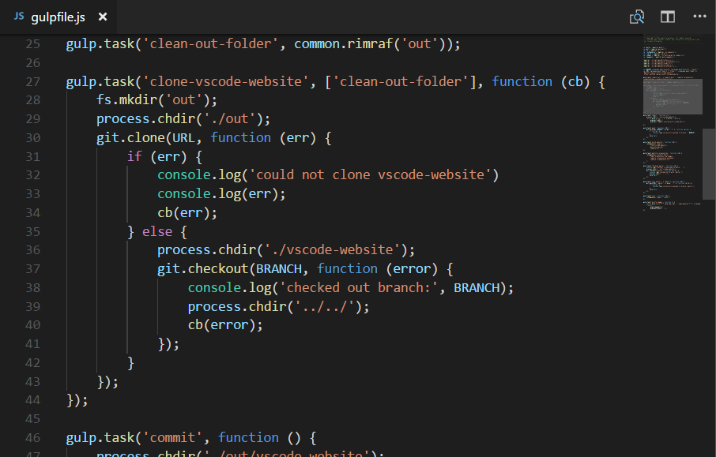

+++
title = "User Interface"
date = 2024-01-12T22:36:24+08:00
weight = 20
type = "docs"
description = ""
isCJKLanguage = true
draft = false
+++

> 原文: [https://code.visualstudio.com/docs/getstarted/userinterface](https://code.visualstudio.com/docs/getstarted/userinterface)

# User Interface 用户界面


At its heart, Visual Studio Code is a code editor. Like many other code editors, VS Code adopts a common user interface and layout of an explorer on the left, showing all of the files and folders you have access to, and an editor on the right, showing the content of the files you have opened.

​​	Visual Studio Code 的核心是一个代码编辑器。与许多其他代码编辑器一样，VS Code 采用通用的用户界面和布局，左侧是资源管理器，显示您有权访问的所有文件和文件夹，右侧是编辑器，显示您已打开的文件的内容。


## [Basic Layout 基本布局](https://code.visualstudio.com/docs/getstarted/userinterface#_basic-layout)

VS Code comes with a simple and intuitive layout that maximizes the space provided for the editor while leaving ample room to browse and access the full context of your folder or project. The UI is divided into five main areas:

​​	VS Code 采用简单直观布局，最大限度地利用为编辑器提供空间，同时留出足够空间来浏览和访问文件夹或项目的完整上下文。UI 分为五个主要区域：

- **Editor** - The main area to edit your files. You can open as many editors as you like side by side vertically and horizontally.
  编辑器 - 用于编辑文件的区域。您可以根据需要并排垂直和水平打开任意数量的编辑器。
- **Primary Side Bar** - Contains different views like the Explorer to assist you while working on your project.
  主侧边栏 - 包含资源管理器等不同视图，可在您处理项目时为您提供帮助。
- **Status Bar** - Information about the opened project and the files you edit.
  状态栏 - 有关已打开项目和您编辑的文件的信息。
- **Activity Bar** - Located on the far left-hand side, this lets you switch between views and gives you additional context-specific indicators, like the number of outgoing changes when Git is enabled.
  活动栏 - 位于最左侧，可让您在视图之间切换，并为您提供其他特定于上下文的指示器，例如启用 Git 时传出更改的数量。
- **Panel** - An additional space for views below the editor region. By default, it houses output, debug information, errors and warnings, and an integrated terminal. Panel can also be moved to the left or right for more vertical space.
  面板 - 编辑器区域下方用于视图的附加空间。默认情况下，它包含输出、调试信息、错误和警告以及一个集成终端。面板还可以向左或向右移动以获得更多垂直空间。

> **Tip:** A Secondary Side Bar is also available to display views opposite the Primary Side Bar. You can show it with Ctrl+Alt+B.
>
> ​​	提示：还可以使用辅助侧边栏在主侧边栏的对面显示视图。您可以使用 Ctrl+Alt+B 显示它。

Each time you start VS Code, it opens up in the same state it was in when you last closed it. The folder, layout, and opened files are preserved.

​​	每次启动 VS Code 时，它都会以上次关闭时的相同状态打开。文件夹、布局和打开的文件都将保留。

Open files in each editor are displayed with tabbed headers (Tabs) at the top of the editor region. To learn more about tabbed headers, see the [Tabs](https://code.visualstudio.com/docs/getstarted/userinterface#_tabs) section below.

​​	每个编辑器中打开的文件都显示在编辑器区域顶部的选项卡标题（选项卡）中。若要详细了解选项卡标题，请参阅下面的“选项卡”部分。

> **Tip:** You can move the Primary Side Bar to the right hand side (**View** > **Toggle Primary Side Bar Position**) or toggle its visibility (Ctrl+B).
>
> ​​	提示：您可以将主侧边栏移至右侧（视图 > 切换主侧边栏位置）或切换其可见性（Ctrl+B）。

## [Side by side editing 并排编辑](https://code.visualstudio.com/docs/getstarted/userinterface#_side-by-side-editing)

You can open as many editors as you like side by side vertically and horizontally. If you already have one editor open, there are multiple ways of opening another editor to the side of the existing one:

​​	您可以垂直和水平并排打开任意数量的编辑器。如果您已经打开了一个编辑器，有多种方法可以打开另一个编辑器到现有编辑器的旁边：

- Alt click on a file in the Explorer.
  在资源管理器中 Alt 单击某个文件。
- Ctrl+\ to split the active editor into two.
  Ctrl+\ 将活动编辑器拆分为两个。
- **Open to the Side** (Ctrl+Enter) from the Explorer context menu on a file.
  从文件上的资源管理器上下文菜单中打开到侧面（Ctrl+Enter）。
- Click the **Split Editor** button in the upper right of an editor.
  单击编辑器右上角的“拆分编辑器”按钮。
- Drag and drop a file to any side of the editor region.
  将文件拖放到编辑器区域的任意一侧。
- Ctrl+Enter (macOS: Cmd+Enter) in the **Quick Open** (Ctrl+P) file list.
  在快速打开（Ctrl+P）文件列表中按 Ctrl+Enter（macOS：Cmd+Enter）。


Whenever you open another file, the editor that is active will display the content of that file. So if you have two editors side by side and you want to open file 'foo.cs' into the right-hand editor, make sure that editor is active (by clicking inside it) before opening file 'foo.cs'.

​​	每当您打开另一个文件时，处于活动状态的编辑器将显示该文件的内容。因此，如果您并排有两个编辑器，并且您想在右侧编辑器中打开文件“foo.cs”，请确保在打开文件“foo.cs”之前该编辑器处于活动状态（通过单击它）。

By default editors will open to the right-hand side of the active one. You can change this behavior through the setting `workbench.editor.openSideBySideDirection` and configure to open new editors to the bottom of the active one instead.

​​	默认情况下，编辑器将在活动编辑器的右侧打开。您可以通过设置 `workbench.editor.openSideBySideDirection` 更改此行为，并配置为在新编辑器打开到活动编辑器的底部。

When you have more than one editor open you can switch between them quickly by holding the Ctrl (macOS: Cmd) key and pressing 1, 2, or 3.

​​	当您打开多个编辑器时，您可以通过按住 Ctrl（macOS：Cmd）键并按 1、2 或 3 在它们之间快速切换。

> **Tip:** You can resize editors and reorder them. Drag and drop the editor title area to reposition or resize the editor.
>
> ​​	提示：您可以调整编辑器大小并重新排列它们。拖放编辑器标题区域以重新定位或调整编辑器大小。

### [Split in group 在组中拆分](https://code.visualstudio.com/docs/getstarted/userinterface#_split-in-group)

You can also split the current editor without creating a new editor group with the **View: Split Editor in Group** command (Ctrl+K Ctrl+Shift+\). To learn more about this editor mode and specific commands for navigating between the two sides, you can read the section in [Custom Layout](https://code.visualstudio.com/docs/editor/custom-layout#_split-in-group) topic.

​​	您还可以使用“视图：在组中拆分编辑器”命令 (Ctrl+K Ctrl+Shift+\) 拆分当前编辑器，而无需创建新的编辑器组。要详细了解此编辑器模式以及在两侧之间导航的特定命令，您可以阅读自定义布局主题中的部分内容。

## [Minimap 小地图](https://code.visualstudio.com/docs/getstarted/userinterface#_minimap)

A Minimap (code outline) gives you a high-level overview of your source code, which is useful for quick navigation and code understanding. A file's minimap is shown on the right side of the editor. You can click or drag the shaded area to quickly jump to different sections of your file.

​​	小地图（代码大纲）为您提供源代码的高级概述，这对于快速导航和理解代码非常有用。文件的迷你地图显示在编辑器的右侧。您可以单击或拖动阴影区域以快速跳转到文件的不同部分。



> **Tip:** You can move the minimap to the left hand side or disable it completely by respectively setting `"editor.minimap.side": "left"` or `"editor.minimap.enabled": false` in your user or workspace [settings](https://code.visualstudio.com/docs/getstarted/settings).
>
> ​​	提示：您可以分别在用户或工作区设置中设置 `"editor.minimap.side": "left"` 或 `"editor.minimap.enabled": false` ，将小地图移至左侧或完全禁用它。

## [Sticky Scroll 粘性滚动](https://code.visualstudio.com/docs/getstarted/userinterface#_sticky-scroll)

Sticky Scroll shows the starting lines of currently visible nested scopes at the top of the editor. It facilitates navigation by indicating where you are in a file and lets you quickly jump back to the top of the current scope.

​​	粘性滚动在编辑器顶部显示当前可见嵌套范围的起始行。它通过指示您在文件中的位置来简化导航，并允许您快速跳回当前范围的顶部。


> **Tip:** You can enable/disable Sticky Scroll with the setting `"editor.stickyScroll.enabled"`.
>
> ​​	提示：您可以使用设置 `"editor.stickyScroll.enabled"` 启用/禁用粘性滚动。

### [Indent Guides 缩进参考线](https://code.visualstudio.com/docs/getstarted/userinterface#_indent-guides)

The image above also shows indentation guides (vertical lines) which help you quickly see matching indent levels. If you would like to disable indent guides, you can set `"editor.guides.indentation": false` in your user or workspace [settings](https://code.visualstudio.com/docs/getstarted/settings).

​​	上图还显示了缩进参考线（垂直线），可帮助您快速查看匹配的缩进级别。如果您想禁用缩进参考线，可以在用户或工作区设置中设置 `"editor.guides.indentation": false` 。

## [Breadcrumbs 面包屑](https://code.visualstudio.com/docs/getstarted/userinterface#_breadcrumbs)

The editor has a navigation bar above its contents called [Breadcrumbs](https://en.wikipedia.org/wiki/Breadcrumb_(navigation)). It shows the current location and allows you to quickly navigate between folders, files, and symbols.

​​	编辑器在其内容上方有一个名为“面包屑”的导航栏。它显示当前位置，并允许您在文件夹、文件和符号之间快速导航。


Breadcrumbs always show the file path and if the current file type has language support for symbols, the symbol path up to the cursor position. You can disable breadcrumbs with the **View** > **Show Breadcrumbs** toggle command. For more information about the breadcrumbs feature, such as how to customize their appearance, see the [Breadcrumbs](https://code.visualstudio.com/docs/editor/editingevolved#_breadcrumbs) section of the [Code Navigation](https://code.visualstudio.com/docs/editor/editingevolved) article.

​​	面包屑始终显示文件路径，如果当前文件类型对符号具有语言支持，则显示到光标位置的符号路径。您可以使用“视图”>“显示面包屑”切换命令禁用面包屑。有关面包屑功能的更多信息，例如如何自定义其外观，请参阅代码导航文章的面包屑部分。

## [Explorer 资源管理器](https://code.visualstudio.com/docs/getstarted/userinterface#_explorer)

The Explorer is used to browse, open, and manage all of the files and folders in your project. VS Code is file and folder based - you can get started immediately by opening a file or folder in VS Code.

​​	资源管理器用于浏览、打开和管理项目中的所有文件和文件夹。VS Code 是基于文件和文件夹的 - 您可以通过在 VS Code 中打开文件或文件夹立即开始。

After opening a folder in VS Code, the contents of the folder are shown in the Explorer. You can do many things from here:

​​	在 VS Code 中打开文件夹后，文件夹的内容将显示在资源管理器中。您可以在此处执行许多操作：

- Create, delete, and rename files and folders.
  创建、删除和重命名文件和文件夹。
- Move files and folders with drag and drop.
  通过拖放移动文件和文件夹。
- Use the context menu to explore all options.
  使用上下文菜单浏览所有选项。

> **Tip:** You can drag and drop files into the Explorer from outside VS Code to copy them (if the explorer is empty VS Code will open them instead)
>
> ​​	提示：您可以将文件从 VS Code 外部拖放到资源管理器中以复制它们（如果资源管理器为空，VS Code 将打开它们）


VS Code works very well with other tools that you might use, especially command-line tools. If you want to run a command-line tool in the context of the folder you currently have open in VS Code, right-click the folder and select **Open in Integrated Terminal**.

​​	VS Code 与您可能使用的其他工具配合得非常好，尤其是命令行工具。如果您想在当前在 VS Code 中打开的文件夹的上下文中运行命令行工具，请右键单击该文件夹并选择“在集成终端中打开”。

You can also navigate to the location of a file or folder in the native Explorer by right-clicking on a file or folder and selecting **Reveal in File Explorer** (or **Reveal in Finder** on macOS or **Open Containing Folder** on Linux).

​​	您还可以通过右键单击文件或文件夹并选择“在文件资源管理器中显示”（或在 macOS 上选择“在访达中显示”或在 Linux 上选择“打开包含的文件夹”）来导航到本机资源管理器中文件或文件夹的位置。

> **Tip:** Type Ctrl+P (**Quick Open**) to quickly search and open a file by its name.
>
> ​​	提示：键入 Ctrl+P（快速打开）可按名称快速搜索和打开文件。

By default, VS Code excludes some folders from the Explorer (for example. `.git`). Use the `files.exclude` [setting](https://code.visualstudio.com/docs/getstarted/settings) to configure rules for hiding files and folders from the Explorer.

​​	默认情况下，VS Code 会从资源管理器中排除一些文件夹（例如 `.git` ）。使用 `files.exclude` 设置来配置用于从资源管理器中隐藏文件和文件夹的规则。

> **Tip:** This is really useful to hide derived resources files, like `\*.meta` in Unity, or `\*.js` in a TypeScript project. For Unity to exclude the `\*.cs.meta` files, the pattern to choose would be: `"**/*.cs.meta": true`. For TypeScript, you can exclude generated JavaScript for TypeScript files with: `"**/*.js": {"when": "$(basename).ts"}`.
>
> ​​	提示：这对于隐藏派生资源文件非常有用，例如 Unity 中的 `\*.meta` 或 TypeScript 项目中的 `\*.js` 。对于 Unity 排除 `\*.cs.meta` 文件，可以选择以下模式： `"**/*.cs.meta": true` 。对于 TypeScript，可以使用以下模式排除 TypeScript 文件的生成 JavaScript： `"**/*.js": {"when": "$(basename).ts"}` 。

### [Multi-selection 多选](https://code.visualstudio.com/docs/getstarted/userinterface#_multiselection)

You can select multiple files in the **File Explorer** and **OPEN EDITORS** view to run actions (Delete, Drag and Drop, Open to the Side) on multiple items. Use the `Ctrl/Cmd` key with `click` to select individual files and `Shift` + `click` to select a range. If you select two items, you can now use the context menu **Compare Selected** command to quickly diff two files.

​​	您可以在文件资源管理器和打开的编辑器视图中选择多个文件，以便对多个项目运行操作（删除、拖放、向侧面打开）。将 `Ctrl/Cmd` 键与 `click` 配合使用可选择单个文件，将 `Shift` + `click` 配合使用可选择一个范围。如果您选择两个项目，现在可以使用上下文菜单比较所选命令快速比较两个文件。

**Note:** In earlier VS Code releases, clicking with the `Ctrl/Cmd` key pressed would open a file in a new Editor Group to the side. If you would still like this behavior, you can use the `workbench.list.multiSelectModifier` setting to change multi-selection to use the `Alt` key.

​​	注意：在较早的 VS Code 版本中，按住 `Ctrl/Cmd` 键单击会在侧面打开一个新编辑器组中的文件。如果您仍然希望使用此行为，可以使用 `workbench.list.multiSelectModifier` 设置将多选更改为使用 `Alt` 键。

```
"workbench.list.multiSelectModifier": "alt"
```

### [Advanced tree navigation 高级树导航](https://code.visualstudio.com/docs/getstarted/userinterface#_advanced-tree-navigation)

You can filter the currently visible files in the **File Explorer**. With the focus on the **File Explorer**, press Ctrl/Cmd+F to open the tree Find control and type part of the file name you want to match. You will see a Find control in the top-right of the **File Explorer** showing what you have typed and matching file names will be highlighted. Pressing the **Filter** button will toggle between the two modes: highlighting and filtering. Pressing DownArrow will let you focus the first matched element and jump between matching elements.

​​	您可以在文件资源管理器中筛选当前可见的文件。在文件资源管理器中聚焦时，按 Ctrl/Cmd+F 打开树形查找控件，然后键入要匹配的文件名的部分内容。您将在文件资源管理器的右上角看到一个查找控件，显示您键入的内容，并且匹配的文件名将突出显示。按筛选按钮将在两种模式之间切换：突出显示和筛选。按向下箭头可让您聚焦第一个匹配的元素并在匹配的元素之间跳转。

This navigation feature is available for all tree views in VS Code, so feel free to try it out in other areas of the product.

​​	此导航功能适用于 VS Code 中的所有树形视图，因此请随时在产品其他区域试用它。


### [Outline view 大纲视图](https://code.visualstudio.com/docs/getstarted/userinterface#_outline-view)

The Outline view is a separate section in the bottom of the File Explorer. When expanded, it will show the symbol tree of the currently active editor.

​​	大纲视图是文件资源管理器底部的单独部分。展开后，它将显示当前活动编辑器的符号树。


The Outline view has different **Sort By** modes, optional cursor tracking, and supports the usual open gestures. It also includes an input box which finds or filters symbols as you type. Errors and warnings are also shown in the Outline view, letting you see at a glance a problem's location.

​​	大纲视图具有不同的“按”模式、可选的光标跟踪，并支持通常的打开手势。它还包括一个输入框，可在您键入时查找或筛选符号。错误和警告也会显示在大纲视图中，让您一目了然地看到问题的位置。

For symbols, the view relies on information computed by your installed extensions for different file types. For example, the built-in Markdown support returns the Markdown header hierarchy for a Markdown file's symbols.

​​	对于符号，视图依赖于已安装的扩展程序为不同文件类型计算的信息。例如，内置的 Markdown 支持返回 Markdown 文件符号的 Markdown 标题层次结构。


There are several Outline view [settings](https://code.visualstudio.com/docs/getstarted/settings) which allow you to enable/disable icons and control the errors and warnings display (all enabled by default):

​​	大纲视图设置有几个，允许您启用/禁用图标并控制错误和警告的显示（默认情况下全部启用）：

- `outline.icons` - Toggle rendering outline elements with icons.
  `outline.icons` - 切换使用图标呈现大纲元素。
- `outline.problems.enabled` - Show errors and warnings on outline elements.
  `outline.problems.enabled` - 在大纲元素上显示错误和警告。
- `outline.problems.badges` - Toggle using badges for errors and warnings.
  `outline.problems.badges` - 切换使用徽章显示错误和警告。
- `outline.problems.colors` - Toggle using colors for errors and warnings.
  `outline.problems.colors` - 切换使用颜色显示错误和警告。

## [Open Editors 打开编辑器](https://code.visualstudio.com/docs/getstarted/userinterface#_open-editors)

At the top of the Explorer is a view labeled **OPEN EDITORS**. This is a list of active files or previews. These are files you previously opened in VS Code that you were working on. For example, a file will be listed in the **OPEN EDITORS** view if you:

​​	在资源管理器顶部有一个标记为“打开的编辑器”的视图。这是活动文件或预览的列表。这些是您之前在 VS Code 中打开并正在处理的文件。例如，如果满足以下条件，文件将列在“打开的编辑器”视图中：

- Make a change to a file.
  对文件进行更改。
- Double-click a file's header.
  双击文件的标题。
- Double-click a file in the Explorer.
  在资源管理器中双击文件。
- Open a file that is not part of the current folder.
  打开不属于当前文件夹的文件。

Just click an item in the **OPEN EDITORS** view, and it becomes active in VS Code.

​​	只需单击“打开的编辑器”视图中的某个项目，它就会在 VS Code 中变为活动状态。

Once you are done with your task, you can remove files individually from the **OPEN EDITORS** view, or you can remove all files by using the **View: Close All Editors** or **View: Close All Editors in Group** actions.

​​	完成任务后，您可以从“打开的编辑器”视图中逐个删除文件，也可以使用“视图：关闭所有编辑器”或“视图：关闭组中的所有编辑器”操作删除所有文件。

## [Views 视图](https://code.visualstudio.com/docs/getstarted/userinterface#_views)

The File Explorer is just one of the Views available in VS Code. There are also Views for:

​​	文件资源管理器只是 VS Code 中可用的视图之一。还有以下视图：

- **Search** - Provides global search and replace across your open folder.
  搜索 - 在您的打开文件夹中提供全局搜索和替换功能。
- **Source Control** - VS Code includes Git source control by default.
  源代码管理 - VS Code 默认包含 Git 源代码管理。
- **Run** - VS Code's Run and Debug View displays variables, call stacks, and breakpoints.
  运行 - VS Code 的运行和调试视图显示变量、调用堆栈和断点。
- **Extensions** - Install and manage your extensions within VS Code.
  扩展 - 在 VS Code 中安装和管理您的扩展。
- **Custom views** - Views contributed by extensions.
  自定义视图 - 由扩展提供的视图。

> **Tip:** You can open any view using the **View: Open View** command.
>
> ​​	提示：您可以使用“视图：打开视图”命令打开任何视图。


You can show or hide views from within the main view and also reorder them by drag and drop.

​​	您可以在主视图中显示或隐藏视图，还可以通过拖放来重新排序它们。


### [Activity Bar 活动栏](https://code.visualstudio.com/docs/getstarted/userinterface#_activity-bar)

The **Activity Bar** on the left lets you quickly switch between Views. You can also reorder Views by dragging and dropping them on the **Activity Bar** or remove a View entirely (right-click the Activity Bar and uncheck a view).

​​	左侧的活动栏可让您快速在视图之间切换。您还可以通过在活动栏上拖放来重新排序视图，或完全删除视图（右键单击活动栏并取消选中视图）。


## [Command Palette 命令面板](https://code.visualstudio.com/docs/getstarted/userinterface#_command-palette)

VS Code is equally accessible from the keyboard. The most important key combination to know is Ctrl+Shift+P, which brings up the **Command Palette**. From here, you have access to all of the functionality of VS Code, including keyboard shortcuts for the most common operations.

​​	VS Code 同样可以通过键盘访问。最重要的按键组合是 Ctrl+Shift+P，它会调出命令面板。在此处，您可以访问 VS Code 的所有功能，包括最常用操作的键盘快捷键。


The **Command Palette** provides access to many commands. You can execute editor commands, open files, search for symbols, and see a quick outline of a file, all using the same interactive window. Here are a few tips:

​​	命令面板提供对许多命令的访问权限。您可以执行编辑器命令、打开文件、搜索符号，以及查看文件的快速大纲，所有这些都使用相同的交互式窗口。以下是一些提示：

- Ctrl+P will let you navigate to any file or symbol by typing its name
  Ctrl+P 将允许您通过键入名称来导航到任何文件或符号
- Ctrl+Tab will cycle you through the last set of files opened
  Ctrl+Tab 将循环浏览上次打开的文件集
- Ctrl+Shift+P will bring you directly to the editor commands
  Ctrl+Shift+P 将直接带您进入编辑器命令
- Ctrl+Shift+O will let you navigate to a specific symbol in a file
  Ctrl+Shift+O 将允许您导航到文件中的特定符号
- Ctrl+G will let you navigate to a specific line in a file
  Ctrl+G 将允许您导航到文件中的特定行

Type `?` into the input field to get a list of available commands you can execute from here:

​​	在输入字段中键入 `?` 以获取可从此处执行的可用命令列表：


## [Configuring the editor 配置编辑器](https://code.visualstudio.com/docs/getstarted/userinterface#_configuring-the-editor)

VS Code gives you many options to configure the editor. From the **View** > **Appearance** menu, you can hide or toggle various parts of the user interface, such as the **Side Bar**, **Status Bar**, and **Activity Bar**.

​​	VS Code 为您提供了许多配置编辑器选项。在“视图”>“外观”菜单中，您可以隐藏或切换用户界面的各个部分，例如侧边栏、状态栏和活动栏。

### [Hide the Menu Bar (Windows, Linux) 隐藏菜单栏（Windows、Linux）](https://code.visualstudio.com/docs/getstarted/userinterface#_hide-the-menu-bar-windows-linux)

You can hide the Menu Bar on Windows and Linux by changing the setting `window.menuBarVisibility` from `classic` to `toggle`. A setting of `toggle` means that a single press of the Alt key will show the Menu Bar again.

​​	您可以在 Windows 和 Linux 上通过将设置 `window.menuBarVisibility` 从 `classic` 更改为 `toggle` 来隐藏菜单栏。设置 `toggle` 表示再次按一下 Alt 键将显示菜单栏。

You can also hide the Menu Bar on Windows and Linux with the **View** > **Toggle Menu Bar** command. This command sets `window.menuBarVisibility` from `classic` to `compact`, resulting in the Menu Bar moving into the Activity Bar. To return the Menu Bar to the `classic` position, you can execute the **View** > **Toggle Menu Bar** command again.

​​	您还可以使用“视图”>“切换菜单栏”命令在 Windows 和 Linux 上隐藏菜单栏。此命令将 `window.menuBarVisibility` 从 `classic` 设置为 `compact` ，导致菜单栏移至活动栏。要将菜单栏返回到 `classic` 位置，您可以再次执行“视图”>“切换菜单栏”命令。

### [Settings 设置](https://code.visualstudio.com/docs/getstarted/userinterface#_settings)

Most editor configurations are kept in settings which can be modified directly. You can set options globally through user settings or per project/folder through workspace settings. Settings values are kept in a `settings.json` [file](https://code.visualstudio.com/docs/getstarted/settings#_settingsjson).

​​	大多数编辑器配置都保存在可以直接修改的设置中。您可以通过用户设置全局设置选项，也可以通过工作区设置按项目/文件夹设置选项。设置值保存在 `settings.json` 文件中。

- Select **File** > **Preferences** > **Settings** (or press Ctrl+,) to edit the user `settings.json` file.
  选择“文件”>“首选项”>“设置”（或按 Ctrl+，）以编辑用户 `settings.json` 文件。
- To edit workspace settings, select the **WORKSPACE SETTINGS** tab to edit the workspace `settings.json` file.
  要编辑工作区设置，请选择“工作区设置”选项卡以编辑工作区 `settings.json` 文件。


You will see the VS Code [Default Settings](https://code.visualstudio.com/docs/getstarted/settings#_default-settings) in the left window and your editable `settings.json` on the right. You can easily filter settings in the `Default Settings` using the search box at the top. Copy a setting over to the editable `settings.json` on the right by clicking on the edit icon to the left of the setting. Settings with a fixed set of values allow you to pick a value as part of their edit icon menu.

​​	在左侧窗口中，您将看到 VS Code 默认设置，在右侧窗口中，您将看到可编辑的 `settings.json` 。您可以使用顶部的搜索框轻松地过滤 `Default Settings` 中的设置。通过单击设置左侧的编辑图标，可以将设置复制到右侧的可编辑 `settings.json` 中。具有固定值集的设置允许您从其编辑图标菜单中选择一个值。

After editing your settings, type Ctrl+S to save your changes. The changes will take effect immediately.

​​	编辑设置后，键入 Ctrl+S 以保存更改。更改将立即生效。

> **Note:** Workspace settings will override User settings and are useful for sharing project specific settings across a team.
>
> ​​	注意：工作区设置将覆盖用户设置，并且对于跨团队共享特定于项目的设置非常有用。

### [Zen Mode Zen 模式](https://code.visualstudio.com/docs/getstarted/userinterface#_zen-mode)

Zen Mode lets you focus on your code by hiding all UI except the editor (no Activity Bar, Status Bar, Side Bar and Panel), going to full screen, and centering the editor layout. Zen mode can be toggled using the **View** > **Appearance** menu, **View: Toggle Zen Mode** in the **Command Palette**, or by the shortcut Ctrl+K Z. Double Esc exits Zen Mode. The transition to full screen can be disabled via `zenMode.fullScreen`.

​​	Zen 模式可让您专注于代码，方法是隐藏除编辑器以外的所有 UI（无活动栏、状态栏、侧边栏和面板），转到全屏并使编辑器布局居中。可以使用“视图”>“外观”菜单、在命令面板中使用“视图：切换 Zen 模式”或使用快捷方式 Ctrl+K Z 来切换 Zen 模式。双击 Esc 可退出 Zen 模式。可以通过 `zenMode.fullScreen` 禁用切换到全屏的功能。

Zen Mode can be further tuned by the following settings:

​​	Zen 模式可以通过以下设置进一步调整：

- `zenMode.hideActivityBar`- Hide the Activity bar. Default `true`.
  `zenMode.hideActivityBar` - 隐藏活动栏。默认 `true` 。
- `zenMode.hideStatusBar` - Hide the Status bar. Default `true`.
  `zenMode.hideStatusBar` - 隐藏状态栏。默认 `true` 。
- `zenMode.hideLineNumbers` - Hide line numbers. Default `true`.
  `zenMode.hideLineNumbers` - 隐藏行号。默认 `true` 。
- `zenMode.showTabs` - Controls whether to show multiple, single, or no editors tabs. Default `multiple`.
  `zenMode.showTabs` - 控制是否显示多个、单个或不显示编辑器选项卡。默认 `multiple` 。
- `zenMode.fullScreen` - Put workbench in full screen display. Default `true`.
  `zenMode.fullScreen` - 将工作台置于全屏显示。默认 `true` 。
- `zenMode.restore` - Restore Zen Mode on restart. Default `true`.
  `zenMode.restore` - 重启时恢复 Zen 模式。默认 `true` 。
- `zenMode.centerLayout` - Use [Centered editor layout](https://code.visualstudio.com/docs/getstarted/userinterface#_centered-editor-layout). Default `true`.
  `zenMode.centerLayout` - 使用居中编辑器布局。默认 `true` .
- `zenMode.silentNotifications` - Do not display notifications. Default `true`.
  `zenMode.silentNotifications` - 不显示通知。默认 `true` .

### [Centered editor layout 居中编辑器布局](https://code.visualstudio.com/docs/getstarted/userinterface#_centered-editor-layout)

Centered editor layout allows you to center align the editor area. This is particularly useful when working with a single editor on a large monitor. You can use the sashes on the side to resize the view (hold down the `Alt` key to independently move the sashes).

​​	居中编辑器布局允许您将编辑器区域居中对齐。当在大型监视器上使用单个编辑器时，这特别有用。您可以使用侧面的窗格调整视图的大小（按住 `Alt` 键可独立移动窗格）。

## [Tabs 选项卡](https://code.visualstudio.com/docs/getstarted/userinterface#_tabs)

Visual Studio Code shows open items with Tabs (tabbed headings) in the title area above the editor.

​​	Visual Studio Code 在编辑器上方的标题区域中使用选项卡（选项卡标题）显示打开的项目。

When you open a file, a new Tab is added for that file.

​​	当您打开一个文件时，将为该文件添加一个新选项卡。


Tabs let you quickly navigate between items and you can Drag and Drop Tabs to reorder them.

​​	选项卡允许您在项目之间快速导航，并且您可以拖放选项卡以重新排序它们。

When you have more open items than can fit in the title area, you can use the **Show Opened Editors** command (available through the `...` More button) to display a dropdown list of tabbed items.

​​	当您打开的项目比标题区域中可以容纳的项目多时，您可以使用“显示打开的编辑器”命令（可通过 `...` 更多按钮获得）来显示选项卡项目的下拉列表。

There is also a scroll bar between the tab and editor regions to drag editors into view. You can increase the height of the scroll bar to make it easier to drag by setting **Workbench > Editor: Title Scrollbar Sizing** (`workbench.editor.titleScrollbarSizing`) to `large`.

​​	选项卡和编辑器区域之间还有一个滚动条，可将编辑器拖动到视图中。您可以通过将“工作台”>“编辑器：标题滚动条大小”（ `workbench.editor.titleScrollbarSizing` ）设置为 `large` 来增加滚动条的高度，以便更轻松地拖动。

If you don't want to use Tabs, you can disable the feature by setting the `workbench.editor.showTabs` [setting](https://code.visualstudio.com/docs/getstarted/settings) to `single`:

​​	如果您不想使用选项卡，可以通过将 `workbench.editor.showTabs` 设置为 `single` 来禁用此功能：

```
    "workbench.editor.showTabs": "single"
```

See the section below to optimize VS Code when [working without Tabs](https://code.visualstudio.com/docs/getstarted/userinterface#_working-without-tabs).

​​	请参阅以下部分，以在不使用选项卡的情况下优化 VS Code。

### [Tab ordering 选项卡排序](https://code.visualstudio.com/docs/getstarted/userinterface#_tab-ordering)

By default, new Tabs are added to the right of the existing Tabs but you can control where you'd like new Tabs to appear with the `workbench.editor.openPositioning` setting.

​​	默认情况下，新选项卡会添加到现有选项卡的右侧，但您可以使用 `workbench.editor.openPositioning` 设置控制新选项卡的显示位置。

For example, you might like new tabbed items to appear on the left:

​​	例如，您可能希望新选项卡项目显示在左侧：

```
    "workbench.editor.openPositioning": "left"
```

### [Wrapped tabs 换行选项卡](https://code.visualstudio.com/docs/getstarted/userinterface#_wrapped-tabs)

To see more editor tabs, you can use the **wrapped tab** layout, where editor tabs wrap to fill multiple rows above the editor region. Enable wrapped tabs with the **Workbench > Editor: Wrap Tabs** (`workbench.editor.wrapTabs`) [setting](https://code.visualstudio.com/docs/getstarted/settings).

​​	若要查看更多编辑器选项卡，可以使用换行选项卡布局，其中编辑器选项卡换行以填充编辑器区域上方的多行。使用工作台 > 编辑器启用换行选项卡：换行选项卡 ( `workbench.editor.wrapTabs` ) 设置。


## [Preview mode 预览模式](https://code.visualstudio.com/docs/getstarted/userinterface#_preview-mode)

When you single-click or select a file in the Explorer, it is shown in a preview mode and reuses an existing Tab. This is useful if you are quickly browsing files and don't want every visited file to have its own Tab. When you start editing the file or use double-click to open the file from the Explorer, a new Tab is dedicated to that file.

​​	当您在资源管理器中单击或选择某个文件时，该文件会以预览模式显示，并重复使用现有选项卡。如果您正在快速浏览文件并且不希望每个访问的文件都有自己的选项卡，这会非常有用。当您开始编辑文件或使用双击从资源管理器中打开文件时，会为该文件专门创建一个新选项卡。

Preview mode is indicated by italics in the Tab heading:

​​	预览模式在选项卡标题中以斜体显示：


If you'd prefer to not use preview mode and always create a new Tab, you can control the behavior with these settings:

​​	如果您不想使用预览模式并始终创建新选项卡，则可以使用以下设置控制行为：

- `workbench.editor.enablePreview` to globally enable or disable preview editors
  `workbench.editor.enablePreview` 全局启用或禁用预览编辑器
- `workbench.editor.enablePreviewFromQuickOpen` to enable or disable preview editors when opened from **Quick Open**
  `workbench.editor.enablePreviewFromQuickOpen` 从快速打开

## [Editor Groups 编辑器组中打开时启用或禁用预览编辑器](https://code.visualstudio.com/docs/getstarted/userinterface#_editor-groups)

When you split an editor (using the **Split Editor** or **Open to the Side** commands), a new editor region is created which can hold a group of items. You can open as many editor regions as you like side by side vertically and horizontally.

​​	当您拆分编辑器（使用拆分编辑器或向侧面打开命令）时，将创建一个新的编辑器区域，该区域可以容纳一组项目。您可以根据需要在垂直和水平方向上并排打开任意数量的编辑器区域。

You can see these clearly in the **OPEN EDITORS** section at the top of the Explorer view:

​​	您可以在资源管理器视图顶部的打开的编辑器部分中清楚地看到这些内容：


You can Drag and Drop editor groups on the workbench, move individual Tabs between groups and quickly close entire groups (**Close All**).

​​	您可以在工作台中拖放编辑器组，在组之间移动各个选项卡，并快速关闭整个组（全部关闭）。

> **Note:** VS Code uses editor groups whether or not you have enabled Tabs. Without Tabs, editor groups are a stack of your open items with the most recently selected item visible in the editor pane.
>
> ​​	注意：无论是否启用了选项卡，VS Code 都使用编辑器组。如果没有选项卡，编辑器组就是打开的项的堆栈，最近选择的项在编辑器窗格中可见。

## [Grid editor layout 网格编辑器布局](https://code.visualstudio.com/docs/getstarted/userinterface#_grid-editor-layout)

By default, editor groups are laid out in vertical columns (for example when you split an editor to open it to the side). You can easily arrange editor groups in any layout you like, both vertically and horizontally:

​​	默认情况下，编辑器组以垂直列的形式排列（例如，当您拆分编辑器以将其打开到侧面时）。您可以轻松地以任何您喜欢的布局排列编辑器组，无论是垂直还是水平：


To support flexible layouts, you can create empty editor groups. By default, closing the last editor of an editor group will also close the group itself, but you can change this behavior with the new setting `workbench.editor.closeEmptyGroups: false`:

​​	为了支持灵活的布局，您可以创建空编辑器组。默认情况下，关闭编辑器组的最后一个编辑器也会关闭组本身，但您可以使用新设置 `workbench.editor.closeEmptyGroups: false` 更改此行为：


There are a predefined set of editor layouts in the new **View** > **Editor Layout** menu:

​​	新的“视图”>“编辑器布局”菜单中有一组预定义的编辑器布局：


Editors that open to the side (for example by clicking the editor toolbar **Split Editor** action) will by default open to the right-hand side of the active editor. If you prefer to open editors below the active one, configure the new setting `workbench.editor.openSideBySideDirection: down`.

​​	向侧面打开的编辑器（例如，通过单击编辑器工具栏“拆分编辑器”操作）默认情况下会在活动编辑器的右侧打开。如果您更喜欢在活动编辑器下方打开编辑器，请配置新设置 `workbench.editor.openSideBySideDirection: down` 。

There are many keyboard commands for adjusting the editor layout with the keyboard alone, but if you prefer to use the mouse, drag and drop is a fast way to split the editor into any direction:

​​	有很多键盘命令可用于仅使用键盘调整编辑器布局，但如果您更喜欢使用鼠标，则拖放是将编辑器快速拆分为任意方向的一种方法：


> **Pro Tip**: If you press and hold the `Alt` key while hovering over the toolbar action to split an editor, it will offer to split to the other orientation. This is a fast way to split either to the right or to the bottom.
>
> ​​	专业提示：如果您在悬停在工具栏操作上以拆分编辑器时按住 `Alt` 键，它将提供拆分为其他方向的选项。这是快速拆分为右侧或底部的快捷方式。


### [Keyboard shortcuts 键盘快捷键](https://code.visualstudio.com/docs/getstarted/userinterface#_keyboard-shortcuts)

Here are some handy keyboard shortcuts to quickly navigate between editors and editor groups.

​​	以下是一些在编辑器和编辑器组之间快速导航的便捷键盘快捷键。

> If you'd like to modify the default keyboard shortcuts, see [Key Bindings](https://code.visualstudio.com/docs/getstarted/keybindings) for details.
>
> ​​	如果您想修改默认键盘快捷键，请参阅按键绑定以了解详细信息。

- Ctrl+PageDown go to the right editor.
  Ctrl+PageDown 转到右侧编辑器。
- Ctrl+PageUp go to the left editor.
  Ctrl+PageUp 转到左侧编辑器。
- Ctrl+Tab open the previous editor in the editor group MRU list.
  Ctrl+Tab 在编辑器组 MRU 列表中打开上一个编辑器。
- Ctrl+1 go to the leftmost editor group.
  Ctrl+1 转到最左侧编辑器组。
- Ctrl+2 go to the center editor group.
  Ctrl+2 转到中间编辑器组。
- Ctrl+3 go to the rightmost editor group.
  Ctrl+3 转到最右侧的编辑器组。
- Ctrl+W close the active editor.
  Ctrl+W 关闭活动编辑器。
- Ctrl+K W close all editors in the editor group.
  Ctrl+K W 关闭编辑器组中的所有编辑器。
- Ctrl+K Ctrl+W close all editors.
  Ctrl+K Ctrl+W 关闭所有编辑器。

## [Working without Tabs 无选项卡工作](https://code.visualstudio.com/docs/getstarted/userinterface#_working-without-tabs)

If you prefer not to use Tabs (tabbed headings), you can disable Tabs (tabbed headings) entirely by setting `workbench.editor.showTabs` to `single` or `none`.

​​	如果您不想使用选项卡（选项卡标题），可以通过将 `workbench.editor.showTabs` 设置为 `single` 或 `none` 来完全禁用选项卡（选项卡标题）。

### [Disable Preview mode 禁用预览模式](https://code.visualstudio.com/docs/getstarted/userinterface#_disable-preview-mode)

Without Tabs, the **OPEN EDITORS** section of the File Explorer is a quick way to do file navigation. With [preview editor mode](https://code.visualstudio.com/docs/getstarted/userinterface#_preview-mode), files are not added to the **OPEN EDITOR** list nor editor group on single-click open. You can disable this feature through the `workbench.editor.enablePreview` and `workbench.editor.enablePreviewFromQuickOpen` settings.

​​	在没有选项卡的情况下，文件资源管理器的“打开的编辑器”部分是执行文件导航的快速方法。使用预览编辑器模式时，在单击打开时不会将文件添加到“打开的编辑器”列表或编辑器组中。您可以通过 `workbench.editor.enablePreview` 和 `workbench.editor.enablePreviewFromQuickOpen` 设置禁用此功能。

### [Ctrl+Tab to navigate in entire editor history Ctrl+Tab 在整个编辑器历史记录中导航](https://code.visualstudio.com/docs/getstarted/userinterface#_ctrltab-to-navigate-in-entire-editor-history)

You can change keybindings for Ctrl+Tab to show you a list of all opened editors from the history independent from the active editor group.

​​	您可以更改 Ctrl+Tab 的按键绑定，以显示来自历史记录的所有已打开编辑器的列表，而与活动编辑器组无关。

Edit your [keybindings](https://code.visualstudio.com/docs/getstarted/keybindings) and add the following:

​​	编辑您的按键绑定并添加以下内容：

```
{ "key": "ctrl+tab", "command": "workbench.action.openPreviousEditorFromHistory" },
{ "key": "ctrl+tab", "command": "workbench.action.quickOpenNavigateNext", "when": "inQuickOpen" },
```

### [Close an entire group instead of a single editor 关闭整个组而不是单个编辑器](https://code.visualstudio.com/docs/getstarted/userinterface#_close-an-entire-group-instead-of-a-single-editor)

If you liked the behavior of VS Code closing an entire group when closing one editor, you can bind the following in your [keybindings](https://code.visualstudio.com/docs/getstarted/keybindings).

​​	如果您喜欢 VS Code 在关闭一个编辑器时关闭整个组的行为，则可以在键绑定中绑定以下内容。

macOS:

​​	macOS：

```
{ "key": "cmd+w", "command": "workbench.action.closeEditorsInGroup" }
```

Windows/Linux:

​​	Windows/Linux：

```
{ "key": "ctrl+w", "command": "workbench.action.closeEditorsInGroup" }
```

## [Window management 窗口管理](https://code.visualstudio.com/docs/getstarted/userinterface#_window-management)

VS Code has some options to control how windows (instances) should be opened or restored between sessions.

​​	VS Code 提供了一些选项来控制如何在会话之间打开或还原窗口（实例）。

The settings `window.openFoldersInNewWindow` and `window.openFilesInNewWindow` are provided to configure opening new windows or reusing the last active window for files or folders and possible values are `default`, `on` and `off`.

​​	提供设置 `window.openFoldersInNewWindow` 和 `window.openFilesInNewWindow` 来配置打开新窗口或对文件或文件夹重复使用上次活动的窗口，可能的值为 `default` 、 `on` 和 `off` 。

If configured to be `default`, we will make the best guess about reusing a window or not based on the context from where the open request was made. Flip this to `on` or `off` to always behave the same. For example, if you feel that picking a file or folder from the **File** menu should always open into a new window, set this to `on`.

​​	如果配置为 `default` ，我们将根据发出打开请求的上下文，对是否重复使用窗口做出最佳猜测。将其翻转为 `on` 或 `off` 以始终表现相同。例如，如果您觉得从“文件”菜单中选择文件或文件夹应始终在新窗口中打开，请将其设置为 `on` 。

Note: There can still be cases where this setting is ignored (for example, when using the `-new-window` or `-reuse-window` command-line option).

​​	注意：在某些情况下，此设置仍会被忽略（例如，在使用 `-new-window` 或 `-reuse-window` 命令行选项时）。

The `window.restoreWindows` setting tells VS Code how to restore the opened windows of your previous session. By default, VS Code will restore all windows you worked on during your previous session (setting: `all`). Change this setting to `none` to never reopen any windows and always start with an empty VS Code instance. Change it to `one` to reopen the last opened window you worked on or `folders` to only restore windows that had folders opened.

​​	“ `window.restoreWindows` ”设置告诉 VS Code 如何还原上次会话中打开的窗口。默认情况下，VS Code 将还原上次会话中处理的所有窗口（设置： `all` ）。将此设置更改为 `none` 以从不重新打开任何窗口，并始终从一个空的 VS Code 实例启动。将其更改为 `one` 以重新打开上次处理的窗口，或 `folders` 以仅还原已打开文件夹的窗口。

## [Next steps 后续步骤](https://code.visualstudio.com/docs/getstarted/userinterface#_next-steps)

Now that you know the overall layout of VS Code, start to customize the editor to how you like to work by looking at the following topics:

​​	现在您已了解 VS Code 的整体布局，请通过查看以下主题开始自定义编辑器，以符合您的工作方式：

- [Changing the Theme](https://code.visualstudio.com/docs/getstarted/themes) - Set a Color and/or File Icon theme to your preference.
  更改主题 - 根据您的喜好设置颜色和/或文件图标主题。
- [Custom Layout](https://code.visualstudio.com/docs/editor/custom-layout) - Learn more about VS Code's workbench and editor layout customizations.
  自定义布局 - 详细了解 VS Code 的工作台和编辑器布局自定义。

## [Common questions 常见问题](https://code.visualstudio.com/docs/getstarted/userinterface#_common-questions)

### [How can I change the color of the indent guides? 如何更改缩进参考线的颜色？](https://code.visualstudio.com/docs/getstarted/userinterface#_how-can-i-change-the-color-of-the-indent-guides)

The indent guide colors are customizable as are most VS Code UI elements. To [customize](https://code.visualstudio.com/api/references/theme-color) the indent guides color for your active color theme, use the `workbench.colorCustomizations` [setting](https://code.visualstudio.com/docs/getstarted/settings) and modify the `editorIndentGuide.background` value.

​​	缩进参考线颜色是可自定义的，就像大多数 VS Code UI 元素一样。若要自定义活动颜色主题的缩进参考线颜色，请使用 `workbench.colorCustomizations` 设置并修改 `editorIndentGuide.background` 值。

For example, to make the indent guides bright blue, add the following to your `settings.json`:

​​	例如，若要使缩进参考线为亮蓝色，请将以下内容添加到您的 `settings.json` ：

```
"workbench.colorCustomizations": {
    "editorIndentGuide.background": "#0000ff"
}
```

### [Can I hide the OPEN EDITORS section in the Explorer? 我可以在资源管理器中隐藏“打开的编辑器”部分吗？](https://code.visualstudio.com/docs/getstarted/userinterface#_can-i-hide-the-open-editors-section-in-the-explorer)

Yes, you can hide the **OPEN EDITORS** list with the `explorer.openEditors.visible` [setting](https://code.visualstudio.com/docs/getstarted/settings), which declares how many items to display before a scroll bar appears. Setting `"explorer.openEditors.visible": 0` will hide **OPEN EDITORS** when you have an open folder. The list will still be displayed if you are using VS Code to view individual loose files, since they won't be displayed in the folder pane.

​​	是的，您可以使用 `explorer.openEditors.visible` 设置隐藏打开的编辑器列表，该设置声明在出现滚动条之前要显示多少个项目。设置 `"explorer.openEditors.visible": 0` 将在您打开文件夹时隐藏打开的编辑器。如果您使用 VS Code 查看各个松散文件，该列表仍会显示，因为它们不会显示在文件夹窗格中。
