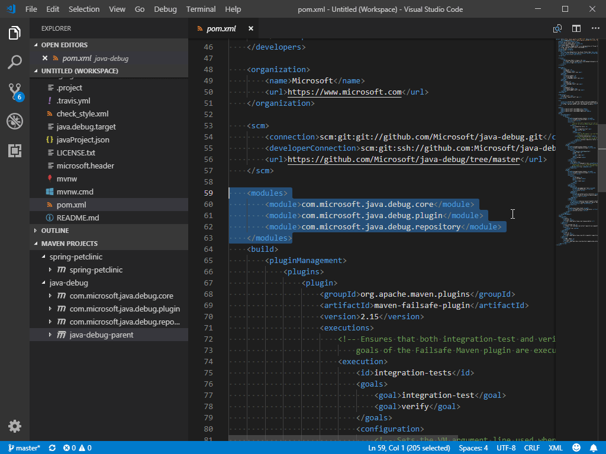
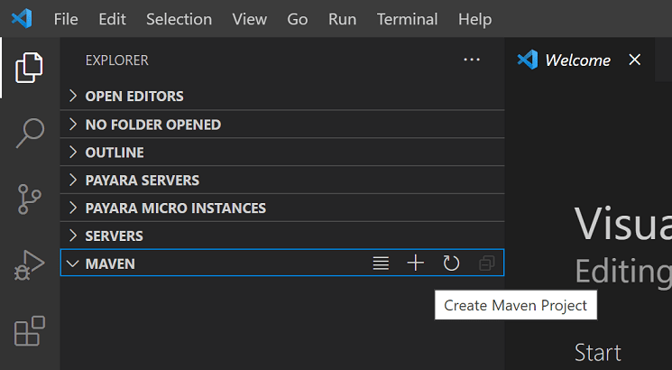
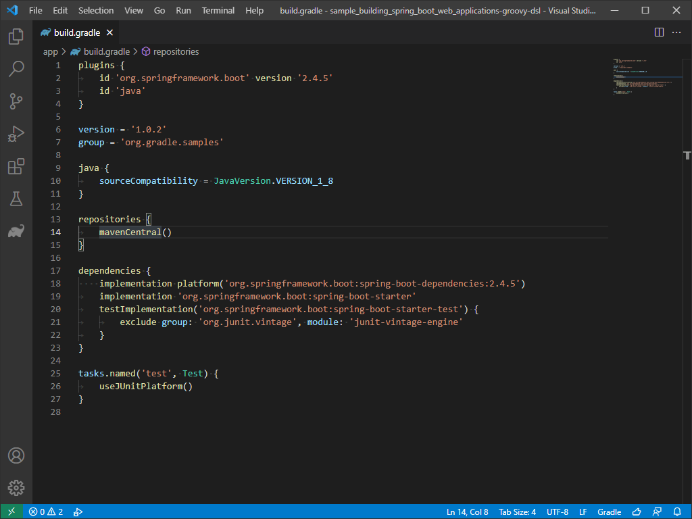
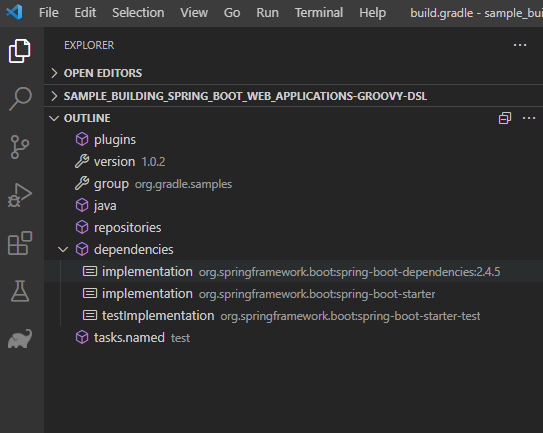
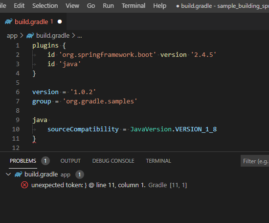

+++
title = "Build Tools"
date = 2024-01-12T22:36:24+08:00
weight = 50
type = "docs"
description = ""
isCJKLanguage = true
draft = false
+++

> 原文: [https://code.visualstudio.com/docs/java/java-build](https://code.visualstudio.com/docs/java/java-build)

# Java build tools in VS Code VS Code 中的 Java 构建工具

This document is an overview of how to work with your Java build tools in Visual Studio Code. It covers the [Maven for Java](https://marketplace.visualstudio.com/items?itemName=vscjava.vscode-maven) and [Gradle for Java](https://marketplace.visualstudio.com/items?itemName=vscjava.vscode-gradle) extensions as well as other tools.

​​​	此文档概述了如何在 Visual Studio Code 中使用 Java 构建工具。它涵盖了适用于 Java 的 Maven 和适用于 Java 的 Gradle 扩展以及其他工具。

If you run into any issues when using the features below, you can contact us by entering an [issue](https://github.com/microsoft/vscode-java-pack/issues).

​​​	如果您在使用以下功能时遇到任何问题，可以通过输入问题与我们联系。

## [Maven](https://code.visualstudio.com/docs/java/java-build#_maven)

[Maven](https://maven.apache.org/) is a software tool that helps you manage Java projects and automate application builds. The [Maven for Java](https://marketplace.visualstudio.com/items?itemName=vscjava.vscode-maven) extension for Visual Studio Code provides fully integrated Maven support, allowing you to explore Maven projects, execute Maven commands, and perform the goals of build lifecycle and plugins. We recommend installing the [Extension Pack for Java](https://marketplace.visualstudio.com/items?itemName=vscjava.vscode-java-pack), which includes Maven support and other important Java development features.

​​​	Maven 是一款软件工具，可帮助您管理 Java 项目并自动执行应用程序构建。适用于 Visual Studio Code 的适用于 Java 的 Maven 扩展提供完全集成的 Maven 支持，允许您浏览 Maven 项目、执行 Maven 命令以及执行构建生命周期和插件的目标。我们建议安装适用于 Java 的扩展包，其中包括 Maven 支持和其他重要的 Java 开发功能。

[Install the Extension Pack for Java
安装 Java 扩展包](vscode:extension/vscjava.vscode-java-pack)

### [Exploring Maven project 浏览 Maven 项目](https://code.visualstudio.com/docs/java/java-build#_exploring-maven-project)

Once a Maven project is loaded, the extension will be activated and it will automatically scan for `pom.xml` files in your workspace and displays all Maven projects and their modules in the side bar.

​​​	加载 Maven 项目后，扩展将被激活，它会自动扫描工作区中的 `pom.xml` 文件，并在侧边栏中显示所有 Maven 项目及其模块。

### [Resolve unknown type 解析未知类型](https://code.visualstudio.com/docs/java/java-build#_resolve-unknown-type)

The Maven extension also supports searching Maven Central to resolve unknown types in your source code. You can do this by selecting the **Resolve unknown type** link shown on hover.

​​​	Maven 扩展还支持搜索 Maven Central 以解析源代码中的未知类型。您可以通过选择悬停时显示的“解析未知类型”链接来执行此操作。

<video autoplay="" loop="" muted="" playsinline="" controls="" title="Resolve unknown type" data-immersive-translate-walked="d5419e34-f9f4-42ed-8bd0-0b6bc6bc0534" style="box-sizing: border-box; font-family: &quot;Segoe UI&quot;, &quot;Helvetica Neue&quot;, Helvetica, Arial, sans-serif; display: inline-block; vertical-align: baseline; margin-top: 1.5rem; margin-bottom: 2.5rem; width: 616.662px; max-width: 100%; color: rgb(36, 36, 36); font-size: 16px; font-style: normal; font-variant-ligatures: normal; font-variant-caps: normal; font-weight: 400; letter-spacing: normal; orphans: 2; text-align: start; text-indent: 0px; text-transform: none; widows: 2; word-spacing: 0px; -webkit-text-stroke-width: 0px; white-space: normal; background-color: rgb(255, 255, 255); text-decoration-thickness: initial; text-decoration-style: initial; text-decoration-color: initial;"></video>

### [Working with POM.xml 使用 POM.xml](https://code.visualstudio.com/docs/java/java-build#_working-with-pomxml)

The extension provides code snippets and auto completion for adding Maven dependencies based on local Maven repositories. See how easy it is to add a new dependency to your `pom.xml` with those convenient features.

​​​	该扩展提供代码片段和自动完成功能，以便根据本地 Maven 存储库添加 Maven 依赖项。了解使用这些便捷功能向 `pom.xml` 添加新依赖项是多么容易。

<video autoplay="" loop="" muted="" playsinline="" controls="" title="Add a new dependency to POM file" data-immersive-translate-walked="d5419e34-f9f4-42ed-8bd0-0b6bc6bc0534" style="box-sizing: border-box; font-family: &quot;Segoe UI&quot;, &quot;Helvetica Neue&quot;, Helvetica, Arial, sans-serif; display: inline-block; vertical-align: baseline; margin-top: 1.5rem; margin-bottom: 2.5rem; width: 616.662px; max-width: 100%; color: rgb(36, 36, 36); font-size: 16px; font-style: normal; font-variant-ligatures: normal; font-variant-caps: normal; font-weight: 400; letter-spacing: normal; orphans: 2; text-align: start; text-indent: 0px; text-transform: none; widows: 2; word-spacing: 0px; -webkit-text-stroke-width: 0px; white-space: normal; background-color: rgb(255, 255, 255); text-decoration-thickness: initial; text-decoration-style: initial; text-decoration-color: initial;"></video>

The extension also enables you to generate effective POM.

​​​	该扩展还允许您生成有效的 POM。

<video autoplay="" loop="" muted="" playsinline="" controls="" title="Generate effective POM" data-immersive-translate-walked="d5419e34-f9f4-42ed-8bd0-0b6bc6bc0534" style="box-sizing: border-box; font-family: &quot;Segoe UI&quot;, &quot;Helvetica Neue&quot;, Helvetica, Arial, sans-serif; display: inline-block; vertical-align: baseline; margin-top: 1.5rem; margin-bottom: 2.5rem; width: 616.662px; max-width: 100%; color: rgb(36, 36, 36); font-size: 16px; font-style: normal; font-variant-ligatures: normal; font-variant-caps: normal; font-weight: 400; letter-spacing: normal; orphans: 2; text-align: start; text-indent: 0px; text-transform: none; widows: 2; word-spacing: 0px; -webkit-text-stroke-width: 0px; white-space: normal; background-color: rgb(255, 255, 255); text-decoration-thickness: initial; text-decoration-style: initial; text-decoration-color: initial;"></video>

You can also use the command **Maven: Add a Dependency** (or `maven.project.addDependency`) to help add a new dependency to `pom.xml`. The process is interactive.

​​​	您还可以使用命令 Maven：添加依赖项（或 `maven.project.addDependency` ）来帮助向 `pom.xml` 添加新依赖项。此过程是交互式的。

<video autoplay="" loop="" muted="" playsinline="" controls="" title="Add a dependency" data-immersive-translate-walked="d5419e34-f9f4-42ed-8bd0-0b6bc6bc0534" style="box-sizing: border-box; font-family: &quot;Segoe UI&quot;, &quot;Helvetica Neue&quot;, Helvetica, Arial, sans-serif; display: inline-block; vertical-align: baseline; margin-top: 1.5rem; margin-bottom: 2.5rem; width: 616.662px; max-width: 100%; color: rgb(36, 36, 36); font-size: 16px; font-style: normal; font-variant-ligatures: normal; font-variant-caps: normal; font-weight: 400; letter-spacing: normal; orphans: 2; text-align: start; text-indent: 0px; text-transform: none; widows: 2; word-spacing: 0px; -webkit-text-stroke-width: 0px; white-space: normal; background-color: rgb(255, 255, 255); text-decoration-thickness: initial; text-decoration-style: initial; text-decoration-color: initial;"></video>

You can also add dependencies through the project view, which calls the same Maven command.

​​​	您还可以通过项目视图添加依赖项，该视图会调用相同的 Maven 命令。

<video autoplay="" loop="" muted="" playsinline="" controls="" title="Add dependency through project view" data-immersive-translate-walked="d5419e34-f9f4-42ed-8bd0-0b6bc6bc0534" style="box-sizing: border-box; font-family: &quot;Segoe UI&quot;, &quot;Helvetica Neue&quot;, Helvetica, Arial, sans-serif; display: inline-block; vertical-align: baseline; margin-top: 1.5rem; margin-bottom: 2.5rem; width: 616.662px; max-width: 100%; color: rgb(36, 36, 36); font-size: 16px; font-style: normal; font-variant-ligatures: normal; font-variant-caps: normal; font-weight: 400; letter-spacing: normal; orphans: 2; text-align: start; text-indent: 0px; text-transform: none; widows: 2; word-spacing: 0px; -webkit-text-stroke-width: 0px; white-space: normal; background-color: rgb(255, 255, 255); text-decoration-thickness: initial; text-decoration-style: initial; text-decoration-color: initial;"></video>

Furthermore, VS Code also supports showing dependencies in a tree view, which allows you to inspect all dependencies in your project at a single place and check for potential issues.

​​​	此外，VS Code 还支持在树视图中显示依赖项，这允许您在一个地方检查项目中的所有依赖项并检查潜在问题。

<video autoplay="" loop="" muted="" playsinline="" controls="" title="Inspect Maven dependency tree" data-immersive-translate-walked="d5419e34-f9f4-42ed-8bd0-0b6bc6bc0534" style="box-sizing: border-box; font-family: &quot;Segoe UI&quot;, &quot;Helvetica Neue&quot;, Helvetica, Arial, sans-serif; display: inline-block; vertical-align: baseline; margin-top: 1.5rem; margin-bottom: 2.5rem; width: 616.662px; max-width: 100%; color: rgb(36, 36, 36); font-size: 16px; font-style: normal; font-variant-ligatures: normal; font-variant-caps: normal; font-weight: 400; letter-spacing: normal; orphans: 2; text-align: start; text-indent: 0px; text-transform: none; widows: 2; word-spacing: 0px; -webkit-text-stroke-width: 0px; white-space: normal; background-color: rgb(255, 255, 255); text-decoration-thickness: initial; text-decoration-style: initial; text-decoration-color: initial;"></video>

### [Execute Maven commands and goals 执行 Maven 命令和目标](https://code.visualstudio.com/docs/java/java-build#_execute-maven-commands-and-goals)

By right-clicking each Maven project in the Explorer, you can conveniently run Maven goals.

​​​	通过在资源管理器中右键单击每个 Maven 项目，您可以方便地运行 Maven 目标。

<video autoplay="" loop="" muted="" playsinline="" controls="" title="Run Maven goals" data-immersive-translate-walked="d5419e34-f9f4-42ed-8bd0-0b6bc6bc0534" style="box-sizing: border-box; font-family: &quot;Segoe UI&quot;, &quot;Helvetica Neue&quot;, Helvetica, Arial, sans-serif; display: inline-block; vertical-align: baseline; margin-top: 1.5rem; margin-bottom: 2.5rem; width: 616.662px; max-width: 100%; color: rgb(36, 36, 36); font-size: 16px; font-style: normal; font-variant-ligatures: normal; font-variant-caps: normal; font-weight: 400; letter-spacing: normal; orphans: 2; text-align: start; text-indent: 0px; text-transform: none; widows: 2; word-spacing: 0px; -webkit-text-stroke-width: 0px; white-space: normal; background-color: rgb(255, 255, 255); text-decoration-thickness: initial; text-decoration-style: initial; text-decoration-color: initial;"></video>

The extension also preserves the history of goals for each project, so you can quickly rerun the previous command, which is useful when you're running a long custom goal.

​​​	该扩展还保留每个项目的目标历史记录，因此您可以快速重新运行上一个命令，这在您运行较长的自定义目标时非常有用。

There are two ways to rerun a goal:

​​​	有两种方法可以重新运行目标：

1. In the Command Palette, run **Maven: History**, then select a project and a command from its history.
   在命令面板中，运行 Maven：历史记录，然后从其历史记录中选择一个项目和一个命令。
2. Right-click a project and select **History**. You can then select a previous command from history.
   右键单击项目并选择历史记录。然后，您可以从历史记录中选择先前的命令。

<video autoplay="" loop="" muted="" playsinline="" controls="" title="Run goals from Maven history" data-immersive-translate-walked="d5419e34-f9f4-42ed-8bd0-0b6bc6bc0534" style="box-sizing: border-box; font-family: &quot;Segoe UI&quot;, &quot;Helvetica Neue&quot;, Helvetica, Arial, sans-serif; display: inline-block; vertical-align: baseline; margin-top: 1.5rem; margin-bottom: 2.5rem; width: 616.662px; max-width: 100%; color: rgb(36, 36, 36); font-size: 16px; font-style: normal; font-variant-ligatures: normal; font-variant-caps: normal; font-weight: 400; letter-spacing: normal; orphans: 2; text-align: start; text-indent: 0px; text-transform: none; widows: 2; word-spacing: 0px; -webkit-text-stroke-width: 0px; white-space: normal; background-color: rgb(255, 255, 255); text-decoration-thickness: initial; text-decoration-style: initial; text-decoration-color: initial;"></video>

You can also specify your favorite commands in settings for future execution.

​​​	您还可以在设置中指定您喜欢的命令以供将来执行。

<video autoplay="" loop="" muted="" playsinline="" controls="" title="Specify favorite commands" data-immersive-translate-walked="d5419e34-f9f4-42ed-8bd0-0b6bc6bc0534" style="box-sizing: border-box; font-family: &quot;Segoe UI&quot;, &quot;Helvetica Neue&quot;, Helvetica, Arial, sans-serif; display: inline-block; vertical-align: baseline; margin-top: 1.5rem; margin-bottom: 2.5rem; width: 616.662px; max-width: 100%; color: rgb(36, 36, 36); font-size: 16px; font-style: normal; font-variant-ligatures: normal; font-variant-caps: normal; font-weight: 400; letter-spacing: normal; orphans: 2; text-align: start; text-indent: 0px; text-transform: none; widows: 2; word-spacing: 0px; -webkit-text-stroke-width: 0px; white-space: normal; background-color: rgb(255, 255, 255); text-decoration-thickness: initial; text-decoration-style: initial; text-decoration-color: initial;"></video>

For each plug-in you use with your project, the extension also provides you an easy way to access the goals within each plugin.

​​​	对于您与项目一起使用的每个插件，该扩展程序还为您提供了一种轻松访问每个插件中的目标的方法。

<video autoplay="" loop="" muted="" playsinline="" controls="" title="Easy way to access goals within each plugin" data-immersive-translate-walked="d5419e34-f9f4-42ed-8bd0-0b6bc6bc0534" style="box-sizing: border-box; font-family: &quot;Segoe UI&quot;, &quot;Helvetica Neue&quot;, Helvetica, Arial, sans-serif; display: inline-block; vertical-align: baseline; margin-top: 1.5rem; margin-bottom: 2.5rem; width: 616.662px; max-width: 100%; color: rgb(36, 36, 36); font-size: 16px; font-style: normal; font-variant-ligatures: normal; font-variant-caps: normal; font-weight: 400; letter-spacing: normal; orphans: 2; text-align: start; text-indent: 0px; text-transform: none; widows: 2; word-spacing: 0px; -webkit-text-stroke-width: 0px; white-space: normal; background-color: rgb(255, 255, 255); text-decoration-thickness: initial; text-decoration-style: initial; text-decoration-color: initial;"></video>

To debug Maven goals, right-click on a goal and start debugging. The Maven extension will call the Java debugger with the right parameters. This is a handy, time-saving feature.

​​​	要调试 Maven 目标，请右键单击目标并开始调试。Maven 扩展程序将使用正确的参数调用 Java 调试器。这是一个方便的省时功能。

<video autoplay="" loop="" muted="" playsinline="" controls="" title="Debug Maven goals" data-immersive-translate-walked="d5419e34-f9f4-42ed-8bd0-0b6bc6bc0534" style="box-sizing: border-box; font-family: &quot;Segoe UI&quot;, &quot;Helvetica Neue&quot;, Helvetica, Arial, sans-serif; display: inline-block; vertical-align: baseline; margin-top: 1.5rem; margin-bottom: 2.5rem; width: 616.662px; max-width: 100%; color: rgb(36, 36, 36); font-size: 16px; font-style: normal; font-variant-ligatures: normal; font-variant-caps: normal; font-weight: 400; letter-spacing: normal; orphans: 2; text-align: start; text-indent: 0px; text-transform: none; widows: 2; word-spacing: 0px; -webkit-text-stroke-width: 0px; white-space: normal; background-color: rgb(255, 255, 255); text-decoration-thickness: initial; text-decoration-style: initial; text-decoration-color: initial;"></video>

### [Generate project from Maven Archetype 从 Maven Archetype 生成项目](https://code.visualstudio.com/docs/java/java-build#_generate-project-from-maven-archetype)

Another handy feature provided by this extension is to generate a Maven project from [Archetype](https://maven.apache.org/guides/introduction/introduction-to-archetypes.html). The extension loads archetypes listed in local/remote catalogs. After selection, the extension sends `mvn archetype:generate -D...` to the terminal.

​​​	此扩展程序提供的另一个方便的功能是从 Archetype 生成 Maven 项目。该扩展程序加载列在本地/远程目录中的 Archetype。选择后，扩展程序会将 `mvn archetype:generate -D...` 发送到终端。

There are several ways to create a Maven project:

​​​	有几种方法可以创建 Maven 项目：

1. From the Maven Explorer, select the **+** **Create Maven Project** button.

   ​​​	在 Maven Explorer 中，选择 + 创建 Maven 项目按钮。

   

2. Open the **Command Palette** (Ctrl+Shift+P), search for **Create Java Project** command.

   ​​​	打开命令面板 (Ctrl+Shift+P)，搜索创建 Java 项目命令。

   <video autoplay="" loop="" muted="" playsinline="" controls="" title="Create Java Project Command" data-immersive-translate-walked="d5419e34-f9f4-42ed-8bd0-0b6bc6bc0534" style="box-sizing: border-box; font-family: &quot;Segoe UI&quot;, &quot;Helvetica Neue&quot;, Helvetica, Arial, sans-serif; display: inline-block; vertical-align: baseline; margin-top: 1.5rem; margin-bottom: 2.5rem; width: 576.662px; max-width: 100%;"></video>

3. Right-click on a target folder and select **Create Maven Project**.

   ​​​	右键单击目标文件夹并选择创建 Maven 项目。

   <video autoplay="" loop="" muted="" playsinline="" controls="" title="Create Maven Project Command" data-immersive-translate-walked="d5419e34-f9f4-42ed-8bd0-0b6bc6bc0534" style="box-sizing: border-box; font-family: &quot;Segoe UI&quot;, &quot;Helvetica Neue&quot;, Helvetica, Arial, sans-serif; display: inline-block; vertical-align: baseline; margin-top: 1.5rem; margin-bottom: 2.5rem; width: 576.662px; max-width: 100%;"></video>

## [Gradle](https://code.visualstudio.com/docs/java/java-build#_gradle)

VS Code supports Gradle Java project (not including Android) via the [Gradle for Java](https://marketplace.visualstudio.com/items?itemName=vscjava.vscode-gradle) extension. The extension provides a visual interface for your Gradle build, you can use this interface to view Gradle Tasks and Project dependencies, or run Gradle Tasks as VS Code Tasks. The extension also offers a better Gradle build file authoring experience including syntax highlighting, error reporting, and auto-completion.

​​​	VS Code 通过 Gradle for Java 扩展支持 Gradle Java 项目（不包括 Android）。该扩展为您的 Gradle 构建提供了一个可视化界面，您可以使用此界面来查看 Gradle 任务和项目依赖项，或将 Gradle 任务作为 VS Code 任务运行。该扩展还提供了更好的 Gradle 构建文件创作体验，包括语法突出显示、错误报告和自动完成。

### [Working with Gradle tasks 使用 Gradle 任务](https://code.visualstudio.com/docs/java/java-build#_working-with-gradle-tasks)

When you open a Gradle project in VSCode, you can find some useful Gradle views by clicking the Gradle Side Bar item. **Gradle Projects** view lists all the Gradle projects found in the workspace. You can view, run, or debug Gradle tasks here.

​​​	在 VSCode 中打开 Gradle 项目时，您可以通过单击 Gradle 侧边栏项找到一些有用的 Gradle 视图。Gradle 项目视图列出了在工作区中找到的所有 Gradle 项目。您可以在此处查看、运行或调试 Gradle 任务。

<video autoplay="" loop="" muted="" playsinline="" controls="" title="Gradle tasks view" data-immersive-translate-walked="d5419e34-f9f4-42ed-8bd0-0b6bc6bc0534" style="box-sizing: border-box; font-family: &quot;Segoe UI&quot;, &quot;Helvetica Neue&quot;, Helvetica, Arial, sans-serif; display: inline-block; vertical-align: baseline; margin-top: 1.5rem; margin-bottom: 2.5rem; width: 616.662px; max-width: 100%; color: rgb(36, 36, 36); font-size: 16px; font-style: normal; font-variant-ligatures: normal; font-variant-caps: normal; font-weight: 400; letter-spacing: normal; orphans: 2; text-align: start; text-indent: 0px; text-transform: none; widows: 2; word-spacing: 0px; -webkit-text-stroke-width: 0px; white-space: normal; background-color: rgb(255, 255, 255); text-decoration-thickness: initial; text-decoration-style: initial; text-decoration-color: initial;"></video>

When there are many Gradle tasks in the workspace, it might be hard to find a specific task. The extension offers a **Pinned Tasks** view to help you pin your favorite tasks so that you can easily find them in a separate view. You can also see recently executed tasks in the **Recent Tasks** view.

​​​	当工作区中存在许多 Gradle 任务时，可能很难找到特定任务。该扩展提供了一个固定任务视图，帮助您固定您喜爱的任务，以便您可以在单独的视图中轻松找到它们。您还可以在最近的任务视图中看到最近执行的任务。

<video autoplay="" loop="" muted="" playsinline="" controls="" title="Pin a Gradle task" data-immersive-translate-walked="d5419e34-f9f4-42ed-8bd0-0b6bc6bc0534" style="box-sizing: border-box; font-family: &quot;Segoe UI&quot;, &quot;Helvetica Neue&quot;, Helvetica, Arial, sans-serif; display: inline-block; vertical-align: baseline; margin-top: 1.5rem; margin-bottom: 2.5rem; width: 616.662px; max-width: 100%; color: rgb(36, 36, 36); font-size: 16px; font-style: normal; font-variant-ligatures: normal; font-variant-caps: normal; font-weight: 400; letter-spacing: normal; orphans: 2; text-align: start; text-indent: 0px; text-transform: none; widows: 2; word-spacing: 0px; -webkit-text-stroke-width: 0px; white-space: normal; background-color: rgb(255, 255, 255); text-decoration-thickness: initial; text-decoration-style: initial; text-decoration-color: initial;"></video>

### [Viewing Gradle dependencies 查看 Gradle 依赖项](https://code.visualstudio.com/docs/java/java-build#_viewing-gradle-dependencies)

In the **Gradle Projects** view, you can find a **Dependencies** item under each Gradle project item. It includes all the dependencies in your specified configuration, you can easily check the dependency status of your project.

​​​	在 Gradle 项目视图中，您可以在每个 Gradle 项目项下找到一个依赖项。它包括您在指定配置中的所有依赖项，您可以轻松检查项目的依赖项状态。

### [Managing Gradle Daemons 管理 Gradle 守护进程](https://code.visualstudio.com/docs/java/java-build#_managing-gradle-daemons)

The **Gradle Daemons** view shows the daemon status of the current workspace. It lists all the running Gradle daemons in the same version as the workspace. You can choose to stop a specific one or all the daemons in this view.

​​​	Gradle 守护进程视图显示当前工作区的守护进程状态。它列出与工作区版本相同的正在运行的所有 Gradle 守护进程。您可以在此视图中选择停止一个特定守护进程或所有守护进程。

<video autoplay="" loop="" muted="" playsinline="" controls="" title="Managing Gradle Daemon" data-immersive-translate-walked="d5419e34-f9f4-42ed-8bd0-0b6bc6bc0534" style="box-sizing: border-box; font-family: &quot;Segoe UI&quot;, &quot;Helvetica Neue&quot;, Helvetica, Arial, sans-serif; display: inline-block; vertical-align: baseline; margin-top: 1.5rem; margin-bottom: 2.5rem; width: 616.662px; max-width: 100%; color: rgb(36, 36, 36); font-size: 16px; font-style: normal; font-variant-ligatures: normal; font-variant-caps: normal; font-weight: 400; letter-spacing: normal; orphans: 2; text-align: start; text-indent: 0px; text-transform: none; widows: 2; word-spacing: 0px; -webkit-text-stroke-width: 0px; white-space: normal; background-color: rgb(255, 255, 255); text-decoration-thickness: initial; text-decoration-style: initial; text-decoration-color: initial;"></video>

### [Authoring build files 编写构建文件](https://code.visualstudio.com/docs/java/java-build#_authoring-build-files)

The extension provides some useful authoring features on the Gradle build files.

​​​	该扩展在 Gradle 构建文件中提供了一些有用的编写功能。

When opening a Groovy Gradle file, the extension will analyze the Gradle file and provide semantic tokens information, providing more precise highlighting results.

​​​	在打开 Groovy Gradle 文件时，该扩展将分析 Gradle 文件并提供语义标记信息，提供更精确的突出显示结果。

In the **Outline** view, the extension provides the document symbols of the opened Gradle file, which can help you to navigate to any part of the file easily.

​​​	在“大纲”视图中，该扩展提供了已打开 Gradle 文件的文档符号，这可以帮助您轻松导航到文件的任何部分。

If there is any syntax error (missing characters, type not found, etc.) in the opened Gradle file, you can find them in the **Problems** view.

​​​	如果在已打开的 Gradle 文件中存在任何语法错误（缺少字符、找不到类型等），您可以在“问题”视图中找到它们。

The extension supports basic auto completions for a Gradle file, when you're trying to type Gradle closures or properties in a Gradle script, the extension will suggest available closures or properties for you.

​​​	该扩展支持 Gradle 文件的基本自动补全，当您尝试在 Gradle 脚本中键入 Gradle 闭包或属性时，该扩展将为您建议可用的闭包或属性。

<video autoplay="" loop="" muted="" playsinline="" controls="" title="Auto completion for Gradle file" data-immersive-translate-walked="d5419e34-f9f4-42ed-8bd0-0b6bc6bc0534" style="box-sizing: border-box; font-family: &quot;Segoe UI&quot;, &quot;Helvetica Neue&quot;, Helvetica, Arial, sans-serif; display: inline-block; vertical-align: baseline; margin-top: 1.5rem; margin-bottom: 2.5rem; width: 616.662px; max-width: 100%; color: rgb(36, 36, 36); font-size: 16px; font-style: normal; font-variant-ligatures: normal; font-variant-caps: normal; font-weight: 400; letter-spacing: normal; orphans: 2; text-align: start; text-indent: 0px; text-transform: none; widows: 2; word-spacing: 0px; -webkit-text-stroke-width: 0px; white-space: normal; background-color: rgb(255, 255, 255); text-decoration-thickness: initial; text-decoration-style: initial; text-decoration-color: initial;"></video>

When you are trying to declare a new dependency, the extension will provide a dependency candidate list for you.

​​​	当您尝试声明新依赖项时，该扩展将为您提供依赖项候选列表。

<video autoplay="" loop="" muted="" playsinline="" controls="" title="Auto completion for new dependency for Gradle" data-immersive-translate-walked="d5419e34-f9f4-42ed-8bd0-0b6bc6bc0534" style="box-sizing: border-box; font-family: &quot;Segoe UI&quot;, &quot;Helvetica Neue&quot;, Helvetica, Arial, sans-serif; display: inline-block; vertical-align: baseline; margin-top: 1.5rem; margin-bottom: 2.5rem; width: 616.662px; max-width: 100%; color: rgb(36, 36, 36); font-size: 16px; font-style: normal; font-variant-ligatures: normal; font-variant-caps: normal; font-weight: 400; letter-spacing: normal; orphans: 2; text-align: start; text-indent: 0px; text-transform: none; widows: 2; word-spacing: 0px; -webkit-text-stroke-width: 0px; white-space: normal; background-color: rgb(255, 255, 255); text-decoration-thickness: initial; text-decoration-style: initial; text-decoration-color: initial;"></video>

### [Additional resources 其他资源](https://code.visualstudio.com/docs/java/java-build#_additional-resources)

Visit the [GitHub Repo](https://github.com/microsoft/vscode-maven) of the Maven extension for additional [configurations](https://github.com/microsoft/vscode-maven/tree/main#additional-configurations) and a [troubleshooting guide](https://github.com/microsoft/vscode-maven/blob/main/Troubleshooting.md).

​​​	访问 Maven 扩展的 GitHub Repo，以获取其他配置和故障排除指南。

In addition to Maven, there's also a [Bazel extension](https://marketplace.visualstudio.com/items?itemName=BazelBuild.vscode-bazel) if you use Bazel to build and test your project.

​​​	除了 Maven 之外，如果您使用 Bazel 来构建和测试项目，还有一个 Bazel 扩展。

## [Next steps 后续步骤](https://code.visualstudio.com/docs/java/java-build#_next-steps)

Read on to find out more about:

​​​	继续阅读以详细了解：

- [Java editing](https://code.visualstudio.com/docs/java/java-editing) - Explore the editing features for Java in VS Code.
  Java 编辑 - 探索 VS Code 中的 Java 编辑功能。
- [Java debugging](https://code.visualstudio.com/docs/java/java-debugging) - Find out how to debug your Java project with VS Code.
  Java 调试 - 了解如何使用 VS Code 调试 Java 项目。
- [Java testing](https://code.visualstudio.com/docs/java/java-testing) - Use VS Code for your JUnit and TestNG cases.
  Java 测试 - 将 VS Code 用于您的 JUnit 和 TestNG 案例。
- [Java extensions](https://code.visualstudio.com/docs/java/extensions) - Learn about more useful Java extensions for VS Code.
  Java 扩展 - 了解 VS Code 的更多有用 Java 扩展。
