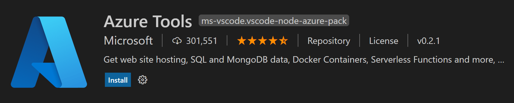

+++
title = "Deploy Java Apps"
date = 2024-01-12T22:36:24+08:00
weight = 100
type = "docs"
description = ""
isCJKLanguage = true
draft = false
+++

> 原文: [https://code.visualstudio.com/docs/java/java-on-azure](https://code.visualstudio.com/docs/java/java-on-azure)

# Deploy Java Web Apps 部署 Java Web 应用程序

The [Azure Tools](https://marketplace.visualstudio.com/items?itemName=ms-vscode.vscode-node-azure-pack) extension pack contains a rich set of extensions that make it easy to discover and interact with the cloud services that power your Java applications.

​​​	Azure 工具扩展包包含一组丰富的扩展，可轻松发现和交互为 Java 应用程序提供支持的云服务。

The extension pack supports the following development workflows:

​​​	扩展包支持以下开发工作流：

- Deploy Java applications (including containers) to [Azure App Service](https://azure.microsoft.com/services/app-service).
  将 Java 应用程序（包括容器）部署到 Azure App Service。
- Deploy Spring microservices to [Azure Spring Cloud](https://azure.microsoft.com/services/spring-cloud/).
  将 Spring 微服务部署到 Azure Spring Cloud。
- Deploy serverless code to [Azure Functions](https://azure.microsoft.com/services/functions).
  将无服务器代码部署到 Azure Functions。

If you are interested in a specific Azure service, you can also directly search for it on the [Visual Studio Code Marketplace](https://marketplace.visualstudio.com/VSCode) to see if there's an available extension.

​​​	如果您对某个特定的 Azure 服务感兴趣，您还可以在 Visual Studio Code Marketplace 上直接搜索它，以查看是否有可用的扩展。

## [Deployment tutorials 部署教程](https://code.visualstudio.com/docs/java/java-on-azure#_deployment-tutorials)

The following tutorials below walk you through the details. You can also check the [Java Azure Developer's Center](https://learn.microsoft.com/azure/developer/java) for all things on Azure for Java developers.

​​​	以下教程将详细介绍这些内容。您还可以查看 Java Azure 开发人员中心，了解 Java 开发人员在 Azure 上的所有内容。

| Tutorial 教程                                                | Description 说明                                             | Related Tools 相关工具                                       |
| :----------------------------------------------------------- | :----------------------------------------------------------- | :----------------------------------------------------------- |
| [Deploy Java web apps 将 Java Web 应用 to Azure App Service 部署到 Azure App Service](https://code.visualstudio.com/docs/java/java-webapp) | Deploy a web app to the cloud 将 Web 应用部署到云            | [Apache Maven](https://maven.apache.org/download.cgi) [Azure App Service Azure 应用服务](https://marketplace.visualstudio.com/items?itemName=ms-azuretools.vscode-azureappservice) |
| [Deploy Spring Boot apps 将 Spring Boot 应用 to Azure Spring Apps 部署到 Azure Spring Apps](https://code.visualstudio.com/docs/java/java-spring-apps) | Deploy a Spring Boot application 将 Spring Boot 应用程序 to Azure Spring Apps 部署到 Azure Spring Apps | [Apache Maven](https://maven.apache.org/download.cgi) [Azure Spring Apps](https://marketplace.visualstudio.com/items?itemName=vscjava.vscode-azurespringcloud) |
| [Create an Azure Functions project 使用 Visual Studio Code using Visual Studio Code 创建 Azure Functions 项目](https://learn.microsoft.com/azure/azure-functions/create-first-function-vs-code-java) | Deploy serverless code 使用 Azure Functions using Azure Functions Apache Maven | [Apache Maven Azure Functions 部署无服务器代码](https://maven.apache.org/download.cgi) [Azure Functions ](https://marketplace.visualstudio.com/items?itemName=ms-azuretools.vscode-azurefunctions) |

