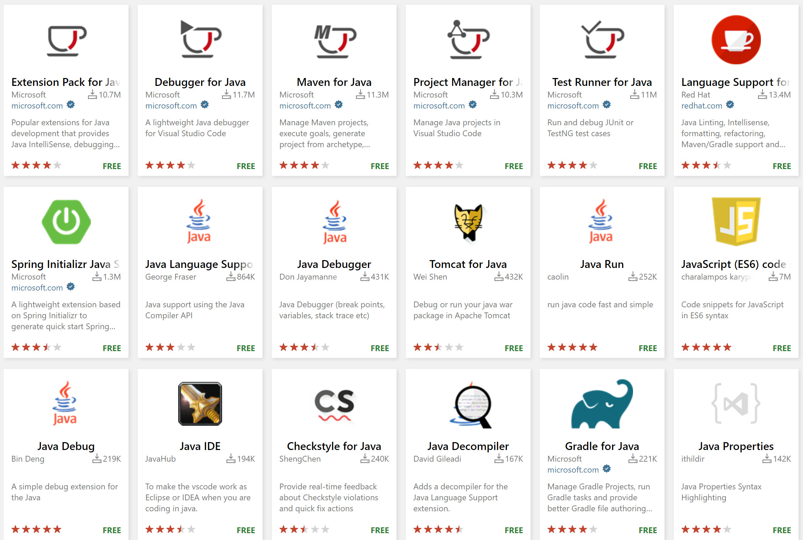

+++
title = "Extensions"
date = 2024-01-12T22:36:24+08:00
weight = 120
type = "docs"
description = ""
isCJKLanguage = true
draft = false
+++

> 原文: [https://code.visualstudio.com/docs/java/extensions](https://code.visualstudio.com/docs/java/extensions)

# Java extensions for Visual Studio Code 适用于 Visual Studio Code 的 Java 扩展

Thanks to the great Java community around Visual Studio Code, you can use a wide range of extensions to enhance your Java development experience.

​​​	借助 Visual Studio Code 周围强大的 Java 社区，您可以使用各种扩展来增强您的 Java 开发体验。

> **Tip:** To learn how to install and manage your extensions, refer to the general [VS Code extension documentation](https://code.visualstudio.com/docs/editor/extension-marketplace).
>
> ​​​	提示：若要了解如何安装和管理您的扩展，请参阅常规 VS Code 扩展文档。

In this topic, we recommend a list of popular extensions helpful for different Java development scenarios.

​​​	在此主题中，我们推荐一份对不同 Java 开发场景有帮助的常用扩展列表。

## [Fundamental Java development Java 基本开发](https://code.visualstudio.com/docs/java/extensions#_fundamental-java-development)

If you are looking for core Java development experience on Visual Studio Code (including Java code auto-completion, running / debugging / testing Java applications, Java project management, etc.), we recommend the [Extension Pack for Java](https://marketplace.visualstudio.com/items?itemName=vscjava.vscode-java-pack). This extension pack contains a list of popular Java extensions for fundamental Java development:

​​​	如果您正在寻找 Visual Studio Code 上的核心 Java 开发体验（包括 Java 代码自动完成、运行/调试/测试 Java 应用程序、Java 项目管理等），我们推荐 Java 扩展包。此扩展包包含用于基本 Java 开发的常用 Java 扩展列表：

1. [Language Support for Java™ by Red Hat
   Red Hat 提供的 Java™ 语言支持](https://marketplace.visualstudio.com/items?itemName=redhat.java)
2. [Debugger for Java
   Java 调试器](https://marketplace.visualstudio.com/items?itemName=vscjava.vscode-java-debug)
3. [Test Runner for Java
   Java 测试运行器](https://marketplace.visualstudio.com/items?itemName=vscjava.vscode-java-test)
4. [Maven for Java
   Java 的 Maven](https://marketplace.visualstudio.com/items?itemName=vscjava.vscode-maven)
5. [Project Manager for Java
   Java 项目管理器](https://marketplace.visualstudio.com/items?itemName=vscjava.vscode-java-dependency)
6. [Visual Studio IntelliCode](https://marketplace.visualstudio.com/items?itemName=VisualStudioExptTeam.vscodeintellicode)

[Install the Extension Pack for Java
安装 Java 扩展包](vscode:extension/vscjava.vscode-java-pack)

To get started with this extension pack, you can visit [Getting Started with Java](https://code.visualstudio.com/docs/java/java-tutorial) tutorial.

​​​	若要开始使用此扩展包，您可以访问 Java 入门教程。

You can also install the [SonarLint](https://marketplace.visualstudio.com/items?itemName=SonarSource.sonarlint-vscode) extension that detects quality and security issues in your code.

​​​	您还可以安装 SonarLint 扩展，它可以检测代码中的质量和安全问题。

## [Spring Boot extensions Spring Boot 扩展](https://code.visualstudio.com/docs/java/extensions#_spring-boot-extensions)

Spring Boot is an open source, microservice-based Java web framework that is very popular among Java developers. There are great extensions provided by VMware and Microsoft for Spring Boot development.

​​​	Spring Boot 是一个开源的、基于微服务的 Java Web 框架，在 Java 开发人员中非常受欢迎。VMware 和 Microsoft 为 Spring Boot 开发提供了出色的扩展。

We recommend installing the [Spring Boot Extension Pack](https://marketplace.visualstudio.com/items?itemName=vvmware.vscode-boot-dev-pack) that contains the following extensions:

​​​	我们建议安装包含以下扩展的 Spring Boot 扩展包：

1. [Spring Boot Tools](https://marketplace.visualstudio.com/items?itemName=vmware.vscode-spring-boot)
2. [Spring Initializr Java Support
   Spring Initializr Java 支持](https://marketplace.visualstudio.com/items?itemName=vscjava.vscode-spring-initializr)
3. [Spring Boot Dashboard](https://marketplace.visualstudio.com/items?itemName=vscjava.vscode-spring-boot-dashboard)

[Install the Spring Boot Extension Pack
安装 Spring Boot Extension Pack](vscode:extension/vmware.vscode-boot-dev-pack)

More Spring Boot related information can be found at the [Spring Boot](https://code.visualstudio.com/docs/java/java-spring-boot) page.

​​​	更多 Spring Boot 相关信息可在 Spring Boot 页面找到。

## [Gradle for Java 适用于 Java 的 Gradle](https://code.visualstudio.com/docs/java/extensions#_gradle-for-java)

Visual Studio Code offers support Gradle support via the [Gradle for Java](https://marketplace.visualstudio.com/items?itemName=vscjava.vscode-gradle) extension. To learn more how to use this extension, visit the [Gradle section](https://code.visualstudio.com/docs/java/java-build#_gradle) on Build Tools page.

​​​	Visual Studio Code 通过 Gradle for Java 扩展提供 Gradle 支持。要详细了解如何使用此扩展，请访问构建工具页面上的 Gradle 部分。

## [Application Servers (Tomcat / Jetty / etc.) 应用程序服务器（Tomcat/Jetty 等）](https://code.visualstudio.com/docs/java/extensions#_application-servers-tomcat-jetty-etc)

[Community Server Connectors](https://marketplace.visualstudio.com/items?itemName=redhat.vscode-community-server-connector) is an excellent extension for application servers such as Tomcat and Jetty.

​​​	Community Server Connectors 是适用于 Tomcat 和 Jetty 等应用程序服务器的出色扩展。

To learn more about how to work with Java application servers on Visual Studio Code, refer to the [Application Server](https://code.visualstudio.com/docs/java/java-tomcat-jetty) page.

​​​	要详细了解如何在 Visual Studio Code 上使用 Java 应用程序服务器，请参阅应用程序服务器页面。

## [MicroProfile / Quarkus MicroProfile/Quarkus](https://code.visualstudio.com/docs/java/extensions#_microprofile-quarkus)

Support for Eclipse MicroProfile and Quarkus are provided via the following extensions:

​​​	通过以下扩展提供对 Eclipse MicroProfile 和 Quarkus 的支持：

- [Extension pack for MicroProfile
  适用于 MicroProfile 的扩展包](https://marketplace.visualstudio.com/items?itemName=MicroProfile-Community.vscode-microprofile-pack)
- [Quarkus](https://marketplace.visualstudio.com/items?itemName=redhat.vscode-quarkus)

## [Keymaps for other Java IDEs 其他 Java IDE 的按键映射](https://code.visualstudio.com/docs/java/extensions#_keymaps-for-other-java-ides)

There are some extensions from the community for developers who might be used to the keyboard shortcuts from other Java IDEs.

​​​	社区中有一些扩展适用于习惯于其他 Java IDE 的键盘快捷键的开发者。

- [Eclipse Keymap
  Eclipse 按键映射](https://marketplace.visualstudio.com/items?itemName=alphabotsec.vscode-eclipse-keybindings)
- [IntelliJ IDEA Keybindings
  IntelliJ IDEA 按键绑定](https://marketplace.visualstudio.com/items?itemName=k--kato.intellij-idea-keybindings)

Keymap extensions apply keyboard shortcuts from other IDEs or editors on to VS Code so you don't have to retrain your fingers to new keyboard shortcuts.

​​​	按键映射扩展将其他 IDE 或编辑器的键盘快捷键应用到 VS Code 上，因此您不必重新训练手指来适应新的键盘快捷键。

## [Remote development and container support 远程开发和容器支持](https://code.visualstudio.com/docs/java/extensions#_remote-development-and-container-support)

We'd also like to recommend a couple of other extensions that are useful for remote and container development scenarios.

​​​	我们还推荐几个其他扩展，它们对远程和容器开发场景很有用。

- The [Remote Development](https://code.visualstudio.com/docs/remote/remote-overview) extensions let you use VS Code to access a container, a remote machine, or the Windows Subsystem for Linux.
  远程开发扩展允许您使用 VS Code 访问容器、远程计算机或适用于 Linux 的 Windows 子系统。
- You can use [Docker](https://marketplace.visualstudio.com/items?itemName=ms-azuretools.vscode-docker) extension to build docker images and work with image registries.
  您可以使用 Docker 扩展来构建 docker 镜像并使用镜像注册表。
- [Kubernetes](https://marketplace.visualstudio.com/items?itemName=ms-kubernetes-tools.vscode-kubernetes-tools) extension provides an Explorer view to manage clusters and the nodes inside. It also provides advanced syntax support for editing Kubernetes manifest files.
  Kubernetes 扩展提供了一个资源管理器视图，用于管理集群和内部节点。它还为编辑 Kubernetes 清单文件提供高级语法支持。
- [Live Share](https://marketplace.visualstudio.com/items?itemName=MS-vsliveshare.vsliveshare) is a great tool to use when you need to collaborate with someone else on the same code base.
  Live Share 是一个很棒的工具，当您需要与其他人协作使用相同的代码库时可以使用它。

## [Azure on Visual Studio Code Visual Studio Code 中的 Azure](https://code.visualstudio.com/docs/java/extensions#_azure-on-visual-studio-code)

The Azure extensions for Visual Studio Code provide seamless integration with Azure and the cloud. There are a few Azure extensions we'd like to recommend.

​​​	适用于 Visual Studio Code 的 Azure 扩展提供与 Azure 和云的无缝集成。我们想推荐几个 Azure 扩展。

### [Team development 团队开发](https://code.visualstudio.com/docs/java/extensions#_team-development)

- The [Azure Repos](https://marketplace.visualstudio.com/items?itemName=ms-vsts.team) extension makes it easy to connect to your Azure DevOps Servers, allowing you to easily monitor builds, pull requests, and work items for your TFVC or Git source repositories.
  Azure Repos 扩展可以轻松连接到 Azure DevOps 服务器，允许您轻松监视 TFVC 或 Git 源存储库的生成、拉取请求和工作项。

### [Internet of Things 物联网](https://code.visualstudio.com/docs/java/extensions#_internet-of-things)

- The [Azure IoT Toolkit](https://marketplace.visualstudio.com/items?itemName=vsciot-vscode.azure-iot-toolkit) for VS Code makes it easy to develop and connect your [IoT applications to Azure](https://learn.microsoft.com/azure/?product=iot). With this extension, you can interact with Azure IoT Hub, manage devices connected to Azure IoT Hub, and develop with code snippets for Azure IoT Hub.
  适用于 VS Code 的 Azure IoT 工具包可以轻松地将您的 IoT 应用程序开发并连接到 Azure。借助此扩展，您可以与 Azure IoT 中心交互，管理连接到 Azure IoT 中心设备，并使用 Azure IoT 中心代码段进行开发。

### [General tools 常规工具](https://code.visualstudio.com/docs/java/extensions#_general-tools)

- The [Azure Tools Extension Pack](https://marketplace.visualstudio.com/items?itemName=ms-vscode.vscode-node-azure-pack) provides a rich set of extensions that makes it easy to discover and interact with Azure services to power your applications.
  Azure 工具扩展包提供了一套丰富的扩展，可以轻松发现和与 Azure 服务进行交互，为您的应用程序提供支持。
- The [Azure Resource Manager Tools](https://marketplace.visualstudio.com/items?itemName=msazurermtools.azurerm-vscode-tools) provide a rich editing experience for Azure Resource Manager deployment templates and template language expressions. For example, IntelliSense for TLE function names, parameter references, signature help, Go to Definition, Peek Definition, and Peek References as well as Errors and Warnings, making it quick and easy to author Azure Resource Manager templates in VS Code.
  Azure Resource Manager 工具为 Azure Resource Manager 部署模板和模板语言表达式提供了丰富的编辑体验。例如，TLE 函数名称、参数引用、签名帮助、转到定义、查看定义和查看引用以及错误和警告的 IntelliSense，使在 VS Code 中创作 Azure Resource Manager 模板变得快速而轻松。

Visit [Azure Extensions](https://code.visualstudio.com/docs/azure/extensions) to find more Azure extensions.

​​​	访问 Azure 扩展以查找更多 Azure 扩展。

## [Search for other Java extensions 搜索其他 Java 扩展](https://code.visualstudio.com/docs/java/extensions#_search-for-other-java-extensions)

If the extensions above do not meet your requirement, you can also search for other Java related extensions within Visual Studio Code. Here are the steps:

​​​	如果上述扩展不满足您的要求，您还可以在 Visual Studio Code 中搜索其他与 Java 相关的扩展。步骤如下：

1. Go to the **Extensions** view (Ctrl+Shift+X).
   转到扩展视图 (Ctrl+Shift+X)。
2. Filter the extensions list by typing "java".
   通过键入“java”来筛选扩展列表。

We also appreciate contributions to any of our existing extensions and we hope you'll create new Java extensions if you don't find what you're looking for in the Marketplace.

​​​	我们也欢迎对我们任何现有扩展的贡献，如果您在应用商店中找不到您要查找的内容，我们希望您能创建新的 Java 扩展。
