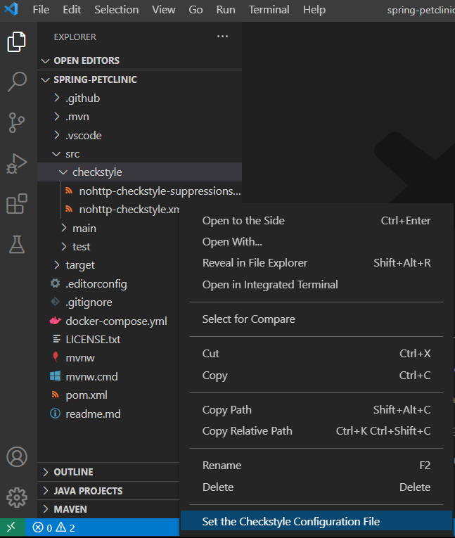
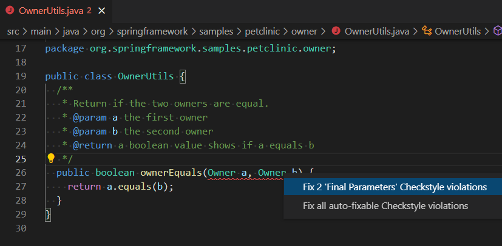

+++
title = "Formatting and Linting"
date = 2024-01-12T22:36:24+08:00
weight = 30
type = "docs"
description = ""
isCJKLanguage = true
draft = false
+++

> 原文: [https://code.visualstudio.com/docs/java/java-linting](https://code.visualstudio.com/docs/java/java-linting)

# Java formatting and linting Java 格式化和检查


[Language Support for Java™ by Red Hat](https://marketplace.visualstudio.com/items?itemName=redhat.java) also provides [formatting settings](https://github.com/redhat-developer/vscode-java/wiki/Formatter-settings). You can export an Eclipse formatter file and then use it for your project in VS Code.

&zeroWidthSpace;Red Hat 提供的 Java™ 语言支持还提供格式设置。您可以导出 Eclipse 格式化程序文件，然后在 VS Code 中将其用于您的项目。

In addition, there are also the [Checkstyle for Java](https://marketplace.visualstudio.com/items?itemName=shengchen.vscode-checkstyle) and [SonarLint](https://marketplace.visualstudio.com/items?itemName=SonarSource.sonarlint-vscode) extensions, which provide features for live linting and code analysis.

&zeroWidthSpace;此外，还有 Checkstyle for Java 和 SonarLint 扩展，它们提供实时 linting 和代码分析功能。

## [Formatter 格式化程序](https://code.visualstudio.com/docs/java/java-linting#_formatter)

You can use **Format Document** command to format a Java file. If you didn't specify a formatter profile before, the Java file will be formatted using default settings.

&zeroWidthSpace;您可以使用“格式化文档”命令来格式化 Java 文件。如果您之前未指定格式化程序配置文件，则 Java 文件将使用默认设置进行格式化。

<video autoplay="" loop="" muted="" playsinline="" controls="" video="Format document" data-immersive-translate-walked="57fb2d05-b36a-49f2-8ecf-ef3f2b556c57" style="box-sizing: border-box; font-family: &quot;Segoe UI&quot;, &quot;Helvetica Neue&quot;, Helvetica, Arial, sans-serif; display: inline-block; vertical-align: baseline; margin-top: 1.5rem; margin-bottom: 2.5rem; width: 616.662px; max-width: 100%; color: rgb(36, 36, 36); font-size: 16px; font-style: normal; font-variant-ligatures: normal; font-variant-caps: normal; font-weight: 400; letter-spacing: normal; orphans: 2; text-align: start; text-indent: 0px; text-transform: none; widows: 2; word-spacing: 0px; -webkit-text-stroke-width: 0px; white-space: normal; background-color: rgb(255, 255, 255); text-decoration-thickness: initial; text-decoration-style: initial; text-decoration-color: initial;"></video>


### [Applying formatter settings 应用格式化程序设置](https://code.visualstudio.com/docs/java/java-linting#_applying-formatter-settings)

You can easily apply formatter settings from an existing formatter profile in Eclipse scheme. For example, if you want to apply [Google Style](https://raw.githubusercontent.com/google/styleguide/gh-pages/eclipse-java-google-style.xml) for your Java project, then you can set the following property in `settings.json`:

&zeroWidthSpace;您可以轻松地从 Eclipse 方案中的现有格式化程序配置文件应用格式化程序设置。例如，如果您想为您的 Java 项目应用 Google 样式，则可以在 `settings.json` 中设置以下属性：

```
"java.format.settings.url": "https://raw.githubusercontent.com/google/styleguide/gh-pages/eclipse-java-google-style.xml",
```

The property can be set to a URL or a local file path. If the formatter XML file contains more than one profile, you can specify the profile name:

&zeroWidthSpace;该属性可以设置为 URL 或本地文件路径。如果格式化程序 XML 文件包含多个配置文件，则可以指定配置文件名称：

```
"java.format.settings.profile": "GoogleStyle",
```

After setting the formatter profile, the **Format Document** command will use the specific profile to format your Java files.

&zeroWidthSpace;设置格式化程序配置文件后，“格式化文档”命令将使用特定配置文件来格式化您的 Java 文件。

### [Editing formatter settings 编辑格式化程序设置](https://code.visualstudio.com/docs/java/java-linting#_editing-formatter-settings)

The [Extension Pack for Java](https://marketplace.visualstudio.com/items?itemName=vscjava.vscode-java-pack) provides an editor to help users edit an existing formatter profile. You can open the editor with the command **Java: Open Java Formatter Settings with Preview**. In the editor, you can change the formatter settings and preview the effects. After saving the current editor, the changes will be saved to the formatter profile.

&zeroWidthSpace;Java 扩展包提供了一个编辑器，帮助用户编辑现有的格式化程序配置文件。您可以使用命令 Java: 打开 Java 格式化程序设置（带预览）打开编辑器。在编辑器中，您可以更改格式化程序设置并预览效果。保存当前编辑器后，更改内容将保存到格式化程序配置文件。

<video autoplay="" loop="" muted="" playsinline="" controls="" title="Editing formatter settings" data-immersive-translate-walked="57fb2d05-b36a-49f2-8ecf-ef3f2b556c57" style="box-sizing: border-box; font-family: &quot;Segoe UI&quot;, &quot;Helvetica Neue&quot;, Helvetica, Arial, sans-serif; display: inline-block; vertical-align: baseline; margin-top: 1.5rem; margin-bottom: 2.5rem; width: 616.662px; max-width: 100%; color: rgb(36, 36, 36); font-size: 16px; font-style: normal; font-variant-ligatures: normal; font-variant-caps: normal; font-weight: 400; letter-spacing: normal; orphans: 2; text-align: start; text-indent: 0px; text-transform: none; widows: 2; word-spacing: 0px; -webkit-text-stroke-width: 0px; white-space: normal; background-color: rgb(255, 255, 255); text-decoration-thickness: initial; text-decoration-style: initial; text-decoration-color: initial;"></video>


> Note: the formatter settings editor supports only local formatter profile. If your workspace contains a remote formatter profile, it will guide you to download it in `.vscode` folder.
>
> &zeroWidthSpace;注意：格式化程序设置编辑器仅支持本地格式化程序配置文件。如果您的工作区包含远程格式化程序配置文件，它将指导您在 `.vscode` 文件夹中下载它。

When editing settings in the editor, you can preview the changes' effects in the right **Preview** panel.

&zeroWidthSpace;在编辑器中编辑设置时，您可以在右侧的预览面板中预览更改的效果。

<video autoplay="" loop="" muted="" playsinline="" controls="" title="Preview formatting effects" data-immersive-translate-walked="57fb2d05-b36a-49f2-8ecf-ef3f2b556c57" style="box-sizing: border-box; font-family: &quot;Segoe UI&quot;, &quot;Helvetica Neue&quot;, Helvetica, Arial, sans-serif; display: inline-block; vertical-align: baseline; margin-top: 1.5rem; margin-bottom: 2.5rem; width: 616.662px; max-width: 100%; color: rgb(36, 36, 36); font-size: 16px; font-style: normal; font-variant-ligatures: normal; font-variant-caps: normal; font-weight: 400; letter-spacing: normal; orphans: 2; text-align: start; text-indent: 0px; text-transform: none; widows: 2; word-spacing: 0px; -webkit-text-stroke-width: 0px; white-space: normal; background-color: rgb(255, 255, 255); text-decoration-thickness: initial; text-decoration-style: initial; text-decoration-color: initial;"></video>


You can also undo and redo changes.

&zeroWidthSpace;您还可以撤消和重做更改。

<video autoplay="" loop="" muted="" playsinline="" controls="" title="Undo and redo changes to formatting effects" data-immersive-translate-walked="57fb2d05-b36a-49f2-8ecf-ef3f2b556c57" style="box-sizing: border-box; font-family: &quot;Segoe UI&quot;, &quot;Helvetica Neue&quot;, Helvetica, Arial, sans-serif; display: inline-block; vertical-align: baseline; margin-top: 1.5rem; margin-bottom: 2.5rem; width: 616.662px; max-width: 100%; color: rgb(36, 36, 36); font-size: 16px; font-style: normal; font-variant-ligatures: normal; font-variant-caps: normal; font-weight: 400; letter-spacing: normal; orphans: 2; text-align: start; text-indent: 0px; text-transform: none; widows: 2; word-spacing: 0px; -webkit-text-stroke-width: 0px; white-space: normal; background-color: rgb(255, 255, 255); text-decoration-thickness: initial; text-decoration-style: initial; text-decoration-color: initial;"></video>


## [SonarLint](https://code.visualstudio.com/docs/java/java-linting#_sonarlint)

[SonarLint](https://marketplace.visualstudio.com/items?itemName=SonarSource.sonarlint-vscode) is an easy-to-use extension that helps you find and fix bugs and security issues as you code. The extension runs in the background and, just like a spell checker, highlights source code issues that pose a quality or security concern. The extension not only tells you what the issue is but also provides in-context guidance on why it's harmful and how to fix it, with examples. The extension supports over [500+ Java rules](https://rules.sonarsource.com/java) and includes several [Quick Fixes](https://rules.sonarsource.com/java/quickfix) to automatically fix certain quality issues.

&zeroWidthSpace;SonarLint 是一个易于使用的扩展，可帮助您在编码时查找并修复错误和安全问题。该扩展在后台运行，就像拼写检查器一样，突出显示会对质量或安全性造成影响的源代码问题。该扩展不仅会告诉您问题是什么，还会提供有关为什么它有害以及如何修复它的上下文指导，并提供示例。该扩展支持 500 多条 Java 规则，并包含多个快速修复程序，可自动修复某些质量问题。

### [Code analysis on the fly 即时代码分析](https://code.visualstudio.com/docs/java/java-linting#_code-analysis-on-the-fly)

Issues are highlighted directly in the editor with hovers to provide detailed explanations.

&zeroWidthSpace;问题直接在编辑器中突出显示，并提供详细说明的悬停。

<video autoplay="" loop="" muted="" playsinline="" controls="" title="Code analysis on the fly" data-immersive-translate-walked="57fb2d05-b36a-49f2-8ecf-ef3f2b556c57" style="box-sizing: border-box; font-family: &quot;Segoe UI&quot;, &quot;Helvetica Neue&quot;, Helvetica, Arial, sans-serif; display: inline-block; vertical-align: baseline; margin-top: 1.5rem; margin-bottom: 2.5rem; width: 616.662px; max-width: 100%; color: rgb(36, 36, 36); font-size: 16px; font-style: normal; font-variant-ligatures: normal; font-variant-caps: normal; font-weight: 400; letter-spacing: normal; orphans: 2; text-align: start; text-indent: 0px; text-transform: none; widows: 2; word-spacing: 0px; -webkit-text-stroke-width: 0px; white-space: normal; background-color: rgb(255, 255, 255); text-decoration-thickness: initial; text-decoration-style: initial; text-decoration-color: initial;"></video>


Issues found in the opened file can also be reviewed through the Problems panel of VS Code. When applicable, secondary code locations are mentioned so you can understand where the issue originates from (for example, the code path that led to a bug).

&zeroWidthSpace;在打开的文件中发现的问题也可以通过 VS Code 的“问题”面板进行查看。在适用时，会提及次要代码位置，以便您可以了解问题源自何处（例如，导致错误的代码路径）。

### [Rule documentation and remediation guidance 规则文档和补救指南](https://code.visualstudio.com/docs/java/java-linting#_rule-documentation-and-remediation-guidance)

For any issues detected, SonarLint provides full documentation about the rule that was violated, and the best coding practice it relates to. This allows you to understand why an issue is raised, and how to fix it.

&zeroWidthSpace;对于检测到的任何问题，SonarLint 会提供有关违反的规则以及它所涉及的最佳编码实践的完整文档。这使您可以了解引发问题的原因以及如何修复它。

<video autoplay="" loop="" muted="" playsinline="" controls="" title="Rule documentation and remediation guidance" data-immersive-translate-walked="57fb2d05-b36a-49f2-8ecf-ef3f2b556c57" style="box-sizing: border-box; font-family: &quot;Segoe UI&quot;, &quot;Helvetica Neue&quot;, Helvetica, Arial, sans-serif; display: inline-block; vertical-align: baseline; margin-top: 1.5rem; margin-bottom: 2.5rem; width: 616.662px; max-width: 100%; color: rgb(36, 36, 36); font-size: 16px; font-style: normal; font-variant-ligatures: normal; font-variant-caps: normal; font-weight: 400; letter-spacing: normal; orphans: 2; text-align: start; text-indent: 0px; text-transform: none; widows: 2; word-spacing: 0px; -webkit-text-stroke-width: 0px; white-space: normal; background-color: rgb(255, 255, 255); text-decoration-thickness: initial; text-decoration-style: initial; text-decoration-color: initial;"></video>


### [Enabling more quality and security rules 启用更多质量和安全规则](https://code.visualstudio.com/docs/java/java-linting#_enabling-more-quality-and-security-rules)

By default, SonarLint provides a wide array of rules to detect bugs and vulnerabilities. More checks can be enabled through the **SonarLint Rules** view.

&zeroWidthSpace;默认情况下，SonarLint 提供了广泛的规则来检测错误和漏洞。可以通过 SonarLint 规则视图启用更多检查。

<video autoplay="" loop="" muted="" playsinline="" controls="" title="Enabling more quality and security rules" data-immersive-translate-walked="57fb2d05-b36a-49f2-8ecf-ef3f2b556c57" style="box-sizing: border-box; font-family: &quot;Segoe UI&quot;, &quot;Helvetica Neue&quot;, Helvetica, Arial, sans-serif; display: inline-block; vertical-align: baseline; margin-top: 1.5rem; margin-bottom: 2.5rem; width: 616.662px; max-width: 100%; color: rgb(36, 36, 36); font-size: 16px; font-style: normal; font-variant-ligatures: normal; font-variant-caps: normal; font-weight: 400; letter-spacing: normal; orphans: 2; text-align: start; text-indent: 0px; text-transform: none; widows: 2; word-spacing: 0px; -webkit-text-stroke-width: 0px; white-space: normal; background-color: rgb(255, 255, 255); text-decoration-thickness: initial; text-decoration-style: initial; text-decoration-color: initial;"></video>


For more details about the [SonarLint for VS Code extension](https://marketplace.visualstudio.com/items?itemName=SonarSource.sonarlint-vscode), visit the [SonarLint website](https://www.sonarlint.org/vscode/).

&zeroWidthSpace;有关 SonarLint for VS Code 扩展的更多详细信息，请访问 SonarLint 网站。

## [Checkstyle](https://code.visualstudio.com/docs/java/java-linting#_checkstyle)

With the [Checkstyle for Java](https://marketplace.visualstudio.com/items?itemName=shengchen.vscode-checkstyle) extension, you can use either existing `checkstyle` configurations (Google's or Sun's Check) or your own customized files for your project. When editing a Java file, the extension will check the file format and provide Quick Fixes if possible on the fly.

&zeroWidthSpace;使用 Checkstyle for Java 扩展，您可以使用现有的 `checkstyle` 配置（Google 或 Sun 的检查）或您自己的自定义文件来进行项目。在编辑 Java 文件时，扩展将检查文件格式，并在可能时即时提供快速修复。

Set Checkstyle configuration file using the **Checkstyle: Set the Checkstyle Configuration File** command and selecting the Checkstyle file from the dropdown.

&zeroWidthSpace;使用 Checkstyle：设置 Checkstyle 配置文件命令并从下拉列表中选择 Checkstyle 文件，设置 Checkstyle 配置文件。Java 的 Checkstyle 扩展支持实时检查。

<video autoplay="" loop="" muted="" playsinline="" controls="" title="Set checkstyle configuration file command" data-immersive-translate-walked="57fb2d05-b36a-49f2-8ecf-ef3f2b556c57" style="box-sizing: border-box; font-family: &quot;Segoe UI&quot;, &quot;Helvetica Neue&quot;, Helvetica, Arial, sans-serif; display: inline-block; vertical-align: baseline; margin-top: 1.5rem; margin-bottom: 2.5rem; width: 616.662px; max-width: 100%; color: rgb(36, 36, 36); font-size: 16px; font-style: normal; font-variant-ligatures: normal; font-variant-caps: normal; font-weight: 400; letter-spacing: normal; orphans: 2; text-align: start; text-indent: 0px; text-transform: none; widows: 2; word-spacing: 0px; -webkit-text-stroke-width: 0px; white-space: normal; background-color: rgb(255, 255, 255); text-decoration-thickness: initial; text-decoration-style: initial; text-decoration-color: initial;"></video>


The [Checkstyle for Java](https://marketplace.visualstudio.com/items?itemName=shengchen.vscode-checkstyle) extension supports live linting.

&zeroWidthSpace;和批处理检查。

<video autoplay="" loop="" muted="" playsinline="" controls="" title="Live linting" data-immersive-translate-walked="57fb2d05-b36a-49f2-8ecf-ef3f2b556c57" style="box-sizing: border-box; font-family: &quot;Segoe UI&quot;, &quot;Helvetica Neue&quot;, Helvetica, Arial, sans-serif; display: inline-block; vertical-align: baseline; margin-top: 1.5rem; margin-bottom: 2.5rem; width: 616.662px; max-width: 100%; color: rgb(36, 36, 36); font-size: 16px; font-style: normal; font-variant-ligatures: normal; font-variant-caps: normal; font-weight: 400; letter-spacing: normal; orphans: 2; text-align: start; text-indent: 0px; text-transform: none; widows: 2; word-spacing: 0px; -webkit-text-stroke-width: 0px; white-space: normal; background-color: rgb(255, 255, 255); text-decoration-thickness: initial; text-decoration-style: initial; text-decoration-color: initial;"></video>


And batch check.

&zeroWidthSpace;单击状态栏中的 Checkstyle 状态图标时，问题面板将打开。

<video autoplay="" loop="" muted="" playsinline="" controls="" title="Batch check" data-immersive-translate-walked="57fb2d05-b36a-49f2-8ecf-ef3f2b556c57" style="box-sizing: border-box; font-family: &quot;Segoe UI&quot;, &quot;Helvetica Neue&quot;, Helvetica, Arial, sans-serif; display: inline-block; vertical-align: baseline; margin-top: 1.5rem; margin-bottom: 2.5rem; width: 616.662px; max-width: 100%; color: rgb(36, 36, 36); font-size: 16px; font-style: normal; font-variant-ligatures: normal; font-variant-caps: normal; font-weight: 400; letter-spacing: normal; orphans: 2; text-align: start; text-indent: 0px; text-transform: none; widows: 2; word-spacing: 0px; -webkit-text-stroke-width: 0px; white-space: normal; background-color: rgb(255, 255, 255); text-decoration-thickness: initial; text-decoration-style: initial; text-decoration-color: initial;"></video>


The Problems panel will open when you click the Checkstyle status icon in the Status bar.

&zeroWidthSpace;设置 Checkstyle 配置文件

### [Set Checkstyle configuration file 要设置配置文件，请右键单击 文件，然后选择设置 Checkstyle 配置文件。](https://code.visualstudio.com/docs/java/java-linting#_set-checkstyle-configuration-file)

To set the configuration file, right-click the `.xml` file and select **Set the Checkstyle Configuration File**.

&zeroWidthSpace;您还可以触发命令 Checkstyle：设置 Checkstyle 配置文件，以便在文件资源管理器中选择配置文件。该扩展在您的工作区中查找 `.xml` 文件，以简化 Checkstyle 配置。您还将看到两个内置配置：



You can also trigger the command **Checkstyle: Set Checkstyle Configuration File** to choose the configuration file in the File Explorer. The extension looks for a `checkstyle.xml` file in your workspace to make Checkstyle configuration easier. You will also see the two built-in configurations:

&zeroWidthSpace;Google 的检查

- **Google's Check
  Sun 的检查**
- **Sun's Check
  命令 Checkstyle：设置 Checkstyle 配置文件会检测潜在的 Checkstyle 配置文件并将其列出。您还可以通过直接在输入框中编写 URL 来提供配置文件。**

The command **Checkstyle: Set the Checkstyle Configuration** detects potential **Checkstyle** configuration files and lists them. You can also provide a configuration file by directly writing a URL in the input box.

<video autoplay="" loop="" muted="" playsinline="" controls="" title="Set checkstyle configuration" data-immersive-translate-walked="57fb2d05-b36a-49f2-8ecf-ef3f2b556c57" style="box-sizing: border-box; font-family: &quot;Segoe UI&quot;, &quot;Helvetica Neue&quot;, Helvetica, Arial, sans-serif; display: inline-block; vertical-align: baseline; margin-top: 1.5rem; margin-bottom: 2.5rem; width: 616.662px; max-width: 100%; color: rgb(36, 36, 36); font-size: 16px; font-style: normal; font-variant-ligatures: normal; font-variant-caps: normal; font-weight: 400; letter-spacing: normal; orphans: 2; text-align: start; text-indent: 0px; text-transform: none; widows: 2; word-spacing: 0px; -webkit-text-stroke-width: 0px; white-space: normal; background-color: rgb(255, 255, 255); text-decoration-thickness: initial; text-decoration-style: initial; text-decoration-color: initial;"></video>


You can also set the Checkstyle version by using the command **Checkstyle: Set the Checkstyle Version**.

&zeroWidthSpace;您还可以使用命令 Checkstyle：设置 Checkstyle 版本来设置 Checkstyle 版本。

The command will:

&zeroWidthSpace;该命令将：

- List the latest Checkstyle version from the main repo.
  列出主仓库中的最新 Checkstyle 版本。
- List all the downloaded versions.
  列出所有已下载的版本。
- List all the supported versions.
  列出所有受支持的版本。
- Mark the currently used version with a check symbol.
  使用复选符号标记当前使用的版本。

In addition, you can also bring any 3rd-party modules for Checkstyle by configuring its path. For example, after using the configuration below, you can add `<module name="SingleBreakOrContinueCheck"/>` or `<module name="com.github.sevntu.checkstyle.checks.naming.SingleBreakOrContinueCheck"/>` to `checkstyle.xml` to use those checks.

&zeroWidthSpace;此外，您还可以通过配置 Checkstyle 的路径来引入任何第三方模块。例如，在使用以下配置后，您可以将 `<module name="SingleBreakOrContinueCheck"/>` 或 `<module name="com.github.sevntu.checkstyle.checks.naming.SingleBreakOrContinueCheck"/>` 添加到 `checkstyle.xml` 以使用这些检查。

```
"java.checkstyle.modules": [ "${workspaceFolder}/src/main/resources/sevntu-checks-1.35.0.jar" ]
```

### [Check the style and fix the violations 检查样式并修复违规行为](https://code.visualstudio.com/docs/java/java-linting#_check-the-style-and-fix-the-violations)

When editing a Java file, the extension will check the file format and provide Quick Fixes if possible. You can click the lightbulb button in the editor to show the available Quick Fixes.

&zeroWidthSpace;在编辑 Java 文件时，扩展程序将检查文件格式，并在可能的情况下提供快速修复。您可以在编辑器中单击灯泡按钮以显示可用的快速修复。



For more details about [Checkstyle for Java](https://marketplace.visualstudio.com/items?itemName=shengchen.vscode-checkstyle), visit its [GitHub Repository](https://github.com/jdneo/vscode-checkstyle).

&zeroWidthSpace;有关 Java Checkstyle 的更多详细信息，请访问其 GitHub 存储库。
