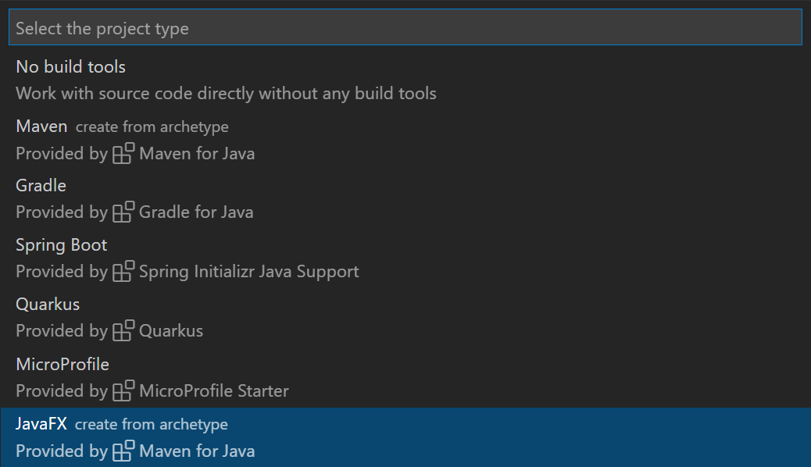

+++
title = "GUI Applications"
date = 2024-01-12T22:36:24+08:00
weight = 110
type = "docs"
description = ""
isCJKLanguage = true
draft = false
+++

> 原文: [https://code.visualstudio.com/docs/java/java-gui](https://code.visualstudio.com/docs/java/java-gui)

# Working with GUI applications in VS Code 在 VS Code 中使用 GUI 应用程序


You can develop Java GUI applications in Visual Studio Code easily. To achieve that, you need to install the [Extension Pack for Java](https://marketplace.visualstudio.com/items?itemName=vscjava.vscode-java-pack), which includes all the required extensions to develop Java GUI applications.

&zeroWidthSpace;您可以在 Visual Studio Code 中轻松开发 Java GUI 应用程序。要实现此目的，您需要安装 Java 扩展包，其中包含开发 Java GUI 应用程序所需的所有扩展。

[Install the Extension Pack for Java
安装 Java 扩展包](vscode:extension/vscjava.vscode-java-pack)

If you run into any issues when using the features below, you can contact us by entering an [issue](https://github.com/microsoft/vscode-java-pack/issues).

&zeroWidthSpace;如果您在使用以下功能时遇到任何问题，可以通过输入问题与我们联系。

## [Develop JavaFX applications 开发 JavaFX 应用程序](https://code.visualstudio.com/docs/java/java-gui#_develop-javafx-applications)

### [Create a new JavaFX project 创建新的 JavaFX 项目](https://code.visualstudio.com/docs/java/java-gui#_create-a-new-javafx-project)

You can create a new JavaFX application with just a few steps in VS Code:

&zeroWidthSpace;您只需在 VS Code 中执行几个步骤即可创建一个新的 JavaFX 应用程序：

- Step 1: Install the [Extension Pack for Java](https://marketplace.visualstudio.com/items?itemName=vscjava.vscode-java-pack).
  步骤 1：安装 Java 扩展包。
- Step 2: In Visual Studio Code, open the Command Palette (Ctrl+Shift+P) and then select the command **Java: Create Java Project**.
  步骤 2：在 Visual Studio Code 中，打开命令面板 (Ctrl+Shift+P)，然后选择命令 Java：创建 Java 项目。
- Step 3: Select the option **JavaFX** in the list, follow the wizard, which will help you scaffold a new JavaFX project via Maven Archetype.
  步骤 3：在列表中选择 JavaFX 选项，按照向导进行操作，该向导将帮助您通过 Maven Archetype 创建一个新的 JavaFX 项目。



### [Run the JavaFX application 运行 JavaFX 应用程序](https://code.visualstudio.com/docs/java/java-gui#_run-the-javafx-application)

> Note: The following guidance only works for projects managed by Maven. The generated project requires at least JDK 11 to launch it. Please make sure you have JDK 11 installed locally and set the installation path to the setting [`java.configuration.runtimes`](https://github.com/redhat-developer/vscode-java#project-jdks).
>
> &zeroWidthSpace;注意：以下指南仅适用于由 Maven 管理的项目。生成的项目至少需要 JDK 11 才能启动。请确保您已在本地安装 JDK 11，并将安装路径设置为设置 `java.configuration.runtimes` 。

To run the JavaFX application, you can open the **Maven** Explorer, expand `hellofx` > `Plugins` > `javafx` and run the Maven goal: `javafx:run`.

&zeroWidthSpace;要运行 JavaFX 应用程序，您可以打开 Maven Explorer，展开 `hellofx` > `Plugins` > `javafx` 并运行 Maven 目标： `javafx:run` 。

> **Note**: Make sure you have installed the [Maven for Java](https://marketplace.visualstudio.com/items?itemName=vscjava.vscode-maven) extension. If you cannot find the **Maven** explorer, open the Command Palette (Ctrl+Shift+P) and then select the command **Explorer: Focus on Maven View**.
>
> &zeroWidthSpace;注意：确保已安装适用于 Java 的 Maven 扩展。如果您找不到 Maven 资源管理器，请打开命令面板 (Ctrl+Shift+P)，然后选择命令资源管理器：关注 Maven 视图。

<video autoplay="" loop="" muted="" playsinline="" controls="" title="Run JavaFX application" data-immersive-translate-walked="591205ba-d140-4838-96fd-58e72a1f3e10" style="box-sizing: border-box; font-family: &quot;Segoe UI&quot;, &quot;Helvetica Neue&quot;, Helvetica, Arial, sans-serif; display: inline-block; vertical-align: baseline; margin-top: 1.5rem; margin-bottom: 2.5rem; width: 616.662px; max-width: 100%; color: rgb(36, 36, 36); font-size: 16px; font-style: normal; font-variant-ligatures: normal; font-variant-caps: normal; font-weight: 400; letter-spacing: normal; orphans: 2; text-align: start; text-indent: 0px; text-transform: none; widows: 2; word-spacing: 0px; -webkit-text-stroke-width: 0px; white-space: normal; background-color: rgb(255, 255, 255); text-decoration-thickness: initial; text-decoration-style: initial; text-decoration-color: initial;"></video>


### [More JavaFX examples 更多 JavaFX 示例](https://code.visualstudio.com/docs/java/java-gui#_more-javafx-examples)

More JavaFX project examples can be found in the [openjfx samples repository](https://github.com/openjfx/samples/tree/master/IDE/VSCode), which covers different project structures (such as Gradle and unmanaged folder projects). There is documentation on each sample to describe how to run the program.

&zeroWidthSpace;可以在 openjfx 示例存储库中找到更多 JavaFX 项目示例，其中涵盖了不同的项目结构（例如 Gradle 和非托管文件夹项目）。每个示例都有文档，用于描述如何运行程序。

## [Develop AWT applications 开发 AWT 应用程序](https://code.visualstudio.com/docs/java/java-gui#_develop-awt-applications)

By default, the types from the Abstract Window Toolkit (AWT) are hidden. You may notice that code completions are not working when you are developing an AWT application. To enable completions, you can open the Command Palette (Ctrl+Shift+P) and then select the command **Java: Help Center**. Go to the **Student** section and select **Enable AWT Development**.

&zeroWidthSpace;默认情况下，Abstract Window Toolkit (AWT) 中的类型处于隐藏状态。您可能会注意到，在开发 AWT 应用程序时代码补全不起作用。若要启用补全，您可以打开命令面板 (Ctrl+Shift+P)，然后选择命令 Java：帮助中心。转到学生部分，然后选择启用 AWT 开发。

<video autoplay="" loop="" muted="" playsinline="" controls="" title="Develop AWT application" data-immersive-translate-walked="591205ba-d140-4838-96fd-58e72a1f3e10" style="box-sizing: border-box; font-family: &quot;Segoe UI&quot;, &quot;Helvetica Neue&quot;, Helvetica, Arial, sans-serif; display: inline-block; vertical-align: baseline; margin-top: 1.5rem; margin-bottom: 2.5rem; width: 616.662px; max-width: 100%; color: rgb(36, 36, 36); font-size: 16px; font-style: normal; font-variant-ligatures: normal; font-variant-caps: normal; font-weight: 400; letter-spacing: normal; orphans: 2; text-align: start; text-indent: 0px; text-transform: none; widows: 2; word-spacing: 0px; -webkit-text-stroke-width: 0px; white-space: normal; background-color: rgb(255, 255, 255); text-decoration-thickness: initial; text-decoration-style: initial; text-decoration-color: initial;"></video>


> Note: This action will update a setting, `java.completion.filteredTypes` at the workspace level in `.vscode\settings.json`, so please make sure a workspace is opened in VS Code.
>
> &zeroWidthSpace;注意：此操作将更新设置， `java.completion.filteredTypes` 在 `.vscode\settings.json` 中处于工作区级别，因此请确保在 VS Code 中打开了某个工作区。

You can use the sample code below to run a simple Java AWT application in VS Code.

&zeroWidthSpace;您可以使用以下示例代码在 VS Code 中运行简单的 Java AWT 应用程序。

```
import java.awt.*;
import java.awt.event.*;

public class AwtExample extends Frame {
  public AwtExample() {
    Button btn = new Button("Button");
    btn.setBounds(50, 50, 50, 50);
    add(btn);
    setSize(150, 150);
    setTitle("This is my First AWT example");
    setLayout(new FlowLayout());
    setVisible(true);
    addWindowListener(new WindowAdapter() {
        public void windowClosing(WindowEvent we) {
            dispose();
        }
    });
  }

  public static void main(String args[]){
    new AwtExample();
  }
}
```

## [Develop Swing applications 开发 Swing 应用程序](https://code.visualstudio.com/docs/java/java-gui#_develop-swing-applications)

Swing application development is supported by default. You can directly write your Swing application code without any setup.

&zeroWidthSpace;默认情况下支持 Swing 应用程序开发。您可以直接编写 Swing 应用程序代码，无需任何设置。

You can find more Swing samples in the [Oracle Swing documentation](https://docs.oracle.com/javase/tutorial/uiswing/examples/components/index.html).

&zeroWidthSpace;您可以在 Oracle Swing 文档中找到更多 Swing 示例。
