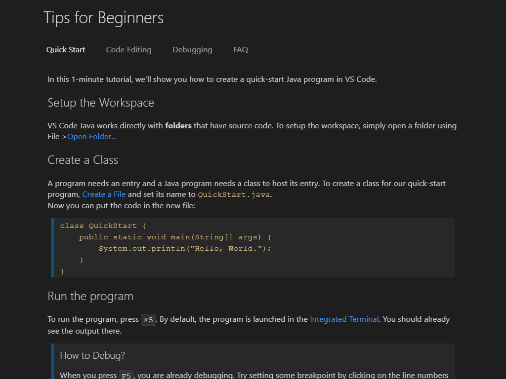

+++
title = "Getting Started"
date = 2024-01-12T22:36:24+08:00
weight = 1
type = "docs"
description = ""
isCJKLanguage = true
draft = false
+++

> 原文: [https://code.visualstudio.com/docs/java/java-tutorial](https://code.visualstudio.com/docs/java/java-tutorial)

# Getting Started with Java in VS Code 在 VS Code 中开始使用 Java

This tutorial shows you how to write and run Hello World program in Java with Visual Studio Code. It also covers a few advanced features, which you can explore by reading other documents in this section.

​​​	本教程演示如何使用 Visual Studio Code 在 Java 中编写和运行 Hello World 程序。它还介绍了一些高级功能，您可以通过阅读本部分中的其他文档来了解这些功能。

For an overview of the features available for Java in VS Code, see [Java Language Overview]().

​​​	有关 VS Code 中可用于 Java 的功能的概述，请参阅 Java 语言概述。

If you run into any issues when following this tutorial, you can contact us by entering an [issue](https://github.com/microsoft/vscode-java-pack/issues).

​​​	如果您在按照本教程操作时遇到任何问题，可以通过输入问题与我们联系。

## [Setting up VS Code for Java development 为 Java 开发设置 VS Code]()

### [Coding Pack for Java Java 编码包]()

To help you set up quickly, you can install the **Coding Pack for Java**, which includes VS Code, the Java Development Kit (JDK), and essential Java extensions. The Coding Pack can be used as a clean installation, or to update or repair an existing development environment.

​​​	为了帮助您快速设置，您可以安装 Java 编码包，其中包括 VS Code、Java 开发工具包 (JDK) 和必要的 Java 扩展。编码包可用作全新安装，或用于更新或修复现有开发环境。

[Install the Coding Pack for Java - Windows
安装适用于 Java 的编码包 - Windows](https://aka.ms/vscode-java-installer-win)

[Install the Coding Pack for Java - macOS
安装适用于 Java 的编码包 - macOS](https://aka.ms/vscode-java-installer-mac)

> **Note**: The Coding Pack for Java is only available for Windows and macOS. For other operating systems, you will need to manually install a JDK, VS Code, and Java extensions.
>
> ​​​	注意：适用于 Java 的编码包仅适用于 Windows 和 macOS。对于其他操作系统，您需要手动安装 JDK、VS Code 和 Java 扩展。

### [Installing extensions 安装扩展]()

If you are an existing VS Code user, you can also add Java support by installing the [Extension Pack for Java](https://marketplace.visualstudio.com/items?itemName=vscjava.vscode-java-pack), which includes these extensions:

​​​	如果您是现有的 VS Code 用户，您还可以通过安装 Java 扩展包来添加 Java 支持，其中包括以下扩展：

- [Language Support for Java™ by Red Hat
  Red Hat 提供的 Java™ 语言支持](https://marketplace.visualstudio.com/items?itemName=redhat.java)
- [Debugger for Java
  Java 调试器](https://marketplace.visualstudio.com/items?itemName=vscjava.vscode-java-debug)
- [Test Runner for Java
  Java 测试运行器](https://marketplace.visualstudio.com/items?itemName=vscjava.vscode-java-test)
- [Maven for Java
  Java 的 Maven](https://marketplace.visualstudio.com/items?itemName=vscjava.vscode-maven)
- [Project Manager for Java
  Java 项目管理器](https://marketplace.visualstudio.com/items?itemName=vscjava.vscode-java-dependency)
- [Visual Studio IntelliCode](https://marketplace.visualstudio.com/items?itemName=VisualStudioExptTeam.vscodeintellicode)

[Install the Extension Pack for Java
安装 Java 扩展包](vscode:extension/vscjava.vscode-java-pack)

The [Extension Pack for Java](https://marketplace.visualstudio.com/items?itemName=vscjava.vscode-java-pack) provides a Quick Start guide and tips for code editing and debugging. It also has a FAQ that answers some frequently asked questions. Use the command **Java: Tips for Beginners** from the Command Palette (Ctrl+Shift+P) to launch the guide.

​​​	Java 扩展包提供快速入门指南和有关代码编辑和调试的提示。它还提供了一个解答一些常见问题的常见问题解答。使用命令面板 (Ctrl+Shift+P) 中的 Java：初学者提示启动指南。

You can also install extensions separately. The **Extensions Guide** is provided to help you. You can launch the guide with the **Java: Extensions Guide** command.

​​​	您还可以单独安装扩展。提供扩展指南来帮助您。您可以使用 Java：扩展指南命令启动指南。

For this tutorial, the only required extensions are:

​​​	对于本教程，唯一需要的扩展是：

- [Language Support for Java™ by Red Hat
  Red Hat 提供的 Java™ 语言支持](https://marketplace.visualstudio.com/items?itemName=redhat.java)
- [Debugger for Java
  Java 调试器](https://marketplace.visualstudio.com/items?itemName=vscjava.vscode-java-debug)

## [Installing and setting up a Java Development Kit (JDK) 安装和设置 Java 开发工具包 (JDK)]()

To use Java within Visual Studio Code, you need to install a Java Development Kit (JDK) on your local environment. JDK is a software development environment used for developing Java applications.

​​​	要在 Visual Studio Code 中使用 Java，您需要在本地环境中安装 Java 开发工具包 (JDK)。JDK 是用于开发 Java 应用程序的软件开发环境。

### [Supported Java versions 受支持的 Java 版本]()

The [Extension Pack for Java](https://marketplace.visualstudio.com/items?itemName=vscjava.vscode-java-pack) supports Java version 1.5 or above.

​​​	Java 扩展包支持 Java 1.5 或更高版本。

> **Note**: To configure JDKs for your projects, see [Configure Runtime for Projects](). To enable Java preview features, see [How can I use VS Code with new Java versions]().
>
> ​​​	注意：若要为项目配置 JDK，请参阅配置项目的运行时。若要启用 Java 预览功能，请参阅如何将 VS Code 与新版 Java 配合使用。

### [Installing a Java Development Kit (JDK) 安装 Java 开发工具包 (JDK)]()

If you have never installed a JDK before and need to install one, we recommend you to choose from one of these sources:

​​​	如果您以前从未安装过 JDK 并且需要安装一个，我们建议您从以下来源之一进行选择：

- [Amazon Corretto](https://aws.amazon.com/corretto)
- [Azul Zulu](https://www.azul.com/downloads/?package=jdk)
- [Eclipse Adoptium's Temurin](https://adoptium.net/)
- [IBM Semeru Runtimes](https://developer.ibm.com/languages/java/semeru-runtimes)
- [Microsoft Build of OpenJDK](https://www.microsoft.com/openjdk)
- [Oracle Java SE](https://www.oracle.com/java/technologies/javase-downloads.html)
- [Red Hat build of OpenJDK](https://developers.redhat.com/products/openjdk/download)
- [SapMachine](https://sapmachine.io/)

## [Creating a source code file 创建源代码文件]()

Create a folder for your Java program and open the folder with VS Code. Then in VS Code, create a new file and save it with the name `Hello.java`. When you open that file, the Java Language Server automatically starts loading, and you should see a language status item with a loading icon on the right side of the Status Bar showing the language status is busy. After it finishes loading, you can hover on the language status item and find the loading process has been finished successfully. You can also choose to pin the status item in the status bar.

​​​	为 Java 程序创建一个文件夹，并使用 VS Code 打开该文件夹。然后在 VS Code 中创建一个新文件，并将其另存为 `Hello.java` 。当您打开该文件时，Java 语言服务器会自动开始加载，您应该会在状态栏右侧看到一个带有加载图标的语言状态项，该图标显示语言状态正处于繁忙状态。加载完成后，您可以将鼠标悬停在语言状态项上，并发现加载过程已成功完成。您还可以选择将状态项固定在状态栏中。

<video autoplay="" loop="" muted="" playsinline="" controls="" title="Creating a source code file" data-immersive-translate-walked="8ec1e628-981d-44a8-b9b1-cc06e0e99d96" style="box-sizing: border-box; font-family: &quot;Segoe UI&quot;, &quot;Helvetica Neue&quot;, Helvetica, Arial, sans-serif; display: inline-block; vertical-align: baseline; margin-top: 1.5rem; margin-bottom: 2.5rem; width: 616.662px; max-width: 100%; color: rgb(36, 36, 36); font-size: 16px; font-style: normal; font-variant-ligatures: normal; font-variant-caps: normal; font-weight: 400; letter-spacing: normal; orphans: 2; text-align: start; text-indent: 0px; text-transform: none; widows: 2; word-spacing: 0px; -webkit-text-stroke-width: 0px; white-space: normal; background-color: rgb(255, 255, 255); text-decoration-thickness: initial; text-decoration-style: initial; text-decoration-color: initial;"></video>

> **Note**: If you open a Java file in VS Code without opening its folder, the Java Language Server might not work properly.
>
> ​​​	注意：如果您在不打开文件夹的情况下在 VS Code 中打开 Java 文件，Java 语言服务器可能无法正常工作。

VS Code will also try to figure out the correct package for the new type and fill the new file from a template. See [Create new file]().

​​​	VS Code 还将尝试找出新类型的正确包，并使用模板填充新文件。请参阅创建新文件。

You can also create a Java project using the **Java: Create Java Project** command. Bring up the **Command Palette** (Ctrl+Shift+P) and then type `java` to search for this command. After selecting the command, you will be prompted for the location and name of the project. You can also choose your build tool from this command.

​​​	您还可以使用 Java: Create Java Project 命令创建 Java 项目。调出命令面板 (Ctrl+Shift+P)，然后键入 `java` 以搜索此命令。选择该命令后，系统将提示您输入项目的名称和位置。您还可以从此命令中选择构建工具。

<video autoplay="" loop="" muted="" playsinline="" controls="" title="Create Java Project" data-immersive-translate-walked="8ec1e628-981d-44a8-b9b1-cc06e0e99d96" style="box-sizing: border-box; font-family: &quot;Segoe UI&quot;, &quot;Helvetica Neue&quot;, Helvetica, Arial, sans-serif; display: inline-block; vertical-align: baseline; margin-top: 1.5rem; margin-bottom: 2.5rem; width: 616.662px; max-width: 100%; color: rgb(36, 36, 36); font-size: 16px; font-style: normal; font-variant-ligatures: normal; font-variant-caps: normal; font-weight: 400; letter-spacing: normal; orphans: 2; text-align: start; text-indent: 0px; text-transform: none; widows: 2; word-spacing: 0px; -webkit-text-stroke-width: 0px; white-space: normal; background-color: rgb(255, 255, 255); text-decoration-thickness: initial; text-decoration-style: initial; text-decoration-color: initial;"></video>

Visual Studio Code also supports more complex Java projects — see [Project Management]().

​​​	Visual Studio Code 还支持更复杂的 Java 项目 — 请参阅项目管理。

## [Editing source code 编辑源代码]()

You can use code snippets to scaffold your classes and methods. VS Code also provides IntelliSense for code completion, and various refactor methods.

​​​	您可以使用代码片段来构建类和方法。VS Code 还提供 IntelliSense 以进行代码完成，以及各种重构方法。

<video autoplay="" loop="" muted="" playsinline="" controls="" title="Editing source code" data-immersive-translate-walked="8ec1e628-981d-44a8-b9b1-cc06e0e99d96" style="box-sizing: border-box; font-family: &quot;Segoe UI&quot;, &quot;Helvetica Neue&quot;, Helvetica, Arial, sans-serif; display: inline-block; vertical-align: baseline; margin-top: 1.5rem; margin-bottom: 2.5rem; width: 616.662px; max-width: 100%; color: rgb(36, 36, 36); font-size: 16px; font-style: normal; font-variant-ligatures: normal; font-variant-caps: normal; font-weight: 400; letter-spacing: normal; orphans: 2; text-align: start; text-indent: 0px; text-transform: none; widows: 2; word-spacing: 0px; -webkit-text-stroke-width: 0px; white-space: normal; background-color: rgb(255, 255, 255); text-decoration-thickness: initial; text-decoration-style: initial; text-decoration-color: initial;"></video>

To learn more about editing Java, see [Java Editing]().

​​​	若要详细了解如何编辑 Java，请参阅 Java 编辑。

## [Running and debugging your program 运行和调试程序]()

To run and debug Java code, set a breakpoint, then either press F5 on your keyboard or use the **Run** > **Start Debugging** menu item. You can also use the **Run|Debug** CodeLens option in the editor. After the code compiles, you can see all your variables and threads in the **Run and Debug** view.

​​​	若要运行和调试 Java 代码，请设置断点，然后按键盘上的 F5 或使用“运行”>“开始调试”菜单项。您还可以在编辑器中使用“运行”|“调试 CodeLens”选项。代码编译后，您可以在“运行”和“调试”视图中看到所有变量和线程。

<video autoplay="" loop="" muted="" playsinline="" controls="" title="Running and debugging your program" data-immersive-translate-walked="8ec1e628-981d-44a8-b9b1-cc06e0e99d96" style="box-sizing: border-box; font-family: &quot;Segoe UI&quot;, &quot;Helvetica Neue&quot;, Helvetica, Arial, sans-serif; display: inline-block; vertical-align: baseline; margin-top: 1.5rem; margin-bottom: 2.5rem; width: 616.662px; max-width: 100%; color: rgb(36, 36, 36); font-size: 16px; font-style: normal; font-variant-ligatures: normal; font-variant-caps: normal; font-weight: 400; letter-spacing: normal; orphans: 2; text-align: start; text-indent: 0px; text-transform: none; widows: 2; word-spacing: 0px; -webkit-text-stroke-width: 0px; white-space: normal; background-color: rgb(255, 255, 255); text-decoration-thickness: initial; text-decoration-style: initial; text-decoration-color: initial;"></video>

The debugger also supports advanced features such as [Hot Code Replace]() and conditional breakpoints.

​​​	调试器还支持高级功能，例如热代码替换和条件断点。

For more information, see [Java Debugging]().

​​​	有关更多信息，请参阅 Java 调试。

## [More features 更多功能]()

The editor also has many more capabilities to assist with your Java workload.

​​​	编辑器还具有更多功能来帮助您处理 Java 工作负载。

- [Editing Java]() explains how to navigate and edit Java in more details
  编辑 Java 详细说明了如何导航和编辑 Java
- [Debugging]() illustrates all the key features of the Java Debugger
  调试说明了 Java 调试器的所有主要功能
- [Testing]() provides comprehensive support for JUnit and TestNG framework
  Testing 为 JUnit 和 TestNG 框架提供全面的支持
- [Java Project Management]() shows you how to use a project view and work with Maven
  Java 项目管理向您展示如何使用项目视图并使用 Maven
- [Spring Boot]() and [Tomcat and Jetty]() demonstrate great framework support
  Spring Boot 和 Tomcat 和 Jetty 演示了出色的框架支持
- [Java Web Apps](https://code.visualstudio.com/docs/java/java-webapp) shows how to work with Java Web App in VS Code
  Java Web 应用展示了如何在 VS Code 中使用 Java Web 应用
