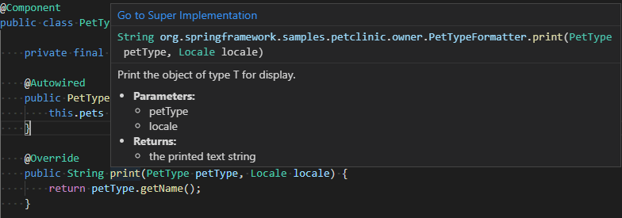
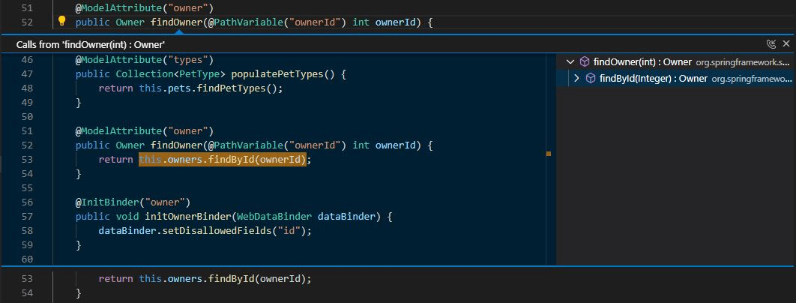
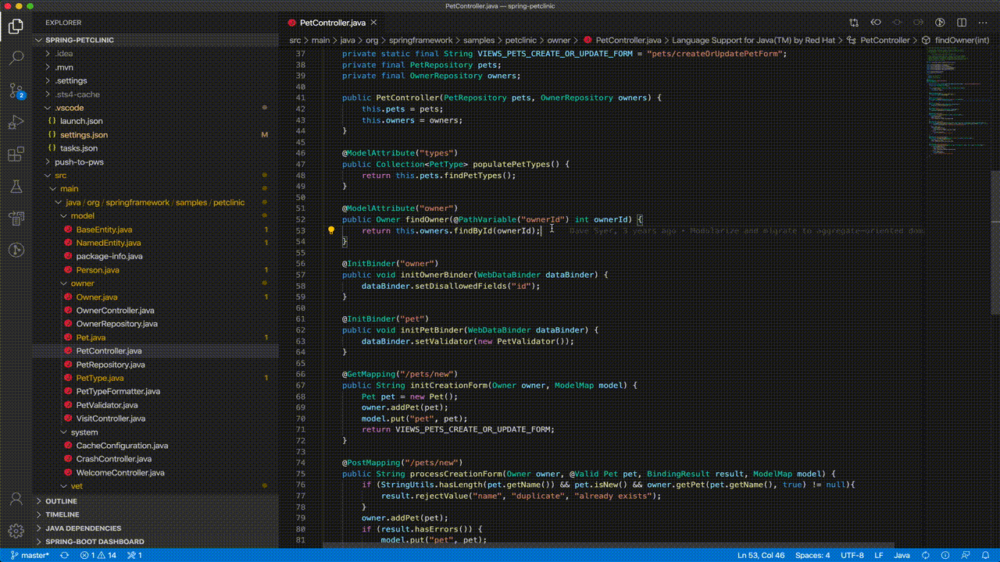
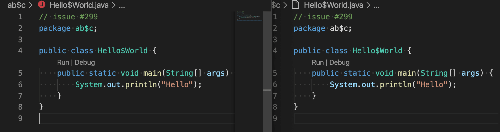
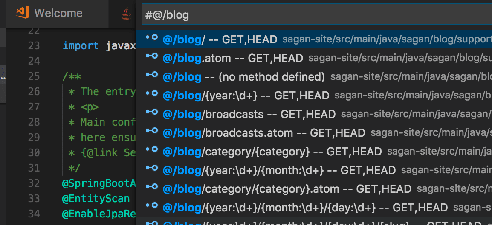
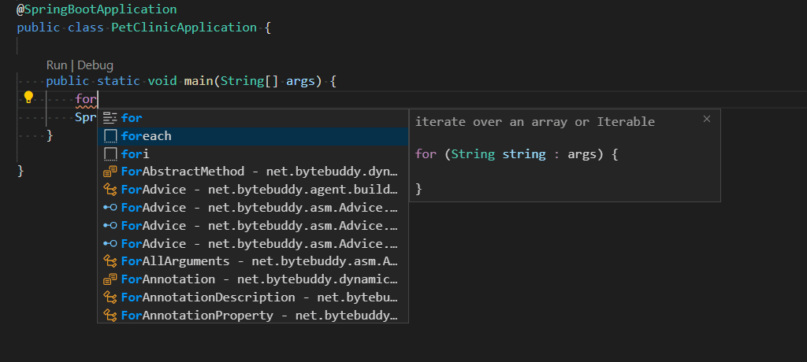

+++
title = "Navigate and Edit"
date = 2024-01-12T22:36:24+08:00
weight = 10
type = "docs"
description = ""
isCJKLanguage = true
draft = false
+++

> 原文: [https://code.visualstudio.com/docs/java/java-editing](https://code.visualstudio.com/docs/java/java-editing)

# Navigate and edit Java source code 导航和编辑 Java 源代码

Visual Studio Code is a source code editor first and foremost with rich editing [features](https://code.visualstudio.com/docs/editor/codebasics). In this document, we will go through a few Java-specific features, which are helpful when working with Java.

&zeroWidthSpace;Visual Studio Code 首先是一款具有丰富编辑功能的源代码编辑器。在本文档中，我们将介绍一些特定于 Java 的功能，这些功能在使用 Java 时非常有用。

If you run into any issues when using the features below, you can contact us by entering an [issue](https://github.com/microsoft/vscode-java-pack/issues).

&zeroWidthSpace;如果您在使用以下功能时遇到任何问题，可以通过输入问题与我们联系。

## [Code navigation 代码导航](https://code.visualstudio.com/docs/java/java-editing#_code-navigation)

With the [Outline view](https://code.visualstudio.com/docs/getstarted/userinterface#_outline-view), you can conveniently navigate the members within the current file. [Projects view](https://code.visualstudio.com/docs/java/java-project#_projects-view) also provide a great overview of your project. As a Java editor, it also supports Call Hierarchy, Type Hierarchy, Definition Navigation, Search Types in Workspace, etc.

&zeroWidthSpace;借助“轮廓”视图，您可以方便地浏览当前文件中的成员。“项目”视图还提供了项目的出色概览。作为 Java 编辑器，它还支持调用层次结构、类型层次结构、定义导航、在工作区中搜索类型等。

## [Search for symbols 搜索符号](https://code.visualstudio.com/docs/java/java-editing#_search-for-symbols)

You can search for symbols in the current file or workspace to navigate your code more quickly.

&zeroWidthSpace;您可以在当前文件或工作区中搜索符号，以便更快地浏览代码。

### [Search for symbols in the workspace 在工作区中搜索符号](https://code.visualstudio.com/docs/java/java-editing#_search-for-symbols-in-the-workspace)

To search for a symbol in the current workspace, start by pressing Ctrl+T, then enter the name of the symbol. A list of potential matches will appear as before. If you choose a match that was found in a file that's not already open, the file will be opened before navigating to the match's location. Alternatively, you can also use **Quick Open** (Ctrl+P) then enter the '#' command to search the current workspace. Ctrl+T is just the shortcut for the '#' commands, so everything works the same.

&zeroWidthSpace;要搜索当前工作区中的符号，首先按 Ctrl+T，然后输入符号的名称。与之前一样，将显示潜在匹配项列表。如果您选择在尚未打开的文件中找到的匹配项，则该文件将在导航到匹配项位置之前打开。或者，您还可以使用快速打开（Ctrl+P），然后输入“#”命令来搜索当前工作区。Ctrl+T 只是“#”命令的快捷方式，因此所有操作方式相同。

<video autoplay="" loop="" muted="" playsinline="" controls="" title="Search for symbols in the workspace" data-immersive-translate-walked="88040a5f-f079-4af5-b1fe-1bd23cc0a853" style="box-sizing: border-box; font-family: &quot;Segoe UI&quot;, &quot;Helvetica Neue&quot;, Helvetica, Arial, sans-serif; display: inline-block; vertical-align: baseline; margin-top: 1.5rem; margin-bottom: 2.5rem; width: 616.662px; max-width: 100%; color: rgb(36, 36, 36); font-size: 16px; font-style: normal; font-variant-ligatures: normal; font-variant-caps: normal; font-weight: 400; letter-spacing: normal; orphans: 2; text-align: start; text-indent: 0px; text-transform: none; widows: 2; word-spacing: 0px; -webkit-text-stroke-width: 0px; white-space: normal; background-color: rgb(255, 255, 255); text-decoration-thickness: initial; text-decoration-style: initial; text-decoration-color: initial;"></video>

### [Search for symbols in current file 在当前文件中搜索符号](https://code.visualstudio.com/docs/java/java-editing#_search-for-symbols-in-current-file)

To search for a symbol in the current file, use **Quick Open** (Ctrl+P) then enter the '@' command, then enter the name of the symbol you're looking for. A list of potential matches will appear and be filtered as you type. Choose from the list of matches to navigate to its location.

&zeroWidthSpace;要搜索当前文件中的符号，请使用快速打开（Ctrl+P），然后输入“@”命令，再输入要查找的符号的名称。潜在匹配项列表将显示并根据您键入的内容进行筛选。从匹配项列表中选择以导航到其位置。

<video autoplay="" loop="" muted="" playsinline="" controls="" title="Search for symbols in current file" data-immersive-translate-walked="88040a5f-f079-4af5-b1fe-1bd23cc0a853" style="box-sizing: border-box; font-family: &quot;Segoe UI&quot;, &quot;Helvetica Neue&quot;, Helvetica, Arial, sans-serif; display: inline-block; vertical-align: baseline; margin-top: 1.5rem; margin-bottom: 2.5rem; width: 616.662px; max-width: 100%; color: rgb(36, 36, 36); font-size: 16px; font-style: normal; font-variant-ligatures: normal; font-variant-caps: normal; font-weight: 400; letter-spacing: normal; orphans: 2; text-align: start; text-indent: 0px; text-transform: none; widows: 2; word-spacing: 0px; -webkit-text-stroke-width: 0px; white-space: normal; background-color: rgb(255, 255, 255); text-decoration-thickness: initial; text-decoration-style: initial; text-decoration-color: initial;"></video>

## [Peek Definition 查看定义](https://code.visualstudio.com/docs/java/java-editing#_peek-definition)

You can take a quick look at how a symbol was defined by using the Peek Definition feature. This feature displays a few lines of code near the definition inside a peek window, so you can take a look without navigating away from your current location.

&zeroWidthSpace;您可以使用“查看定义”功能快速查看符号的定义方式。此功能在预览窗口中显示定义附近的几行代码，以便您无需离开当前位置即可查看。

To peek at a symbol's definition, place your cursor on the symbol anywhere it's used in your source code and then press Alt+F12. Alternatively, you can choose **Peek Definition** from the context menu (right-click, then choose **Peek Definition**).

&zeroWidthSpace;要查看符号的定义，请将光标放在源代码中使用该符号的任何位置，然后按 Alt+F12。或者，您可以从上下文菜单中选择“查看定义”（右键单击，然后选择“查看定义”）。

## [Go to Definition 转到定义](https://code.visualstudio.com/docs/java/java-editing#_go-to-definition)

You can also quickly navigate to where a symbol is defined by using the Go to Definition feature.

&zeroWidthSpace;您还可以使用“转到定义”功能快速导航到定义符号的位置。

To go to a symbol's definition, place your cursor on the symbol anywhere it is used in your source code and then press F12. Alternatively, you can choose **Go to Definition** from the context menu (right-click, then choose **Go to Definition**). When there's only one definition of the symbol, you'll navigate directly to its location, otherwise the competing definitions are displayed in a peek window as described in the previous section and you have to choose the definition that you want to go to.

&zeroWidthSpace;要转到符号的定义，请将光标放在源代码中使用该符号的任何位置，然后按 F12。或者，您可以从上下文菜单中选择“转到定义”（右键单击，然后选择“转到定义”）。如果符号只有一个定义，您将直接导航到其位置，否则将在预览窗口中显示竞争定义，如上一节所述，您必须选择要转到的定义。

## [Go to Super Implementation 转到超级实现](https://code.visualstudio.com/docs/java/java-editing#_go-to-super-implementation)

You can keep track of class implementations and overriding methods by clicking the **Go to Super Implementation** link on hover.

&zeroWidthSpace;您可以通过单击悬停时的“转到超级实现”链接来跟踪类实现和重写方法。

<video autoplay="" loop="" muted="" playsinline="" controls="" title="Go to super implementation" data-immersive-translate-walked="88040a5f-f079-4af5-b1fe-1bd23cc0a853" style="box-sizing: border-box; font-family: &quot;Segoe UI&quot;, &quot;Helvetica Neue&quot;, Helvetica, Arial, sans-serif; display: inline-block; vertical-align: baseline; margin-top: 1.5rem; margin-bottom: 2.5rem; width: 616.662px; max-width: 100%; color: rgb(36, 36, 36); font-size: 16px; font-style: normal; font-variant-ligatures: normal; font-variant-caps: normal; font-weight: 400; letter-spacing: normal; orphans: 2; text-align: start; text-indent: 0px; text-transform: none; widows: 2; word-spacing: 0px; -webkit-text-stroke-width: 0px; white-space: normal; background-color: rgb(255, 255, 255); text-decoration-thickness: initial; text-decoration-style: initial; text-decoration-color: initial;"></video>

## [Call Hierarchy 调用层次结构](https://code.visualstudio.com/docs/java/java-editing#_call-hierarchy)

A Call Hierarchy view shows all calls from or to a function and allows you to drill into callers of callers and call of calls. Right-click on a function and select **Peek** > **Peek Call Hierarchy**.

&zeroWidthSpace;调用层次结构视图显示来自或指向函数的所有调用，并允许您深入研究调用者的调用者和调用的调用。右键单击函数并选择“预览”>“预览调用层次结构”。

You can also right-click in a function body and pick **Show Call Hierarchy**.

&zeroWidthSpace;您还可以在函数体中右键单击并选择“显示调用层次结构”。

## [Type Hierarchy 类型层次结构](https://code.visualstudio.com/docs/java/java-editing#_type-hierarchy)

A Type Hierarchy view shows the inheritance relationships between Java Objects. You can right-click on a type and pick **Show Type Hierarchy**.

&zeroWidthSpace;类型层次结构视图显示 Java 对象之间的继承关系。您可以右键单击某个类型并选择“显示类型层次结构”。

<video autoplay="" loop="" muted="" playsinline="" controls="" title="Type hierarchy" data-immersive-translate-walked="88040a5f-f079-4af5-b1fe-1bd23cc0a853" style="box-sizing: border-box; font-family: &quot;Segoe UI&quot;, &quot;Helvetica Neue&quot;, Helvetica, Arial, sans-serif; display: inline-block; vertical-align: baseline; margin-top: 1.5rem; margin-bottom: 2.5rem; width: 616.662px; max-width: 100%; color: rgb(36, 36, 36); font-size: 16px; font-style: normal; font-variant-ligatures: normal; font-variant-caps: normal; font-weight: 400; letter-spacing: normal; orphans: 2; text-align: start; text-indent: 0px; text-transform: none; widows: 2; word-spacing: 0px; -webkit-text-stroke-width: 0px; white-space: normal; background-color: rgb(255, 255, 255); text-decoration-thickness: initial; text-decoration-style: initial; text-decoration-color: initial;"></video>

## [Folding regions 折叠区域](https://code.visualstudio.com/docs/java/java-editing#_folding-regions)

Folding regions allows you to fold or unfold code snippet to better view the source code.

&zeroWidthSpace;折叠区域允许您折叠或展开代码片段，以便更好地查看源代码。

<video autoplay="" loop="" muted="" playsinline="" controls="" title="Folding regions" data-immersive-translate-walked="88040a5f-f079-4af5-b1fe-1bd23cc0a853" style="box-sizing: border-box; font-family: &quot;Segoe UI&quot;, &quot;Helvetica Neue&quot;, Helvetica, Arial, sans-serif; display: inline-block; vertical-align: baseline; margin-top: 1.5rem; margin-bottom: 2.5rem; width: 616.662px; max-width: 100%; color: rgb(36, 36, 36); font-size: 16px; font-style: normal; font-variant-ligatures: normal; font-variant-caps: normal; font-weight: 400; letter-spacing: normal; orphans: 2; text-align: start; text-indent: 0px; text-transform: none; widows: 2; word-spacing: 0px; -webkit-text-stroke-width: 0px; white-space: normal; background-color: rgb(255, 255, 255); text-decoration-thickness: initial; text-decoration-style: initial; text-decoration-color: initial;"></video>

## [Smart Selection 智能选择](https://code.visualstudio.com/docs/java/java-editing#_smart-selection)

With [Smart Selection](https://code.visualstudio.com/updates/v1_33#_smart-select-api) (semantic selection), you can expand or shrink the selection range based on the semantic information of the caret position in your source code.

&zeroWidthSpace;使用智能选择（语义选择），您可以根据源代码中插入符号位置的语义信息来扩展或缩小选择范围。

- To expand the selection, use Shift+Alt+Right.
  要扩展选择范围，请使用 Shift+Alt+向右键。
- To shrink the selection, use Shift+Alt+Left.
  要缩小选择范围，请使用 Shift+Alt+向左键。

<video autoplay="" loop="" muted="" playsinline="" controls="" title="Smart selections" data-immersive-translate-walked="88040a5f-f079-4af5-b1fe-1bd23cc0a853" style="box-sizing: border-box; font-family: &quot;Segoe UI&quot;, &quot;Helvetica Neue&quot;, Helvetica, Arial, sans-serif; display: inline-block; vertical-align: baseline; margin-top: 1.5rem; margin-bottom: 2.5rem; width: 616.662px; max-width: 100%; color: rgb(36, 36, 36); font-size: 16px; font-style: normal; font-variant-ligatures: normal; font-variant-caps: normal; font-weight: 400; letter-spacing: normal; orphans: 2; text-align: start; text-indent: 0px; text-transform: none; widows: 2; word-spacing: 0px; -webkit-text-stroke-width: 0px; white-space: normal; background-color: rgb(255, 255, 255); text-decoration-thickness: initial; text-decoration-style: initial; text-decoration-color: initial;"></video>

## [Semantic Highlighting 语义突出显示](https://code.visualstudio.com/docs/java/java-editing#_semantic-highlighting)

Syntax highlighting is an important feature that allows you to read code more efficiently. With the help of [Semantic Highlighting](https://github.com/microsoft/vscode/wiki/Semantic-Highlighting-Overview), VS Code can provide more accurate source code coloring based on symbol information from the Java language service.

&zeroWidthSpace;语法突出显示是一项重要的功能，它允许您更有效地阅读代码。借助语义突出显示，VS Code 可以根据 Java 语言服务的符号信息提供更准确的源代码着色。

Below is just one example, left is the behavior after enabling semantic highlighting and right is the one with only syntax highlighting.

&zeroWidthSpace;下面只是一个示例，左边是启用语义突出显示后的行为，右边是仅具有语法突出显示的行为。

You can learn more about the details of Java semantic highlighting on the [Java Language Support extension wiki](https://github.com/redhat-developer/vscode-java/wiki/Semantic-Highlighting).

&zeroWidthSpace;您可以在 Java 语言支持扩展 Wiki 上了解有关 Java 语义突出显示的详细信息。

## [Navigating code with Spring Boot 使用 Spring Boot 导航代码](https://code.visualstudio.com/docs/java/java-editing#_navigating-code-with-spring-boot)

The [Spring Boot Tools](https://marketplace.visualstudio.com/items?itemName=vmware.vscode-spring-boot) extension provides enhanced navigation and code completion support for Spring Boot projects.

&zeroWidthSpace;Spring Boot Tools 扩展为 Spring Boot 项目提供了增强的导航和代码完成支持。

- `@/` shows all defined request mappings (mapped path, request method, source location)
  `@/` 显示所有已定义的请求映射（映射路径、请求方法、源位置）
- `@+` shows all defined beans (bean name, bean type, source location)
  `@+` 显示所有已定义的 Bean（Bean 名称、Bean 类型、源位置）
- `@>` shows all functions (prototype implementation)
  `@>` 显示所有函数（原型实现）
- `@` shows all Spring annotations in the code
  `@` 显示代码中的所有 Spring 注释

To learn more about Spring Boot support with Visual Studio Code, read [Spring Boot in Visual Studio Code](https://code.visualstudio.com/docs/java/java-spring-boot).

&zeroWidthSpace;要了解有关 Visual Studio Code 中 Spring Boot 支持的更多信息，请阅读 Visual Studio Code 中的 Spring Boot。

## [Code editing 代码编辑](https://code.visualstudio.com/docs/java/java-editing#_code-editing)

Editing code is also easy with IntelliSense for smart code completions and signature details. You can use code snippets as well as various code actions such as generating Getters/Setters and organizing imports to further boost your productivity.

&zeroWidthSpace;使用 IntelliSense 进行智能代码补全和签名详细信息，编辑代码也很容易。您可以使用代码片段以及各种代码操作，例如生成 Getters/Setters 和组织导入，以进一步提高您的工作效率。

<video autoplay="" loop="" muted="" playsinline="" controls="" title="Code editing" data-immersive-translate-walked="88040a5f-f079-4af5-b1fe-1bd23cc0a853" style="box-sizing: border-box; font-family: &quot;Segoe UI&quot;, &quot;Helvetica Neue&quot;, Helvetica, Arial, sans-serif; display: inline-block; vertical-align: baseline; margin-top: 1.5rem; margin-bottom: 2.5rem; width: 616.662px; max-width: 100%; color: rgb(36, 36, 36); font-size: 16px; font-style: normal; font-variant-ligatures: normal; font-variant-caps: normal; font-weight: 400; letter-spacing: normal; orphans: 2; text-align: start; text-indent: 0px; text-transform: none; widows: 2; word-spacing: 0px; -webkit-text-stroke-width: 0px; white-space: normal; background-color: rgb(255, 255, 255); text-decoration-thickness: initial; text-decoration-style: initial; text-decoration-color: initial;"></video>

Java support in Visual Studio Code detects issues within your code automatically, and provides you with Quick Fix suggestions.

&zeroWidthSpace;Visual Studio Code 中的 Java 支持会自动检测代码中的问题，并为您提供快速修复建议。

<video autoplay="" loop="" muted="" playsinline="" controls="" title="Quick fix suggestions" data-immersive-translate-walked="88040a5f-f079-4af5-b1fe-1bd23cc0a853" style="box-sizing: border-box; font-family: &quot;Segoe UI&quot;, &quot;Helvetica Neue&quot;, Helvetica, Arial, sans-serif; display: inline-block; vertical-align: baseline; margin-top: 1.5rem; margin-bottom: 2.5rem; width: 616.662px; max-width: 100%; color: rgb(36, 36, 36); font-size: 16px; font-style: normal; font-variant-ligatures: normal; font-variant-caps: normal; font-weight: 400; letter-spacing: normal; orphans: 2; text-align: start; text-indent: 0px; text-transform: none; widows: 2; word-spacing: 0px; -webkit-text-stroke-width: 0px; white-space: normal; background-color: rgb(255, 255, 255); text-decoration-thickness: initial; text-decoration-style: initial; text-decoration-color: initial;"></video>

For more details about refactoring and code actions, see [Refactoring and Source Actions](https://code.visualstudio.com/docs/java/java-refactoring).

&zeroWidthSpace;有关重构和代码操作的更多详细信息，请参阅重构和源操作。

## [IntelliSense](https://code.visualstudio.com/docs/java/java-editing#_intellisense)

Code completion in Visual Studio Code for Java is provided by [Language Support for Java™ by Red Hat](https://marketplace.visualstudio.com/items?itemName=redhat.java). The extension is powered by the same [Java development tools (JDT)](https://www.eclipse.org/jdt/) behind Eclipse, so you can expect the same level of support.

&zeroWidthSpace;Visual Studio Code 中的 Java 代码补全由 Red Hat 的 Java™ 语言支持提供。该扩展由 Eclipse 背后的相同 Java 开发工具 (JDT) 提供支持，因此您可以期待获得相同级别的支持。

In addition, there's also AI-assisted IntelliSense called [IntelliCode](https://visualstudio.microsoft.com/services/intellicode/). It saves you time by putting what you're most likely to use at the top of your completion list. IntelliCode recommendations are based on thousands of open-source projects on GitHub each with over 100 stars, so it's trained on the most common usages from high-quality projects. When combined with the context of your code, the completion list is tailored to promote those practices. Here's IntelliCode for Java in action.

&zeroWidthSpace;此外，还提供名为 IntelliCode 的 AI 辅助 IntelliSense。它通过将您最有可能使用的内容放在补全列表的顶部，从而节省您的时间。IntelliCode 建议基于 GitHub 上的数千个开源项目，每个项目都有 100 多个星标，因此它经过了高质量项目中最常见用法方面的训练。结合您代码的上下文，补全列表经过专门定制，以促进这些做法。以下是 Java 中的 IntelliCode 的实际应用。

<video autoplay="" loop="" muted="" playsinline="" controls="" title="IntelliSense code completion suggestions" data-immersive-translate-walked="88040a5f-f079-4af5-b1fe-1bd23cc0a853" style="box-sizing: border-box; font-family: &quot;Segoe UI&quot;, &quot;Helvetica Neue&quot;, Helvetica, Arial, sans-serif; display: inline-block; vertical-align: baseline; margin-top: 1.5rem; margin-bottom: 2.5rem; width: 616.662px; max-width: 100%; color: rgb(36, 36, 36); font-size: 16px; font-style: normal; font-variant-ligatures: normal; font-variant-caps: normal; font-weight: 400; letter-spacing: normal; orphans: 2; text-align: start; text-indent: 0px; text-transform: none; widows: 2; word-spacing: 0px; -webkit-text-stroke-width: 0px; white-space: normal; background-color: rgb(255, 255, 255); text-decoration-thickness: initial; text-decoration-style: initial; text-decoration-color: initial;"></video>

IntelliCode works well with popular Java libraries and frameworks like Java SE and Spring. It will help you whether you are doing monolithic web apps or modern microservices.

&zeroWidthSpace;IntelliCode 适用于 Java SE 和 Spring 等流行的 Java 库和框架。无论您是进行单体 Web 应用还是现代微服务，它都能为您提供帮助。

## [Create new file 创建新文件](https://code.visualstudio.com/docs/java/java-editing#_create-new-file)

VS Code supports applying templates when you create a Java source file. When you create a `.java` file in the File Explorer, the language server will automatically generate the class body, and fill the package info for you:

&zeroWidthSpace;在创建 Java 源文件时，VS Code 支持应用模板。当您在文件资源管理器中创建 `.java` 文件时，语言服务器将自动生成类主体，并为您填充包信息：

<video autoplay="" loop="" muted="" playsinline="" controls="" title="Create new file" data-immersive-translate-walked="88040a5f-f079-4af5-b1fe-1bd23cc0a853" style="box-sizing: border-box; font-family: &quot;Segoe UI&quot;, &quot;Helvetica Neue&quot;, Helvetica, Arial, sans-serif; display: inline-block; vertical-align: baseline; margin-top: 1.5rem; margin-bottom: 2.5rem; width: 616.662px; max-width: 100%; color: rgb(36, 36, 36); font-size: 16px; font-style: normal; font-variant-ligatures: normal; font-variant-caps: normal; font-weight: 400; letter-spacing: normal; orphans: 2; text-align: start; text-indent: 0px; text-transform: none; widows: 2; word-spacing: 0px; -webkit-text-stroke-width: 0px; white-space: normal; background-color: rgb(255, 255, 255); text-decoration-thickness: initial; text-decoration-style: initial; text-decoration-color: initial;"></video>

## [Code snippets 代码片段](https://code.visualstudio.com/docs/java/java-editing#_code-snippets)

Visual Studio Code supports a wide range of popular Java code snippets to make you more productive, such as class/interface, syserr, sysout, if/else, try/catch, static main method. Using information from Java language server, it also provides a preview of the code snippet during the selection.

&zeroWidthSpace;Visual Studio Code 支持各种流行的 Java 代码片段，以提高您的工作效率，例如类/接口、syserr、sysout、if/else、try/catch、static main 方法。利用 Java 语言服务器提供的信息，它还可以在选择期间提供代码片段的预览。

For example, typing "**sout**" or "**sysout**" will produce a code snippet for `System.out.println()`.

&zeroWidthSpace;例如，键入“sout”或“sysout”将生成 `System.out.println()` 的代码片段。
Similarly, typing "**main**" or "**psvm**" will generate a code snippet for `public static void main(String[] args) {}`.

&zeroWidthSpace;同样，键入“main”或“psvm”将生成 `public static void main(String[] args) {}` 的代码片段。

The complete list of shortcuts are listed below:

&zeroWidthSpace;完整的快捷方式列表如下：

### [Code snippet shortcuts 代码片段快捷方式](https://code.visualstudio.com/docs/java/java-editing#_code-snippet-shortcuts)

| shortcut key 快捷键               | description                                                  |
| :-------------------------------- | :----------------------------------------------------------- |
| ctor                              | Public constructor 公共构造函数                              |
| dowhile                           | Do-while statement do-while 语句                             |
| foreach, iter                     | Iterate over an array or Iterable 迭代数组或 Iterable        |
| fori                              | Iterate over array 迭代数组                                  |
| if                                | If statement if 语句                                         |
| ifelse                            | If-else statement If-else 语句                               |
| ifnull                            | If statement checking for null 检查 null 的 if 语句          |
| ifnotnull                         | If statement checking for not null 检查 not null 的 if 语句  |
| main, psvm                        | Public static main method Public static main 方法            |
| new                               | Create new Object 创建新对象                                 |
| private_method                    | Private method 私有方法                                      |
| private_static_method             | Private static method 私有静态方法                           |
| prf                               | Private field 私有字段                                       |
| protected_method 受保护的方法     | Protected method 受保护的方法                                |
| public_method 公共方法            | Public method 公共方法                                       |
| public_static_method 公共静态方法 | Public static method                                         |
| switch                            | Switch statement switch 语句                                 |
| syserr, serr                      | Print to standard err 打印到标准错误                         |
| sysout, sout                      | Print to standard out 打印到标准输出                         |
| systrace, soutm                   | Print current method to standard out 将当前方法打印到标准输出 |
| try_catch                         | Try/catch block try/catch 块                                 |
| try_resources                     | Try-with-resources statement try-with-resources 语句         |
| while                             | While statement while 语句                                   |

### [Postfix snippet shortcuts 后缀代码段快捷方式](https://code.visualstudio.com/docs/java/java-editing#_postfix-snippet-shortcuts)

| shortcut key 快捷键 | template content 模板内容                | description 说明                                             |
| :------------------ | :--------------------------------------- | :----------------------------------------------------------- |
| cast 强制转换       | ((SomeType) expr)                        | Casts the expression to a new type 将表达式强制转换为新类型  |
| else                | if (!expr)                               | Creates a negated if statement 创建否定if语句                |
| for                 | for (T item : expr)                      | Creates a for statement 创建for语句                          |
| fori                | for (int i = 0; i < expr.length; i++)    | Creates a for statement which iterates over an array 创建遍历数组的for语句 |
| forr                | for (int i = expr.length-1; i >= 0; i--) | Creates a for statement which iterates over an array in reverse order 创建一个反向遍历数组的 for 语句 |
| if                  | if (expr)                                | Creates a if statement 创建一个 if 语句                      |
| nnull               | if (expr != null)                        | Creates an if statement and checks if the expression does not resolve to null 创建一个 if 语句，检查表达式是否不解析为 null |
| null                | if (expr == null)                        | Creates an if statement which checks if expression resolves to null 创建一个 if 语句，检查表达式是否解析为 null |
| sysout              | System.out.println(expr)                 | Sends the affected string to a System.out.println(..) call 将受影响的字符串发送到 System.out.println(..) 调用 |
| throw               | throw expr                               | Throws the given Exception 抛出给定的异常                    |
| var                 | T name = expr                            | Creates a new variable 创建一个新变量                        |
| while               | while (expr) {}                          | Creates a while loop 创建一个 while 循环                     |

