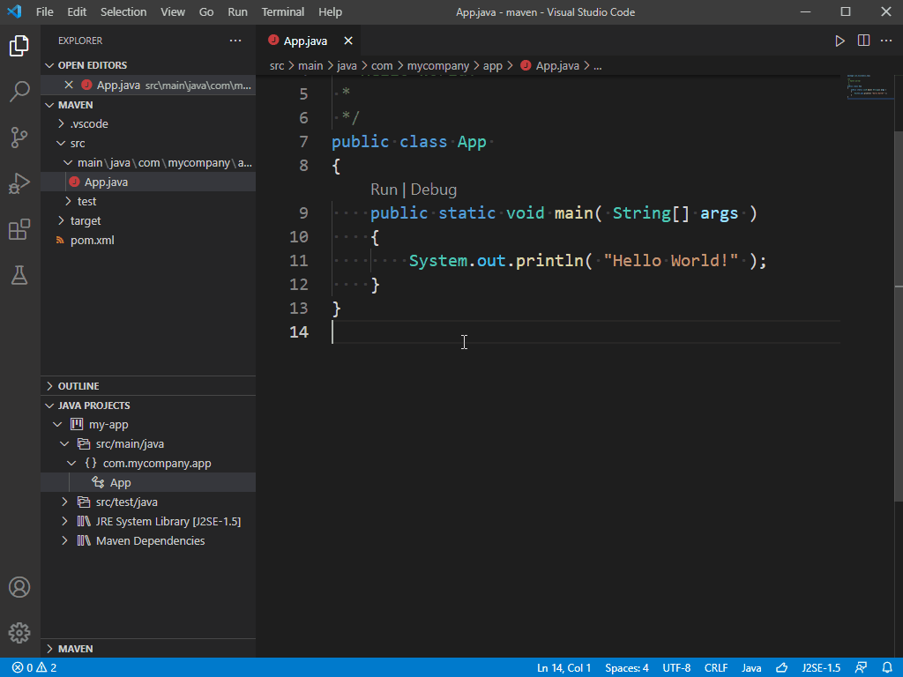

+++
title = "Project Management"
date = 2024-01-12T22:36:24+08:00
weight = 40
type = "docs"
description = ""
isCJKLanguage = true
draft = false
+++

> 原文: [https://code.visualstudio.com/docs/java/java-project](https://code.visualstudio.com/docs/java/java-project)

# Managing Java Projects in VS Code 在 VS Code 中管理 Java 项目


The [Project Manager for Java](https://marketplace.visualstudio.com/items?itemName=vscjava.vscode-java-dependency) extension helps you to manage your Java projects and their dependencies. It also helps you to create new Java projects, packages, and classes. To get the complete Java language support in Visual Studio Code, you can install the [Extension Pack for Java](https://marketplace.visualstudio.com/items?itemName=vscjava.vscode-java-pack), which includes the Project Manager for Java extension.

​​​	Java 扩展的项目管理器可帮助您管理 Java 项目及其依赖项。它还可以帮助您创建新的 Java 项目、包和类。若要获得 Visual Studio Code 中完整的 Java 语言支持，您可以安装 Java 扩展包，其中包括 Java 扩展的项目管理器。

[Install the Extension Pack for Java
安装 Java 扩展包](vscode:extension/vscjava.vscode-java-pack)

> For details on how to get started with the extension pack, you can review the [Getting Started with Java](https://code.visualstudio.com/docs/java/java-tutorial) tutorial.
>
> ​​​	有关如何开始使用扩展包的详细信息，您可以查看 Java 入门教程。

## [Projects view 项目视图](https://code.visualstudio.com/docs/java/java-project#_projects-view)

The **Java Projects** view helps you view your Java projects and their dependencies, and provides entry points for project management tasks.

​​​	Java 项目视图可帮助您查看 Java 项目及其依赖项，并提供项目管理任务的入口点。


> By default, the Java Projects view is displayed below the **Explorer** view. If you cannot see it, try clicking the `...` button in the **EXPLORER** title bar and select **Java Projects**.
>
> ​​​	默认情况下，Java 项目视图显示在资源管理器视图下方。如果您看不到它，请尝试单击资源管理器标题栏中的 `...` 按钮，然后选择 Java 项目。

In the overflow button of the navigation bar, there are more options to use. For example, you can switch between hierarchical view and flat view.

​​​	在导航栏的溢出按钮中，还有更多选项可供使用。例如，您可以在层次结构视图和平铺视图之间切换。


You can find buttons next to the nodes in the Explorer, which provide useful shortcuts for some actions.

​​​	您可以在资源管理器中的节点旁边找到按钮，这些按钮为某些操作提供了有用的快捷方式。


There are also many useful features in each node's context menu, you can right-click on the node in Explorer to toggle it out.

​​​	每个节点的上下文菜单中还有许多有用的功能，您可以在资源管理器中右键单击节点以切换它。


### [Create a new Java project 创建新的 Java 项目](https://code.visualstudio.com/docs/java/java-project#_create-a-new-java-project)

You can create a new Java project by clicking the **+** button in the navigation bar, or through the command: **Java: Create Java Project...** in Command Palette (Ctrl+Shift+P). During creation, VS Code will facilitate installing required extension(s) per your project type, if the extension(s) weren't already installed.

​​​	您可以通过单击导航栏中的 + 按钮或通过命令来创建新的 Java 项目：Java: 在命令面板中创建 Java 项目... (Ctrl+Shift+P)。在创建过程中，如果尚未安装扩展，VS Code 将帮助根据您的项目类型安装所需的扩展。


### [Import Java projects 导入 Java 项目](https://code.visualstudio.com/docs/java/java-project#_import-java-projects)

You can directly import existing Java projects and modules to your workspace through **File** > **Open Folder...** (Make sure the opened folder contains your build tool scripts, for example, `pom.xml` or `build.gradle`). VS Code for Java will detect your projects and import them automatically.

​​​	您可以通过文件 > 打开文件夹... 直接将现有的 Java 项目和模块导入到您的工作区中（确保打开的文件夹包含您的构建工具脚本，例如 `pom.xml` 或 `build.gradle` ）。VS Code for Java 将检测您的项目并自动导入它们。

When you add a new module into your projects, you can trigger the command **Java: Import Java projects in workspace** to import them to your workspace. This command helps to import new projects into the workspace without the need to reload the VS Code window.

​​​	将新模块添加到项目中时，您可以触发命令 Java: 导入工作区中的 Java 项目以将它们导入到您的工作区中。此命令有助于将新项目导入到工作区中，而无需重新加载 VS Code 窗口。

### [Export to JAR 导出到 JAR](https://code.visualstudio.com/docs/java/java-project#_export-to-jar)

You can export your build to JAR from the projects view or by running the command **Java: Export Jar...**.

​​​	您可以从项目视图中或通过运行命令 Java: 导出 Jar... 将您的构建导出到 JAR。



## [Configure Runtime for Projects 为项目配置运行时](https://code.visualstudio.com/docs/java/java-project#_configure-runtime-for-projects)

As Java evolves, it's common that developers work with multiple versions of JDK. You can map them to your local installation paths via the setting: `java.configuration.runtimes`. The setting has following format:

​​​	随着 Java 的发展，开发人员使用多个版本的 JDK 非常普遍。您可以通过设置 `java.configuration.runtimes` 将它们映射到您的本地安装路径。该设置具有以下格式：

```
"java.configuration.runtimes": [
  {
    "name": "JavaSE-1.8",
    "path": "/usr/local/jdk1.8.0_201"
  },
  {
    "name": "JavaSE-11",
    "path": "/usr/local/jdk-11.0.3",
    "sources" : "/usr/local/jdk-11.0.3/lib/src.zip",
    "javadoc" : "https://docs.oracle.com/en/java/javase/11/docs/api",
    "default":  true
   },
   {
    "name": "JavaSE-12",
    "path": "/usr/local/jdk-12.0.2"
   },
   {
    "name": "JavaSE-13",
    "path": "/usr/local/jdk-13"
   }
]
```

> **Note**: You can set one of them to default by adding `"default": true` to the entry. The default JDK will be used for your unmanaged folders (with out build tools).
>
> ​​​	注意：您可以通过向条目添加 `"default": true` 将其中一个设置为默认值。默认 JDK 将用于您的非托管文件夹（不带构建工具）。

To see which JDKs are used for your projects, you can trigger the command **Java: Configure Java Runtime** in **Command Palette** (Ctrl+Shift+P). This command opens a view displaying the runtime information for your projects:

​​​	要查看哪些 JDK 用于您的项目，您可以在命令面板（Ctrl+Shift+P）中触发命令 Java：配置 Java 运行时。此命令将打开一个视图，显示项目的运行时信息：


### [Change JDK for Maven and Gradle projects 更改 Maven 和 Gradle 项目的 JDK](https://code.visualstudio.com/docs/java/java-project#_change-jdk-for-maven-and-gradle-projects)

If you want to change the JDK version for your Maven or Gradle projects, you need to update it in your build scripts (`pom.xml` or `build.gradle`). You can click to see how to make such changes. Click will navigate to the build script file of the project.

​​​	如果您想更改 Maven 或 Gradle 项目的 JDK 版本，您需要在构建脚本（ `pom.xml` 或 `build.gradle` ）中更新它。您可以单击以了解如何进行此类更改。单击将导航到项目的构建脚本文件。

### [Change JDK for unmanaged folders 更改非托管文件夹的 JDK](https://code.visualstudio.com/docs/java/java-project#_change-jdk-for-unmanaged-folders)

To change the JDK for unmanaged folders (with out any build tools), you can click the button. It will list all the JDKs and you can select one for your unmanaged folders.

​​​	要更改非托管文件夹（不带任何构建工具）的 JDK，您可以单击该按钮。它将列出所有 JDK，您可以为您的非托管文件夹选择一个。

### [Download JDKs 下载 JDK](https://code.visualstudio.com/docs/java/java-project#_download-jdks)

If you want to download a new JDK, you can click the `download` link, or trigger the command **Java: Install New JDK** in **Command Palette** (Ctrl+Shift+P). It will open a new view guiding you to download JDKs.

​​​	如果您想下载新的 JDK，可以单击 `download` 链接，或在命令面板中触发命令 Java: 安装新的 JDK (Ctrl+Shift+P)。它将打开一个新视图，指导您下载 JDK。


> **Note**: To enable Java preview features, see [How can I use VS Code with new Java versions](https://code.visualstudio.com/docs/java/java-faq#_how-can-i-use-visual-studio-code-with-new-java-versions).
>
> ​​​	注意：若要启用 Java 预览功能，请参阅如何将 VS Code 与新版 Java 配合使用。

## [Configure classpath for unmanaged folders 为非托管文件夹配置类路径](https://code.visualstudio.com/docs/java/java-project#_configure-classpath-for-unmanaged-folders)

The Project Management for Java extension provides a user interface to configure the classpath for unmanaged folders. The classpath can be set manually in the classpath configuration page. You can open it by executing the **Java: Configure Classpath** command from the Command Palette (Ctrl+Shift+P).

​​​	Java 扩展的项目管理提供了一个用户界面，用于配置非托管文件夹的类路径。可以在类路径配置页面中手动设置类路径。可以通过从命令面板 (Ctrl+Shift+P) 执行 Java: 配置类路径命令来打开它。


In some rare cases, you may need to clean the Java workspace by executing the **Java: Clean Java Language Server Workspace** command from the Command Palette (Ctrl+Shift+P) to let the language server rebuild your dependencies.

​​​	在某些罕见情况下，您可能需要通过从命令面板 (Ctrl+Shift+P) 执行 Java: 清理 Java 语言服务器工作区命令来清理 Java 工作区，以让语言服务器重新生成您的依赖项。

## [Dependency management 依赖项管理](https://code.visualstudio.com/docs/java/java-project#_dependency-management)

### [Add a Maven dependency 添加 Maven 依赖项](https://code.visualstudio.com/docs/java/java-project#_add-a-maven-dependency)

For Maven project, you can add a dependency by clicking the **+** icon next to **Maven Dependencies** node in project view.

​​​	对于 Maven 项目，可以通过单击项目视图中 Maven 依赖项节点旁边的 + 图标来添加依赖项。


### [Manage dependencies for unmanaged folder 管理非托管文件夹的依赖项](https://code.visualstudio.com/docs/java/java-project#_manage-dependencies-for-unmanaged-folder)

If your project is an unmanaged folder without any build tools. You can manage the dependencies by clicking the **+** icon or the **-** icon on the **Referenced Libraries** node or the items under it, or you can just directly drag your jar libraries to the node `Referenced Libraries`

​​​	如果您的项目是一个没有任何构建工具的非托管文件夹。您可以通过单击“引用库”节点或其下的项上的 + 图标或 - 图标来管理依赖项，或者您可以直接将 jar 库拖动到节点 `Referenced Libraries`


> You can also manage the dependencies in the classpath configuration page. See: [Configure classpath for unmanaged folder](https://code.visualstudio.com/docs/java/java-project#_configure-classpath-for-unmanaged-folders)
>
> ​​​	您还可以在类路径配置页面中管理依赖项。请参阅：为非托管文件夹配置类路径

Behind the scene, there's a setting `java.project.referencedLibraries` in `settings.json`. Below are details on how to customize this setting.

​​​	在后台，有一个设置 `java.project.referencedLibraries` 在 `settings.json` 中。以下是有关如何自定义此设置的详细信息。

**Include libraries
包含库**

The libraries to reference are described using a set of glob patterns.

​​​	要引用的库使用一组 glob 模式进行描述。

For example:

​​​	例如：

```
"java.project.referencedLibraries": [
    "library/**/*.jar",
    "/home/username/lib/foo.jar"
]
```

The settings above will add all `.jar` files in workspace's library folder along with `foo.jar` from a specified absolute path to the project's external dependencies.

​​​	上面的设置将添加工作区库文件夹中的所有 `.jar` 文件以及从指定绝对路径到项目外部依赖项的 `foo.jar` 。

The referenced libraries are then watched by VS Code, and the project will be refreshed if there is a change to any of these dependent files.

​​​	然后，VS Code 会监视引用的库，如果这些依赖文件中的任何一个发生更改，项目将刷新。

By default, VS Code will reference all JAR files in workspace's `lib` directory using the glob pattern `lib/**/*.jar`.

​​​	默认情况下，VS Code 将使用 glob 模式 `lib/**/*.jar` 引用工作区 `lib` 目录中的所有 JAR 文件。

**Exclude some libraries
排除一些库**

If you want to exclude some libraries from the project, you can expand `java.project.referencedLibraries` to use `include/exclude` fields and add an `exclude` glob pattern:

​​​	如果您想从项目中排除一些库，您可以展开 `java.project.referencedLibraries` 以使用 `include/exclude` 字段并添加 `exclude` glob 模式：

```
"java.project.referencedLibraries": {
    "include": [
        "library/**/*.jar",
        "/home/username/lib/foo.jar"
    ],
    "exclude": [
        "library/sources/**"
    ]
}
```

In the example above, any binary JAR files in the `library/sources` folder are ignored as the project's external dependencies.

​​​	在上面的示例中， `library/sources` 文件夹中的任何二进制 JAR 文件都将被忽略，因为它们是项目的外部依赖项。

**Attach source jars
附加源 JAR**

By default, a referenced `{binary}.jar` will try to search `{binary}-sources.jar` under the same directory, and attach it as source if one match is found.

​​​	默认情况下，引用的 `{binary}.jar` 将尝试在同一目录下搜索 `{binary}-sources.jar` ，如果找到匹配项，则将其附加为源。

If you want to manually specify a JAR file as a source attachment, you can provide a key-value map in the `sources` field:

​​​	如果您想手动指定 JAR 文件作为源附件，可以在 `sources` 字段中提供一个键值映射：

```
"java.project.referencedLibraries": {
    "include": [
        "library/**/*.jar",
        "/home/username/lib/foo.jar"
    ],
    "exclude": [
        "library/sources/**"
    ],
    "sources": {
        "library/bar.jar": "library/sources/bar-src.jar"
    }
}
```

In this way, `bar-src.jar` is attached to bar.jar as its source.

​​​	这样， `bar-src.jar` 就作为其源附加到 bar.jar。

## [Lightweight Mode 轻量级模式](https://code.visualstudio.com/docs/java/java-project#_lightweight-mode)

VS Code for Java supports two modes, lightweight and standard. With lightweight mode, only source files and JDK are resolved by the language server; with standard mode, imported dependencies are resolved and the project is built by the language server. Lightweight mode works best when you need a quick-start and lightweight environment to work with your source files, for example, reading source code, navigating among source code and JDK, viewing outline and Javadoc, and detecting and fixing syntax errors. Also, code completion is supported within the scope of source files and JDK.

​​​	VS Code for Java 支持两种模式，轻量级和标准。在轻量级模式下，只有源文件和 JDK 由语言服务器解析；在标准模式下，导入的依赖项由语言服务器解析，项目由语言服务器构建。当您需要一个快速启动且轻量级的环境来处理源文件时，轻量级模式效果最佳，例如，阅读源代码、在源代码和 JDK 之间导航、查看大纲和 Javadoc，以及检测和修复语法错误。此外，在源文件和 JDK 的范围内支持代码补全。

Lightweight mode doesn't resolve imported dependencies nor build the project, so it does not support running, debugging, refactoring, linting, or detecting semantic errors. For these features to be available, you need to switch your workspace from lightweight mode to standard mode.

​​​	轻量级模式不会解析导入的依赖项，也不会构建项目，因此不支持运行、调试、重构、检查或检测语义错误。要使用这些功能，您需要将工作区从轻量级模式切换到标准模式。

You can control which mode to launch with by configuring `java.server.launchMode` with the options below:

​​​	您可以通过使用以下选项配置 `java.server.launchMode` 来控制要启动的模式：

- `Hybrid` (default) - Firstly, a workspace is opened with lightweight mode. You will be asked whether to switch to standard mode if your workspace contains unresolved Java projects. If you choose **Later**, it will stay in lightweight mode. You can click the language status item on the Status bar to manually switch to standard mode.
  `Hybrid` （默认） - 首先，工作区以轻量级模式打开。如果您的工作区包含未解析的 Java 项目，系统会询问您是否切换到标准模式。如果您选择稍后，它将保持在轻量级模式。您可以单击状态栏上的语言状态项以手动切换到标准模式。
- `Standard` - A workspace is opened with standard mode.
  `Standard` - 工作区以标准模式打开。
- `LightWeight` - A workspace is opened with lightweight mode. You can click the language status item on the Status bar to manually switch to standard mode.
  `LightWeight` - 工作区以轻量级模式打开。您可以单击状态栏上的语言状态项以手动切换到标准模式。

The language status item indicates which mode the current workspace is in using different icons.

​​​	语言状态项使用不同的图标指示当前工作区处于哪种模式。

-  \- workspace opened with lightweight mode.
  \- 工作区以轻量级模式打开。
-  \- workspace in the process of being opened with standard mode.
  \- 工作区正在以标准模式打开。
-  \- workspace opened with standard mode.
  \- 工作区以标准模式打开。

Clicking the language status item switches to standard mode.

​​​	单击语言状态项可切换到标准模式。


## [Build Status 生成状态](https://code.visualstudio.com/docs/java/java-project#_build-status)

When you edit Java source code in Visual Studio Code, the Java language server is building your workspace to provide you with the necessary language features. You can see the detailed build task status and watch what is happening behind the scene by clicking the language status item in the Status bar. You can also select the **check details** link when a notification shows the language server is opening Java projects to see the build task status.

​​​	在 Visual Studio Code 中编辑 Java 源代码时，Java 语言服务器正在生成您的工作区，以便为您提供必要的语言功能。您可以通过单击状态栏中的语言状态项来查看详细的生成任务状态并观察幕后发生的情况。当通知显示语言服务器正在打开 Java 项目时，您还可以选择检查详细信息链接以查看生成任务状态。

<video autoplay="" loop="" muted="" playsinline="" controls="" title="Build status for the Java project" data-immersive-translate-walked="834c4e7a-6a1f-45af-ac83-ebe00e2e0f4a" style="box-sizing: border-box; font-family: &quot;Segoe UI&quot;, &quot;Helvetica Neue&quot;, Helvetica, Arial, sans-serif; display: inline-block; vertical-align: baseline; margin-top: 1.5rem; margin-bottom: 2.5rem; width: 616.662px; max-width: 100%; color: rgb(36, 36, 36); font-size: 16px; font-style: normal; font-variant-ligatures: normal; font-variant-caps: normal; font-weight: 400; letter-spacing: normal; orphans: 2; text-align: start; text-indent: 0px; text-transform: none; widows: 2; word-spacing: 0px; -webkit-text-stroke-width: 0px; white-space: normal; background-color: rgb(255, 255, 255); text-decoration-thickness: initial; text-decoration-style: initial; text-decoration-color: initial;"></video>


### [Additional resources 其他资源](https://code.visualstudio.com/docs/java/java-project#_additional-resources)

There are several Visual Studio Code extensions to support different build systems for Java. Below are extensions for several popular build systems.

​​​	有几个 Visual Studio Code 扩展支持 Java 的不同生成系统。以下是几个常用生成系统的扩展。

- [Maven for Java
  Java 的 Maven](https://marketplace.visualstudio.com/items?itemName=vscjava.vscode-maven)
- [Gradle for Java
  适用于 Java 的 Gradle](https://marketplace.visualstudio.com/items?itemName=vscjava.vscode-gradle)
- [Bazel](https://marketplace.visualstudio.com/items?itemName=BazelBuild.vscode-bazel)

If you run into any problems when using the features above, you can contact us by filing an [issue](https://github.com/microsoft/vscode-java-pack/issues).

​​​	如果您在使用上述功能时遇到任何问题，可以通过提交问题与我们联系。

## [Next steps 后续步骤](https://code.visualstudio.com/docs/java/java-project#_next-steps)

Read on to find out more about:

​​​	继续阅读以详细了解：

- [Java editing](https://code.visualstudio.com/docs/java/java-editing) - Explore the editing features for Java in VS Code.
  Java 编辑 - 探索 VS Code 中的 Java 编辑功能。
- [Java debugging](https://code.visualstudio.com/docs/java/java-debugging) - Find out how to debug your Java project with VS Code.
  Java 调试 - 了解如何使用 VS Code 调试 Java 项目。
- [Java testing](https://code.visualstudio.com/docs/java/java-testing) - Use VS Code for your JUnit and TestNG cases.
  Java 测试 - 将 VS Code 用于您的 JUnit 和 TestNG 案例。
- [Java extensions](https://code.visualstudio.com/docs/java/extensions) - Learn about more useful Java extensions for VS Code.
  Java 扩展 - 了解 VS Code 的更多有用 Java 扩展。
