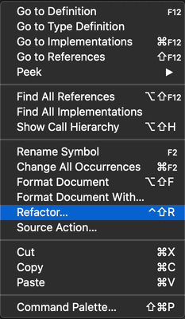

+++
title = "Refactoring"
date = 2024-01-12T22:36:24+08:00
weight = 20
type = "docs"
description = ""
isCJKLanguage = true
draft = false
+++

> 原文: [https://code.visualstudio.com/docs/java/java-refactoring](https://code.visualstudio.com/docs/java/java-refactoring)

# Java refactoring and Source Actions Java 重构和源代码操作


Visual Studio Code provides many options to refactor your source code as well as Source Actions to generate code and fix issues while you're coding. To access them, click on the `light bulb` 💡 whenever you see it. Or right-click the editor view and pick **Source Action...**.

&zeroWidthSpace;Visual Studio Code 提供了许多选项来重构源代码，以及在您编码时生成代码和修复问题的源代码操作。要访问它们，请在您看到它时单击 `light bulb` 💡。或者右键单击编辑器视图并选择源代码操作....

## [List of Supported Code Actions 受支持的代码操作列表](https://code.visualstudio.com/docs/java/java-refactoring#_list-of-supported-code-actions)

- Refactoring
  正在重构

  - [Assign to variable
    分配给变量](https://code.visualstudio.com/docs/java/java-refactoring#_assign-to-variable)

  - [Convert anonymous to nested class
    将匿名转换为嵌套类](https://code.visualstudio.com/docs/java/java-refactoring#_convert-anonymous-to-nested-class)

  - [Convert to anonymous class creation
    转换为匿名类创建](https://code.visualstudio.com/docs/java/java-refactoring#_convert-to-anonymous-class-creation)

  - [Convert to enhanced for loop
    转换为增强型 for 循环](https://code.visualstudio.com/docs/java/java-refactoring#_convert-to-enhanced-for-loop)

  - [Convert to lambda expression
    转换为 lambda 表达式](https://code.visualstudio.com/docs/java/java-refactoring#_convert-to-lambda-expression)

  - [Convert to static import
    转换为静态导入](https://code.visualstudio.com/docs/java/java-refactoring#_convert-to-static-import)

  - Extract refactorings

    
    提取重构

    - [Extract to constant
      提取为常量](https://code.visualstudio.com/docs/java/java-refactoring#_extract-to-constant)
    - [Extract to field
      提取到字段](https://code.visualstudio.com/docs/java/java-refactoring#_extract-to-field)
    - [Extract to method
      提取到方法](https://code.visualstudio.com/docs/java/java-refactoring#_extract-to-method)
    - [Extract to local variable
      提取到局部变量](https://code.visualstudio.com/docs/java/java-refactoring#_extract-to-local-variable)

  - Inline refactorings

    
    内联重构

    - [Inline constant
      内联常量](https://code.visualstudio.com/docs/java/java-refactoring#_inline-constant)
    - [Inline local variable
      内联局部变量](https://code.visualstudio.com/docs/java/java-refactoring#_inline-local-variable)
    - [Inline method
      内联方法](https://code.visualstudio.com/docs/java/java-refactoring#_inline-method)

  - Invert boolean

    
    反转布尔值

    - [Invert conditions
      反转条件](https://code.visualstudio.com/docs/java/java-refactoring#_invert-conditions)
    - [Invert local variable
      反转局部变量](https://code.visualstudio.com/docs/java/java-refactoring#_invert-local-variable)

  - [Move
    移动](https://code.visualstudio.com/docs/java/java-refactoring#_move)

  - [Rename
    重命名](https://code.visualstudio.com/docs/java/java-refactoring#_rename)

  - Type change

    
    类型更改

    - [Change resolved type to var type
      将已解决的类型更改为 var 类型](https://code.visualstudio.com/docs/java/java-refactoring#_change-resolved-type-to-var-type)
    - [Change var type to resolved type
      将 var 类型更改为已解决的类型](https://code.visualstudio.com/docs/java/java-refactoring#_change-var-type-to-resolved-type)

- Source Actions
  源操作

  - [Generate constructors
    生成构造函数](https://code.visualstudio.com/docs/java/java-refactoring#_generate-constructors)
  - [Generate delegate methods
    生成委托方法](https://code.visualstudio.com/docs/java/java-refactoring#_generate-delegate-methods)
  - [Override/implement methods
    重写/实现方法](https://code.visualstudio.com/docs/java/java-refactoring#_overrideimplement-methods)
  - [Organize imports
    整理导入](https://code.visualstudio.com/docs/java/java-refactoring#_organize-imports)
  - [Generate getters and setters
    生成 getter 和 setter](https://code.visualstudio.com/docs/java/java-refactoring#_generate-getters-and-setters)
  - [Generate `hashCode()` and `equals()`
    生成 `hashCode()` 和 `equals()`](https://code.visualstudio.com/docs/java/java-refactoring#_generate-hashcode-and-equals)
  - [Generate `toString()`
    生成 `toString()`](https://code.visualstudio.com/docs/java/java-refactoring#_generate-tostring)
  - [Change modifiers to final where possible
    尽可能将修饰符更改为 final](https://code.visualstudio.com/docs/java/java-refactoring#_change-modifiers-to-final-where-possible)

- Other Code Actions supported

  
  支持的其他代码操作

  - [Fix non-accessible reference
    修复不可访问的引用](https://code.visualstudio.com/docs/java/java-refactoring#_fix-nonaccessible-reference)
  - [Create non-existing package
    创建不存在的包](https://code.visualstudio.com/docs/java/java-refactoring#_create-non-existing-package)
  - [More...
    更多...](https://code.visualstudio.com/docs/java/java-refactoring#_other-code-actions-supported)

## [Refactoring 重构](https://code.visualstudio.com/docs/java/java-refactoring#_refactoring)

The goal of the Java program refactoring is to make system-wide code changes without affecting behavior of the program. The Java Language Support for VS Code provides many easily accessible refactoring options.

&zeroWidthSpace;Java 程序重构的目标是在不影响程序行为的情况下进行系统范围的代码更改。VS Code 的 Java 语言支持提供了许多易于访问的重构选项。

### [Invoke refactoring 调用重构](https://code.visualstudio.com/docs/java/java-refactoring#_invoke-refactoring)

Refactoring commands are available from the context menu of the editor. Select the element you want to refactor, right-click to open the context menu, and choose **Refactor...**:

&zeroWidthSpace;重构命令可从编辑器的上下文菜单中获得。选择要重构的元素，右键单击以打开上下文菜单，然后选择重构...：



Then you will see all the available refactoring options.

&zeroWidthSpace;然后您将看到所有可用的重构选项。

### [Assign to variable 分配给变量](https://code.visualstudio.com/docs/java/java-refactoring#_assign-to-variable)

Assigns an expression to a local variable or a field.

&zeroWidthSpace;将表达式分配给局部变量或字段。

#### [Example 示例](https://code.visualstudio.com/docs/java/java-refactoring#_example)

##### Before 之前

```
Arrays.asList("apple", "lemon", "banana");
```

##### After 在

```
List<String> fruits = Arrays.asList("apple", "lemon", "banana");
```

It can also be used to assign a parameter to a new field for unused parameter(s) in a constructor.

&zeroWidthSpace;它还可以用于将参数分配给构造函数中未使用的参数的新字段。

<video autoplay="" loop="" muted="" playsinline="" controls="" title="Assign a parameter to a new field" data-immersive-translate-walked="ac671d28-f47c-4a6e-9388-c13b06ff9dd0" style="box-sizing: border-box; font-family: &quot;Segoe UI&quot;, &quot;Helvetica Neue&quot;, Helvetica, Arial, sans-serif; display: inline-block; vertical-align: baseline; margin-top: 1.5rem; margin-bottom: 2.5rem; width: 616.662px; max-width: 100%; color: rgb(36, 36, 36); font-size: 16px; font-style: normal; font-variant-ligatures: normal; font-variant-caps: normal; font-weight: 400; letter-spacing: normal; orphans: 2; text-align: start; text-indent: 0px; text-transform: none; widows: 2; word-spacing: 0px; -webkit-text-stroke-width: 0px; white-space: normal; background-color: rgb(255, 255, 255); text-decoration-thickness: initial; text-decoration-style: initial; text-decoration-color: initial;"></video>


### [Convert anonymous to nested class 将匿名类转换为嵌套类](https://code.visualstudio.com/docs/java/java-refactoring#_convert-anonymous-to-nested-class)

Converts an anonymous inner class to a member class.

&zeroWidthSpace;将匿名内部类转换为成员类。

#### [Example 示例](https://code.visualstudio.com/docs/java/java-refactoring#_example)

Let's convert the anonymous class `Interface(){...}` to a member of the class `Clazz`.

&zeroWidthSpace;让我们将匿名类 `Interface(){...}` 转换为类 `Clazz` 的成员。

##### Before 在

```
public class Clazz {
  public Interface method() {
    final boolean isValid = true;
    return new Interface() {
      public boolean isValid() {
        return isValid;
      }
    };
  }
}
```

##### After 在

```
public class Clazz {
  private final class MyInterface extends Interface {
    private final boolean isValid;

    private MyInterface(boolean isValid) {
      this.isValid = isValid;
    }

    public boolean isValid() {
      return isValid;
    }
  }

  public Interface method() {
    final boolean isValid = true;
    return new MyInterface(isValid);
  }
}
```

### [Convert to anonymous class creation 转换为匿名类创建](https://code.visualstudio.com/docs/java/java-refactoring#_convert-to-anonymous-class-creation)

Converts lambda expression to anonymous class creation.

&zeroWidthSpace;之前将 lambda 表达式转换为匿名类创建。

#### [Example 示例](https://code.visualstudio.com/docs/java/java-refactoring#_example)

The variable `runnable` is assigned with a lambda expression. Let's convert it to an anonymous class creation.

&zeroWidthSpace;变量 `runnable` 被分配了一个 lambda 表达式。我们将其转换为匿名类创建。

##### Before 在

```
public void method() {
  Runnable runnable = () -> {
    // do something
  };
}
```

##### After 在

```
public void method() {
  Runnable runnable = new Runnable() {
    @Override
    public void run() {
      // do something
    }
  };
}
```

> Also see: [Convert to lambda expression](https://code.visualstudio.com/docs/java/java-refactoring#_convert-to-lambda-expression)
>
> &zeroWidthSpace;之前另请参阅：转换为 lambda 表达式

### [Convert to enhanced for loop 转换为增强型 for 循环](https://code.visualstudio.com/docs/java/java-refactoring#_convert-to-enhanced-for-loop)

Converts the simple `for` loop to `for-each` style.

&zeroWidthSpace;将简单的 `for` 循环转换为 `for-each` 样式。

#### [Example 示例](https://code.visualstudio.com/docs/java/java-refactoring#_example)

##### Before 转换为 lambda 表达式之前

```
public void order(String[] books) {
  for (int i = 0; i < books.length; i++) {
    // do something
  }
}
```

##### After 在

```
public void order(String[] books) {
  for (String book : books) {
    // do something
  }
}
```

<video autoplay="" loop="" muted="" playsinline="" controls="" title="Convert to enhanced for loop" data-immersive-translate-walked="ac671d28-f47c-4a6e-9388-c13b06ff9dd0" style="box-sizing: border-box; font-family: &quot;Segoe UI&quot;, &quot;Helvetica Neue&quot;, Helvetica, Arial, sans-serif; display: inline-block; vertical-align: baseline; margin-top: 1.5rem; margin-bottom: 2.5rem; width: 616.662px; max-width: 100%; color: rgb(36, 36, 36); font-size: 16px; font-style: normal; font-variant-ligatures: normal; font-variant-caps: normal; font-weight: 400; letter-spacing: normal; orphans: 2; text-align: start; text-indent: 0px; text-transform: none; widows: 2; word-spacing: 0px; -webkit-text-stroke-width: 0px; white-space: normal; background-color: rgb(255, 255, 255); text-decoration-thickness: initial; text-decoration-style: initial; text-decoration-color: initial;"></video>


### [Convert to lambda expression 将匿名类创建转换为 lambda 表达式。](https://code.visualstudio.com/docs/java/java-refactoring#_convert-to-lambda-expression)

Converts an anonymous class creation to the lambda expression.

&zeroWidthSpace;示例

#### [Example 让我们将匿名类 转换为 lambda 表达式。](https://code.visualstudio.com/docs/java/java-refactoring#_example)

Let's convert the anonymous class `Runnable(){...}` to a lambda expression.

&zeroWidthSpace;之前

##### Before 另请参阅：转换为匿名类创建

```
public void method() {
  Runnable runnable = new Runnable(){
    @Override
    public void run() {
      // do something
    }
  };
}
```

##### After 在

```
public void method() {
    Runnable runnable = () -> {
      // do something
    };
  }
```

> Also see: [Convert to anonymous class creation](https://code.visualstudio.com/docs/java/java-refactoring#_convert-to-anonymous-class-creation)
>
> &zeroWidthSpace;转换为静态导入

### [Convert to static import 将字段或方法转换为静态导入。](https://code.visualstudio.com/docs/java/java-refactoring#_convert-to-static-import)

Converts the field or method to static import.

&zeroWidthSpace;示例

#### [Example](https://code.visualstudio.com/docs/java/java-refactoring#_example)

Let's transform the `Assert.assertEquals()` invocation to a static import.

&zeroWidthSpace;让我们将 `Assert.assertEquals()` 调用转换为静态导入。

##### Before 在

```
import org.junit.Assert;
...
public void test() {
  Assert.assertEquals(expected, actual);
}
```

##### After 在

```
import static org.junit.Assert.assertEquals;
...
public void test() {
  assertEquals(expected, actual);
}
```

<video autoplay="" loop="" muted="" playsinline="" controls="" title="Convert to static import" data-immersive-translate-walked="ac671d28-f47c-4a6e-9388-c13b06ff9dd0" style="box-sizing: border-box; font-family: &quot;Segoe UI&quot;, &quot;Helvetica Neue&quot;, Helvetica, Arial, sans-serif; display: inline-block; vertical-align: baseline; margin-top: 1.5rem; margin-bottom: 2.5rem; width: 616.662px; max-width: 100%; color: rgb(36, 36, 36); font-size: 16px; font-style: normal; font-variant-ligatures: normal; font-variant-caps: normal; font-weight: 400; letter-spacing: normal; orphans: 2; text-align: start; text-indent: 0px; text-transform: none; widows: 2; word-spacing: 0px; -webkit-text-stroke-width: 0px; white-space: normal; background-color: rgb(255, 255, 255); text-decoration-thickness: initial; text-decoration-style: initial; text-decoration-color: initial;"></video>


### [Extract to constant 提取到常量](https://code.visualstudio.com/docs/java/java-refactoring#_extract-to-constant)

Creates a static final field from the selected expression and substitutes a field reference, then rewrites other places where the same expression occurs.

&zeroWidthSpace;中之前，从所选表达式创建一个静态 final 字段并替换字段引用，然后重写出现相同表达式的其他位置。

#### [Examples 示例](https://code.visualstudio.com/docs/java/java-refactoring#_examples)

Let's extract the value of π: `3.14` to a constant.

&zeroWidthSpace;让我们将 π 的值提取到常量 `3.14` 中。

##### Before 在

```
public double getArea(double r) {
  return 3.14 * r * r;
}
```

##### After 在

```
private static final double PI = 3.14;

public double getArea(double r) {
  return PI * r * r;
}
```

> Also see: [Inline constant](https://code.visualstudio.com/docs/java/java-refactoring#_inline-constant)
>
> &zeroWidthSpace;之前，另请参阅：内联常量

### [Extract to field 提取到字段](https://code.visualstudio.com/docs/java/java-refactoring#_extract-to-field)

Declares a new field and initializes it with the selected expression. The original expression is replaced with the usage of the field.

&zeroWidthSpace;声明一个新字段并使用所选表达式对其进行初始化。原始表达式将替换为字段的使用情况。

#### [Examples 示例](https://code.visualstudio.com/docs/java/java-refactoring#_examples)

Let's extract the variable `area` to a field of the class `Square`.

&zeroWidthSpace;让我们将变量 `area` 提取到类 `Square` 的字段。

##### Before 之前

```
class Square {
  public void calculateArea() {
    int height = 1;
    int width = 2;
    int area = height * width;
  }
}
```

##### After 在

```
class Square {
  private int area;

  public void calculateArea() {
    int height = 1;
    int width = 2;
    area = height * width;
  }
}
```

<video autoplay="" loop="" muted="" playsinline="" controls="" title="Extract to field" data-immersive-translate-walked="ac671d28-f47c-4a6e-9388-c13b06ff9dd0" style="box-sizing: border-box; font-family: &quot;Segoe UI&quot;, &quot;Helvetica Neue&quot;, Helvetica, Arial, sans-serif; display: inline-block; vertical-align: baseline; margin-top: 1.5rem; margin-bottom: 2.5rem; width: 616.662px; max-width: 100%; color: rgb(36, 36, 36); font-size: 16px; font-style: normal; font-variant-ligatures: normal; font-variant-caps: normal; font-weight: 400; letter-spacing: normal; orphans: 2; text-align: start; text-indent: 0px; text-transform: none; widows: 2; word-spacing: 0px; -webkit-text-stroke-width: 0px; white-space: normal; background-color: rgb(255, 255, 255); text-decoration-thickness: initial; text-decoration-style: initial; text-decoration-color: initial;"></video>


When selecting a variable declaration, convert the variable to field.

&zeroWidthSpace;在选择变量声明时，将变量转换为字段。

<video autoplay="" loop="" muted="" playsinline="" controls="" title="Convert the variable to field" data-immersive-translate-walked="ac671d28-f47c-4a6e-9388-c13b06ff9dd0" style="box-sizing: border-box; font-family: &quot;Segoe UI&quot;, &quot;Helvetica Neue&quot;, Helvetica, Arial, sans-serif; display: inline-block; vertical-align: baseline; margin-top: 1.5rem; margin-bottom: 2.5rem; width: 616.662px; max-width: 100%; color: rgb(36, 36, 36); font-size: 16px; font-style: normal; font-variant-ligatures: normal; font-variant-caps: normal; font-weight: 400; letter-spacing: normal; orphans: 2; text-align: start; text-indent: 0px; text-transform: none; widows: 2; word-spacing: 0px; -webkit-text-stroke-width: 0px; white-space: normal; background-color: rgb(255, 255, 255); text-decoration-thickness: initial; text-decoration-style: initial; text-decoration-color: initial;"></video>


### [Extract to method 提取到方法](https://code.visualstudio.com/docs/java/java-refactoring#_extract-to-method)

Creates a new method containing the statements or expressions currently selected and replaces the selection with a reference to the new method. This feature is useful for cleaning up lengthy, cluttered, or overly complicated methods.

&zeroWidthSpace;创建一个包含当前选定语句或表达式的新的方法，并用对新方法的引用替换选定内容。此功能可用于清理冗长、杂乱或过于复杂的方法。

#### [Examples 示例](https://code.visualstudio.com/docs/java/java-refactoring#_examples)

Let's extract the expression `height * width` to a new method.

&zeroWidthSpace;让我们将表达式 `height * width` 提取到一个新方法。

##### Before 之前

```
public void method() {
  int height = 1;
  int width = 2;
  int area = height * width;
}
```

##### After 在

```
public void method() {
  int height = 1;
  int width = 2;
  int area = getArea(height, width);
}

private int getArea(int height, int width) {
  return height * width;
}
```

<video autoplay="" loop="" muted="" playsinline="" controls="" title="Extract to method" data-immersive-translate-walked="ac671d28-f47c-4a6e-9388-c13b06ff9dd0" style="box-sizing: border-box; font-family: &quot;Segoe UI&quot;, &quot;Helvetica Neue&quot;, Helvetica, Arial, sans-serif; display: inline-block; vertical-align: baseline; margin-top: 1.5rem; margin-bottom: 2.5rem; width: 616.662px; max-width: 100%; color: rgb(36, 36, 36); font-size: 16px; font-style: normal; font-variant-ligatures: normal; font-variant-caps: normal; font-weight: 400; letter-spacing: normal; orphans: 2; text-align: start; text-indent: 0px; text-transform: none; widows: 2; word-spacing: 0px; -webkit-text-stroke-width: 0px; white-space: normal; background-color: rgb(255, 255, 255); text-decoration-thickness: initial; text-decoration-style: initial; text-decoration-color: initial;"></video>


> Also see: [Inline method](https://code.visualstudio.com/docs/java/java-refactoring#_inline-method)
>
> &zeroWidthSpace;另请参阅：内联方法

### [Extract to local variable 提取到局部变量](https://code.visualstudio.com/docs/java/java-refactoring#_extract-to-local-variable)

Creates a new variable assigned to the expression currently selected and replaces the selection with a reference to the new variable.

&zeroWidthSpace;为当前选定的表达式创建一个新的变量，并用对新变量的引用替换该选择。

#### [Examples 示例](https://code.visualstudio.com/docs/java/java-refactoring#_examples)

Let's extract the expression `platform.equalsIgnoreCase("MAC")` to a new variable.

&zeroWidthSpace;我们把表达式 `platform.equalsIgnoreCase("MAC")` 提取到一个新变量中。

##### Before 提取后，您还可以在同一事务中执行重命名。

```
public void method() {
  if (platform.equalsIgnoreCase("MAC")) {
    // do something
  }
}
```

##### After 在

```
public void method() {
  boolean isMac = platform.equalsIgnoreCase("MAC");
  if (isMac) {
    // do something
  }
}
```

<video autoplay="" loop="" muted="" playsinline="" controls="" title="Extract to local variable" data-immersive-translate-walked="ac671d28-f47c-4a6e-9388-c13b06ff9dd0" style="box-sizing: border-box; font-family: &quot;Segoe UI&quot;, &quot;Helvetica Neue&quot;, Helvetica, Arial, sans-serif; display: inline-block; vertical-align: baseline; margin-top: 1.5rem; margin-bottom: 2.5rem; width: 616.662px; max-width: 100%; color: rgb(36, 36, 36); font-size: 16px; font-style: normal; font-variant-ligatures: normal; font-variant-caps: normal; font-weight: 400; letter-spacing: normal; orphans: 2; text-align: start; text-indent: 0px; text-transform: none; widows: 2; word-spacing: 0px; -webkit-text-stroke-width: 0px; white-space: normal; background-color: rgb(255, 255, 255); text-decoration-thickness: initial; text-decoration-style: initial; text-decoration-color: initial;"></video>


After the extraction, you can also perform a rename in the same transaction.

&zeroWidthSpace;另请参阅：内联局部变量

<video autoplay="" loop="" muted="" playsinline="" controls="" title="Rename local variable after extraction" data-immersive-translate-walked="ac671d28-f47c-4a6e-9388-c13b06ff9dd0" style="box-sizing: border-box; font-family: &quot;Segoe UI&quot;, &quot;Helvetica Neue&quot;, Helvetica, Arial, sans-serif; display: inline-block; vertical-align: baseline; margin-top: 1.5rem; margin-bottom: 2.5rem; width: 616.662px; max-width: 100%; color: rgb(36, 36, 36); font-size: 16px; font-style: normal; font-variant-ligatures: normal; font-variant-caps: normal; font-weight: 400; letter-spacing: normal; orphans: 2; text-align: start; text-indent: 0px; text-transform: none; widows: 2; word-spacing: 0px; -webkit-text-stroke-width: 0px; white-space: normal; background-color: rgb(255, 255, 255); text-decoration-thickness: initial; text-decoration-style: initial; text-decoration-color: initial;"></video>


> Also see: [Inline local variable](https://code.visualstudio.com/docs/java/java-refactoring#_inline-local-variable)
>
> &zeroWidthSpace;内联常量

### [Inline constant 用其定义的值替换常量引用。](https://code.visualstudio.com/docs/java/java-refactoring#_inline-constant)

Replaces a constant reference with its defined value.

&zeroWidthSpace;示例

#### [Examples](https://code.visualstudio.com/docs/java/java-refactoring#_examples)

Let's replace the constant `PI` to its defined value: `3.14`.

&zeroWidthSpace;让我们将常量 `PI` 替换为其定义的值： `3.14` 。

##### Before 之前

```
private static final double PI = 3.14;

public double getArea(double r) {
  return PI * r * r;
}
```

##### After 在

```
private static final double PI = 3.14;

public double getArea(double r) {
  return 3.14 * r * r;
}
```

> Also see: [Extract to constant](https://code.visualstudio.com/docs/java/java-refactoring#_extract-to-constant)
>
> &zeroWidthSpace;另请参阅：提取到常量

### [Inline local variable 内联局部变量](https://code.visualstudio.com/docs/java/java-refactoring#_inline-local-variable)

Replaces redundant variable usage with its initializer.

&zeroWidthSpace;用其初始化程序替换冗余变量用法。

#### [Examples 示例](https://code.visualstudio.com/docs/java/java-refactoring#_examples)

Let's replace the variable `isMac` directly to the boolean expression.

&zeroWidthSpace;让我们将变量 `isMac` 直接替换为布尔表达式。

##### Before 之前

```
public void method() {
  boolean isMac = platform.equalsIgnoreCase("MAC");
  if (isMac) {
    // do something
  }
}
```

##### After 在

```
public void method() {
  if (platform.equalsIgnoreCase("MAC")) {
    // do something
  }
}
```

> Also see: [Extract to local variable](https://code.visualstudio.com/docs/java/java-refactoring#_extract-to-local-variable)
>
> &zeroWidthSpace;另请参阅：提取到局部变量

### [Inline method 内联方法](https://code.visualstudio.com/docs/java/java-refactoring#_inline-method)

Replaces calls to the method with the method’s body.

&zeroWidthSpace;用方法的主体替换对该方法的调用。

#### [Example 示例](https://code.visualstudio.com/docs/java/java-refactoring#_example)

Let's replace the method `getArea(int height, int width)` directly to the expression `height * width`.

&zeroWidthSpace;让我们直接将方法 `getArea(int height, int width)` 替换为表达式 `height * width` 。

##### Before 之前

```
public void method() {
  int height = 1;
  int width = 2;
  int area = getArea(height, width);
}

private int getArea(int height, int width) {
  return height * width;
}
```

##### After 在

```
public void method() {
  int height = 1;
  int width = 2;
  int area = height * width;
}
```

<video autoplay="" loop="" muted="" playsinline="" controls="" title="Replace calls to the method with method's body" data-immersive-translate-walked="ac671d28-f47c-4a6e-9388-c13b06ff9dd0" style="box-sizing: border-box; font-family: &quot;Segoe UI&quot;, &quot;Helvetica Neue&quot;, Helvetica, Arial, sans-serif; display: inline-block; vertical-align: baseline; margin-top: 1.5rem; margin-bottom: 2.5rem; width: 616.662px; max-width: 100%; color: rgb(36, 36, 36); font-size: 16px; font-style: normal; font-variant-ligatures: normal; font-variant-caps: normal; font-weight: 400; letter-spacing: normal; orphans: 2; text-align: start; text-indent: 0px; text-transform: none; widows: 2; word-spacing: 0px; -webkit-text-stroke-width: 0px; white-space: normal; background-color: rgb(255, 255, 255); text-decoration-thickness: initial; text-decoration-style: initial; text-decoration-color: initial;"></video>


> Also see: [Extract to method](https://code.visualstudio.com/docs/java/java-refactoring#_extract-to-method)
>
> &zeroWidthSpace;另请参阅：提取到方法

### [Invert conditions 反转条件](https://code.visualstudio.com/docs/java/java-refactoring#_invert-conditions)

Inverts the boolean expression in the conditions.

&zeroWidthSpace;反转条件中的布尔表达式。

#### [Example 示例](https://code.visualstudio.com/docs/java/java-refactoring#_example)

Let's invert the boolean expression in the if statement.

&zeroWidthSpace;让我们反转 if 语句中的布尔表达式。

##### Before 之前

```
public void method(int value) {
  if (value > 5 && value < 15) {
    // do something
  }
}
```

##### After 在

```
public void method(int value) {
  if (value <= 5 || value >= 15) {
    // do something
  }
}
```

### [Invert local variable 反转局部变量](https://code.visualstudio.com/docs/java/java-refactoring#_invert-local-variable)

Inverts the local boolean variable.

&zeroWidthSpace;反转局部布尔变量。

#### [Example 示例](https://code.visualstudio.com/docs/java/java-refactoring#_example)

Let's invert the variable `valid`.

&zeroWidthSpace;让我们反转变量 `valid` 。

##### Before 之前

```
public void method(int value) {
  boolean valid = value > 5 && value < 15;
}
```

##### After 在

```
public void method(int value) {
  boolean notValid = value <= 5 || value >= 15;
}
```

<video autoplay="" loop="" muted="" playsinline="" controls="" title="Invert local variable" data-immersive-translate-walked="ac671d28-f47c-4a6e-9388-c13b06ff9dd0" style="box-sizing: border-box; font-family: &quot;Segoe UI&quot;, &quot;Helvetica Neue&quot;, Helvetica, Arial, sans-serif; display: inline-block; vertical-align: baseline; margin-top: 1.5rem; margin-bottom: 2.5rem; width: 616.662px; max-width: 100%; color: rgb(36, 36, 36); font-size: 16px; font-style: normal; font-variant-ligatures: normal; font-variant-caps: normal; font-weight: 400; letter-spacing: normal; orphans: 2; text-align: start; text-indent: 0px; text-transform: none; widows: 2; word-spacing: 0px; -webkit-text-stroke-width: 0px; white-space: normal; background-color: rgb(255, 255, 255); text-decoration-thickness: initial; text-decoration-style: initial; text-decoration-color: initial;"></video>


### [Move 移动](https://code.visualstudio.com/docs/java/java-refactoring#_move)

Moves the selected elements and corrects all references to the elements (also in other files). Available actions are:

&zeroWidthSpace;移动选定元素并更正对元素的所有引用（包括其他文件中的引用）。可用操作包括：

- Move class to another package
  将类移动到另一个包
- Move static or instance method to another class
  将静态或实例方法移动到另一个类
- Move inner class to a new file
  将内部类移动到新文件

#### [Example 示例](https://code.visualstudio.com/docs/java/java-refactoring#_example)

Let's move the static method `print()` from class `Office` to class `Printer`.

&zeroWidthSpace;我们将静态方法 `print()` 从类 `Office` 移至类 `Printer` 。

##### Before 之前

```
public class Office {
  public static void main(String[] args) {
    print();
  }

  public static void print() {
    System.out.println("This is printer");
  }

  static class Printer { }
}
```

##### After 在

```
public class Office {
  public static void main(String[] args) {
    Printer.print();
  }

  static class Printer {
    public static void print() {
      System.out.println("This is printer");
    }
  }
}
```

Move refactoring on a static method if it is used more in another class than in its own class.

&zeroWidthSpace;如果某个静态方法在另一个类中使用得比在其自身类中更多，则对其执行移动重构。

<video autoplay="" loop="" muted="" playsinline="" controls="" title="Refactoring on a static method" data-immersive-translate-walked="ac671d28-f47c-4a6e-9388-c13b06ff9dd0" style="box-sizing: border-box; font-family: &quot;Segoe UI&quot;, &quot;Helvetica Neue&quot;, Helvetica, Arial, sans-serif; display: inline-block; vertical-align: baseline; margin-top: 1.5rem; margin-bottom: 2.5rem; width: 616.662px; max-width: 100%; color: rgb(36, 36, 36); font-size: 16px; font-style: normal; font-variant-ligatures: normal; font-variant-caps: normal; font-weight: 400; letter-spacing: normal; orphans: 2; text-align: start; text-indent: 0px; text-transform: none; widows: 2; word-spacing: 0px; -webkit-text-stroke-width: 0px; white-space: normal; background-color: rgb(255, 255, 255); text-decoration-thickness: initial; text-decoration-style: initial; text-decoration-color: initial;"></video>


Move a class to another package. Currently, move refactoring is not supported from the File Explorer.

&zeroWidthSpace;将类移至另一个包。目前，文件资源管理器不支持移动重构。

<video autoplay="" loop="" muted="" playsinline="" controls="" title="Move a class to another package" data-immersive-translate-walked="ac671d28-f47c-4a6e-9388-c13b06ff9dd0" style="box-sizing: border-box; font-family: &quot;Segoe UI&quot;, &quot;Helvetica Neue&quot;, Helvetica, Arial, sans-serif; display: inline-block; vertical-align: baseline; margin-top: 1.5rem; margin-bottom: 2.5rem; width: 616.662px; max-width: 100%; color: rgb(36, 36, 36); font-size: 16px; font-style: normal; font-variant-ligatures: normal; font-variant-caps: normal; font-weight: 400; letter-spacing: normal; orphans: 2; text-align: start; text-indent: 0px; text-transform: none; widows: 2; word-spacing: 0px; -webkit-text-stroke-width: 0px; white-space: normal; background-color: rgb(255, 255, 255); text-decoration-thickness: initial; text-decoration-style: initial; text-decoration-color: initial;"></video>


Move an inner class to new a new file.

&zeroWidthSpace;将内部类移至新文件。

<video autoplay="" loop="" muted="" playsinline="" controls="" title="Move an inner class to a new File" data-immersive-translate-walked="ac671d28-f47c-4a6e-9388-c13b06ff9dd0" style="box-sizing: border-box; font-family: &quot;Segoe UI&quot;, &quot;Helvetica Neue&quot;, Helvetica, Arial, sans-serif; display: inline-block; vertical-align: baseline; margin-top: 1.5rem; margin-bottom: 2.5rem; width: 616.662px; max-width: 100%; color: rgb(36, 36, 36); font-size: 16px; font-style: normal; font-variant-ligatures: normal; font-variant-caps: normal; font-weight: 400; letter-spacing: normal; orphans: 2; text-align: start; text-indent: 0px; text-transform: none; widows: 2; word-spacing: 0px; -webkit-text-stroke-width: 0px; white-space: normal; background-color: rgb(255, 255, 255); text-decoration-thickness: initial; text-decoration-style: initial; text-decoration-color: initial;"></video>


### [Rename 重命名](https://code.visualstudio.com/docs/java/java-refactoring#_rename)

Default shortcut: F2

&zeroWidthSpace;默认快捷方式：F2

Renames the selected element and corrects all references to the elements (also in other files).

&zeroWidthSpace;重命名所选元素并更正对该元素的所有引用（包括在其他文件中）。

#### [Example 示例](https://code.visualstudio.com/docs/java/java-refactoring#_example)

Let's rename the class `Foo` to `Bar`

&zeroWidthSpace;我们将类 `Foo` 重命名为 `Bar`

##### Before 之前

```
public class Foo {
  // ...
}

public void myMethod() {
  Foo myClass = new Foo();
}
```

##### After 在

```
public class Bar {
  // ...
}

public void myMethod() {
  Bar myClass = new Bar();
}
```

The shortcut to invoke the Rename refactoring is F2. When you invoke the shortcut on an identifier in the editor, a small box displays within the editor itself where you can change the identifier name. When you press Enter, all references to that identifier are changed too.

&zeroWidthSpace;调用重命名重构的快捷方式是 F2。当您在编辑器中对标识符调用快捷方式时，编辑器本身中会显示一个小框，您可以在其中更改标识符名称。当您按 Enter 时，对该标识符的所有引用也会更改。

<video autoplay="" loop="" muted="" playsinline="" controls="" title="Shortcut to invoke the Rename refactoring" data-immersive-translate-walked="ac671d28-f47c-4a6e-9388-c13b06ff9dd0" style="box-sizing: border-box; font-family: &quot;Segoe UI&quot;, &quot;Helvetica Neue&quot;, Helvetica, Arial, sans-serif; display: inline-block; vertical-align: baseline; margin-top: 1.5rem; margin-bottom: 2.5rem; width: 616.662px; max-width: 100%; color: rgb(36, 36, 36); font-size: 16px; font-style: normal; font-variant-ligatures: normal; font-variant-caps: normal; font-weight: 400; letter-spacing: normal; orphans: 2; text-align: start; text-indent: 0px; text-transform: none; widows: 2; word-spacing: 0px; -webkit-text-stroke-width: 0px; white-space: normal; background-color: rgb(255, 255, 255); text-decoration-thickness: initial; text-decoration-style: initial; text-decoration-color: initial;"></video>


Rename refactoring is also supported from the File Explorer for folders and files. After requesting the change, a preview of impacted files will be provided and you can decide how to apply those changes.

&zeroWidthSpace;重命名重构也受文件资源管理器对文件夹和文件的支持。请求更改后，将提供受影响文件的预览，您可以决定如何应用这些更改。


### [Change resolved type to var type 将已解析类型更改为 var 类型](https://code.visualstudio.com/docs/java/java-refactoring#_change-resolved-type-to-var-type)

Uses `var` to declare local variables.

&zeroWidthSpace;使用 `var` 声明局部变量。

#### [Example 示例](https://code.visualstudio.com/docs/java/java-refactoring#_example)

##### Before 之前

```
String s = "";
```

##### After 在

```
var s = "";
```

> Also see: [Change var type to resolved type](https://code.visualstudio.com/docs/java/java-refactoring#_change-var-type-to-resolved-type)
>
> &zeroWidthSpace;另请参阅：将 var 类型更改为已解析类型

------

### [Change var type to resolved type 将 var 类型更改为已解析类型](https://code.visualstudio.com/docs/java/java-refactoring#_change-var-type-to-resolved-type)

Uses the resolved type to declare local variables.

&zeroWidthSpace;使用已解析类型声明局部变量。

#### [Example 示例](https://code.visualstudio.com/docs/java/java-refactoring#_example)

##### Before 之前

```
var s = "";
```

##### After 在

```
String s = "";
```

> Also see: [Change resolved type to var type](https://code.visualstudio.com/docs/java/java-refactoring#_change-resolved-type-to-var-type)
>
> &zeroWidthSpace;另请参阅：将已解决的类型更改为 var 类型

## [Source Actions 源操作](https://code.visualstudio.com/docs/java/java-refactoring#_source-actions)

Source Actions could be used to generate common code structures and recurring elements. Some of them are Quick Fixes that help you fix code issues on the fly.

&zeroWidthSpace;源操作可用于生成常见代码结构和重复元素。其中一些是快速修复，可帮助您即时修复代码问题。

### [Generate constructors 生成构造函数](https://code.visualstudio.com/docs/java/java-refactoring#_generate-constructors)

Add a constructor for the class.

&zeroWidthSpace;为类添加一个构造函数。

<video autoplay="" loop="" muted="" playsinline="" controls="" title="Generate constructors" data-immersive-translate-walked="ac671d28-f47c-4a6e-9388-c13b06ff9dd0" style="box-sizing: border-box; font-family: &quot;Segoe UI&quot;, &quot;Helvetica Neue&quot;, Helvetica, Arial, sans-serif; display: inline-block; vertical-align: baseline; margin-top: 1.5rem; margin-bottom: 2.5rem; width: 616.662px; max-width: 100%; color: rgb(36, 36, 36); font-size: 16px; font-style: normal; font-variant-ligatures: normal; font-variant-caps: normal; font-weight: 400; letter-spacing: normal; orphans: 2; text-align: start; text-indent: 0px; text-transform: none; widows: 2; word-spacing: 0px; -webkit-text-stroke-width: 0px; white-space: normal; background-color: rgb(255, 255, 255); text-decoration-thickness: initial; text-decoration-style: initial; text-decoration-color: initial;"></video>


### [Generate delegate methods 生成委托方法](https://code.visualstudio.com/docs/java/java-refactoring#_generate-delegate-methods)

Generate delegate methods

&zeroWidthSpace;生成委托方法

<video autoplay="" loop="" muted="" playsinline="" controls="" title="Generate delegate methods" data-immersive-translate-walked="ac671d28-f47c-4a6e-9388-c13b06ff9dd0" style="box-sizing: border-box; font-family: &quot;Segoe UI&quot;, &quot;Helvetica Neue&quot;, Helvetica, Arial, sans-serif; display: inline-block; vertical-align: baseline; margin-top: 1.5rem; margin-bottom: 2.5rem; width: 616.662px; max-width: 100%; color: rgb(36, 36, 36); font-size: 16px; font-style: normal; font-variant-ligatures: normal; font-variant-caps: normal; font-weight: 400; letter-spacing: normal; orphans: 2; text-align: start; text-indent: 0px; text-transform: none; widows: 2; word-spacing: 0px; -webkit-text-stroke-width: 0px; white-space: normal; background-color: rgb(255, 255, 255); text-decoration-thickness: initial; text-decoration-style: initial; text-decoration-color: initial;"></video>


### [Override/implement methods 重写/实现方法](https://code.visualstudio.com/docs/java/java-refactoring#_overrideimplement-methods)

With this Source Action, all the candidates are presented to you with a checklist. You can then decide what to override or implement.

&zeroWidthSpace;通过此源操作，所有候选者都会以清单的形式呈现给您。然后，您可以决定要覆盖或实现的内容。

<video autoplay="" loop="" muted="" playsinline="" controls="" title="Override/implement methods" data-immersive-translate-walked="ac671d28-f47c-4a6e-9388-c13b06ff9dd0" style="box-sizing: border-box; font-family: &quot;Segoe UI&quot;, &quot;Helvetica Neue&quot;, Helvetica, Arial, sans-serif; display: inline-block; vertical-align: baseline; margin-top: 1.5rem; margin-bottom: 2.5rem; width: 616.662px; max-width: 100%; color: rgb(36, 36, 36); font-size: 16px; font-style: normal; font-variant-ligatures: normal; font-variant-caps: normal; font-weight: 400; letter-spacing: normal; orphans: 2; text-align: start; text-indent: 0px; text-transform: none; widows: 2; word-spacing: 0px; -webkit-text-stroke-width: 0px; white-space: normal; background-color: rgb(255, 255, 255); text-decoration-thickness: initial; text-decoration-style: initial; text-decoration-color: initial;"></video>


### [Organize imports 整理导入](https://code.visualstudio.com/docs/java/java-refactoring#_organize-imports)

You can use this Source Action to clean up your imports. It can also deal with ambiguous imports, in that case, a dropdown list will be presented for you to pick the right one. The code line with the unresolved type is also presented to you to help you decide.

&zeroWidthSpace;您可以使用此源操作来清理导入。它还可以处理模棱两可的导入，在这种情况下，将为您提供一个下拉列表以供您选择正确的导入。还会向您显示具有未解析类型代码行，以帮助您做出决定。

<video autoplay="" loop="" muted="" playsinline="" controls="" title="Organize imports" data-immersive-translate-walked="ac671d28-f47c-4a6e-9388-c13b06ff9dd0" style="box-sizing: border-box; font-family: &quot;Segoe UI&quot;, &quot;Helvetica Neue&quot;, Helvetica, Arial, sans-serif; display: inline-block; vertical-align: baseline; margin-top: 1.5rem; margin-bottom: 2.5rem; width: 616.662px; max-width: 100%; color: rgb(36, 36, 36); font-size: 16px; font-style: normal; font-variant-ligatures: normal; font-variant-caps: normal; font-weight: 400; letter-spacing: normal; orphans: 2; text-align: start; text-indent: 0px; text-transform: none; widows: 2; word-spacing: 0px; -webkit-text-stroke-width: 0px; white-space: normal; background-color: rgb(255, 255, 255); text-decoration-thickness: initial; text-decoration-style: initial; text-decoration-color: initial;"></video>


### [Generate getters and setters 生成 getter 和 setter](https://code.visualstudio.com/docs/java/java-refactoring#_generate-getters-and-setters)

You can bulk generate getters and setters for all new member variables. If the class has more than one field, the Source Action will prompt a Quick Pick for you to select the target fields to use to generate the accessor methods.

&zeroWidthSpace;您可以批量生成所有新成员变量的 getter 和 setter。如果类有多个字段，源操作将提示您选择快速选择以选择用于生成访问器方法的目标字段。

<video autoplay="" loop="" muted="" playsinline="" controls="" title="Generate getters and setters" data-immersive-translate-walked="ac671d28-f47c-4a6e-9388-c13b06ff9dd0" style="box-sizing: border-box; font-family: &quot;Segoe UI&quot;, &quot;Helvetica Neue&quot;, Helvetica, Arial, sans-serif; display: inline-block; vertical-align: baseline; margin-top: 1.5rem; margin-bottom: 2.5rem; width: 616.662px; max-width: 100%; color: rgb(36, 36, 36); font-size: 16px; font-style: normal; font-variant-ligatures: normal; font-variant-caps: normal; font-weight: 400; letter-spacing: normal; orphans: 2; text-align: start; text-indent: 0px; text-transform: none; widows: 2; word-spacing: 0px; -webkit-text-stroke-width: 0px; white-space: normal; background-color: rgb(255, 255, 255); text-decoration-thickness: initial; text-decoration-style: initial; text-decoration-color: initial;"></video>


### [Generate hashCode() and equals() 生成 hashCode() 和 equals()](https://code.visualstudio.com/docs/java/java-refactoring#_generate-hashcode-and-equals)

`hashCode()` and `equals()` can be generated with default implementations. All the non-static member variables are listed, and you can customize the generated code using the check list.

&zeroWidthSpace;可以使用默认实现生成 `hashCode()` 和 `equals()` 。列出了所有非静态成员变量，您可以使用检查清单自定义生成的代码。

There are two options for you to customize the generated code:

&zeroWidthSpace;您可以通过两种方式自定义生成的代码：

- If you use Java 7+, you can set `java.codeGeneration.hashCodeEquals.useJava7Objects` to `true` to generate shorter code that calls `Objects.hash` and `Objects.equals`.
  如果您使用 Java 7+，可以将 `java.codeGeneration.hashCodeEquals.useJava7Objects` 设置为 `true` 以生成调用 `Objects.hash` 和 `Objects.equals` 的较短代码。
- You can also set `java.codeGeneration.hashCodeEquals.useInstanceof` to `true` to use `instanceOf` operator to check the object types instead of calling `Object.getClass()`.
  您还可以将 `java.codeGeneration.hashCodeEquals.useInstanceof` 设置为 `true` 以使用 `instanceOf` 运算符来检查对象类型，而不是调用 `Object.getClass()` 。

<video autoplay="" loop="" muted="" playsinline="" controls="" title="Generate hashCode() and equals()" data-immersive-translate-walked="ac671d28-f47c-4a6e-9388-c13b06ff9dd0" style="box-sizing: border-box; font-family: &quot;Segoe UI&quot;, &quot;Helvetica Neue&quot;, Helvetica, Arial, sans-serif; display: inline-block; vertical-align: baseline; margin-top: 1.5rem; margin-bottom: 2.5rem; width: 616.662px; max-width: 100%; color: rgb(36, 36, 36); font-size: 16px; font-style: normal; font-variant-ligatures: normal; font-variant-caps: normal; font-weight: 400; letter-spacing: normal; orphans: 2; text-align: start; text-indent: 0px; text-transform: none; widows: 2; word-spacing: 0px; -webkit-text-stroke-width: 0px; white-space: normal; background-color: rgb(255, 255, 255); text-decoration-thickness: initial; text-decoration-style: initial; text-decoration-color: initial;"></video>


### [Generate toString() 生成 toString()](https://code.visualstudio.com/docs/java/java-refactoring#_generate-tostring)

There is a new Source Action to generate the `toString()` method. Customization is possible with a check list of all the member variables.

&zeroWidthSpace;有一个新的源操作来生成 `toString()` 方法。可以使用所有成员变量的核对清单进行自定义。

<video autoplay="" loop="" muted="" playsinline="" controls="" title="Generate toString()" data-immersive-translate-walked="ac671d28-f47c-4a6e-9388-c13b06ff9dd0" style="box-sizing: border-box; font-family: &quot;Segoe UI&quot;, &quot;Helvetica Neue&quot;, Helvetica, Arial, sans-serif; display: inline-block; vertical-align: baseline; margin-top: 1.5rem; margin-bottom: 2.5rem; width: 616.662px; max-width: 100%; color: rgb(36, 36, 36); font-size: 16px; font-style: normal; font-variant-ligatures: normal; font-variant-caps: normal; font-weight: 400; letter-spacing: normal; orphans: 2; text-align: start; text-indent: 0px; text-transform: none; widows: 2; word-spacing: 0px; -webkit-text-stroke-width: 0px; white-space: normal; background-color: rgb(255, 255, 255); text-decoration-thickness: initial; text-decoration-style: initial; text-decoration-color: initial;"></video>


### [Change modifiers to final where possible 尽可能将修饰符更改为 final](https://code.visualstudio.com/docs/java/java-refactoring#_change-modifiers-to-final-where-possible)

Adds `final` modifier to all the variables and parameters in the current source file.

&zeroWidthSpace;将 `final` 修饰符添加到当前源文件中的所有变量和参数。

#### [Example 示例](https://code.visualstudio.com/docs/java/java-refactoring#_example)

##### Before 之前

```
public class Clazz {
  public void method(int value) {
    boolean notValid = value > 5;
    if (notValid) {
      // do something
    }
  }
}
```

##### After 在

```
public class Clazz {
  public void method(final int value) {
    final boolean notValid = value > 5;
    if (notValid) {
      // do something
    }
  }
}
```

### [Fix non-accessible reference 修复不可访问的引用](https://code.visualstudio.com/docs/java/java-refactoring#_fix-nonaccessible-reference)

This Quick Fix helps you fix non-accessible reference.

&zeroWidthSpace;此快速修复可帮助您修复不可访问的引用。

<video autoplay="" loop="" muted="" playsinline="" controls="" title="Fix non-accessible references" data-immersive-translate-walked="ac671d28-f47c-4a6e-9388-c13b06ff9dd0" style="box-sizing: border-box; font-family: &quot;Segoe UI&quot;, &quot;Helvetica Neue&quot;, Helvetica, Arial, sans-serif; display: inline-block; vertical-align: baseline; margin-top: 1.5rem; margin-bottom: 2.5rem; width: 616.662px; max-width: 100%; color: rgb(36, 36, 36); font-size: 16px; font-style: normal; font-variant-ligatures: normal; font-variant-caps: normal; font-weight: 400; letter-spacing: normal; orphans: 2; text-align: start; text-indent: 0px; text-transform: none; widows: 2; word-spacing: 0px; -webkit-text-stroke-width: 0px; white-space: normal; background-color: rgb(255, 255, 255); text-decoration-thickness: initial; text-decoration-style: initial; text-decoration-color: initial;"></video>


### [Create non-existing package 创建不存在的包](https://code.visualstudio.com/docs/java/java-refactoring#_create-nonexisting-package)

When your package name doesn't match the folder name, you have the options to either change the package name in your source code, or move the folder in the file system (even when the destination folder doesn't exist yet).

&zeroWidthSpace;当您的包名与文件夹名不匹配时，您可以选择更改源代码中的包名，或在文件系统中移动文件夹（即使目标文件夹尚不存在）。

<video autoplay="" loop="" muted="" playsinline="" controls="" title="Create non-existing package" data-immersive-translate-walked="ac671d28-f47c-4a6e-9388-c13b06ff9dd0" style="box-sizing: border-box; font-family: &quot;Segoe UI&quot;, &quot;Helvetica Neue&quot;, Helvetica, Arial, sans-serif; display: inline-block; vertical-align: baseline; margin-top: 1.5rem; margin-bottom: 2.5rem; width: 616.662px; max-width: 100%; color: rgb(36, 36, 36); font-size: 16px; font-style: normal; font-variant-ligatures: normal; font-variant-caps: normal; font-weight: 400; letter-spacing: normal; orphans: 2; text-align: start; text-indent: 0px; text-transform: none; widows: 2; word-spacing: 0px; -webkit-text-stroke-width: 0px; white-space: normal; background-color: rgb(255, 255, 255); text-decoration-thickness: initial; text-decoration-style: initial; text-decoration-color: initial;"></video>


### [Other Code Actions supported 其他受支持的代码操作](https://code.visualstudio.com/docs/java/java-refactoring#_other-code-actions-supported)

The list of Code Actions supported by VS Code keeps growing and only listed the most popular ones above. Other notable supported actions include (but not limited to):

&zeroWidthSpace;VS Code 支持的代码操作列表不断增长，上面仅列出了最受欢迎的操作。其他值得注意的支持操作包括（但不限于）：

- Create unresolved types
  创建未解析的类型
- Remove the `final` modifier
  删除 `final` 修饰符
- Remove unnecessary cast
  删除不必要的强制转换
- Remove redundant interfaces
  删除冗余接口
- Add missing case labels in switch statements
  在 switch 语句中添加缺少的 case 标签
- Jump to definition on break/continue
  跳转到 break/continue 的定义
- Correct access to static elements
  更正对静态元素的访问
