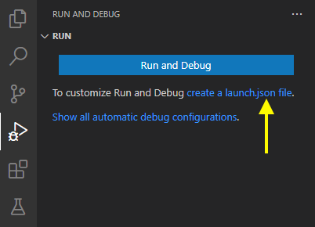

+++
title = "Run and Debug"
date = 2024-01-12T22:36:24+08:00
weight = 60
type = "docs"
description = ""
isCJKLanguage = true
draft = false
+++

> 原文: [https://code.visualstudio.com/docs/java/java-debugging](https://code.visualstudio.com/docs/java/java-debugging)

# Running and debugging Java 运行和调试 Java


Visual Studio Code allows you to debug Java applications through the [Debugger for Java](https://marketplace.visualstudio.com/items?itemName=vscjava.vscode-java-debug) extension. It's a lightweight Java debugger based on [Java Debug Server](https://github.com/microsoft/java-debug), which extends the [Language Support for Java™ by Red Hat](https://marketplace.visualstudio.com/items?itemName=redhat.java).

&zeroWidthSpace;Visual Studio Code 允许您通过 Java 扩展程序的调试器来调试 Java 应用程序。它是一个基于 Java 调试服务器的轻量级 Java 调试器，它扩展了 Red Hat 的 Java™ 语言支持。

Here's a list of supported debugging features:

&zeroWidthSpace;以下是受支持的调试功能列表：

- Launch/Attach
  启动/附加
- Breakpoints
  断点
- Exceptions
  异常
- Pause & Continue
  暂停和继续
- Step In/Out/Over
  单步进入/退出/跳过
- Variables
  变量
- Call Stacks
  调用堆栈
- Threads
  线程
- Debug Console
  调试控制台
- Evaluation
  评估
- Hot Code Replace
  热代码替换

The Java debugger is an open-source project, which welcomes contributors to collaborate through GitHub repositories:

&zeroWidthSpace;Java 调试器是一个开源项目，欢迎贡献者通过 GitHub 存储库进行协作：

- [Debugger for Java
  Java 调试器](https://github.com/microsoft/vscode-java-debug)
- [Java Debug Server for Visual Studio Code
  适用于 Visual Studio Code 的 Java 调试服务器](https://github.com/microsoft/java-debug)

If you run into any issues when using the features below, you can contact us by entering an [issue](https://github.com/microsoft/vscode-java-pack/issues).

&zeroWidthSpace;如果您在使用以下功能时遇到任何问题，可以通过输入问题与我们联系。

## [Install 安装](https://code.visualstudio.com/docs/java/java-debugging#_install)

To get the complete Java language support in Visual Studio Code, you can install the [Extension Pack for Java](https://marketplace.visualstudio.com/items?itemName=vscjava.vscode-java-pack), which includes the Debugger for Java extension.

&zeroWidthSpace;若要获得 Visual Studio Code 中完整的 Java 语言支持，可以安装 Java 扩展包，其中包括 Java 调试器扩展。

[Install the Extension Pack for Java
安装 Java 扩展包](vscode:extension/vscjava.vscode-java-pack)

> For details on how to get started with the extension pack, you can review the [Getting Started with Java](https://code.visualstudio.com/docs/java/java-tutorial) tutorial.
>
> &zeroWidthSpace;有关如何开始使用扩展包的详细信息，您可以查看 Java 入门教程。

## [Configure 配置](https://code.visualstudio.com/docs/java/java-debugging#_configure)

By default, the debugger will run out-of-box by automatically finding the main class and generating a default launch configuration in memory to launch your application.

&zeroWidthSpace;默认情况下，调试器将自动查找主类并在内存中生成默认启动配置以启动应用程序，从而开箱即用。

If you would like to customize and persist your launch configuration, you can select the **create a launch.json file** link in the **Run and Debug** view.

&zeroWidthSpace;如果要自定义并保留启动配置，可以在“运行和调试”视图中选择“创建 launch.json 文件”链接。



The `launch.json` file is located in a `.vscode` folder in your workspace (project root folder).

&zeroWidthSpace; `launch.json` 文件位于工作区（项目根文件夹）中的 `.vscode` 文件夹中。

For more details on how to create the `launch.json`, read [Launch configurations](https://code.visualstudio.com/docs/editor/debugging#_launch-configurations); for more details on configuration options for Java, you can read [Configuration options](https://code.visualstudio.com/docs/java/java-debugging#_configuration-options).

&zeroWidthSpace;有关如何创建 `launch.json` 的更多详细信息，请阅读启动配置；有关 Java 配置选项的更多详细信息，可以阅读配置选项。

## [Run and Debug 运行和调试](https://code.visualstudio.com/docs/java/java-debugging#_run-and-debug)

The debugger extension provides multiple ways to run and debug your Java application.

&zeroWidthSpace;调试器扩展提供了多种运行和调试 Java 应用程序的方法。

### [Run from CodeLens 从 CodeLens 运行](https://code.visualstudio.com/docs/java/java-debugging#_run-from-codelens)

You will find **Run|Debug** on the [CodeLens](https://code.visualstudio.com/blogs/2017/02/12/code-lens-roundup) of your `main()` function.

&zeroWidthSpace;您将在 `main()` 函数的 CodeLens 上找到运行 | 调试。


### [Run from Editor menu 从编辑器菜单运行](https://code.visualstudio.com/docs/java/java-debugging#_run-from-editor-menu)

Another way to start debugging is to select **Run Java** or **Debug Java** menu from the top editor title bar.

&zeroWidthSpace;另一种开始调试的方法是从顶部编辑器标题栏中选择“运行 Java”或“调试 Java”菜单。


### [Run from pressing F5 通过按 F5 运行](https://code.visualstudio.com/docs/java/java-debugging#_run-from-pressing-f5)

Pressing F5, the debugger will automatically find the entry point of your project and start debugging. You can also start a debugging session from the **Run and Debug** view from the side bar of VS Code. See more at [Debugging in VS Code](https://code.visualstudio.com/docs/editor/debugging).

&zeroWidthSpace;按 F5，调试器将自动找到项目的入口点并开始调试。您还可以从 VS Code 侧边栏的“运行和调试”视图中启动调试会话。请参阅 VS Code 中的调试。

## [Debugging single files 调试单个文件](https://code.visualstudio.com/docs/java/java-debugging#_debugging-single-files)

In addition to support for debugging Java projects managed by build tools, VS Code also supports for debugging single Java files without any project.

&zeroWidthSpace;除了支持由构建工具管理的 Java 项目调试之外，VS Code 还支持在没有任何项目的情况下调试单个 Java 文件。

<video autoplay="" loop="" muted="" playsinline="" controls="" title="Debugging a single Main.java file" data-immersive-translate-walked="91797590-0916-4334-b87d-8f934ea008b8" style="box-sizing: border-box; font-family: &quot;Segoe UI&quot;, &quot;Helvetica Neue&quot;, Helvetica, Arial, sans-serif; display: inline-block; vertical-align: baseline; margin-top: 1.5rem; margin-bottom: 2.5rem; width: 616.662px; max-width: 100%; color: rgb(36, 36, 36); font-size: 16px; font-style: normal; font-variant-ligatures: normal; font-variant-caps: normal; font-weight: 400; letter-spacing: normal; orphans: 2; text-align: start; text-indent: 0px; text-transform: none; widows: 2; word-spacing: 0px; -webkit-text-stroke-width: 0px; white-space: normal; background-color: rgb(255, 255, 255); text-decoration-thickness: initial; text-decoration-style: initial; text-decoration-color: initial;"></video>


## [Debug session inputs 调试会话输入](https://code.visualstudio.com/docs/java/java-debugging#_debug-session-inputs)

The default Debug Console in VS Code doesn't support inputs. If your program need inputs from a terminal, you can use the Integrated Terminal (Ctrl+`) within VS Code or an external terminal to launch it. You can also use the user setting `java.debug.settings.console` to configure a global console for all Java debug sessions.

&zeroWidthSpace;VS Code 中的默认调试控制台不支持输入。如果您的程序需要来自终端的输入，则可以使用 VS Code 中的集成终端 (Ctrl+`) 或外部终端来启动它。您还可以使用用户设置 `java.debug.settings.console` 为所有 Java 调试会话配置全局控制台。

<video autoplay="" loop="" muted="" playsinline="" controls="" title="Debugging a Java app that takes input via the Integrated Terminal" data-immersive-translate-walked="91797590-0916-4334-b87d-8f934ea008b8" style="box-sizing: border-box; font-family: &quot;Segoe UI&quot;, &quot;Helvetica Neue&quot;, Helvetica, Arial, sans-serif; display: inline-block; vertical-align: baseline; margin-top: 1.5rem; margin-bottom: 2.5rem; width: 616.662px; max-width: 100%; color: rgb(36, 36, 36); font-size: 16px; font-style: normal; font-variant-ligatures: normal; font-variant-caps: normal; font-weight: 400; letter-spacing: normal; orphans: 2; text-align: start; text-indent: 0px; text-transform: none; widows: 2; word-spacing: 0px; -webkit-text-stroke-width: 0px; white-space: normal; background-color: rgb(255, 255, 255); text-decoration-thickness: initial; text-decoration-style: initial; text-decoration-color: initial;"></video>


## [Breakpoints 断点](https://code.visualstudio.com/docs/java/java-debugging#_breakpoints)

The Debugger for Java supports various breakpoints, such as line breakpoints, conditional breakpoints, data breakpoints, logpoints.

&zeroWidthSpace;Java 调试器支持各种断点，例如行断点、条件断点、数据断点、日志点。

### [Breakpoint - Conditional breakpoint 断点 - 条件断点](https://code.visualstudio.com/docs/java/java-debugging#_breakpoint-conditional-breakpoint)

With the help of expression evaluation, the debugger also supports conditional breakpoint. You can set your breakpoint to break when expression evaluates to true.

&zeroWidthSpace;借助表达式评估，调试器还支持条件断点。当表达式评估为 true 时，您可以设置断点以中断。

<video autoplay="" loop="" muted="" playsinline="" controls="" title="Setting a conditional breakpoint when i==1000" data-immersive-translate-walked="91797590-0916-4334-b87d-8f934ea008b8" style="box-sizing: border-box; font-family: &quot;Segoe UI&quot;, &quot;Helvetica Neue&quot;, Helvetica, Arial, sans-serif; display: inline-block; vertical-align: baseline; margin-top: 1.5rem; margin-bottom: 2.5rem; width: 616.662px; max-width: 100%; color: rgb(36, 36, 36); font-size: 16px; font-style: normal; font-variant-ligatures: normal; font-variant-caps: normal; font-weight: 400; letter-spacing: normal; orphans: 2; text-align: start; text-indent: 0px; text-transform: none; widows: 2; word-spacing: 0px; -webkit-text-stroke-width: 0px; white-space: normal; background-color: rgb(255, 255, 255); text-decoration-thickness: initial; text-decoration-style: initial; text-decoration-color: initial;"></video>


### [Breakpoint - Data breakpoint 断点 - 数据断点](https://code.visualstudio.com/docs/java/java-debugging#_breakpoint-data-breakpoint)

You can have the debugger break when a variable changes its value. Note that the data breakpoint can only be set inside a debug session. This means you need to launch your application and break on a regular breakpoint first. You can then pick a field in the **VARIABLES** view and set a data breakpoint.

&zeroWidthSpace;当变量更改其值时，您可以让调试器中断。请注意，数据断点只能在调试会话中设置。这意味着您需要先启动应用程序并在常规断点处中断。然后，您可以在 VARIABLES 视图中选择一个字段并设置数据断点。


### [Breakpoint - Logpoints 断点 - 日志点](https://code.visualstudio.com/docs/java/java-debugging#_breakpoint-logpoints)

[Logpoints](https://code.visualstudio.com/blogs/2018/07/12/introducing-logpoints-and-auto-attach#_introducing-logpoints) is also supported by Java Debugger. Logpoints allow you to send output to Debug Console without editing code. They're different from breakpoints because they don't stop the execution flow of your application.

&zeroWidthSpace;Java 调试器也支持日志点。日志点允许您将输出发送到调试控制台，而无需编辑代码。它们不同于断点，因为它们不会停止应用程序的执行流。

<video autoplay="" loop="" muted="" playsinline="" controls="" title="Adding a Logpoint that outputs the value of result.size to the Debug Console" data-immersive-translate-walked="91797590-0916-4334-b87d-8f934ea008b8" style="box-sizing: border-box; font-family: &quot;Segoe UI&quot;, &quot;Helvetica Neue&quot;, Helvetica, Arial, sans-serif; display: inline-block; vertical-align: baseline; margin-top: 1.5rem; margin-bottom: 2.5rem; width: 616.662px; max-width: 100%; color: rgb(36, 36, 36); font-size: 16px; font-style: normal; font-variant-ligatures: normal; font-variant-caps: normal; font-weight: 400; letter-spacing: normal; orphans: 2; text-align: start; text-indent: 0px; text-transform: none; widows: 2; word-spacing: 0px; -webkit-text-stroke-width: 0px; white-space: normal; background-color: rgb(255, 255, 255); text-decoration-thickness: initial; text-decoration-style: initial; text-decoration-color: initial;"></video>


## [Expression evaluation 表达式评估](https://code.visualstudio.com/docs/java/java-debugging#_expression-evaluation)

The debugger also lets you evaluate expressions in the **WATCH** window as well as the Debug Console.

&zeroWidthSpace;调试器还允许您在 WATCH 窗口以及调试控制台中评估表达式。

<video autoplay="" loop="" muted="" playsinline="" controls="" title="Add an expression to the WATCH window to display the owner object" data-immersive-translate-walked="91797590-0916-4334-b87d-8f934ea008b8" style="box-sizing: border-box; font-family: &quot;Segoe UI&quot;, &quot;Helvetica Neue&quot;, Helvetica, Arial, sans-serif; display: inline-block; vertical-align: baseline; margin-top: 1.5rem; margin-bottom: 2.5rem; width: 616.662px; max-width: 100%; color: rgb(36, 36, 36); font-size: 16px; font-style: normal; font-variant-ligatures: normal; font-variant-caps: normal; font-weight: 400; letter-spacing: normal; orphans: 2; text-align: start; text-indent: 0px; text-transform: none; widows: 2; word-spacing: 0px; -webkit-text-stroke-width: 0px; white-space: normal; background-color: rgb(255, 255, 255); text-decoration-thickness: initial; text-decoration-style: initial; text-decoration-color: initial;"></video>


## [Hot Code Replace 热代码替换](https://code.visualstudio.com/docs/java/java-debugging#_hot-code-replace)

Another advanced feature the debugger supports is 'Hot Code' replacement. Hot Code Replace (HCR) is a debugging technique whereby the Debugger for Java transmits the class changes over the debugging channel to another Java Virtual Machine (JVM). HCR facilitates experimental development and fosters iterative trial-and-error coding. With this new feature, you can start a debugging session and change a Java file in your development environment, and the debugger will replace the code in the running JVM. No restart is required, which is why it's called "hot". Below is an illustration of how you can use HCR with Debugger for Java in VS Code.

&zeroWidthSpace;调试器支持的另一个高级功能是“热代码”替换。热代码替换 (HCR) 是一种调试技术，Java 调试器通过该技术将类更改通过调试通道传输到另一个 Java 虚拟机 (JVM)。HCR 便于实验性开发并促进迭代试错编码。借助此新功能，您可以在开发环境中启动调试会话并更改 Java 文件，调试器将替换正在运行的 JVM 中的代码。无需重新启动，这就是它被称为“热”的原因。下面说明了如何在 VS Code 中将 HCR 与 Java 调试器配合使用。

<video autoplay="" loop="" muted="" playsinline="" controls="" title="Using Hot Code replacement to change string output during a debug session" data-immersive-translate-walked="91797590-0916-4334-b87d-8f934ea008b8" style="box-sizing: border-box; font-family: &quot;Segoe UI&quot;, &quot;Helvetica Neue&quot;, Helvetica, Arial, sans-serif; display: inline-block; vertical-align: baseline; margin-top: 1.5rem; margin-bottom: 2.5rem; width: 616.662px; max-width: 100%; color: rgb(36, 36, 36); font-size: 16px; font-style: normal; font-variant-ligatures: normal; font-variant-caps: normal; font-weight: 400; letter-spacing: normal; orphans: 2; text-align: start; text-indent: 0px; text-transform: none; widows: 2; word-spacing: 0px; -webkit-text-stroke-width: 0px; white-space: normal; background-color: rgb(255, 255, 255); text-decoration-thickness: initial; text-decoration-style: initial; text-decoration-color: initial;"></video>


You may use the debug setting `java.debug.settings.hotCodeReplace` to control how to trigger Hot Code Replace. The possible setting values are:

&zeroWidthSpace;您可以使用调试设置 `java.debug.settings.hotCodeReplace` 来控制如何触发热代码替换。可能的设置值包括：

- `manual` - Click the toolbar to apply the changes (default).
  `manual` - 单击工具栏以应用更改（默认）。
- `auto` - Automatically apply the changes after compilation.
  `auto` - 编译后自动应用更改。
- `never` - Disable Hot Code Replace.
  `never` - 禁用热代码替换。

## [Step filtering 步骤筛选](https://code.visualstudio.com/docs/java/java-debugging#_step-filtering)

Step filter is supported by the extension to filter out types that you do not want to see or step through while debugging. With this feature, you can configure the packages to filter within your `launch.json` so they could be skipped when you step through.

&zeroWidthSpace;扩展支持步骤筛选，以筛选出您在调试时不想查看或逐步执行的类型。借助此功能，您可以配置要筛选的包，以便在您逐步执行时跳过它们。

<video autoplay="" loop="" muted="" playsinline="" controls="" title="Adding a stepfilter to avoid stepping into java.lang.ClassLoader" data-immersive-translate-walked="91797590-0916-4334-b87d-8f934ea008b8" style="box-sizing: border-box; font-family: &quot;Segoe UI&quot;, &quot;Helvetica Neue&quot;, Helvetica, Arial, sans-serif; display: inline-block; vertical-align: baseline; margin-top: 1.5rem; margin-bottom: 2.5rem; width: 616.662px; max-width: 100%; color: rgb(36, 36, 36); font-size: 16px; font-style: normal; font-variant-ligatures: normal; font-variant-caps: normal; font-weight: 400; letter-spacing: normal; orphans: 2; text-align: start; text-indent: 0px; text-transform: none; widows: 2; word-spacing: 0px; -webkit-text-stroke-width: 0px; white-space: normal; background-color: rgb(255, 255, 255); text-decoration-thickness: initial; text-decoration-style: initial; text-decoration-color: initial;"></video>


## [Configuration options 配置选项](https://code.visualstudio.com/docs/java/java-debugging#_configuration-options)

There are many options and settings available to configure the debugger. For example, configuring the JVM arguments and environment variables is easily done with launch options.

&zeroWidthSpace;有很多选项和设置可用于配置调试器。例如，使用启动选项可以轻松配置 JVM 参数和环境变量。

<video autoplay="" loop="" muted="" playsinline="" controls="" title="Adding various configuration options to the workspace launch.json file" data-immersive-translate-walked="91797590-0916-4334-b87d-8f934ea008b8" style="box-sizing: border-box; font-family: &quot;Segoe UI&quot;, &quot;Helvetica Neue&quot;, Helvetica, Arial, sans-serif; display: inline-block; vertical-align: baseline; margin-top: 1.5rem; margin-bottom: 2.5rem; width: 616.662px; max-width: 100%; color: rgb(36, 36, 36); font-size: 16px; font-style: normal; font-variant-ligatures: normal; font-variant-caps: normal; font-weight: 400; letter-spacing: normal; orphans: 2; text-align: start; text-indent: 0px; text-transform: none; widows: 2; word-spacing: 0px; -webkit-text-stroke-width: 0px; white-space: normal; background-color: rgb(255, 255, 255); text-decoration-thickness: initial; text-decoration-style: initial; text-decoration-color: initial;"></video>


Consult the documentation for the [Language Support for Java™ by Red Hat](https://marketplace.visualstudio.com/items?itemName=redhat.java) extension for help with setting up your project.

&zeroWidthSpace;有关如何设置项目的帮助，请参阅 Red Hat 的 Language Support for Java™ 扩展的文档。

For many commonly used setups, there are samples available in [VS Code Java Debugger Configuration](https://github.com/microsoft/vscode-java-debug/blob/main/Configuration.md). The document explains how the Java debugger automatically generates configurations for you, and if you need to modify them, how to do so with Main class, different arguments, environment, attaching to other Java processes, and usage of more advanced features.

&zeroWidthSpace;对于许多常用设置，VS Code Java 调试器配置中提供了示例。该文档说明了 Java 调试器如何自动为您生成配置，如果您需要修改它们，还说明了如何使用主类、不同的参数、环境、附加到其他 Java 进程以及使用更高级的功能来修改它们。

Below are all the configurations available for `Launch` and `Attach`. For more information about how to write the `launch.json` file, refer to [Debugging](https://code.visualstudio.com/docs/editor/debugging).

&zeroWidthSpace;以下是 `Launch` 和 `Attach` 可用的所有配置。有关如何编写 `launch.json` 文件的更多信息，请参阅调试。

### [Launch 启动](https://code.visualstudio.com/docs/java/java-debugging#_launch)

- `mainClass` (required) - The fully qualified class name (for example [java module name/]com.xyz.MainApp) or the java file path of the program entry.
  `mainClass` （必需）- 完全限定的类名（例如 [java 模块名称/]com.xyz.MainApp）或程序入口的 java 文件路径。

- `args` - The command-line arguments passed to the program. Use `"${command:SpecifyProgramArgs}"` to prompt for program arguments. It accepts a string or an array of string.
  `args` - 传递给程序的命令行参数。使用 `"${command:SpecifyProgramArgs}"` 提示输入程序参数。它接受字符串或字符串数组。

- `sourcePaths` - The extra source directories of the program. The debugger looks for source code from project settings by default. This option allows the debugger to look for source code in extra directories.
  `sourcePaths` - 程序的额外源目录。默认情况下，调试器从项目设置中查找源代码。此选项允许调试器在额外目录中查找源代码。

- ```
  modulePaths
  ```

   

  \- The modulepaths for launching the JVM. If not specified, the debugger will automatically resolve from current project.

  
  `modulePaths` - 用于启动 JVM 的模块路径。如果未指定，调试器将自动从当前项目中解析。

  - `$Auto` - Automatically resolve the modulepaths of current project.
    `$Auto` - 自动解析当前项目的模块路径。
  - `$Runtime` - The modulepaths within 'runtime' scope of current project.
    `$Runtime` - 当前项目“运行时”范围内的模块路径。
  - `$Test` - The modulepaths within 'test' scope of current project.
    `$Test` - 当前项目“测试”范围内的模块路径。
  - `!/path/to/exclude` - Exclude the specified path from modulepaths.
    `!/path/to/exclude` - 从模块路径中排除指定路径。
  - `/path/to/append` - Append the specified path to the modulepaths.
    `/path/to/append` - 将指定路径追加到模块路径。

- ```
  classPaths
  ```

   

  \- The classpaths for launching the JVM. If not specified, the debugger will automatically resolve from current project.

  
  `classPaths` - 启动 JVM 的类路径。如果未指定，调试器将自动从当前项目中解析。

  - `$Auto` - Automatically resolve the classpaths of current project.
    `$Auto` - 自动解析当前项目的类路径。
  - `$Runtime` - The classpaths within 'runtime' scope of current project.
    `$Runtime` - 当前项目“运行时”范围内的类路径。
  - `$Test` - The classpaths within 'test' scope of current project.
    `$Test` - 当前项目“测试”范围内的类路径。
  - `!/path/to/exclude` - Exclude the specified path from classpaths.
    `!/path/to/exclude` - 从类路径中排除指定路径。
  - `/path/to/append` - Append the specified path to the classpaths.
    `/path/to/append` - 将指定路径追加到类路径。

- `encoding` - The `file.encoding` setting for the JVM. If not specified, 'UTF-8' will be used. Possible values can be found in [Supported Encodings](https://docs.oracle.com/javase/8/docs/technotes/guides/intl/encoding.doc.html).
  `encoding` - JVM 的 `file.encoding` 设置。如果未指定，将使用“UTF-8”。可以在支持的编码中找到可能的值。

- `vmArgs` - The extra options and system properties for the JVM (for example -Xms<size> -Xmx<size> -D<name>=<value>), it accepts a string or an array of string.
  `vmArgs` - JVM 的额外选项和系统属性（例如 -Xms -Xmx -D=），它接受字符串或字符串数组。

- `projectName` - The preferred project in which the debugger searches for classes. There could be duplicated class names in different projects. This setting also works when the debugger looks for the specified main class when launching a program. It is required when the workspace has multiple Java projects, otherwise the expression evaluation and conditional breakpoint may not work.
  `projectName` - 调试器搜索类的首选项目。在不同的项目中可能存在重复的类名。当调试器在启动程序时查找指定的主类时，此设置也会起作用。当工作区有多个 Java 项目时，此设置是必需的，否则表达式评估和条件断点可能无法正常工作。

- `cwd` - The working directory of the program. Defaults to `${workspaceFolder}`.
  `cwd` - 程序的工作目录。默认为 `${workspaceFolder}` 。

- `env` - The extra environment variables for the program.
  `env` - 程序的额外环境变量。

- `envFile` - Absolute path to a file containing environment variable definitions.
  `envFile` - 包含环境变量定义的文件的绝对路径。

- `stopOnEntry` - Automatically pause the program after launching.
  `stopOnEntry` - 启动后自动暂停程序。

- ```
  console
  ```

   

  \- The specified console to launch the program. If not specified, use the console specified by the

   

  ```
  java.debug.settings.console
  ```

   

  user setting.

  
  `console` - 启动程序时指定的控制台。如果未指定，则使用 `java.debug.settings.console` 用户设置指定的控制台。

  - `internalConsole` - VS Code Debug Console (input stream not supported).
    `internalConsole` - VS Code 调试控制台（不支持输入流）。
  - `integratedTerminal` - VS Code Integrated Terminal.
    `integratedTerminal` - VS Code 集成终端。
  - `externalTerminal` - External terminal that can be configured in user settings.
    `externalTerminal` - 可以通过用户设置配置的外部终端。

- ```
  shortenCommandLine
  ```

   

  \- When the project has long classpath or big VM arguments, the command line to launch the program may exceed the maximum command-line string limitation allowed by the OS. This configuration item provides multiple approaches to shorten the command line. Defaults to

   

  ```
  auto
  ```

  .

  
  `shortenCommandLine` - 当项目具有较长的类路径或较大的 VM 参数时，启动程序的命令行可能会超过操作系统允许的最大命令行字符串限制。此配置项提供了多种缩短命令行的方法。默认为 `auto` 。

  - `none` - Launch the program with the standard command line 'java {options} classname {args}'.
    `none` - 使用标准命令行“java {options} classname {args}”启动程序。
  - `jarmanifest` - Generate the classpath parameters to a temporary classpath.jar file, and launch the program with the command line 'java -cp classpath.jar classname {args}'.
    `jarmanifest` - 将类路径参数生成到临时类路径 .jar 文件，并使用命令行“java -cp classpath.jar classname {args}”启动程序。
  - `argfile` - Generate the classpath parameters to a temporary argument file, and launch the program with the command line 'java @argfile {args}'. This value only applies to Java 9 and higher.
    `argfile` - 将类路径参数生成到临时参数文件中，并使用命令行“java @argfile {args}”启动程序。此值仅适用于 Java 9 及更高版本。
  - `auto` - Automatically detect the command-line length and determine whether to shorten the command line via an appropriate approach.
    `auto` - 自动检测命令行长度，并确定是否通过适当的方法缩短命令行。

- ```
  stepFilters
  ```

   

  \- Skip specified classes or methods when stepping.

  
  `stepFilters` - 单步执行时跳过指定的类或方法。

  - `classNameFilters` - [**Deprecated** - replaced by `skipClasses`] Skip the specified classes when stepping. Class names should be fully qualified. Wildcard is supported.
    `classNameFilters` - [已弃用 - 已被 `skipClasses` 替换] 单步执行时跳过指定的类。类名应为完全限定名。支持通配符。
  - `skipClasses` - Skip the specified classes when stepping. You could use the built-in variables such as '$JDK' and '$Libraries' to skip a group of classes, or add a specific class name expression, for example `java.*`, `*.Foo`.
    `skipClasses` - 单步执行时跳过指定的类。您可以使用内置变量（例如“$JDK”和“$Libraries”）跳过一组类，或添加特定的类名表达式，例如 `java.*` 、 `*.Foo` 。
  - `skipSynthetics` - Skip synthetic methods when stepping.
    `skipSynthetics` - 单步执行时跳过合成方法。
  - `skipStaticInitializers` - Skip static initializer methods when stepping.
    `skipStaticInitializers` - 单步执行时跳过静态初始化器方法。
  - `skipConstructors` - Skip constructor methods when stepping.
    `skipConstructors` - 单步执行时跳过构造函数方法。

### [Attach 附加](https://code.visualstudio.com/docs/java/java-debugging#_attach)

- `hostName` (required) - The host name or IP address of remote debuggee.
  `hostName` （必需） - 远程调试程序的主机名或 IP 地址。

- `port` (required) - The debug port of remote debuggee.
  `port` （必需）- 远程调试对象的调试端口。

- ```
  processId
  ```

   

  \- Use process picker to select a process to attach, or Process ID as integer.

  
  `processId` - 使用进程选择器选择要附加的进程，或使用整数作为进程 ID。

  - `${command:PickJavaProcess}` - Use process picker to select a process to attach.
    `${command:PickJavaProcess}` - 使用进程选择器选择要附加的进程。
  - An integer PID - Attach to the specified local process.
    整数 PID - 附加到指定的本地进程。

- `timeout` - Time out value before reconnecting, in milliseconds (default to 30000 ms).
  `timeout` - 重新连接前的超时值，以毫秒为单位（默认为 30000 毫秒）。

- `sourcePaths` - The extra source directories of the program. The debugger looks for source code from project settings by default. This option allows the debugger to look for source code in extra directories.
  `sourcePaths` - 程序的额外源目录。默认情况下，调试器从项目设置中查找源代码。此选项允许调试器在额外目录中查找源代码。

- `projectName` - The preferred project in which the debugger searches for classes. There could be duplicated class names in different projects. It is required when the workspace has multiple Java projects, otherwise the expression evaluation and conditional breakpoint may not work.
  `projectName` - 调试器搜索类的首选项目。不同项目中可能存在重复的类名。当工作区有多个 Java 项目时，此选项是必需的，否则表达式评估和条件断点可能无法正常工作。

- ```
  stepFilters
  ```

   

  \- Skip specified classes or methods when stepping.

  
  `stepFilters` - 单步执行时跳过指定的类或方法。

  - `classNameFilters` - [**Deprecated** - replaced by `skipClasses`] Skip the specified classes when stepping. Class names should be fully qualified. Wildcard is supported.
    `classNameFilters` - [已弃用 - 已被 `skipClasses` 替换] 单步执行时跳过指定的类。类名应为完全限定的。支持通配符。
  - `skipClasses` - Skip the specified classes when stepping. You could use the built-in variables such as '$JDK' and '$Libraries' to skip a group of classes, or add a specific class name expression, for example `java.*`, `*.Foo`.
    `skipClasses` - 跳过指定类时进行单步调试。您可以使用内置变量（例如“$JDK”和“$Libraries”）跳过一组类，或添加特定类名表达式，例如 `java.*` 和 `*.Foo` 。
  - `skipSynthetics` - Skip synthetic methods when stepping.
    `skipSynthetics` - 跳过合成方法时进行单步调试。
  - `skipStaticInitializers` - Skip static initializer methods when stepping.
    `skipStaticInitializers` - 跳过静态初始化方法时进行单步调试。
  - `skipConstructors` - Skip constructor methods when stepping.
    `skipConstructors` - 跳过构造函数方法时进行单步调试。

### [User settings 用户设置](https://code.visualstudio.com/docs/java/java-debugging#_user-settings)

- `java.debug.logLevel`: Minimum level of debugger logs that are sent to VS Code, defaults to `warn`.
  `java.debug.logLevel` ：发送到 VS Code 的最低级别的调试器日志，默认为 `warn` 。

- `java.debug.settings.showHex`: Show numbers in hex format in **Variables**, defaults to `false`.
  `java.debug.settings.showHex` ：在“变量”中以十六进制格式显示数字，默认为 `false` 。

- `java.debug.settings.showStaticVariables`: Show static variables in **Variables**, defaults to `false`.
  `java.debug.settings.showStaticVariables` ：在“变量”中显示静态变量，默认为 `false` 。

- `java.debug.settings.showQualifiedNames`: Show fully qualified class names in **Variables**, defaults to `false`.
  `java.debug.settings.showQualifiedNames` ：在“变量”中显示完全限定的类名，默认为 `false` 。

- `java.debug.settings.showLogicalStructure`: Show the logical structure for the Collection and Map classes in **Variables**, defaults to `true`.
  `java.debug.settings.showLogicalStructure` ：在“变量”中显示集合和映射类的逻辑结构，默认为 `true` 。

- `java.debug.settings.showToString`: Show 'toString()' value for all classes that override 'toString' method in **Variables**, defaults to `true`.
  `java.debug.settings.showToString` ：在变量中显示所有覆盖“toString”方法的类的“toString()”值，默认为 `true` 。

- `java.debug.settings.maxStringLength`: The maximum length of strings displayed in **Variables** or **Debug Console**. Strings longer than this limit will be trimmed. The default is `0`, which means no trim is performed.
  `java.debug.settings.maxStringLength` ：在变量或调试控制台中显示的字符串的最大长度。超过此限制的字符串将被修剪。默认值为 `0` ，这意味着不执行修剪。

- ```
  java.debug.settings.hotCodeReplace
  ```

  : Reload the changed Java classes during debugging, defaults to

   

  ```
  manual
  ```

  . Make sure

   

  ```
  java.autobuild.enabled
  ```

   

  is not disabled for the

   

  Java Language Support extension

  . See the

   

  Hot Code Replace wiki page

   

  for more information about usages and limitations.

  
  `java.debug.settings.hotCodeReplace` ：在调试期间重新加载已更改的 Java 类，默认为 `manual` 。确保未禁用 Java 语言支持扩展的 `java.autobuild.enabled` 。有关用法和限制的更多信息，请参阅热代码替换 wiki 页面。

  - manual - Click the toolbar to apply the changes.
    手动 - 单击工具栏以应用更改。
  - auto - Automatically apply the changes after compilation.
    自动 - 在编译后自动应用更改。
  - never - Never apply the changes.
    从不 - 绝不应用更改。

- `java.debug.settings.enableHotCodeReplace`: Enable Hot Code Replace for Java code. Make sure the auto build is not disabled for [VS Code Java](https://github.com/redhat-developer/vscode-java). See the [Hot Code Replace wiki page](https://github.com/microsoft/vscode-java-debug/wiki/Hot-Code-Replace) for more information about usages and limitations.
  `java.debug.settings.enableHotCodeReplace` ：为 Java 代码启用热代码替换。确保未禁用 VS Code Java 的自动构建。有关用法和限制的更多信息，请参阅热代码替换 wiki 页面。

- `java.debug.settings.enableRunDebugCodeLens`: Enable the CodeLens provider for the run and debug buttons over main entry points, defaults to `true`.
  `java.debug.settings.enableRunDebugCodeLens` ：为主要入口点上的运行和调试按钮启用 CodeLens 提供程序，默认为 `true` 。

- `java.debug.settings.forceBuildBeforeLaunch`: Force building the workspace before launching java program, defaults to `true`.
  `java.debug.settings.forceBuildBeforeLaunch` ：在启动 Java 程序之前强制构建工作区，默认为 `true` 。

- ```
  java.debug.settings.console
  ```

  : The specified console to launch a Java program, defaults to

   

  ```
  integratedTerminal
  ```

  . If you want to customize the console for a specific debug session, please modify the

   

  ```
  console
  ```

   

  configuration in

   

  ```
  launch.json
  ```

  .

  
  `java.debug.settings.console` ：用于启动 Java 程序的指定控制台，默认为 `integratedTerminal` 。如果要为特定调试会话自定义控制台，请修改 `launch.json` 中的 `console` 配置。

  - `internalConsole` - VS Code Debug Console (input stream not supported).
    `internalConsole` - VS Code 调试控制台（不支持输入流）。
  - `integratedTerminal` - VS Code Integrated Terminal.
    `integratedTerminal` - VS Code 集成终端。
  - `externalTerminal` - External terminal that can be configured in user settings.
    `externalTerminal` - 可在用户设置中配置的外部终端。

- `java.debug.settings.exceptionBreakpoint.skipClasses`: Skip the specified classes when breaking on exception. You could use the built-in variables such as '$JDK' and '$Libraries' to skip a group of classes, or add a specific class name expression, for example `java.*`, `*.Foo`.
  `java.debug.settings.exceptionBreakpoint.skipClasses` ：在异常中断时跳过指定的类。您可以使用内置变量（如“$JDK”和“$Libraries”）跳过一组类，或添加特定的类名表达式，例如 `java.*` 、 `*.Foo` 。

- `java.debug.settings.stepping.skipClasses`: Skip the specified classes when stepping. You could use the built-in variables such as '$JDK' and '$Libraries' to skip a group of classes, or add a specific class name expression, for example `java.*`, `*.Foo`.
  `java.debug.settings.stepping.skipClasses` ：在单步执行时跳过指定的类。您可以使用内置变量（如“$JDK”和“$Libraries”）跳过一组类，或添加特定的类名表达式，例如 `java.*` 、 `*.Foo` 。

- `java.debug.settings.stepping.skipSynthetics`: Skip synthetic methods when stepping.
  `java.debug.settings.stepping.skipSynthetics` ：在单步执行时跳过合成方法。

- `java.debug.settings.stepping.skipStaticInitializers`: Skip static initializer methods when stepping.
  `java.debug.settings.stepping.skipStaticInitializers` ：在单步执行时跳过静态初始化器方法。

- `java.debug.settings.stepping.skipConstructors`: Skip constructor methods when stepping.
  `java.debug.settings.stepping.skipConstructors` ：在单步执行时跳过构造函数方法。

- `java.debug.settings.jdwp.limitOfVariablesPerJdwpRequest`: The maximum number of variables or fields that can be requested in one JDWP request. The higher the value, the less frequently debuggee will be requested when expanding the variable view. Also a large number can cause JDWP request timeout. Defaults to 100.
  `java.debug.settings.jdwp.limitOfVariablesPerJdwpRequest` ：一个 JDWP 请求中可以请求的最大变量或字段数。值越高，在展开变量视图时对调试程序的请求频率越低。此外，数字过大可能导致 JDWP 请求超时。默认为 100。

- `java.debug.settings.jdwp.requestTimeout`: The timeout (ms) of JDWP request when the debugger communicates with the target JVM. Defaults to 3000.
  `java.debug.settings.jdwp.requestTimeout` ：调试器与目标 JVM 通信时 JDWP 请求的超时时间（毫秒）。默认为 3000。

- `java.debug.settings.vmArgs`: The default VM arguments to launch the Java program. For example, use '-Xmx1G -ea' to increase the heap size to 1 GB and enable assertions. If you want to customize the VM arguments for a specific debug session, you can modify the 'vmArgs' config in `launch.json`.
  `java.debug.settings.vmArgs` ：启动 Java 程序的默认 VM 参数。例如，使用“ -Xmx1G -ea”将堆大小增加到 1 GB 并启用断言。如果您想为特定调试会话自定义 VM 参数，可以在 `launch.json` 中修改“vmArgs”配置。

- `java.silentNotification`: Controls whether notifications can be used to report progress. If true, use status bar to report progress instead. Defaults to `false`.
  `java.silentNotification` ：控制是否可以使用通知来报告进度。如果为 true，则使用状态栏来报告进度。默认为 `false` 。

## [Troubleshooting 故障排除](https://code.visualstudio.com/docs/java/java-debugging#_troubleshooting)

If you encounter issues when using the debugger, a detailed troubleshooting guide can be found in the [vscode-java-debug GitHub repository](https://github.com/microsoft/vscode-java-debug/blob/main/Troubleshooting.md).

&zeroWidthSpace;如果您在使用调试器时遇到问题，可以在 vscode-java-debug GitHub 存储库中找到详细的故障排除指南。

Common issues explained include:

&zeroWidthSpace;说明的常见问题包括：

- Java Language Support extension fails to start.
  Java 语言支持扩展无法启动。
- Build failed, do you want to continue?
  构建失败，是否继续？
- *.java isn't on the classpath. Only syntax errors will be reported.
  *.java 不在类路径中。只会报告语法错误。
- Program Error: Could not find or load main class X.
  程序错误：找不到或无法加载主类 X。
- Program throws ClassNotFoundException.
  程序抛出 ClassNotFoundException。
- Failed to complete Hot Code Replace.
  无法完成热代码替换。
- Please specify the host name and the port of the remote debuggee in the launch.json.
  请在 launch.json 中指定远程调试程序的主机名和端口。
- Failed to evaluate. Reason: Cannot evaluate because the thread is resumed.
  无法评估。原因：无法评估，因为线程已恢复。
- Cannot find a class with the main method.
  找不到具有 main 方法的类。
- No delegateCommandHandler for vscode.java.startDebugSession when starting Debugger.
  启动调试器时没有 vscode.java.startDebugSession 的 delegateCommandHandler。
- Failed to resolve classpath.
  无法解析类路径。
- Request type "X" is not supported. Only "launch" and "attach" are supported.
  请求类型“X”不受支持。仅支持“启动”和“附加”。

## [Feedback and questions 反馈和问题](https://code.visualstudio.com/docs/java/java-debugging#_feedback-and-questions)

You can find the full list of issues at the [vscode-java-debug](https://github.com/microsoft/vscode-java-debug/issues) repository. You can submit a [bug or feature suggestion](https://github.com/microsoft/vscode-java-debug/issues/new) and participate in the community driven [vscode-java-debug Gitter channel](https://gitter.im/Microsoft/vscode-java-debug).

&zeroWidthSpace;您可以在 vscode-java-debug 存储库中找到完整的问题列表。您可以提交错误或功能建议，并参与社区驱动的 vscode-java-debug Gitter 频道。

## [Next steps 后续步骤](https://code.visualstudio.com/docs/java/java-debugging#_next-steps)

Read on to find out about:

&zeroWidthSpace;继续阅读以了解：

- [Debugging](https://code.visualstudio.com/docs/editor/debugging) - Find out how to use the debugger in VS Code with your project for any language.
  调试 - 了解如何将调试器与任何语言的项目一起在 VS Code 中使用。

And for Java:

&zeroWidthSpace;对于 Java：

- [Java testing](https://code.visualstudio.com/docs/java/java-testing) - Test Java within VS Code with the Java Test Runner extension.
  Java 测试 - 使用 Java Test Runner 扩展在 VS Code 中测试 Java。
- [Java extensions](https://code.visualstudio.com/docs/java/extensions) - Learn about more useful Java extensions for VS Code.
  Java 扩展 - 了解 VS Code 的更多有用 Java 扩展。
