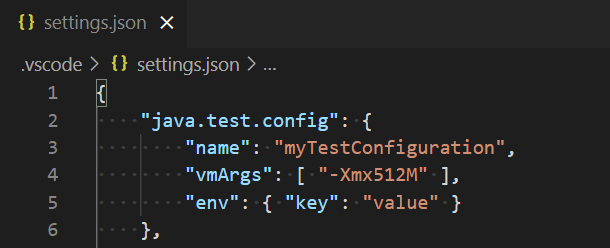
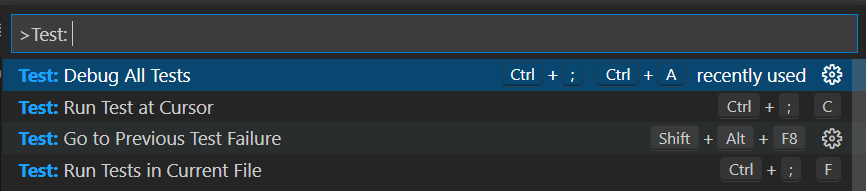
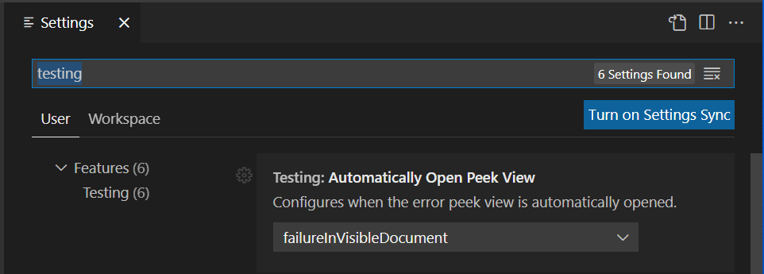

+++
title = "Testing"
date = 2024-01-12T22:36:24+08:00
weight = 70
type = "docs"
description = ""
isCJKLanguage = true
draft = false
+++

> 原文: [https://code.visualstudio.com/docs/java/java-testing](https://code.visualstudio.com/docs/java/java-testing)

# Testing Java with Visual Studio Code 使用 Visual Studio Code 测试 Java


Testing Java in Visual Studio Code is enabled by the [Test Runner for Java](https://marketplace.visualstudio.com/items?itemName=vscjava.vscode-java-test) extension. It's a lightweight extension to run and debug Java test cases.

​​​	Visual Studio Code 中的 Java 测试由 Test Runner for Java 扩展启用。这是一个轻量级扩展，用于运行和调试 Java 测试用例。

## [Overview 概述](https://code.visualstudio.com/docs/java/java-testing#_overview)

The extension supports the following test frameworks:

​​​	该扩展支持以下测试框架：

- [JUnit 4](https://junit.org/junit4/) (v4.8.0+)
- [JUnit 5](https://junit.org/junit5/) (v5.1.0+)
- [TestNG](https://testng.org/doc/) (v6.9.13.3+)

The [Test Runner for Java](https://marketplace.visualstudio.com/items?itemName=vscjava.vscode-java-test) works with the [Language Support for Java™ by Red Hat](https://marketplace.visualstudio.com/items?itemName=redhat.java) and [Debugger for Java](https://marketplace.visualstudio.com/items?itemName=vscjava.vscode-java-debug) extensions to provide the following features:

​​​	Test Runner for Java 与 Red Hat 的 Language Support for Java™ 和 Debugger for Java 扩展配合使用，提供以下功能：

- Run/Debug test cases
  运行/调试测试用例
- Customize test configurations
  自定义测试配置
- View test report
  查看测试报告
- View tests in Testing Explorer
  在测试资源管理器中查看测试

## [Requirements 要求](https://code.visualstudio.com/docs/java/java-testing#_requirements)

- JDK (version 1.8 or later)
  JDK（版本 1.8 或更高版本）
- Visual Studio Code (version 1.59.0 or later)
  Visual Studio Code（版本 1.59.0 或更高版本）
- [Extension Pack for Java
  适用于 Java 的扩展包](https://marketplace.visualstudio.com/items?itemName=vscjava.vscode-java-pack)

[Install the Extension Pack for Java
安装 Java 扩展包](vscode:extension/vscjava.vscode-java-pack)

## [Project Setup 项目设置](https://code.visualstudio.com/docs/java/java-testing#_project-setup)

> **Note**: If you have already setup your Java test framework in your project, you can skip to the [Features](https://code.visualstudio.com/docs/java/java-testing#_features) section.
>
> ​​​	注意：如果您已在项目中设置了 Java 测试框架，则可以跳至功能部分。

### [Enable testing and adding test framework JARs to your project 启用测试并将测试框架 JAR 添加到项目](https://code.visualstudio.com/docs/java/java-testing#_enable-testing-and-adding-test-framework-jars-to-your-project)

Starting with Test Runner for Java version 0.34.0, you can enable a test framework for your unmanaged folder project (a project without any build tools) with just a few steps in the **Testing** Explorer:

​​​	从 Test Runner for Java 版本 0.34.0 开始，您只需在测试资源管理器中执行几个步骤，即可为您的非托管文件夹项目（不含任何构建工具的项目）启用测试框架：

<video autoplay="" loop="" muted="" playsinline="" controls="" title="Enable testing and adding test framework JARs to your project" data-immersive-translate-walked="57bf68ca-656b-4d36-b7cd-7266c7bc024e" style="box-sizing: border-box; font-family: &quot;Segoe UI&quot;, &quot;Helvetica Neue&quot;, Helvetica, Arial, sans-serif; display: inline-block; vertical-align: baseline; margin-top: 1.5rem; margin-bottom: 2.5rem; width: 616.662px; max-width: 100%; color: rgb(36, 36, 36); font-size: 16px; font-style: normal; font-variant-ligatures: normal; font-variant-caps: normal; font-weight: 400; letter-spacing: normal; orphans: 2; text-align: start; text-indent: 0px; text-transform: none; widows: 2; word-spacing: 0px; -webkit-text-stroke-width: 0px; white-space: normal; background-color: rgb(255, 255, 255); text-decoration-thickness: initial; text-decoration-style: initial; text-decoration-color: initial;"></video>


> **Note**: Currently this feature only supports unmanaged folders that do not contain any testing dependencies.
>
> ​​​	注意：目前此功能仅支持不包含任何测试依赖项的非托管文件夹。

### [JUnit 4](https://code.visualstudio.com/docs/java/java-testing#_junit-4)

#### [Maven](https://code.visualstudio.com/docs/java/java-testing#_maven)

Add following configuration into your `pom.xml`:

​​​	将以下配置添加到您的 `pom.xml` 中：

```
<dependency>
  <groupId>junit</groupId>
  <artifactId>junit</artifactId>
  <version>(YOUR_JUNIT_VERSION)</version>
  <scope>test</scope>
</dependency>
```

#### [Gradle](https://code.visualstudio.com/docs/java/java-testing#_gradle)

Make sure following lines are added in your `build.gradle`:

​​​	确保在您的 `build.gradle` 中添加以下行：

```
plugins {
    java
}

dependencies {
    testImplementation('junit:junit:(YOUR_JUNIT_VERSION)')
}
```

#### [Unmanaged folder Unmanaged 文件夹](https://code.visualstudio.com/docs/java/java-testing#_unmanaged-folder)

If your project does not use any build tools, you can enable JUnit 4 via the [Testing Explorer](https://code.visualstudio.com/docs/java/java-testing#_enable-testing-and-adding-test-framework-jars-to-your-project) or by manually downloading the following JARs and adding them to the project classpath (via setting `java.project.referencedLibraries`, check [Dependency management](https://code.visualstudio.com/docs/java/java-project#_dependency-management) for more information):

​​​	如果您的项目不使用任何构建工具，您可以通过测试资源管理器或手动下载以下 JAR 并将它们添加到项目类路径（通过设置 `java.project.referencedLibraries` 来启用 JUnit 4，有关更多信息，请查看依赖项管理）：

- [junit.jar](https://search.maven.org/search?q=g:junit AND a:junit)
- [hamcrest-core.jar](https://search.maven.org/artifact/org.hamcrest/hamcrest-core/1.3/jar)

> You can check the [official JUnit Wiki](https://github.com/junit-team/junit4/wiki/Download-and-Install) for more information about how to setup JUnit 4.
>
> ​​​	您可以查看官方 JUnit Wiki，以获取有关如何设置 JUnit 4 的更多信息。

### [JUnit 5](https://code.visualstudio.com/docs/java/java-testing#_junit-5)

The JUnit 5 team provides a collection of sample projects with different build tools. Check the [junit5-sample repository](https://github.com/junit-team/junit5-samples) if your project uses Maven or Gradle as your build tool.

​​​	JUnit 5 团队提供了一系列具有不同构建工具的示例项目。如果您的项目使用 Maven 或 Gradle 作为构建工具，请查看 junit5-sample 存储库。

#### [Unmanaged folder Unmanaged 文件夹](https://code.visualstudio.com/docs/java/java-testing#_unmanaged-folder)

If your project does not use any build tools, you can enable JUnit 5 via the [Testing Explorer](https://code.visualstudio.com/docs/java/java-testing#_enable-testing-and-adding-test-framework-jars-to-your-project) or by manually including the [junit-platform-console-standalone](https://repo1.maven.org/maven2/org/junit/platform/junit-platform-console-standalone/) JAR in the project classpath (via setting `java.project.referencedLibraries`, check [Dependency management](https://code.visualstudio.com/docs/java/java-project#_dependency-management) for more information).

​​​	如果您的项目不使用任何构建工具，您可以通过测试资源管理器或手动将 junit-platform-console-standalone JAR 包含在项目类路径中来启用 JUnit 5（通过设置 `java.project.referencedLibraries` 来启用，有关更多信息，请查看依赖项管理）。

### [TestNG](https://code.visualstudio.com/docs/java/java-testing#_testng)

#### [Maven](https://code.visualstudio.com/docs/java/java-testing#_maven)

Add following configuration into your `pom.xml`:

​​​	将以下配置添加到您的 `pom.xml` 中：

```
<dependency>
  <groupId>org.testng</groupId>
  <artifactId>testng</artifactId>
  <version>(YOUR_TESTNG_VERSION)</version>
  <scope>test</scope>
</dependency>
```

#### [Gradle](https://code.visualstudio.com/docs/java/java-testing#_gradle)

Make sure following lines are added in your `build.gradle`:

​​​	确保在您的 `build.gradle` 中添加以下行：

```
plugins {
    java
}

dependencies {
    testImplementation('org.testng:testng:(YOUR_TESTNG_VERSION)')
}
```

#### [Unmanaged folder 未管理的文件夹](https://code.visualstudio.com/docs/java/java-testing#_unmanaged-folder)

If your project does not use any build tools, you can enable TestNG via the [Testing Explorer](https://code.visualstudio.com/docs/java/java-testing#_enable-testing-and-adding-test-framework-jars-to-your-project) or by manually downloading the following JARs and adding them to the project classpath (via setting `java.project.referencedLibraries`, check [Dependency management](https://code.visualstudio.com/docs/java/java-project#_dependency-management) for more information):

​​​	如果您的项目不使用任何构建工具，您可以通过测试资源管理器启用 TestNG，或通过手动下载以下 JAR 并将它们添加到项目类路径（通过设置 `java.project.referencedLibraries` ，有关更多信息，请检查依赖项管理）：

- [testng.jar](https://search.maven.org/search?q=g:org.testng AND a:testng)
- [jcommander.jar](https://search.maven.org/search?q=g:com.beust AND a:jcommander)
- [slf4j-api.jar](https://search.maven.org/search?q=g:org.slf4j AND a:slf4j-api)

## [Features 特性](https://code.visualstudio.com/docs/java/java-testing#_features)

### [Run/Debug test cases 运行/调试测试用例](https://code.visualstudio.com/docs/java/java-testing#_rundebug-test-cases)

The Test Runner for Java extension will generate shortcuts (the green play button) on the left side of the class and method definition. To run the target test cases, select the green play button. You can also right-click on it to see more options.

​​​	Java 扩展的测试运行器将在类和方法定义的左侧生成快捷方式（绿色播放按钮）。要运行目标测试用例，请选择绿色播放按钮。您还可以右键单击它以查看更多选项。

<video autoplay="" loop="" muted="" playsinline="" controls="" title="Run/debug test cases" data-immersive-translate-walked="57bf68ca-656b-4d36-b7cd-7266c7bc024e" style="box-sizing: border-box; font-family: &quot;Segoe UI&quot;, &quot;Helvetica Neue&quot;, Helvetica, Arial, sans-serif; display: inline-block; vertical-align: baseline; margin-top: 1.5rem; margin-bottom: 2.5rem; width: 616.662px; max-width: 100%; color: rgb(36, 36, 36); font-size: 16px; font-style: normal; font-variant-ligatures: normal; font-variant-caps: normal; font-weight: 400; letter-spacing: normal; orphans: 2; text-align: start; text-indent: 0px; text-transform: none; widows: 2; word-spacing: 0px; -webkit-text-stroke-width: 0px; white-space: normal; background-color: rgb(255, 255, 255); text-decoration-thickness: initial; text-decoration-style: initial; text-decoration-color: initial;"></video>


### [Testing Explorer 测试资源管理器](https://code.visualstudio.com/docs/java/java-testing#_testing-explorer)

The Testing Explorer is a tree view to show all the test cases in your workspace. You can select the beaker button on the left-side Activity bar of Visual Studio Code to open it. You can also run/debug your test cases and view their test results from there.

​​​	测试资源管理器是一个树视图，用于显示工作区中的所有测试用例。您可以选择 Visual Studio Code 左侧活动栏上的烧杯按钮来打开它。您还可以从此处运行/调试测试用例并查看其测试结果。

<video autoplay="" loop="" muted="" playsinline="" controls="" title="Testing Explorer" data-immersive-translate-walked="57bf68ca-656b-4d36-b7cd-7266c7bc024e" style="box-sizing: border-box; font-family: &quot;Segoe UI&quot;, &quot;Helvetica Neue&quot;, Helvetica, Arial, sans-serif; display: inline-block; vertical-align: baseline; margin-top: 1.5rem; margin-bottom: 2.5rem; width: 616.662px; max-width: 100%; color: rgb(36, 36, 36); font-size: 16px; font-style: normal; font-variant-ligatures: normal; font-variant-caps: normal; font-weight: 400; letter-spacing: normal; orphans: 2; text-align: start; text-indent: 0px; text-transform: none; widows: 2; word-spacing: 0px; -webkit-text-stroke-width: 0px; white-space: normal; background-color: rgb(255, 255, 255); text-decoration-thickness: initial; text-decoration-style: initial; text-decoration-color: initial;"></video>


### [Customize test configurations 自定义测试配置](https://code.visualstudio.com/docs/java/java-testing#_customize-test-configurations)

Sometimes you may want to customize the configuration to run your test cases. To achieve this, you can add the configuration into your workspace [settings](https://code.visualstudio.com/docs/getstarted/settings) under the section: `java.test.config`.

​​​	有时您可能希望自定义配置以运行测试用例。要实现此目的，您可以在部分下的工作区设置中添加配置： `java.test.config` 。



Currently the supported configurations are:

​​​	当前支持的配置为：

- **args**: Specify the command-line arguments that will be passed to the test runner.
  args：指定将传递给测试运行器的命令行参数。

- **classPaths**: The classpaths defined in this setting will be appended to the resolved classpaths.
  classPaths：在此设置中定义的类路径将附加到已解析的类路径。

- **env**: Specify the extra environment variables when running the tests via a key-value object.
  env：通过键值对象指定运行测试时的额外环境变量。

- **envFile**: Specify the absolute path to a file containing environment variable definitions.
  envFile：指定包含环境变量定义的文件的绝对路径。

- **modulePaths**: The modulepaths defined in this setting will be appended to the resolved modulepaths.
  modulePaths：在此设置中定义的模块路径将附加到已解析的模块路径。

- **name**: Specify the name of the configuration item. You can set the default configuration name via setting `java.test.defaultConfig`.
  名称：指定配置项的名称。您可以通过设置 `java.test.defaultConfig` 来设置默认配置名称。

- **preLaunchTask**: Specify the label of a task specified in `tasks.json` (in the workspace's `.vscode` folder). The task will be launched before the start of testing.
  preLaunchTask：指定 `tasks.json` 中指定的任务的标签（在工作区的 `.vscode` 文件夹中）。该任务将在测试开始前启动。

- **sourcePaths**: Specify the extra source paths when debugging the tests.
  sourcePaths：在调试测试时指定额外的源路径。

- **vmArgs**: Specify the extra options and system properties for the JVM.
  vmArgs：为 JVM 指定额外的选项和系统属性。

- **workingDirectory**: Specify the working directory when running the tests.
  workingDirectory：指定运行测试时的工作目录。

- **testKind**: Specify the targeting test framework for this test configuration. Supported values are `junit`, `testng`.
  testKind：为此测试配置指定目标测试框架。支持的值为 `junit` 、 `testng` 。

- filters

  : Specify the test filters.

  
  filters：指定测试筛选器。

  - **tags**: Specify the tags to be included or excluded. Tags having `!` as the prefix will be **excluded**. Note: This setting only takes effect when `testKind` is set to `junit`
    tags：指定要包含或排除的标签。以 `!` 作为前缀的标签将被排除。注意：此设置仅在将 `testKind` 设置为 `junit` 时才生效。

More details can be found on the [vscode-java-test Wiki](https://github.com/Microsoft/vscode-java-test/wiki/Run-with-Configuration).

​​​	可以在 vscode-java-test Wiki 上找到更多详细信息。

### [View test results 查看测试结果](https://code.visualstudio.com/docs/java/java-testing#_view-test-results)

After running/debugging the test cases, the state of the related test items will be updated in both editor decorations and the Testing Explorer.

​​​	在运行/调试测试用例后，相关测试项的状态将在编辑器装饰和测试资源管理器中更新。

<video autoplay="" loop="" muted="" playsinline="" controls="" title="View test results" data-immersive-translate-walked="57bf68ca-656b-4d36-b7cd-7266c7bc024e" style="box-sizing: border-box; font-family: &quot;Segoe UI&quot;, &quot;Helvetica Neue&quot;, Helvetica, Arial, sans-serif; display: inline-block; vertical-align: baseline; margin-top: 1.5rem; margin-bottom: 2.5rem; width: 616.662px; max-width: 100%; color: rgb(36, 36, 36); font-size: 16px; font-style: normal; font-variant-ligatures: normal; font-variant-caps: normal; font-weight: 400; letter-spacing: normal; orphans: 2; text-align: start; text-indent: 0px; text-transform: none; widows: 2; word-spacing: 0px; -webkit-text-stroke-width: 0px; white-space: normal; background-color: rgb(255, 255, 255); text-decoration-thickness: initial; text-decoration-style: initial; text-decoration-color: initial;"></video>


You can trigger the command **Test: Peek Output** to peek the results view. You can select the links in the stack trace to navigate to the source location.

​​​	您可以触发命令测试：预览输出以预览结果视图。您可以选择堆栈跟踪中的链接以导航到源位置。

### [Generate tests 生成测试](https://code.visualstudio.com/docs/java/java-testing#_generate-tests)

The extension provides features to help you scaffold test cases. You can find the entry in the editor context menu. Select **Source Action...** and then choose **Generate Tests...**.

​​​	该扩展程序提供了一些功能来帮助您构建测试用例。您可以在编辑器上下文菜单中找到该条目。选择源操作...，然后选择生成测试...。

If you trigger this source action from your main source code (test subject), you will be asked the test class's fully qualified name and the methods you want to test. The extension will then generate the test code for you:

​​​	如果您从主源代码（测试对象）触发此源操作，系统将询问您测试类的完全限定名称和您想要测试的方法。然后，扩展程序将为您生成测试代码：

<video autoplay="" loop="" muted="" playsinline="" controls="" title="Generate tests" data-immersive-translate-walked="57bf68ca-656b-4d36-b7cd-7266c7bc024e" style="box-sizing: border-box; font-family: &quot;Segoe UI&quot;, &quot;Helvetica Neue&quot;, Helvetica, Arial, sans-serif; display: inline-block; vertical-align: baseline; margin-top: 1.5rem; margin-bottom: 2.5rem; width: 616.662px; max-width: 100%; color: rgb(36, 36, 36); font-size: 16px; font-style: normal; font-variant-ligatures: normal; font-variant-caps: normal; font-weight: 400; letter-spacing: normal; orphans: 2; text-align: start; text-indent: 0px; text-transform: none; widows: 2; word-spacing: 0px; -webkit-text-stroke-width: 0px; white-space: normal; background-color: rgb(255, 255, 255); text-decoration-thickness: initial; text-decoration-style: initial; text-decoration-color: initial;"></video>


If you trigger the source action from your test source code, you will be asked which kinds of test methods you want to add. Including the lifecycle methods and the test method:

​​​	如果您从测试源代码触发源操作，系统将询问您想要添加哪种类型的测试方法。包括生命周期方法和测试方法：

<video autoplay="" loop="" muted="" playsinline="" controls="" title="Generate tests from test" data-immersive-translate-walked="57bf68ca-656b-4d36-b7cd-7266c7bc024e" style="box-sizing: border-box; font-family: &quot;Segoe UI&quot;, &quot;Helvetica Neue&quot;, Helvetica, Arial, sans-serif; display: inline-block; vertical-align: baseline; margin-top: 1.5rem; margin-bottom: 2.5rem; width: 616.662px; max-width: 100%; color: rgb(36, 36, 36); font-size: 16px; font-style: normal; font-variant-ligatures: normal; font-variant-caps: normal; font-weight: 400; letter-spacing: normal; orphans: 2; text-align: start; text-indent: 0px; text-transform: none; widows: 2; word-spacing: 0px; -webkit-text-stroke-width: 0px; white-space: normal; background-color: rgb(255, 255, 255); text-decoration-thickness: initial; text-decoration-style: initial; text-decoration-color: initial;"></video>


### [Test navigation 测试导航](https://code.visualstudio.com/docs/java/java-testing#_test-navigation)

The extension provides features to help you navigate between your tests and test subjects. If your source code is contained in `src/main/java` or `src/test/java`, you can find the entry named **Go to Test** or **Go to Test Subject** in the editor context menu:

​​​	该扩展程序提供了一些功能来帮助您在测试和测试对象之间导航。如果您的源代码包含在 `src/main/java` 或 `src/test/java` 中，您可以在编辑器上下文菜单中找到名为转到测试或转到测试对象的条目：

<video autoplay="" loop="" muted="" playsinline="" controls="" title="Test navigation" data-immersive-translate-walked="57bf68ca-656b-4d36-b7cd-7266c7bc024e" style="box-sizing: border-box; font-family: &quot;Segoe UI&quot;, &quot;Helvetica Neue&quot;, Helvetica, Arial, sans-serif; display: inline-block; vertical-align: baseline; margin-top: 1.5rem; margin-bottom: 2.5rem; width: 616.662px; max-width: 100%; color: rgb(36, 36, 36); font-size: 16px; font-style: normal; font-variant-ligatures: normal; font-variant-caps: normal; font-weight: 400; letter-spacing: normal; orphans: 2; text-align: start; text-indent: 0px; text-transform: none; widows: 2; word-spacing: 0px; -webkit-text-stroke-width: 0px; white-space: normal; background-color: rgb(255, 255, 255); text-decoration-thickness: initial; text-decoration-style: initial; text-decoration-color: initial;"></video>


You can also find the command in the Command Palette (Ctrl+Shift+P) by searching for **Java: Go to Test**.

​​​	您还可以在命令面板（Ctrl+Shift+P）中搜索 Java: 转到测试来查找该命令。

### [VS Code testing commands VS Code 测试命令](https://code.visualstudio.com/docs/java/java-testing#_vs-code-testing-commands)

There are other testing commands (for example, **Run Tests in Current File**) that can be found by searching for 'Test:' in the Command Palette (Ctrl+Shift+P).

​​​	还有其他测试命令（例如，在当前文件中运行测试），可以通过在命令面板（Ctrl+Shift+P）中搜索“测试：”来找到。



### [VS Code testing settings VS Code 测试设置](https://code.visualstudio.com/docs/java/java-testing#_vs-code-testing-settings)

There are VS Code settings specific to testing that can be found by searching for 'testing' in the Settings editor (Ctrl+,).

​​​	有专门用于测试的 VS Code 设置，可以在设置编辑器（Ctrl+,）中搜索“测试”来找到。



## [FAQ](https://code.visualstudio.com/docs/java/java-testing#_faq)

If you meet any problem when using the extension, you can review the [FAQ](https://github.com/microsoft/vscode-java-test/wiki/FAQ) and our [issue list](https://github.com/microsoft/vscode-java-test/issues) to check if there is an answer to your problem.

​​​	如果您在使用扩展时遇到任何问题，可以查看常见问题解答和我们的问题列表，以检查是否有您问题的答案。

## [Contributing and feedback 贡献和反馈](https://code.visualstudio.com/docs/java/java-testing#_contributing-and-feedback)

If you are interested in providing feedback or contributing directly to the code base, please read [Contributing to Test Runner for Java](https://github.com/Microsoft/vscode-java-test/blob/main/CONTRIBUTING.md), which covers the following:

​​​	如果您有兴趣提供反馈或直接为代码库做出贡献，请阅读对 Java 测试运行器的贡献，其中涵盖以下内容：

- [Questions and Feedback
  问题和反馈](https://github.com/Microsoft/vscode-java-test/blob/main/CONTRIBUTING.md#questions-and-feedback)
- [Reporting Issues
  报告问题](https://github.com/Microsoft/vscode-java-test/blob/main/CONTRIBUTING.md#reporting-issues)
- [Contributing Fixes
  贡献修复](https://github.com/Microsoft/vscode-java-test/blob/main/CONTRIBUTING.md#contributing-fixes)

## [Next steps 后续步骤](https://code.visualstudio.com/docs/java/java-testing#_next-steps)

Read on to find out about:

​​​	继续阅读以了解：

- [Debugging](https://code.visualstudio.com/docs/java/java-debugging) - Find out how to debug your Java project with VS Code.
  调试 - 了解如何使用 VS Code 调试 Java 项目。
- [Extensions for Java](https://code.visualstudio.com/docs/java/extensions) - Learn about more useful Java extensions for VS Code.
  Java 扩展 - 了解有关 VS Code 的更多有用 Java 扩展。
