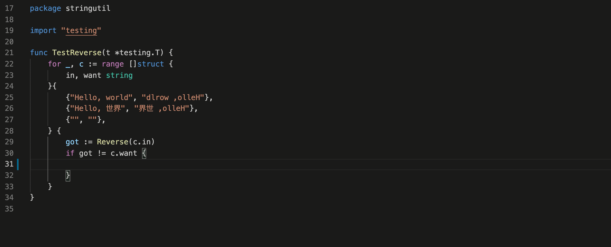

+++
title = "Go"
date = 2024-01-12T22:36:24+08:00
weight = 160
type = "docs"
description = ""
isCJKLanguage = true
draft = false
+++

> 原文: [https://code.visualstudio.com/docs/languages/go](https://code.visualstudio.com/docs/languages/go)

# Go in Visual Studio Code 在 Visual Studio Code 中转到


Using the Go extension for Visual Studio Code, you get features like IntelliSense, code navigation, symbol search, testing, debugging, and many more that will help you in [Go](https://golang.org/) development.

​​	使用 Visual Studio Code 的 Go 扩展，您可以获得 IntelliSense、代码导航、符号搜索、测试、调试等功能，这些功能将帮助您进行 Go 开发。


You can install the Go extension from the VS Code [Marketplace](https://marketplace.visualstudio.com/items?itemName=golang.go).

​​	您可以从 VS Code Marketplace 安装 Go 扩展。

Watch ["Getting started with VS Code Go"](https://youtu.be/1MXIGYrMk80) for an explanation of how to build your first Go application using VS Code Go.

​​	观看“使用 VS Code Go 入门”以了解如何使用 VS Code Go 构建您的第一个 Go 应用程序。

This article describes only a subset of the features the Go extension provides. See the extension's [documentation](https://github.com/golang/vscode-go/wiki/features) for the full, up-to-date list of supported features.

​​	本文仅介绍 Go 扩展提供的一部分功能。有关受支持功能的完整最新列表，请参阅扩展的文档。

## [IntelliSense](https://code.visualstudio.com/docs/languages/go#_intellisense)



IntelliSense features are provided by the Go language server, [gopls](https://golang.org/s/gopls), maintained by the Go team. You can configure the behavior of `gopls` using the [`gopls` settings](https://github.com/golang/vscode-go/wiki/settings#settings-for-gopls).

​​	IntelliSense 功能由 Go 团队维护的 Go 语言服务器 gopls 提供。您可以使用 `gopls` 设置配置 `gopls` 的行为。

### [Semantic syntax highlighting 语义语法突出显示](https://code.visualstudio.com/docs/languages/go#_semantic-syntax-highlighting)

For better syntax highlighting than the default TextMate-based syntax highlighting, we recommend enabling [semantic highlighting](https://code.visualstudio.com/api/language-extensions/semantic-highlight-guide) by turning on Gopls' `ui.semanticTokens` setting.

​​	为了获得比默认基于 TextMate 的语法突出显示更好的语法突出显示，我们建议通过启用 Gopls 的 `ui.semanticTokens` 设置来启用语义突出显示。

```
"gopls": { "ui.semanticTokens": true }
```

### [Auto completions 自动完成](https://code.visualstudio.com/docs/languages/go#_auto-completions)

As you type in a Go file, you can see IntelliSense providing you with suggested completions. This even works for members in current, imported, and not yet imported packages. Just type any package name followed by `.`, and you will get suggestions for the corresponding package members.

​​	在 Go 文件中键入时，您可以看到 IntelliSense 为您提供建议的补全。这甚至适用于当前、已导入和尚未导入的包中的成员。只需键入任何包名称，后跟 `.` ，您将获得相应包成员的建议。

> **Tip**: Use Ctrl+Space to trigger the suggestions manually.
>
> ​​	提示：使用 Ctrl+Space 手动触发建议。

### [Hover information 悬停信息](https://code.visualstudio.com/docs/languages/go#_hover-information)

Hovering on any variable, function, or struct will give you information on that item such as documentation, signature, etc.

​​	将鼠标悬停在任何变量、函数或结构上，都会为您提供有关该项的信息，例如文档、签名等。

### [Signature help 签名帮助](https://code.visualstudio.com/docs/languages/go#_signature-help)

When you open the `(` while calling a function, a pop-up provides signature help for the function. As you keep typing the parameters, the hint (underline) moves to the next parameter.

​​	在调用函数时打开 `(` 时，弹出窗口会为该函数提供签名帮助。在您继续键入参数时，提示（下划线）会移至下一个参数。

> **Tip**: Use Ctrl+Shift+Space to manually trigger the signature help when the cursor is inside the `()` in the function call.
>
> ​​	提示：当光标位于函数调用中的 `()` 内时，使用 Ctrl+Shift+Space 手动触发签名帮助。

## [Code navigation 代码导航](https://code.visualstudio.com/docs/languages/go#_code-navigation)

Code Navigation features are available in the context menu in the editor.

​​	代码导航功能在编辑器的上下文菜单中可用。

- **Go to Definition** F12 - Go to the source code of the type definition.
  转到定义 F12 - 转到类型定义的源代码。
- **Go to Type Definition** - Go to the type that defines a symbol.
  转到类型定义 - 转到定义符号的类型。
- **Peek Definition** Alt+F12 - Bring up a Peek window with the type definition.
  预览定义 Alt+F12 - 使用类型定义调出预览窗口。
- **Go to References** Shift+F12 - Show all references for the type.
  转到引用 Shift+F12 - 显示类型的全部引用。
- **Show Call Hierarchy** Shift+Alt+H - Show all calls from or to a function.
  显示调用层次结构 Shift+Alt+H - 显示从函数或到函数的所有调用。
- **Go to Implementations** Ctrl+F12 - Bring up a Peek window with the list of all implementations of an interface (if triggered with an interface type symbol), or interfaces a type implements (if triggered with a concrete type symbol).
  转到实现 Ctrl+F12 - 使用所有接口实现的列表调出预览窗口（如果使用接口类型符号触发），或类型实现的接口（如果使用具体类型符号触发）。
- **Find All Implementations** - Show all implementation of an interface (if triggered with an interface type symbol), or interfaces a type implements (if triggered with a concrete type symbol).
  查找所有实现 - 显示接口的所有实现（如果使用接口类型符号触发），或类型实现的接口（如果使用具体类型符号触发）。

You can navigate via symbol search using the **Go to Symbol** commands from the Command Palette (Ctrl+Shift+P).

​​	您可以使用命令面板（Ctrl+Shift+P）中的转到符号命令通过符号搜索进行导航。

- **Go to Symbol in File** - Ctrl+Shift+O
  转到文件中的符号 - Ctrl+Shift+O
- **Go to Symbol in Workspace** - Ctrl+T
  转到工作区中的符号 - Ctrl+T

You can also navigate back and forth between a Go file and its test implementation using the **Go: Toggle Test File** command.

​​	您还可以使用 Go: 切换测试文件命令在 Go 文件及其测试实现之间来回导航。

## [Build and diagnose 构建和诊断](https://code.visualstudio.com/docs/languages/go#_build-and-diagnose)

The Go language server (`gopls`) detects build and vet errors found on the workspace. The errors and warnings from running any/all of the above will be shown red/green squiggly lines in the editor. These diagnostics also show up in the **Problems** panel (**View** > **Problems**).

​​	Go 语言服务器 ( `gopls` ) 会检测工作区中发现的构建和 vet 错误。在编辑器中，运行上述任何/所有命令产生的错误和警告将显示为红色/绿色波浪线。这些诊断也会显示在“问题”面板中（“视图”>“问题”）。

You can add additional lint checks using the `go.lintOnSave` setting and configuring your choice of linting tool (`staticcheck`, `golangci-lint`, or `revive`) using the `go.lintTool` setting.

​​	您可以使用 `go.lintOnSave` 设置添加其他 lint 检查，并使用 `go.lintTool` 设置配置您选择的 linting 工具（ `staticcheck` 、 `golangci-lint` 或 `revive` ）。

## [Formatting 格式化](https://code.visualstudio.com/docs/languages/go#_formatting)

You can format your Go file using Shift+Alt+F or by running the **Format Document** command from the Command Palette or the context menu in the editor.

​​	您可以使用 Shift+Alt+F 格式化 Go 文件，或从命令面板或编辑器中的上下文菜单运行“格式化文档”命令。

By default, formatting is run when you save your Go file. You can disable this behavior by setting `editor.formatOnSave` to `false` for the `[go]` language identifier. You can change this using your JSON setting files.

​​	默认情况下，在您保存 Go 文件时会运行格式化。您可以通过将 `editor.formatOnSave` 设置为 `false` （适用于 `[go]` 语言标识符）来禁用此行为。您可以使用 JSON 设置文件更改此设置。

```
"[go]": {
        "editor.formatOnSave": false
}
```

When you have multiple formatters activated for Go files, you can select the Go extension as the default formatter.

​​	当您为 Go 文件激活多个格式化程序时，可以选择 Go 扩展作为默认格式化程序。

```
"[go]": {
    "editor.defaultFormatter": "golang.go"
}
```

Formatting is provided by `gopls`. If you want `gofumpt`-style formatting, you can configure `gopls` to use `gofumpt`.

​​	格式化由 `gopls` 提供。如果您想要 `gofumpt` 样式的格式化，可以将 `gopls` 配置为使用 `gofumpt` 。

```
"gopls": {
    "formatting.gofumpt": true
}
```

## [Test 测试](https://code.visualstudio.com/docs/languages/go#_test)

The VS Code [Test UI](https://code.visualstudio.com/api/extension-guides/testing) and editor [CodeLens](https://code.visualstudio.com/blogs/2017/02/12/code-lens-roundup) elements allow users to easily run tests, benchmarks, profiles for a given function, file, package, or workspace.

​​	VS Code 测试 UI 和编辑器 CodeLens 元素允许用户轻松地运行给定函数、文件、包或工作区的测试、基准和配置文件。

Alternatively, the same functionality is available through a set of commands:

​​	或者，可以通过一组命令使用相同的功能：

- [**Go: Test Function At Cursor
  转到：测试光标处的函数**](https://github.com/golang/vscode-go/wiki/commands#go-test-function-at-cursor)
- [**Go: Test File
  转到：测试文件**](https://github.com/golang/vscode-go/wiki/commands#go-test-file)
- [**Go: Test Package
  转到：测试包**](https://github.com/golang/vscode-go/wiki/commands#go-test-package)
- [**Go: Test All Packages in Workspace
  转到：测试工作区中的所有包**](https://github.com/golang/vscode-go/wiki/commands#go-test-all-packages-in-workspace)

There are many test-related commands that you can explore by typing "Go: test" in the Command Palette.

​​	在命令面板中键入“转到：测试”可以浏览许多与测试相关的命令。


The first three above can be used to generate test skeletons for the functions in the current package, file, or at the cursor using `gotests`. The last few can be used to run tests in the current package, file, or at the cursor using `go test`. There is also a command for getting test coverage.

​​	前三个命令可用于使用 `gotests` 为当前包、文件或光标处的函数生成测试框架。最后几个命令可用于使用 `go test` 运行当前包、文件或光标处的测试。还有一个命令用于获取测试覆盖率。

You can configure the extension to run tests and compute test coverage using:

​​	您可以配置扩展以使用以下方式运行测试并计算测试覆盖率：

- `go.testOnSave`
- `go.coverOnSave`
- `go.testFlags`

## [Import packages 导入包](https://code.visualstudio.com/docs/languages/go#_import-packages)

The extension organizes imports, and removes unused imports by default. For different behavior, you can override per-language default settings following [these instructions](https://github.com/golang/vscode-go/wiki/advanced#formatting-code-and-organizing-imports).

​​	该扩展程序会整理导入内容，并默认删除未使用的导入内容。对于不同的行为，您可以按照以下说明覆盖每种语言的默认设置。

Run the command **Go: Add Import** to get a list of packages that can be imported to your Go file. Choose one and it will get added in the import block of your Go file.

​​	运行命令 Go: Add Import 以获取可导入到 Go 文件的包列表。选择一个，它将添加到 Go 文件的导入块中。

## [Refactoring 重构](https://code.visualstudio.com/docs/languages/go#_refactoring)

Select the area for refactoring (for example variable, function body, etc.). Click on the Code Action light bulb icon that appears in the selected area, or select **Refactoring...** or **Rename Symbol** (F2) from the VS Code context menu.

​​	选择要重构的区域（例如变量、函数体等）。单击选定区域中显示的代码操作灯泡图标，或从 VS Code 上下文菜单中选择重构...或重命名符号 (F2)。

## [Debugging 调试](https://code.visualstudio.com/docs/languages/go#_debugging)

The Go extension lets you debug Go code by utilizing the [Delve](https://github.com/go-delve/delve) debugger.

​​	Go 扩展允许您通过利用 Delve 调试器来调试 Go 代码。

Read [Debug Go programs in VS Code](https://github.com/golang/vscode-go/wiki/debugging) for setup steps, supported features, configurations, information on remote debugging and a troubleshooting guide. For general debugging features such as inspecting variables, setting breakpoints, and other activities that aren't language-dependent, review [VS Code debugging](https://code.visualstudio.com/docs/editor/debugging).

​​	阅读 VS Code 中的调试 Go 程序以了解设置步骤、支持的功能、配置、有关远程调试的信息和故障排除指南。有关检查变量、设置断点和其他不依赖于语言的活动等常规调试功能，请查看 VS Code 调试。

Some features unique to Go are:

​​	Go 特有的某些功能包括：

- Local & remote debugging
  本地和远程调试
- Data inspection using [Delve's expression syntax](https://github.com/go-delve/delve/blob/master/Documentation/cli/expr.md)
  使用 Delve 表达式语法检查数据
- Dynamic configuration change and inspection options with [`dlv` command](https://github.com/golang/vscode-go/wiki/debugging#dlv-command-from-debug-console) from DEBUG CONSOLE
  使用 DEBUG CONSOLE 中的 `dlv` 命令进行动态配置更改和检查选项
- Ability to hide/show system goroutines (use `hideSystemGoroutines` configuration)
  隐藏/显示系统 goroutine 的功能（使用 `hideSystemGoroutines` 配置）
- Disassembly view support (right-click your source code and select **Open Disassembly View**)
  反汇编视图支持（右键单击源代码并选择打开反汇编视图）
- Experimental function call, core inspection, Mozilla `rr` support
  实验性函数调用、核心检查、Mozilla `rr` 支持

## [Next steps 后续步骤](https://code.visualstudio.com/docs/languages/go#_next-steps)

This has been a brief overview showing the Go extension features within VS Code. For more information, see the details provided in the Go extension [README](https://github.com/golang/vscode-go/blob/master/README.md).

​​	这是展示 VS Code 中 Go 扩展功能的简要概述。有关更多信息，请参阅 Go 扩展自述文件中提供的详细信息。

To stay up to date on the latest features/bug fixes for the Go extension, see the [CHANGELOG](https://github.com/golang/vscode-go/blob/master/CHANGELOG.md).

​​	若要了解 Go 扩展的最新功能/错误修复，请参阅 CHANGELOG。

If you have any issues or feature requests, feel free to log them in the Go extension [vscode-go repo](https://github.com/golang/vscode-go/issues).

​​	如果您有任何问题或功能请求，请随时在 Go 扩展 vscode-go 存储库中记录它们。

If you'd like to learn more about VS Code, try these topics:

​​	如果您想详细了解 VS Code，请尝试以下主题：

- [Basic Editing](https://code.visualstudio.com/docs/editor/codebasics) - A quick introduction to the basics of the VS Code editor.
  基本编辑 - VS Code 编辑器的基础知识快速入门。
- [Install an Extension](https://code.visualstudio.com/docs/editor/extension-marketplace) - Learn about other extensions are available in the [Marketplace](https://marketplace.visualstudio.com/vscode).
  安装扩展 - 了解市场中提供的其他扩展。
- [Code Navigation](https://code.visualstudio.com/docs/editor/editingevolved) - Move quickly through your source code.
  代码导航 - 快速浏览源代码。
