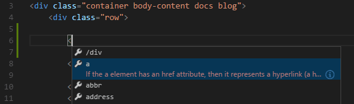
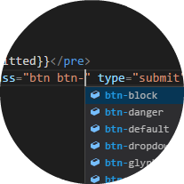

+++
title = "HTML"
date = 2024-01-12T22:36:24+08:00
weight = 30
type = "docs"
description = ""
isCJKLanguage = true
draft = false
+++

> 原文: [https://code.visualstudio.com/docs/languages/html](https://code.visualstudio.com/docs/languages/html)

# HTML in Visual Studio Code Visual Studio Code 中的 HTML


Visual Studio Code provides basic support for HTML programming out of the box. There is syntax highlighting, smart completions with IntelliSense, and customizable formatting. VS Code also includes great Emmet support.

​​	Visual Studio Code 开箱即用地为 HTML 编程提供了基本支持。它具有语法突出显示、带有 IntelliSense 的智能补全以及可自定义的格式。VS Code 还包括出色的 Emmet 支持。

## [IntelliSense]()

As you type in HTML, we offer suggestions via HTML IntelliSense. In the image below, you can see a suggested HTML element closure `</div>` as well as a context specific list of suggested elements.

​​	在您键入 HTML 时，我们通过 HTML IntelliSense 提供建议。在下图中，您可以看到建议的 HTML 元素闭合 `</div>` 以及特定于上下文的建议元素列表。



Document symbols are also available for HTML, allowing you to quickly navigate to DOM nodes by id and class name.

​​	HTML 还可以使用文档符号，允许您通过 id 和类名快速导航到 DOM 节点。

You can also work with embedded CSS and JavaScript. However, note that script and style includes from other files are not followed, the language support only looks at the content of the HTML file.

​​	您还可以使用嵌入式 CSS 和 JavaScript。但是，请注意，不支持从其他文件中包含脚本和样式，语言支持仅查看 HTML 文件的内容。

You can trigger suggestions at any time by pressing Ctrl+Space.

​​	您可以随时按 Ctrl+Space 触发建议。

You can also control which built-in code completion providers are active. Override these in your user or workspace [settings]() if you prefer not to see the corresponding suggestions.

​​	您还可以控制哪些内置代码补全提供程序处于活动状态。如果您不想看到相应的建议，请在用户或工作区设置中覆盖这些建议。

```
// Configures if the built-in HTML language suggests HTML5 tags, properties and values.
"html.suggest.html5": true
```

## [Close tags 关闭标记]()

Tag elements are automatically closed when `>` of the opening tag is typed.

​​	键入开始标记的 `>` 时，标记元素会自动关闭。


The matching closing tag is inserted when `/` of the closing tag is entered.

​​	输入结束标记的 `/` 时，会插入匹配的结束标记。


You can turn off autoclosing tags with the following [setting]():

​​	您可以使用以下设置关闭自动关闭标签：

```
"html.autoClosingTags": false
```

## [Auto update tags 自动更新标记]()

When modifying a tag, the linked editing feature automatically updates the matching closing tag. The feature is optional and can be enabled by setting:

​​	修改标签时，关联编辑功能会自动更新匹配的关闭标签。此功能是可选的，可以通过设置启用：

```
"editor.linkedEditing": true
```

## [Color picker 颜色选取器]()

The VS Code color picker UI is now available in HTML style sections.

​​	VS Code 颜色选取器 UI 现在可在 HTML 样式部分中使用。


It supports configuration of hue, saturation and opacity for the color that is picked up from the editor. It also provides the ability to trigger between different color modes by clicking on the color string at the top of the picker. The picker appears on a hover when you are over a color definition.

​​	它支持对从编辑器中选取的颜色配置色调、饱和度和不透明度。它还提供了通过单击选取器顶部的颜色字符串在不同颜色模式之间触发的功能。当您位于颜色定义上方时，选取器会以悬停方式出现。

## [Hover 悬停]()

Move the mouse over HTML tags or embedded styles and JavaScript to get more information on the symbol under the cursor.

​​	将鼠标悬停在 HTML 标签或嵌入式样式和 JavaScript 上，以获取有关光标下符号的更多信息。


## [Validation 验证]()

The HTML language support performs validation on all embedded JavaScript and CSS.

​​	HTML 语言支持对所有嵌入式 JavaScript 和 CSS 执行验证。

You can turn that validation off with the following settings:

​​	您可以使用以下设置关闭该验证：

```
// Configures if the built-in HTML language support validates embedded scripts.
"html.validate.scripts": true,

// Configures if the built-in HTML language support validates embedded styles.
"html.validate.styles": true
```

## [Folding 折叠]()

You can fold regions of source code using the folding icons on the gutter between line numbers and line start. Folding regions are available for all HTML elements for multiline comments in the source code.

​​	您可以使用行号和行首之间的间隙上的折叠图标折叠源代码区域。源代码中所有 HTML 元素的多行注释都提供折叠区域。

Additionally you can use the following region markers to define a folding region: `<!-- #region -->` and `<!-- endregion -->`

​​	此外，您还可以使用以下区域标记来定义折叠区域： `<!-- #region -->` 和 `<!-- endregion -->`

If you prefer to switch to indentation based folding for HTML use:

​​	如果您更喜欢切换到基于缩进的 HTML 折叠，请使用：

```
"[html]": {
    "editor.foldingStrategy": "indentation"
},
```

## [Formatting 格式化]()

To improve the formatting of your HTML source code, you can use the **Format Document** command Shift+Alt+F to format the entire file or **Format Selection** Ctrl+K Ctrl+F to just format the selected text.

​​	为了改进 HTML 源代码的格式，您可以使用“格式化文档”命令 Shift+Alt+F 格式化整个文件，或使用“格式化选定内容”Ctrl+K Ctrl+F 仅格式化选定的文本。

The HTML formatter is based on [js-beautify](https://www.npmjs.com/package/js-beautify). The formatting options offered by that library are surfaced in the VS Code [settings]():

​​	HTML 格式化程序基于 js-beautify。该库提供的格式化选项显示在 VS Code 设置中：

- `html.format.wrapLineLength`: Maximum amount of characters per line.
  `html.format.wrapLineLength` ：每行最大字符数。

- `html.format.unformatted`: List of tags that shouldn't be reformatted.
  `html.format.unformatted` ：不应重新格式化的标签列表。

- `html.format.contentUnformatted`: List of tags, comma separated, where the content shouldn't be reformatted.
  `html.format.contentUnformatted` ：以逗号分隔的标签列表，其中不应重新格式化内容。

- `html.format.extraLiners`: List of tags that should have an extra newline before them.
  `html.format.extraLiners` ：应在其之前添加额外换行符的标签列表。

- `html.format.preserveNewLines`: Whether existing line breaks before elements should be preserved.
  `html.format.preserveNewLines` ：是否保留元素之前的现有换行符。

- `html.format.maxPreserveNewLines`: Maximum number of line breaks to be preserved in one chunk.
  `html.format.maxPreserveNewLines` ：一个块中保留的最大换行符数。

- `html.format.indentInnerHtml`: Indent `<head>` and `<body>` sections.
  `html.format.indentInnerHtml` ：缩进 `<head>` 和 `<body>` 部分。

- ```
  html.format.wrapAttributes
  ```

  : Wrapping strategy for attributes:

  
  `html.format.wrapAttributes` ：属性的换行策略：

  - `auto`: Wrap when the line length is exceeded
    `auto` ：当超出行长度时换行
  - `force`: Wrap all attributes, except first
    `force` ：换行所有属性，第一个除外
  - `force-aligned`: Wrap all attributes, except first, and align attributes
    `force-aligned` ：换行所有属性，第一个除外，并对齐属性
  - `force-expand-multiline`: Wrap all attributes
    `force-expand-multiline` ：换行所有属性
  - `aligned-multiple`: Wrap when line length is exceeded, align attributes vertically
    `aligned-multiple` ：当超出行长度时换行，垂直对齐属性
  - `preserve`: Preserve wrapping of attributes
    `preserve` ：保留属性的换行
  - `preserve-aligned`: Preserve wrapping of attributes but align
    `preserve-aligned` ：保留属性的换行，但对齐

- `html.format.wrapAttributesIndentSize`: Alignment size when using `force aligned` and `aligned multiple` in `html.format.wrapAttributes` or `null` to use the default indent size.
  `html.format.wrapAttributesIndentSize` ：在 `html.format.wrapAttributes` 或 `null` 中使用 `force aligned` 和 `aligned multiple` 时对齐大小，以使用默认缩进大小。

- `html.format.templating`: Honor django, erb, handlebars and php templating language tags.
  `html.format.templating` ：尊重 django、erb、handlebars 和 php 模板语言标记。

- `html.format.unformattedContentDelimiter`: Keep text content together between this string.
  `html.format.unformattedContentDelimiter` ：将此字符串之间的文本内容保持在一起。

> **Tip:** The formatter doesn't format the tags listed in the `html.format.unformatted` and `html.format.contentUnformatted` settings. Embedded JavaScript is formatted unless 'script' tags are excluded.
>
> ​​	提示：格式化程序不会格式化 `html.format.unformatted` 和 `html.format.contentUnformatted` 设置中列出的标记。除非排除“script”标记，否则会格式化嵌入式 JavaScript。

The Marketplace has several alternative formatters to choose from. If you want to use a different formatter, define `"html.format.enable": false` in your settings to turn off the built-in formatter.

​​	市场有几种备选格式化程序可供选择。如果您想使用不同的格式化程序，请在设置中定义 `"html.format.enable": false` 以关闭内置格式化程序。

## [Emmet snippets Emmet 代码段]()

VS Code supports [Emmet snippet](https://emmet.io/) expansion. Emmet abbreviations are listed along with other suggestions and snippets in the editor auto-completion list.

​​	VS Code 支持 Emmet 代码段扩展。Emmet 缩写与其他建议和代码段一起列在编辑器自动完成列表中。


> **Tip:** See the HTML section of the [Emmet cheat sheet](https://docs.emmet.io/cheat-sheet) for valid abbreviations.
>
> ​​	提示：请参阅 Emmet 速查表的 HTML 部分，了解有效的缩写。

If you'd like to use HTML Emmet abbreviations with other languages, you can associate one of the Emmet modes (such as `css`, `html`) with other languages with the `emmet.includeLanguages` [setting](). The setting takes a [language identifier]() and associates it with the language ID of an Emmet supported mode.

​​	如果您想将 HTML Emmet 缩写与其他语言一起使用，您可以将其中一种 Emmet 模式（例如 `css` 、 `html` ）与其他语言关联，方法是使用 `emmet.includeLanguages` 设置。该设置采用语言标识符，并将其与 Emmet 支持的模式的语言 ID 关联。

For example, to use Emmet HTML abbreviations inside JavaScript:

​​	例如，要在 JavaScript 中使用 Emmet HTML 缩写：

```
{
  "emmet.includeLanguages": {
    "javascript": "html"
  }
}
```

We also support [User Defined Snippets]().

​​	我们还支持用户定义的代码段。

## [HTML custom data HTML 自定义数据]()

You can extend VS Code's HTML support through a declarative [custom data format](https://github.com/microsoft/vscode-html-languageservice/blob/main/docs/customData.md). By setting `html.customData` to a list of JSON files following the custom data format, you can enhance VS Code's understanding of new HTML tags, attributes and attribute values. VS Code will then offer language support such as completion & hover information for the provided tags, attributes and attribute values.

​​	您可以通过声明性自定义数据格式来扩展 VS Code 的 HTML 支持。通过将 `html.customData` 设置为遵循自定义数据格式的 JSON 文件列表，您可以增强 VS Code 对新的 HTML 标记、属性和属性值的理解。然后，VS Code 将为提供的标记、属性和属性值提供语言支持，例如完成和悬停信息。

You can read more about using custom data in the [vscode-custom-data](https://github.com/microsoft/vscode-custom-data) repository.

​​	您可以在 vscode-custom-data 存储库中阅读有关使用自定义数据的更多信息。

## [HTML extensions HTML 扩展]()

Install an extension to add more functionality. Go to the **Extensions** view (Ctrl+Shift+X) and type 'html' to see a list of relevant extensions to help with creating and editing HTML.

​​	安装扩展以添加更多功能。转到扩展视图 (Ctrl+Shift+X) 并键入“html”以查看相关扩展列表，以帮助创建和编辑 HTML。


HTML CSS Support
HTML CSS 支持

18.2M
1820 万

ecmel


HTML Snippets
HTML 代码段

9.9M
990 万

abusaidm



IntelliSense for CSS class names in HTML
HTML 中 CSS 类名的 IntelliSense

7.1M
710 万

Zignd


HTMLHint

1.1M

mkaufman

> Tip: Click on an extension tile above to read the description and reviews to decide which extension is best for you. See more in the [Marketplace](https://marketplace.visualstudio.com/).
>
> ​​	提示：单击上方的扩展磁贴以阅读说明和评论，以决定哪个扩展最适合您。在 Marketplace 中查看更多内容。

## [Next steps 后续步骤]()

Read on to find out about:

​​	继续阅读以了解：

- [CSS, SCSS, and Less]() - VS Code has first class support for CSS including Less and SCSS.
  CSS、SCSS 和 Less - VS Code 对 CSS 提供一流的支持，包括 Less 和 SCSS。
- [Emmet]() - Learn about VS Code's powerful built-in Emmet support.
  Emmet - 了解 VS Code 功能强大的内置 Emmet 支持。
- [Emmet official documentation](https://docs.emmet.io/) - Emmet, the essential toolkit for web-developers.
  Emmet 官方文档 - Emmet，Web 开发人员必备工具包。

## [Common questions 常见问题]()

### [Does VS Code have HTML preview? VS Code 有 HTML 预览吗？]()

No, VS Code doesn't have built-in support for HTML preview but there are extensions available in the VS Code [Marketplace](https://marketplace.visualstudio.com/vscode). Open the **Extensions** view (Ctrl+Shift+X) and search on 'live preview' or 'html preview' to see a list of available HTML preview extensions.

​​	没有，VS Code 没有内置的 HTML 预览支持，但 VS Code Marketplace 中有可用的扩展。打开扩展视图 (Ctrl+Shift+X) 并搜索“实时预览”或“html 预览”以查看可用的 HTML 预览扩展列表。
