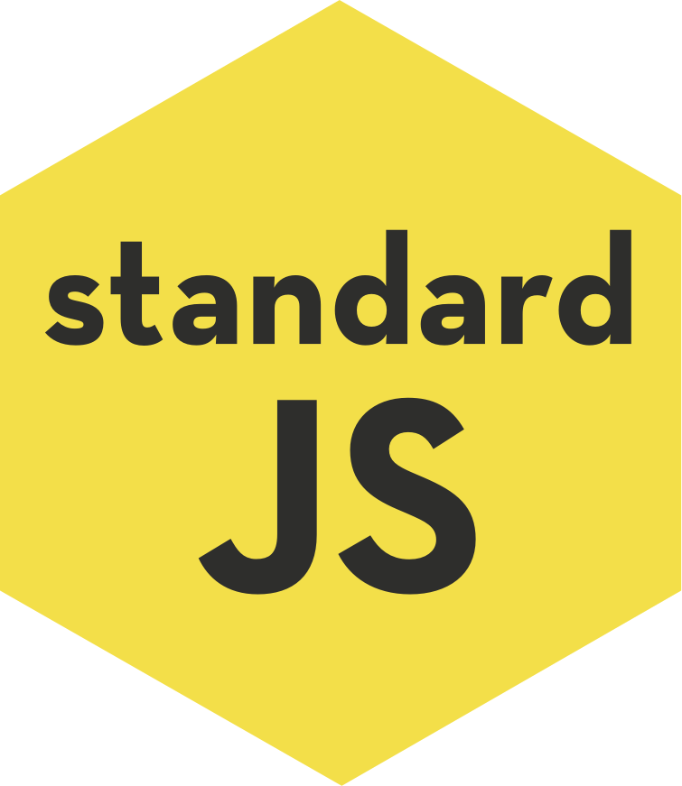
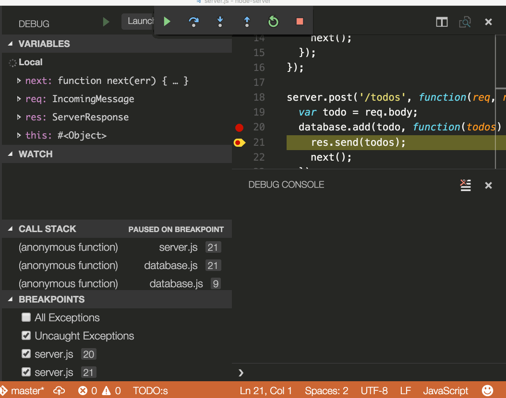

+++
title = "JavaScript"
date = 2024-01-12T22:36:24+08:00
weight = 10
type = "docs"
description = ""
isCJKLanguage = true
draft = false
+++

> 原文: [https://code.visualstudio.com/docs/languages/javascript](https://code.visualstudio.com/docs/languages/javascript)

# JavaScript in Visual Studio Code Visual Studio Code 中的 JavaScript


Visual Studio Code includes built-in JavaScript IntelliSense, debugging, formatting, code navigation, refactorings, and many other advanced language features.

​​	Visual Studio Code 包括内置 JavaScript IntelliSense、调试、格式化、代码导航、重构以及许多其他高级语言功能。


Most of these features just work out of the box, while some may require basic configuration to get the best experience. This page summarizes the JavaScript features that VS Code ships with. Extensions from the [VS Code Marketplace](https://marketplace.visualstudio.com/) can augment or change most of these built-in features. For a more in-depth guide on how these features work and can be configured, see [Working with JavaScript](https://code.visualstudio.com/docs/nodejs/working-with-javascript).

​​	这些功能大多数开箱即用，而有些可能需要基本配置才能获得最佳体验。此页面概述了 VS Code 附带的 JavaScript 功能。VS Code Marketplace 中的扩展可以增强或更改这些内置功能中的大多数。有关这些功能如何工作以及如何配置的更深入指南，请参阅使用 JavaScript。

## [IntelliSense](https://code.visualstudio.com/docs/languages/javascript#_intellisense)

IntelliSense shows you intelligent code completion, hover information, and signature information so that you can write code more quickly and correctly.

​​	IntelliSense 会向您显示智能代码补全、悬停信息和签名信息，以便您可以更快速、更正确地编写代码。

<video src="https://code.visualstudio.com/assets/docs/languages/javascript/intellisense.mp4" placeholder="/assets/docs/languages/javascript/intellisense-placeholder.png" autoplay="" loop="" controls="" muted="" data-immersive-translate-walked="140794da-110c-4a25-a346-adb5b6ee682a" data-immersive-translate-paragraph="1" style="box-sizing: border-box; font-family: &quot;Segoe UI&quot;, &quot;Helvetica Neue&quot;, Helvetica, Arial, sans-serif; display: inline-block; vertical-align: baseline; margin-top: 1.5rem; margin-bottom: 2.5rem; width: 750px; max-width: 100%; color: rgb(36, 36, 36); font-size: 16px; font-style: normal; font-variant-ligatures: normal; font-variant-caps: normal; font-weight: 400; letter-spacing: normal; orphans: 2; text-align: start; text-indent: 0px; text-transform: none; widows: 2; word-spacing: 0px; -webkit-text-stroke-width: 0px; white-space: normal; background-color: rgb(255, 255, 255); text-decoration-thickness: initial; text-decoration-style: initial; text-decoration-color: initial;"></video>


VS Code provides IntelliSense within your JavaScript projects; for many npm libraries such as `React`, `lodash`, and `express`; and for other platforms such as `node`, serverless, or IoT.

​​	VS Code 在您的 JavaScript 项目中提供 IntelliSense；适用于许多 npm 库，例如 `React` 、 `lodash` 和 `express` ；以及适用于其他平台，例如 `node` 、无服务器或物联网。

See [Working with JavaScript](https://code.visualstudio.com/docs/nodejs/working-with-javascript) for information about VS Code's JavaScript IntelliSense, how to configure it, and help troubleshooting common IntelliSense problems.

​​	有关 VS Code 的 JavaScript IntelliSense、如何配置它以及帮助解决常见 IntelliSense 问题的详细信息，请参阅使用 JavaScript。

## [JavaScript projects (jsconfig.json) JavaScript 项目 (jsconfig.json)](https://code.visualstudio.com/docs/languages/javascript#_javascript-projects-jsconfigjson)

A [jsconfig.json](https://code.visualstudio.com/docs/languages/jsconfig) file defines a JavaScript project in VS Code. While `jsconfig.json` files are not required, you will want to create one in cases such as:

​​	jsconfig.json 文件在 VS Code 中定义 JavaScript 项目。虽然 `jsconfig.json` 文件不是必需的，但您可能需要在以下情况下创建一个：

- If not all JavaScript files in your workspace should be considered part of a single JavaScript project. `jsconfig.json` files let you exclude some files from showing up in IntelliSense.
  如果工作区中的并非所有 JavaScript 文件都应被视为单个 JavaScript 项目的一部分。 `jsconfig.json` 文件允许您排除某些文件在 IntelliSense 中显示。
- To ensure that a subset of JavaScript files in your workspace is treated as a single project. This is useful if you are working with legacy code that uses implicit globals dependencies instead of `imports` for dependencies.
  为了确保工作区中的 JavaScript 文件子集被视为单个项目。如果您使用的是依赖于隐式全局依赖项（而不是 `imports` 依赖项）的旧版代码，这将非常有用。
- If your workspace contains more than one project context, such as front-end and back-end JavaScript code. For multi-project workspaces, create a `jsconfig.json` at the root folder of each project.
  如果您的工作区包含多个项目上下文，例如前端和后端 JavaScript 代码。对于多项目工作区，请在每个项目的根文件夹中创建一个 `jsconfig.json` 。
- You are using the TypeScript compiler to down-level compile JavaScript source code.
  您正在使用 TypeScript 编译器向下编译 JavaScript 源代码。

To define a basic JavaScript project, add a `jsconfig.json` at the root of your workspace:

​​	要定义一个基本 JavaScript 项目，请在工作区的根目录中添加一个 `jsconfig.json` ：

```
{
  "compilerOptions": {
    "module": "CommonJS",
    "target": "ES6"
  },
  "exclude": ["node_modules"]
}
```

See [Working with JavaScript](https://code.visualstudio.com/docs/nodejs/working-with-javascript) for more advanced `jsconfig.json` configuration.

​​	有关更高级的 `jsconfig.json` 配置，请参阅使用 JavaScript。

> **Tip:** To check if a JavaScript file is part of JavaScript project, just open the file in VS Code and run the **JavaScript: Go to Project Configuration** command. This command opens the `jsconfig.json` that references the JavaScript file. A notification is shown if the file is not part of any `jsconfig.json` project.
>
> ​​	提示：要检查 JavaScript 文件是否属于 JavaScript 项目，只需在 VS Code 中打开该文件并运行 JavaScript：转到项目配置命令。此命令将打开引用 JavaScript 文件的 `jsconfig.json` 。如果该文件不属于任何 `jsconfig.json` 项目，则会显示一条通知。

## [Snippets 代码片段](https://code.visualstudio.com/docs/languages/javascript#_snippets)

VS Code includes basic JavaScript [snippets](https://code.visualstudio.com/docs/editor/userdefinedsnippets) that are suggested as you type;

​​	VS Code 包括在您键入时建议的基本 JavaScript 代码段；

<video src="https://code.visualstudio.com/assets/docs/languages/javascript/snippets.mp4" placeholder="/assets/docs/languages/javascript/snippets-placeholder.png" autoplay="" loop="" controls="" muted="" data-immersive-translate-walked="140794da-110c-4a25-a346-adb5b6ee682a" data-immersive-translate-paragraph="1" style="box-sizing: border-box; font-family: &quot;Segoe UI&quot;, &quot;Helvetica Neue&quot;, Helvetica, Arial, sans-serif; display: inline-block; vertical-align: baseline; margin-top: 1.5rem; margin-bottom: 2.5rem; width: 750px; max-width: 100%; color: rgb(36, 36, 36); font-size: 16px; font-style: normal; font-variant-ligatures: normal; font-variant-caps: normal; font-weight: 400; letter-spacing: normal; orphans: 2; text-align: start; text-indent: 0px; text-transform: none; widows: 2; word-spacing: 0px; -webkit-text-stroke-width: 0px; white-space: normal; background-color: rgb(255, 255, 255); text-decoration-thickness: initial; text-decoration-style: initial; text-decoration-color: initial;"></video>


There are many extensions that provide additional snippets, including snippets for popular frameworks such as Redux or Angular. You can even [define your own snippets](https://code.visualstudio.com/docs/editor/userdefinedsnippets).

​​	有许多扩展提供其他代码段，包括 Redux 或 Angular 等流行框架的代码段。您甚至可以定义自己的代码段。

> **Tip**: To disable snippets suggestions, set `editor.snippetSuggestions` to `"none"` in your [settings](https://code.visualstudio.com/docs/getstarted/settings) file. The `editor.snippetSuggestions` setting also lets you change where snippets appear in the suggestions: at the top (`"top"`), at the bottom (`"bottom"`), or inlined ordered alphabetically (`"inline"`). The default is `"inline"`.
>
> ​​	提示：要禁用代码段建议，请在您的设置文件中将 `editor.snippetSuggestions` 设置为 `"none"` 。 `editor.snippetSuggestions` 设置还允许您更改代码段在建议中的显示位置：顶部 ( `"top"` )、底部 ( `"bottom"` ) 或内联按字母顺序排列 ( `"inline"` )。默认值为 `"inline"` 。

## [JSDoc support JSDoc 支持](https://code.visualstudio.com/docs/languages/javascript#_jsdoc-support)

VS Code understands many standard [JSDoc](https://jsdoc.app/) annotations, and uses these annotations to provide rich [IntelliSense](https://code.visualstudio.com/docs/languages/javascript#_intellisense). You can optionally even use the type information from JSDoc comments to [type check your JavaScript](https://code.visualstudio.com/docs/languages/javascript#_type-checking).

​​	VS Code 了解许多标准 JSDoc 注释，并使用这些注释来提供丰富的 IntelliSense。您甚至可以选择使用 JSDoc 注释中的类型信息来检查 JavaScript 的类型。

<video src="https://code.visualstudio.com/assets/docs/languages/javascript/jsdoc-autofill.mp4" placeholder="/assets/docs/languages/javascript/jsdoc-autofill-placeholder.png" autoplay="" loop="" controls="" muted="" data-immersive-translate-walked="140794da-110c-4a25-a346-adb5b6ee682a" data-immersive-translate-paragraph="1" style="box-sizing: border-box; font-family: &quot;Segoe UI&quot;, &quot;Helvetica Neue&quot;, Helvetica, Arial, sans-serif; display: inline-block; vertical-align: baseline; margin-top: 1.5rem; margin-bottom: 2.5rem; width: 750px; max-width: 100%; color: rgb(36, 36, 36); font-size: 16px; font-style: normal; font-variant-ligatures: normal; font-variant-caps: normal; font-weight: 400; letter-spacing: normal; orphans: 2; text-align: start; text-indent: 0px; text-transform: none; widows: 2; word-spacing: 0px; -webkit-text-stroke-width: 0px; white-space: normal; background-color: rgb(255, 255, 255); text-decoration-thickness: initial; text-decoration-style: initial; text-decoration-color: initial;"></video>


Quickly create JSDoc comments for functions by typing `/**` before the function declaration, and select the **JSDoc comment** snippet suggestion:

​​	在函数声明前键入 `/**` ，然后选择 JSDoc 注释片段建议，可以快速为函数创建 JSDoc 注释：

<video src="https://code.visualstudio.com/assets/docs/languages/javascript/jsdoc-autofill.mp4" placeholder="/assets/docs/languages/javascript/jsdoc-autofill-placeholder.png" autoplay="" loop="" controls="" muted="" data-immersive-translate-walked="140794da-110c-4a25-a346-adb5b6ee682a" data-immersive-translate-paragraph="1" style="box-sizing: border-box; font-family: &quot;Segoe UI&quot;, &quot;Helvetica Neue&quot;, Helvetica, Arial, sans-serif; display: inline-block; vertical-align: baseline; margin-top: 1.5rem; margin-bottom: 2.5rem; width: 750px; max-width: 100%; color: rgb(36, 36, 36); font-size: 16px; font-style: normal; font-variant-ligatures: normal; font-variant-caps: normal; font-weight: 400; letter-spacing: normal; orphans: 2; text-align: start; text-indent: 0px; text-transform: none; widows: 2; word-spacing: 0px; -webkit-text-stroke-width: 0px; white-space: normal; background-color: rgb(255, 255, 255); text-decoration-thickness: initial; text-decoration-style: initial; text-decoration-color: initial;"></video>


To disable JSDoc comment suggestions, set `"javascript.suggest.completeJSDocs": false`.

​​	要禁用 JSDoc 注释建议，请设置 `"javascript.suggest.completeJSDocs": false` 。

## [Hover Information 悬停信息](https://code.visualstudio.com/docs/languages/javascript#_hover-information)

Hover over a JavaScript symbol to quickly see its type information and relevant documentation.

​​	将鼠标悬停在 JavaScript 符号上，可以快速查看其类型信息和相关文档。


The Ctrl+K Ctrl+I keyboard shortcut shows this hover information at the current cursor position.

​​	Ctrl+K Ctrl+I 键盘快捷键可在当前光标位置显示此悬停信息。

## [Signature Help 签名帮助](https://code.visualstudio.com/docs/languages/javascript#_signature-help)

As you write JavaScript function calls, VS Code shows information about the function signature and highlights the parameter that you are currently completing:

​​	在编写 JavaScript 函数调用时，VS Code 会显示有关函数签名的信息，并突出显示您当前正在完成的参数：


Signature help is shown automatically when you type a `(` or `,` within a function call. Press Ctrl+Shift+Space to manually trigger signature help.

​​	在函数调用中键入 `(` 或 `,` 时，会自动显示签名帮助。按 Ctrl+Shift+Space 手动触发签名帮助。

## [Auto imports 自动导入](https://code.visualstudio.com/docs/languages/javascript#_auto-imports)

Automatic imports speed up coding by suggesting available variables throughout your project and its dependencies. When you select one of these suggestions, VS Code automatically adds an import for it to the top of the file.

​​	自动导入通过建议项目及其依赖项中可用的变量来加快编码速度。当您选择其中一个建议时，VS Code 会自动将导入添加到文件顶部。

Just start typing to see [suggestions](https://code.visualstudio.com/docs/languages/javascript#_intellisense) for all available JavaScript symbols in your current project. Auto import suggestions show where they will be imported from:

​​	只需开始键入即可查看当前项目中所有可用 JavaScript 符号的建议。自动导入建议显示它们将从何处导入：


If you choose one of these auto import suggestions, VS Code adds an import for it.

​​	如果您选择其中一个自动导入建议，VS Code 会为其添加导入。

In this example, VS Code adds an import for `Button` from [material-ui](https://material-ui.com/) to the top of the file:

​​	在此示例中，VS Code 将对 material-ui 中的 `Button` 添加导入到文件顶部：


To disable auto imports, set `"javascript.suggest.autoImports"` to `false`.

​​	要禁用自动导入，请将 `"javascript.suggest.autoImports"` 设置为 `false` 。

> **Tip:** VS Code tries to infer the best import style to use. You can explicitly configure the preferred quote style and path style for imports added to your code with the `javascript.preferences.quoteStyle` and `javascript.preferences.importModuleSpecifier` settings.
>
> ​​	提示：VS Code 尝试推断要使用的最佳导入样式。您可以使用 `javascript.preferences.quoteStyle` 和 `javascript.preferences.importModuleSpecifier` 设置明确配置添加到代码中的导入的首选引号样式和路径样式。

## [Formatting 格式化](https://code.visualstudio.com/docs/languages/javascript#_formatting)

VS Code's built-in JavaScript formatter provides basic code formatting with reasonable defaults.

​​	VS Code 的内置 JavaScript 格式化程序提供具有合理默认值的代码基本格式化。

The `javascript.format.*` [settings](https://code.visualstudio.com/docs/getstarted/settings) configure the built-in formatter. Or, if the built-in formatter is getting in the way, set `"javascript.format.enable"` to `false` to disable it.

​​	<b>b0</b> 设置配置内置格式化程序。或者，如果内置格式化程序碍事，将 <b>b1</b> 设置为 <b>b2</b> 以禁用它。

For more specialized code formatting styles, try installing one of the JavaScript formatting extensions from the [Marketplace](https://marketplace.visualstudio.com/vscode).

​​	对于更专业的代码格式化样式，请尝试从 Marketplace 安装一个 JavaScript 格式化扩展。

## [JSX and auto closing tags JSX 和自动闭合标签](https://code.visualstudio.com/docs/languages/javascript#_jsx-and-auto-closing-tags)

All of VS Code's JavaScript features also work with [JSX](https://reactjs.org/docs/introducing-jsx.html):

​​	VS Code 的所有 JavaScript 功能也适用于 JSX：


You can use JSX syntax in both normal `*.js` files and in `*.jsx` files.

​​	您可以在普通 `*.js` 文件和 `*.jsx` 文件中使用 JSX 语法。

VS Code also includes JSX-specific features such as autoclosing of JSX tags:

​​	VS Code 还包括 JSX 特有的功能，例如 JSX 标签的自动闭合：

<video src="https://code.visualstudio.com/assets/docs/languages/javascript/tag-complete.mp4" placeholder="/assets/docs/languages/javascript/tag-complete-placeholder.png" autoplay="" loop="" controls="" muted="" data-immersive-translate-walked="140794da-110c-4a25-a346-adb5b6ee682a" data-immersive-translate-paragraph="1" style="box-sizing: border-box; font-family: &quot;Segoe UI&quot;, &quot;Helvetica Neue&quot;, Helvetica, Arial, sans-serif; display: inline-block; vertical-align: baseline; margin-top: 1.5rem; margin-bottom: 2.5rem; width: 750px; max-width: 100%; color: rgb(36, 36, 36); font-size: 16px; font-style: normal; font-variant-ligatures: normal; font-variant-caps: normal; font-weight: 400; letter-spacing: normal; orphans: 2; text-align: start; text-indent: 0px; text-transform: none; widows: 2; word-spacing: 0px; -webkit-text-stroke-width: 0px; white-space: normal; background-color: rgb(255, 255, 255); text-decoration-thickness: initial; text-decoration-style: initial; text-decoration-color: initial;"></video>


Set `"javascript.autoClosingTags"` to `false` to disable JSX tag closing.

​​	将 `"javascript.autoClosingTags"` 设置为 `false` 以禁用 JSX 标签闭合。

## [Code navigation 代码导航](https://code.visualstudio.com/docs/languages/javascript#_code-navigation)

Code navigation lets you quickly navigate JavaScript projects.

​​	代码导航使您可以快速浏览 JavaScript 项目。

- **Go to Definition** F12 - Go to the source code of a symbol definition.
  转到定义 F12 - 转到符号定义的源代码。
- **Peek Definition** Alt+F12 - Bring up a Peek window that shows the definition of a symbol.
  查看定义 Alt+F12 - 调出显示符号定义的“查看”窗口。
- **Go to References** Shift+F12 - Show all references to a symbol.
  转到引用 Shift+F12 - 显示对符号的所有引用。
- **Go to Type Definition** - Go to the type that defines a symbol. For an instance of a class, this will reveal the class itself instead of where the instance is defined.
  转到类型定义 - 转到定义符号的类型。对于类的实例，这将显示类本身，而不是定义实例的位置。

You can navigate via symbol search using the **Go to Symbol** commands from the **Command Palette** (Ctrl+Shift+P).

​​	您可以使用命令面板（Ctrl+Shift+P）中的转到符号命令通过符号搜索进行导航。

- **Go to Symbol in File** Ctrl+Shift+O
  转到文件中的符号 Ctrl+Shift+O
- **Go to Symbol in Workspace** Ctrl+T
  转到工作区中的符号 Ctrl+T

## [Rename 重命名](https://code.visualstudio.com/docs/languages/javascript#_rename)

Press F2 to rename the symbol under the cursor across your JavaScript project:

​​	按 F2 可重命名 JavaScript 项目中光标下的符号：


## [Refactoring 重构](https://code.visualstudio.com/docs/languages/javascript#_refactoring)

VS Code includes some handy refactorings for JavaScript such as **Extract function** and **Extract constant**. Just select the source code you'd like to extract and then click on the lightbulb in the gutter or press (Ctrl+.) to see available refactorings.

​​	VS Code 包括一些方便的 JavaScript 重构，例如“提取函数”和“提取常量”。只需选择要提取的源代码，然后单击边距中的灯泡或按 (Ctrl+.) 查看可用的重构。


Available refactorings include:

​​	可用的重构包括：

- Extract to method or function.
  提取到方法或函数。
- Extract to constant.
  提取到常量。
- Convert between named imports and namespace imports.
  在命名导入和命名空间导入之间转换。
- Move to new file.
  移至新文件。

See [Refactorings](https://code.visualstudio.com/docs/editor/refactoring) for more information about refactorings and how you can configure keyboard shortcuts for individual refactorings.

​​	有关重构的更多信息以及如何为各个重构配置键盘快捷键，请参阅重构。此外，代码操作小部件：包括附近的快速修复（）是一项默认启用的设置，它将激活 Ctrl+.（命令 ID ）所在行中最近的快速修复，无论光标在该行中的什么位置。该命令突出显示将使用快速修复重构或修复的源代码。仍然可以在光标位置激活常规代码操作和非修复重构。

Additionally, **Code Action Widget: Include Nearby Quick Fixes** (`editor.codeActionWidget.includeNearbyQuickFixes`) is a setting that is enabled on default, which will activate the nearest Quick Fix in a line from Ctrl+. (command ID `editor.action.quickFix`), no matter where your cursor is in that line.

​​	未使用的变量和不可达代码

The command highlights the source code that will be refactored or fixed with Quick Fixes. Normal Code Actions and non-fix refactorings can still be activated at the cursor location.

​​	未使用的 JavaScript 代码（例如始终为 true 的语句的 else 块或未引用的导入）在编辑器中会显示为淡出：

## [Unused variables and unreachable code 您可以将光标放在未使用的代码上并触发快速修复命令（Ctrl+。）或单击灯泡，从而快速删除此代码。](https://code.visualstudio.com/docs/languages/javascript#_unused-variables-and-unreachable-code)

Unused JavaScript code, such the else block of an `if` statement that is always true or an unreferenced import, is faded out in the editor:

​​	要禁用未使用的代码的淡出，请将 `if` 设置为。您还可以仅通过设置以下内容来禁用 JavaScript 中未使用的代码的淡出：


You can quickly remove this unused code by placing the cursor on it and triggering the Quick Fix command (Ctrl+.) or clicking on the lightbulb.

​​	整理导入

To disable fading out of unused code, set `"editor.showUnused"` to `false`. You can also disable fading of unused code only in JavaScript by setting:

```
"[javascript]": {
    "editor.showUnused":  false
},
"[javascriptreact]": {
    "editor.showUnused":  false
},
```

## [Organize Imports](https://code.visualstudio.com/docs/languages/javascript#_organize-imports)

The **Organize Imports** Source Action sorts the imports in a JavaScript file and removes any unused imports:

​​	“整理导入”源操作对 JavaScript 文件中的导入进行排序，并删除任何未使用的导入：

<video src="https://code.visualstudio.com/assets/docs/languages/javascript/organize-imports.mp4" placeholder="/assets/docs/languages/javascript/organize-imports-placeholder.png" autoplay="" loop="" controls="" muted="" data-immersive-translate-walked="140794da-110c-4a25-a346-adb5b6ee682a" data-immersive-translate-paragraph="1" style="box-sizing: border-box; font-family: &quot;Segoe UI&quot;, &quot;Helvetica Neue&quot;, Helvetica, Arial, sans-serif; display: inline-block; vertical-align: baseline; margin-top: 1.5rem; margin-bottom: 2.5rem; width: 750px; max-width: 100%; color: rgb(36, 36, 36); font-size: 16px; font-style: normal; font-variant-ligatures: normal; font-variant-caps: normal; font-weight: 400; letter-spacing: normal; orphans: 2; text-align: start; text-indent: 0px; text-transform: none; widows: 2; word-spacing: 0px; -webkit-text-stroke-width: 0px; white-space: normal; background-color: rgb(255, 255, 255); text-decoration-thickness: initial; text-decoration-style: initial; text-decoration-color: initial;"></video>


You can run **Organize Imports** from the **Source Action** context menu or with the Shift+Alt+O keyboard shortcut.

​​	您可以从“源操作”上下文菜单或使用 Shift+Alt+O 键盘快捷键运行“整理导入”。

Organize imports can also be done automatically when you save a JavaScript file by setting:

​​	还可以通过设置在保存 JavaScript 文件时自动执行整理导入操作：

```
"editor.codeActionsOnSave": {
    "source.organizeImports": "explicit"
}
```

## [Code Actions on Save 保存时执行代码操作](https://code.visualstudio.com/docs/languages/javascript#_code-actions-on-save)

The `editor.codeActionsOnSave` setting lets you configure a set of Code Actions that are run when a file is saved. For example, you can enable organize imports on save by setting:

​​	 `editor.codeActionsOnSave` 设置允许您配置一组在保存文件时运行的代码操作。例如，您可以通过设置以下内容来启用保存时整理导入操作：

```
// On explicit save, run fixAll source action. On auto save (window or focus change), run organizeImports source action.
"editor.codeActionsOnSave": {
    "source.fixAll": "explicit",
    "source.organizeImports": "always",
}
```

As of today, the following enums are supported:

​​	截至今日，支持以下枚举：

- `explicit` (default): Triggers Code Actions when explicitly saved. Same as `true`.
  `explicit` （默认）：在显式保存时触发代码操作。与 `true` 相同。
- `always`: Triggers Code Actions when explicitly saved and on Auto Saves from window or focus changes.
  `always` ：在显式保存时和在窗口或焦点更改时自动保存时触发代码操作。
- `never`: Never triggers Code Actions on save. Same as `false`.
  `never` ：在保存时绝不触发代码操作。与 `false` 相同。

You can also set `editor.codeActionsOnSave` to an array of Code Actions to execute in order.

​​	您还可以将 `editor.codeActionsOnSave` 设置为按顺序执行的代码操作数组。

Here are some source actions:

​​	以下是一些源操作：

- `"organizeImports"` - Enables organize imports on save.
  `"organizeImports"` - 启用保存时整理导入。
- `"fixAll"` - Auto Fix on Save computes all possible fixes in one round (for all providers including ESLint).
  `"fixAll"` - 保存时自动修复计算一轮中所有可能的修复（适用于包括 ESLint 在内的所有提供程序）。
- `"fixAll.eslint"` - Auto Fix only for ESLint.
  `"fixAll.eslint"` - 仅对 ESLint 自动修复。
- `"addMissingImports"` - Adds all missing imports on save.
  `"addMissingImports"` - 保存时添加所有缺失的导入。

See [Node.js/JavaScript](https://code.visualstudio.com/docs/nodejs/working-with-javascript) for more information.

​​	有关更多信息，请参阅 Node.js/JavaScript。

## [Code suggestions 代码建议](https://code.visualstudio.com/docs/languages/javascript#_code-suggestions)

VS Code automatically suggests some common code simplifications such as converting a chain of `.then` calls on a promise to use `async` and `await`

​​	VS Code 会自动建议一些常见的代码简化，例如将对 Promise 的 `.then` 调用链转换为使用 `async` 和 `await`

<video src="https://code.visualstudio.com/assets/docs/languages/javascript/code-suggestions-convert-async.mp4" placeholder="/assets/docs/languages/javascript/code-suggestions-convert-async-placeholder.png" autoplay="" loop="" controls="" muted="" data-immersive-translate-walked="140794da-110c-4a25-a346-adb5b6ee682a" data-immersive-translate-paragraph="1" style="box-sizing: border-box; font-family: &quot;Segoe UI&quot;, &quot;Helvetica Neue&quot;, Helvetica, Arial, sans-serif; display: inline-block; vertical-align: baseline; margin-top: 1.5rem; margin-bottom: 2.5rem; width: 750px; max-width: 100%; color: rgb(36, 36, 36); font-size: 16px; font-style: normal; font-variant-ligatures: normal; font-variant-caps: normal; font-weight: 400; letter-spacing: normal; orphans: 2; text-align: start; text-indent: 0px; text-transform: none; widows: 2; word-spacing: 0px; -webkit-text-stroke-width: 0px; white-space: normal; background-color: rgb(255, 255, 255); text-decoration-thickness: initial; text-decoration-style: initial; text-decoration-color: initial;"></video>


Set `"javascript.suggestionActions.enabled"` to `false` to disable suggestions.

​​	将 `"javascript.suggestionActions.enabled"` 设置为 `false` 以禁用建议。

## [Enhance completions with AI 使用 AI 增强完成](https://code.visualstudio.com/docs/languages/javascript#_enhance-completions-with-ai)

[GitHub Copilot](https://copilot.github.com/) is an AI-powered code completion tool that helps you write code faster and smarter. You can use the [GitHub Copilot extension](https://marketplace.visualstudio.com/items?itemName=GitHub.copilot) in VS Code to generate code, or to learn from the code it generates.

​​	GitHub Copilot 是一款由 AI 支持的代码完成工具，可帮助您更快速、更智能地编写代码。您可以在 VS Code 中使用 GitHub Copilot 扩展来生成代码，或从它生成的代码中学习。

[](https://marketplace.visualstudio.com/items?itemName=GitHub.copilot)

GitHub Copilot provides suggestions for numerous languages and a wide variety of frameworks, and it works especially well for Python, JavaScript, TypeScript, Ruby, Go, C# and C++.

​​	GitHub Copilot 为多种语言和各种框架提供建议，并且它特别适用于 Python、JavaScript、TypeScript、Ruby、Go、C# 和 C++。

You can learn more about how to get started with Copilot in the [Copilot documentation](https://code.visualstudio.com/docs/editor/github-copilot).

​​	您可以在 Copilot 文档中了解有关如何开始使用 Copilot 的更多信息。

Once you have the Copilot extension installed and enabled, you can test it our for your JavaScript projects.

​​	安装并启用 Copilot 扩展后，您可以将其测试用于您的 JavaScript 项目。

Create a new file - you can use the **File: New File** command in the Command Palette (F1).

​​	创建新文件 - 您可以在命令面板 (F1) 中使用文件：新建文件命令。

In the JavaScript file, type the following function header:

​​	在 JavaScript 文件中，键入以下函数头：

```
function calculateDaysBetweenDates(begin, end) {
```

Copilot will provide a suggestion like the following - use Tab to accept the suggestion:

​​	Copilot 将提供如下建议 - 使用 Tab 键接受建议：


## [Inlay hints 内联提示](https://code.visualstudio.com/docs/languages/javascript#_inlay-hints)

Inlay hints add additional inline information to source code to help you understand what the code does.

​​	内联提示向源代码添加额外的内联信息，帮助您理解代码的作用。

**Parameter name inlay hints** show the names of parameters in function calls:

​​	参数名称内联提示显示函数调用中的参数名称：


This can help you understand the meaning of each argument at a glance, which is especially helpful for functions that take Boolean flags or have parameters that are easy to mix up.

​​	这可以帮助您一目了然地理解每个参数的含义，这对于采用布尔标志或具有容易混淆的参数的函数特别有用。

To enable parameter name hints, set `javascript.inlayHints.parameterNames`. There are three possible values:

​​	若要启用参数名称提示，请设置 `javascript.inlayHints.parameterNames` 。有三个可能的值：

- `none` — Disable parameter inlay hints.
  `none` — 禁用参数内联提示。
- `literals` — Only show inlay hints for literals (string, number, Boolean).
  `literals` — 仅显示文字（字符串、数字、布尔值）的内联提示。
- `all` — Show inlay hints for all arguments.
  `all` — 显示所有参数的内联提示。

**Variable type inlay hints** show the types of variables that don't have explicit type annotations.

​​	变量类型内联提示显示没有显式类型注释的变量的类型。

Setting: `javascript.inlayHints.variableTypes.enabled`

​​	设置： `javascript.inlayHints.variableTypes.enabled`


**Property type inlay hints** show the type of class properties that don't have an explicit type annotation.

​​	属性类型内联提示显示没有显式类型注释的类属性的类型。

Setting: `javascript.inlayHints.propertyDeclarationTypes.enabled`

​​	设置： `javascript.inlayHints.propertyDeclarationTypes.enabled`


**Parameter type hints** show the types of implicitly typed parameters.

​​	参数类型提示显示隐式类型参数的类型。

Setting: `javascript.inlayHints.parameterTypes.enabled`

​​	设置： `javascript.inlayHints.parameterTypes.enabled`


**Return type inlay hints** show the return types of functions that don't have an explicit type annotation.

​​	返回类型内联提示显示没有显式类型注释的函数的返回类型。

Setting: `javascript.inlayHints.functionLikeReturnTypes.enabled`

​​	设置： `javascript.inlayHints.functionLikeReturnTypes.enabled`


## [References CodeLens 引用 CodeLens](https://code.visualstudio.com/docs/languages/javascript#_references-codelens)

The JavaScript references CodeLens displays an inline count of reference for classes, methods, properties, and exported objects:

​​	JavaScript 引用 CodeLens 显示类、方法、属性和导出对象的内联引用计数：


To enable the references CodeLens, set `"javascript.referencesCodeLens.enabled"` to `true`.

​​	若要启用引用 CodeLens，请将 `"javascript.referencesCodeLens.enabled"` 设置为 `true` 。

Click on the reference count to quickly browse a list of references:

​​	单击引用计数以快速浏览引用列表：


## [Update imports on file move 在文件移动时更新导入](https://code.visualstudio.com/docs/languages/javascript#_update-imports-on-file-move)

When you move or rename a file that is imported by other files in your JavaScript project, VS Code can automatically update all import paths that reference the moved file:

​​	当您移动或重命名 JavaScript 项目中其他文件导入的文件时，VS Code 可以自动更新所有引用已移动文件的导入路径：

<video src="https://code.visualstudio.com/assets/docs/languages/javascript/update-imports.mp4" placeholder="/assets/docs/languages/javascript/update-imports-placeholder.png" autoplay="" loop="" controls="" muted="" data-immersive-translate-walked="140794da-110c-4a25-a346-adb5b6ee682a" data-immersive-translate-paragraph="1" style="box-sizing: border-box; font-family: &quot;Segoe UI&quot;, &quot;Helvetica Neue&quot;, Helvetica, Arial, sans-serif; display: inline-block; vertical-align: baseline; margin-top: 1.5rem; margin-bottom: 2.5rem; width: 750px; max-width: 100%; color: rgb(36, 36, 36); font-size: 16px; font-style: normal; font-variant-ligatures: normal; font-variant-caps: normal; font-weight: 400; letter-spacing: normal; orphans: 2; text-align: start; text-indent: 0px; text-transform: none; widows: 2; word-spacing: 0px; -webkit-text-stroke-width: 0px; white-space: normal; background-color: rgb(255, 255, 255); text-decoration-thickness: initial; text-decoration-style: initial; text-decoration-color: initial;"></video>


The `javascript.updateImportsOnFileMove.enabled` setting controls this behavior. Valid settings values are:

​​	 `javascript.updateImportsOnFileMove.enabled` 设置控制此行为。有效的设置值包括：

- `"prompt"` - The default. Asks if paths should be updated for each file move.
  `"prompt"` - 默认。询问是否应为每个文件移动更新路径。
- `"always"` - Always automatically update paths.
  `"always"` - 始终自动更新路径。
- `"never"` - Do not update paths automatically and do not prompt.
  `"never"` - 不要自动更新路径，也不要提示。

## [Linters Linter](https://code.visualstudio.com/docs/languages/javascript#_linters)

[Linters](https://en.wikipedia.org/wiki/Lint_(software)) provides warnings for suspicious looking code. While VS Code does not include a built-in JavaScript linter, many JavaScript linter [extensions](https://code.visualstudio.com/docs/editor/extension-marketplace) available in the marketplace.

​​	Linter 为可疑代码提供警告。虽然 VS Code 不包含内置 JavaScript linter，但市场上提供了许多 JavaScript linter 扩展。


ESLint

32.0M

dbaeumer


jshint

2.4M

dbaeumer


Flow Language Support
Flow 语言支持

658.0K

flowtype



StandardJS - JavaScript Standard Style (old version)
StandardJS - JavaScript 标准样式（旧版本）

456.0K

chenxsan

> **Tip:** This list is dynamically queried from the [VS Code Marketplace](https://marketplace.visualstudio.com/). Read the description and reviews to decide if the extension is right for you.
>
> ​​	提示：此列表是从 VS Code Marketplace 动态查询的。阅读说明和评论以决定扩展是否适合您。

## [Type checking 类型检查](https://code.visualstudio.com/docs/languages/javascript#_type-checking)

You can leverage some of TypeScript's advanced type checking and error reporting functionality in regular JavaScript files too. This is a great way to catch common programming mistakes. These type checks also enable some exciting Quick Fixes for JavaScript, including **Add missing import** and **Add missing property**.

​​	您也可以在常规 JavaScript 文件中利用 TypeScript 的一些高级类型检查和错误报告功能。这是一个发现常见编程错误的好方法。这些类型检查还为 JavaScript 启用了一些令人兴奋的快速修复，包括添加缺少的导入和添加缺少的属性。


TypeScript tried to infer types in `.js` files the same way it does in `.ts` files. When types cannot be inferred, they can be specified explicitly with JSDoc comments. You can read more about how TypeScript uses JSDoc for JavaScript type checking in [Working with JavaScript](https://code.visualstudio.com/docs/nodejs/working-with-javascript).

​​	TypeScript 尝试以与在 `.ts` 文件中相同的方式推断 `.js` 文件中的类型。如果无法推断类型，则可以使用 JSDoc 注释显式指定它们。您可以在使用 JavaScript 进行类型检查中阅读有关 TypeScript 如何将 JSDoc 用于 JavaScript 类型检查的更多信息。

Type checking of JavaScript is optional and opt-in. Existing JavaScript validation tools such as ESLint can be used alongside built-in type checking functionality.

​​	JavaScript 的类型检查是可选的且需要选择加入。现有的 JavaScript 验证工具（例如 ESLint）可以与内置类型检查功能一起使用。

## [Debugging 调试](https://code.visualstudio.com/docs/languages/javascript#_debugging)

VS Code comes with great debugging support for JavaScript. Set breakpoints, inspect objects, navigate the call stack, and execute code in the Debug Console. See the [Debugging topic](https://code.visualstudio.com/docs/editor/debugging) to learn more.

​​	VS Code 为 JavaScript 提供了出色的调试支持。设置断点、检查对象、导航调用堆栈并在调试控制台中执行代码。请参阅调试主题以了解更多信息。

### [Debug client side 调试客户端](https://code.visualstudio.com/docs/languages/javascript#_debug-client-side)

You can debug your client-side code using a browser debugger such as our built-in debugger for Edge and Chrome, or the [Debugger for Firefox](https://marketplace.visualstudio.com/items?itemName=hbenl.vscode-firefox-debug).

​​	您可以使用浏览器调试器（例如我们为 Edge 和 Chrome 内置的调试器或 Firefox 的调试器）来调试您的客户端代码。

### [Debug server side 调试服务器端](https://code.visualstudio.com/docs/languages/javascript#_debug-server-side)

Debug Node.js in VS Code using the built-in debugger. Setup is easy and there is a [Node.js debugging tutorial](https://code.visualstudio.com/docs/nodejs/nodejs-tutorial#_debug-your-express-app) to help you.

​​	使用内置调试器在 VS Code 中调试 Node.js。设置很简单，并且有一个 Node.js 调试教程来帮助您。



## [Popular extensions 常用扩展](https://code.visualstudio.com/docs/languages/javascript#_popular-extensions)

VS Code ships with excellent support for JavaScript but you can additionally install debuggers, snippets, linters, and other JavaScript tools through [extensions](https://code.visualstudio.com/docs/editor/extension-marketplace).

​​	VS Code 附带了对 JavaScript 的出色支持，但您还可以通过扩展安装调试器、代码段、linter 和其他 JavaScript 工具。


Prettier - Code formatter
Prettier - 代码格式化程序

40.1M
4010 万

esbenp


IntelliCode

37.7M
3770 万

VisualStudioExptTeam


JavaScript (ES6) code snippets
JavaScript (ES6) 代码片段

14.4M

xabikos


Babel JavaScript

2.8M

mgmcdermott

> **Tip:** The extensions shown above are dynamically queried. Click on an extension tile above to read the description and reviews to decide which extension is best for you. See more in the [Marketplace](https://marketplace.visualstudio.com/).
>
> ​​	提示：上面显示的扩展名是动态查询的。单击上面的扩展磁贴以阅读描述和评论，以决定哪个扩展最适合您。在 Marketplace 中查看更多信息。

## [Next steps 后续步骤](https://code.visualstudio.com/docs/languages/javascript#_next-steps)

Read on to find out about:

​​	继续阅读以了解：

- [Working with JavaScript](https://code.visualstudio.com/docs/nodejs/working-with-javascript) - More detailed information about VS Code's JavaScript support and how to troubleshoot common issues.
  使用 JavaScript - 有关 VS Code 的 JavaScript 支持的更详细信息以及如何解决常见问题。
- [jsconfig.json](https://code.visualstudio.com/docs/languages/jsconfig) - Detailed description of the `jsconfig.json` project file.
  jsconfig.json - `jsconfig.json` 项目文件的详细说明。
- [IntelliSense](https://code.visualstudio.com/docs/editor/intellisense) - Learn more about IntelliSense and how to use it effectively for your language.
  IntelliSense - 详细了解 IntelliSense 以及如何有效地将其用于您的语言。
- [Debugging](https://code.visualstudio.com/docs/editor/debugging) - Learn how to set up debugging for your application.
  调试 - 了解如何为您的应用程序设置调试。
- [Node.js](https://code.visualstudio.com/docs/nodejs/nodejs-tutorial) - A walkthrough to create an Express Node.js application.
  Node.js - 创建 Express Node.js 应用程序的演练。
- [TypeScript](https://code.visualstudio.com/docs/languages/typescript) - VS Code has great support for TypeScript, which brings structure and strong typing to your JavaScript code.
  TypeScript - VS Code 对 TypeScript 提供了极好的支持，它为 JavaScript 代码带来了结构和强类型。

## [Common questions 常见问题](https://code.visualstudio.com/docs/languages/javascript#_common-questions)

### [Does VS Code support JSX and React Native? VS Code 是否支持 JSX 和 React Native？](https://code.visualstudio.com/docs/languages/javascript#_does-vs-code-support-jsx-and-react-native)

VS Code supports **JSX** and **React Native**. You will get IntelliSense for **React/JSX** and **React Native** from automatically downloaded type declaration (typings) files from the [npmjs](https://www.npmjs.com/) type declaration file repository. Additionally, you can install the popular [React Native extension](https://marketplace.visualstudio.com/items?itemName=vsmobile.vscode-react-native) from the Marketplace.

​​	VS Code 支持 JSX 和 React Native。您将从 npmjs 类型声明文件存储库自动下载的类型声明 (typings) 文件中获得 React/JSX 和 React Native 的 IntelliSense。此外，您还可以从应用商店安装流行的 React Native 扩展。

To enable ES6 import statements for **React Native**, you need to set the `allowSyntheticDefaultImports` compiler option to `true`. This tells the compiler to create synthetic default members and you get IntelliSense. **React Native** uses **Babel** behind the scenes to create the proper run-time code with default members. If you also want to do debugging of **React Native** code, you can install the [React Native Extension](https://marketplace.visualstudio.com/items?itemName=vsmobile.vscode-react-native).

​​	要为 React Native 启用 ES6 import 语句，您需要将 `allowSyntheticDefaultImports` 编译器选项设置为 `true` 。这会告知编译器创建合成默认成员，您将获得 IntelliSense。React Native 在后台使用 Babel 来创建具有默认成员的适当运行时代码。如果您还想调试 React Native 代码，可以安装 React Native 扩展。

### [Does VS Code support the Dart programming language and the Flutter framework? VS Code 是否支持 Dart 编程语言和 Flutter 框架？](https://code.visualstudio.com/docs/languages/javascript#_does-vs-code-support-the-dart-programming-language-and-the-flutter-framework)

Yes, there are VS Code extensions for both [Dart](https://marketplace.visualstudio.com/items?itemName=Dart-Code.dart-code) and [Flutter](https://marketplace.visualstudio.com/items?itemName=Dart-Code.flutter) development. You can learn more at the [Flutter.dev](https://flutter.dev/docs/development/tools/vs-code) documentation.

​​	是的，VS Code 同时提供 Dart 和 Flutter 开发的扩展。您可以在 Flutter.dev 文档中了解更多信息。

### [IntelliSense is not working for external libraries IntelliSense 对外部库不起作用](https://code.visualstudio.com/docs/languages/javascript#_intellisense-is-not-working-for-external-libraries)

`Automatic Type Acquisition` works for dependencies downloaded by npm (specified in `package.json`), Bower (specified in `bower.json`), and for many of the most common libraries listed in your folder structure (for example `jquery-3.1.1.min.js`).

​​	 `Automatic Type Acquisition` 适用于 npm 下载的依赖项（在 `package.json` 中指定）、Bower（在 `bower.json` 中指定），以及文件夹结构中列出的许多最常见的库（例如 `jquery-3.1.1.min.js` ）。

**ES6 Style imports are not working.
ES6 样式导入不起作用。**

When you want to use ES6 style imports but some type declaration (typings) files do not yet use ES6 style exports, then set the [TypeScript compiler option](https://www.typescriptlang.org/docs/handbook/compiler-options.html) `allowSyntheticDefaultImports` to true.

​​	当您想使用 ES6 样式导入，但某些类型声明（类型化）文件尚未使用 ES6 样式导出时，将 TypeScript 编译器选项 `allowSyntheticDefaultImports` 设置为 true。

```
{
  "compilerOptions": {
    "module": "CommonJS",
    "target": "ES6",
    // This is the line you want to add
    "allowSyntheticDefaultImports": true
  },
  "exclude": ["node_modules", "**/node_modules/*"]
}
```

### [Can I debug minified/uglified JavaScript? 我能否调试缩小/丑化的 JavaScript？](https://code.visualstudio.com/docs/languages/javascript#_can-i-debug-minifieduglified-javascript)

Yes, you can. You can see this working using JavaScript source maps in the [Node.js Debugging](https://code.visualstudio.com/docs/nodejs/nodejs-debugging) topic.

​​	可以。您可以在 Node.js 调试主题中使用 JavaScript 源映射看到此操作。

### [How do I disable Syntax Validation when using non-ES6 constructs? 在使用非 ES6 结构时，我如何禁用语法验证？](https://code.visualstudio.com/docs/languages/javascript#_how-do-i-disable-syntax-validation-when-using-nones6-constructs)

Some users want to use syntax constructs like the proposed pipeline (`|>`) operator. However, these are currently not supported by VS Code's JavaScript language service and are flagged as errors. For users who still want to use these future features, we provide the `javascript.validate.enable` [setting](https://code.visualstudio.com/docs/getstarted/settings).

​​	一些用户想使用语法结构，如提议的管道（ `|>` ）运算符。但是，VS Code 的 JavaScript 语言服务目前不支持这些结构，并将其标记为错误。对于仍想使用这些未来特性的用户，我们提供了 `javascript.validate.enable` 设置。

With `javascript.validate.enable: false`, you disable all built-in syntax checking. If you do this, we recommend that you use a linter like [ESLint](https://eslint.org/) to validate your source code.

​​	使用 `javascript.validate.enable: false` ，您可以禁用所有内置语法检查。如果您这样做，我们建议您使用 ESLint 等 linter 来验证您的源代码。

### [Can I use other JavaScript tools like Flow? 我能否使用其他 JavaScript 工具，如 Flow？](https://code.visualstudio.com/docs/languages/javascript#_can-i-use-other-javascript-tools-like-flow)

Yes, but some of [Flow's](https://flow.org/) language features such as type and error checking may interfere with VS Code's built-in JavaScript support. To learn how to disable VS Code's built-in JavaScript support, see [Disable JavaScript support](https://code.visualstudio.com/docs/nodejs/working-with-javascript#_disable-javascript-support).

​​	是的，但 Flow 的某些语言特性（例如类型和错误检查）可能会干扰 VS Code 内置的 JavaScript 支持。若要了解如何禁用 VS Code 内置的 JavaScript 支持，请参阅禁用 JavaScript 支持。
