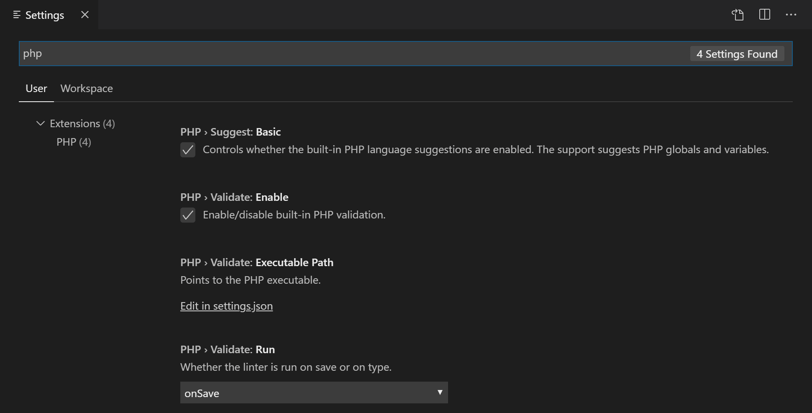
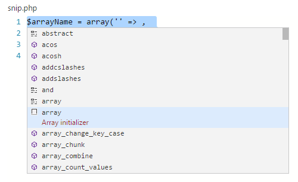
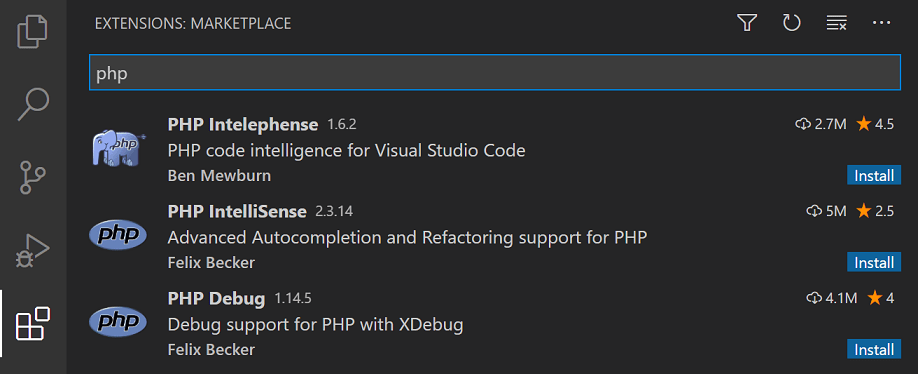

+++
title = "PHP"
date = 2024-01-12T22:36:24+08:00
weight = 100
type = "docs"
description = ""
isCJKLanguage = true
draft = false
+++

> 原文: [https://code.visualstudio.com/docs/languages/php](https://code.visualstudio.com/docs/languages/php)

# PHP in Visual Studio Code Visual Studio Code 中的 PHP


Visual Studio Code is a great editor for PHP development. You get features like syntax highlighting and bracket matching, IntelliSense (code completion), and snippets out of the box and you can add more functionality through community-created VS Code [extensions]().

​​	Visual Studio Code 是一个适用于 PHP 开发的出色编辑器。您可以开箱即用地获得语法突出显示和括号匹配、IntelliSense（代码补全）和代码段等功能，并且可以通过社区创建的 VS Code 扩展添加更多功能。

## [Linting]()

VS Code uses the official PHP linter (`php -l`) for PHP language diagnostics. This allows VS Code to stay current with PHP linter improvements.

​​	VS Code 使用官方 PHP linter（ `php -l` ）进行 PHP 语言诊断。这使得 VS Code 能够与 PHP linter 改进保持同步。

> Tip: Using XAMPP? Install the full version of PHP in order to obtain the development libraries.
>
> ​​	提示：正在使用 XAMPP？安装 PHP 的完整版本以获取开发库。

There are three [settings]() to control the PHP linter:

​​	有三个设置可用于控制 PHP linter：

- `php.validate.enable`: controls whether to enable PHP linting at all. Enabled by default.
  `php.validate.enable` ：控制是否启用 PHP linting。默认情况下已启用。
- `php.validate.executablePath`: points to the PHP executable on disk. Set this if the PHP executable is not on the system path.
  `php.validate.executablePath` ：指向磁盘上的 PHP 可执行文件。如果 PHP 可执行文件不在系统路径中，请设置此项。
- `php.validate.run`: controls whether the validation is triggered on save (value: `"onSave"`) or on type (value: `"onType"`). Default is on save.
  `php.validate.run` ：控制是否在保存时（值： `"onSave"` ）或键入时（值： `"onType"` ）触发验证。默认情况下在保存时触发。

To change the PHP settings, open your **User or Workspace Settings** (Ctrl+,) and type 'php' to filter the list of available settings.

​​	要更改 PHP 设置，请打开您的用户或工作区设置（Ctrl+,），然后键入“php”以筛选可用设置的列表。



To set the PHP executable path, select the **Edit in settings.json** link under **PHP > Validate: Executable Path**, which will open your user `settings.json` file. Add the `php.validate.executablePath` setting with the path to your PHP installation:

​​	若要设置 PHP 可执行文件路径，请选择 PHP > 验证：可执行文件路径下的在设置.json 中编辑链接，这将打开您的用户 `settings.json` 文件。添加 `php.validate.executablePath` 设置，其中包含 PHP 安装的路径：

### [Windows]()

```
{
  "php.validate.executablePath": "c:/php/php.exe"
}
```

### [Linux and macOS Linux 和 macOS]()

```
{
    "php.validate.executablePath": "/usr/bin/php"
}

or

{
    "php.validate.executablePath": "/usr/local/bin/php"
}
```

## [Snippets 代码片段]()

Visual Studio Code includes a set of common snippets for PHP. To access these, hit Ctrl+Space to get a context-specific list.

​​	Visual Studio Code 包含一组适用于 PHP 的常用代码段。若要访问这些代码段，请按 Ctrl+空格键以获取特定于上下文的列表。



## [PHP extensions PHP 扩展]()

There are many PHP language extensions available on the [VS Code Marketplace](https://marketplace.visualstudio.com/VSCode) and more are being created. You can search for PHP extensions from within VS Code in the **Extensions** view (Ctrl+Shift+X) then filter the extensions dropdown list by typing 'php'.

​​	VS Code Marketplace 上提供了许多 PHP 语言扩展，并且还在不断创建更多扩展。您可以在 VS Code 中的扩展视图（Ctrl+Shift+X）中搜索 PHP 扩展，然后通过键入“php”来筛选扩展下拉列表。



### [Disable built-in PHP support 禁用内置 PHP 支持]()

To disable the built-in PHP smart completions in favor of suggestions from an installed PHP extension, uncheck **PHP > Suggest: Basic**, which sets `php.suggest.basic` to false in your `settings.json` file.

​​	若要禁用内置 PHP 智能补全，而改用已安装 PHP 扩展的建议，请取消选中 PHP > 建议：基本，这会将 `php.suggest.basic` 设置为 `settings.json` 文件中的 false。

## [Debugging 调试]()

PHP debugging with **XDebug** is supported through a [PHP Debug extension](https://marketplace.visualstudio.com/items?itemName=xdebug.php-debug). Follow the extension's instructions for configuring **XDebug** to work with VS Code.

​​	通过 PHP 调试扩展支持使用 XDebug 进行 PHP 调试。按照扩展说明配置 XDebug 以配合 VS Code 工作。

## [Next steps 后续步骤]()

Read on to find out about:

​​	继续阅读以了解：

- [Extension Marketplace]() - Browse the extensions others have shared
  扩展市场 - 浏览其他人共享的扩展
- [Debugging]() - Learn more about VS Code debugging
  调试 - 详细了解 VS Code 调试
