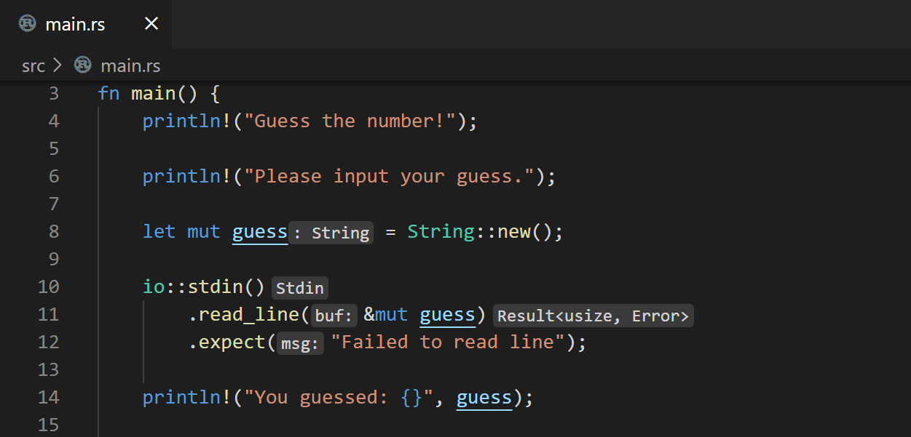

+++
title = "Rust"
date = 2024-01-12T22:36:24+08:00
weight = 150
type = "docs"
description = ""
isCJKLanguage = true
draft = false
+++

> 原文: [https://code.visualstudio.com/docs/languages/rust](https://code.visualstudio.com/docs/languages/rust)

# Rust in Visual Studio Code Visual Studio Code 中的 Rust


[Rust](https://www.rust-lang.org/) is a powerful programming language, often used for systems programming where performance and correctness are high priorities. If you are new to Rust and want to learn more, [The Rust Programming Language](https://doc.rust-lang.org/book) online book is a great place to start. This topic goes into detail about setting up and using Rust within Visual Studio Code, with the [rust-analyzer](https://marketplace.visualstudio.com/items?itemName=rust-lang.rust-analyzer) extension.

​​	Rust 是一种功能强大的编程语言，通常用于性能和正确性是重中之重的系统编程。如果您是 Rust 新手并希望了解更多信息，那么《Rust 编程语言》在线书籍是一个很好的起点。本主题详细介绍了在 Visual Studio Code 中设置和使用 Rust，并附带 rust-analyzer 扩展。


> **Note**: There is also another popular Rust extension in the VS Code Marketplace (extension ID: rust-lang.rust) but this extension is deprecated and rust-analyzer is the recommended VS Code Rust extension by rust-lang.org.
>
> ​​	注意：VS Code Marketplace 中还有另一个流行的 Rust 扩展（扩展 ID：rust-lang.rust），但此扩展已弃用，rust-analyzer 是 rust-lang.org 推荐的 VS Code Rust 扩展。

## [Installation 安装]()

### [1. Install Rust 1. 安装 Rust]()

First you will need to have the Rust toolset installed on your machine. Rust is installed via the [rustup](https://rustup.rs/) installer, which supports installation on Windows, macOS, and Linux. Follow the rustup installation guidance for your platform, taking care to install any extra tools required to build and run Rust programs.

​​	首先，您需要在计算机上安装 Rust 工具集。Rust 通过 rustup 安装程序进行安装，该安装程序支持在 Windows、macOS 和 Linux 上进行安装。按照适用于您平台的 rustup 安装指南进行操作，注意安装构建和运行 Rust 程序所需的任何其他工具。

> **Note**: As with installing any new toolset on your machine, you'll want to make sure to restart your terminal/Command Prompt and VS Code instances to use the updated toolset location in your platform's PATH variable.
>
> ​​	注意：与在计算机上安装任何新工具集一样，您需要确保重新启动终端/命令提示符和 VS Code 实例，以便在平台的 PATH 变量中使用更新的工具集位置。

### [2. Install the rust-analyzer extension 2. 安装 rust-analyzer 扩展]()

You can find and install the rust-analyzer extension from within VS Code via the Extensions view (Ctrl+Shift+X) and searching for 'rust-analyzer'. You should install the **Release Version**.

​​	可以通过扩展视图（Ctrl+Shift+X）在 VS Code 中查找并安装 rust-analyzer 扩展，然后搜索“rust-analyzer”。您应该安装发布版本。


We'll discuss many of rust-analyzer features in this topic but you can also refer to the extension's documentation at [https://rust-analyzer.github.io](https://rust-analyzer.github.io/).

​​	我们将在本主题中讨论 rust-analyzer 的许多功能，但您也可以参阅扩展的文档，网址为 https://rust-analyzer.github.io。

### [Check your installation 检查您的安装]()

After installing Rust, you can check that everything is installed correctly by opening a new terminal/Command Prompt, and typing:

​​	安装 Rust 后，您可以通过打开新的终端/命令提示符并键入以下内容来检查是否已正确安装所有内容：

```
rustc --version
```

which will output the version of the Rust compiler. If you want more details, you can add the `--verbose` argument. If you run into problems, you can consult the Rust [installation guide](https://doc.rust-lang.org/book/ch01-01-installation.html).

​​	这将输出 Rust 编译器的版本。如果您想要更多详细信息，可以添加 `--verbose` 参数。如果您遇到问题，可以查阅 Rust 安装指南。

You can keep your Rust installation up to date with the latest version by running:

​​	您可以通过运行以下内容使 Rust 安装保持最新版本：

```
rustup update
```

There are new stable versions of Rust published every 6 weeks so this is a good habit.

​​	每 6 周发布新的稳定版 Rust，因此这是一个好习惯。

### [Local Rust documentation 本地 Rust 文档]()

When you install Rust, you also get the full Rust documentation set locally installed on your machine, which you can review by typing `rustup doc`. The Rust documentation, including [The Rust Programming Language](https://doc.rust-lang.org/book/title-page.html) and [The Cargo Book](https://doc.rust-lang.org/stable/cargo/), will open in your local browser so you can continue your Rust journey while offline.

​​	安装 Rust 时，您还可以在本地计算机上安装完整的 Rust 文档集，您可以通过键入 `rustup doc` 来查看。Rust 文档（包括《Rust 编程语言》和《Cargo 书籍》）将在您的本地浏览器中打开，以便您在离线时继续您的 Rust 之旅。

## [Hello World]()

### [Cargo]()

When you install Rust with rustup, the toolset includes the rustc compiler, the rustfmt source code formatter, and the clippy Rust linter. You also get [Cargo](https://doc.rust-lang.org/cargo), the Rust package manager, to help download Rust dependencies and build and run Rust programs. You'll find that you end up using `cargo` for just about everything when working with Rust.

​​	使用 rustup 安装 Rust 时，该工具集包括 rustc 编译器、rustfmt 源代码格式化程序和 clippy Rust linter。您还将获得 Rust 包管理器 Cargo，以帮助下载 Rust 依赖项以及构建和运行 Rust 程序。您会发现，在使用 Rust 时，您最终会将 `cargo` 用于几乎所有内容。

### [Cargo new]()

A good way to create your first Rust program is to use Cargo to scaffold a new project by typing `cargo new`. This will create a simple Hello World program along with a default `Cargo.toml` dependency file. You pass `cargo new` the folder where you'd like to create the project.

​​	创建第一个 Rust 程序的一个好方法是使用 Cargo 通过键入 `cargo new` 来构建新项目。这将创建一个简单的 Hello World 程序以及一个默认的 `Cargo.toml` 依赖项文件。您将 `cargo new` 传递给您想要创建项目的文件夹。

Let's create Hello World. Navigate to a folder where you'd like to create your project and type:

​​	让我们创建 Hello World。导航到您想要创建项目的文件夹，然后键入：

```
cargo new hello_world
```

To open your new project in VS Code, navigate into the new folder and launch VS Code via `code .`:

​​	要在 VS Code 中打开您的新项目，请导航到新文件夹并通过 `code .` 启动 VS Code：

```
cd hello_world
code .
```

> **Note**: Enable [Workspace Trust]() for the new folder as you are the author. You can enable Workspace Trust for your entire project folder parent to avoid being prompted when you create new projects by checking the option to **Trust the authors of all the files in parent folder 'my_projects`**.
>
> ​​	注意：启用新文件夹的工作区信任，因为您是作者。您可以为整个项目文件夹父级启用工作区信任，以避免在创建新项目时收到提示，方法是选中信任父文件夹“my_projects”中所有文件的作者的选项。

`cargo new` creates a simple Hello World project with a `main.rs` source code file and `Cargo.toml` [Cargo manifest](https://doc.rust-lang.org/cargo/reference/manifest.html) file.

​​	 `cargo new` 使用 `main.rs` 源代码文件和 `Cargo.toml` Cargo 清单文件创建简单的 Hello World 项目。

```
src\
    main.rs
.gitignore
Cargo.toml
```

`main.rs` has the program's entry function `main()` and prints "Hello, world!" to the console using `println!`.

​​	 `main.rs` 具有程序的入口函数 `main()` ，并使用 `println!` 将“Hello, world!”打印到控制台。

```
fn main() {
    println!("Hello, world!");
}
```

This simple Hello World program doesn't have any dependencies but you would add Rust package (crate) references under `[dependencies]`.

​​	这个简单的 Hello World 程序没有任何依赖项，但您可以在 `[dependencies]` 下添加 Rust 包（箱子）引用。

### [Cargo build Cargo 构建]()

Cargo can be used to build your Rust project. Open a new VS Code [integrated terminal]() (Ctrl+Shift+`) and type `cargo build`.

​​	Cargo 可用于构建您的 Rust 项目。打开一个新的 VS Code 集成终端 (Ctrl+Shift+`) 并键入 `cargo build` 。

```
cargo build
```


You will now have `target\debug` folder with build output include an executable called `hello_world.exe`.

​​	现在您将拥有 `target\debug` 文件夹，其中构建输出包括一个名为 `hello_world.exe` 的可执行文件。

### [Running Hello World 运行 Hello World]()

Cargo can also be used to run your Rust project via `cargo run`.

​​	Cargo 还可用于通过 `cargo run` 运行您的 Rust 项目。

```
cargo run
```

You can also run `hello_world.exe` manually in the terminal by typing `.\target\debug\hello_world`.

​​	您还可以在终端中通过键入 `.\target\debug\hello_world` 手动运行 `hello_world.exe` 。


## [IntelliSense]()

IntelliSense features are provided by the Rust language server, [rust-analyzer](https://github.com/rust-lang/rust-analyzer/releases), which provides detailed code information and smart suggestions.

​​	IntelliSense 功能由 Rust 语言服务器 rust-analyzer 提供，它提供详细的代码信息和智能建议。

When you first open a Rust project, you can watch rust-analyzer's progress in the lower left of the Status bar. You want to wait until rust-analyzer has completely reviewed your project to get the full power of the language server.

​​	首次打开 Rust 项目时，您可以在状态栏的左下角查看 rust-analyzer 的进度。您需要等到 rust-analyzer 完全检查完您的项目，才能获得语言服务器的全部功能。


### [Inlay hints 内联提示]()

One of the first things you may notice is rust-analyzer providing [inlay hints]() to show inferred types, return values, named parameters in light text in the editor.

​​	您可能注意到的第一件事是 rust-analyzer 提供内联提示，以在编辑器中以浅色文本显示推断类型、返回值和命名参数。



While inlay hints can be helpful for understanding your code, you can also configure the feature via the **Editor > Inlay Hints: Enabled** setting (`editor.inlayHints.enabled`).

​​	虽然内联提示有助于理解您的代码，但您也可以通过编辑器 > 内联提示：启用设置 ( `editor.inlayHints.enabled` ) 配置该功能。

### [Hover information 悬停信息]()

Hovering on any variable, function, type, or keyword will give you information on that item such as documentation, signature, etc. You can also jump to the type definition in your own code or the standard Rust libraries.

​​	将鼠标悬停在任何变量、函数、类型或关键字上，都会为您提供有关该项的信息，例如文档、签名等。您还可以跳转到您自己的代码或标准 Rust 库中的类型定义。


### [Auto completions 自动完成]()

As you type in a Rust file, IntelliSense provides you with suggested completions and parameter hints.

​​	在 Rust 文件中键入时，IntelliSense 会为您提供建议的补全和参数提示。


> **Tip**: Use Ctrl+Space to trigger the suggestions manually.
>
> ​​	提示：使用 Ctrl+Space 手动触发建议。

## [Semantic syntax highlighting 语义语法突出显示]()

rust-analyzer is able to use [semantic syntax highlighting](https://github.com/microsoft/vscode/wiki/Semantic-Highlighting-Overview) and styling due to its rich understanding of a project source code. For example, you may have noticed that mutable variables are underlined in the editor.

​​	rust-analyzer 能够使用语义语法突出显示和样式，因为它对项目源代码有深入的了解。例如，您可能已经注意到可变变量在编辑器中带有下划线。


Being able to quickly tell which Rust variables are mutable or not can help your understanding of source code, but you can also change the styling with VS Code `editor.semanticTokenColorCustomizations` setting in your user [settings]().

​​	能够快速分辨哪些 Rust 变量是可变的，哪些不是，有助于您理解源代码，但您也可以通过用户设置中的 VS Code `editor.semanticTokenColorCustomizations` 设置更改样式。

In `settings.json`, you would add:

​​	在 `settings.json` 中，您需要添加：

```
{
  "editor.semanticTokenColorCustomizations": {
    "rules": {
      "*.mutable": {
        "fontStyle": "", // set to empty string to disable underline, which is the default
      },
    }
  },
}
```

You can learn more about rust-analyzer's semantic syntax customizations in the [Editor features](https://rust-analyzer.github.io/manual.html#editor-features) section of the rust-analyzer documentation.

​​	您可以在 rust-analyzer 文档的编辑器功能部分中了解有关 rust-analyzer 语义语法自定义的更多信息。

## [Code navigation 代码导航]()

Code navigation features are available in the context menu in the editor.

​​	代码导航功能在编辑器的上下文菜单中可用。

- **Go to Definition** F12 - Go to the source code of the type definition.
  转到定义 F12 - 转到类型定义的源代码。
- **Peek Definition** Alt+F12 - Bring up a Peek window with the type definition.
  预览定义 Alt+F12 - 使用类型定义调出预览窗口。
- **Go to References** Shift+F12 - Show all references for the type.
  转到引用 Shift+F12 - 显示类型的全部引用。
- **Show Call Hierarchy** Shift+Alt+H - Show all calls from or to a function.
  显示调用层次结构 Shift+Alt+H - 显示从函数或到函数的所有调用。

You can navigate via symbol search using the **Go to Symbol** commands from the **Command Palette** (Ctrl+Shift+P).

​​	您可以使用命令面板（Ctrl+Shift+P）中的转到符号命令通过符号搜索进行导航。

- Go to Symbol in File - Ctrl+Shift+O
  转到文件中的符号 - Ctrl+Shift+O
- Go to Symbol in Workspace - Ctrl+T
  转到工作区中的符号 - Ctrl+T

## [Linting]()

The Rust toolset includes linting, provided by rustc and clippy, to detect issues with your source code.

​​	Rust 工具集包括由 rustc 和 clippy 提供的 linting，用于检测源代码中的问题。


The rustc linter, enabled by default, detects basic Rust errors, but you can use [clippy](https://github.com/rust-lang/rust-clippy) to get more lints. To enable clippy integration in rust-analyzer, change the **Rust-analyzer > Check: Command** (`rust-analyzer.check.command`) setting to `clippy` instead of the default `check`. The rust-analyzer extension will now run `cargo clippy` when you save a file and display clippy warnings and errors directly in the editor and Problems view.

​​	默认启用的 rustc linter 可检测基本的 Rust 错误，但你可以使用 clippy 来获得更多 lints。要启用 rust-analyzer 中的 clippy 集成，请将 Rust-analyzer > 检查：命令 ( `rust-analyzer.check.command` ) 设置更改为 `clippy` ，而不是默认的 `check` 。现在，当你保存文件时，rust-analyzer 扩展程序将运行 `cargo clippy` ，并在编辑器和问题视图中直接显示 clippy 警告和错误。

## [Quick Fixes 快速修复]()

When the linter finds errors and warnings in your source code, rust-analyzer can often provide suggested Quick Fixes (also called Code Actions), which are available via a light bulb hover in the editor. You can quickly open available Quick Fixes via the Ctrl+..

​​	当 linter 在你的源代码中发现错误和警告时，rust-analyzer 通常可以提供建议的快速修复（也称为代码操作），这些操作可通过编辑器中的灯泡悬停获得。你可以通过 Ctrl+.. 快速打开可用的快速修复

Additionally, **Code Action Widget: Include Nearby Quick Fixes** (`editor.codeActionWidget.includeNearbyQuickFixes`) is a setting that is enabled on default, which will activate the nearest Quick Fix in a line from Ctrl+. (command ID `editor.action.quickFix`), no matter where your cursor is in that line.

​​	未使用的变量和不可达代码

The command highlights the source code that will be refactored or fixed with Quick Fixes. Normal Code Actions and non-fix refactorings can still be activated at the cursor location.

​​	未使用的 JavaScript 代码（例如始终为 true 的语句的 else 块或未引用的导入）在编辑器中会显示为淡出：


## [Refactoring 重构]()

Due to rust-analyzer's semantic understanding of your source code, it can also provide smart renames, across your Rust files. With your cursor on a variable, select **Rename Symbol** from the context menu, Command Palette, or via F2.

​​	由于 rust-analyzer 对你的源代码具有语义理解，因此它还可以在你的 Rust 文件中提供智能重命名。将光标放在变量上，从上下文菜单、命令面板或通过 F2 选择重命名符号。

The rust-analyzer extension also supports other code refactorings and code generation, which the extension calls [Assists](https://rust-analyzer.github.io/manual.html#assists-code-actions).

​​	rust-analyzer 扩展程序还支持其他代码重构和代码生成，该扩展程序称之为辅助。

Here are just a few of the refactorings available:

​​	以下是一些可用的重构：

- Convert if statement to guarded return
  将 if 语句转换为受保护的返回
- Inline variable
  内联变量
- Extract function
  提取函数
- Add return type
  添加返回类型
- Add import
  添加导入

## [Formatting 格式化]()

The Rust toolset includes a formatter, [rustfmt](https://github.com/rust-lang/rustfmt), which can format your source code to conform to Rust conventions. You can format your Rust file using Shift+Alt+F or by running the **Format Document** command from the **Command Palette** or the context menu in the editor.

​​	Rust 工具集包含一个格式化程序 rustfmt，它可以格式化您的源代码以符合 Rust 惯例。您可以使用 Shift+Alt+F 格式化您的 Rust 文件，或通过从命令面板或编辑器中的上下文菜单运行“格式化文档”命令来格式化。您还可以选择在每次保存（编辑器：保存时格式化）或粘贴（粘贴时格式化）时运行格式化程序，以便在您工作时自动保持 Rust 代码格式正确。

You also have the option to run the formatter on each save (**Editor: Format On Save**) or paste (**Format On Paste**) to keep your Rust code properly formatted automatically while you are working.

​​	rust-analyzer 扩展支持在 VS Code 中调试 Rust。

## [Debugging 调试]()

The rust-analyzer extension supports debugging Rust from within VS Code.

​​	安装调试支持

### [Install debugging support 要开始调试，您首先需要安装两个带调试支持的语言扩展之一：]()

To start debugging, you will first need to install one of two language extension with debugging support:

​​	Microsoft C++ (ms-vscode.cpptools) – 在 Windows 上

- [Microsoft C++](https://marketplace.visualstudio.com/items?itemName=ms-vscode.cpptools) (ms-vscode.cpptools) – *on Windows*
  CodeLLDB (vadimcn.vscode-lldb) – 在 macOS/Linux 上
- [CodeLLDB](https://marketplace.visualstudio.com/items?itemName=vadimcn.vscode-lldb) (vadimcn.vscode-lldb) – *on macOS/Linux*
  如果您忘记安装其中一个扩展，rust-analyzer 将在您尝试启动调试会话时提供带有 VS Code Marketplace 链接的通知。

If you forget to install one of these extensions, rust-analyzer will provide a notification with links to the VS Code Marketplace when you try to start a debug session.

​​	使用 Rust Analyzer：调试


### [Using Rust Analyzer: Debug]()

The rust-analyzer extension has basic debugging support via the **Rust Analyzer: Debug** command available in the Command Palette (Ctrl+Shift+P) and the **Run|Debug** CodeLens in the editor.

​​	rust-analyzer 扩展通过 Rust Analyzer: Debug 命令（可在命令面板（Ctrl+Shift+P）中找到）和编辑器中的运行 | 调试 CodeLens 提供基本调试支持。

Let's debug the Hello World program, we created earlier. First we will set a breakpoint in `main.rs`.

​​	让我们调试一下我们之前创建的 Hello World 程序。首先，我们在 `main.rs` 中设置一个断点。

1. You'll need to enable the setting **Debug: Allow Breakpoints Everywhere**, which you can find in the Settings editor (Ctrl+,) by searching on 'everywhere`.

   ​​	您需要启用设置调试：允许在任何地方设置断点，您可以在设置编辑器（Ctrl+，）中通过搜索“everywhere”找到该设置。

   

2. Open `main.rs` and click the left gutter in the editor to set a break point on the `println!` line. It should display as a red dot.

   ​​	打开 `main.rs` 并单击编辑器中的左侧边距，以便在 `println!` 行上设置断点。它应显示为一个红点。

   

3. To start debugging, use either the **Rust Analyzer: Debug** command or select the **Debug** CodeLens about `main()`.

   ​​	要开始调试，请使用 Rust Analyzer: Debug 命令或选择有关 `main()` 的 Debug CodeLens。

   

## [Next steps 后续步骤]()

This has been a brief overview showing the rust-analyzer extension features within VS Code. For more information, see the details provided in the Rust Analyzer extension [User Manual](https://rust-analyzer.github.io/manual.html), including how to tune specific [VS Code editor](https://rust-analyzer.github.io/manual.html#vs-code-2) configurations.

​​	这是一个简要概述，展示了 VS Code 中的 rust-analyzer 扩展功能。有关更多信息，请参阅 Rust Analyzer 扩展用户手册中提供的详细信息，包括如何调整特定的 VS Code 编辑器配置。

To stay up to date on the latest features/bug fixes for the rust-analyzer extension, see the [CHANGELOG](https://rust-analyzer.github.io/thisweek). You can also try out new features and fixes by installing the rust-analyzer **Pre-Release Version** available in the Extensions view **Install** dropdown.

​​	要了解 rust-analyzer 扩展的最新功能/错误修复，请参阅 CHANGELOG。您还可以通过在扩展视图安装下拉列表中安装 rust-analyzer 预发布版本来试用新功能和修复程序。

If you have any issues or feature requests, feel free to log them in the rust-analyzer extension [GitHub repo](https://github.com/rust-lang/rust-analyzer/issues).

​​	如果您有任何问题或功能请求，请随时在 rust-analyzer 扩展 GitHub 存储库中记录它们。

If you'd like to learn more about VS Code, try these topics:

​​	如果您想详细了解 VS Code，请尝试以下主题：

- [Basic Editing]() - A quick introduction to the basics of the VS Code editor.
  基本编辑 - VS Code 编辑器的基础知识快速入门。
- [Install an Extension]() - Learn about other extensions are available in the [Marketplace](https://marketplace.visualstudio.com/vscode).
  安装扩展 - 了解市场中提供的其他扩展。
- [Code Navigation]() - Move quickly through your source code.
  代码导航 - 快速浏览源代码。

## [Common questions 常见问题]()

### [Linker errors 链接器错误]()

If you see linker errors such as **"error: linker `link.exe` not found"** when you try to build your Rust program, you may be missing the necessary C/C++ toolset. Depending on your platform, you will need to install a toolset with a C/C++ linker to combine the Rust compiler output.

​​	如果您在尝试构建 Rust 程序时看到诸如“错误：找不到链接器 `link.exe` ”之类的链接器错误，则您可能缺少必要的 C/C++ 工具集。根据您的平台，您需要安装带有 C/C++ 链接器的工具集，以合并 Rust 编译器输出。

**Windows**

On Windows, you will need to also install [Microsoft C++ Build Tools](https://visualstudio.microsoft.com/visual-cpp-build-tools/) in order to get the C/C++ linker `link.exe`. Be sure to select the **Desktop Development with C++** when running the Visual Studio installer.

​​	在 Windows 上，您还需要安装 Microsoft C++ Build Tools 才能获得 C/C++ 链接器 `link.exe` 。运行 Visual Studio 安装程序时，请务必选择“使用 C++ 进行桌面开发”。

> **Note**: You can use the C++ toolset from Visual Studio Build Tools along with Visual Studio Code to compile, build, and verify any codebase as long as you also have a valid Visual Studio license (either Community, Pro, or Enterprise).
>
> ​​	注意：只要您拥有有效的 Visual Studio 许可证（社区版、专业版或企业版），您就可以将 Visual Studio Build Tools 中的 C++ 工具集与 Visual Studio Code 一起使用，以编译、构建和验证任何代码库。

**macOS**

You may need to install the XCode toolset by running `xcode-select --install` in a terminal.

​​	您可能需要通过在终端中运行 `xcode-select --install` 来安装 XCode 工具集。

**Linux**

You may need to install the GCC toolset via the `build-essential` package by running `sudo apt-get install build-essential` in a terminal.

​​	您可能需要通过在终端中运行 `sudo apt-get install build-essential` 来通过 `build-essential` 包安装 GCC 工具集。

For further troubleshooting advice, refer to the [Rust installation](https://doc.rust-lang.org/book/ch01-01-installation.html) guide.

​​	有关其他故障排除建议，请参阅 Rust 安装指南。
