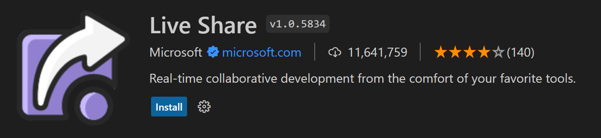
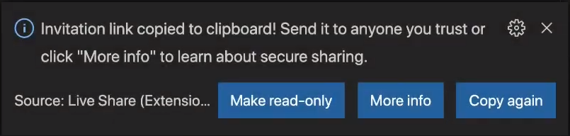

+++
title = "Live Share"
date = 2024-01-13T19:53:38+08:00
weight = 1
type = "docs"
description = ""
isCJKLanguage = true
draft = false
+++

> 原文: [https://code.visualstudio.com/learn/collaboration/live-share](https://code.visualstudio.com/learn/collaboration/live-share)

# Collaborate with Live Share 与 Live Share 协作

## [What is Live Share? Live Share 是什么？]()

[Live Share](https://learn.microsoft.com/visualstudio/liveshare) enables you to quickly collaborate with a friend, classmate, or professor on the same code without the need to sync code or to configure the same development tools, settings, or environment.

​​​	Live Share 使您能够与朋友、同学或教授快速协作处理相同的代码，而无需同步代码或配置相同的开发工具、设置或环境。

When it comes to Live Share, seeing is believing. Check out this video to see Live Share in action:

​​​	说到 Live Share，眼见为实。观看此视频，了解 Live Share 的实际应用：

<iframe src="https://youtube.com/embed/A2ceblXTBBc?rel=0&amp;disablekb=0&amp;modestbranding=1&amp;showinfo=0" frameborder="0" allowfullscreen="" title="Collaborate with Live Share" style="box-sizing: border-box; font-family: &quot;Segoe UI&quot;, &quot;Helvetica Neue&quot;, Helvetica, Arial, sans-serif; width: 616.662px; max-width: 100%; height: 400px; color: rgb(36, 36, 36); font-size: 16px; font-style: normal; font-variant-ligatures: normal; font-variant-caps: normal; font-weight: 400; letter-spacing: normal; orphans: 2; text-align: start; text-indent: 0px; text-transform: none; widows: 2; word-spacing: 0px; -webkit-text-stroke-width: 0px; white-space: normal; background-color: rgb(255, 255, 255); text-decoration-thickness: initial; text-decoration-style: initial; text-decoration-color: initial;"></iframe>

> **Note**: The video above mentions the deprecated Live Share Extension Pack and Live Share Audio extension. To follow along with the video, you only need to install the [Live Share](https://marketplace.visualstudio.com/items?itemName=MS-vsliveshare.vsliveshare) extension.
>
> ​​​	注意：上述视频提到了已弃用的 Live Share 扩展包和 Live Share 音频扩展。要按照视频操作，您只需安装 Live Share 扩展。

When you share a collaborative session, the person you're working with sees the context of the workspace in their editor. This means your classmate can read the code you shared without having to clone a repo or install any dependencies your code relies on. They can help you with your code in the Visual Studio Code environment that's familiar to them.

​​​	当您共享协作会话时，您正在与之协作的人会在其编辑器中看到工作区的上下文。这意味着您的同学可以阅读您共享的代码，而无需克隆存储库或安装您的代码所依赖的任何依赖项。他们可以在他们熟悉的 Visual Studio Code 环境中帮助您处理代码。

Each of you can open files, navigate, edit code, or highlight - and changes are instantly reflected. As you edit you can see your classmate's cursor, jump to the same location, and follow their actions.

​​​	你们每个人都可以打开文件、导航、编辑代码或突出显示 - 并且更改会立即反映出来。在您编辑时，您可以看到同学的光标，跳转到相同的位置并跟踪他们的操作。

You can also debug together using VS Code's debugging features, like hovers, locals and watches, the stack trace or the debug console. You are both able to set breakpoints and advance the debug cursor to step through the session.

​​​	您还可以使用 VS Code 的调试功能（如悬停、局部变量和监视、堆栈跟踪或调试控制台）一起进行调试。你们都可以设置断点并推进调试光标以逐步完成会话。

For more details about what you can do with Live Share, visit the [how-to-guide](https://learn.microsoft.com/visualstudio/liveshare/use/install-live-share-visual-studio-code) or read the quick-start below.

​​​	有关 Live Share 功能的更多详细信息，请访问操作指南或阅读以下快速入门。

## [Get started with Live Share 开始使用 Live Share]()

To get started with using Live Share in VS Code, you'll need to download the [Live Share](https://marketplace.visualstudio.com/items?itemName=MS-vsliveshare.vsliveshare) extension from the VS Code Marketplace.

​​​	要开始在 VS Code 中使用 Live Share，您需要从 VS Code Marketplace 下载 Live Share 扩展。

This extension includes everything you need to start collaboratively editing and debugging in real time. This provides you and your team/class with a one-click installation, in order to begin pair programming, performing remote code reviews, driving interactive lectures, and more, without needing to leave Visual Studio Code.

​​​	此扩展包含您开始实时协作编辑和调试所需的一切。这为您和您的团队/班级提供了一键式安装，以便开始结对编程、执行远程代码审查、进行互动式讲座等，而无需离开 Visual Studio Code。

Once you log into your GitHub account, you'll see the Live Share icon in the Activity Bar.

​​​	登录 GitHub 帐户后，您将在活动栏中看到 Live Share 图标。

### [Starting a Live Share session 启动 Live Share 会话]()

If you select **Start Collaboration session** from the Session Details menu, an invitation link to your session will automatically be copied to your clipboard. You can share this link with anyone you'd like to collaborate with, as long as they also have VS Code and the Live Share extension installed.

​​​	如果从“会话详细信息”菜单中选择“开始协作会话”，则会话的邀请链接将自动复制到剪贴板。只要他们也安装了 VS Code 和 Live Share 扩展，就可以与任何你想与之协作的人共享此链接。

When your classmate joins the session, you'll get a notification, and see their name come up under Participants.

​​​	当你的同学加入会话时，你将收到通知，并在“参与者”下看到他们的姓名。

### [Joining a Live Share session 加入 Live Share 会话]()

If you select **Join Collaboration session** from the Session Details menu, you're able to enter the URL you received.

​​​	如果从“会话详细信息”菜单中选择“加入协作会话”，则可以输入收到的 URL。

You should be able to see and interact with your classmate's code on your screen!

​​​	你应该能够在屏幕上看到并与同学的代码进行交互！
