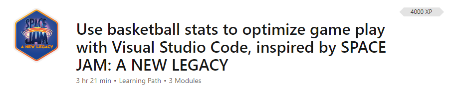
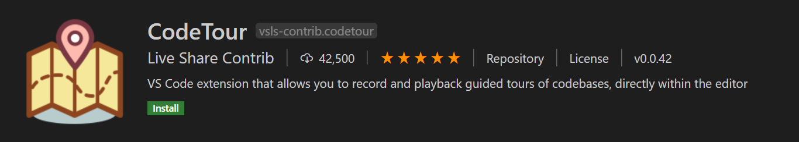

+++
title = "CodeTour"
date = 2024-01-13T19:53:38+08:00
weight = 10
type = "docs"
description = ""
isCJKLanguage = true
draft = false
+++

> 原文: [https://code.visualstudio.com/learn/educators/codetour](https://code.visualstudio.com/learn/educators/codetour)

# CodeTour

Helping students understand a new codebase can be challenging and time consuming. Creating descriptive enough instructions can be cumbersome and still not easy enough for students to follow. CodeTour can help you introduce your students to your assignments and projects in a streamlined and interactive way.

&zeroWidthSpace;帮助学生理解新的代码库可能具有挑战性且耗时。创建足够说明性的说明可能很麻烦，而且对于学生来说仍然不够容易理解。CodeTour 可以帮助您以简化且交互的方式向学生介绍您的作业和项目。

## [What is CodeTour? 什么是 CodeTour？](https://code.visualstudio.com/learn/educators/codetour#_what-is-codetour)

[CodeTour](https://marketplace.visualstudio.com/items?itemName=vsls-contrib.codetour) is a Visual Studio Code extension that allows you to create a step-by-step guide through your codebases. This can be helpful in your classroom to break up your assignments into steps for students to follow or to get them familiar with all parts of the assignment by pointing them to relevant pieces within the assignment.

&zeroWidthSpace;CodeTour 是一个 Visual Studio Code 扩展，允许您创建逐步指南来浏览您的代码库。这在您的课堂中很有用，可以将您的作业分解为学生可以遵循的步骤，或者通过将他们指向作业中的相关部分来让他们熟悉作业的所有部分。

In the short video below, an instructor is removing existing instructions embedded in the source code and replacing them with CodeTour steps so students can jump from step to step in the large game development project:

&zeroWidthSpace;在下面的短视频中，一位讲师正在移除嵌入在源代码中的现有说明，并用 CodeTour 步骤替换它们，以便学生可以在大型游戏开发项目中逐个步骤地进行学习：

Essentially, a "code tour" is simply a series of interactive steps, each of which are associated with a specific directory, or file/line, and include a description of the respective code. Tours can either be checked into a repo to share with source control, or exported to a "tour file", which allows anyone to replay the same tour, without having to clone any code!

&zeroWidthSpace;本质上，“代码之旅”只是一系列交互式步骤，每个步骤都与特定目录或文件/行相关联，并包含对相应代码的描述。可以将之旅检入到存储库中以与源代码管理共享，或导出到“之旅文件”，这样任何人都可以重播相同的之旅，而无需克隆任何代码！

## [Case study 案例研究](https://code.visualstudio.com/learn/educators/codetour#_case-study)

We've used CodeTour in the Microsoft partnered Space Jam lessons: [Use basketball stats to optimize game play with Visual Studio Code, inspired by SPACE JAM: A NEW LEGACY](https://learn.microsoft.com/training/paths/optimize-basketball-games-with-machine-learning)

&zeroWidthSpace;我们在 Microsoft 合作的《空中大灌篮》课程中使用了 CodeTour：使用篮球统计数据优化游戏玩法，灵感来自《空中大灌篮 2：新传奇》

CodeTour helps guide the self-paced learners through [module 2](https://learn.microsoft.com/training/modules/optimize-basketball-player-rest-breaks), where they are [creating a web app](https://learn.microsoft.com/training/modules/optimize-basketball-player-rest-breaks/7-codetour) that uses basketball stats to make decisions on the basketball court.

&zeroWidthSpace;CodeTour 帮助自学成才的学习者完成模块 2，在该模块中，他们将创建一个使用篮球统计数据在篮球场上做出决策的网络应用程序。

Here is a short clip of a student using CodeTour to start working on their basketball web app:

&zeroWidthSpace;以下是一个学生使用 CodeTour 开始开发其篮球网络应用程序的简短片段：

## [Getting started with CodeTour 开始使用 CodeTour](https://code.visualstudio.com/learn/educators/codetour#_getting-started-with-codetour)

To start using CodeTour, you'll need to download the CodeTour extension from the VS Code [Marketplace](https://marketplace.visualstudio.com/vscode).

&zeroWidthSpace;要开始使用 CodeTour，您需要从 VS Code Marketplace 下载 CodeTour 扩展。

To use CodeTour effectively in your classroom, we recommend following the guidelines on the [CodeTour repository](https://github.com/microsoft/codetour#getting-started).

&zeroWidthSpace;为了在课堂上有效地使用 CodeTour，我们建议您遵循 CodeTour 存储库中的指南。
