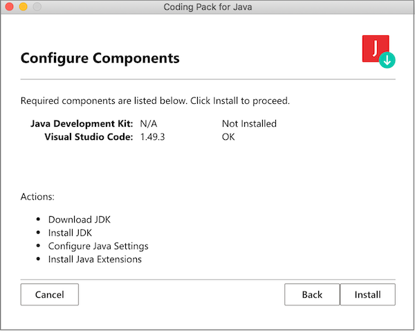
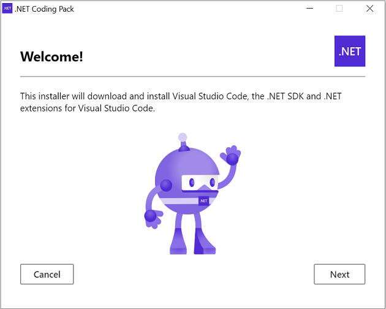

+++
title = "Coding Packs"
date = 2024-01-13T19:53:38+08:00
weight = 1
type = "docs"
description = ""
isCJKLanguage = true
draft = false
+++

> 原文: [https://code.visualstudio.com/learn/educators/installers](https://code.visualstudio.com/learn/educators/installers)

# Coding Packs 编码包

As educators, we know it's frustrating to install all the different software to get your students ready to code. There's editors/IDEs, runtimes and compilers, packages or libraries, and different versions of each...it's annoying! We've got you covered.

&zeroWidthSpace;作为教育工作者，我们知道为学生安装所有不同的软件以使其准备好进行编码是一件令人沮丧的事情。有编辑器/IDE、运行时和编译器、软件包或库以及每个软件包的不同版本……这很烦人！我们为您提供保障。

## [Coding pack for Java 适用于 Java 的编码包](https://code.visualstudio.com/learn/educators/installers#_coding-pack-for-java)

This coding pack includes everything you need to start coding in Java.

&zeroWidthSpace;此编码包包含您开始使用 Java 进行编码所需的一切。

[Download - Windows](https://aka.ms/vscode-java-installer-win) [Download - macOS](https://aka.ms/vscode-java-installer-mac)

&zeroWidthSpace;下载 - Windows 下载 - macOS

This will install:

&zeroWidthSpace;这将安装：

- Java Development Kit (JDK) and add it to the PATH
  Java 开发工具包 (JDK) 并将其添加到 PATH
- VS Code
- Java extension pack in VS Code
  VS Code 中的 Java 扩展包

## [.NET Coding Pack .NET 编码包](https://code.visualstudio.com/learn/educators/installers#_net-coding-pack)

The .NET coding pack includes everything you need to start coding with .NET.

&zeroWidthSpace;.NET 编码包包含您开始使用 .NET 进行编码所需的一切。

[Download - Windows](https://aka.ms/dotnet-coding-pack-win) [Download - macOS](https://aka.ms/dotnet-coding-pack-mac)

&zeroWidthSpace;下载 - Windows 下载 - macOS

This will install:

&zeroWidthSpace;这将安装：

- VS Code
- .NET SDK and add it to the PATH
  .NET SDK 并将其添加到 PATH
- .NET Extension pack in VS Code
  VS Code 中的 .NET 扩展包

