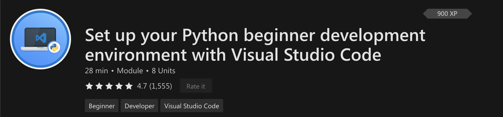
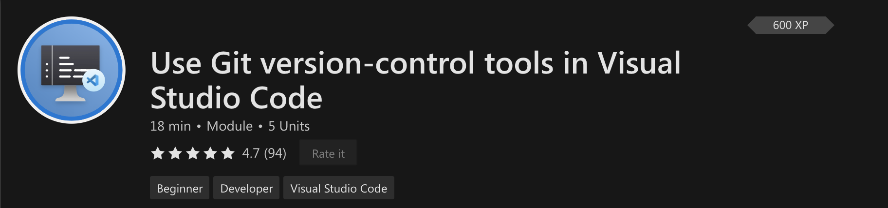
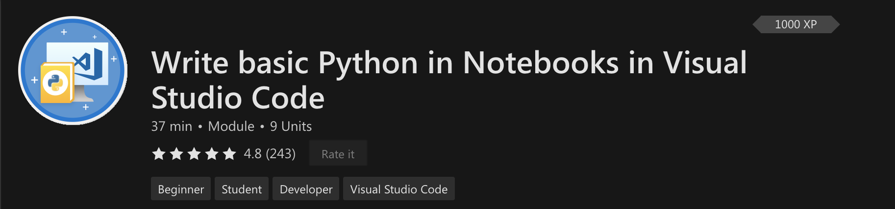
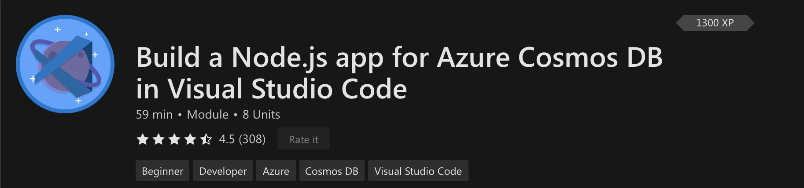

+++
title = "Microsoft Learn"
date = 2024-01-13T19:53:38+08:00
weight = 20
type = "docs"
description = ""
isCJKLanguage = true
draft = false
+++

> 原文: [https://code.visualstudio.com/learn/educators/learn-modules](https://code.visualstudio.com/learn/educators/learn-modules)

# Learn modules 学习模块

If you're looking for resources for your students to get started with Visual Studio Code, check out this curated list of Learn modules. These modules are designed to walk you through step-by-step to set up your work environment or finish a small project, all while familiarizing you with the VS Code interface.

&zeroWidthSpace;如果您正在寻找资源来帮助您的学生开始使用 Visual Studio Code，请查看此精选的 Learn 模块列表。这些模块旨在逐步引导您设置工作环境或完成一个小项目，同时让您熟悉 VS Code 界面。

[Set up your Python beginner development environment
设置 Python 初学者开发环境](https://learn.microsoft.com/training/modules/python-install-vscode/)

Get started with learning Python by installing and configuring the tools you'll need to build real applications.

&zeroWidthSpace;通过安装和配置构建真实应用程序所需的工具，开始学习 Python。

[Use Git version-control tools
使用 Git 版本控制工具](https://learn.microsoft.com/training/modules/use-git-from-vs-code/)

Utilize the tight integration of Visual Studio Code with the Git source-control management system.

&zeroWidthSpace;利用 Visual Studio Code 与 Git 源代码管理系统的紧密集成。

[Write basic Python in Notebooks
在笔记本中编写基本 Python](https://learn.microsoft.com/training/modules/basic-python-nasa/)

Learn the basics of Python.

&zeroWidthSpace;学习 Python 的基础知识。

[Build a Node.js app for Azure Cosmos DB
为 Azure Cosmos DB 构建 Node.js 应用](https://learn.microsoft.com/training/modules/build-node-cosmos-app-vscode/)

Build a database app to store and query data in Azure Cosmos DB by using Visual Studio Code and Node.js.

&zeroWidthSpace;使用 Visual Studio Code 和 Node.js 构建一个数据库应用，以在 Azure Cosmos DB 中存储和查询数据。

