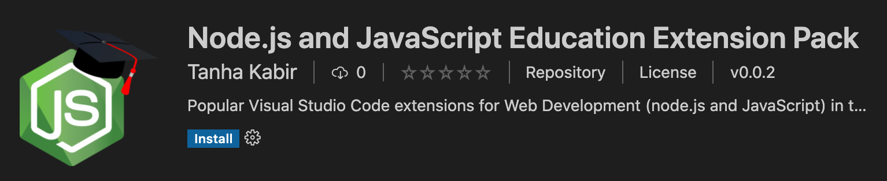
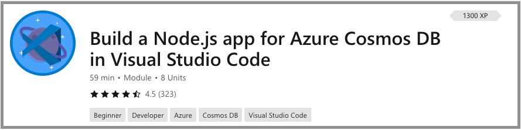

+++
title = "Node.js and JavaScript"
date = 2024-01-13T19:53:38+08:00
weight = 30
type = "docs"
description = ""
isCJKLanguage = true
draft = false
+++

> 原文: [https://code.visualstudio.com/learn/educators/nodejs](https://code.visualstudio.com/learn/educators/nodejs)

# Node.js and JavaScript in Visual Studio Code Visual Studio Code 中的 Node.js 和 JavaScript


Visual Studio Code is the most popular free code editor among JavaScript developers around the world according to the [State of JS 2020 survey](https://2020.stateofjs.com/other-tools/#text_editors). It is easily customizable and has a rich ecosystem of extensions to help your students learn Node.js and JavaScript.

​​​	根据 2020 年 JS 状态调查，Visual Studio Code 是全球 JavaScript 开发人员中最受欢迎的免费代码编辑器。它易于自定义，并拥有丰富的扩展生态系统，可帮助您的学生学习 Node.js 和 JavaScript。

Below is a case study of a Computer Science educator in Thailand and includes his recommendations for VS Code extensions and settings in the classroom.

​​​	以下是泰国一位计算机科学教育工作者的案例研究，其中包括他对课堂中 VS Code 扩展和设置的建议。

## [Intro to Web Development at Naresuan University 那瑞宣大学 Web 开发入门](https://code.visualstudio.com/learn/educators/nodejs#_intro-to-web-development-at-naresuan-university)

[Charles Allen](https://th.linkedin.com/in/ajahncharles) is a lecturer at [Naresuan University](https://www.nu.ac.th/) in Thailand, where he teaches several Computer Science and Business courses. He teaches a project-based Web Development course, where students build a TypeScript app using the [Vue.js](https://vuejs.org/) framework and [Firebase](https://firebase.google.com/) platform.

​​​	Charles Allen 是泰国那瑞宣大学的讲师，他在那里教授多门计算机科学和商业课程。他教授一门基于项目的 Web 开发课程，学生使用 Vue.js 框架和 Firebase 平台构建 TypeScript 应用。

### [Why Visual Studio Code? 为什么选择 Visual Studio Code？](https://code.visualstudio.com/learn/educators/nodejs#_why-visual-studio-code)

Charles has been using Visual Studio Code to teach for the past four years. In his own words:

​​​	Charles 在过去四年里一直使用 Visual Studio Code 进行教学。用他自己的话说：

> "The more realistic the learning environment, the more comprehensive the education. I am not just teaching code; I'm also teaching the tools, tactics, and teamwork my students will need to start building for themselves. VS Code is the first choice of web professionals, so it’s the first choice for my class!"
>
> ​​​	"学习环境越逼真，教育就越全面。我不仅教授代码；我还教授我的学生在为自己构建时所需掌握的工具、策略和团队合作。VS Code 是网络专业人士的首选，因此也是我课堂的首选！"

### [Portable setup 便携式设置](https://code.visualstudio.com/learn/educators/nodejs#_portable-setup)

VS Code is great for Charles because it has a [portable mode](https://code.visualstudio.com/docs/editor/portable), which stores all of VS Code's application data in one location. He prepares a single "image", [available on GitHub](https://github.com/AjahnCharles/lab-image-win), containing his favorite extensions, settings, and cached versions of some libraries. This customized folder structure can be quickly copied to every lab machine without needing to run installers, download additional files, or manually configure each machine.

​​​	VS Code 非常适合 Charles，因为它具有便携式模式，该模式将所有 VS Code 的应用程序数据存储在一个位置。他在 GitHub 上准备了一个包含他最喜欢的扩展、设置和某些库的缓存版本的单个"映像"。此自定义文件夹结构可以快速复制到每台实验室计算机，而无需运行安装程序、下载其他文件或手动配置每台计算机。

## [Classroom extensions 课堂扩展](https://code.visualstudio.com/learn/educators/nodejs#_classroom-extensions)

The extensions he likes to have installed:

​​​	他喜欢安装的扩展：

- [ESLint](https://marketplace.visualstudio.com/items?itemName=dbaeumer.vscode-eslint) - His favorite! Auto-formatting keeps students focused on program logic and linting helps them quickly find, understand, and fix errors in their JavaScript code.
  ESLint - 他最喜欢！自动格式化使学生专注于程序逻辑，而 linting 帮助他们快速查找、理解和修复 JavaScript 代码中的错误。
- [TabNine](https://marketplace.visualstudio.com/items?itemName=TabNine.tabnine-vscode) - Longer AI-driven code-snippets helps non-native English speakers avoid code-breaking typos and reduces the impact of slow typing.
  TabNine - 更长的 AI 驱动的代码片段可帮助非英语母语者避免代码破坏性错别字，并减少打字慢的影响。
- [REST Client](https://marketplace.visualstudio.com/items?itemName=humao.rest-client) - Share API designs as `.http` files and simplify manual API testing within VS Code.
  REST 客户端 - 将 API 设计共享为 `.http` 文件，并在 VS Code 中简化手动 API 测试。
- [Volar](https://marketplace.visualstudio.com/items?itemName=vue.volar) - Vue.js framework support for syntax highlighting, code completion, and more! This helps students focus on their Vue.js code rather than getting stuck solving syntactical errors.
  Volar - Vue.js 框架支持语法突出显示、代码补全等！这有助于学生专注于他们的 Vue.js 代码，而不是陷入解决语法错误的困境。

These extensions are also part of the Node.js and JavaScript Education Extension Pack below!

​​​	这些扩展也是下面的 Node.js 和 JavaScript 教育扩展包的一部分！

## [Classroom settings 课堂设置](https://code.visualstudio.com/learn/educators/nodejs#_classroom-settings)

And here are his recommended settings, which help his students have consistent formatting of their code to make his life reviewing and grading their work that much easier. You can use his settings by editing the [settings file](https://code.visualstudio.com/docs/getstarted/settings) and pasting these in:

​​​	以下是他的推荐设置，这些设置可帮助他的学生统一代码格式，从而使他检查和评分他们的作业变得更加容易。您可以通过编辑设置文件并粘贴以下内容来使用他的设置：

```
{
  // Formatting and linting
  "editor.formatOnPaste": true,
  "editor.formatOnSave": true, // hero!
  "editor.tabCompletion": "on",
  "editor.tabSize": 2,
  "eslint.format.enable": true,
  "eslint.workingDirectories": [{ "mode": "auto" }], // important for mono-repo projects
  "files.autoSave": "onFocusChange", // hero
  "prettier.endOfLine": "auto", // cross-platform
  "prettier.semi": false, // align with ESLint Standard
  "prettier.singleQuote": true, // align with ESLint Standard
  "prettier.trailingComma": "none", // align with ESLint Standard
  "tabnine.experimentalAutoImports": true,

  // Language-Specific
  "javascript.format.insertSpaceBeforeFunctionParenthesis": false, // align with ESLint Standard
  "javascript.updateImportsOnFileMove.enabled": "always",
  "typescript.format.insertSpaceBeforeFunctionParenthesis": false, // align with ESLint Standard
  "typescript.updateImportsOnFileMove.enabled": "always",
  "[javascript]": {
    "editor.defaultFormatter": "dbaeumer.vscode-eslint" // preconfig ESLint
  },
  "[typescript]": {
    "editor.defaultFormatter": "dbaeumer.vscode-eslint" // preconfig ESLint
  },
  "[json]": {
    "editor.defaultFormatter": "esbenp.prettier-vscode"
  },
  "[jsonc]": {
    "editor.defaultFormatter": "esbenp.prettier-vscode"
  },
  "[html]": {
    "editor.defaultFormatter": "esbenp.prettier-vscode"
  },
  "[css]": {
    "editor.defaultFormatter": "esbenp.prettier-vscode"
  },
  "[scss]": {
    "editor.defaultFormatter": "esbenp.prettier-vscode"
  },
  "[markdown]": {
    "editor.defaultFormatter": "esbenp.prettier-vscode"
  }
}
```

Thank you Charles for sharing your experiences and favorite VS Code settings! If you're interested in using VS Code for your Node.js web development classes, you can get started with the [Node.js and JavaScript Education Extension Pack](https://marketplace.visualstudio.com/items?itemName=tanhakabir.node-js-education-extension-pack) that contains Charles' favorite extensions, extensions for real-time collaboration, and more!

​​​	感谢 Charles 分享您的经验和最喜欢的 VS Code 设置！如果您有兴趣在 Node.js Web 开发课程中使用 VS Code，那么您可以使用包含 Charles 最喜欢的扩展、用于实时协作的扩展等的 Node.js 和 JavaScript 教育扩展包来开始！

## [Node.js and JavaScript Extension Pack Node.js 和 JavaScript 扩展包](https://code.visualstudio.com/learn/educators/nodejs#_nodejs-and-javascript-extension-pack)

Unsure which extensions to recommend to your students? You can point your students to the [Node.js and JavaScript Education Extension Pack](https://marketplace.visualstudio.com/items?itemName=tanhakabir.node-js-education-extension-pack) that contains essential and helpful extensions for the classroom. You can download the extension pack from the [VS Code Marketplace](https://marketplace.visualstudio.com/vscode):

​​​	不确定向学生推荐哪些扩展？您可以向学生推荐 Node.js 和 JavaScript 教育扩展包，其中包含课堂上必备且有用的扩展。您可以从 VS Code Marketplace 下载扩展包：

[](https://marketplace.visualstudio.com/items?itemName=tanhakabir.node-js-education-extension-pack)

The extension pack contains:

​​​	扩展包包含：

- [npm](https://marketplace.visualstudio.com/items?itemName=eg2.vscode-npm-script) and [npm IntelliSense](https://marketplace.visualstudio.com/items?itemName=christian-kohler.npm-intellisense) for verifying status of npm packages(installed or not) and auto-completions.
  npm 和 npm IntelliSense，用于验证 npm 包的状态（已安装或未安装）和自动完成。
- [ESLint](https://marketplace.visualstudio.com/items?itemName=dbaeumer.vscode-eslint) and [Vetur](https://marketplace.visualstudio.com/items?itemName=octref.vetur) for basic JavaScript, TypeScript, and Vue.js functionality like auto-completions, linting, error highlighting before compiling.
  ESLint 和 Vetur，用于基本 JavaScript、TypeScript 和 Vue.js 功能，如自动完成、linting、编译前错误突出显示。
- [Live Share](https://marketplace.visualstudio.com/items?itemName=MS-vsliveshare.vsliveshare) to enable real-time collaboration.
  Live Share，用于启用实时协作。
- [Remote - SSH](https://marketplace.visualstudio.com/items?itemName=ms-vscode-remote.remote-ssh) to work on remote projects (for example, to access lab machines) through SSH with full VS Code functionality.
  Remote - SSH，用于通过 SSH 在远程项目上工作（例如，访问实验室机器），并具有完整的 VS Code 功能。
- [REST Client](https://marketplace.visualstudio.com/items?itemName=humao.rest-client) to run REST Calls within VS Code for quick manual testing.
  REST Client，用于在 VS Code 中运行 REST 调用，以便快速进行手动测试。
- [Code Runner](https://marketplace.visualstudio.com/items?itemName=formulahendry.code-runner) to run snippets (selected code) and single files of any code with a single click.
  Code Runner，用于通过单击运行片段（选定代码）和任何代码的单个文件。
- and more!
  等等！

## [Free lesson: Build a Node.js app for Azure Cosmos DB 免费课程：为 Azure Cosmos DB 构建 Node.js 应用](https://code.visualstudio.com/learn/educators/nodejs#_free-lesson-build-a-nodejs-app-for-azure-cosmos-db)

Build a database app to store and query data in Azure Cosmos DB by using Visual Studio Code and Node.js. View full details of the lessons at [Build a Node.js app for Azure Cosmos DB](https://learn.microsoft.com/training/modules/build-node-cosmos-app-vscode).

​​​	使用 Visual Studio Code 和 Node.js 构建一个数据库应用程序，以便在 Azure Cosmos DB 中存储和查询数据。在构建适用于 Azure Cosmos DB 的 Node.js 应用程序中查看课程的完整详细信息。


