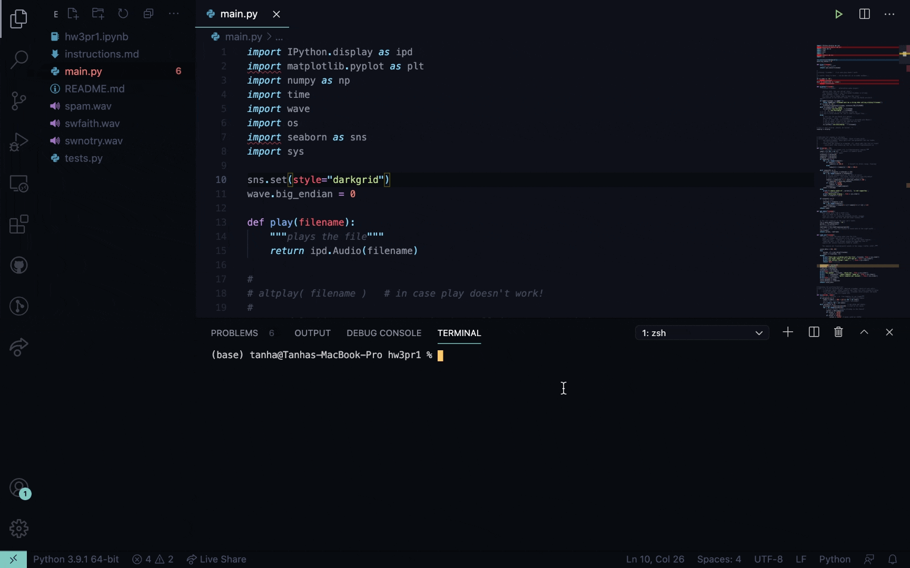
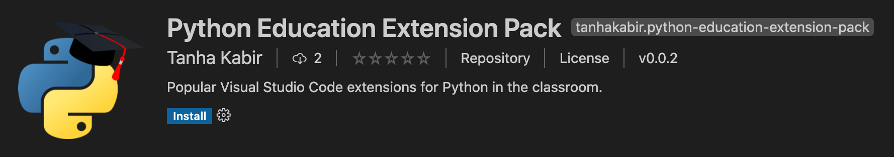
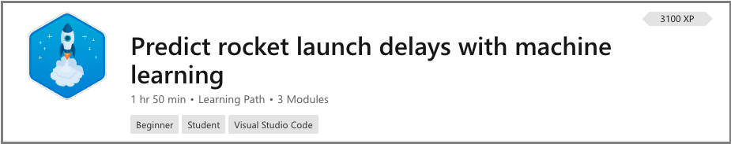
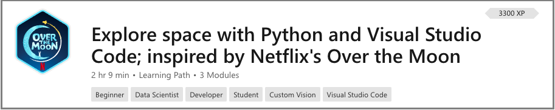
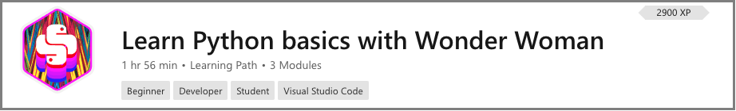
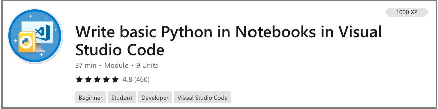
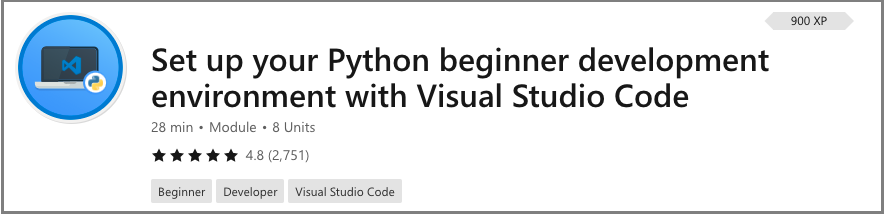

+++
title = "Python"
date = 2024-01-13T19:53:38+08:00
weight = 40
type = "docs"
description = ""
isCJKLanguage = true
draft = false
+++

> 原文: [https://code.visualstudio.com/learn/educators/python](https://code.visualstudio.com/learn/educators/python)

# Python in Visual Studio Code Visual Studio Code 中的 Python


Visual Studio Code is a free source code editor that fully supports Python and useful features such as real-time collaboration. It's highly customizable to support your classroom the way you like to teach.

​​​	Visual Studio Code 是一款免费的源代码编辑器，完全支持 Python 和实时协作等实用功能。它具有高度的可定制性，可以按照您喜欢的方式为您的课堂提供支持。

> "Visual Studio Code is the best balance of authenticity and accessibility... Visual Studio Code doesn't feel 'fake', it's what real software developers use. Plus, Visual Studio Code works on every OS!" - Professor Zachary Dodds from Harvey Mudd College
>
> ​​​	"Visual Studio Code 在真实性和可访问性之间取得了最佳平衡……Visual Studio Code 感觉不是“假的”，它是真正的软件开发人员使用的工具。此外，Visual Studio Code 适用于所有操作系统！”——哈维穆德学院的 Zachary Dodds 教授

Read below for recommendations for extensions, settings, and links to free lessons that you can use in your classes.

​​​	请阅读以下内容，了解您可以在课堂中使用的扩展、设置和免费课程链接的建议。

## [Intro to CS at Harvey Mudd College 哈维穆德学院计算机科学入门](https://code.visualstudio.com/learn/educators/python#_intro-to-cs-at-harvey-mudd-college)

Professor [Zachary Dodds](https://www.hmc.edu/about-hmc/hmc-experts/dodds-zachary/) is a Computer Science professor at [Harvey Mudd College](https://www.hmc.edu/) who teaches several introductory classes both for students new to Computer Science and students from a non-Computer Science background. He co-created the popular introduction to Computer Science class [CS5](https://www.cs.hmc.edu/twiki/bin/view/CS5), which attracts students from all backgrounds to develop programming and problem-solving skills and to build "a coherent, intellectually compelling picture of Computer Science". The class is taught with Python and uses VS Code as the recommended editor.

​​​	扎卡里·多兹教授是哈维穆德学院的计算机科学教授，他为计算机科学新手和非计算机科学背景的学生教授多门入门课程。他共同创建了广受欢迎的计算机科学入门课程 CS5，吸引了来自各个背景的学生来发展编程和解决问题的能力，并构建“连贯且在智力上引人入胜的计算机科学图景”。该课程使用 Python 授课，并使用 VS Code 作为推荐的编辑器。

### [Why Visual Studio Code? 为什么选择 Visual Studio Code？](https://code.visualstudio.com/learn/educators/python#_why-visual-studio-code)

Professor Dodds has been recommending and using Visual Studio Code in his classes since it debuted in 2015.

​​​	自 2015 年首次亮相以来，多兹教授一直在他的课程中推荐和使用 Visual Studio Code。

> "Visual Studio Code is the best balance of authenticity and accessibility... Visual Studio Code doesn't feel 'fake', it's what real software developers use. Plus, Visual Studio Code works on every OS!"
>
> ​​​	“Visual Studio Code 在真实性和可访问性之间取得了最佳平衡……Visual Studio Code 感觉不是‘假的’，它是真正的软件开发人员使用的工具。此外，Visual Studio Code 适用于所有操作系统！”

VS Code runs on Windows, macOS, Linux, and even [Chromebooks](https://code.visualstudio.com/blogs/2020/12/03/chromebook-get-started).

​​​	VS Code 可在 Windows、macOS、Linux 甚至 Chromebook 上运行。

### [Classroom settings 课堂设置](https://code.visualstudio.com/learn/educators/python#_classroom-settings)

Since VS Code is easy to customize, Professor Dodds is able to tailor the editor for his students, preferring to hide [IntelliSense](https://code.visualstudio.com/docs/editor/intellisense), or code completion suggestions, so they can learn from what they type and reinforce the conceptual models being built.

​​​	由于 VS Code 易于自定义，多兹教授能够为他的学生量身定制编辑器，他更喜欢隐藏 IntelliSense 或代码完成建议，以便他们能够从自己键入的内容中学习并强化正在构建的概念模型。

Here are the [settings](https://code.visualstudio.com/docs/getstarted/settings) his students use:

​​​	以下是他的学生使用的设置：

```
"editor.quickSuggestions": false,
"editor.acceptSuggestionOnCommitCharacter": false,
"editor.suggest.filterGraceful": true,
"editor.suggestOnTriggerCharacters": false,
"editor.acceptSuggestionOnEnter": "on",
"editor.suggest.showIcons": false,
"editor.suggest.maxVisibleSuggestions": 7,
"editor.hover.enabled": false,
"editor.hover.sticky": false,
"editor.suggest.snippetsPreventQuickSuggestions": false,
"editor.parameterHints.enabled": false,
"editor.wordBasedSuggestions": "matchingDocuments",
"editor.tabCompletion": "on",
"extensions.ignoreRecommendations": true,
"files.autoSave": "afterDelay",
```

You can find the most up-to-date settings on his course website: [CS5 - Python Tips](https://www.cs.hmc.edu/twiki/bin/view/CS5/PythonTips).

​​​	您可以在他的课程网站上找到最新的设置：CS5 - Python 提示。

### [Integrated Terminal 集成终端](https://code.visualstudio.com/learn/educators/python#_integrated-terminal)

Professor Dodds also utilizes the built-in terminal heavily in his class as an introduction to running programs from the command line and navigating around their machine all within Visual Studio Code. He appreciates how "the built-in terminal panel does not try to automate too much (which, if it did, would deprive newcomers of the experience of the information-flow that's going on)."

​​​	多兹教授还在他的课堂上大量使用内置终端，作为从命令行运行程序和在 Visual Studio Code 中导航其计算机的介绍。他赞赏“内置终端面板不会尝试自动化太多内容（如果这样做，会剥夺新手了解正在进行的信息流的体验）”。

In the video below, the student does all of their command line and coding work in one place, such as installing Python libraries, while working on Lab 3 from the CS5 class:

​​​	在下面的视频中，学生在同一个地方完成所有命令行和编码工作，例如安装 Python 库，同时处理 CS5 课程中的实验 3：



Thank you, Professor Dodds, for sharing your story! If you’re interested in using VS Code to teach Python in your classes, you can get started with the Python Education Extension Pack below!

​​​	多兹教授，感谢您分享您的故事！如果您有兴趣在课堂上使用 VS Code 来教授 Python，您可以从下面的 Python 教育扩展包开始！

## [Python Extension Pack Python 扩展包](https://code.visualstudio.com/learn/educators/python#_python-extension-pack)

Unsure which extensions to recommend to your students? You can point your students to the [Python Education Extension Pack](https://marketplace.visualstudio.com/items?itemName=tanhakabir.python-education-extension-pack) that contains essential and helpful extensions for the classroom. You can download the extension pack from the VS Code Marketplace:

​​​	不确定向您的学生推荐哪些扩展？您可以向您的学生推荐 Python 教育扩展包，其中包含课堂上必备且有用的扩展。您可以从 VS Code Marketplace 下载扩展包：



The extension pack contains:

​​​	扩展包包含：

- [Python](https://marketplace.visualstudio.com/items?itemName=ms-python.python) for basic Python functionality like compiling, debugging support, linting, Jupyter Notebooks, unit tests, and more.
  Python 提供了基本的 Python 功能，如编译、调试支持、linting、Jupyter Notebooks、单元测试等。
- [Live Share](https://marketplace.visualstudio.com/items?itemName=MS-vsliveshare.vsliveshare) to enable real-time collaboration.
  Live Share，用于启用实时协作。
- [Remote - SSH](https://marketplace.visualstudio.com/items?itemName=ms-vscode-remote.remote-ssh) to work on remote projects (for example, to access lab machines) through SSH with full VS Code functionality.
  Remote - SSH，用于通过 SSH 在远程项目上工作（例如，访问实验室机器），并具有完整的 VS Code 功能。
- [Markdown+Math](https://marketplace.visualstudio.com/items?itemName=goessner.mdmath) for full LaTeX support in Markdown.
  Markdown+Math 在 Markdown 中提供完整的 LaTeX 支持。
- [Python Test Explorer for Visual Studio Code](https://marketplace.visualstudio.com/items?itemName=LittleFoxTeam.vscode-python-test-adapter) to visualize and run Python tests in the side bar.
  Python Test Explorer for Visual Studio Code 可在侧边栏中可视化和运行 Python 测试。
- [Code Runner](https://marketplace.visualstudio.com/items?itemName=formulahendry.code-runner) to run snippets (selected code) and single files of any code with a single click.
  Code Runner，用于通过单击运行片段（选定代码）和任何代码的单个文件。

## [Free Python and Data Science lessons 免费的 Python 和数据科学课程](https://code.visualstudio.com/learn/educators/python#_free-python-and-data-science-lessons)

### [NASA-inspired lessons 受 NASA 启发的课程](https://code.visualstudio.com/learn/educators/python#_nasainspired-lessons)

This learning path enables students to use Python to explore doing analyses and projects inspired from real-world problems faced by National Aeronautics and Space Administration (NASA) scientists. View full details of the lessons under [NASA-inspired Lessons](https://code.visualstudio.com/learn/students/nasa-python).

​​​	此学习路径使学生能够使用 Python 来探索受美国国家航空航天局 (NASA) 科学家面临的现实世界问题启发的分析和项目。在受 NASA 启发的课程下查看课程的完整详细信息。



### [Learn Python with Over The Moon 通过 Over The Moon 学习 Python](https://code.visualstudio.com/learn/educators/python#_learn-python-with-over-the-moon)

These space-themed lessons were inspired by the Netflix film, [Over the Moon](https://www.youtube.com/watch?v=26DIABx44Tw), and will introduce students to data science, machine learning, and artificial intelligence using Python and Azure. View full details on [Learn Python with Over The Moon](https://code.visualstudio.com/learn/students/over-the-moon-python).

​​​	这些以太空为主题的课程灵感来自 Netflix 电影《飞奔去月球》，将使用 Python 和 Azure 向学生介绍数据科学、机器学习和人工智能。查看 Over The Moon 中学习 Python 的完整详细信息。



### [Wonder Woman-inspired lessons 神奇女侠启发的课程](https://code.visualstudio.com/learn/educators/python#_wonder-womaninspired-lessons)

Give an introduction to Python with "Wonder Woman 1984"-inspired lessons that help students learn about the basics like conditionals and variables. Get full lesson details under [Learn Python with Wonder Woman](https://code.visualstudio.com/learn/students/wonder-woman-python).

​​​	通过“神奇女侠 1984”启发的课程介绍 Python，帮助学生学习条件和变量等基础知识。在通过神奇女侠学习 Python 下获取完整的课程详细信息。



### [Python in Notebooks Python 在笔记本中](https://code.visualstudio.com/learn/educators/python#_python-in-notebooks)

Learn the basics of Python. View the full lesson at [Write basic Python in Notebooks in Visual Studio Code](https://learn.microsoft.com/training/modules/basic-python-nasa/).

​​​	了解 Python 的基础知识。在 Visual Studio Code 中的笔记本中编写基本 Python 查看完整课程。



### [Set up your Python beginner development environment 设置 Python 初学者开发环境](https://code.visualstudio.com/learn/educators/python#_set-up-your-python-beginner-development-environment)

A step-by-step guide to installing and setting up your Python and VS Code environment. View the full lesson at [Set up your Python beginner development environment with Visual Studio Code](https://learn.microsoft.com/training/modules/python-install-vscode/).

​​​	有关安装和设置 Python 和 VS Code 环境的分步指南。在 Visual Studio Code 中使用 Python 初学者开发环境设置查看完整课程。



