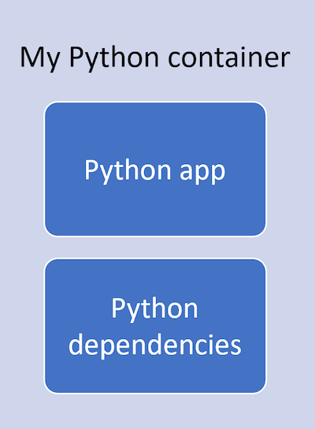
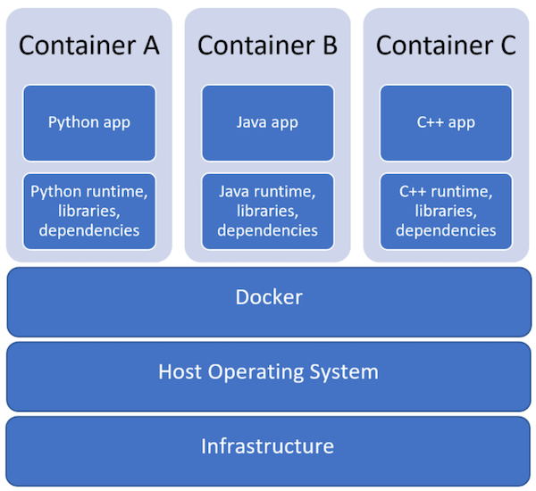

+++
title = "Develop in Containers"
date = 2024-01-13T19:53:38+08:00
weight = 10
type = "docs"
description = ""
isCJKLanguage = true
draft = false
+++

> 原文: [https://code.visualstudio.com/learn/develop-cloud/containers](https://code.visualstudio.com/learn/develop-cloud/containers)

# Develop with containers 使用容器进行开发

## [What are development containers? 什么是开发容器？](https://code.visualstudio.com/learn/develop-cloud/containers#_what-are-development-containers)

Containers are pieces of software that package code and all of the dependencies that code needs to run, including the runtime, tools, libraries, and settings. Development containers specifically let you code within this piece of software, providing a separate coding environment from your computer.

&zeroWidthSpace;容器是打包代码及其运行所需的所有依赖项的软件，包括运行时、工具、库和设置。开发容器专门允许您在此软件中编写代码，从而提供与计算机分开的编码环境。

A Python dev container would include your Python app along with all the Python runtimes and dependencies already set up for you, no extra downloads necessary:

&zeroWidthSpace;Python 开发容器将包含您的 Python 应用以及已为您设置的所有 Python 运行时和依赖项，无需额外下载：

In your class, you could have a specific container for an assignment. Each student in your class will get the same exact same version of dependencies, such as the same version of Python or a C++ compiler, regardless of their operating system or any other files already installed on their computer.

&zeroWidthSpace;在您的课堂中，您可以为作业指定一个特定的容器。您班上的每位学生都将获得完全相同的依赖项版本，例如相同版本的 Python 或 C++ 编译器，而不管他们的操作系统或计算机上已安装的任何其他文件。

In the diagram below, you'll see an example of three dev containers: one for Python, one for Java, and one for C++. Each of these dev containers would include the app and the dependencies that app needs to run. The dependencies are separate from the rest of your computer (which are represented by the Infrastructure and Host Operating System).

&zeroWidthSpace;在下面的图表中，您将看到三个开发容器的示例：一个用于 Python，一个用于 Java，一个用于 C++。这些开发容器中的每一个都将包含该应用程序及其运行所需的依赖项。这些依赖项与计算机的其余部分（由基础架构和主机操作系统表示）是分开的。

## [Get started with dev containers in VS Code 在 VS Code 中开始使用开发容器](https://code.visualstudio.com/learn/develop-cloud/containers#_get-started-with-dev-containers-in-vs-code)

### [Prerequisites 先决条件](https://code.visualstudio.com/learn/develop-cloud/containers#_prerequisites)

To get started with using dev containers in VS Code, you'll need to download the [Dev Containers](https://marketplace.visualstudio.com/items?itemName=ms-vscode-remote.remote-containers) extension from the VS Code Marketplace.

&zeroWidthSpace;要开始在 VS Code 中使用开发容器，您需要从 VS Code Marketplace 下载 Dev Containers 扩展。

You'll also need to download [Docker](https://docs.docker.com/docker-for-windows/install-windows-home/), which is the industry standard for building and sharing containers.

&zeroWidthSpace;您还需要下载 Docker，它是构建和共享容器的行业标准。

### [Sample dev containers 示例开发容器](https://code.visualstudio.com/learn/develop-cloud/containers#_sample-dev-containers)

Rather than creating dev containers from scratch, Dev Containers has several ways to help you [create dev containers](https://code.visualstudio.com/docs/devcontainers/create-dev-container) or access existing dev containers.

&zeroWidthSpace;Dev Containers 有多种方法可以帮助您创建开发容器或访问现有开发容器，而无需从头开始创建开发容器。

Below is a list of sample dev containers we'd recommend starting out with:

&zeroWidthSpace;以下是我们建议您开始使用的示例开发容器列表：

- [Try Out Development Containers: Python
  试用开发容器：Python](https://github.com/microsoft/vscode-remote-try-python)
- [Try Out Development Containers: Java
  试用开发容器：Java](https://github.com/microsoft/vscode-remote-try-java)
- [Try Out Development Containers: C++
  试用开发容器：C++](https://github.com/microsoft/vscode-remote-try-cpp)
- [Try Out Development Containers: Node.js
  试用开发容器：Node.js](https://github.com/microsoft/vscode-remote-try-node)
- [Try Out Development Containers: .NET
  试用开发容器：.NET](https://github.com/microsoft/vscode-remote-try-dotnetcore)
- [Try Out Development Containers: Go
  试用开发容器：Go](https://github.com/microsoft/vscode-remote-try-go)
- [Try Out Development Containers: PHP
  试用开发容器：PHP](https://github.com/microsoft/vscode-remote-try-php)
- [Try Out Development Containers: Rust
  试用开发容器：Rust](https://github.com/microsoft/vscode-remote-try-rust)

## [Learning resources 学习资源](https://code.visualstudio.com/learn/develop-cloud/containers#_learning-resources)

To learn how to get started with the Dev Containers extension, check out this 5-minute introductory video:

&zeroWidthSpace;要了解如何开始使用 Dev Containers 扩展，请观看此 5 分钟的介绍视频：

<iframe src="https://youtube.com/embed/Uvf2FVS1F8k?rel=0&amp;disablekb=0&amp;modestbranding=1&amp;showinfo=0" frameborder="0" allowfullscreen="" title="Development Containers: A Guide for Students" style="box-sizing: border-box; font-family: &quot;Segoe UI&quot;, &quot;Helvetica Neue&quot;, Helvetica, Arial, sans-serif; width: 616.662px; max-width: 100%; height: 400px; color: rgb(36, 36, 36); font-size: 16px; font-style: normal; font-variant-ligatures: normal; font-variant-caps: normal; font-weight: 400; letter-spacing: normal; orphans: 2; text-align: start; text-indent: 0px; text-transform: none; widows: 2; word-spacing: 0px; -webkit-text-stroke-width: 0px; white-space: normal; background-color: rgb(255, 255, 255); text-decoration-thickness: initial; text-decoration-style: initial; text-decoration-color: initial;"></iframe>

You can also read more in our [Development Containers in Education](https://code.visualstudio.com/blogs/2020/07/27/containers-edu) blog post.

&zeroWidthSpace;您还可以在我们的教育博客文章中了解更多信息：开发容器。

## [Next steps 后续步骤](https://code.visualstudio.com/learn/develop-cloud/containers#_next-steps)

We also highly recommend checking out the step-by-step [Containers tutorial](https://code.visualstudio.com/docs/devcontainers/tutorial).

&zeroWidthSpace;我们还强烈建议您查看分步容器教程。
