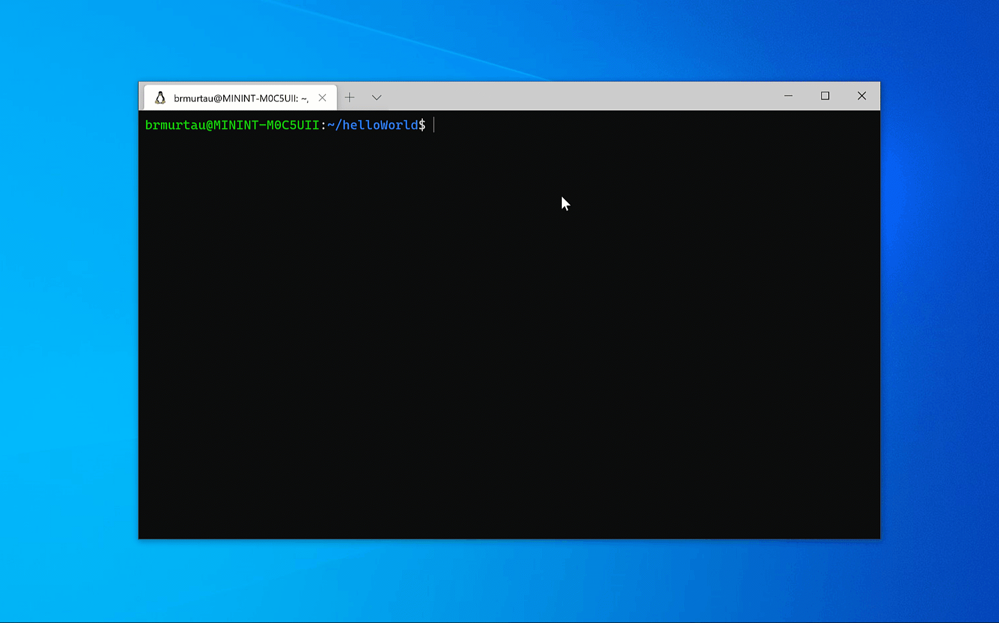

+++
title = "Use the Windows Subsystem for Linux"
date = 2024-01-13T19:53:38+08:00
weight = 30
type = "docs"
description = ""
isCJKLanguage = true
draft = false
+++

> 原文: [https://code.visualstudio.com/learn/develop-cloud/wsl](https://code.visualstudio.com/learn/develop-cloud/wsl)

# Use the Windows Subsystem for Linux (WSL) 使用适用于 Linux 的 Windows 子系统 (WSL)

## [What is WSL? WSL 是什么？]()

The [Windows Subsystem for Linux](https://learn.microsoft.com/windows/wsl/about) (WSL) lets you run a Linux environment, including command-line tools and applications, directly on Windows, without the overhead of a traditional virtual machine or dual boot setup.

​​​	Windows Subsystem for Linux (WSL) 允许您直接在 Windows 上运行 Linux 环境，包括命令行工具和应用程序，而无需传统虚拟机或双启动设置的开销。

WSL especially helps web developers and those working with Bash and Linux-first tools (for example, Ruby and Python) to use their tools on Windows and ensure consistency between development and production environments.

​​​	WSL 特别有助于 Web 开发人员和使用 Bash 和 Linux 优先工具（例如 Ruby 和 Python）的人员在 Windows 上使用他们的工具，并确保开发和生产环境之间的一致性。

## [Get started with WSL in VS Code 在 VS Code 中开始使用 WSL]()

To get started with using WSL in VS Code, you'll need to download the [WSL extension](https://marketplace.visualstudio.com/items?itemName=ms-vscode-remote.remote-wsl) from the Extension Marketplace.

​​​	要在 VS Code 中开始使用 WSL，您需要从扩展市场下载 WSL 扩展。

You'll also need WSL and a Linux distribution installed. We recommend using WSL 2, which is the newest version of WSL, as you will benefit from significant [performance advantages](https://learn.microsoft.com/windows/wsl/compare-versions) over WSL 1.

​​​	您还需要安装 WSL 和 Linux 发行版。我们建议使用 WSL 2，它是 WSL 的最新版本，因为您将受益于优于 WSL 1 的显着性能优势。

Check out the WSL extension in action:

​​​	查看 WSL 扩展的实际操作：

The typical flow is you'll open a Linux command prompt, navigate to a folder of your choosing, and type `code .` to launch a new instance of VS Code connected to WSL. From there, you get the full experience of using VS Code as if you were developing on Linux, except you're on a Windows machine!

​​​	典型流程是您将打开 Linux 命令提示符，导航到您选择的文件夹，然后键入 `code .` 以启动连接到 WSL 的新 VS Code 实例。从那里，您将获得使用 VS Code 的完整体验，就好像您在 Linux 上进行开发一样，除了您使用的是 Windows 机器！

<iframe src="https://youtube.com/embed/mIHprjsSO9o?rel=0&amp;disablekb=0&amp;modestbranding=1&amp;showinfo=0" frameborder="0" allowfullscreen="" title="Visual Studio Code WSL" style="box-sizing: border-box; font-family: &quot;Segoe UI&quot;, &quot;Helvetica Neue&quot;, Helvetica, Arial, sans-serif; width: 616.662px; max-width: 100%; height: 400px; color: rgb(36, 36, 36); font-size: 16px; font-style: normal; font-variant-ligatures: normal; font-variant-caps: normal; font-weight: 400; letter-spacing: normal; orphans: 2; text-align: start; text-indent: 0px; text-transform: none; widows: 2; word-spacing: 0px; -webkit-text-stroke-width: 0px; white-space: normal; background-color: rgb(255, 255, 255); text-decoration-thickness: initial; text-decoration-style: initial; text-decoration-color: initial;"></iframe>

## [Next steps 后续步骤]()

We highly recommend checking out the step-by-step [WSL tutorial]() to learn more.

​​​	我们强烈建议您查看分步 WSL 教程以了解更多信息。
