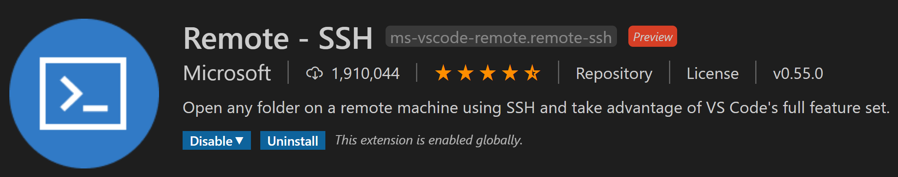

+++
title = "Working over SSH"
date = 2024-01-13T19:53:38+08:00
weight = 20
type = "docs"
description = ""
isCJKLanguage = true
draft = false
+++

> 原文: [https://code.visualstudio.com/learn/develop-cloud/ssh-lab-machines](https://code.visualstudio.com/learn/develop-cloud/ssh-lab-machines)

# VS Code Remote SSH VS Code 远程 SSH

## [What is SSH? SSH 是什么？](https://code.visualstudio.com/learn/develop-cloud/ssh-lab-machines#_what-is-ssh)

SSH, or the secure shell protocol, lets you access a remote computer or virtual machine securely over a network connection.

​​​	SSH（安全外壳协议）允许您通过网络连接安全地访问远程计算机或虚拟机。

You can connect over SSH into another machine from Visual Studio Code and interact with files and folders anywhere on that remote filesystem. If you have an app located on a different computer, you could use SSH to connect to it and access your app, view its files, and even modify, run, and debug it.

​​​	您可以从 Visual Studio Code 通过 SSH 连接到另一台计算机，并与该远程文件系统上的任何文件和文件夹进行交互。如果您有一个位于其他计算机上的应用，您可以使用 SSH 连接到该应用并访问您的应用、查看其文件，甚至修改、运行和调试它。

You can also take advantage of any tools or dependencies installed on that remote machine. You could connect to remote machines very different than your local machine. For instance, they could have a different operating system, different tools installed, or much stronger computing power.

​​​	您还可以利用该远程计算机上安装的任何工具或依赖项。您可以连接到与本地计算机非常不同的远程计算机。例如，它们可能具有不同的操作系统、安装不同的工具或更强大的计算能力。

In the classroom, you might SSH into lab machines to access computers with certain dependencies required for an assignment (like a specific version of Python or a C++ compiler), a different operating system than your own, or source code or automatic tests pre-loaded from your professor.

​​​	在课堂上，您可能会通过 SSH 登录到实验室计算机，以访问完成作业所需的某些依赖项（如特定版本的 Python 或 C++ 编译器）、与您自己的不同的操作系统，或预先从您的教授那里加载的源代码或自动测试。

## [Get started with SSH in VS Code 在 VS Code 中开始使用 SSH](https://code.visualstudio.com/learn/develop-cloud/ssh-lab-machines#_get-started-with-ssh-in-vs-code)

To get started with using SSH in VS Code, you'll need to download the [Remote - SSH extension](https://marketplace.visualstudio.com/items?itemName=ms-vscode-remote.remote-ssh) from the Extension Marketplace.

​​​	要开始在 VS Code 中使用 SSH，您需要从扩展市场下载 Remote - SSH 扩展。

Check out the following video to see an example of using Remote - SSH in action:

​​​	查看以下视频以了解使用 Remote - SSH 的示例：

<iframe src="https://youtube.com/embed/rh1Ag41J6IA?rel=0&amp;disablekb=0&amp;modestbranding=1&amp;showinfo=0" frameborder="0" allowfullscreen="" title="Visual Studio Code Remote - SSH" style="box-sizing: border-box; font-family: &quot;Segoe UI&quot;, &quot;Helvetica Neue&quot;, Helvetica, Arial, sans-serif; width: 616.662px; max-width: 100%; height: 400px; color: rgb(36, 36, 36); font-size: 16px; font-style: normal; font-variant-ligatures: normal; font-variant-caps: normal; font-weight: 400; letter-spacing: normal; orphans: 2; text-align: start; text-indent: 0px; text-transform: none; widows: 2; word-spacing: 0px; -webkit-text-stroke-width: 0px; white-space: normal; background-color: rgb(255, 255, 255); text-decoration-thickness: initial; text-decoration-style: initial; text-decoration-color: initial;"></iframe>

As demonstrated above, we can SSH into a more powerful virtual machine to greatly speed up the execution time of our programs.

​​​	如上所示，我们可以 SSH 到功能更强大的虚拟机，以极大地加快程序的执行时间。

## [Next steps 后续步骤](https://code.visualstudio.com/learn/develop-cloud/ssh-lab-machines#_next-steps)

We also highly recommend checking out the step-by-step [SSH tutorial](https://code.visualstudio.com/docs/remote/ssh-tutorial).

​​​	我们还强烈建议您查看分步 SSH 教程。
