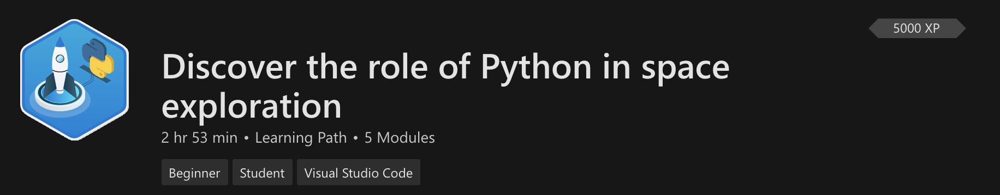
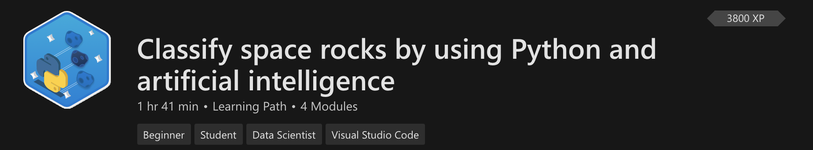
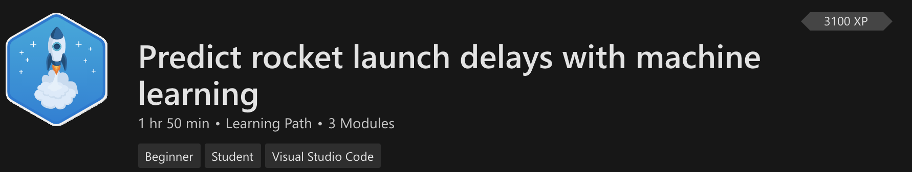

+++
title = "NASA Lessons"
date = 2024-01-13T19:53:38+08:00
weight = 1
type = "docs"
description = ""
isCJKLanguage = true
draft = false
+++

> 原文: [https://code.visualstudio.com/learn/students/nasa-python](https://code.visualstudio.com/learn/students/nasa-python)

# NASA Inspired Lessons NASA启发课程

This learning path introduces you to the world of Python. Explore modules and learning paths inspired by National Aeronautics and Space Administration (NASA) scientists to prepare you for a career in space exploration. Visit [Microsoft Learn training](https://learn.microsoft.com/training/topics/nasa) for the full list of modules.

​​​	此学习路径向您介绍 Python 世界。探索受美国国家航空航天局 (NASA) 科学家启发的模块和学习路径，为您的太空探索事业做好准备。访问 Microsoft Learn 培训以获取模块的完整列表。

Through these modules, you will:

​​​	通过这些模块，您将：

- Understand and install the tools needed to learn programming
  了解并安装学习编程所需的工具
- Learn core programming concepts and apply them to real-life NASA problems
  学习核心编程概念并将其应用于现实生活中的 NASA 问题
- Gain knowledge about cutting-edge technologies like machine learning and artificial intelligence
  获取有关机器学习和人工智能等前沿技术的知识
- See actual NASA employees talk about their job and give advice
  观看实际的 NASA 员工谈论他们的工作并提供建议

[Discover the role of Python in space exploration
发现 Python 在太空探索中的作用](https://learn.microsoft.com/training/paths/introduction-python-space-exploration-nasa/?WT.mc_id=python-0000-cxa)

Learn how Python and data science play a role in the innovative solutions that NASA creates.

​​​	了解 Python 和数据科学如何在 NASA 创建的创新解决方案中发挥作用。

[Use Artificial Intelligence to classify space rocks
使用人工智能对太空岩石进行分类](https://learn.microsoft.com/training/paths/classify-space-rocks-artificial-intelligence-nasa/?WT.mc_id=python-0000-cxa)

Create an AI model that can classify types of space rock present in a photo.

​​​	创建一个 AI 模型，该模型可以对照片中存在的太空岩石类型进行分类。

[Use Machine Learning to predict rocket launches
使用机器学习预测火箭发射](https://learn.microsoft.com/training/paths/machine-learning-predict-launch-delay-nasa/?WT.mc_id=python-0000-cxa)

This will introduce you to the world of machine learning and help you build a simple ML model.

​​​	这将向您介绍机器学习的世界，并帮助您构建一个简单的 ML 模型。

