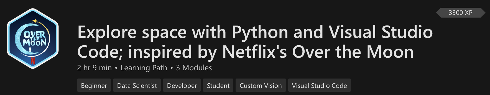

+++
title = "Over the Moon Lessons"
date = 2024-01-13T19:53:38+08:00
weight = 10
type = "docs"
description = ""
isCJKLanguage = true
draft = false
+++

> 原文: [https://code.visualstudio.com/learn/students/over-the-moon-python](https://code.visualstudio.com/learn/students/over-the-moon-python)

# Learn Python with Over The Moon 与 Over The Moon 一起学习 Python

[Over the Moon](https://www.youtube.com/watch?v=26DIABx44Tw) is a Netflix film about Fei Fei, a young girl who builds a rocket to go to the moon on a mission to prove the existence of a legendary Moon Goddess. These lessons were inspired by Fei Fei's story and the story of real NASA engineers and astronauts. Try out these space-travel themed challenges that will introduce you to data science, machine learning, and artificial intelligence with tools like Python, Visual Studio Code, and Azure.

​​​	《飞奔去月球》是一部 Netflix 电影，讲述了 Fei Fei 的故事，她是一位年轻的女孩，建造了一枚火箭飞往月球，以证明传说中的月球女神存在。这些课程的灵感来自 Fei Fei 的故事以及真正的 NASA 工程师和宇航员的故事。尝试这些以太空旅行为主题的挑战，它们将向你介绍数据科学、机器学习和人工智能，并使用 Python、Visual Studio Code 和 Azure 等工具。

Get a glimpse into the Python programming language with this introductory learning path that requires no prior background.

​​​	通过此入门学习路径了解 Python 编程语言，无需任何背景知识。

[Explore space with Python and Visual Studio Code
使用 Python 和 Visual Studio Code 探索太空](https://learn.microsoft.com/training/paths/explore-space-using-python/?WT.mc_id=python-0000-cxa)

Plan a moon mission, predict meteor showers, and use artificial intelligence to recognize objects in this learning path inspired by the Netflix film "Over the Moon".

​​​	规划月球任务、预测流星雨，并使用人工智能识别受 Netflix 电影《飞奔去月球》启发的此学习路径中的对象。

