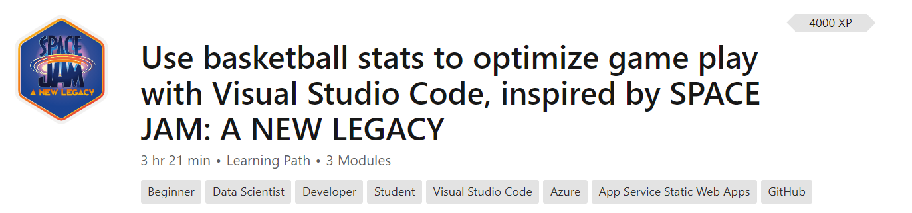

+++
title = "Space Jam Lessons"
date = 2024-01-13T19:53:38+08:00
weight = 30
type = "docs"
description = ""
isCJKLanguage = true
draft = false
+++

> 原文: [https://code.visualstudio.com/learn/students/spacejam-python](https://code.visualstudio.com/learn/students/spacejam-python)

# Learn Python with Space Jam 用太空大灌篮学习 Python

Inspired by the new film "Space Jam: A New Legacy," this learning path shows basketball fans how an understanding of data science and coding can support their passions, create opportunities, and even open doors to possible careers. Develop skills in Visual Studio Code, Azure, GitHub, JavaScript, and Python, to gain insights into how individual moments throughout a player's history can lead to a critical game decision in the finals.

&zeroWidthSpace;受新电影《空中大灌篮2：新传奇》的启发，此学习路径向篮球迷展示了对数据科学和编码的理解如何支持他们的热情、创造机会，甚至为可能的职业生涯打开大门。在 Visual Studio Code、Azure、GitHub、JavaScript 和 Python 中培养技能，以深入了解球员历史中的各个瞬间如何导致决赛中的关键比赛决策。

<iframe src="https://www.youtube-nocookie.com/embed/pXkIIzihEYM" frameborder="0" allow="accelerometer; autoplay; encrypted-media; gyroscope; picture-in-picture" allowfullscreen="" title="Learn to code with Space Jam" style="box-sizing: border-box; font-family: &quot;Segoe UI&quot;, &quot;Helvetica Neue&quot;, Helvetica, Arial, sans-serif; width: 616.662px; max-width: 100%; height: 400px; color: rgb(36, 36, 36); font-size: 16px; font-style: normal; font-variant-ligatures: normal; font-variant-caps: normal; font-weight: 400; letter-spacing: normal; orphans: 2; text-align: start; text-indent: 0px; text-transform: none; widows: 2; word-spacing: 0px; -webkit-text-stroke-width: 0px; white-space: normal; background-color: rgb(255, 255, 255); text-decoration-thickness: initial; text-decoration-style: initial; text-decoration-color: initial;"></iframe>

Get a glimpse into the Python programming language with this introductory learning path that requires no prior background.

&zeroWidthSpace;通过此入门学习路径了解 Python 编程语言，无需任何背景知识。

[Use basketball stats to optimize game play with Visual Studio Code
使用篮球统计数据通过 Visual Studio Code 优化比赛玩法](https://learn.microsoft.com/training/paths/optimize-basketball-games-with-machine-learning/?WT.mc_id=LearnDrG-c9-niner&WT.mc_id=SpaceJam_Learn_-all-cxa)

Analyze basketball stats and create an app in this learning path inspired by the film "Space Jam: A New Legacy."

&zeroWidthSpace;分析篮球统计数据并在受电影《空中大灌篮2：新传奇》启发的此学习路径中创建应用程序。

