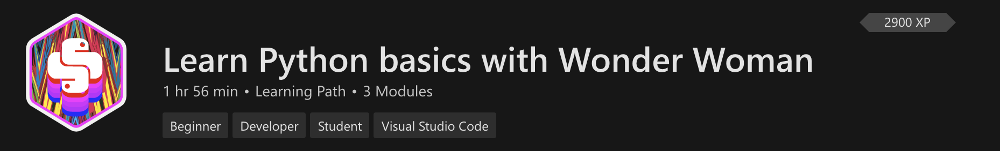

+++
title = "Wonder Woman Lessons"
date = 2024-01-13T19:53:38+08:00
weight = 20
type = "docs"
description = ""
isCJKLanguage = true
draft = false
+++

> 原文: [https://code.visualstudio.com/learn/students/wonder-woman-python](https://code.visualstudio.com/learn/students/wonder-woman-python)

# Learn Python with Wonder Woman 神奇女侠教你学 Python

Check out these WONDER WOMAN 1984 inspired lessons built to help you write your first lines of Python code. In the first module, learn how to crack a Caesar Cipher code that reveals a secret message with a location. In the second module, create a personality quiz to determine which character you're most like!

​​​	看看这些神奇女侠 1984 灵感课程，帮助您编写第一行 Python 代码。在第一个模块中，学习如何破解凯撒密码代码，该代码揭示了一个带有位置的秘密消息。在第二个模块中，创建一个性格测验来确定您最像哪个角色！

Get a glimpse into the Python programming language with this introductory learning path that requires no prior background.

​​​	通过此入门学习路径了解 Python 编程语言，无需任何背景知识。

[Learn Python with Wonder Woman
与神奇女侠一起学习 Python](https://learn.microsoft.com/training/paths/python-partnership/?WT.mc_id=python-0000-cxa)

Build a message decoder program and a personality quiz in these lessons inspired by the WONDER WOMAN 1984 film.

​​​	在这些受神奇女侠 1984 电影启发的课程中构建一个消息解码程序和一个性格测验。

For a video walkthrough of the first lesson, you can follow along with this:

​​​	有关第一课的视频演练，您可以按照以下步骤操作：

<iframe src="https://www.youtube-nocookie.com/embed/VH_mU42lQkQ" frameborder="0" allow="accelerometer; autoplay; encrypted-media; gyroscope; picture-in-picture" allowfullscreen="" title="Crack the code and reveal a secret with Python and Visual Studio Code" style="box-sizing: border-box; font-family: &quot;Segoe UI&quot;, &quot;Helvetica Neue&quot;, Helvetica, Arial, sans-serif; width: 616.662px; max-width: 100%; height: 400px;"></iframe>

