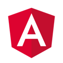

+++
title = "Angular Tutorial"
date = 2024-01-12T22:36:24+08:00
weight = 50
type = "docs"
description = ""
isCJKLanguage = true
draft = false
+++

> 原文: [https://code.visualstudio.com/docs/nodejs/angular-tutorial](https://code.visualstudio.com/docs/nodejs/angular-tutorial)

# Using Angular in Visual Studio Code 在 Visual Studio Code 中使用 Angular


[Angular](https://angular.io/) is a popular web development platform developed and maintained by Google. Angular uses [TypeScript]() as its main programming language. The Visual Studio Code editor supports TypeScript IntelliSense and code navigation out of the box, so you can do Angular development without installing any other extension.

​​	Angular 是一个由 Google 开发和维护的流行的 Web 开发平台。Angular 使用 TypeScript 作为其主要编程语言。Visual Studio Code 编辑器开箱即用地支持 TypeScript IntelliSense 和代码导航，因此您无需安装任何其他扩展即可进行 Angular 开发。


> **Note**: To help get you started with Angular development, you can use the [Angular profile template]() that includes useful extensions, settings, and code snippets.
>
> ​​	注意：为了帮助您开始 Angular 开发，您可以使用包含有用扩展、设置和代码段的 Angular 配置文件模板。

## [Welcome to Angular 欢迎使用 Angular]()

We'll be using the [Angular CLI](https://cli.angular.io/) for this tutorial. To install and use the command line interface as well as run the Angular application server, you'll need the [Node.js](https://nodejs.org/) JavaScript runtime and [npm](https://www.npmjs.com/) (the Node.js package manager) installed. npm is included with Node.js which you can install from [Node.js downloads](https://nodejs.org/en/download/).

​​	在本教程中，我们将使用 Angular CLI。要安装和使用命令行界面以及运行 Angular 应用程序服务器，您需要安装 Node.js JavaScript 运行时和 npm（Node.js 包管理器）。npm 包含在 Node.js 中，您可以从 Node.js 下载中安装 Node.js。

> **Tip**: To test that you have Node.js and npm correctly installed on your machine, you can type `node --version` and `npm --version`.
>
> ​​	提示：要测试您的计算机上是否正确安装了 Node.js 和 npm，您可以键入 `node --version` 和 `npm --version` 。

To install the Angular CLI, in a terminal or command prompt type:

​​	要在终端或命令提示符中安装 Angular CLI，请键入：

```
npm install -g @angular/cli
```

This may take a few minutes to install. You can now create a new Angular application by typing:

​​	安装可能需要几分钟。现在，您可以通过键入以下内容来创建一个新的 Angular 应用程序：

```
ng new my-app
```

`my-app` is the name of the folder for your application. The `ng new` command prompts you with options for the generated application. Accept the defaults by pressing the Enter key. This may take a few minutes to create the Angular application in [TypeScript]() and install its dependencies.

​​	 `my-app` 是应用程序的文件夹名称。 `ng new` 命令会提示您有关生成的应用程序的选项。按 Enter 键接受默认值。这可能需要几分钟才能用 TypeScript 创建 Angular 应用程序并安装其依赖项。

Let's quickly run our Angular application by navigating to the new folder and typing `ng serve` to start the web server and open the application in a browser:

​​	让我们快速运行 Angular 应用程序，方法是导航到新文件夹并键入 `ng serve` 以启动 Web 服务器并在浏览器中打开应用程序：

```
cd my-app
ng serve
```

You should see "Welcome to app!!" on [http://localhost:4200](http://localhost:4200/) in your browser. We'll leave the web server running while we look at the application with VS Code.

​​	您应该在浏览器中的 http://localhost:4200 上看到“欢迎使用应用程序！！”。在使用 VS Code 查看应用程序时，我们将让 Web 服务器保持运行状态。

To open your Angular application in VS Code, open another terminal (or command prompt) and navigate to the `my-app` folder and type `code .`:

​​	要在 VS Code 中打开 Angular 应用程序，请打开另一个终端（或命令提示符），导航到 `my-app` 文件夹并键入 `code .` ：

```
cd my-app
code .
```

### [Syntax highlighting and bracket matching 语法突出显示和括号匹配]()

Now expand the `src\app` folder and select the `app.component.ts` file. You'll notice that VS Code has syntax highlighting for the various source code elements and, if you put the cursor on a parenthesis, the matching bracket is also selected.

​​	现在展开 `src\app` 文件夹并选择 `app.component.ts` 文件。您会注意到 VS Code 为各种源代码元素提供了语法突出显示，如果您将光标放在括号上，也会选择匹配的括号。


### [IntelliSense]()

As you hover your mouse over text in the file, you'll see that VS Code gives you information about key items in your source code. Items such as variables, classes and Angular decorators are a few examples where you'll be presented with this information.

​​	将鼠标悬停在文件中的文本上时，您会看到 VS Code 会为您提供有关源代码中关键项的信息。变量、类和 Angular 装饰器等项是您将看到此信息的几个示例。


As you start typing in `app.component.ts`, you'll see smart suggestions and code snippets.

​​	在 `app.component.ts` 中开始键入时，您会看到智能建议和代码片段。


You can click the information button (`i`) to see a flyout with more documentation.

​​	您可以单击信息按钮 ( `i` ) 以查看包含更多文档的弹出窗口。


VS Code uses the TypeScript language service for code intelligence ([IntelliSense]()) and it has a feature called [Automatic Type Acquisition]() (ATA). ATA pulls down the npm Type Declaration files (`*.d.ts`) for the npm modules referenced in the `package.json`.

​​	VS Code 使用 TypeScript 语言服务进行代码智能（IntelliSense），并且它具有一个称为自动类型获取 (ATA) 的功能。ATA 会提取 `package.json` 中引用的 npm 模块的 npm 类型声明文件 ( `*.d.ts` )。

### [Go to Definition, Peek definition 转到定义、查看定义]()

Through the TypeScript language service, VS Code can also provide type definition information in the editor through **Go to Definition** (F12) or **Peek Definition** (Alt+F12). Open the `app.module.ts` file and put the cursor over `AppComponent` in the `bootstrap` property declaration, right click and select **Peek Definition**. A [Peek window]() will open showing the `AppComponent` definition from `app.component.ts`.

​​	通过 TypeScript 语言服务，VS Code 还可以在编辑器中通过转到定义 (F12) 或查看定义 (Alt+F12) 提供类型定义信息。打开 `app.module.ts` 文件，并将光标放在 `bootstrap` 属性声明中的 `AppComponent` 上，右键单击并选择查看定义。将打开一个查看窗口，显示来自 `app.component.ts` 的 `AppComponent` 定义。


Press Escape to close the Peek window.

​​	按 Escape 关闭查看窗口。

## [Hello World]()

Let's update the sample application to "Hello World". Go back to the `app.component.ts` file and change the `title` string in `AppComponent` to "Hello World".

​​	让我们将示例应用程序更新为“Hello World”。返回 `app.component.ts` 文件，并将 `AppComponent` 中的 `title` 字符串更改为“Hello World”。

```
import { Component } from '@angular/core';

@Component({
  selector: 'app-root',
  templateUrl: './app.component.html',
  styleUrls: ['./app.component.css']
})
export class AppComponent {
  title = 'Hello World';
}
```

Once you save the `app.component.ts` file, the running instance of the server will update the web page and you'll see "Welcome to Hello World!!".

​​	保存 `app.component.ts` 文件后，服务器的正在运行的实例将更新网页，您将看到“欢迎来到 Hello World!!”。

> **Tip**: VS Code supports Auto Save, which by default saves your files after a delay. Check the **Auto Save** option in the **File** menu to turn on Auto Save or directly configure the `files.autoSave` user [setting]().
>
> ​​	提示：VS Code 支持自动保存，默认情况下会在延迟后保存您的文件。选中“文件”菜单中的“自动保存”选项以启用自动保存，或直接配置 `files.autoSave` 用户设置。


## [Debugging Angular 调试 Angular]()

To debug the client side Angular code, we'll use the built-in JavaScript debugger.

​​	要调试客户端 Angular 代码，我们将使用内置的 JavaScript 调试器。

> Note: This tutorial assumes you have the Edge browser installed. If you want to debug using Chrome, replace the launch `type` with `chrome`. There is also a debugger for the [Firefox](https://marketplace.visualstudio.com/items?itemName=hbenl.vscode-firefox-debug) browser.
>
> ​​	注意：本教程假定您已安装 Edge 浏览器。如果您想使用 Chrome 进行调试，请将启动 `type` 替换为 `chrome` 。Firefox 浏览器也有一个调试器。

### [Set a breakpoint 设置断点]()

To set a breakpoint in `app.component.ts`, click on the gutter to the left of the line numbers. This will set a breakpoint which will be visible as a red circle.

​​	要在 `app.component.ts` 中设置断点，请单击行号左侧的标尺。这将设置一个断点，该断点将显示为一个红圈。


### [Configure the debugger 配置调试器]()

We need to initially configure the [debugger](). To do so, go to the **Run and Debug** view (Ctrl+Shift+D) and select the **create a launch.json file** link to create a `launch.json` debugger configuration file. Choose **Web App (Edge)** from the **Select debugger** dropdown list. This will create a `launch.json` file in a new `.vscode` folder in your project which includes a configuration to launch the website.

​​	我们需要先配置调试器。为此，请转到“运行和调试”视图（Ctrl+Shift+D），然后选择“创建 launch.json 文件”链接以创建一个 `launch.json` 调试器配置文件。从“选择调试器”下拉列表中选择“Web App（Edge）”。这将在项目中的新 `.vscode` 文件夹中创建一个 `launch.json` 文件，其中包含用于启动网站的配置。

We need to make one change for our example: change the port of the `url` from `8080` to `4200`. Your `launch.json` should look like this:

​​	我们需要为示例进行一项更改：将 `url` 的端口从 `8080` 更改为 `4200` 。您的 `launch.json` 应如下所示：

```
{
  "version": "0.2.0",
  "configurations": [
    {
      "type": "msedge",
      "request": "launch",
      "name": "Launch Edge against localhost",
      "url": "http://localhost:4200",
      "webRoot": "${workspaceFolder}"
    }
  ]
}
```

Press F5 or the green arrow to launch the debugger and open a new browser instance. The source code where the breakpoint is set runs on startup before the debugger was attached so we won't hit the breakpoint until we refresh the web page. Refresh the page and you should hit your breakpoint.

​​	按 F5 或绿色箭头启动调试器并打开新的浏览器实例。设置断点的源代码在调试器附加之前在启动时运行，因此在刷新网页之前，我们不会命中断点。刷新页面，您应该会命中断点。


You can step through your source code (F10), inspect variables such as `AppComponent`, and see the call stack of the client side Angular application.

​​	您可以逐步浏览源代码（F10），检查变量（例如 `AppComponent` ），并查看客户端 Angular 应用程序的调用堆栈。


For more information about the debugger and its available options, check out our documentation on [browser debugging]().

​​	有关调试器及其可用选项的更多信息，请查看我们关于浏览器调试的文档。

## [Angular profile template Angular 配置文件模板]()

[Profiles]() let you quickly switch your extensions, settings, and UI layout depending on your current project or task. To help you get started with Angular development, you can use the [Angular profile template](), which is a curated profile with useful extensions and settings. You can use the profile template as is or use it as a starting point to customize further for you own workflows.

​​	配置文件可让您根据当前项目或任务快速切换扩展、设置和 UI 布局。为了帮助您开始 Angular 开发，您可以使用 Angular 配置文件模板，这是一个经过策划的配置文件，其中包含有用的扩展和设置。您可以按原样使用配置文件模板，或将其用作起点，以便进一步自定义以适应您自己的工作流。

You select a profile template through the **Profiles** > **Create Profile...** dropdown:

​​	您可以通过“配置文件”>“创建配置文件...”下拉列表选择配置文件模板：


Once you select a profile template, you can review the settings and extensions, and remove individual items if you don't want to include them in your new profile. After creating the new profile based on the template, changes made to settings, extensions, or UI are persisted in your profile.

​​	选择配置文件模板后，您可以查看设置和扩展，并删除不想包含在新配置文件中的各个项目。根据模板创建新配置文件后，对设置、扩展或 UI 所做的更改将保留在您的配置文件中。

## [Popular Starter Kits 流行入门工具包]()

In this tutorial, we used the Angular CLI to create a simple Angular application. There are lots of great samples and starter kits available to help build your first Angular application.

​​	在本教程中，我们使用 Angular CLI 创建了一个简单的 Angular 应用程序。有很多很棒的示例和入门工具包可帮助您构建第一个 Angular 应用程序。

### [Recipes 配方]()

The VS Code team has created [recipes](https://github.com/microsoft/vscode-recipes) for more complex debugging scenarios. There you'll find the [Debugging with Angular CLI](https://github.com/microsoft/vscode-recipes/tree/main/Angular-CLI) recipe which also uses the Angular CLI and goes into detail on debugging the generated project's unit tests.

​​	VS Code 团队已为更复杂的调试方案创建了配方。您将在其中找到“使用 Angular CLI 进行调试”配方，该配方也使用 Angular CLI，并详细介绍了如何调试生成的项目的单元测试。

### [MEAN Starter MEAN 入门]()

If you'd like to see a full MEAN (MongoDB, Express, Angular, Node.js) stack example, look at [MEAN.JS](https://meanjs.org/). They have documentation and an application generator for a sample MEAN project. You'll need to install and start [MongoDB](https://docs.mongodb.com/v3.0/installation/), but you'll quickly have a MEAN application running. VS Code also has great [MongoDB support]() through the [Azure Databases](https://marketplace.visualstudio.com/items?itemName=ms-azuretools.vscode-cosmosdb) extension.

​​	如果您想查看完整的 MEAN（MongoDB、Express、Angular、Node.js）堆栈示例，请查看 MEAN.JS。他们有文档和一个应用程序生成器，可用于示例 MEAN 项目。您需要安装并启动 MongoDB，但您很快就会运行一个 MEAN 应用程序。VS Code 还通过 Azure 数据库扩展提供了出色的 MongoDB 支持。

### [React]()

[React](https://reactjs.org/) is a library for building user interfaces and it is more minimal than angular. If you'd like to see an example of React working with VS Code, check out the [Using React in VS Code]() tutorial. It will walk you through creating an React application and configuring the `launch.json` file for the JavaScript debugger.

​​	React 是一个用于构建用户界面的库，它比 Angular 更精简。如果您想看一个 React 与 VS Code 配合使用的示例，请查看在 VS Code 中使用 React 教程。它将指导您创建 React 应用程序并为 JavaScript 调试器配置 `launch.json` 文件。

## [Angular Extensions Angular 扩展]()

In addition to the features VS Code provides out of the box, you can install VS Code extensions for greater functionality.

​​	除了 VS Code 开箱即用的功能外，您还可以安装 VS Code 扩展以获得更强大的功能。


Angular Language Service
Angular 语言服务

6.1M
610 万

Angular



Angular Snippets (Version 16)
Angular 代码段（版本 16）

4.2M
420 万

johnpapa


Angular 10 Snippets - TypeScript, Html, Angular Material, ngRx, RxJS & Flex Layout
Angular 10 代码段 - TypeScript、Html、Angular Material、ngRx、RxJS 和 Flex 布局

2.4M

Mikael


Angular Essentials (Version 16)
Angular Essentials（版本 16）

1.2M

johnpapa

Click on an extension tile above to read the description and reviews on the [Marketplace](https://marketplace.visualstudio.com/).

​​	点击上面的扩展磁贴以阅读 Marketplace 上的描述和评论。

To find other Angular extensions, open the Extensions view (Ctrl+Shift+X) and type 'angular' to see a filtered list of Angular extensions.

​​	要查找其他 Angular 扩展，请打开扩展视图（Ctrl+Shift+X）并键入“angular”以查看经过筛选的 Angular 扩展列表。


The community has also created "Extension Packs" which bundle useful extensions together (for example, a linter, debugger, and snippets) into a single download. To see available Angular extension packs, add the "extension packs" category to your filter (angular @category:"extension packs").

​​	社区还创建了“扩展包”，将有用的扩展（例如，linter、调试器和代码段）捆绑到一个下载中。要查看可用的 Angular 扩展包，请将“扩展包”类别添加到您的筛选器（angular @category：“扩展包”）。
