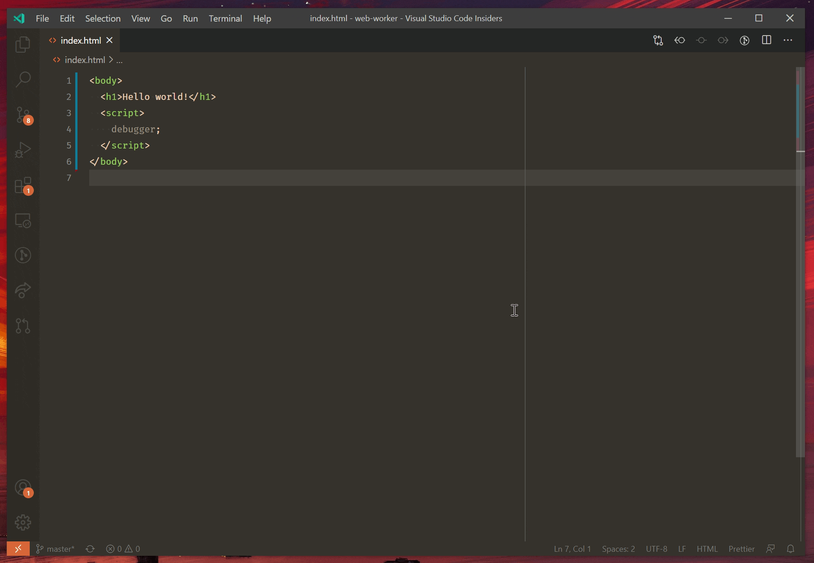

+++
title = "Browser Debugging"
date = 2024-01-12T22:36:24+08:00
weight = 40
type = "docs"
description = ""
isCJKLanguage = true
draft = false
+++

> 原文: [https://code.visualstudio.com/docs/nodejs/browser-debugging](https://code.visualstudio.com/docs/nodejs/browser-debugging)

# Browser debugging in VS Code 在 VS Code 中进行浏览器调试


Visual Studio Code includes a built-in debugger for Edge and Chrome. There are a couple ways to get started with it.

​​	Visual Studio Code 包含适用于 Edge 和 Chrome 的内置调试器。有几种方法可以开始使用它。

- Use the [Open Link]() command to debug a URL.
  使用“打开链接”命令调试 URL。
- Clicking a link in the [JavaScript debug terminal]().
  单击 JavaScript 调试终端中的链接。
- Use a [launch config]() to launch a browser with your app.
  使用启动配置启动带有您应用的浏览器。

We also have more detailed walkthroughs to get started with [React](), [Angular](), and [Vue](), as well as other debugging [recipes]().

​​	我们还提供了更详细的演练，帮助您开始使用 React、Angular 和 Vue，以及其他调试方法。

## [Open Link command 打开链接命令]()

The simplest way to debug a webpage is through the **Debug: Open Link** command found in the Command Palette (Ctrl+Shift+P). When you run this command, you'll be prompted for a URL to open, and the debugger will be attached.

​​	调试网页的最简单方法是通过“命令面板”（Ctrl+Shift+P）中的“调试：打开链接”命令。运行此命令时，系统会提示您输入要打开的 URL，然后附加调试器。



If your default browser is Edge, VS Code will use it to open the page. Otherwise, it will try to find an installation of Chrome on your system instead.

​​	如果您的默认浏览器是 Edge，VS Code 将使用它来打开页面。否则，它将尝试在您的系统上查找 Chrome 安装。

## [Launch configuration 启动配置]()

Launch configs are the traditional way to set up debugging in VS Code, and provide you the most flexibility for running complex applications.

​​	启动配置是设置 VS Code 中调试的传统方法，并为您提供了运行复杂应用程序的最大灵活性。

In this section, we'll go into more detail about configurations and features for more advanced debugging scenarios. Instructions for Node.js [stepping over external code]() also apply to browser-based debugging.

​​	在本部分中，我们将详细介绍更高级调试方案的配置和功能。有关 Node.js 跨过外部代码的说明也适用于基于浏览器的调试。

> **Note**: If you are just getting started with VS Code, you can learn about general debugging features and creating `launch.json` configuration files in the [Debugging]() topic.
>
> ​​	注意：如果您刚开始使用 VS Code，您可以在调试主题中了解常规调试功能和创建 `launch.json` 配置文件。

### [Launching browsers 启动浏览器]()

In most cases, you'll want to start a new instance of the browser to debug your webpage or file. To do this, you can create a file named `.vscode/launch.json` that looks like this:

​​	在大多数情况下，您需要启动浏览器的某个新实例来调试您的网页或文件。为此，您可以创建一个名为 `.vscode/launch.json` 的文件，如下所示：

```
{
  "version": "0.2.0",
  "configurations": [
    {
      "type": "msedge",
      "request": "launch",
      "name": "Launch my cool app",
      "url": "http://localhost:8000"
    }
  ]
}
```

When you hit F5 or the **Start** button in the **Run and Debug** view, `http://localhost:8000` will be opened in debug mode. If you'd like to use Chrome instead of Edge, replace `msedge` with `chrome`.

​​	当您在“运行和调试”视图中按 F5 或“开始”按钮时， `http://localhost:8000` 将在调试模式下打开。如果您想使用 Chrome 而非 Edge，请用 `chrome` 替换 `msedge` 。

You can also debug a single file without running a server, for example:

​​	您还可以调试单个文件，而无需运行服务器，例如：

```
{
  "version": "0.2.0",
  "configurations": [
    {
      "type": "msedge",
      "request": "launch",
      "name": "Launch hello.html",
      "file": "${workspaceFolder}/hello.html"
    }
  ]
}
```

### [Attaching to browsers 附加到浏览器]()

To attach to a running browser, it needs to be launched in a special debug mode. You can do this using the following command, replacing `edge.exe` with the path to your Edge or Chrome binary:

​​	要附加到正在运行的浏览器，需要在特殊调试模式下启动该浏览器。您可以使用以下命令执行此操作，用 Edge 或 Chrome 二进制文件的路径替换 `edge.exe` ：

```
edge.exe --remote-debugging-port=9222 --user-data-dir=remote-debug-profile
```

Setting the `--remote-debugging-port` tells the browser to listen on that port for a debug connection. Setting a separate `--user-data-dir` forces a new instance of the browser to be opened; if this flag isn't given, then the command will open a new window of any running browser and not enter debug mode.

​​	设置 `--remote-debugging-port` 会指示浏览器在该端口上侦听调试连接。设置单独的 `--user-data-dir` 会强制打开浏览器的某个新实例；如果未给出此标志，则该命令会打开正在运行的任何浏览器的某个新窗口，而不会进入调试模式。

Next, add a new section to the `vscode/launch.json` file as below:

​​	接下来，向 `vscode/launch.json` 文件添加一个新部分，如下所示：

```
{
  "version": "0.2.0",
  "configurations": [
    {
      "type": "msedge",
      "request": "attach",
      "name": "Attach to browser",
      "port": 9222
    }
  ]
}
```

Now, you can press F5 or the **Start** button in the **Run and Debug** view to attach to the running browser. You can even add a `host` property to debug a browser running on a different machine.

​​	现在，您可以按 F5 或“运行和调试”视图中的“开始”按钮，以附加到正在运行的浏览器。您甚至可以添加 `host` 属性来调试在其他计算机上运行的浏览器。

### [Launch configuration attributes 启动配置属性]()

Debugging configurations are stored in a `launch.json` file located in your workspace's `.vscode` folder. An introduction into the creation and use of debugging configuration files is in the general [Debugging]() article. You can either "launch" a browser with your application, or "attach" to an existing browser that you [started in debug mode]().

​​	调试配置存储在工作区 `.vscode` 文件夹中的 `launch.json` 文件中。有关创建和使用调试配置文件的介绍，请参阅常规调试文章。您可以使用您的应用程序“启动”浏览器，或“附加”到您在调试模式下启动的现有浏览器。

Below is a reference of common `launch.json` attributes specific to browser debugging. You can view the complete set of options in the [vscode-js-debug options](https://github.com/microsoft/vscode-js-debug/blob/main/OPTIONS.md) documentation.

​​	下面是特定于浏览器调试的常见 `launch.json` 属性的参考。您可以在 vscode-js-debug 选项文档中查看完整选项集。

- `webRoot` - The root directory for your source code. Most often, and by default, the `webRoot` is your workspace folder. This option is used for sourcemap resolution.
  `webRoot` - 源代码的根目录。通常，默认情况下， `webRoot` 是您的工作区文件夹。此选项用于源映射解析。
- `outFiles` - An array of [glob patterns](https://code.visualstudio.com/docs/editor/glob-patterns) for locating generated JavaScript files. See the section on [Source maps]().
  `outFiles` - 用于查找生成的 JavaScript 文件的 glob 模式数组。请参阅源映射部分。
- `smartStep`- Try to automatically step over source code that doesn't map to source files. See the section on [Smart stepping]().
  `smartStep` - 尝试自动跨过未映射到源文件的源代码。请参阅智能步进部分。
- `skipFiles` - Automatically skip files covered by these [glob patterns](https://code.visualstudio.com/docs/editor/glob-patterns). See the section on [Skipping uninteresting code]().
  `skipFiles` - 自动跳过这些 glob 模式所涵盖的文件。请参阅跳过不感兴趣的代码部分。
- `trace` - Enable diagnostic output.
  `trace` - 启用诊断输出。

These attributes are only available for launch configurations of request type `launch`:

​​	这些属性仅适用于请求类型为 `launch` 的启动配置：

- `url` - The URL to automatically open when the browser is launched.
  `url` - 浏览器启动时自动打开的 URL。
- `runtimeExecutable` - Either an absolute path to the browser executable to use, or the version of the browser to use. Valid versions include `stable` (default), `canary`, `beta`, and `dev`.
  `runtimeExecutable` - 要使用的浏览器可执行文件的绝对路径，或要使用的浏览器版本。有效版本包括 `stable` （默认值）、 `canary` 、 `beta` 和 `dev` 。
- `runtimeArgs` - Optional arguments passed when launching the browser.
  `runtimeArgs` - 启动浏览器时传递的可选参数。

These attributes are only available for launch configurations of request type `attach`:

​​	这些属性仅适用于请求类型为 `attach` 的启动配置：

- `url` - If given, VS Code will attach to a tab with this URL. If not provided, it will attach to all browser tabs.
  `url` - 如果给出，VS Code 将附加到具有此 URL 的选项卡。如果未提供，它将附加到所有浏览器选项卡。
- `port` - Debug port to use. See the section on [Attaching to Node.js]().
  `port` - 要使用的调试端口。请参阅附加到 Node.js 部分。
- `address` - TCP/IP address of the debug port. See the section on [Attaching to Browsers]().
  `address` - 调试端口的 TCP/IP 地址。请参阅附加到浏览器部分。

## [WebAssembly Debugging WebAssembly 调试]()

WebAssembly debugging in browsers is identical to Node.js, [read more about WebAssembly Debugging here]().

​​	浏览器中的 WebAssembly 调试与 Node.js 相同，在此处详细了解 WebAssembly 调试。

## [Source Maps 源映射]()

The JavaScript debugger in VS Code supports source maps that allow debugging transformed code. For example, TypeScript code is compiled to JavaScript, and many web applications bundle all their JavaScript files together. The source map helps the debugger figure out how to map between your original code, and the code running in the browser.

​​	VS Code 中的 JavaScript 调试器支持源映射，允许调试转换后的代码。例如，TypeScript 代码被编译为 JavaScript，许多 Web 应用程序会将所有 JavaScript 文件捆绑在一起。源映射有助于调试器弄清楚如何将原始代码与在浏览器中运行的代码进行映射。

Most modern tools used for building web applications will work out of the box. If not, our section on [sourcemaps in Node.js]() contains guidance that applies to browser debugging as well.

​​	用于构建 Web 应用程序的大多数现代工具都会开箱即用。如果不是，我们关于 Node.js 中源映射的部分包含也适用于浏览器调试的指南。

### [Loading Source Maps 加载源映射]()

Each JavaScript file may reference a source map, by a URL or relative path. When dealing with web applications, you'll want to make sure that the URL is something the debugger running in VS Code can access. If it can't, you'll see errors in the **Debug Console** explaining which source maps failed to load, and why.

​​	每个 JavaScript 文件都可以通过 URL 或相对路径引用源映射。在处理 Web 应用程序时，您需要确保 URL 是 VS Code 中运行的调试器可以访问的。如果不能，您将在调试控制台中看到错误，说明哪些源映射加载失败以及原因。

If it can't access it directly, VS Code will try to use the browser's network stack to request the source map. This provides an opportunity for any authentication state or network settings in the browser to be applied to the request. For example, if your source maps are in a location guarded by cookie authentication, VS Code can load them if and only if the browser session has the necessary cookies.

​​	如果无法直接访问，VS Code 将尝试使用浏览器的网络堆栈来请求源映射。这为浏览器中的任何身份验证状态或网络设置提供了应用于请求的机会。例如，如果源映射位于受 Cookie 身份验证保护的位置，则当且仅当浏览器会话具有必要的 Cookie 时，VS Code 才能加载它们。

## [Next steps 后续步骤]()

- [Debugging]() - Read about general VS Code debugging features.
  调试 - 阅读有关常规 VS Code 调试功能的信息。
- [Debugging Recipes]() - Set up debugging for your favorite platform.
  调试食谱 - 为您喜欢的平台设置调试。
