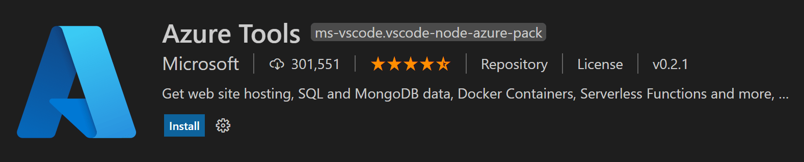

+++
title = "Deploy Node.js Apps"
date = 2024-01-12T22:36:24+08:00
weight = 30
type = "docs"
description = ""
isCJKLanguage = true
draft = false
+++

> 原文: [https://code.visualstudio.com/docs/nodejs/nodejs-deployment](https://code.visualstudio.com/docs/nodejs/nodejs-deployment)

# Deploy Node.js Web Apps 部署 Node.js Web 应用

The [Azure Tools](https://marketplace.visualstudio.com/items?itemName=ms-vscode.vscode-node-azure-pack) extensions for Visual Studio Code make it easy to deploy Node.js applications.

​​	Visual Studio Code 的 Azure 工具扩展使部署 Node.js 应用程序变得容易。

## [Deployment tutorials 部署教程](https://code.visualstudio.com/docs/nodejs/nodejs-deployment#_deployment-tutorials)

These tutorials from Microsoft Learn describe different ways of creating and deploying Node.js apps to Azure via Visual Studio Code:

​​	Microsoft Learn 的这些教程介绍了通过 Visual Studio Code 将 Node.js 应用创建和部署到 Azure 的不同方法：

| Tutorial 教程                                                | Description 说明                                             | Related Tools 相关工具                                       |
| :----------------------------------------------------------- | :----------------------------------------------------------- | :----------------------------------------------------------- |
| [Deploy Azure Functions 部署 Azure Functions](https://learn.microsoft.com/azure/developer/javascript/tutorial/azure-function-cosmos-db-mongo-api) | Build and manage Azure Functions serverless apps 直接在 VS Code 中构建和管理 Azure Functions 无服务器应用 directly in VS Code Azure 资源 | [Azure Resources Azure Functions](https://marketplace.visualstudio.com/items?itemName=ms-azuretools.vscode-azureresourcegroups) [Azure Functions Azure 数据库](https://marketplace.visualstudio.com/items?itemName=ms-azuretools.vscode-azurefunctions) [Azure Databases](https://marketplace.visualstudio.com/items?itemName=ms-azuretools.vscode-cosmosdb) |
| [Deploy using Azure Portal 通过 Azure 门户 and Azure App Service 和 Azure 应用服务](https://learn.microsoft.com/azure/app-service/tutorial-nodejs-mongodb-app) | Manage Azure resources directly in VS Code 进行部署直接在 VS Code with Azure App Service 中使用 Azure 应用服务 | [MongoDB 管理 Azure 资源MongoDB](https://www.mongodb.com/docs/manual/installation/) [Azure Portal Azure 门户](https://portal.azure.com/) |
| [Deploy using Docker 使用 Docker 进行部署](https://learn.microsoft.com/azure/developer/javascript/tutorial/tutorial-vscode-docker-node/tutorial-vscode-docker-node-01) | Deploy your website using a Docker container 使用 Docker 容器 | [Docker 部署网站Docker](https://marketplace.visualstudio.com/items?itemName=ms-azuretools.vscode-docker) [Azure CLI](https://learn.microsoft.com/cli/azure/install-azure-cli) [Azure App Service Azure 应用服务](https://marketplace.visualstudio.com/items?itemName=ms-azuretools.vscode-azureappservice) [Azure Resources Azure 资源](https://marketplace.visualstudio.com/items?itemName=ms-azuretools.vscode-azureresourcegroups) |
