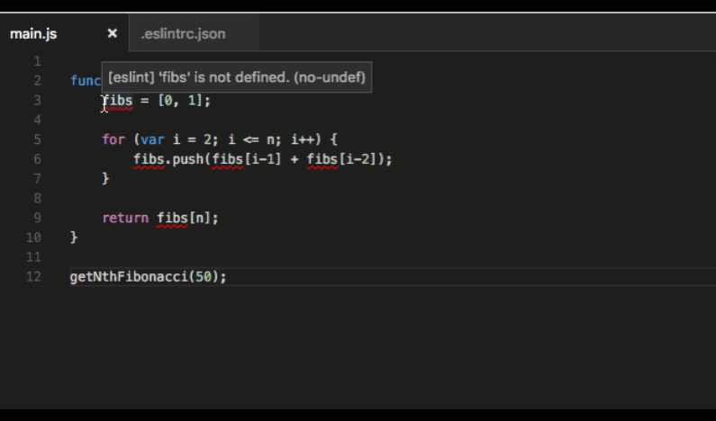

+++
title = "Extensions"
date = 2024-01-12T22:36:24+08:00
weight = 100
type = "docs"
description = ""
isCJKLanguage = true
draft = false
+++

> 原文: [https://code.visualstudio.com/docs/nodejs/extensions](https://code.visualstudio.com/docs/nodejs/extensions)

# JavaScript extensions for VS Code 适用于 VS Code 的 JavaScript 扩展

Visual Studio Code supports many features for JavaScript and Node.js development. The features that ship with the downloaded product are the core features: debugging, IntelliSense, code navigation, etc.

​​	Visual Studio Code 支持许多用于 JavaScript 和 Node.js 开发的功能。下载的产品附带的功能是核心功能：调试、IntelliSense、代码导航等。

In addition, to these core features, you can install a large number of quality extensions to add features to VS Code for JavaScript development.

​​	此外，除了这些核心功能，您还可以安装大量优质扩展，为 VS Code 添加 JavaScript 开发功能。

> **Tip:** To see how to install and manage your extensions, please refer to the [extension documentation](https://code.visualstudio.com/docs/editor/extension-marketplace).
>
> ​​	提示：若要了解如何安装和管理扩展，请参阅扩展文档。

## [Finding extensions 查找扩展](https://code.visualstudio.com/docs/nodejs/extensions#_finding-extensions)

You can find JavaScript extensions by typing `JavaScript` in the Extension view search bar. Alternatively, you can find JavaScript extensions using tags: "tag:javascript". Search for more extensions in VS Code or in the [Marketplace](https://marketplace.visualstudio.com/vscode).

​​	您可以在扩展视图搜索栏中键入 `JavaScript` 来查找 JavaScript 扩展。或者，您可以使用标签“tag:javascript”查找 JavaScript 扩展。在 VS Code 或 Marketplace 中搜索更多扩展。

Prettier - Code formatter
Prettier - 代码格式化程序

40.1M
4010 万

esbenp

IntelliCode

37.7M
3770 万

VisualStudioExptTeam

JavaScript (ES6) code snippets
JavaScript (ES6) 代码片段

14.4M

xabikos

Babel JavaScript

2.8M

mgmcdermott

In addition you can search for `Node.js` extensions.

​​	此外，您还可以搜索 `Node.js` 扩展。

Node.js Modules Intellisense
Node.js 模块智能感知

1.5M

leizongmin

Node.js Extension Pack

992.2K

waderyan

Node.js Exec

605.5K

miramac

Node.js Assertion Snippets

52.6K

jaymorrow

> Tip: The extensions shown above are dynamically queried. Click on an extension tile above to read the description and reviews to decide which extension is best for you. See more in the [Marketplace](https://marketplace.visualstudio.com/vscode).
>
> ​​	提示：上面显示的扩展名是动态查询的。单击上面的扩展磁贴以阅读描述和评论，以决定哪个扩展最适合您。在 Marketplace 中查看更多内容。

## [Recommended extensions 推荐的扩展](https://code.visualstudio.com/docs/nodejs/extensions#_recommended-extensions)

If you are just getting started, here are the extensions we recommend trying out.

​​	如果您刚开始使用，这里是我们建议您尝试的扩展。

### [ESLint](https://code.visualstudio.com/docs/nodejs/extensions#_eslint)

Marketplace - [ESLint](https://marketplace.visualstudio.com/items?itemName=dbaeumer.vscode-eslint)

Publisher - [Microsoft](https://marketplace.visualstudio.com/publishers/Microsoft)

​​	发布者 - Microsoft

Easily integrate [ESLint](https://eslint.org/) into your project. If ESLint isn't your favorite linter, choose among a variety of other linter extensions, including [JSHint](https://marketplace.visualstudio.com/items?itemName=dbaeumer.jshint), [JSCS](https://marketplace.visualstudio.com/items?itemName=ms-vscode.jscs), and [JS Standard](https://marketplace.visualstudio.com/items?itemName=chenxsan.vscode-standardjs).

​​	轻松将 ESLint 集成到您的项目中。如果 ESLint 不是您最喜欢的 linter，可以选择各种其他 linter 扩展，包括 JSHint、JSCS 和 JS Standard。

Read more about setting up JavaScript linters in the VS Code [documentation](https://code.visualstudio.com/docs/languages/javascript#_linters).

​​	在 VS Code 文档中阅读有关设置 JavaScript linter 的更多信息。

### [SonarLint](https://code.visualstudio.com/docs/nodejs/extensions#_sonarlint)

Marketplace - [SonarLint](https://marketplace.visualstudio.com/items?itemName=SonarSource.sonarlint-vscode)

Publisher - [SonarSource](https://marketplace.visualstudio.com/publishers/SonarSource)

​​	发布者 - SonarSource

SonarLint helps you find and fix bugs and security issues as you code. The extension runs in the background and, just like a spell checker, highlights coding issues. SonarLint not only tells you what the issue is but also provides in-context guidance on why an issue is harmful and how to fix it, with related examples. The extension supports [200+ JS/TS rules](https://rules.sonarsource.com/javascript) and includes several [Quick Fixes](https://rules.sonarsource.com/javascript/quickfix) to automatically handle your coding issues.

​​	SonarLint 可帮助您在编码时查找并修复错误和安全问题。该扩展在后台运行，就像拼写检查器一样，突出显示编码问题。SonarLint 不仅会告诉您问题是什么，还会提供有关问题为何有害以及如何修复问题的上下文指导，并提供相关示例。该扩展支持 200 多个 JS/TS 规则，并包含多个快速修复程序，可自动处理您的编码问题。

Search for 'SonarLint' in the VS Code Marketplace and install. No configuration is required. You can start with a default profile that fits most users and customize it based on your specific needs.

​​	在 VS Code Marketplace 中搜索“SonarLint”并安装。无需配置。您可以从适合大多数用户的默认配置文件开始，并根据您的特定需求进行自定义。

### [JavaScript (ES6) code snippets JavaScript (ES6) 代码片段](https://code.visualstudio.com/docs/nodejs/extensions#_javascript-es6-code-snippets)

Marketplace - [JavaScript (ES6) code snippets](https://marketplace.visualstudio.com/items?itemName=xabikos.JavaScriptSnippets)

​​	Marketplace - JavaScript (ES6) 代码片段

Publisher - [charalampos karypidis](https://marketplace.visualstudio.com/search?term=publisher%3A"charalampos karypidis"&target=VSCode)

​​	发布者 - charalampos karypidis

VS Code comes with many built-in code snippets. The **JavaScript (ES6) code snippets** extension adds snippets for ES6 (ECMAScript 6) syntax. Here is a small sampling of the snippets provided by this extension. See the extension's [README](https://marketplace.visualstudio.com/items?itemName=xabikos.JavaScriptSnippets) to see the dozens of snippets this pack gives you.

​​	VS Code 附带了许多内置代码片段。JavaScript (ES6) 代码片段扩展添加了 ES6 (ECMAScript 6) 语法的片段。以下是此扩展提供的片段的一个小示例。请参阅扩展的 README 以查看此包为您提供的数十个片段。

You can read more about JavaScript snippets in the VS Code [documentation](https://code.visualstudio.com/docs/languages/javascript#_snippets). For additional snippet packs, including [Angular 1](https://marketplace.visualstudio.com/items?itemName=johnpapa.Angular1), [Angular 2](https://marketplace.visualstudio.com/items?itemName=johnpapa.Angular2), [Bootstrap 3](https://marketplace.visualstudio.com/items?itemName=wcwhitehead.bootstrap-3-snippets), [ReactJs](https://marketplace.visualstudio.com/items?itemName=xabikos.ReactSnippets), and [jQuery](https://marketplace.visualstudio.com/items?itemName=donjayamanne.jquerysnippets), check out the Marketplace's [Snippets category](https://marketplace.visualstudio.com/vscode/Snippets?sortBy=Installs).

​​	您可以在 VS Code 文档中阅读有关 JavaScript 代码段的更多信息。有关其他代码段包（包括 Angular 1、Angular 2、Bootstrap 3、ReactJs 和 jQuery），请查看 Marketplace 的代码段类别。

### [npm IntelliSense](https://code.visualstudio.com/docs/nodejs/extensions#_npm-intellisense)

Marketplace - [npm IntelliSense](https://marketplace.visualstudio.com/items?itemName=christian-kohler.npm-intellisense)

Publisher - [Christian Kohler](https://marketplace.visualstudio.com/search?term=publisher%3A"Christian Kohler"&target=VSCode)

​​	发布者 - Christian Kohler

This extension provides IntelliSense for npm modules when using `import` or `require`.

​​	此扩展在使用 `import` 或 `require` 时为 npm 模块提供 IntelliSense。

