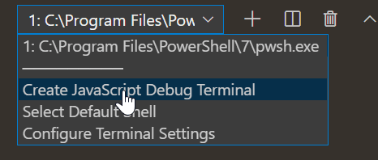
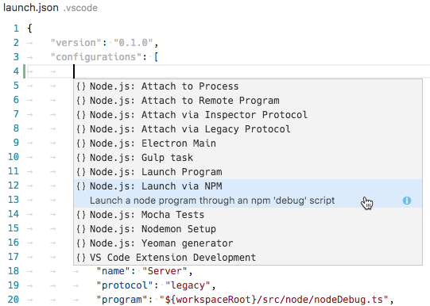
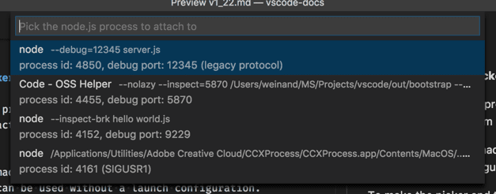

+++
title = "Node.js Debugging"
date = 2024-01-12T22:36:24+08:00
weight = 20
type = "docs"
description = ""
isCJKLanguage = true
draft = false
+++

> 原文: [https://code.visualstudio.com/docs/nodejs/nodejs-debugging](https://code.visualstudio.com/docs/nodejs/nodejs-debugging)

# Node.js debugging in VS Code VS Code 中的 Node.js 调试


The Visual Studio Code editor has built-in debugging support for the [Node.js](https://nodejs.org/) runtime and can debug JavaScript, TypeScript, and many other languages that are transpiled into JavaScript. Setting up a project for Node.js debugging is straightforward with VS Code providing appropriate launch configuration defaults and snippets.

​​	Visual Studio Code 编辑器对 Node.js 运行时具有内置调试支持，并且可以调试 JavaScript、TypeScript 以及许多其他已转译成 JavaScript 的语言。使用 VS Code 提供的适当启动配置默认值和代码段，可以轻松设置 Node.js 调试项目。

There are a few ways you can debug your Node.js programs in VS Code:

​​	您可以在 VS Code 中通过以下几种方式调试 Node.js 程序：

- Use [auto attach](https://code.visualstudio.com/docs/nodejs/nodejs-debugging#_auto-attach) to debug processes you run in VS Code's integrated terminal.
  使用自动附加功能来调试在 VS Code 集成终端中运行的进程。
- Use the [JavaScript debug terminal](https://code.visualstudio.com/docs/nodejs/nodejs-debugging#_javascript-debug-terminal), similar to using the integrated terminal.
  使用 JavaScript 调试终端，类似于使用集成终端。
- Use a [launch config](https://code.visualstudio.com/docs/nodejs/nodejs-debugging#_launch-configuration) to start your program, or [attach to a process](https://code.visualstudio.com/docs/nodejs/nodejs-debugging#_attaching-to-nodejs) launched outside of VS Code.
  使用启动配置来启动程序，或附加到在 VS Code 外部启动的进程。

## [Auto Attach 自动附加](https://code.visualstudio.com/docs/nodejs/nodejs-debugging#_auto-attach)

If the **Auto Attach** feature is enabled, the Node debugger automatically attaches to certain Node.js processes that have been launched from VS Code's Integrated Terminal. To enable the feature, either use the **Toggle Auto Attach** command from the Command Palette (Ctrl+Shift+P) or, if it's already activated, use the **Auto Attach** Status bar item.

​​	如果启用了自动附加功能，Node 调试器会自动附加到已从 VS Code 集成终端启动的某些 Node.js 进程。要启用此功能，请使用命令面板 (Ctrl+Shift+P) 中的切换自动附加命令，或者（如果已激活）使用自动附加状态栏项。

There are three modes for auto attach, which you can select in the resulting Quick Pick and via the **debug.javascript.autoAttachFilter** setting:

​​	自动附加有三种模式，您可以在结果快速选取中以及通过 debug.javascript.autoAttachFilter 设置选择这些模式：

- `smart` - If you execute a script outside of your `node_modules` folder or use a common 'runner' script like mocha or ts-node, the process will be debugged. You can configure the 'runner' script allow list using the **Auto Attach Smart Pattern** setting (`debug.javascript.autoAttachSmartPattern`).
  `smart` - 如果您在 `node_modules` 文件夹外执行脚本或使用 mocha 或 ts-node 等通用“运行程序”脚本，则会调试该进程。您可以使用自动附加智能模式设置 ( `debug.javascript.autoAttachSmartPattern` ) 配置“运行程序”脚本允许列表。
- `always` - All Node.js processes launched in the Integrated Terminal will be debugged.
  `always` - 将在集成终端中启动的所有 Node.js 进程进行调试。
- `onlyWithFlag` - Only processes launched with the `--inspect` or `--inspect-brk` flag will be debugged.
  `onlyWithFlag` - 仅调试使用 `--inspect` 或 `--inspect-brk` 标志启动的进程。

After enabling **Auto Attach**, you'll need to restart your terminal by clicking the ⚠ icon in the top right of the terminal, or just creating a new one. Then, the debugger should attach to your program within a second:

​​	启用自动附加后，您需要通过单击终端右上角的 ⚠ 图标或新建一个终端来重新启动终端。然后，调试器应在一秒内附加到您的程序：


When auto attach is on, the `Auto Attach` item will appear in the status bar across the bottom of the VS Code window. Clicking it allows you to change the auto attach mode, or temporarily turn it off. Temporarily turning off auto attach is useful if you're running some one-off programs where you don't need debugging, but you don't want to disable the feature entirely.

​​	当自动附加处于启用状态时， `Auto Attach` 项将显示在 VS Code 窗口底部的状态栏中。单击它可让您更改自动附加模式，或暂时将其关闭。如果您正在运行不需要调试的一些一次性程序，但又不想完全禁用此功能，则暂时关闭自动附加非常有用。

### [Additional Configuration 其他配置](https://code.visualstudio.com/docs/nodejs/nodejs-debugging#_additional-configuration)

**Other Launch Configuration Properties
其他启动配置属性**

You can apply [other properties normally found in launch.json](https://code.visualstudio.com/docs/nodejs/nodejs-debugging#_launch-configuration-attributes) to auto attach in the **debug.javascript.terminalOptions** setting. For example, to add node internals to your skipFiles, you could add the following to your user or workspace settings:

​​	您可以在 debug.javascript.terminalOptions 设置中应用通常在 launch.json 中找到的其他属性以自动附加。例如，若要将 node 内部添加到 skipFiles，您可以在用户或工作区设置中添加以下内容：

```
  "debug.javascript.terminalOptions": {
    "skipFiles": [
      "<node_internals>/**"
    ]
  },
```

**Auto Attach Smart Patterns
自动附加智能模式**

In `smart` Auto Attach mode, VS Code will try to attach to your code, and not attach to build tools you aren't interested in debugging. It does this by matching the main script against a list of [glob patterns](https://code.visualstudio.com/docs/editor/glob-patterns). The glob patterns are configurable in the **debug.javascript.autoAttachSmartPattern** setting, which defaults to:

​​	在 `smart` 自动附加模式下，VS Code 将尝试附加到您的代码，而不会附加到您不感兴趣的构建工具进行调试。它通过将主脚本与 glob 模式列表进行匹配来实现此目的。glob 模式可以在 debug.javascript.autoAttachSmartPattern 设置中配置，其默认值为：

```
[
  '!**/node_modules/**', // exclude scripts in node_modules folders
  '**/$KNOWN_TOOLS$/**' // but include some common tools
];
```

`$KNOWN_TOOLS$` is replaced with a list of common 'code runners' such as `ts-node`, `mocha`, `ava`, and so on. You can modify this list if these settings don't work. For example, to exclude `mocha` and include `my-cool-test-runner`, you could add two lines:

​​	 `$KNOWN_TOOLS$` 会替换为常见“代码运行程序”的列表，例如 `ts-node` 、 `mocha` 、 `ava` 等。如果这些设置不起作用，您可以修改此列表。例如，若要排除 `mocha` 并包含 `my-cool-test-runner` ，您可以添加两行：

```
[
  '!**/node_modules/**',
  '**/$KNOWN_TOOLS$/**',
  '!**/node_modules/mocha/**', // use "!" to exclude all scripts in "mocha" node modules
  '**/node_modules/my-cool-test-runner/**' // include scripts in the custom test runner
];
```

## [JavaScript Debug Terminal JavaScript 调试终端](https://code.visualstudio.com/docs/nodejs/nodejs-debugging#_javascript-debug-terminal)

In a similar way to [auto attach](https://code.visualstudio.com/docs/nodejs/nodejs-debugging#_auto-attach), the JavaScript Debug Terminal will automatically debug any Node.js process you run in it. You can create a Debug Terminal by running the **Debug: Create JavaScript Debug Terminal** command from the Command Palette (`kbs(workbench.action.showCommands)`), or by selecting the **Create JavaScript Debug Terminal** from the terminal switcher dropdown.

​​	与自动附加类似，JavaScript 调试终端会自动调试你在其中运行的任何 Node.js 进程。你可以通过从命令面板 ( `kbs(workbench.action.showCommands)` ) 运行调试：创建 JavaScript 调试终端命令，或从终端切换器下拉列表中选择创建 JavaScript 调试终端来创建调试终端。



### [Additional Configuration 其他配置](https://code.visualstudio.com/docs/nodejs/nodejs-debugging#_additional-configuration)

**Other Launch Configuration Properties
其他启动配置属性**

You can apply [other properties normally found in launch.json](https://code.visualstudio.com/docs/nodejs/nodejs-debugging#_launch-configuration-attributes) to the debug terminal in the **debug.javascript.terminalOptions** setting. For example, to add node internals to your skipFiles, you could add the following to your user or workspace settings:

​​	你可以将通常在 launch.json 中找到的其他属性应用到 debug.javascript.terminalOptions 设置中的调试终端。例如，若要将节点内部添加到你的 skipFiles，你可以将以下内容添加到你的用户或工作区设置中：

```
"debug.javascript.terminalOptions": {
  "skipFiles": [
    "<node_internals>/**"
  ]
},
```

## [Launch Configuration 启动配置](https://code.visualstudio.com/docs/nodejs/nodejs-debugging#_launch-configuration)

Launch configs are the traditional way to set up debugging in VS Code, and provide you the most configuration options for running complex applications.

​​	启动配置是 VS Code 中设置调试的传统方式，并为你提供了运行复杂应用程序的最多的配置选项。

In this section we'll go into more detail about configurations and features for more advanced debugging scenarios. You'll find instruction for debugging with [source maps](https://code.visualstudio.com/docs/nodejs/nodejs-debugging#_source-maps), [stepping over external code](https://code.visualstudio.com/docs/nodejs/nodejs-debugging#_skipping-uninteresting-code), doing [remote debugging](https://code.visualstudio.com/docs/nodejs/nodejs-debugging#_remote-debugging), and much more.

​​	在本节中，我们将更详细地介绍更高级调试方案的配置和功能。你将找到有关使用源映射进行调试、跨过外部代码、执行远程调试等的说明。

If you'd like to watch an introductory video, see [Getting started with Node.js debugging](https://www.youtube.com/watch?v=2oFKNL7vYV8).

​​	如果你想观看介绍性视频，请参阅 Node.js 调试入门。

> **Note**: If you are just getting started with VS Code, you can learn about general debugging features and creating `launch.json` configuration files in the [Debugging](https://code.visualstudio.com/docs/editor/debugging) topic.
>
> ​​	注意：如果您刚开始使用 VS Code，您可以在调试主题中了解常规调试功能和创建 `launch.json` 配置文件。

## [Launch configuration attributes 启动配置属性](https://code.visualstudio.com/docs/nodejs/nodejs-debugging#_launch-configuration-attributes)

Debugging configurations are stored in a `launch.json` file located in your workspace's `.vscode` folder. An introduction into the creation and use of debugging configuration files is in the general [Debugging](https://code.visualstudio.com/docs/editor/debugging#_launch-configurations) article.

​​	调试配置存储在工作区 `.vscode` 文件夹中的 `launch.json` 文件中。有关创建和使用调试配置文件的介绍，请参阅常规调试文章。

Below is a reference of common `launch.json` attributes specific to the Node.js debugger. You can view the complete set of options in the [vscode-js-debug options](https://github.com/microsoft/vscode-js-debug/blob/main/OPTIONS.md) documentation.

​​	下面是特定于 Node.js 调试器的常见 `launch.json` 属性的参考。您可以在 vscode-js-debug 选项文档中查看完整选项集。

The following attributes are supported in launch configurations of type `launch` and `attach`:

​​	以下属性在 `launch` 和 `attach` 类型的启动配置中受支持：

- `outFiles` - array of [glob patterns](https://code.visualstudio.com/docs/editor/glob-patterns) for locating generated JavaScript files. See section [Source maps](https://code.visualstudio.com/docs/nodejs/nodejs-debugging#_source-maps).
  `outFiles` - 用于查找生成的 JavaScript 文件的 glob 模式数组。请参阅源映射部分。
- `resolveSourceMapLocations` - an array of [glob patterns](https://code.visualstudio.com/docs/editor/glob-patterns) for locations where source maps should be parsed. See section [Source maps](https://code.visualstudio.com/docs/nodejs/nodejs-debugging#_source-maps).
  `resolveSourceMapLocations` - 用于解析源映射的位置的 glob 模式数组。请参阅源映射部分。
- `timeout` - when restarting a session, give up after this number of milliseconds. See section [Attaching to Node.js](https://code.visualstudio.com/docs/nodejs/nodejs-debugging#_attaching-to-nodejs).
  `timeout` - 重新启动会话时，在此毫秒数后放弃。请参阅附加到 Node.js 部分。
- `stopOnEntry` - break immediately when the program launches.
  `stopOnEntry` - 程序启动时立即中断。
- `localRoot` - VS Code's root directory. See section [Remote debugging](https://code.visualstudio.com/docs/nodejs/nodejs-debugging#_remote-debugging) below.
  `localRoot` - VS Code 的根目录。请参阅下面的远程调试部分。
- `remoteRoot` - Node's root directory. See section [Remote debugging](https://code.visualstudio.com/docs/nodejs/nodejs-debugging#_remote-debugging) below.
  `remoteRoot` - Node 的根目录。请参阅下面的远程调试部分。
- `smartStep`- try to automatically step over code that doesn't map to source files. See section [Smart stepping](https://code.visualstudio.com/docs/nodejs/nodejs-debugging#_smart-stepping).
  `smartStep` - 尝试自动跳过未映射到源文件的代码。请参阅智能步进部分。
- `skipFiles` - automatically skip files covered by these [glob patterns](https://code.visualstudio.com/docs/editor/glob-patterns). See section [Skipping uninteresting code](https://code.visualstudio.com/docs/nodejs/nodejs-debugging#_skipping-uninteresting-code).
  `skipFiles` - 自动跳过这些 glob 模式涵盖的文件。请参阅跳过无意义的代码部分。
- `trace` - enable diagnostic output.
  `trace` - 启用诊断输出。

These attributes are only available for launch configurations of request type `launch`:

​​	这些属性仅适用于请求类型为 `launch` 的启动配置：

- `program` - an absolute path to the Node.js program to debug.
  `program` - 要调试的 Node.js 程序的绝对路径。
- `args` - arguments passed to the program to debug. This attribute is of type array and expects individual arguments as array elements.
  `args` - 传递给要调试的程序的参数。此属性的类型为数组，并期望各个参数作为数组元素。
- `cwd` - launch the program to debug in this directory.
  `cwd` - 在此目录中启动要调试的程序。
- `runtimeExecutable` - absolute path to the runtime executable to be used. Default is `node`. See section [Launch configuration support for 'npm' and other tools](https://code.visualstudio.com/docs/nodejs/nodejs-debugging#_launch-configuration-support-for-npm-and-other-tools).
  `runtimeExecutable` - 要使用的运行时可执行文件的绝对路径。默认值为 `node` 。请参阅“npm”和其他工具的启动配置支持部分。
- `runtimeArgs` - optional arguments passed to the runtime executable.
  `runtimeArgs` - 传递给运行时可执行文件的可选参数。
- `runtimeVersion` - if "[nvm](https://github.com/creationix/nvm)" (or "[nvm-windows](https://github.com/coreybutler/nvm-windows)") or "[nvs](https://github.com/jasongin/nvs)" is used for managing Node.js versions, this attribute can be used to select a specific version of Node.js. See section [Multi version support](https://code.visualstudio.com/docs/nodejs/nodejs-debugging#_multi-version-support) below.
  `runtimeVersion` - 如果使用“nvm”（或“nvm-windows”）或“nvs”来管理 Node.js 版本，则可以使用此属性选择特定版本的 Node.js。请参阅下面的多版本支持部分。
- `env` - optional environment variables. This attribute expects environment variables as a list of string typed key/value pairs.
  `env` - 可选环境变量。此属性期望环境变量为字符串类型键/值对的列表。
- `envFile` - optional path to a file containing environment variable definitions. See section [Load environment variables from external file](https://code.visualstudio.com/docs/nodejs/nodejs-debugging#_load-environment-variables-from-external-file) below.
  `envFile` - 包含环境变量定义的文件的可选路径。请参阅下面的从外部文件加载环境变量部分。
- `console` - the console to launch the program (`internalConsole`, `integratedTerminal`, `externalTerminal`). See section [Node Console](https://code.visualstudio.com/docs/nodejs/nodejs-debugging#_node-console) below.
  `console` - 用于启动程序的控制台（ `internalConsole` 、 `integratedTerminal` 、 `externalTerminal` ）。请参阅下面的 Node 控制台部分。
- `outputCapture` - if set to `std`, output from the process stdout/stderr will be shown in the Debug Console, instead of listening to output over the debug port. This is useful for programs or log libraries that write directly to the stdout/stderr streams instead of using `console.*` APIs.
  `outputCapture` - 如果设置为 `std` ，则进程 stdout/stderr 的输出将显示在调试控制台中，而不是侦听调试端口上的输出。这对于直接写入 stdout/stderr 流而不是使用 `console.*` API 的程序或日志库非常有用。

This attribute is only available for launch configurations of request type `attach`:

​​	此属性仅适用于请求类型为 `attach` 的启动配置：

- `restart` - restart the connection on termination. See section [Restarting debug session automatically](https://code.visualstudio.com/docs/nodejs/nodejs-debugging#_restarting-debug-sessions-automatically-when-source-is-edited).
  `restart` - 在终止时重新启动连接。请参阅自动重新启动调试会话部分。
- `port` - debug port to use. See sections [Attaching to Node.js](https://code.visualstudio.com/docs/nodejs/nodejs-debugging#_attaching-to-nodejs) and [Remote debugging](https://code.visualstudio.com/docs/nodejs/nodejs-debugging#_remote-debugging).
  `port` - 要使用的调试端口。请参阅“附加到 Node.js”和“远程调试”部分。
- `address` - TCP/IP address of the debug port. See sections [Attaching to Node.js](https://code.visualstudio.com/docs/nodejs/nodejs-debugging#_attaching-to-nodejs) and [Remote debugging](https://code.visualstudio.com/docs/nodejs/nodejs-debugging#_remote-debugging).
  `address` - 调试端口的 TCP/IP 地址。请参阅“附加到 Node.js”和“远程调试”部分。
- `processId` - the debugger tries to attach to this process after having sent a USR1 signal. With this setting, the debugger can attach to an already running process that was not started in debug mode. When using the `processId` attribute, the debug port is determined automatically based on the Node.js version (and the used protocol) and cannot be configured explicitly. So don't specify a `port` attribute.
  `processId` - 在发送 USR1 信号后，调试器尝试附加到此进程。使用此设置，调试器可以附加到未在调试模式下启动的已运行进程。使用 `processId` 属性时，调试端口会根据 Node.js 版本（和使用的协议）自动确定，无法显式配置。因此，不要指定 `port` 属性。
- `continueOnAttach` - whether to continue the process if it's paused when we attach to it. This option is useful if you launch your program with `--inspect-brk`.
  `continueOnAttach` - 如果在附加到进程时进程已暂停，是否继续该进程。如果您使用 `--inspect-brk` 启动程序，此选项非常有用。

### [Launch configurations for common scenarios 常见方案的启动配置](https://code.visualstudio.com/docs/nodejs/nodejs-debugging#_launch-configurations-for-common-scenarios)

You can trigger IntelliSense (Ctrl+Space) in your `launch.json` file to see launch configuration snippets for commonly used Node.js debugging scenarios.

​​	您可以在 `launch.json` 文件中触发 IntelliSense (Ctrl+Space)，以查看常用 Node.js 调试方案的启动配置代码段。



You can also bring up the snippets with the **Add Configuration...** button in the lower right of the `launch.json` editor window.

​​	您还可以在 `launch.json` 编辑器窗口的右下角使用“添加配置...”按钮调出代码段。


The following snippets are available:

​​	以下代码段可用：

- **Launch Program**: Launch a Node.js program in debug mode.
  启动程序：在调试模式下启动 Node.js 程序。
- **Launch via npm**: Launch a Node.js program through an npm 'debug' script. You can use an npm debug script from your launch configuration if it has been defined in your package.json. The debug port used in the npm script must correspond to the port specified in the snippet.
  通过 npm 启动：通过 npm 'debug' 脚本启动 Node.js 程序。如果已在 package.json 中定义，则可以在启动配置中使用 npm debug 脚本。npm 脚本中使用的调试端口必须与代码段中指定的端口相对应。
- **Attach**: Attach to the debug port of a locally running Node.js program. Make sure that the Node.js program to debug has been started in debug mode, and the debug port used is the same as the one specified in the snippet.
  附加：附加到本地运行的 Node.js 程序的调试端口。确保已在调试模式下启动要调试的 Node.js 程序，并且使用的调试端口与代码段中指定的端口相同。
- **Attach to Remote Program**: Attach to the debug port of a Node.js program running on the host specified by the `address` attribute. Make sure that the Node.js program to debug has been started in debug mode, and the debug port used is the same as the one specified in the snippet. To help VS Code map source files between your workspace and the filesystem of the remote host, make sure to specify correct paths for the `localRoot`and `remoteRoot` attributes.
  附加到远程程序：附加到 `address` 属性指定的宿主上运行的 Node.js 程序的调试端口。确保已在调试模式下启动要调试的 Node.js 程序，并且使用的调试端口与代码段中指定的端口相同。为了帮助 VS Code 在工作区和远程主机的文件系统之间映射源文件，请务必为 `localRoot` 和 `remoteRoot` 属性指定正确的路径。
- **Attach by Process ID**: Open the process picker to select a node or gulp process for debugging. With this launch configuration, you can even attach to a node or gulp process that was not started in debug mode.
  按进程 ID 附加：打开进程选择器以选择要调试的 node 或 gulp 进程。使用此启动配置，您甚至可以附加到未在调试模式下启动的 node 或 gulp 进程。
- **Nodemon Setup**: Use nodemon to relaunch a debug session automatically whenever the JavaScript source has changed. Make sure that you have nodemon installed globally. Note that terminating the debug session only terminates the program to debug, not nodemon itself. To terminate nodemon, press Ctrl+C in the Integrated Terminal.
  Nodemon 设置：使用 nodemon 在 JavaScript 源代码发生更改时自动重新启动调试会话。确保已全局安装 nodemon。请注意，终止调试会话只会终止要调试的程序，而不会终止 nodemon 本身。要终止 nodemon，请在集成终端中按 Ctrl+C。
- **Mocha Tests**: Debug mocha tests in a `test` folder of your project. Make sure that your project has 'mocha' installed in its `node_modules` folder.
  Mocha 测试：在项目的 `test` 文件夹中调试 mocha 测试。确保项目在 `node_modules` 文件夹中安装了“mocha”。
- **Yeoman generator**: Debug a yeoman generator. The snippet asks you to specify the name of the generator. Make sure that your project has 'yo' installed in its `node_modules` folder and that your generated project has been installed for debugging by running `npm link` in the project folder.
  Yeoman 生成器：调试 yeoman 生成器。代码段要求您指定生成器的名称。确保项目在 `node_modules` 文件夹中安装了“yo”，并且已通过在项目文件夹中运行 `npm link` 安装了生成的项目以进行调试。
- **Gulp task**: Debug a gulp task. Make sure that your project has 'gulp' installed in its `node_modules` folder.
  Gulp 任务：调试 gulp 任务。确保项目在 `node_modules` 文件夹中安装了“gulp”。
- **Electron Main**: Debug the main Node.js process of an Electron application. The snippet assumes that the Electron executable has been installed inside the `node_modules/.bin` directory of the workspace.
  Electron 主进程：调试 Electron 应用程序的 Node.js 主进程。代码段假定已在工作区的 `node_modules/.bin` 目录中安装了 Electron 可执行文件。

### [Node console Node 控制台](https://code.visualstudio.com/docs/nodejs/nodejs-debugging#_node-console)

By default, Node.js debug sessions launch the target in the internal VS Code Debug Console. Since the Debug Console does not support programs that need to read input from the console, you can enable either an external terminal or use the VS Code Integrated Terminal by setting the `console` attribute in your launch configuration to `externalTerminal` or `integratedTerminal` respectively. The default is `internalConsole`.

​​	默认情况下，Node.js 调试会话在内部 VS Code 调试控制台中启动目标。由于调试控制台不支持需要从控制台读取输入的程序，因此您可以通过将启动配置中的 `console` 属性分别设置为 `externalTerminal` 或 `integratedTerminal` 来启用外部终端或使用 VS Code 集成终端。默认值为 `internalConsole` 。

In an external terminal, you can configure which terminal program to use via the `terminal.external.windowsExec`, `terminal.external.osxExec`, and `terminal.external.linuxExec` settings.

​​	在外部终端中，您可以通过 `terminal.external.windowsExec` 、 `terminal.external.osxExec` 和 `terminal.external.linuxExec` 设置来配置要使用的终端程序。

### [Launch configuration support for 'npm' and other tools 对“npm”和其他工具的启动配置支持](https://code.visualstudio.com/docs/nodejs/nodejs-debugging#_launch-configuration-support-for-npm-and-other-tools)

Instead of launching the Node.js program directly with node, you can use 'npm' scripts or other task runner tools directly from a launch configuration:

​​	您可以直接从启动配置中使用“npm”脚本或其他任务运行程序工具，而无需使用 node 直接启动 Node.js 程序：

- You can use any program available on the PATH (for example 'npm', 'mocha', 'gulp', etc.) for the `runtimeExecutable` attribute and arguments can be passed via `runtimeArgs`.
  您可以对 `runtimeExecutable` 属性使用 PATH 上的任何可用程序（例如“npm”、“mocha”、“gulp”等），并且可以通过 `runtimeArgs` 传递参数。
- You do not have to set the `program` attribute if your npm script or other tool implicitly specifies the program to launch.
  如果您的 npm 脚本或其他工具隐式指定要启动的程序，则不必设置 `program` 属性。

Let's look at an 'npm' example. If your `package.json` has a 'debug' script, for example:

​​	我们来看一个“npm”示例。如果您的 `package.json` 有一个“debug”脚本，例如：

```
  "scripts": {
    "debug": "node myProgram.js"
  },
```

the corresponding launch configuration would look like this:

​​	相应的启动配置将如下所示：

```
{
  "name": "Launch via npm",
  "type": "node",
  "request": "launch",
  "cwd": "${workspaceFolder}",
  "runtimeExecutable": "npm",
  "runtimeArgs": ["run-script", "debug"]
}
```

### [Multi version support 多版本支持](https://code.visualstudio.com/docs/nodejs/nodejs-debugging#_multi-version-support)

If you are using '[nvm](https://github.com/creationix/nvm)' (or '[nvm-windows](https://github.com/coreybutler/nvm-windows)') to manage your Node.js versions, it is possible to specify a `runtimeVersion` attribute in a launch configuration for selecting a specific version of Node.js:

​​	如果您使用“nvm”（或“nvm-windows”）来管理 Node.js 版本，则可以在启动配置中指定 `runtimeVersion` 属性以选择特定版本的 Node.js：

```
{
  "type": "node",
  "request": "launch",
  "name": "Launch test",
  "runtimeVersion": "14",
  "program": "${workspaceFolder}/test.js"
}
```

If you are using '[nvs](https://github.com/jasongin/nvs)' to manage your Node.js versions, it is possible to use `runtimeVersion` attribute to select a specific version, architecture, and flavor Node.js, for example:

​​	如果您使用“nvs”来管理 Node.js 版本，则可以使用 `runtimeVersion` 属性来选择特定版本、体系结构和风格的 Node.js，例如：

```
{
  "type": "node",
  "request": "launch",
  "name": "Launch test",
  "runtimeVersion": "chackracore/8.9.4/x64",
  "program": "${workspaceFolder}/test.js"
}
```

Make sure to have those Node.js versions installed that you want to use with the `runtimeVersion` attribute, as the feature will not download and install the version automatically. For example, you'll have to run something like `nvm install 7.10.1` or `nvs add 7.10.1` from the integrated terminal if you plan to add `"runtimeVersion": "7.10.1"` to your launch configuration.

​​	请务必安装您想要与 `runtimeVersion` 属性配合使用的那些 Node.js 版本，因为此功能不会自动下载并安装该版本。例如，如果您计划将 `"runtimeVersion": "7.10.1"` 添加到启动配置，则必须从集成终端运行类似 `nvm install 7.10.1` 或 `nvs add 7.10.1` 的命令。

If you omit the minor and patch version and have, for example, `"runtimeVersion": "14"`, then the most recent `14.x.y` version installed on your system will be used.

​​	如果您省略次要版本和修补程序版本，例如，只有 `"runtimeVersion": "14"` ，则将使用系统上安装的最新 `14.x.y` 版本。

### [Load environment variables from external file 从外部文件加载环境变量](https://code.visualstudio.com/docs/nodejs/nodejs-debugging#_load-environment-variables-from-external-file)

The VS Code Node debugger supports loading environment variables from a file and passing them to the Node.js runtime. To use this feature, add an attribute `envFile` to your launch configuration and specify the absolute path to the file containing the environment variables:

​​	VS Code Node 调试器支持从文件加载环境变量并将它们传递给 Node.js 运行时。要使用此功能，请将属性 `envFile` 添加到启动配置并指定包含环境变量的文件的绝对路径：

```
   //...
   "envFile": "${workspaceFolder}/.env",
   "env": { "USER": "john doe" }
   //...
```

Any environment variable specified in the `env` dictionary will override variables loaded from the file.

​​	在 `env` 字典中指定的任何环境变量将覆盖从文件中加载的变量。

Here's an example of an `.env` file:

​​	以下是 `.env` 文件的示例：

```
USER=doe
PASSWORD=abc123

# a comment

# an empty value:
empty=

# new lines expanded in quoted strings:
lines="foo\nbar"
```

## [Attaching to Node.js 附加到 Node.js](https://code.visualstudio.com/docs/nodejs/nodejs-debugging#_attaching-to-nodejs)

If you want to attach the VS Code debugger to an external Node.js program, launch Node.js as follows:

​​	如果要将 VS Code 调试器附加到外部 Node.js 程序，请按如下方式启动 Node.js：

```
node --inspect program.js
```

or if the program shouldn't start running, but must wait for the debugger to attach:

​​	或者如果程序不应该开始运行，但必须等待调试器附加：

```
node --inspect-brk program.js
```

Options to attach the debugger to your program:

​​	将调试器附加到程序的选项：

- Open a "process picker" that lists all potential candidate processes and let you pick one, or
  打开列出所有潜在候选进程的“进程选择器”，并让您选择一个，或
- Create an "attach" configuration that explicitly specifies all configuration options and then press **F5**.
  创建一个明确指定所有配置选项的“附加”配置，然后按 F5。

Let's go through these options in detail:

​​	让我们详细了解这些选项：

### [Attach to Node Process action 附加到 Node 进程操作](https://code.visualstudio.com/docs/nodejs/nodejs-debugging#_attach-to-node-process-action)

The **Attach to Node Process** command from the Command Palette (Ctrl+Shift+P) opens a Quick Pick menu that lists all potential processes that are available to the Node.js debugger:

​​	命令面板中的附加到 Node 进程命令（Ctrl+Shift+P）会打开一个快速选择菜单，其中列出了 Node.js 调试器可用的所有潜在进程：



The individual processes listed in the picker show the debug port and process ID. Once you select your Node.js process in that list, the Node.js debugger will try to attach to it.

​​	选择器中列出的各个进程显示调试端口和进程 ID。在该列表中选择 Node.js 进程后，Node.js 调试器将尝试附加到它。

In addition to Node.js processes, the picker also shows other programs that were launched with one of the various forms `--inspect` arguments. This makes it possible to attach to Electron's or VS Code's helper processes.

​​	除了 Node.js 进程外，选择器还显示使用各种形式 `--inspect` 参数启动的其他程序。这使得可以附加到 Electron 或 VS Code 的帮助进程。

### [Setting up an "Attach" configuration 设置“附加”配置](https://code.visualstudio.com/docs/nodejs/nodejs-debugging#_setting-up-an-attach-configuration)

This option requires more work but in contrast to the previous two options it allows you to configure various debug configuration options explicitly.

​​	此选项需要更多工作，但与前两个选项相比，它允许您显式配置各种调试配置选项。

The simplest "attach" configuration looks like this:

​​	最简单的“附加”配置如下所示：

```
{
  "name": "Attach to Process",
  "type": "node",
  "request": "attach",
  "port": 9229
}
```

The port `9229` is the default debug port of the `--inspect` and `--inspect-brk` options. To use a different port (for example `12345`), add it to the options like this: `--inspect=12345` and `--inspect-brk=12345` and change the `port` attribute in the launch configuration to match.

​​	端口 `9229` 是 `--inspect` 和 `--inspect-brk` 选项的默认调试端口。要使用其他端口（例如 `12345` ），请将其添加到选项中，如下所示： `--inspect=12345` 和 `--inspect-brk=12345` ，并更改启动配置中的 `port` 属性以匹配。

To attach to a Node.js process that hasn't been started in debug mode, you can do this by specifying the process ID of the Node.js process as a string:

​​	要附加到尚未在调试模式下启动的 Node.js 进程，您可以通过将 Node.js 进程的进程 ID 指定为字符串来执行此操作：

```
{
  "name": "Attach to Process",
  "type": "node",
  "request": "attach",
  "processId": "53426"
}
```

To avoid repeatedly entering a new process ID in the launch configuration, Node debug supports a command variable `PickProcess` that will open the process picker (from above).

​​	为了避免在启动配置中重复输入新的进程 ID，Node 调试支持一个命令变量 `PickProcess` ，该变量将打开进程选择器（来自上面）。

Using the `PickProcess` variable the launch configuration looks like this:

​​	使用 `PickProcess` 变量，启动配置如下所示：

```
{
  "name": "Attach to Process",
  "type": "node",
  "request": "attach",
  "processId": "${command:PickProcess}"
}
```

## [Stop debugging 停止调试](https://code.visualstudio.com/docs/nodejs/nodejs-debugging#_stop-debugging)

Using the **Debug: Stop** action (available in the Debug toolbar or via the **Command Palette**) stops the debug session.

​​	使用调试：停止操作（可在调试工具栏或通过命令面板中找到）停止调试会话。

If the debug session was started in "attach" mode (and the red terminate button in the Debug toolbar shows a superimposed "plug"), pressing **Stop** disconnects the Node.js debugger from the debuggee that then continues execution.

​​	如果调试会话以“附加”模式启动（并且调试工具栏中的红色终止按钮显示一个叠加的“插头”），则按停止会断开 Node.js 调试器与随后继续执行的被调试程序的连接。

If the debug session is in "launch" mode, pressing **Stop** does the following:

​​	如果调试会话处于“启动”模式，则按停止会执行以下操作：

1. When pressing **Stop** for the first time, the debuggee is requested to shut down gracefully by sending a `SIGINT` signal. The debuggee is free to intercept this signal and clean up anything as necessary and then shut down. If there are no breakpoints (or problems) in that shutdown code, the debuggee and the debug session will terminate.

   ​​	首次按停止时，会通过发送 `SIGINT` 信号请求被调试程序正常关闭。被调试程序可以自由拦截此信号并根据需要清理任何内容，然后关闭。如果该关闭代码中没有断点（或问题），则被调试程序和调试会话将终止。

2. However, if the debugger hits a breakpoint in the shutdown code or if the debuggee does not terminate properly by itself, then the debug session will not end. In this case, pressing **Stop** again will force terminate the debuggee and its child processes (`SIGKILL`).

   ​​	但是，如果调试器在关闭代码中遇到断点，或者被调试程序本身未正确终止，则调试会话不会结束。在这种情况下，再次按停止将强制终止被调试程序及其子进程（ `SIGKILL` ）。

If you see that a debug session doesn't end when you press the red **Stop** button, then press the button again to force a shutdown of the debuggee.

​​	如果您看到按红色停止按钮时调试会话未结束，请再次按该按钮以强制关闭被调试程序。

On Windows, pressing **Stop** forcibly kills the debuggee and its child processes.

​​	在 Windows 上，按停止会强制终止被调试程序及其子进程。

## [Source maps 源映射](https://code.visualstudio.com/docs/nodejs/nodejs-debugging#_source-maps)

The JavaScript debugger of VS Code supports source maps that help debugging of transpiled languages, for example, TypeScript or minified/uglified JavaScript. With source maps, it's possible to single step through or set breakpoints in the original source. If no source map exists for the original source, or if the source map is broken and cannot successfully map between the source and the generated JavaScript, then breakpoints show up as unverified (gray hollow circles).

​​	VS Code 的 JavaScript 调试器支持源映射，有助于调试已转换的语言，例如 TypeScript 或已缩小/混淆的 JavaScript。使用源映射，可以在原始源中逐个步骤执行或设置断点。如果原始源不存在源映射，或者源映射已损坏且无法在源与生成的 JavaScript 之间成功映射，则断点会显示为未验证（灰色空心圆圈）。

The `sourceMaps` attribute that defaults to `true` controls the source map feature. The debugger always tries to use source maps (if it can find any) and as a consequence, you can even specify a source file (for example, app.ts) with the `program` attribute. If you need to disable source maps for some reason, you can set the `sourceMaps` attribute to `false`.

​​	默认值为 `true` 的 `sourceMaps` 属性控制源映射功能。调试器始终尝试使用源映射（如果可以找到任何源映射），因此，您甚至可以使用 `program` 属性指定源文件（例如，app.ts）。如果由于某种原因需要禁用源映射，可以将 `sourceMaps` 属性设置为 `false` 。

### [Tool Configuration 工具配置](https://code.visualstudio.com/docs/nodejs/nodejs-debugging#_tool-configuration)

Since source maps are not always automatically created, you should make sure to configure your transpiler to create them. For example:

​​	由于源映射并不总是自动创建，因此您应确保将转换器配置为创建源映射。例如：

**TypeScript**

For TypeScript, you can enable sourcemaps by passing `--sourceMap` to `tsc`, or by adding `"sourceMap": true` in your tsconfig.json file.

​​	对于 TypeScript，可以通过将 `--sourceMap` 传递给 `tsc` ，或在 tsconfig.json 文件中添加 `"sourceMap": true` 来启用源映射。

```
tsc --sourceMap --outDir bin app.ts
```

**Babel**

For Babel, you'll want to set the [sourceMaps](https://babeljs.io/docs/en/options#sourcemaps) option to `true`, or pass the `--source-maps` option when compiling your code.

​​	对于 Babel，您需要将 sourceMaps 选项设置为 `true` ，或在编译代码时传递 `--source-maps` 选项。

```
npx babel script.js --out-file script-compiled.js --source-maps
```

**Webpack**

Webpack has [numerous](https://webpack.js.org/configuration/devtool/) source map options. We recommend setting the property `devtool: "source-map"` in your `webpack.config.js` for the best fidelity of results, although you can experiment with other settings causes slowdowns in your build.

​​	Webpack 有许多源映射选项。我们建议在 `webpack.config.js` 中设置 `devtool: "source-map"` 属性，以获得最佳保真度，尽管您可以尝试其他设置，但会导致构建速度变慢。

Also, if you have additional compilation steps in webpack, such as using a TypeScript loader, you'll also want to make sure that those steps are set up to generate sourcemaps. Otherwise, the sourcemaps that webpack generates will map back to the compiled code from the loader, instead of the real sources.

​​	此外，如果您在 webpack 中有其他编译步骤，例如使用 TypeScript 加载器，您还需要确保这些步骤已设置为生成源映射。否则，webpack 生成的源映射将映射回加载器的已编译代码，而不是真实源。

### [Source Map Discovery 源映射发现](https://code.visualstudio.com/docs/nodejs/nodejs-debugging#_source-map-discovery)

By default, VS Code will search your entire workspace, excluding `node_modules`, for sourcemaps. In large workspaces, this search might be slow. You can configure the locations where VS Code will search for source maps by setting the `outFiles` attribute in your `launch.json`. For example, this configuration will only discover sourcemaps for `.js` files in the `bin` folder:

​​	默认情况下，VS Code 将搜索整个工作区（不包括 `node_modules` ）以查找源映射。在大型工作区中，此搜索可能会很慢。您可以通过在 `launch.json` 中设置 `outFiles` 属性来配置 VS Code 搜索源映射的位置。例如，此配置将仅发现 `bin` 文件夹中 `.js` 文件的源映射：

```
{
  "version": "0.2.0",
  "configurations": [
    {
      "name": "Launch TypeScript",
      "type": "node",
      "request": "launch",
      "program": "app.ts",
      "outFiles": ["${workspaceFolder}/bin/**/*.js"]
    }
  ]
}
```

Note that the `outFiles` should match your JavaScript files, not the source map files (which may end in `.map` instead of `.js`).

​​	请注意， `outFiles` 应与您的 JavaScript 文件匹配，而不是源映射文件（可能以 `.map` 结尾，而不是 `.js` ）。

### [Source Map Resolution 源映射解析](https://code.visualstudio.com/docs/nodejs/nodejs-debugging#_source-map-resolution)

By default, only source maps in your `outFiles` will be resolved. This behavior is used to prevent dependencies from interfering with breakpoints you set. For example, if you had a file `src/index.ts` and a dependency had a source map that referenced `webpack:///./src/index.ts`, that would incorrectly resolve to your source file and could lead to surprising results.

​​	默认情况下，只会解析 `outFiles` 中的源映射。此行为用于防止依赖项干扰您设置的断点。例如，如果您有一个文件 `src/index.ts` ，并且某个依赖项有一个引用 `webpack:///./src/index.ts` 的源映射，那么该映射将错误地解析为您的源文件，并可能导致意外结果。

You can configure this behavior by setting the `resolveSourceMapLocations` option. If set to `null`, every source map will be resolved. For example, this configuration will additionally allow source maps in `node_modules/some-dependency` to be resolved:

​​	您可以通过设置 `resolveSourceMapLocations` 选项来配置此行为。如果设置为 `null` ，则将解析每个源映射。例如，此配置还将允许解析 `node_modules/some-dependency` 中的源映射：

```
  "resolveSourceMapLocations": [
    "out/**/*.js",
    "node_modules/some-dependency/**/*.js",
  ]
```

### [Smart stepping 智能步进](https://code.visualstudio.com/docs/nodejs/nodejs-debugging#_smart-stepping)

With the `smartStep` attribute set to `true` in a launch configuration, VS Code will automatically skip 'uninteresting code' when stepping through code in the debugger. 'Uninteresting code' is code that is generated by a transpiling process but is not covered by a source map so it does not map back to the original source. This code gets in your way when stepping through source code in the debugger because it makes the debugger switch between the original source code and generated code that you are not interested in. `smartStep` will automatically step through code not covered by a source map until it reaches a location that is covered by a source map again.

​​	如果在启动配置中将 `smartStep` 属性设置为 `true` ，VS Code 在调试器中逐步执行代码时会自动跳过“无意义的代码”。“无意义的代码”是通过转换过程生成的代码，但未被源映射覆盖，因此无法映射回原始源。在调试器中逐步执行源代码时，此代码会妨碍您，因为它会使调试器在您不感兴趣的原始源代码和生成代码之间切换。 `smartStep` 会自动逐步执行未被源映射覆盖的代码，直到再次到达被源映射覆盖的位置。

Smart stepping is especially useful for cases like async/await downcompilation in TypeScript, where the compiler injects helper code that is not covered by a source map.

​​	智能步进对于诸如 TypeScript 中的 async/await 反编译等情况特别有用，在这些情况下，编译器会注入未被源映射覆盖的帮助程序代码。

The `smartStep` feature only applies to JavaScript code that was generated from source and therefore has a source map. For JavaScript without sources, the smart stepping option has no effect.

​​	 `smartStep` 功能仅适用于从源代码生成且因此具有源映射的 JavaScript 代码。对于没有源的 JavaScript，智能步进选项无效。

### [JavaScript source map tips JavaScript 源映射提示](https://code.visualstudio.com/docs/nodejs/nodejs-debugging#_javascript-source-map-tips)

A common issue when debugging with source maps is that you'll set a breakpoint, and it will turn gray. If you hover the cursor over it, you'll see the message, `"Breakpoint ignored because generated code not found (source map problem?)"`. What now? There are a range of issues that can lead to this. First, a quick explanation of how the Node debug adapter handles source maps.

​​	在使用源映射进行调试时，一个常见问题是您将设置一个断点，它将变为灰色。如果您将光标悬停在其上，您将看到消息 `"Breakpoint ignored because generated code not found (source map problem?)"` 。现在怎么办？可能导致此问题的原因有很多。首先，快速解释一下 Node 调试适配器如何处理源映射。

When you set a breakpoint in `app.ts`, the debug adapter has to figure out the path to `app.js`, the transpiled version of your TypeScript file, which is what is actually running in Node. But, there is not a straightforward way to figure this out starting from the `.ts` file. Instead, the debug adapter uses the `outFiles` attribute in the `launch.json` to find all the transpiled `.js` files, and parses them for a source map, which contains the locations of its associated `.ts` files.

​​	当您在 `app.ts` 中设置断点时，调试适配器必须找出 `app.js` 的路径，即 TypeScript 文件的转换版本，它实际上在 Node 中运行。但是，没有一种直接的方法可以从 `.ts` 文件开始找出这一点。相反，调试适配器使用 `launch.json` 中的 `outFiles` 属性查找所有转换的 `.js` 文件，并解析它们以获取源映射，其中包含其关联的 `.ts` 文件的位置。

When you build your `app.ts` file in TypeScript with source maps enabled, it either produces an `app.js.map` file, or a source map inlined as a base64-encoded string in a comment at the bottom of the `app.js` file. To find the `.ts` files associated with this map, the debug adapter looks at two properties in the source map, `sources`, and `sourceRoot`. `sourceRoot` is optional - if present, it is prepended to each path in `sources`, which is an array of paths. The result is an array of absolute or relative paths to `.ts` files. Relative paths are resolved relative to the source map.

​​	在 TypeScript 中启用源映射构建 `app.ts` 文件时，它会生成 `app.js.map` 文件，或在 `app.js` 文件底部的注释中内联一个以 base64 编码的字符串形式的源映射。若要查找与此映射关联的 `.ts` 文件，调试适配器会查看源映射中的两个属性， `sources` 和 `sourceRoot` 。 `sourceRoot` 是可选的 - 如果存在，它将被添加到 `sources` 中的每个路径之前，`sources` 是一个路径数组。结果是 `.ts` 文件的绝对路径或相对路径的数组。相对路径相对于源映射进行解析。

Finally, the debug adapter searches for the full path of `app.ts` in this resulting list of `.ts` files. If there's a match, it has found the source map file to use when mapping `app.ts` to `app.js`. If there is no match, then it can't bind the breakpoint, and it will turn gray.

​​	最后，调试适配器在此生成的 `.ts` 文件列表中搜索 `app.ts` 的完整路径。如果存在匹配项，则已找到在将 `app.ts` 映射到 `app.js` 时要使用的源映射文件。如果不存在匹配项，则无法绑定断点，并且它将变为灰色。

Here are some things to try when your breakpoints turn gray:

​​	当断点变为灰色时，可以尝试以下操作：

- While debugging, run the **Debug: Diagnose Breakpoint Problems** command. This command will bring up a tool that can provide hints to help you resolve any issues from the Command Palette (Ctrl+Shift+P).
  在调试时，运行“调试：诊断断点问题”命令。此命令将打开一个工具，该工具可以提供提示，帮助您从命令面板 (Ctrl+Shift+P) 中解决任何问题。
- Did you build with source maps enabled? Make sure there are `.js.map` files, or inlined source maps in your `.js` files.
  您是否启用了源映射进行构建？确保有 `.js.map` 文件，或在 `.js` 文件中内联源映射。
- Are the `sourceRoot` and `sources` properties in your source map correct? Can they be combined to get the correct path to the `.ts` file?
  源映射中的 `sourceRoot` 和 `sources` 属性是否正确？它们是否可以组合以获取 `.ts` 文件的正确路径？
- Have you opened the folder in VS Code with the incorrect case? It's possible to open folder `foo/` from the command line like `code FOO` in which case source maps may not be resolved correctly.
  您是否使用不正确的区分大小写方式在 VS Code 中打开了文件夹？可以从命令行打开文件夹 `foo/` ，如 `code FOO` ，在这种情况下，源映射可能无法正确解析。
- Try searching for help with your particular setup on Stack Overflow or by filing an issue on GitHub.
  尝试在 Stack Overflow 上搜索有关您特定设置的帮助，或在 GitHub 上提交问题。
- Try adding a `debugger` statement. If it breaks into the `.ts` file there, but breakpoints at that spot don't bind, that is useful information to include with a GitHub issue.
  尝试添加 `debugger` 语句。如果它中断到那里的 `.ts` 文件，但该处的断点未绑定，那么这是包含在 GitHub 问题中的有用信息。

## [Remote debugging 远程调试](https://code.visualstudio.com/docs/nodejs/nodejs-debugging#_remote-debugging)

> **Note:** VS Code now has universal [remote development capabilities](https://code.visualstudio.com/docs/remote/remote-overview). Using the [Remote Development](https://aka.ms/vscode-remote/download/extension) extensions, Node.js development in remote scenarios and containers is no different than Node.js development in a local setup. **This is the recommended way to remote debug Node.js programs**. Check out the [Getting started](https://code.visualstudio.com/docs/remote/remote-overview#_getting-started) section and [Remote tutorials](https://code.visualstudio.com/docs/remote/remote-overview#_remote-tutorials) to learn more.
>
> ​​	注意：VS Code 现在具有通用的远程开发功能。使用远程开发扩展，远程场景和容器中的 Node.js 开发与本地设置中的 Node.js 开发没有任何区别。这是远程调试 Node.js 程序的推荐方法。查看入门部分和远程教程以了解更多信息。

If you are unable to use any of the Remote Development extensions to debug your Node.js program, below is a guide on how to debug a remote Node.js program from your local instance of VS Code.

​​	如果您无法使用任何远程开发扩展来调试 Node.js 程序，以下是如何从 VS Code 的本地实例调试远程 Node.js 程序的指南。

The Node.js debugger supports remote debugging where you attach to a process running on a different machine, or in a container. Specify a remote host via the `address` attribute. For example:

​​	Node.js 调试器支持远程调试，您可以在其中附加到在不同计算机上或在容器中运行的进程。通过 `address` 属性指定远程主机。例如：

```
{
  "type": "node",
  "request": "attach",
  "name": "Attach to remote",
  "address": "192.168.148.2", // <- remote address here
  "port": 9229
}
```

By default, VS Code will stream the debugged source from the remote Node.js folder to the local VS Code and show it in a read-only editor. You can step through this code, but cannot modify it. If you want VS Code to open the editable source from your workspace instead, you can set up a mapping between the remote and local locations. A `localRoot` and a `remoteRoot` attribute can be used to map paths between a local VS Code project and a (remote) Node.js folder. This works even locally on the same system or across different operating systems. Whenever a code path needs to be converted from the remote Node.js folder to a local VS Code path, the `remoteRoot` path is stripped off the path and replaced by `localRoot`. For the reverse conversion, the `localRoot` path is replaced by the `remoteRoot`.

​​	默认情况下，VS Code 会将调试的源代码从远程 Node.js 文件夹流式传输到本地 VS Code，并以只读编辑器形式显示。您可以逐步执行此代码，但无法修改它。如果您希望 VS Code 打开工作区中的可编辑源代码，则可以设置远程位置和本地位置之间的映射。可以使用 `localRoot` 和 `remoteRoot` 属性来映射本地 VS Code 项目和（远程）Node.js 文件夹之间的路径。这甚至可以在同一系统上或跨不同的操作系统本地工作。每当需要将代码路径从远程 Node.js 文件夹转换为本地 VS Code 路径时，都会从路径中剥离 `remoteRoot` 路径，并用 `localRoot` 替换。对于反向转换， `localRoot` 路径将被 `remoteRoot` 替换。

```
{
  "type": "node",
  "request": "attach",
  "name": "Attach to remote",
  "address": "TCP/IP address of process to be debugged",
  "port": 9229,
  "localRoot": "${workspaceFolder}",
  "remoteRoot": "C:\\Users\\username\\project\\server"
}
```

## [Access Loaded Scripts 访问加载的脚本](https://code.visualstudio.com/docs/nodejs/nodejs-debugging#_access-loaded-scripts)

If you need to set a breakpoint in a script that is not part of your workspace and therefore cannot be easily located and opened through normal VS Code file browsing, you can access the loaded scripts via the **LOADED SCRIPTS** view in the **Run and Debug** view:

​​	如果您需要在不属于您的工作区且因此无法通过常规 VS Code 文件浏览轻松找到和打开的脚本中设置断点，则可以通过“运行和调试”视图中的“已加载脚本”视图访问已加载的脚本：


The **LOADED SCRIPTS** view lets you quickly select the script by typing its name or filter the list when **Enable Filter on Type** is on.

​​	“已加载脚本”视图允许您通过键入脚本名称或在启用“按类型筛选”时筛选列表来快速选择脚本。

Scripts are loaded into a read-only editor where you can set breakpoints. These breakpoints are remembered across debug sessions but you only have access to the script content while a debug session is running.

​​	脚本加载到只读编辑器中，您可以在其中设置断点。这些断点在调试会话中会被记住，但您只能在调试会话运行时访问脚本内容。

## [Restarting debug sessions automatically when source is edited 在编辑源代码时自动重新启动调试会话](https://code.visualstudio.com/docs/nodejs/nodejs-debugging#_restarting-debug-sessions-automatically-when-source-is-edited)

The `restart` attribute of a launch configuration controls whether the Node.js debugger automatically restarts after the debug session has ended. This feature is useful if you use [**nodemon**](https://nodemon.io/) to restart Node.js on file changes. Setting the launch configuration attribute `restart` to `true` makes the node debugger automatically try to reattach to Node.js after Node.js has terminated.

​​	启动配置的 `restart` 属性控制 Node.js 调试器在调试会话结束后是否自动重新启动。如果您使用 nodemon 在文件更改时重新启动 Node.js，则此功能非常有用。将启动配置属性 `restart` 设置为 `true` 会使节点调试器在 Node.js 终止后自动尝试重新附加到 Node.js。

If you have started your program `server.js` via **nodemon** on the command line like this:

​​	如果您已通过命令行以这种方式通过 nodemon 启动程序 `server.js` ：

```
nodemon --inspect server.js
```

you can attach the VS Code debugger to it with the following launch configuration:

​​	您可以使用以下启动配置将 VS Code 调试器附加到它：

```
{
  "name": "Attach to node",
  "type": "node",
  "request": "attach",
  "restart": true,
  "port": 9229
}
```

Alternatively, you can start your program `server.js` via **nodemon** directly with a launch config and attach the VS Code debugger:

​​	或者，您可以直接通过启动配置使用 nodemon 启动程序 `server.js` 并附加 VS Code 调试器：

```
{
  "name": "Launch server.js via nodemon",
  "type": "node",
  "request": "launch",
  "runtimeExecutable": "nodemon",
  "program": "${workspaceFolder}/server.js",
  "console": "integratedTerminal",
  "internalConsoleOptions": "neverOpen"
}
```

> **Tip:** Pressing the **Stop** button stops the debug session and disconnects from Node.js, but **nodemon** (and Node.js) will continue to run. To stop **nodemon**, you will have to kill it from the command line (which is easily possible if you use the `integratedTerminal` as shown above).
>
> ​​	提示：按停止按钮可停止调试会话并断开与 Node.js 的连接，但 nodemon（和 Node.js）将继续运行。要停止 nodemon，您必须从命令行将其终止（如果您使用 `integratedTerminal` 如上所示，这很容易）。

> **Tip:** In case of syntax errors, **nodemon** will not be able to start Node.js successfully until the error has been fixed. In this case, VS Code will continue trying to attach to Node.js but eventually give up (after 10 seconds). To avoid this, you can increase the timeout by adding a `timeout` attribute with a larger value (in milliseconds).
>
> ​​	提示：如果出现语法错误，nodemon 将无法在错误修复之前成功启动 Node.js。在这种情况下，VS Code 将继续尝试附加到 Node.js，但最终会放弃（10 秒后）。为了避免这种情况，您可以通过添加一个具有较大值（以毫秒为单位）的 `timeout` 属性来增加超时时间。

## [Restart frame 重新启动框架](https://code.visualstudio.com/docs/nodejs/nodejs-debugging#_restart-frame)

The Node debugger supports restarting execution at a stack frame. This can be useful in situations where you have found a problem in your source code and you want to rerun a small portion of the code with modified input values. Stopping and then restarting the full debug session can be time-consuming. The **Restart Frame** action allows you to reenter the current function after you have changed variables with the **Set Value** action:

​​	Node 调试器支持在堆栈帧中重新启动执行。这在您在源代码中发现问题并希望使用修改后的输入值重新运行一小部分代码时非常有用。停止然后重新启动整个调试会话可能非常耗时。在使用“设置值”操作更改变量后，“重新启动帧”操作允许您重新进入当前函数：


**Restart Frame** won't roll back mutation to state outside of the function, so it may not always work as expected.

​​	重新启动帧不会回滚函数外部的状态突变，因此可能无法始终按预期工作。

## [Breakpoints 断点](https://code.visualstudio.com/docs/nodejs/nodejs-debugging#_breakpoints)

### [Conditional Breakpoints 条件断点](https://code.visualstudio.com/docs/nodejs/nodejs-debugging#_conditional-breakpoints)

Conditional breakpoints are breakpoints that only pause when an expression returns a truthy value. You can create one by right-clicking in the gutter beside a line number and selecting "Conditional Breakpoint":

​​	条件断点是仅在表达式返回真值时才暂停的断点。您可以通过在行号旁边的边距中单击鼠标右键并选择“条件断点”来创建一个：


### [Logpoints 日志点](https://code.visualstudio.com/docs/nodejs/nodejs-debugging#_logpoints)

Sometimes you want to just log a message or value when code hits a certain location, rather than pausing. You can do this with logpoints. Logpoints don't pause, but rather log a message to the Debug Console when hit. In the JavaScript debugger, you can use curly braces to interpolate expressions into the message, like `current value is: {myVariable.property}`.

​​	有时，您只想在代码命中某个位置时记录一条消息或值，而不是暂停。您可以使用日志点来实现此目的。日志点不会暂停，而是在命中时将消息记录到调试控制台。在 JavaScript 调试器中，您可以使用花括号将表达式插入到消息中，例如 `current value is: {myVariable.property}` 。

You can create one by right-clicking in the gutter beside a line number and selecting "Logpoint". For example, this might log something like `location is /usr/local`:

​​	您可以通过右键单击行号旁边的标尺并选择“Logpoint”来创建一个。例如，这可能会记录类似 `location is /usr/local` 的内容：


### [Hit count breakpoints 命中计数断点](https://code.visualstudio.com/docs/nodejs/nodejs-debugging#_hit-count-breakpoints)

The 'hit count condition' controls how many times a breakpoint needs to be hit before it will 'break' execution. You can place a hit count breakpoint by right-clicking in the gutter beside a line number, selecting "Conditional Breakpoint", and then switching to "Hit Count".

​​	“命中计数条件”控制断点在“中断”执行之前需要命中的次数。您可以通过右键单击行号旁边的标尺、选择“条件断点”，然后切换到“命中计数”来放置命中计数断点。


The hit count syntax supported by the Node.js debugger is either an integer or one of the operators `<`, `<=`, `==`, `>`, `>=`, `%` followed by an integer.

​​	Node.js 调试器支持的命中计数语法是整数或运算符 `<` 、 `<=` 、 `==` 、 `>` 、 `>=` 、 `%` 后跟一个整数。

Some examples:

​​	一些示例：

- `>10` break always after 10 hits
  `>10` 始终在命中 10 次后中断
- `<3` break on the first two hits only
  `<3` 仅在前两次命中时中断
- `10` same as `>=10`
  `10` 与 `>=10` 相同
- `%2` break on every other hit
  `%2` 每命中一次中断一次

### [Breakpoint validation 断点验证](https://code.visualstudio.com/docs/nodejs/nodejs-debugging#_breakpoint-validation)

For performance reasons, Node.js parses the functions inside JavaScript files lazily on first access. As a consequence, breakpoints don't work in source code areas that haven't been seen (parsed) by Node.js.

​​	出于性能原因，Node.js 在首次访问时惰性解析 JavaScript 文件中的函数。因此，断点在 Node.js 尚未看到（解析）的源代码区域中不起作用。

Since this behavior is not ideal for debugging, VS Code passes the `--nolazy` option to Node.js automatically. This prevents the delayed parsing and ensures that breakpoints can be validated before running the code (so they no longer "jump").

​​	由于此行为不适合调试，VS Code 会自动将 `--nolazy` 选项传递给 Node.js。这可防止延迟解析，并确保在运行代码之前可以验证断点（因此它们不再“跳转”）。

Since the `--nolazy` option might increase the start-up time of the debug target significantly, you can easily opt out by passing a `--lazy` as a `runtimeArgs` attribute.

​​	由于 `--nolazy` 选项可能会显著增加调试目标的启动时间，因此您可以通过将 `--lazy` 作为 `runtimeArgs` 属性传递来轻松选择退出。

When doing so, you will find that some of your breakpoints don't "stick" to the line requested but instead "jump" for the next possible line in already-parsed code. To avoid confusion, VS Code always shows breakpoints at the location where Node.js thinks the breakpoint is. In the **BREAKPOINTS** section, these breakpoints are shown with an arrow between requested and actual line number:

​​	这样做时，您会发现某些断点不会“粘附”到请求的行，而是“跳转”到已解析代码中的下一可能行。为了避免混淆，VS Code 始终在 Node.js 认为断点所在的位置显示断点。在断点部分，这些断点以请求行号和实际行号之间的箭头显示：


This breakpoint validation occurs when a session starts and the breakpoints are registered with Node.js, or when a session is already running and a new breakpoint is set. In this case, the breakpoint may "jump" to a different location. After Node.js has parsed all the code (for example, by running through it), breakpoints can be easily reapplied to the requested locations with the **Reapply** button in the **BREAKPOINTS** section header. This should make the breakpoints "jump back" to the requested location.

​​	此断点验证发生在会话启动且断点已在 Node.js 中注册时，或在会话已在运行且已设置新断点时。在这种情况下，断点可能会“跳转”到其他位置。在 Node.js 已解析所有代码（例如，通过运行代码）后，可以使用“断点”部分标题中的“重新应用”按钮轻松地将断点重新应用到请求的位置。这应使断点“跳回”到请求的位置。


## [Skipping uninteresting code 跳过不感兴趣的代码](https://code.visualstudio.com/docs/nodejs/nodejs-debugging#_skipping-uninteresting-code)

VS Code Node.js debugging has a feature to avoid source code that you don't want to step through (also known as 'Just My Code'). This feature can be enabled with the `skipFiles` attribute in your launch configuration. `skipFiles` is an array of [glob patterns](https://code.visualstudio.com/docs/editor/glob-patterns) for script paths to skip.

​​	VS Code Node.js 调试具有避免您不想逐步执行的源代码（也称为“仅我的代码”）的功能。此功能可以使用启动配置中的 `skipFiles` 属性启用。 `skipFiles` 是要跳过的脚本路径的 glob 模式数组。

For example, using:

​​	例如，使用：

```
  "skipFiles": [
    "${workspaceFolder}/node_modules/**/*.js",
    "${workspaceFolder}/lib/**/*.js"
  ]
```

all code in the `node_modules` and `lib` folders in your project will be skipped. The `skipFiles` also apply to the location shown when calling `console.log` and similar methods: the first non-skipped location in the stack will be shown beside the output in the Debug Console.

​​	项目中 `node_modules` 和 `lib` 文件夹中的所有代码都将被跳过。 `skipFiles` 还适用于调用 `console.log` 和类似方法时显示的位置：堆栈中第一个未跳过的位置将显示在“调试控制台”中的输出旁边。

Built-in **core modules** of Node.js can be referred to by the 'magic name' `<node_internals>` in a [glob patterns](https://code.visualstudio.com/docs/editor/glob-patterns). The following example skips all internal modules:

​​	Node.js 的内置核心模块可以在 glob 模式中通过“魔术名称” `<node_internals>` 来引用。以下示例跳过所有内部模块：

```
  "skipFiles": [
     "<node_internals>/**/*.js"
   ]
```

The exact 'skipping' rules are as follows:

​​	确切的“跳过”规则如下：

- If you step into a skipped file, you won't stop there - you will stop on the next executed line that is not in a skipped file.
  如果您进入跳过的文件，您不会在那里停止 - 您将在下一个不在跳过文件中的执行行停止。
- If you have set the option to break on thrown exceptions, then you won't break on exceptions thrown from skipped files unless they bubble up into a non-skipped file.
  如果您已设置在抛出异常时中断的选项，那么您不会中断跳过文件抛出的异常，除非它们冒泡到非跳过文件中。
- If you set a breakpoint in a skipped file, you will stop at that breakpoint, and you will be able to step through it until you step out of it, at which point normal skipping behavior will resume.
  如果您在跳过文件中设置断点，您将在该断点处停止，并且您将能够逐步执行它，直到您退出它，此时正常的跳过行为将恢复。
- The location of console messages from inside skip files will be shown as the first non-skipped location in the call stack.
  来自跳过文件内部的控制台消息的位置将显示为调用堆栈中的第一个非跳过位置。

Skipped source is shown in a 'dimmed' style in the CALL STACK view:

​​	跳过的源代码在“调用堆栈”视图中以“灰暗”样式显示：


Hovering over the dimmed entries explains why the stack frame is dimmed.

​​	将鼠标悬停在灰暗的条目上会说明堆栈帧变暗的原因。

A context menu item on the call stack, **Toggle skipping this file** enables you to easily skip a file at runtime without adding it to your launch config. This option only persists for the current debugging session. You can also use it to stop skipping a file that is skipped by the `skipFiles` option in your launch config.

​​	调用堆栈上的上下文菜单项，切换跳过此文件使您能够在运行时轻松跳过文件，而无需将其添加到启动配置中。此选项仅在当前调试会话中保留。您还可以使用它来停止跳过在启动配置中被 `skipFiles` 选项跳过的文件。

> **Note:** The `legacy` protocol debugger supports negative [glob patterns](https://code.visualstudio.com/docs/editor/glob-patterns), but they must **follow** a positive pattern: positive patterns add to the set of skipped files, while negative patterns subtract from that set.
>
> ​​	注意： `legacy` 协议调试器支持否定 glob 模式，但它们必须遵循肯定模式：肯定模式添加到跳过文件集合中，而否定模式从该集合中减去。

In the following (`legacy` protocol-only) example all but a 'math' module is skipped:

​​	在以下（仅 `legacy` 协议）示例中，除了“math”模块之外的所有模块都被跳过：

```
"skipFiles": [
    "${workspaceFolder}/node_modules/**/*.js",
    "!${workspaceFolder}/node_modules/math/**/*.js"
]
```

> **Note:** The `legacy` protocol debugger has to emulate the `skipFiles` feature because the **V8 Debugger Protocol** does not support it natively. This might result in slow stepping performance.
>
> ​​	注意： `legacy` 协议调试器必须模拟 `skipFiles` 功能，因为 V8 调试器协议本机不支持它。这可能会导致缓慢的单步执行性能。

## [Debugging WebAssembly 调试 WebAssembly](https://code.visualstudio.com/docs/nodejs/nodejs-debugging#_debugging-webassembly)

The JavaScript debugger can debug code compiled into WebAssembly if it includes [DWARF](https://dwarfstd.org/) debug information. Many toolchains support emitting this information:

​​	如果 JavaScript 调试器包含 DWARF 调试信息，则它可以调试编译成 WebAssembly 的代码。许多工具链支持发出此信息：

- [C/C++ with Emscripten](https://emscripten.org/): Compile with the the `-g` flag to emit debug information.
  使用 Emscripten 的 C/C++：使用 `-g` 标志编译以发出调试信息。

- [Zig](https://ziglang.org/): DWARF information is automatically emittted in the "Debug" build mode.
  Zig：DWARF 信息在“调试”构建模式下自动发出。

- Rust

  : Rust emits DWARF debug information. However, wasm-pack

   

  does not yet

   

  retain it during the build. So, instead of running

   

  ```
  wasm-pack build
  ```

  , users of the common wasm-bindgen/wasm-pack libraries should build manually build using two commands:

  
  Rust：Rust 发出 DWARF 调试信息。但是，wasm-pack 在构建期间尚未保留它。因此，用户应手动使用两个命令构建，而不是运行 `wasm-pack build` ：

  1. `cargo install wasm-bindgen-cli` once to install the necessary command-line tool.
     `cargo install wasm-bindgen-cli` 一次以安装必要的命令行工具。
  2. `cargo build --target wasm32-unknown-unkown` to build your library.
     `cargo build --target wasm32-unknown-unkown` 以构建您的库。
  3. `wasm-bindgen --keep-debug --out-dir pkg ./target/wasm32-unknown-unknown/debug/<library-name>.wasm <extra-arguments>` to generate the WebAssembly bindings, replacing `<library-name>` with the name from your Cargo.toml and configuring `<extra-arguments>` as necessary.
     `wasm-bindgen --keep-debug --out-dir pkg ./target/wasm32-unknown-unknown/debug/<library-name>.wasm <extra-arguments>` 以生成 WebAssembly 绑定，用 Cargo.toml 中的名称替换 `<library-name>` 并根据需要配置 `<extra-arguments>` 。

After you have your code built, you'll want to install the [WebAssembly DWARF Debugging](https://marketplace.visualstudio.com/items?itemName=ms-vscode.wasm-dwarf-debugging) extension. This is shipped as a separate extension in order to keep the VS Code core 'streamlined.' Once installed, restart any active debugging sessions, and native code should then be mapped in the debugger! You should see your source code appear in the **Loaded Sources** view, and breakpoints should work.

​​	构建代码后，您需要安装 WebAssembly DWARF 调试扩展。这作为单独的扩展提供，以便保持 VS Code 内核“精简”。安装后，重新启动任何活动的调试会话，然后本机代码应映射到调试器中！您应该看到源代码显示在“已加载源”视图中，并且断点应起作用。

In the image below, the debugger is stopped on a breakpoint in C++ source code that creates a Mandelbrot fractal. The call stack is visible, with frames from the JavaScript code, to WebAssembly, to the mapped C++ code. You can also see the variables in the C++ code, and an edit to the memory associated with the int32 `height` variable.

​​	在下图中，调试器已在创建 Mandelbrot 分形的 C++ 源代码中的一个断点处停止。调用堆栈是可见的，其中包含从 JavaScript 代码到 WebAssembly 再到映射的 C++ 代码的帧。您还可以看到 C++ 代码中的变量，以及与 int32 `height` 变量关联的内存的编辑。


While close to parity, debugging WebAssembly is a little different than ordinary JavaScript:

​​	虽然接近于奇偶校验，但调试 WebAssembly 与普通的 JavaScript 略有不同：

- Variables in the **Variables** view cannot be edited directly. However, you can select the **View Binary Data** action beside the variable to edit their associated memory.
  变量视图中的变量无法直接编辑。但是，您可以在变量旁边选择“查看二进制数据”操作来编辑其关联的内存。
- Basic expression evaluation in the **Debug Console** and **Watch** views is provided by [lldb-eval](https://github.com/google/lldb-eval). This is different than ordinary JavaScript expressions.
  lldb-eval 提供了调试控制台和监视视图中的基本表达式评估。这与普通的 JavaScript 表达式不同。
- Locations not mapped to source code will be shown in disassembled WebAssembly Text Format. For WebAssembly, the command **Disable Source Map Stepping** will cause the debugger to step only in disassembled code.
  未映射到源代码的位置将以反汇编的 WebAssembly 文本格式显示。对于 WebAssembly，禁用源映射步进命令将导致调试器仅在反汇编代码中步进。
- Breakpoints in WebAssembly code are resolved asynchronously, so breakpoints hit early on in a program's lifecycle may be missed. There are plans to fix this in the future. If you're debugging in a browser, you can refresh the page for your breakpoint to be hit. If you're in Node.js, you can add an artificial delay, or set another breakpoint, after your WebAssembly module is loaded but before your desired breakpoint is hit.
  WebAssembly 代码中的断点是异步解析的，因此程序生命周期早期命中的断点可能会被错过。未来有计划修复此问题。如果您在浏览器中进行调试，可以刷新页面以命中断点。如果您在 Node.js 中，可以在加载 WebAssembly 模块后但在命中的所需断点之前添加人工延迟或设置另一个断点。

VS Code's WebAssembly debugging is built upon the [C/C++ Debugging Extension](https://github.com/ChromeDevTools/devtools-frontend/tree/main/extensions/cxx_debugging) from the Chromium authors.

​​	VS Code 的 WebAssembly 调试基于 Chromium 作者的 C/C++ 调试扩展构建。

## [Supported Node-like runtimes 受支持的类似 Node 的运行时](https://code.visualstudio.com/docs/nodejs/nodejs-debugging#_supported-nodelike-runtimes)

The current VS Code JavaScript debugger supports Node version at or above 8.x, recent Chrome versions, and recent Edge versions (via the `msedge` launch type).

​​	当前 VS Code JavaScript 调试器支持 8.x 或更高版本的 Node 版本、最新版本的 Chrome 以及最新版本的 Edge（通过 `msedge` 启动类型）。

## [Next steps 后续步骤](https://code.visualstudio.com/docs/nodejs/nodejs-debugging#_next-steps)

In case you didn't already read the Node.js section, take a look at:

​​	如果您尚未阅读 Node.js 部分，请查看：

- [Node.js](https://code.visualstudio.com/docs/nodejs/nodejs-tutorial) - End to end Node scenario with a sample application
  Node.js - 带有示例应用程序的端到端 Node 场景

To see tutorials on the basics of Node.js debugging, check out these videos:

​​	要查看有关 Node.js 调试基础知识的教程，请查看以下视频：

- [Intro Video - Debugging](https://code.visualstudio.com/docs/introvideos/debugging) - Introductory video showcasing the basics of debugging.
  简介视频 - 调试 - 介绍性视频，展示调试的基础知识。
- [Getting started with Node.js debugging](https://www.youtube.com/watch?v=2oFKNL7vYV8) - Learn how to attach to a running Node.js process.
  开始使用 Node.js 调试 - 了解如何附加到正在运行的 Node.js 进程。

To learn about VS Code's task running support, go to:

​​	要了解 VS Code 的任务运行支持，请转到：

- [Tasks](https://code.visualstudio.com/docs/editor/tasks) - Running tasks with Gulp, Grunt, and Jake. Showing Errors and Warnings
  任务 - 使用 Gulp、Grunt 和 Jake 运行任务。显示错误和警告

To write your own debugger extension, visit:

​​	要编写自己的调试器扩展，请访问：

- [Debugger Extension](https://code.visualstudio.com/api/extension-guides/debugger-extension) - Steps to create a VS Code debug extension starting from a mock sample
  调试器扩展 - 从模拟示例开始创建 VS Code 调试扩展

## [Common questions 常见问题](https://code.visualstudio.com/docs/nodejs/nodejs-debugging#_common-questions)

### [Can I debug if I'm using symlinks? 如果我使用符号链接，是否可以调试？](https://code.visualstudio.com/docs/nodejs/nodejs-debugging#_can-i-debug-if-im-using-symlinks)

Yes, if you've created symlinks for folders inside your project, such as with `npm link`, you can debug the symlinked sources by telling the Node.js runtime to preserve symlinked paths. Use the node.exe `--preserve-symlinks` [switch](https://nodejs.org/api/cli.html#cli_preserve_symlinks) in your launch configuration `runtimeArgs` attribute. `runtimeArgs`, an array of strings, are passed to the debugging session runtime executable, which defaults to node.exe.

​​	可以，如果您已为项目中的文件夹创建符号链接，例如使用 `npm link` ，则可以通过告知 Node.js 运行时保留符号链接路径来调试符号链接的源。在启动配置 `runtimeArgs` 属性中使用 node.exe `--preserve-symlinks` 开关。 `runtimeArgs` ，一个字符串数组，传递给调试会话运行时可执行文件，默认为 node.exe。

```
{
  "runtimeArgs": ["--preserve-symlinks"]
}
```

If your main script is inside a symlinked path, then you will also need to add the `"--preserve-symlinks-main"` option. This option is only available in Node 10+.

​​	如果您的主脚本位于符号链接路径中，那么您还需要添加 `"--preserve-symlinks-main"` 选项。此选项仅在 Node 10+ 中可用。

### [How do I debug ECMAScript modules? 如何调试 ECMAScript 模块？](https://code.visualstudio.com/docs/nodejs/nodejs-debugging#_how-do-i-debug-ecmascript-modules)

If you use esm or pass `--experimental-modules` to Node.js in order to use ECMAScript modules, you can pass these options through the `runtimeArgs` attribute of `launch.json`:

​​	如果您使用 esm 或将 `--experimental-modules` 传递给 Node.js 以使用 ECMAScript 模块，则可以通过 `launch.json` 的 `runtimeArgs` 属性传递这些选项：

- `"runtimeArgs": ["--experimental-modules"]` - Use the [experimental ECMAScript modules support](https://nodejs.org/api/esm.html) in Node v8.5.0+
  `"runtimeArgs": ["--experimental-modules"]` - 使用 Node v8.5.0+ 中的实验性 ECMAScript 模块支持
- `"runtimeArgs": ["-r", "esm"]` - Use the [esm ES module loader](https://github.com/standard-things/esm) (`["-r esm"]` without a comma won't work)
  `"runtimeArgs": ["-r", "esm"]` - 使用 esm ES 模块加载器（ `["-r esm"]` 不带逗号将不起作用）

### [How can I set NODE_OPTIONS? 如何设置 NODE_OPTIONS？](https://code.visualstudio.com/docs/nodejs/nodejs-debugging#_how-can-i-set-nodeoptions)

The debugger uses the special `NODE_OPTIONS` environment variable to set up debugging with your application, and overwriting it will prevent debugging from working correctly. Instead of overwriting it, you should append to it instead. For example, a `.bashrc` file might have something like this:

​​	调试器使用特殊的 `NODE_OPTIONS` 环境变量来设置与应用程序的调试，覆盖它将阻止调试正常工作。您应该追加到它，而不是覆盖它。例如，一个 `.bashrc` 文件可能包含类似这样的内容：

```
export NODE_OPTIONS="$NODE_OPTIONS --some-other-option=here"
```
