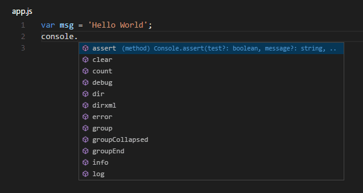

+++
title = "Node.js Tutorial"
date = 2024-01-12T22:36:24+08:00
weight = 10
type = "docs"
description = ""
isCJKLanguage = true
draft = false
+++

> 原文: [https://code.visualstudio.com/docs/nodejs/nodejs-tutorial](https://code.visualstudio.com/docs/nodejs/nodejs-tutorial)

# Node.js tutorial in Visual Studio Code Visual Studio Code 中的 Node.js 教程


[Node.js](https://nodejs.org/) is a platform for building fast and scalable server applications using JavaScript. Node.js is the runtime and [npm](https://www.npmjs.com/) is the Package Manager for Node.js modules.

​​	Node.js 是一个使用 JavaScript 构建快速且可扩展的服务器应用程序的平台。Node.js 是运行时，npm 是 Node.js 模块的包管理器。

Visual Studio Code has support for the JavaScript and TypeScript languages out-of-the-box as well as Node.js debugging. However, to run a Node.js application, you will need to install the Node.js runtime on your machine.

​​	Visual Studio Code 开箱即用地支持 JavaScript 和 TypeScript 语言以及 Node.js 调试。但是，要运行 Node.js 应用程序，您需要在计算机上安装 Node.js 运行时。

To get started in this walkthrough, [install Node.js for your platform](https://nodejs.org/en/download/). The Node Package Manager is included in the Node.js distribution. You'll need to open a new terminal (command prompt) for the `node` and `npm` command-line tools to be on your PATH.

​​	要开始本演练，请为您的平台安装 Node.js。Node 包管理器包含在 Node.js 发行版中。您需要为 `node` 和 `npm` 命令行工具打开一个新终端（命令提示符），以便它们位于您的 PATH 中。

To test that you have Node.js installed correctly on your computer, open a new terminal and type `node --version` and you should see the current Node.js version installed.

​​	要测试您是否已在计算机上正确安装 Node.js，请打开一个新终端并键入 `node --version` ，您应该会看到已安装的当前 Node.js 版本。

> **Linux**: There are specific Node.js packages available for the various flavors of Linux. See [Installing Node.js via package manager](https://nodejs.org/en/download/package-manager) to find the Node.js package and installation instructions tailored to your version of Linux.
>
> ​​	Linux：针对各种 Linux 版本提供了特定的 Node.js 软件包。请参阅通过包管理器安装 Node.js 以查找针对您版本的 Linux 量身定制的 Node.js 软件包和安装说明。

> **Windows Subsystem for Linux**: If you are on Windows, WSL is a great way to do Node.js development. You can run Linux distributions on Windows and install Node.js into the Linux environment. When coupled with the [WSL](https://marketplace.visualstudio.com/items?itemName=ms-vscode-remote.remote-wsl) extension, you get full VS Code editing and debugging support while running in the context of WSL. To learn more, go to [Developing in WSL]() or try the [Working in WSL]() tutorial.
>
> ​​	Windows 子系统适用于 Linux：如果您使用的是 Windows，WSL 是进行 Node.js 开发的绝佳方式。您可以在 Windows 上运行 Linux 发行版，并将 Node.js 安装到 Linux 环境中。与 WSL 扩展结合使用时，您可以在 WSL 上下文中运行时获得完整的 VS Code 编辑和调试支持。若要了解详细信息，请转到在 WSL 中开发或尝试在 WSL 中工作教程。

## [Hello World]()

Let's get started by creating the simplest Node.js application, "Hello World".

​​	让我们通过创建最简单的 Node.js 应用程序“Hello World”来开始。

Create an empty folder called "hello", navigate into and open VS Code:

​​	创建一个名为“hello”的空文件夹，导航到其中并打开 VS Code：

```
mkdir hello
cd hello
code .
```

> **Tip:** You can open files or folders directly from the command line. The period '.' refers to the current folder, therefore VS Code will start and open the `Hello` folder.
>
> ​​	提示：您可以直接从命令行打开文件或文件夹。句点“.”是指当前文件夹，因此 VS Code 将启动并打开 `Hello` 文件夹。

From the File Explorer toolbar, press the New File button:

​​	在文件资源管理器工具栏中，按新建文件按钮：


and name the file `app.js`:

​​	并将文件命名为 `app.js` ：


By using the `.js` file extension, VS Code interprets this file as JavaScript and will evaluate the contents with the JavaScript language service. Refer to the VS Code [JavaScript language]() topic to learn more about JavaScript support.

​​	通过使用 `.js` 文件扩展名，VS Code 将此文件解释为 JavaScript，并将使用 JavaScript 语言服务评估内容。请参阅 VS Code JavaScript 语言主题以了解有关 JavaScript 支持的详细信息。

Create a simple string variable in `app.js` and send the contents of the string to the console:

​​	在 `app.js` 中创建一个简单的字符串变量，并将字符串的内容发送到控制台：

```
var msg = 'Hello World';
console.log(msg);
```

Note that when you typed `console.` [IntelliSense]() on the `console` object was automatically presented to you.

​​	请注意，当您键入 `console.` 时， `console` 对象上的 IntelliSense 会自动显示给您。



Also notice that VS Code knows that `msg` is a string based on the initialization to `'Hello World'`. If you type `msg.` you'll see IntelliSense showing all of the string functions available on `msg`.

​​	还要注意，VS Code 知道 `msg` 是一个字符串，这是基于对 `'Hello World'` 的初始化。如果您键入 `msg.` ，您会看到 IntelliSense 显示 `msg` 上可用的所有字符串函数。


After experimenting with IntelliSense, revert any extra changes from the source code example above and save the file (Ctrl+S).

​​	在对 IntelliSense 进行试验后，还原上述源代码示例中的任何额外更改并保存文件 (Ctrl+S)。

### [Running Hello World 运行 Hello World]()

It's simple to run `app.js` with Node.js. From a terminal, just type:

​​	使用 Node.js 运行 `app.js` 非常简单。在终端中，只需键入：

```
node app.js
```

You should see "Hello World" output to the terminal and then Node.js returns.

​​	您应该会看到“Hello World”输出到终端，然后 Node.js 返回。

### [Integrated Terminal 集成终端]()

VS Code has an [integrated terminal]() which you can use to run shell commands. You can run Node.js directly from there and avoid switching out of VS Code while running command-line tools.

​​	VS Code 有一个集成终端，您可以使用它来运行 shell 命令。您可以直接从那里运行 Node.js，避免在运行命令行工具时退出 VS Code。

**View** > **Terminal** (Ctrl+` with the backtick character) will open the integrated terminal and you can run `node app.js` there:

​​	视图 > 终端（使用反引号字符 Ctrl+`）将打开集成终端，您可以在其中运行 `node app.js` ：


For this walkthrough, you can use either an external terminal or the VS Code integrated terminal for running the command-line tools.

​​	对于本演练，您可以使用外部终端或 VS Code 集成终端来运行命令行工具。

### [Debugging Hello World 调试 Hello World]()

As mentioned in the introduction, VS Code ships with a debugger for Node.js applications. Let's try debugging our simple Hello World application.

​​	如引言中所述，VS Code 附带了一个适用于 Node.js 应用程序的调试器。让我们尝试调试我们的简单 Hello World 应用程序。

To set a breakpoint in `app.js`, put the editor cursor on the first line and press F9 or click in the editor left gutter next to the line numbers. A red circle will appear in the gutter.

​​	要在 `app.js` 中设置断点，请将编辑器光标放在第一行并按 F9 或单击行号旁边的编辑器左槽。槽中将出现一个红圈。


To start debugging, select the **Run and Debug** view in the Activity Bar:

​​	要开始调试，请在活动栏中选择“运行和调试”视图：


You can now click Debug toolbar green arrow or press F5 to launch and debug "Hello World". Your breakpoint will be hit and you can view and step through the simple application. Notice that VS Code displays a different colored Status Bar to indicate it is in Debug mode and the DEBUG CONSOLE is displayed.

​​	您现在可以单击“调试”工具栏中的绿色箭头或按 F5 来启动并调试“Hello World”。您的断点将被命中，您可以查看并逐步浏览这个简单的应用程序。请注意，VS Code 显示了不同颜色的状态栏以指示它处于调试模式，并且显示了 DEBUG CONSOLE。


Now that you've seen VS Code in action with "Hello World", the next section shows using VS Code with a full-stack Node.js web app.

​​	现在您已经看到 VS Code 在“Hello World”中的实际操作，下一部分将演示如何将 VS Code 与全栈 Node.js Web 应用程序配合使用。

> **Note:** We're done with the "Hello World" example so navigate out of that folder before you create an Express app. You can delete the "Hello" folder if you want as it is not required for the rest of the walkthrough.
>
> ​​	注意：我们已经完成了“Hello World”示例，因此在创建 Express 应用程序之前，请导航出该文件夹。如果您愿意，可以删除“Hello”文件夹，因为在演练的其余部分中不需要它。

## [An Express application Express 应用程序]()

[Express](https://expressjs.com/) is a very popular application framework for building and running Node.js applications. You can scaffold (create) a new Express application using the Express Generator tool. The Express Generator is shipped as an npm module and installed by using the npm command-line tool `npm`.

​​	Express 是一个非常流行的应用程序框架，用于构建和运行 Node.js 应用程序。您可以使用 Express Generator 工具构建（创建）一个新的 Express 应用程序。Express Generator 作为 npm 模块提供，并使用 npm 命令行工具 `npm` 进行安装。

> **Tip:** To test that you've got `npm` correctly installed on your computer, type `npm --help` from a terminal and you should see the usage documentation.
>
> ​​	提示：要测试您是否已在计算机上正确安装 `npm` ，请从终端键入 `npm --help` ，您应该会看到用法文档。

Install the Express Generator by running the following from a terminal:

​​	通过从终端运行以下命令来安装 Express Generator：

```
npm install -g express-generator
```

The `-g` switch installs the Express Generator globally on your machine so you can run it from anywhere.

​​	 `-g` 开关在您的计算机上全局安装 Express Generator，以便您可以从任何地方运行它。

We can now scaffold a new Express application called `myExpressApp` by running:

​​	现在，我们可以通过运行以下命令来构建一个名为 `myExpressApp` 的新 Express 应用程序：

```
express myExpressApp --view pug
```

This creates a new folder called `myExpressApp` with the contents of your application. The `--view pug` parameters tell the generator to use the [pug](https://pugjs.org/api/getting-started.html) template engine.

​​	这将创建一个名为 `myExpressApp` 的新文件夹，其中包含应用程序的内容。 `--view pug` 参数告诉生成器使用 pug 模板引擎。

To install all of the application's dependencies (again shipped as npm modules), go to the new folder and execute `npm install`:

​​	要安装所有应用程序的依赖项（再次作为 npm 模块提供），请转到新文件夹并执行 `npm install` ：

```
cd myExpressApp
npm install
```

At this point, we should test that our application runs. The generated Express application has a `package.json` file which includes a `start` script to run `node ./bin/www`. This will start the Node.js application running.

​​	此时，我们应该测试我们的应用程序是否运行。生成的 Express 应用程序有一个 `package.json` 文件，其中包含一个 `start` 脚本来运行 `node ./bin/www` 。这将启动正在运行的 Node.js 应用程序。

From a terminal in the Express application folder, run:

​​	在 Express 应用程序文件夹中的终端中，运行：

```
npm start
```

The Node.js web server will start and you can browse to [http://localhost:3000](http://localhost:3000/) to see the running application.

​​	Node.js Web 服务器将启动，您可以浏览至 http://localhost:3000 查看正在运行的应用程序。


## [Great code editing 出色的代码编辑]()

Close the browser and from a terminal in the `myExpressApp` folder, stop the Node.js server by pressing CTRL+C.

​​	关闭浏览器，然后在 `myExpressApp` 文件夹中的终端中，按 CTRL+C 停止 Node.js 服务器。

Now launch VS Code:

​​	现在启动 VS Code：

```
code .
```

> **Note:** If you've been using the VS Code integrated terminal to install the Express generator and scaffold the app, you can open the `myExpressApp` folder from your running VS Code instance with the **File** > **Open Folder** command.
>
> ​​	注意：如果您一直在使用 VS Code 集成终端来安装 Express 生成器并构建应用程序脚手架，则可以使用“文件”>“打开文件夹”命令从正在运行的 VS Code 实例中打开 `myExpressApp` 文件夹。

The [Node.js](https://nodejs.org/api/) and [Express](https://expressjs.com/api.html) documentation does a great job explaining how to build rich applications using the platform and framework. Visual Studio Code will make you more productive in developing these types of applications by providing great code editing and navigation experiences.

​​	Node.js 和 Express 文档很好地解释了如何使用该平台和框架构建丰富的应用程序。Visual Studio Code 将通过提供出色的代码编辑和导航体验，让您在开发此类应用程序时更高效。

Open the file `app.js` and hover over the Node.js global object `__dirname`. Notice how VS Code understands that `__dirname` is a string. Even more interesting, you can get full IntelliSense against the Node.js framework. For example, you can require `http` and get full IntelliSense against the `http` class as you type in Visual Studio Code.

​​	打开文件 `app.js` 并将鼠标悬停在 Node.js 全局对象 `__dirname` 上。请注意 VS Code 如何理解 `__dirname` 是一个字符串。更有趣的是，您可以针对 Node.js 框架获得完整的 IntelliSense。例如，您可以 require `http` 并随着在 Visual Studio Code 中键入内容而针对 `http` 类获得完整的 IntelliSense。


VS Code uses TypeScript type declaration (typings) files (for example `node.d.ts`) to provide metadata to VS Code about the JavaScript based frameworks you are consuming in your application. Type declaration files are written in TypeScript so they can express the data types of parameters and functions, allowing VS Code to provide a rich IntelliSense experience. Thanks to a feature called `Automatic Type Acquisition`, you do not have to worry about downloading these type declaration files, VS Code will install them automatically for you.

​​	VS Code 使用 TypeScript 类型声明（typings）文件（例如 `node.d.ts` ）向 VS Code 提供有关您在应用程序中使用的基于 JavaScript 的框架的元数据。类型声明文件使用 TypeScript 编写，因此它们可以表示参数和函数的数据类型，从而允许 VS Code 提供丰富的 IntelliSense 体验。感谢一项名为 `Automatic Type Acquisition` 的功能，您不必担心下载这些类型声明文件，VS Code 会自动为您安装它们。

You can also write code that references modules in other files. For example, in `app.js` we require the `./routes/index` module, which exports an `Express.Router` class. If you bring up IntelliSense on `index`, you can see the shape of the `Router` class.

​​	您还可以编写引用其他文件中模块的代码。例如，在 `app.js` 中，我们要求 `./routes/index` 模块，该模块导出 `Express.Router` 类。如果您在 `index` 上调出 IntelliSense，则可以看到 `Router` 类的形状。


## [Debug your Express app 调试您的 Express 应用程序]()

You will need to create a debugger configuration file `launch.json` for your Express application. Click on **Run and Debug** in the **Activity Bar** (Ctrl+Shift+D) and then select the **create a launch.json file** link to create a default `launch.json` file. Select the **Node.js** environment by ensuring that the `type` property in `configurations` is set to `"node"`. When the file is first created, VS Code will look in `package.json` for a `start` script and will use that value as the `program` (which in this case is `"${workspaceFolder}\\bin\\www`) for the **Launch Program** configuration.

​​	对于您的 Express 应用程序，您需要创建一个调试器配置文件 `launch.json` 。单击活动栏中的运行和调试（Ctrl+Shift+D），然后选择创建 launch.json 文件链接以创建一个默认的 `launch.json` 文件。通过确保 `configurations` 中的 `type` 属性设置为 `"node"` 来选择 Node.js 环境。首次创建文件时，VS Code 将在 `package.json` 中查找 `start` 脚本，并将该值用作启动程序配置的 `program` （在本例中为 `"${workspaceFolder}\\bin\\www` ）。

```
{
  "version": "0.2.0",
  "configurations": [
    {
      "type": "node",
      "request": "launch",
      "name": "Launch Program",
      "program": "${workspaceFolder}\\bin\\www"
    }
  ]
}
```

Save the new file and make sure **Launch Program** is selected in the configuration dropdown at the top of the **Run and Debug** view. Open `app.js` and set a breakpoint near the top of the file where the Express app object is created by clicking in the gutter to the left of the line number. Press F5 to start debugging the application. VS Code will start the server in a new terminal and hit the breakpoint we set. From there you can inspect variables, create watches, and step through your code.

​​	保存新文件，并确保在运行和调试视图顶部的配置下拉列表中选择了启动程序。打开 `app.js` ，并在通过单击行号左侧的边距来创建 Express 应用对象的文件顶部附近设置一个断点。按 F5 开始调试应用程序。VS Code 将在新终端中启动服务器，并命中我们设置的断点。从那里，您可以检查变量、创建监视，并逐步执行代码。


## [Deploy your application 部署您的应用程序]()

If you'd like to learn how to deploy your web application, check out the [Deploying Applications to Azure]() tutorials where we show how to run your website in Azure.

​​	如果您想了解如何部署您的 Web 应用程序，请查看将应用程序部署到 Azure 教程，其中演示了如何在 Azure 中运行您的网站。

------

## [Next steps 后续步骤]()

There is much more to explore with Visual Studio Code, please try the following topics:

​​	Visual Studio Code 中还有更多内容可供探索，请尝试以下主题：

- [Node.js profile template]() - Create a new [profile]() with a curated set of extensions, settings, and snippets.
  Node.js 配置文件模板 - 使用精选的扩展、设置和代码段创建新的配置文件。
- [Settings]() - Learn how to customize VS Code for how you like to work.
  设置 - 了解如何自定义 VS Code 以适应您的工作方式。
- [Debugging]() - This is where VS Code really shines.
  调试 - 这是 VS Code 真正出彩的地方。
- [Video: Getting started with Node.js debugging](https://www.youtube.com/watch?v=2oFKNL7vYV8) - Learn how to attach to a running Node.js process.
  视频：开始使用 Node.js 调试 - 了解如何附加到正在运行的 Node.js 进程。
- [Node.js debugging]() - Learn more about VS Code's built-in Node.js debugging.
  Node.js 调试 - 详细了解 VS Code 内置的 Node.js 调试。
- [Debugging recipes]() - Examples for scenarios like client-side and container debugging.
  调试食谱 - 客户端和容器调试等场景的示例。
- [Tasks]() - Running tasks with Gulp, Grunt and Jake. Showing Errors and Warnings.
  任务 - 使用 Gulp、Grunt 和 Jake 运行任务。显示错误和警告。
