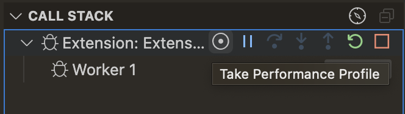
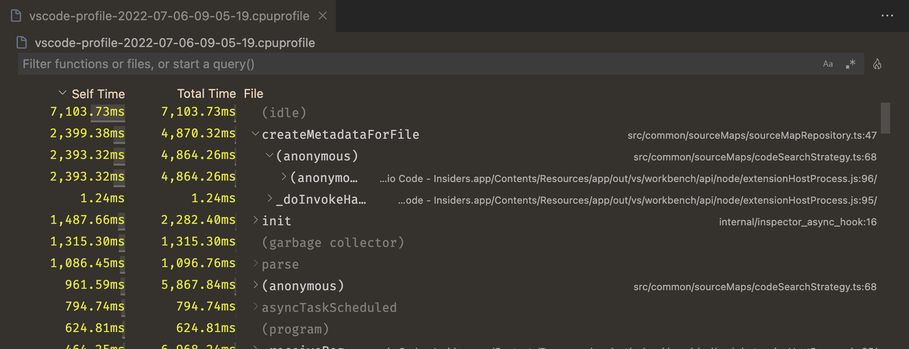
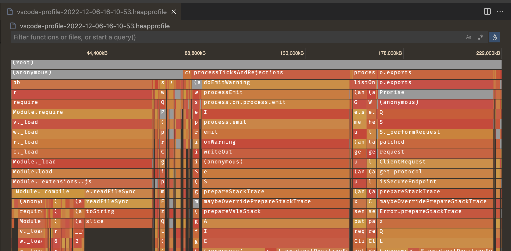
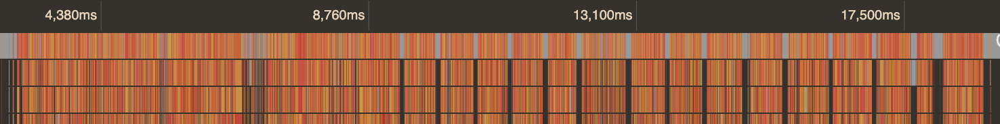
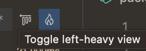
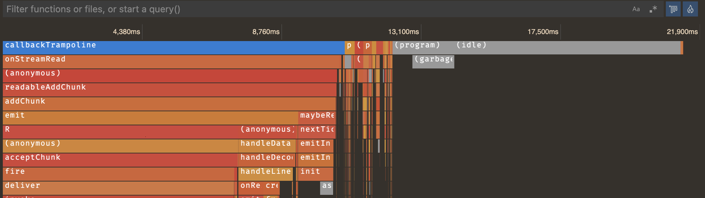

+++
title = "Performance Profiling"
date = 2024-01-12T22:36:24+08:00
weight = 90
type = "docs"
description = ""
isCJKLanguage = true
draft = false
+++

> 原文: [https://code.visualstudio.com/docs/nodejs/profiling](https://code.visualstudio.com/docs/nodejs/profiling)

# Performance Profiling JavaScript 性能分析 JavaScript


Visual Studio Code supports collecting and viewing performance profiles for JavaScript programs. To get started, you'll first need to have the debugger configured for your [Node.js program]() or [browser app]().

​​	Visual Studio Code 支持收集和查看 JavaScript 程序的性能分析。要开始，您首先需要为 Node.js 程序或浏览器应用配置调试器。

## [Types of profiles 分析类型]()

Depending on what you want to optimize, there are different kinds of profiles you may want to take.

​​	根据您想要优化什么，您可以进行不同类型的分析。

- **CPU Profile** - A CPU profile tells you where your program is spending its time while in JavaScript. Remember that, while you can wait on asynchronous promises or callbacks, only one JavaScript expression is executed at a time. The CPU profile collects about 10,000 samples per second to tell you which expression--if any--is being run at that moment.
  CPU 分析 - CPU 分析会告诉您程序在 JavaScript 中花费时间的位置。请记住，虽然您可以等待异步承诺或回调，但一次只能执行一个 JavaScript 表达式。CPU 分析每秒收集大约 10,000 个样本，以告诉您在那一刻正在运行哪个表达式（如果有）。
- **Heap Profile** - A heap profile tells you how memory is allocated over time in your program. Allocating memory can be costly, and reducing the amount of memory your code allocates can lead to performance wins.
  堆分析 - 堆分析会告诉您程序中内存是如何随着时间分配的。分配内存可能会很昂贵，减少代码分配的内存量可以提高性能。
- **Heap Snapshot** - A heap snapshot is an instantaneous view of where your program has allocated memory. If you notice your program is using a lot of RAM and want to find out where it's coming from, a heap snapshot can be useful. Note that collecting a heap snapshot can take several minutes for more complex programs, and viewing heap snapshots is not currently supported in the built-in editor.
  堆快照 - 堆快照是程序已分配内存位置的即时视图。如果您注意到程序正在使用大量 RAM，并且想要找出原因，堆快照会很有用。请注意，对于更复杂的程序，收集堆快照可能需要几分钟，并且内置编辑器目前不支持查看堆快照。

## [Collecting a profile 收集分析信息]()

To collect a profile, you'll need to be debugging your program. Once you are, you can collect a profile through a few methods:

​​	要收集分析信息，您需要调试程序。一旦开始调试，您可以通过以下几种方法收集分析信息：

- Using the 'record' button in the **Call Stack** view. This allows you to take CPU profiles, heap profiles, and heap snapshots.
  使用调用堆栈视图中的“记录”按钮。这允许您获取 CPU 分析信息、堆分析信息和堆快照。
- By calling `console.profile()` in your program. This will collect a CPU profile.
  在程序中调用 `console.profile()` 。这将收集 CPU 分析信息。

### [Using the record button 使用记录按钮]()

Once you're debugging, switch to the Run and Debug view (Ctrl+Shift+D), and find the **Call Stack** view. Hover over the session you want to debug, and select the **Take Performance Profile** button. You can also run this command from the Command Palette (Ctrl+Shift+P).

​​	开始调试后，切换到运行和调试视图 (Ctrl+Shift+D)，然后找到调用堆栈视图。将鼠标悬停在要调试的会话上，然后选择“获取性能分析信息”按钮。您还可以从命令面板 (Ctrl+Shift+P) 运行此命令。



VS Code will then ask what [type of performance]() profile you'd like to take; pick the one that's relevant for you.

​​	然后，VS Code 将询问您要获取哪种类型的性能分析信息；选择与您相关的一种。

Finally, VS Code will ask when you want to stop taking a profile. You can choose to either:

​​	最后，VS Code 会询问您何时想要停止获取配置文件。您可以选择：

- Take the profile until you stop it manually.
  获取配置文件，直到您手动停止它。
- Take the profile for a set duration.
  获取配置文件一段时间。
- Take the profile until you hit a certain breakpoint.
  获取配置文件，直到您命中某个断点。

If you chose the first option, you can stop the profile by clicking the big red "record" icon shown in the debug toolbar. After the profile is collected, the [profile viewer]() will open automatically.

​​	如果您选择了第一个选项，您可以通过单击调试工具栏中显示的大红色“记录”图标来停止获取配置文件。收集配置文件后，配置文件查看器将自动打开。

### [Using console.profile 使用 console.profile]()

You can manually instrument your code using calls to `console.profile` to start a profile, and `console.profileEnd` to stop a profile. A CPU profile will be collected between these two call sites.

​​	您可以使用对 `console.profile` 的调用手动分析您的代码以启动配置文件，并使用对 `console.profileEnd` 的调用来停止配置文件。将在这两个调用站点之间收集 CPU 配置文件。

```
console.profile();
doSomeVeryExpensiveWork();
console.profileEnd();
```

The resulting `.cpuprofile` will be saved in your workspace folder automatically. You can select that file to open it in the built-in [profile viewer]().

​​	生成的 `.cpuprofile` 将自动保存在您的工作区文件夹中。您可以选择该文件以在内置配置文件查看器中将其打开。

## [Analyzing a profile 分析配置文件]()

### [Table view 表格视图]()

VS Code has an integrated visualizer that supports viewing JavaScript `.cpuprofile` and `.heapprofile` files. When you open one of these files, you will first be presented with a table view that looks something like this:

​​	VS Code 具有一个集成的可视化工具，支持查看 JavaScript `.cpuprofile` 和 `.heapprofile` 文件。当您打开其中一个文件时，首先会看到一个表格视图，如下所示：



This is a **bottom-up** view of your program. Each row represents a function in your program, and by default they're ordered by how much time is spent in that specific function. This is also known as the "Self Time". The "Total Time" of a function is the sum of the time spent in that function and all functions that it calls. You can expand each table row to see where that function was called from.

​​	这是程序的自底向上视图。每行代表程序中的一个函数，默认情况下，它们按在该特定函数中花费的时间排序。这也称为“自身时间”。函数的“总时间”是该函数和它调用的所有函数中花费的时间之和。您可以展开每个表格行，以查看该函数从何处被调用。

For example, take the following code:

​​	例如，采用以下代码：

```
function a() {
  doSomethingFor5Seconds();
  b();
}

function b() {
  doSomethingFor3Seconds();
}

a();
```

In this case, the Self Time for `a` would be 5 seconds and the Total Time for `a` is 8 seconds. Both the Self Time and Total Time for `b` is 3 seconds. Heap profiles operate the same way, but use Self Size and Total Size to indicate the amount of memory that was allocated in each function, or its callees.

​​	在这种情况下， `a` 的自身时间为 5 秒， `a` 的总时间为 8 秒。 `b` 的自身时间和总时间均为 3 秒。堆配置文件以相同的方式运行，但使用自身大小和总大小来指示在每个函数或其被调用者中分配的内存量。

### [Flame view 火焰视图]()

The table view is nice for certain cases, but often you may want to see a more visual representation of the profile. You can do this by clicking the flame 🔥 icon in the top right-hand side of the table view. If you have not already, you'll be prompted to install an additional extension that provides the flame view editor.

​​	表格视图适用于某些情况，但通常您可能希望看到更直观的配置文件表示形式。您可以通过单击表格视图右上角的火焰 🔥 图标来执行此操作。如果您尚未安装，系统将提示您安装提供火焰视图编辑器的其他扩展程序。



This might look confusing initially, but fear not, we'll make sense of it!

​​	这最初看起来可能令人困惑，但别担心，我们会弄清楚的！

For CPU profiles, the horizontal axis is the timeline of the profile, allowing you to see what your program was doing at each moment in time. For heap profiles, the horizontal axis is the total memory allocated by the program.

​​	对于 CPU 配置文件，水平轴是配置文件的时间线，允许您查看程序在每个时间点执行的操作。对于堆配置文件，水平轴是程序分配的总内存。

Each bar, or 'flame', in the graph, is a call stack. The outermost, top-level function call (or, the 'bottom' of the call stack) is show at the top of the editor, and the functions that it calls are shown below. The width of the bar is determined by its Total Time or Total Memory.

​​	图表中的每个条形或“火焰”都是一个调用堆栈。最外层的顶级函数调用（或调用堆栈的“底部”）显示在编辑器的顶部，它调用的函数显示在下面。条形的宽度由其总时间或总内存决定。

You can click on an entry in the flame graph to view more information about it, and you can zoom in and out using the mouse wheel. You may also drag anywhere on the chart to navigate if you've zoomed in.

​​	您可以单击火焰图中的条目以查看有关它的更多信息，并且可以使用鼠标滚轮放大和缩小。如果已放大，您还可以拖动图表上的任意位置以导航。

### [Left-heavy view 左重视图]()

If you're working with a CPU profile, there's a good chance the flame graph you're looking at is not as understandable as the one above. You might have lots of individual call stacks that look like this:

​​	如果您使用的是 CPU 配置文件，则您正在查看的火焰图很可能不如上面的那个易于理解。您可能有很多看起来像这样的单独调用堆栈：



For easier analysis, VS Code profiles a "left-heavy" view that groups all similar call stacks together.

​​	为了便于分析，VS Code 会对“左重”视图进行分析，该视图将所有类似的调用堆栈组合在一起。



This switches from a chronological view of the profile to something more similar to the Heap Profile. The horizontal axis is still the total profile duration, but each bar represents the Total Time of that function call across **all** times it was called from that stack.

​​	这会从配置文件的时间顺序视图切换到更类似于堆配置文件的内容。水平轴仍然是配置文件的总持续时间，但每个条形图都表示从该堆栈调用该函数的所有时间内的总时间。



This view is much more useful for certain applications, such as servers, where individual calls may be relatively fast, but you want to find out what were the overall most costly functions across many invocations.

​​	此视图对于某些应用程序（例如服务器）非常有用，在这些应用程序中，单个调用可能相对较快，但您希望找出在多次调用中总体上最昂贵的函数是什么。
