+++
title = "React Tutorial"
date = 2024-01-12T22:36:24+08:00
weight = 60
type = "docs"
description = ""
isCJKLanguage = true
draft = false
+++

> 原文: [https://code.visualstudio.com/docs/nodejs/reactjs-tutorial](https://code.visualstudio.com/docs/nodejs/reactjs-tutorial)

# Using React in Visual Studio Code 在 Visual Studio Code 中使用 React


[React](https://reactjs.org/) is a popular JavaScript library developed by Facebook for building user interfaces. The Visual Studio Code editor supports React.js IntelliSense and code navigation out of the box.

​​	React 是由 Facebook 开发的用于构建用户界面的流行 JavaScript 库。Visual Studio Code 编辑器支持开箱即用的 React.js IntelliSense 和代码导航。

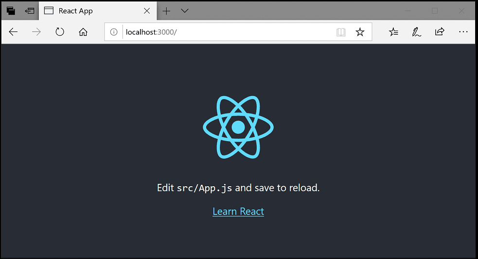

## [Welcome to React 欢迎使用 React](https://code.visualstudio.com/docs/nodejs/reactjs-tutorial#_welcome-to-react)

We'll be using the `create-react-app` [generator](https://reactjs.org/docs/create-a-new-react-app.html#create-react-app) for this tutorial. To use the generator as well as run the React application server, you'll need [Node.js](https://nodejs.org/) JavaScript runtime and [npm](https://www.npmjs.com/) (Node.js package manager) installed. npm is included with Node.js which you can download and install from [Node.js downloads](https://nodejs.org/en/download/).

​​	我们将在本教程中使用 `create-react-app` 生成器。要使用生成器以及运行 React 应用程序服务器，您需要安装 Node.js JavaScript 运行时和 npm（Node.js 包管理器）。npm 包含在 Node.js 中，您可以从 Node.js 下载下载并安装。

> **Tip**: To test that you have Node.js and npm correctly installed on your machine, you can type `node --version` and `npm --version` in a terminal or command prompt.
>
> ​​	提示：要测试您的计算机上是否正确安装了 Node.js 和 npm，您可以在终端或命令提示符中键入 `node --version` 和 `npm --version` 。

You can now create a new React application by typing:

​​	您现在可以通过键入以下内容来创建新的 React 应用程序：

```
npx create-react-app my-app
```

where `my-app` is the name of the folder for your application. This may take a few minutes to create the React application and install its dependencies.

​​	其中 `my-app` 是应用程序文件夹的名称。这可能需要几分钟来创建 React 应用程序并安装其依赖项。

> **Note**: If you've previously installed `create-react-app` globally via `npm install -g create-react-app`, we recommend you uninstall the package using `npm uninstall -g create-react-app` to ensure that npx always uses the latest version.
>
> ​​	注意：如果您之前通过 `npm install -g create-react-app` 全局安装了 `create-react-app` ，我们建议您使用 `npm uninstall -g create-react-app` 卸载该软件包，以确保 npx 始终使用最新版本。

Let's quickly run our React application by navigating to the new folder and typing `npm start` to start the web server and open the application in a browser:

​​	让我们快速运行我们的 React 应用程序，方法是导航到新文件夹并键入 `npm start` 以启动 Web 服务器并在浏览器中打开应用程序：

```
cd my-app
npm start
```

You should see the React logo and a link to "Learn React" on [http://localhost:3000](http://localhost:3000/) in your browser. We'll leave the web server running while we look at the application with VS Code.

​​	在浏览器中，您应该在 http://localhost:3000 上看到 React 徽标和“学习 React”的链接。当我们使用 VS Code 查看应用程序时，我们将让 Web 服务器保持运行状态。

To open your React application in VS Code, open another terminal or command prompt window, navigate to the `my-app` folder and type `code .`:

​​	要在 VS Code 中打开 React 应用程序，请打开另一个终端或命令提示符窗口，导航到 `my-app` 文件夹，然后键入 `code .` ：

```
cd my-app
code .
```

### [Markdown preview Markdown 预览](https://code.visualstudio.com/docs/nodejs/reactjs-tutorial#_markdown-preview)

In the File Explorer, one file you'll see is the application `README.md` Markdown file. This has lots of great information about the application and React in general. A nice way to review the README is by using the VS Code [Markdown Preview](https://code.visualstudio.com/docs/languages/markdown#_markdown-preview). You can open the preview in either the current editor group (**Markdown: Open Preview** Ctrl+Shift+V) or in a new editor group to the side (**Markdown: Open Preview to the Side** Ctrl+K V). You'll get nice formatting, hyperlink navigation to headers, and syntax highlighting in code blocks.

​​	在文件资源管理器中，您将看到的一个文件是应用程序 `README.md` Markdown 文件。其中包含有关应用程序和 React 的大量重要信息。查看自述文件的一种好方法是使用 VS Code Markdown 预览。您可以在当前编辑器组（Markdown：打开预览 Ctrl+Shift+V）或侧面的新编辑器组（Markdown：向侧面打开预览 Ctrl+K V）中打开预览。您将在代码块中获得漂亮的格式、到标题的超链接导航和语法突出显示。

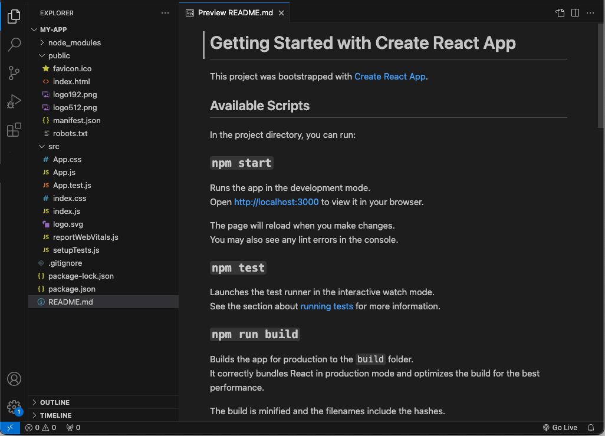

### [Syntax highlighting and bracket matching 语法突出显示和括号匹配](https://code.visualstudio.com/docs/nodejs/reactjs-tutorial#_syntax-highlighting-and-bracket-matching)

Now expand the `src` folder and select the `index.js` file. You'll notice that VS Code has syntax highlighting for the various source code elements and, if you put the cursor on a parenthesis, the matching bracket is also selected.

​​	现在展开 `src` 文件夹并选择 `index.js` 文件。您会注意到 VS Code 为各种源代码元素提供了语法突出显示，如果您将光标放在括号上，也会选择匹配的括号。

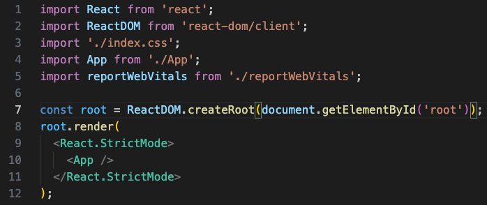

### [IntelliSense](https://code.visualstudio.com/docs/nodejs/reactjs-tutorial#_intellisense)

As you start typing in `index.js`, you'll see smart suggestions or completions.

​​	当您开始在 `index.js` 中键入时，您将看到智能建议或自动完成。

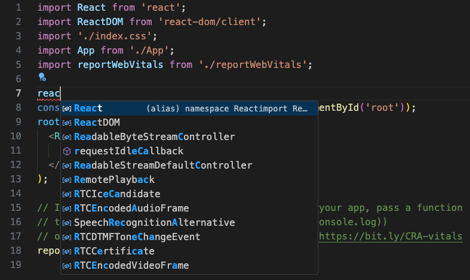

After you select a suggestion and type `.`, you see the types and methods on the object through [IntelliSense](https://code.visualstudio.com/docs/editor/intellisense).

​​	选择建议并键入 `.` 后，您将通过 IntelliSense 看到对象上的类型和方法。

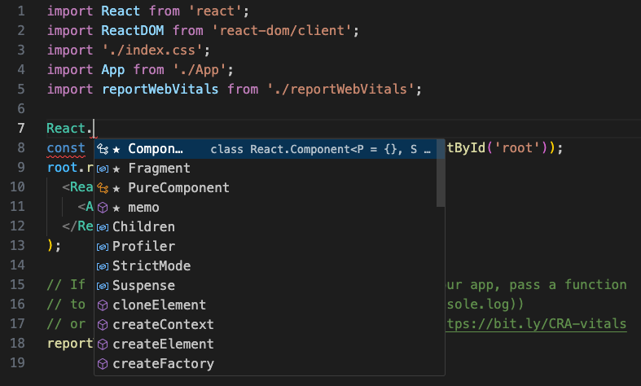

VS Code uses the TypeScript language service for its JavaScript code intelligence and it has a feature called [Automatic Type Acquisition](https://code.visualstudio.com/docs/nodejs/working-with-javascript#_typings-and-automatic-type-acquisition) (ATA). ATA pulls down the npm Type Declaration files (`*.d.ts`) for the npm modules referenced in the `package.json`.

​​	VS Code 使用 TypeScript 语言服务来实现其 JavaScript 代码智能，并且它有一个名为自动类型获取 (ATA) 的功能。ATA 会提取 `package.json` 中引用的 npm 模块的 npm 类型声明文件 ( `*.d.ts` )。

If you select a method, you'll also get parameter help:

​​	如果您选择一个方法，您还将获得参数帮助：

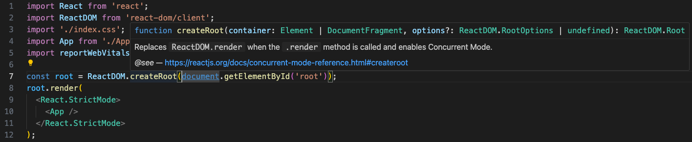

### [Go to Definition, Peek definition 转到定义、查看定义](https://code.visualstudio.com/docs/nodejs/reactjs-tutorial#_go-to-definition-peek-definition)

Through the TypeScript language service, VS Code can also provide type definition information in the editor through **Go to Definition** (F12) or **Peek Definition** (Alt+F12). Put the cursor over the `App`, right click and select **Peek Definition**. A [Peek window](https://code.visualstudio.com/docs/editor/editingevolved#_peek) will open showing the `App` definition from `App.js`.

​​	通过 TypeScript 语言服务，VS Code 还可以在编辑器中通过转到定义 (F12) 或查看定义 (Alt+F12) 提供类型定义信息。将光标放在 `App` 上，右键单击并选择查看定义。将打开一个查看窗口，显示来自 `App.js` 的 `App` 定义。

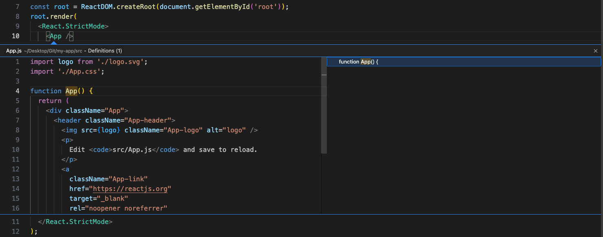

Press Escape to close the Peek window.

​​	按 Escape 关闭查看窗口。

## [Hello World](https://code.visualstudio.com/docs/nodejs/reactjs-tutorial#_hello-world)

Let's update the sample application to "Hello World!". Create a component inside `index.js` called `HelloWorld` that contains a H1 header with "Hello, world!" and replace the `<App />` tag in `root.render` with `<HelloWorld />`.

​​	我们来将示例应用程序更新为“Hello World!”。在 `index.js` 内创建一个名为 `HelloWorld` 的组件，其中包含一个带有“Hello, world!”的 H1 标题，并将 `root.render` 中的 `<App />` 标记替换为 `<HelloWorld />` 。

```
import React from 'react';
import ReactDOM from 'react-dom/client';
import './index.css';
import App from './App';
import reportWebVitals from './reportWebVitals';

function HelloWorld() {
  return <h1 className="greeting">Hello, world!</h1>;
}

const root = ReactDOM.createRoot(document.getElementById('root'));
root.render(
  <React.StrictMode>
    <HelloWorld />
  </React.StrictMode>
);

// If you want to start measuring performance in your app, pass a function
// to log results (for example: reportWebVitals(console.log))
// or send to an analytics endpoint. Learn more: https://bit.ly/CRA-vitals
reportWebVitals();
```

Once you save the `index.js` file, the running instance of the server will update the web page and you'll see "Hello World!" when you refresh your browser.

​​	一旦您保存 `index.js` 文件，服务器的正在运行的实例将更新网页，当您刷新浏览器时，您将看到“Hello World!”。

> **Tip**: VS Code supports Auto Save, which by default saves your files after a delay. Check the **Auto Save** option in the **File** menu to turn on Auto Save or directly configure the `files.autoSave` user [setting](https://code.visualstudio.com/docs/getstarted/settings).
>
> ​​	提示：VS Code 支持自动保存，默认情况下会在延迟后保存您的文件。选中“文件”菜单中的“自动保存”选项以启用自动保存，或直接配置 `files.autoSave` 用户设置。

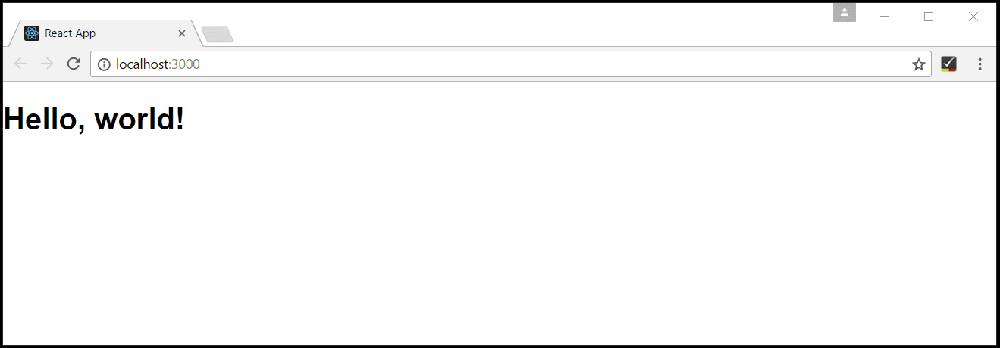

## [Debugging React 调试 React](https://code.visualstudio.com/docs/nodejs/reactjs-tutorial#_debugging-react)

To debug the client side React code, we'll use the built-in JavaScript debugger.

​​	要调试客户端 React 代码，我们将使用内置的 JavaScript 调试器。

> Note: This tutorial assumes you have the Edge browser installed. If you want to debug using Chrome, replace the launch `type` with `chrome`. There is also a debugger for the [Firefox](https://marketplace.visualstudio.com/items?itemName=hbenl.vscode-firefox-debug) browser.
>
> ​​	注意：本教程假定您已安装 Edge 浏览器。如果您想使用 Chrome 进行调试，请将启动 `type` 替换为 `chrome` 。Firefox 浏览器也有一个调试器。

### [Set a breakpoint 设置断点](https://code.visualstudio.com/docs/nodejs/reactjs-tutorial#_set-a-breakpoint)

To set a breakpoint in `index.js`, click on the gutter to the left of the line numbers. This will set a breakpoint which will be visible as a red circle.

​​	要在 `index.js` 中设置断点，请单击行号左侧的标尺。这将设置一个断点，该断点将显示为一个红圈。

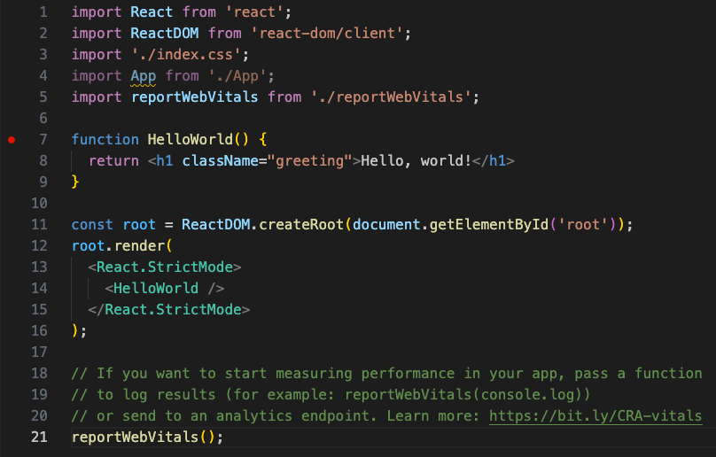

### [Configure the debugger 配置调试器](https://code.visualstudio.com/docs/nodejs/reactjs-tutorial#_configure-the-debugger)

We need to initially configure the [debugger](https://code.visualstudio.com/docs/editor/debugging). To do so, go to the **Run and Debug** view (Ctrl+Shift+D) and select the **create a launch.json file** link to create a `launch.json` debugger configuration file. Choose **Web App (Edge)** from the **Select debugger** dropdown list. This will create a `launch.json` file in a new `.vscode` folder in your project which includes a configuration to launch the website.

​​	我们需要先配置调试器。为此，请转到“运行和调试”视图（Ctrl+Shift+D），然后选择“创建 launch.json 文件”链接以创建一个 `launch.json` 调试器配置文件。从“选择调试器”下拉列表中选择“Web App（Edge）”。这将在项目中的新 `.vscode` 文件夹中创建一个 `launch.json` 文件，其中包含用于启动网站的配置。

We need to make one change for our example: change the port of the `url` from `8080` to `3000`. Your `launch.json` should look like this:

​​	我们需要为示例进行一项更改：将 `url` 的端口从 `8080` 更改为 `3000` 。您的 `launch.json` 应如下所示：

```
{
  "version": "0.2.0",
  "configurations": [
    {
      "type": "msedge",
      "request": "launch",
      "name": "Launch Edge against localhost",
      "url": "http://localhost:3000",
      "webRoot": "${workspaceFolder}"
    }
  ]
}
```

Ensure that your development server is running (`npm start`). Then press F5 or the green arrow to launch the debugger and open a new browser instance. The source code where the breakpoint is set runs on startup before the debugger was attached, so we won't hit the breakpoint until we refresh the web page. Refresh the page and you should hit your breakpoint.

​​	确保您的开发服务器正在运行 ( `npm start` )。然后按 F5 或绿色箭头启动调试器并打开新的浏览器实例。设置断点的源代码在调试器附加之前启动时运行，因此在刷新网页之前我们不会遇到断点。刷新页面，您应该会遇到断点。

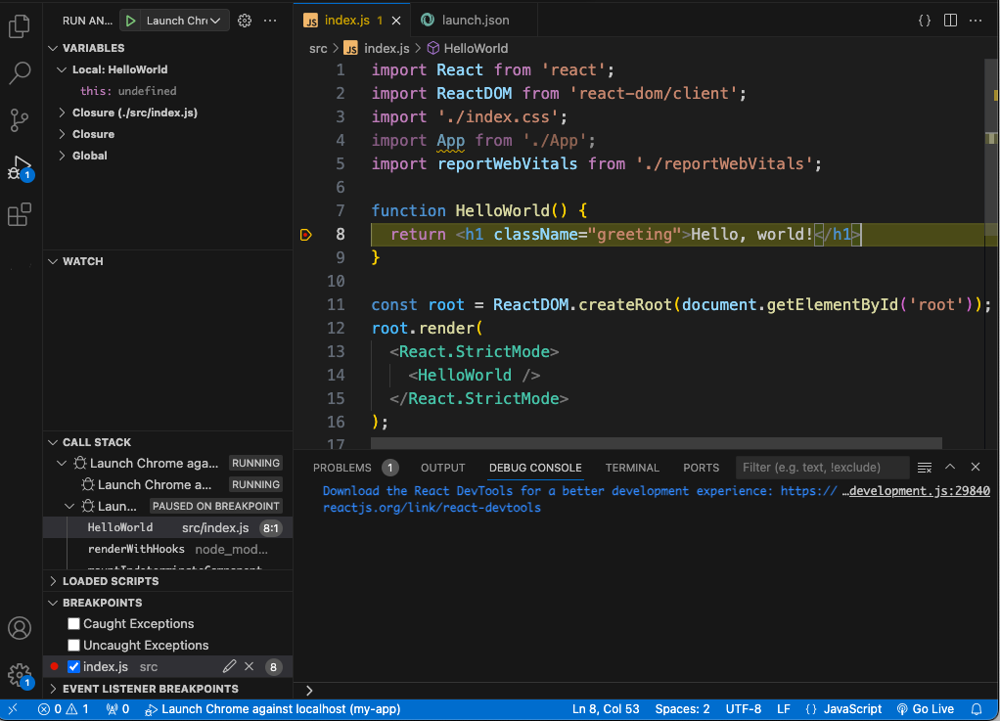

You can step through your source code (F10), inspect variables such as `HelloWorld`, and see the call stack of the client side React application.

​​	您可以逐步浏览源代码 (F10)，检查变量（例如 `HelloWorld` ），并查看客户端 React 应用程序的调用堆栈。

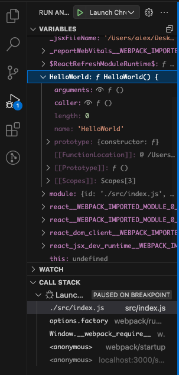

For more information about the debugger and its available options, check out our documentation on [browser debugging](https://code.visualstudio.com/docs/nodejs/browser-debugging).

​​	有关调试器及其可用选项的更多信息，请查看我们关于浏览器调试的文档。

### [Live editing and debugging 实时编辑和调试](https://code.visualstudio.com/docs/nodejs/reactjs-tutorial#_live-editing-and-debugging)

If you are using [webpack](https://webpack.js.org/) together with your React app, you can have a more efficient workflow by taking advantage of webpack's HMR mechanism which enables you to have live editing and debugging directly from VS Code. You can learn more in this [Live edit and debug your React apps directly from VS Code](https://medium.com/@auchenberg/live-edit-and-debug-your-react-apps-directly-from-vs-code-without-leaving-the-editor-3da489ed905f) blog post and the [webpack Hot Module Replacement documentation](https://webpack.js.org/concepts/hot-module-replacement/).

​​	如果您将 webpack 与 React 应用程序一起使用，您可以利用 webpack 的 HMR 机制来获得更高效的工作流，这使您能够直接从 VS Code 进行实时编辑和调试。您可以在此 Live edit and debug your React apps directly from VS Code 博客文章和 webpack 热模块替换文档中了解更多信息。

## [Linting](https://code.visualstudio.com/docs/nodejs/reactjs-tutorial#_linting)

Linters analyze your source code and can warn you about potential problems before you run your application. The JavaScript language services included with VS Code has syntax error checking support by default, which you can see in action in the **Problems** panel (**View** > **Problems** Ctrl+Shift+M).

​​	Linters 会分析您的源代码，并在您运行应用程序之前警告您潜在的问题。VS Code 附带的 JavaScript 语言服务默认具有语法错误检查支持，您可以在“问题”面板（“视图”>“问题”Ctrl+Shift+M）中看到该支持的实际应用。

Try making a small error in your React source code and you'll see a red squiggle and an error in the **Problems** panel.

​​	尝试在 React 源代码中制造一个小错误，您会看到一个红色的波浪线和“问题”面板中的错误。

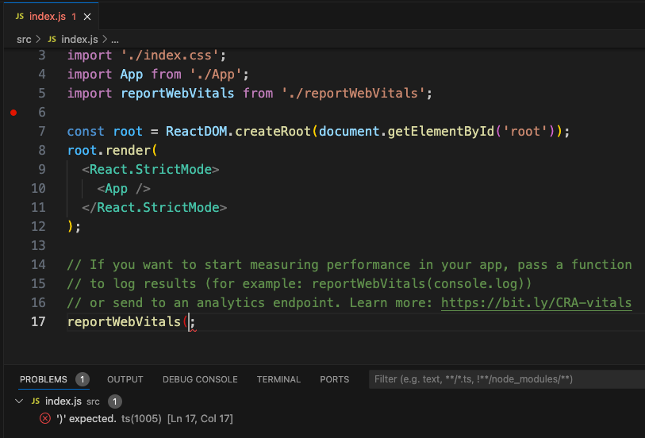

Linters can provide more sophisticated analysis, enforcing coding conventions and detecting anti-patterns. A popular JavaScript linter is [ESLint](https://eslint.org/). ESLint, when combined with the ESLint VS Code [extension](https://marketplace.visualstudio.com/items/dbaeumer.vscode-eslint), provides a great in-product linting experience.

​​	linter 可以提供更复杂的分析，强制执行编码约定并检测反模式。ESLint 是一款流行的 JavaScript linter。ESLint 与 ESLint VS Code 扩展结合使用时，可提供出色的产品内 linting 体验。

First, install the ESLint command-line tool:

​​	首先，安装 ESLint 命令行工具：

```
npm install -g eslint
```

Then install the ESLint extension by going to the **Extensions** view and typing 'eslint'.

​​	然后，通过转到“扩展”视图并键入“eslint”来安装 ESLint 扩展。

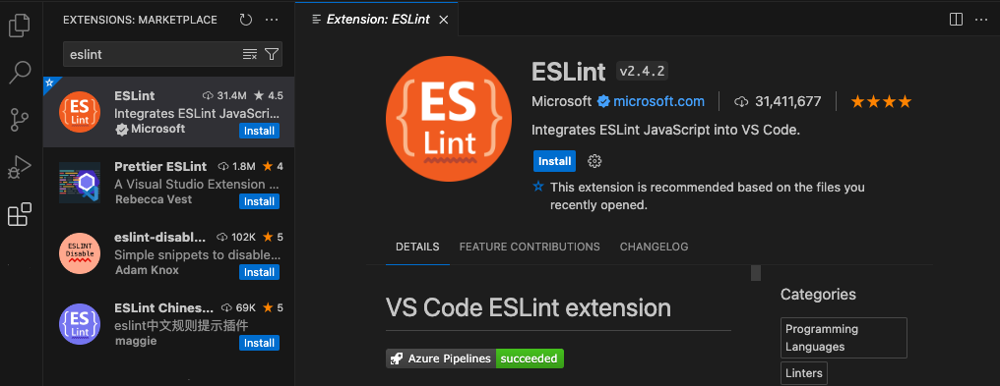

Once the ESLint extension is installed and VS Code reloaded, you'll want to create an ESLint configuration file, `.eslintrc.js`. You can create one using the extension's **ESLint: Create ESLint configuration** command from the **Command Palette** (Ctrl+Shift+P).

​​	安装 ESLint 扩展并重新加载 VS Code 后，您需要创建一个 ESLint 配置文件 `.eslintrc.js` 。您可以使用扩展的 ESLint：从命令面板（Ctrl+Shift+P）创建 ESLint 配置命令创建一个。

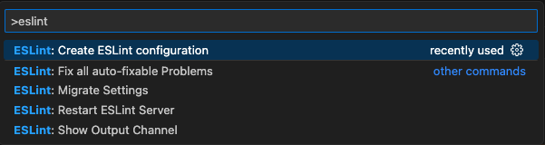

The command will prompt you to answer a series of questions in the **Terminal** panel. Take the defaults, and it will create a `.eslintrc.js` file in your project root that looks something like this:

​​	该命令会提示您在“终端”面板中回答一系列问题。采用默认值，它将在您的项目根目录中创建一个 `.eslintrc.js` 文件，如下所示：

```
module.exports = {
  env: {
    browser: true,
    es2020: true
  },
  extends: ['eslint:recommended', 'plugin:react/recommended'],
  parserOptions: {
    ecmaFeatures: {
      jsx: true
    },
    ecmaVersion: 11,
    sourceType: 'module'
  },
  plugins: ['react'],
  rules: {}
};
```

ESLint will now analyze open files and shows a warning in `index.js` about 'App' being defined but never used.

​​	ESLint 现在会分析打开的文件，并在 `index.js` 中显示有关“App”已定义但从未使用的警告。

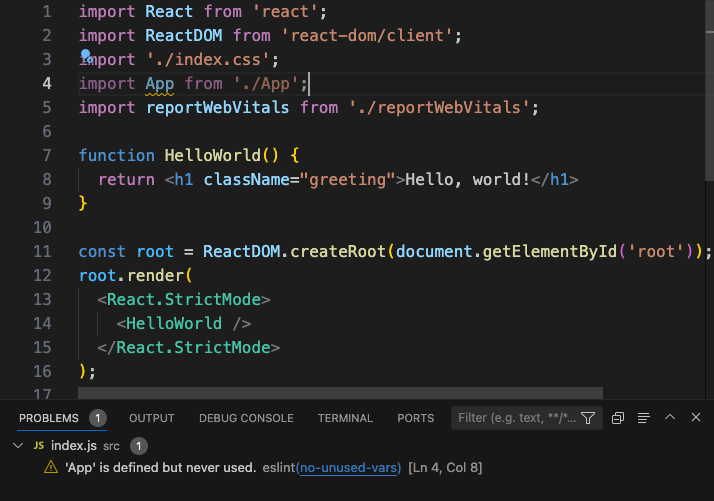

You can modify the ESLint [rules](https://eslint.org/docs/rules/) in the `.eslintrc.js` file.

​​	您可以在 `.eslintrc.js` 文件中修改 ESLint 规则。

Let's add an error rule for extra semi-colons:

​​	我们来添加一个针对多余分号的错误规则：

```
 "rules": {
        "no-extra-semi":"error"
    }
```

Now when you mistakenly have multiple semicolons on a line, you'll see an error (red squiggle) in the editor and error entry in the **Problems** panel.

​​	现在，当您错误地在某一行中有多个分号时，您将在编辑器中看到一个错误（红色波浪线）和“问题”面板中的错误条目。

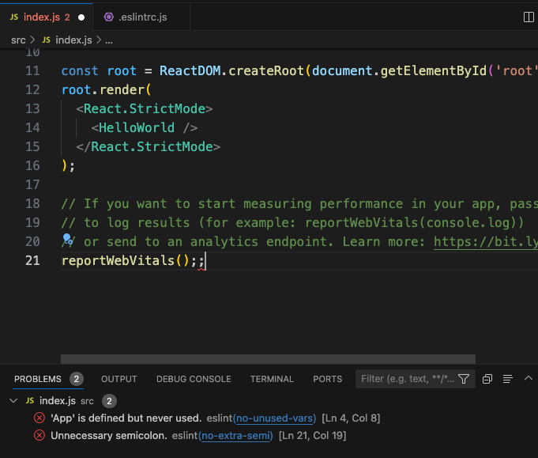

## [Popular Starter Kits 流行入门工具包](https://code.visualstudio.com/docs/nodejs/reactjs-tutorial#_popular-starter-kits)

In this tutorial, we used the `create-react-app` generator to create a simple React application. There are lots of great samples and starter kits available to help build your first React application.

​​	在本教程中，我们使用 `create-react-app` 生成器创建了一个简单的 React 应用程序。有很多很棒的示例和入门工具包可帮助您构建第一个 React 应用程序。

### [VS Code React Sample VS Code React 示例](https://code.visualstudio.com/docs/nodejs/reactjs-tutorial#_vs-code-react-sample)

This is a [sample](https://github.com/microsoft/vscode-react-sample) React application, which creates a simple TODO application and includes the source code for a Node.js [Express](https://expressjs.com/) server. It also shows how to use the [Babel](https://babeljs.io/) ES6 transpiler and then use [webpack](https://webpack.js.org/) to bundle the site assets.

​​	这是一个 React 应用程序示例，它创建了一个简单的 TODO 应用程序，并包含 Node.js Express 服务器的源代码。它还演示了如何使用 Babel ES6 转换器，然后使用 webpack 来捆绑网站资源。

### [TypeScript React](https://code.visualstudio.com/docs/nodejs/reactjs-tutorial#_typescript-react)

If you're curious about TypeScript and React, you can also create a TypeScript version of the `create-react-app` application by specifying that you want to use the TypeScript template:

​​	如果您对 TypeScript 和 React 感到好奇，您还可以通过指定要使用 TypeScript 模板来创建 `create-react-app` 应用程序的 TypeScript 版本：

```
npx create-react-app my-app --template typescript
```

See the details at [Adding TypeScript](https://create-react-app.dev/docs/adding-typescript) on the [Create React App site](https://create-react-app.dev/).

​​	请参阅 Create React App 网站上的添加 TypeScript 中的详细信息。

### [Angular](https://code.visualstudio.com/docs/nodejs/reactjs-tutorial#_angular)

[Angular](https://angular.io/) is another popular web framework. If you'd like to see an example of Angular working with VS Code, check out the [Debugging with Angular CLI](https://github.com/microsoft/vscode-recipes/tree/main/Angular-CLI) recipe. It will walk you through creating an Angular application and configuring the `launch.json` file for the JavaScript debugger.

​​	Angular 是另一个流行的 Web 框架。如果您想看一个 Angular 与 VS Code 配合使用的示例，请查看使用 Angular CLI 进行调试配方。它将指导您创建 Angular 应用程序并为 JavaScript 调试器配置 `launch.json` 文件。

## [Common questions 常见问题](https://code.visualstudio.com/docs/nodejs/reactjs-tutorial#_common-questions)

### [Can I get IntelliSense within declarative JSX? 我可以在声明式 JSX 中获得 IntelliSense 吗？](https://code.visualstudio.com/docs/nodejs/reactjs-tutorial#_can-i-get-intellisense-within-declarative-jsx)

Yes. For example, if you open the `create-react-app` project's `App.js` file, you can see IntelliSense within the React JSX in the `render()` method.

​​	是的。例如，如果您打开 `create-react-app` 项目的 `App.js` 文件，您可以在 `render()` 方法中的 React JSX 中看到 IntelliSense。

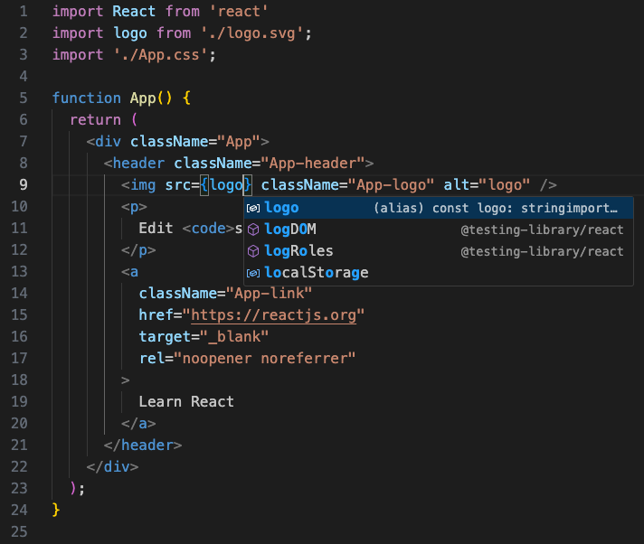

