+++
title = "Vue Tutorial"
date = 2024-01-12T22:36:24+08:00
weight = 70
type = "docs"
description = ""
isCJKLanguage = true
draft = false
+++

> 原文: [https://code.visualstudio.com/docs/nodejs/vuejs-tutorial](https://code.visualstudio.com/docs/nodejs/vuejs-tutorial)

# Using Vue in Visual Studio Code 在 Visual Studio Code 中使用 Vue


[Vue.js](https://vuejs.org/) is a popular JavaScript library for building web application user interfaces and Visual Studio Code has built-in support for the Vue.js building blocks of [HTML](https://code.visualstudio.com/docs/languages/html), [CSS](https://code.visualstudio.com/docs/languages/css), and [JavaScript](https://code.visualstudio.com/docs/languages/javascript). For a richer Vue.js development environment, you can install the [Volar](https://marketplace.visualstudio.com/items?itemName=Vue.volar) and [Volar for TypeScript](https://marketplace.visualstudio.com/items?itemName=Vue.vscode-typescript-vue-plugin) extensions that support Vue.js IntelliSense, code snippets, formatting, and more.

​​	Vue.js 是一个用于构建 Web 应用程序用户界面的流行 JavaScript 库，Visual Studio Code 内置支持 Vue.js 的 HTML、CSS 和 JavaScript 构建模块。对于更丰富的 Vue.js 开发环境，可以安装支持 Vue.js IntelliSense、代码片段、格式化等的 Volar 和 Volar for TypeScript 扩展。

> **Note**: [Vue 2 support will end on December 31st, 2023](https://v2.vuejs.org/lts/) so the use of the [Vetur](https://marketplace.visualstudio.com/items?itemName=octref.vetur) extension is [not recommended](https://github.com/vuejs/vetur/discussions/3378). You will need to [disable Vetur](https://vuejs.org/guide/typescript/overview.html#ide-support) to use Volar.
>
> ​​	注意：Vue 2 支持将于 2023 年 12 月 31 日结束，因此不建议使用 Vetur 扩展。您需要禁用 Vetur 才能使用 Volar。

------

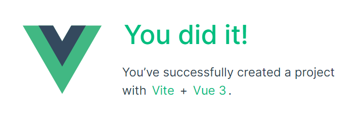

------

## [Welcome to Vue 欢迎使用 Vue](https://code.visualstudio.com/docs/nodejs/vuejs-tutorial#_welcome-to-vue)

We'll be using the [Vite](https://vitejs.dev/) tooling for this tutorial. If you are new to the Vue.js framework, you can find great documentation and tutorials on the [vuejs.org](https://vuejs.org/) website.

​​	本教程将使用 Vite 工具。如果您是 Vue.js 框架的新手，可以在 vuejs.org 网站上找到出色的文档和教程。

To install and use Vite and Vue.js, you'll need the [Node.js](https://nodejs.org/) JavaScript runtime and [npm](https://www.npmjs.com/) (the Node.js package manager) installed. npm is included with Node.js, which you can install from [Node.js downloads](https://nodejs.org/en/download/).

​​	要安装和使用 Vite 和 Vue.js，您需要安装 Node.js JavaScript 运行时和 npm（Node.js 包管理器）。npm 包含在 Node.js 中，可以从 Node.js 下载中安装。

> **Tip**: To test that you have Node.js and npm correctly installed on your machine, you can type `node --version` and `npm --version`.
>
> ​​	提示：要测试您的计算机上是否正确安装了 Node.js 和 npm，您可以键入 `node --version` 和 `npm --version` 。

To get started, make sure you are in the parent directory where you intend to create a project. Then open your terminal or command prompt and type:

​​	首先，确保您位于要创建项目的父目录中。然后打开终端或命令提示符并键入：

```
npm create vue@latest
```

You will be prompted to install `create-vue`.

​​	系统将提示您安装 `create-vue` 。

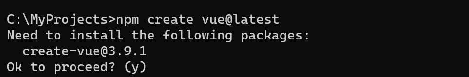

This may take a few minutes to install and execute [create-vue](https://github.com/vuejs/create-vue), which helps you to scaffold your Vue project. Follow the prompts for optional features. You can choose "No" if you are unsure about an option.

​​	这可能需要几分钟来安装和执行 create-vue，它可以帮助您构建 Vue 项目。按照提示选择可选功能。如果您不确定某个选项，可以选择“否”。

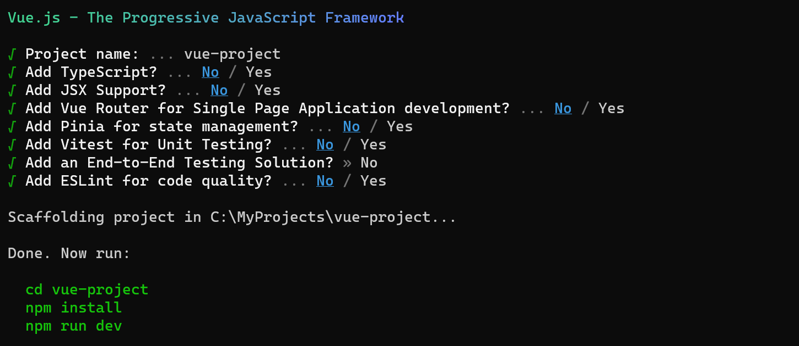

Once the project is created, navigate into it and install dependencies. It may take a few minutes to install its dependencies.

​​	项目创建后，导航到其中并安装依赖项。可能需要几分钟来安装其依赖项。

```
cd <your-project-name>
npm install
```

Let's quickly run our Vue application by typing `npm run dev` to start the web server and open the application in a browser:

​​	让我们快速运行 Vue 应用程序，键入 `npm run dev` 以启动 Web 服务器并在浏览器中打开应用程序：

```
npm run dev
```

You should see "Welcome to your Vue.js App" on [http://localhost:5173](http://localhost:5173/) in your browser. You can press Ctrl+C to stop the `vue-cli-service` server.

​​	您应该在浏览器中的 http://localhost:5173 上看到“欢迎使用您的 Vue.js 应用程序”。您可以按 Ctrl+C 停止 `vue-cli-service` 服务器。

To open your Vue application in VS Code, from a terminal (or command prompt), navigate to the `vue-project` folder and type `code .`:

​​	要在 VS Code 中打开 Vue 应用程序，请从终端（或命令提示符）导航到 `vue-project` 文件夹，然后键入 `code .` ：

```
cd vue-project
code .
```

VS Code will launch and display your Vue application in the File Explorer.

​​	VS Code 将启动并在文件资源管理器中显示您的 Vue 应用程序。

## [Volar extension Volar 扩展](https://code.visualstudio.com/docs/nodejs/vuejs-tutorial#_volar-extension)

Now expand the `src` folder and select the `App.vue` file. You'll notice that VS Code doesn't show any syntax highlighting and it treats the file as **Plain Text** as you can see in the lower right Status Bar. You'll also see a notification recommending the [Volar](https://marketplace.visualstudio.com/items?itemName=Vue.volar) extension for the `.vue` file type.

​​	现在展开 `src` 文件夹并选择 `App.vue` 文件。您会注意到 VS Code 不显示任何语法突出显示，并且它将该文件视为纯文本，如您在右下角的状态栏中看到的那样。您还将看到一个通知，建议对 `.vue` 文件类型使用 Volar 扩展。

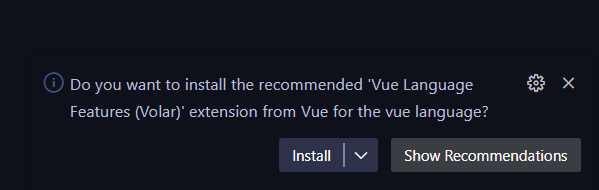

The Volar extension supplies Vue.js language features (syntax highlighting, IntelliSense, snippets, formatting) to VS Code.

​​	Volar 扩展为 VS Code 提供了 Vue.js 语言功能（语法突出显示、IntelliSense、代码段、格式化）。

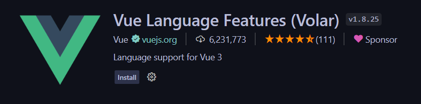

From the notification, press **Install** to download and install the Volar extension. You should see the Volar extension **Installing** in the Extensions view. Once the installation is complete (may take several minutes), the **Install** button changes to the **Manage** gear button.

​​	从通知中，按“安装”下载并安装 Volar 扩展。您应该在“扩展”视图中看到正在安装 Volar 扩展。安装完成后（可能需要几分钟），安装按钮将变为管理齿轮按钮。

You should now see that `.vue` is a recognized file type for the Vue.js language and you have language features such as syntax highlighting, bracket matching, and hover descriptions.

​​	您现在应该看到 `.vue` 是 Vue.js 语言的已识别文件类型，并且您拥有语法突出显示、括号匹配和悬停描述等语言功能。

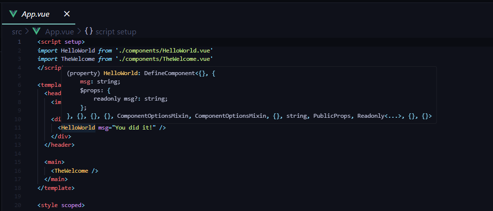

## [IntelliSense](https://code.visualstudio.com/docs/nodejs/vuejs-tutorial#_intellisense)

As you start typing in `App.vue`, you'll see smart suggestions or completions both for HTML and CSS but also for Vue.js specific items like declarations (`v-bind`, `v-for`) in the Vue `template` section:

​​	当您开始在 `App.vue` 中键入时，您将看到针对 HTML 和 CSS 的智能建议或自动完成，还针对 Vue.js 特定项（如 Vue `template` 部分中的声明 ( `v-bind` 、 `v-for` )）：

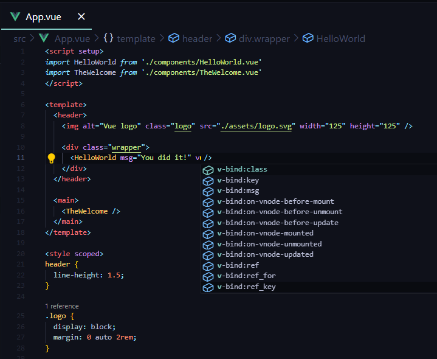

and Vue properties such as `computed` in the `scripts` section:

​​	以及 `scripts` 部分中的 Vue 属性，如 `computed` ：

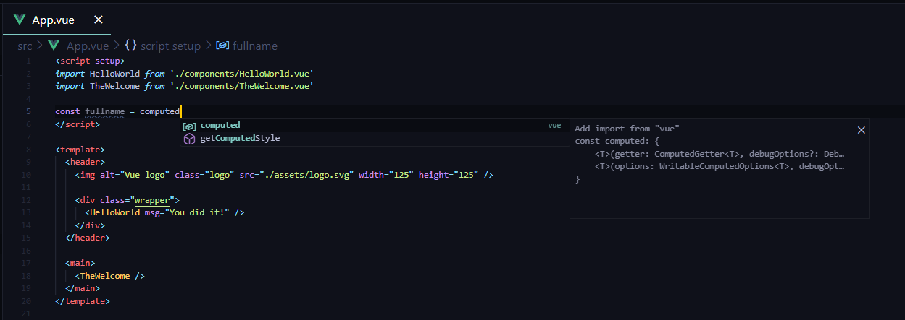

### [Go to Definition, Peek definition 转到定义、查看定义](https://code.visualstudio.com/docs/nodejs/vuejs-tutorial#_go-to-definition-peek-definition)

VS Code through the Volar extension Vue.js language service can also provide type definition information in the editor through **Go to Definition** (F12) or **Peek Definition** (Alt+F12). Put the cursor over the `App`, right-click and select **Peek Definition**. A [Peek window](https://code.visualstudio.com/docs/editor/editingevolved#_peek) opens showing the `App` definition from `App.js`.

​​	VS Code 通过 Volar 扩展 Vue.js 语言服务还可以通过转到定义 (F12) 或查看定义 (Alt+F12) 在编辑器中提供类型定义信息。将光标放在 `App` 上，右键单击并选择“查看定义”。将打开一个“查看”窗口，显示来自 `App.js` 的 `App` 定义。

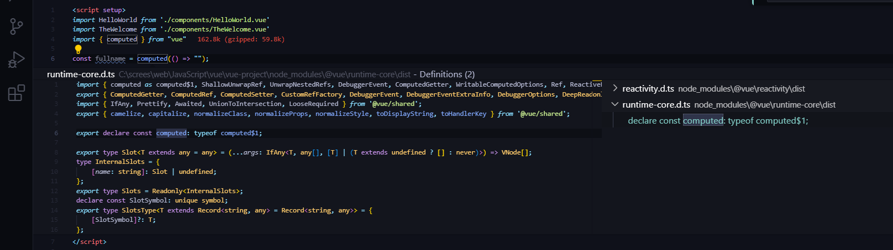

Press Escape to close the Peek window.

​​	按 Escape 关闭查看窗口。

## [Hello World](https://code.visualstudio.com/docs/nodejs/vuejs-tutorial#_hello-world)

Let's update the sample application to "Hello World!". In `App.vue` replace the HelloWorld component `msg` custom attribute text with "Hello World!".

​​	让我们将示例应用程序更新为“Hello World!”。在 `App.vue` 中，将 HelloWorld 组件 `msg` 自定义属性文本替换为“Hello World!”。

```
<template>
  <header>
    

    <div class="wrapper">
      <HelloWorld msg="Hello World!" />
    </div>
  </header>

  <main>
    <TheWelcome />
  </main>
</template>
```

Once you save the `App.vue` file (Ctrl+S), restart the server with `npm run dev` and you'll see "Hello World!". Leave the server running while we go on to learn about Vue.js client side debugging.

​​	保存 `App.vue` 文件 (Ctrl+S) 后，使用 `npm run dev` 重新启动服务器，您将看到“Hello World!”。在继续了解 Vue.js 客户端调试时，让服务器保持运行状态。

> **Tip**: VS Code supports Auto Save, which by default saves your files after a delay. Check the **Auto Save** option in the **File** menu to turn on Auto Save or directly configure the `files.autoSave` user [setting](https://code.visualstudio.com/docs/getstarted/settings).
>
> ​​	提示：VS Code 支持自动保存，默认情况下会在延迟后保存您的文件。选中“文件”菜单中的“自动保存”选项以启用自动保存，或直接配置 `files.autoSave` 用户设置。

------

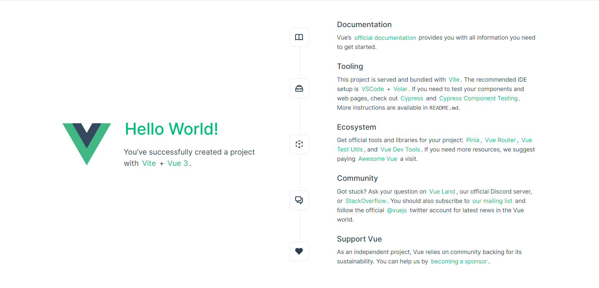

------

## [Linting](https://code.visualstudio.com/docs/nodejs/vuejs-tutorial#_linting)

Linters analyze your source code and can warn you about potential problems before you run your application. The Vue ESLint plugin ([eslint-plugin-vue](https://www.npmjs.com/package/eslint-plugin-vue)) checks for Vue.js specific syntax errors, which are shown in the editor as red squiggles and are also displayed in the **Problems** panel (**View** > **Problems** Ctrl+Shift+M).

​​	Linters 会分析您的源代码，并在您运行应用程序之前警告您潜在的问题。Vue ESLint 插件 (eslint-plugin-vue) 会检查 Vue.js 特定的语法错误，这些错误在编辑器中显示为红色波浪线，也会显示在“问题”面板中（“视图”>“问题”Ctrl+Shift+M）。

Below you can see an error when the Vue linter detects more than one root element in a template:

​​	下面您可以看到 Vue linter 在模板中检测到多个根元素时的错误：

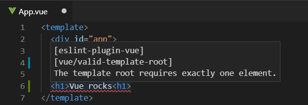

## [Debugging 调试](https://code.visualstudio.com/docs/nodejs/vuejs-tutorial#_debugging)

You can debug client side Vue.js code with the built-in JavaScript debugger. Follow this [conversation](https://github.com/vitejs/vite/discussions/4065#discussioncomment-1359932) to use Vite/Vue.js 3 project with VS Code using Microsoft Edge.

​​	您可以使用内置 JavaScript 调试器调试客户端 Vue.js 代码。按照此对话使用 Microsoft Edge 将 Vite/Vue.js 3 项目与 VS Code 配合使用。

For Vue CLI, which is [now in maintenance mode](https://vuejs.org/guide/scaling-up/tooling#vue-cli), check out [Vue.js debugging in VS Code](https://github.com/microsoft/vscode-recipes/tree/main/vuejs-cli) recipe on the VS Code debugging [recipes](https://github.com/microsoft/vscode-recipes) site to learn more.

​​	对于现在处于维护模式的 Vue CLI，请查看 VS Code 调试配方网站上的 VS Code 中的 Vue.js 调试配方，以了解更多信息。

Another popular tool for debugging Vue.js is the [vue-devtools](https://github.com/vuejs/vue-devtools) plug-in, which can be used regardless of the environment.

​​	另一个流行的 Vue.js 调试工具是 vue-devtools 插件，无论环境如何，都可以使用该插件。

## [Other extensions 其他扩展](https://code.visualstudio.com/docs/nodejs/vuejs-tutorial#_other-extensions)

Volar is only one of many Vue.js extensions available for VS Code. Another recommended extension is [Volar for TypeScript](https://marketplace.visualstudio.com/items?itemName=Vue.vscode-typescript-vue-plugin).

​​	Volar 只是 VS Code 中可用的众多 Vue.js 扩展之一。另一个推荐的扩展是 Volar for TypeScript。

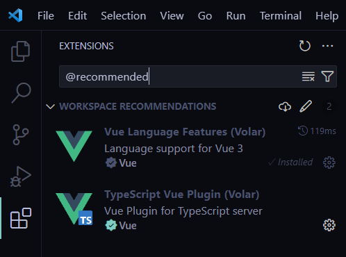

You can search in the Extensions view (Ctrl+Shift+X) by typing 'vue'.

​​	您可以在扩展视图（Ctrl+Shift+X）中键入“vue”进行搜索。

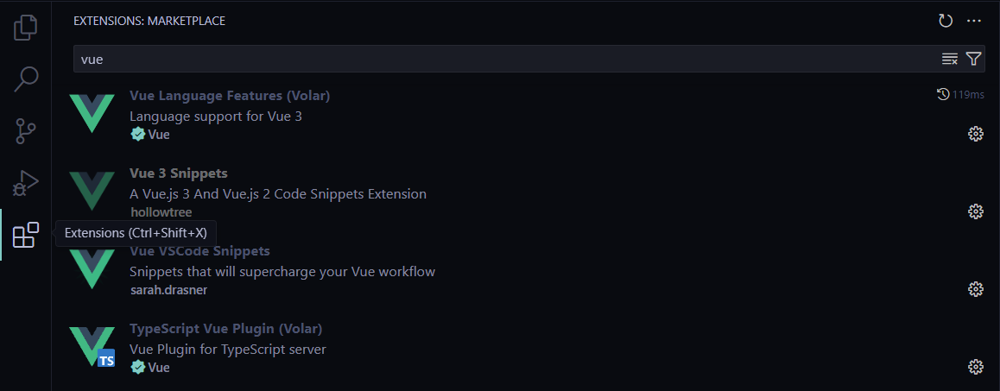

Extension like [Vue VS Code Snippets](https://marketplace.visualstudio.com/items?itemName=sdras.vue-vscode-snippets) can be handy for Vue snippets.

​​	像 Vue VS Code Snippets 这样的扩展对于 Vue 代码段非常有用。

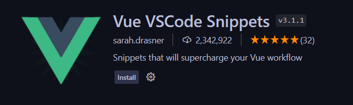

There are also Extension Packs, which bundle extensions that other people have found useful for Vue.js development.

​​	还有一些扩展包，其中捆绑了其他人发现对 Vue.js 开发有用的扩展。

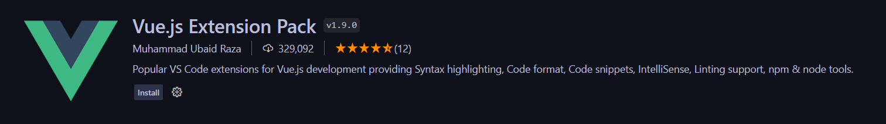

