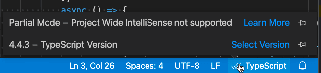

+++
title = "Working with JavaScript"
date = 2024-01-12T22:36:24+08:00
weight = 1
type = "docs"
description = ""
isCJKLanguage = true
draft = false
+++

> 原文: [https://code.visualstudio.com/docs/nodejs/working-with-javascript](https://code.visualstudio.com/docs/nodejs/working-with-javascript)

# Working with JavaScript 使用 JavaScript


This topic describes some of the advanced JavaScript features supported by Visual Studio Code. Using the TypeScript language service, VS Code can provide smart completions (IntelliSense) as well as type checking for JavaScript.

​​	本主题介绍 Visual Studio Code 支持的一些高级 JavaScript 功能。通过使用 TypeScript 语言服务，VS Code 可以提供智能补全（IntelliSense）以及 JavaScript 类型检查。

## [IntelliSense]()

Visual Studio Code's JavaScript [IntelliSense]() provides intelligent code completion, parameter info, references search, and many other advanced language features. Our JavaScript IntelliSense is powered by the [JavaScript language service](https://github.com/microsoft/TypeScript/wiki/JavaScript-Language-Service-in-Visual-Studio) developed by the TypeScript team. While IntelliSense should just work for most JavaScript projects without any configuration, you can make IntelliSense even more useful with [JSDoc]() or by configuring a `jsconfig.json` project.

​​	Visual Studio Code 的 JavaScript IntelliSense 提供智能代码补全、参数信息、引用搜索以及许多其他高级语言功能。我们的 JavaScript IntelliSense 由 TypeScript 团队开发的 JavaScript 语言服务提供支持。虽然 IntelliSense 应该适用于大多数 JavaScript 项目，无需任何配置，但您可以通过 JSDoc 或配置 `jsconfig.json` 项目使 IntelliSense 更有用。

For the details of how JavaScript IntelliSense works, including being based on type inference, JSDoc annotations, TypeScript declarations, and mixing JavaScript and TypeScript projects, see the [JavaScript language service documentation](https://github.com/microsoft/TypeScript/wiki/JavaScript-Language-Service-in-Visual-Studio).

​​	有关 JavaScript IntelliSense 工作原理的详细信息，包括基于类型推断、JSDoc 注释、TypeScript 声明以及混合 JavaScript 和 TypeScript 项目，请参阅 JavaScript 语言服务文档。

When type inference does not provide the desired information, type information may be provided explicitly with JSDoc annotations. This document describes the [JSDoc annotations](https://www.typescriptlang.org/docs/handbook/type-checking-javascript-files.html#supported-jsdoc) currently supported.

​​	当类型推断未提供所需信息时，可以使用 JSDoc 注释显式提供类型信息。本文档介绍当前支持的 JSDoc 注释。

In addition to objects, methods, and properties, the JavaScript IntelliSense window also provides basic word completion for the symbols in your file.

​​	除了对象、方法和属性之外，JavaScript IntelliSense 窗口还为文件中的符号提供基本单词补全。

### [Typings and Automatic Type Acquisition 类型和自动类型获取]()

IntelliSense for JavaScript libraries and frameworks is powered by TypeScript type declaration (typings) files. Type declaration files are written in TypeScript so they can express the data types of parameters and functions, allowing VS Code to provide a rich IntelliSense experience in a performant manner.

​​	JavaScript 库和框架的 IntelliSense 由 TypeScript 类型声明（类型）文件提供支持。类型声明文件以 TypeScript 编写，因此它们可以表示参数和函数的数据类型，从而允许 VS Code 以高性能的方式提供丰富的 IntelliSense 体验。

Many popular libraries ship with typings files so you get IntelliSense for them automatically. For libraries that do not include typings, VS Code's `Automatic Type Acquisition` will automatically install community maintained typings file for you.

​​	许多流行的库都附带类型文件，因此您可以自动获得它们的 IntelliSense。对于不包含类型的库，VS Code 的 `Automatic Type Acquisition` 将自动为您安装社区维护的类型文件。

Automatic type acquisition requires [npmjs](https://www.npmjs.com/), the Node.js package manager, which is included with the [Node.js](https://nodejs.org/) runtime. In this image you can see IntelliSense, including the method signature, parameter info, and the method's documentation for the popular [lodash](https://lodash.com/) library.

​​	自动类型获取需要 Node.js 包管理器 npmjs，它包含在 Node.js 运行时中。在此图像中，您可以看到 IntelliSense，包括方法签名、参数信息和流行的 lodash 库的方法文档。


Type declaration files are automatically downloaded and managed by Visual Studio Code for packages listed in your project's `package.json` or that you import into a JavaScript file.

​​	类型声明文件由 Visual Studio Code 自动下载和管理，适用于项目 `package.json` 中列出的包或您导入到 JavaScript 文件中的包。

```
{
  "dependencies": {
    "lodash": "^4.17.0"
  }
}
```

You can alternately explicitly list packages to acquire type declaration files for in a [jsconfig.json]().

​​	您也可以在 jsconfig.json 中列出要获取类型声明文件的包。

```
{
  "typeAcquisition": {
    "include": ["jquery"]
  }
}
```

Most common JavaScript libraries ship with declaration files or have type declaration files available. You can search for a library's type declaration file package using the [TypeSearch](https://microsoft.github.io/TypeSearch) site.

​​	大多数常见的 JavaScript 库都附带声明文件或提供类型声明文件。您可以使用 TypeSearch 网站搜索库的类型声明文件包。

### [Fixing npm not installed warning for Automatic Type Acquisition 修复自动类型获取的 npm 未安装警告]()

[Automatic Type Acquisition]() uses [npm](https://www.npmjs.com/), the Node.js package manager, to install and manage Type Declaration (typings) files. To ensure that Automatic Type Acquisition works properly, first ensure that you have npm installed on your machine.

​​	自动类型获取使用 npm（Node.js 包管理器）来安装和管理类型声明 (typings) 文件。为了确保自动类型获取正常工作，首先确保您的计算机上已安装 npm。

Run `npm --version` from a terminal or command prompt to quickly check that npm is installed and available.

​​	从终端或命令提示符运行 `npm --version` 以快速检查 npm 是否已安装且可用。

npm is installed with the Node.js runtime, which is available for download from [Nodejs.org](https://nodejs.org/). Install the current LTS (Long Term Support) version and the npm executable will be added by default to your system path.

​​	npm 与 Node.js 运行时一起安装，后者可从 Nodejs.org 下载。安装当前的 LTS（长期支持）版本，npm 可执行文件将默认添加到您的系统路径中。

If you have npm installed but still see a warning message, you can explicitly tell VS Code where npm is installed with the `typescript.npm` [setting](). This should be set to the full path of the npm executable on your machine, and this does not have to match the version of npm you are using to manage packages in your workspace. `typescript.npm` requires TypeScript 2.3.4+.

​​	如果您已安装 npm 但仍看到警告消息，则可以使用 `typescript.npm` 设置明确告知 VS Code npm 的安装位置。这应设置为计算机上 npm 可执行文件的完整路径，并且不必与您用于管理工作区中包的 npm 版本匹配。 `typescript.npm` 需要 TypeScript 2.3.4+。

For example, on Windows, you would add a path like this to your `settings.json` file:

​​	例如，在 Windows 上，您会将类似以下的路径添加到 `settings.json` 文件中：

```
{
  "typescript.npm": "C:\\Program Files\\nodejs\\npm.cmd"
}
```

## [JavaScript projects (jsconfig.json) JavaScript 项目 (jsconfig.json)]()

The presence of a [jsconfig.json](https://code.visualstudio.com/docs/languages/jsconfig) file in a directory indicates that the directory is the root of a JavaScript project. `jsconfig.json` specifies the root files and the options for the language features provided by the [JavaScript language service](https://github.com/microsoft/TypeScript/wiki/JavaScript-Language-Service-in-Visual-Studio). For common setups, a `jsconfig.json` file is not required, however, there are situations when you will want to add a `jsconfig.json`.

​​	目录中存在 jsconfig.json 文件表示该目录是 JavaScript 项目的根目录。 `jsconfig.json` 指定根文件和 JavaScript 语言服务提供的语言功能的选项。对于常见设置，不需要 `jsconfig.json` 文件，但是，在某些情况下，您需要添加 `jsconfig.json` 。

- Not all files should be in your JavaScript project (for example, you want to exclude some files from showing IntelliSense). This situation is common with front-end and back-end code.
  并非所有文件都应位于您的 JavaScript 项目中（例如，您希望排除某些文件以不显示 IntelliSense）。这种情况在前端和后端代码中很常见。
- Your workspace contains more than one project context. In this situation, you should add a `jsconfig.json` file at the root folder for each project.
  您的工作区包含多个项目上下文。在这种情况下，您应在每个项目的根文件夹中添加 `jsconfig.json` 文件。
- You are using the TypeScript compiler to down-level compile JavaScript source code.
  您正在使用 TypeScript 编译器向下编译 JavaScript 源代码。

### [Location of jsconfig.json jsconfig.json 的位置]()

To define our code as a JavaScript project, create `jsconfig.json` at the root of your JavaScript code as shown below. A JavaScript project is the source files of the project and should not include the derived or packaged files (such as a `dist` directory).

​​	要将我们的代码定义为 JavaScript 项目，请在 JavaScript 代码的根目录中创建 `jsconfig.json` ，如下所示。JavaScript 项目是项目的源文件，不应包含派生文件或打包文件（例如 `dist` 目录）。


In more complex projects, you may have more than one `jsconfig.json` file defined inside a workspace. You will want to do this so that the source code in one project does not appear in the IntelliSense of another project.

​​	在更复杂的项目中，您可能在工作区内定义了多个 `jsconfig.json` 文件。您需要这样做，以便一个项目中的源代码不会出现在另一个项目的 IntelliSense 中。

Illustrated below is a project with a `client` and `server` folder, showing two separate JavaScript projects:

​​	下面说明了一个带有 `client` 和 `server` 文件夹的项目，显示了两个单独的 JavaScript 项目：


### [Writing jsconfig.json 编写 jsconfig.json]()

Below is a simple template for `jsconfig.json` file, which defines the JavaScript `target` to be `ES6` and the `exclude` attribute excludes the `node_modules` folder. You can copy and paste this code into your `jsconfig.json` file.

​​	下面是 `jsconfig.json` 文件的简单模板，其中定义了 JavaScript `target` 为 `ES6` ，而 `exclude` 属性排除了 `node_modules` 文件夹。您可以将此代码复制并粘贴到您的 `jsconfig.json` 文件中。

```
{
  "compilerOptions": {
    "module": "CommonJS",
    "target": "ES6"
  },
  "exclude": ["node_modules", "**/node_modules/*"]
}
```

The `exclude` attribute tells the language service which files are not part of your source code. If IntelliSense is slow, add folders to your `exclude` list (VS Code will prompt you to do this if it detects slow completions). You will want to `exclude` files generated by a build process (such as a `dist` directory). These files will cause suggestions to show up twice and will slow down IntelliSense.

​​	属性 `exclude` 告诉语言服务哪些文件不属于你的源代码。如果 IntelliSense 速度较慢，请将文件夹添加到 `exclude` 列表（如果检测到完成速度较慢，VS Code 会提示你执行此操作）。你可能需要 `exclude` 由构建过程（例如 `dist` 目录）生成的文件。这些文件会导致建议显示两次，并会降低 IntelliSense 的速度。

You can explicitly set the files in your project using the `include` attribute. If no `include` attribute is present, then this defaults to including all files in the containing directory and subdirectories. When a `include` attribute is specified, only those files are included.

​​	你可以使用 `include` 属性显式设置项目中的文件。如果不存在 `include` 属性，则默认为包含包含目录和子目录中的所有文件。指定 `include` 属性时，仅包含那些文件。

Here is an example with an explicit `include` attribute:

​​	下面是一个带有显式 `include` 属性的示例：

```
{
  "compilerOptions": {
    "module": "CommonJS",
    "target": "ES6"
  },
  "include": ["src/**/*"]
}
```

The best practice, and least error prone route, is to use the `include` attribute with a single `src` folder. Note that file paths in `exclude` and `include` are relative to the location of `jsconfig.json`.

​​	最佳做法和最不易出错的途径是将 `include` 属性与单个 `src` 文件夹配合使用。请注意， `exclude` 和 `include` 中的文件路径相对于 `jsconfig.json` 的位置。

For more information, see the full [jsconfig.json documentation](https://code.visualstudio.com/docs/languages/jsconfig).

​​	有关详细信息，请参阅完整的 jsconfig.json 文档。

### [Migrating to TypeScript 迁移到 TypeScript]()

It is possible to have mixed TypeScript and JavaScript projects. To start migrating to TypeScript, rename your `jsconfig.json` file to `tsconfig.json` and set the `allowJs` property to `true`. For more information, see [Migrating from JavaScript](https://www.typescriptlang.org/docs/handbook/migrating-from-javascript.html).

​​	可以同时进行 TypeScript 和 JavaScript 项目。要开始迁移到 TypeScript，请将 `jsconfig.json` 文件重命名为 `tsconfig.json` ，并将 `allowJs` 属性设置为 `true` 。有关更多信息，请参阅从 JavaScript 迁移。

> **Note:** `jsconfig.json` is the same as a `tsconfig.json` file, only with `allowJs` set to true. See [the documentation for `tsconfig.json`](https://www.typescriptlang.org/docs/handbook/tsconfig-json.html) here to see other available options.
>
> ​​	注意： `jsconfig.json` 与 `tsconfig.json` 文件相同，只是将 `allowJs` 设置为 true。请参阅此处有关 `tsconfig.json` 的文档，以查看其他可用选项。

## [Type checking JavaScript 类型检查 JavaScript]()

VS Code allows you to leverage some of TypeScript's advanced type checking and error reporting functionality in regular JavaScript files. This is a great way to catch common programming mistakes. These type checks also enable some exciting Quick Fixes for JavaScript, including **Add missing import** and **Add missing property**.

​​	VS Code 允许您在常规 JavaScript 文件中利用 TypeScript 的一些高级类型检查和错误报告功能。这是发现常见编程错误的绝佳方法。这些类型检查还为 JavaScript 提供了一些令人兴奋的快速修复，包括添加缺少的导入和添加缺少的属性。


TypeScript can infer types in `.js` files same as in `.ts` files. When types cannot be inferred, they can be specified using JSDoc comments. You can read more about how TypeScript uses JSDoc for JavaScript type checking in [Type Checking JavaScript Files](https://www.typescriptlang.org/docs/handbook/type-checking-javascript-files.html).

​​	TypeScript 可以像在 `.ts` 文件中一样推断 `.js` 文件中的类型。如果无法推断类型，则可以使用 JSDoc 注释指定类型。您可以在类型检查 JavaScript 文件中阅读有关 TypeScript 如何使用 JSDoc 进行 JavaScript 类型检查的更多信息。

Type checking of JavaScript is optional and opt-in. Existing JavaScript validation tools such as ESLint can be used alongside the new built-in type checking functionality.

​​	JavaScript 的类型检查是可选的且需要选择加入。现有的 JavaScript 验证工具（如 ESLint）可以与新的内置类型检查功能一起使用。

You can get started with type checking a few different ways depending on your needs.

​​	您可以根据需要通过几种不同的方式开始类型检查。

**Per file
按文件**

The easiest way to enable type checking in a JavaScript file is by adding `// @ts-check` to the top of a file.

​​	在 JavaScript 文件中启用类型检查的最简单方法是在文件顶部添加 `// @ts-check` 。

```
// @ts-check
let itsAsEasyAs = 'abc';
itsAsEasyAs = 123; // Error: Type '123' is not assignable to type 'string'
```

Using `// @ts-check` is a good approach if you just want to try type checking in a few files but not yet enable it for an entire codebase.

​​	如果您只想在几个文件中试用类型检查，但尚未为整个代码库启用它，那么使用 `// @ts-check` 是一个好方法。

**Using a setting
使用设置**

To enable type checking for all JavaScript files without changing any code, just add `"js/ts.implicitProjectConfig.checkJs": true` to your workspace or user settings. This enables type checking for any JavaScript file that is not part of a `jsconfig.json` or `tsconfig.json` project.

​​	要为所有 JavaScript 文件启用类型检查而不更改任何代码，只需将 `"js/ts.implicitProjectConfig.checkJs": true` 添加到您的工作区或用户设置中。这会为任何不属于 `jsconfig.json` 或 `tsconfig.json` 项目的 JavaScript 文件启用类型检查。

You can opt individual files out of type checking with a `// @ts-nocheck` comment at the top of the file:

​​	您可以使用文件顶部的 `// @ts-nocheck` 注释将各个文件排除在类型检查之外：

```
// @ts-nocheck
let easy = 'abc';
easy = 123; // no error
```

You can also disable individual errors in a JavaScript file using a `// @ts-ignore` comment on the line before the error:

​​	您还可以在错误之前的行上使用 `// @ts-ignore` 注释来禁用 JavaScript 文件中的各个错误：

```
let easy = 'abc';
// @ts-ignore
easy = 123; // no error
```

**Using jsconfig or tsconfig
使用 jsconfig 或 tsconfig**

To enable type checking for JavaScript files that are part of a `jsconfig.json` or `tsconfig.json`, add `"checkJs": true` to the project's compiler options:

​​	要为属于 `jsconfig.json` 或 `tsconfig.json` 的 JavaScript 文件启用类型检查，请将 `"checkJs": true` 添加到项目的编译器选项：

`jsconfig.json`:

```
{
  "compilerOptions": {
    "checkJs": true
  },
  "exclude": ["node_modules", "**/node_modules/*"]
}
```

`tsconfig.json`:

```
{
  "compilerOptions": {
    "allowJs": true,
    "checkJs": true
  },
  "exclude": ["node_modules", "**/node_modules/*"]
}
```

This enables type checking for all JavaScript files in the project. You can use `// @ts-nocheck` to disable type checking per file.

​​	这会对项目中的所有 JavaScript 文件启用类型检查。您可以使用 `// @ts-nocheck` 禁用每个文件的类型检查。

JavaScript type checking requires TypeScript 2.3. If you are unsure what version of TypeScript is currently active in your workspace, run the **TypeScript: Select TypeScript Version** command to check. You must have a `.js/.ts` file open in the editor to run this command. If you open a TypeScript file, the version appears in the lower right corner.

​​	JavaScript 类型检查需要 TypeScript 2.3。如果您不确定工作区中当前处于活动状态的 TypeScript 版本，请运行 TypeScript：选择 TypeScript 版本命令进行检查。您必须在编辑器中打开一个 `.js/.ts` 文件才能运行此命令。如果您打开一个 TypeScript 文件，该版本会显示在右下角。

### [Global variables and type checking 全局变量和类型检查]()

Let's say that you are working in legacy JavaScript code that uses global variables or non-standard DOM APIs:

​​	假设您正在使用全局变量或非标准 DOM API 的旧版 JavaScript 代码中工作：

```
window.onload = function() {
  if (window.webkitNotifications.requestPermission() === CAN_NOTIFY) {
    window.webkitNotifications.createNotification(null, 'Woof!', '🐶').show();
  } else {
    alert('Could not notify');
  }
};
```

If you try to use `// @ts-check` with the above code, you'll see a number of errors about the use of global variables:

​​	如果您尝试对上述代码使用 `// @ts-check` ，您会看到许多有关使用全局变量的错误：

1. `Line 2` - `Property 'webkitNotifications' does not exist on type 'Window'.`
2. `Line 2` - `Cannot find name 'CAN_NOTIFY'.`
3. `Line 3` - `Property 'webkitNotifications' does not exist on type 'Window'.`

If you want to continue using `// @ts-check` but are confident that these are not actual issues with your application, you have to let TypeScript know about these global variables.

​​	如果您想继续使用 `// @ts-check` ，但确信这些不是应用程序的实际问题，则必须让 TypeScript 了解这些全局变量。

To start, [create a `jsconfig.json`]() at the root of your project:

​​	首先，在项目的根目录下创建一个 `jsconfig.json` ：

```
{
  "compilerOptions": {},
  "exclude": ["node_modules", "**/node_modules/*"]
}
```

Then reload VS Code to make sure the change is applied. The presence of a `jsconfig.json` lets TypeScript know that your Javascript files are part of a larger project.

​​	然后重新加载 VS Code 以确保应用了更改。存在 `jsconfig.json` 会让 TypeScript 知道您的 Javascript 文件是更大项目的一部分。

Now create a `globals.d.ts` file somewhere your workspace:

​​	现在在工作区的某个位置创建一个 `globals.d.ts` 文件：

```
interface Window {
  webkitNotifications: any;
}

declare var CAN_NOTIFY: number;
```

`d.ts` files are type declarations. In this case, `globals.d.ts` lets TypeScript know that a global `CAN_NOTIFY` exists and that a `webkitNotifications` property exists on `window`. You can read more about writing `d.ts` in the [TypeScript documentation](https://www.typescriptlang.org/docs/handbook/declaration-files/introduction.html). `d.ts` files do not change how JavaScript is evaluated, they are used only for providing better JavaScript language support.

​​	 `d.ts` 文件是类型声明。在这种情况下， `globals.d.ts` 让 TypeScript 知道存在一个全局 `CAN_NOTIFY` ，并且在 `window` 上存在一个 `webkitNotifications` 属性。您可以在 TypeScript 文档中阅读有关编写 `d.ts` 的更多信息。 `d.ts` 文件不会改变 JavaScript 的评估方式，它们仅用于提供更好的 JavaScript 语言支持。

## [Using tasks 使用任务]()

### [Using the TypeScript compiler 使用 TypeScript 编译器]()

One of the key features of TypeScript is the ability to use the latest JavaScript language features, and emit code that can execute in JavaScript runtimes that don't yet understand those newer features. With JavaScript using the same language service, it too can now take advantage of this same feature.

​​	TypeScript 的一个主要特性是能够使用最新的 JavaScript 语言特性，并发出可以在尚未理解这些新特性的 JavaScript 运行时中执行的代码。由于 JavaScript 使用相同的语言服务，因此它现在也可以利用此相同特性。

The TypeScript compiler `tsc` can down-level compile JavaScript files from ES6 to another language level. Configure the `jsconfig.json` with the desired options and then use the –p argument to make `tsc` use your `jsconfig.json` file, for example `tsc -p jsconfig.json` to down-level compile.

​​	TypeScript 编译器 `tsc` 可以将 JavaScript 文件从 ES6 降级编译到另一个语言级别。使用所需选项配置 `jsconfig.json` ，然后使用 –p 参数使 `tsc` 使用您的 `jsconfig.json` 文件，例如 `tsc -p jsconfig.json` 进行降级编译。

Read more about the compiler options for down level compilation in the [jsconfig documentation](https://code.visualstudio.com/docs/languages/jsconfig#_jsconfig-options).

​​	在 jsconfig 文档中阅读有关降级编译的编译器选项的更多信息。

### [Running Babel 运行 Babel]()

The [Babel](https://babeljs.io/) transpiler turns ES6 files into readable ES5 JavaScript with Source Maps. You can easily integrate **Babel** into your workflow by adding the configuration below to your `tasks.json` file (located under the workspace's `.vscode` folder). The `group` setting makes this task the default **Task: Run Build Task** gesture. `isBackground` tells VS Code to keep running this task in the background. To learn more, go to [Tasks]().

​​	Babel 编译器将 ES6 文件转换为可读的 ES5 JavaScript，并附带源映射。您可以通过将以下配置添加到 `tasks.json` 文件（位于工作区的 `.vscode` 文件夹下）轻松地将 Babel 集成到您的工作流中。 `group` 设置使此任务成为默认任务：运行构建任务手势。 `isBackground` 告诉 VS Code 在后台持续运行此任务。要了解更多信息，请转到任务。

```
{
  "version": "2.0.0",
  "tasks": [
    {
      "label": "watch",
      "command": "${workspaceFolder}/node_modules/.bin/babel",
      "args": ["src", "--out-dir", "lib", "-w", "--source-maps"],
      "type": "shell",
      "group": { "kind": "build", "isDefault": true },
      "isBackground": true
    }
  ]
}
```

Once you have added this, you can start **Babel** with the Ctrl+Shift+B (**Run Build Task**) command and it will compile all files from the `src` directory into the `lib` directory.

​​	添加此配置后，您可以使用 Ctrl+Shift+B（运行构建任务）命令启动 Babel，它会将 `src` 目录中的所有文件编译到 `lib` 目录中。

> **Tip:** For help with Babel CLI, see the instructions in [Using Babel](https://babeljs.io/docs/setup/#installation). The example above uses the CLI option.
>
> ​​	提示：有关 Babel CLI 的帮助，请参阅使用 Babel 中的说明。上面的示例使用 CLI 选项。

## [Disable JavaScript support 禁用 JavaScript 支持]()

If you prefer to use JavaScript language features supported by other JavaScript language tools such as [Flow](https://flow.org/), you can disable VS Code's built-in JavaScript support. You do this by disabling the built-in TypeScript language extension **TypeScript and JavaScript Language Features** (vscode.typescript-language-features) which also provides the JavaScript language support.

​​	如果您更喜欢使用其他 JavaScript 语言工具（例如 Flow）支持的 JavaScript 语言功能，则可以禁用 VS Code 的内置 JavaScript 支持。您可以通过禁用内置 TypeScript 语言扩展 TypeScript 和 JavaScript 语言功能 (vscode.typescript-language-features) 来实现此目的，该扩展还提供 JavaScript 语言支持。

To disable JavaScript/TypeScript support, go to the Extensions view (Ctrl+Shift+X) and filter on built-in extensions (**Show Built-in Extensions** in the **...** **More Actions** dropdown), then type 'typescript'. Select the **TypeScript and JavaScript Language Features** extension and press the **Disable** button. VS Code built-in extensions cannot be uninstalled, only disabled, and can be re-enabled at any time.

​​	要禁用 JavaScript/TypeScript 支持，请转到扩展视图 (Ctrl+Shift+X) 并筛选内置扩展（在“更多操作”下拉菜单中显示内置扩展），然后键入“typescript”。选择 TypeScript 和 JavaScript 语言功能扩展，然后按禁用按钮。VS Code 内置扩展无法卸载，只能禁用，并且可以随时重新启用。


## [Partial IntelliSense mode 部分 IntelliSense 模式]()

VS Code tries to provide project-wide IntelliSense for JavaScript and TypeScript, which is what makes features such as auto-imports and **Go to Definition** possible. However, there are some cases where VS Code is limited to working only with your currently opened files and is unable to load the other files that make up your JavaScript or TypeScript project.

​​	VS Code 尝试为 JavaScript 和 TypeScript 提供项目范围的 IntelliSense，这使得自动导入和转到定义等功能成为可能。但是，在某些情况下，VS Code 仅限于使用当前打开的文件，并且无法加载构成 JavaScript 或 TypeScript 项目的其他文件。

This can happen in a few instances:

​​	这可能在以下几种情况下发生：

- You are working with JavaScript or TypeScript code on [vscode.dev](https://vscode.dev/) or [github.dev](https://docs.github.com/codespaces/developing-in-codespaces/web-based-editor) and VS Code is running in the browser.
  您正在 vscode.dev 或 github.dev 上使用 JavaScript 或 TypeScript 代码，并且 VS Code 在浏览器中运行。
- You open a file from a virtual file system (such as when using the [GitHub Repositories](https://marketplace.visualstudio.com/items?itemName=GitHub.remotehub) extension).
  您从虚拟文件系统（例如使用 GitHub 存储库扩展时）打开了一个文件。
- The project is currently loading. Once loading completes, you will start getting project-wide IntelliSense for it.
  项目正在加载。加载完成后，您将开始获得该项目的项目范围 IntelliSense。

In these cases, VS Code's IntelliSense will operate in **partial mode**. Partial mode tries its best to provide IntelliSense for any JavaScript or TypeScript files you have open, but is limited and is not able to offer any cross-file IntelliSense features.

​​	在这些情况下，VS Code 的 IntelliSense 将以部分模式运行。部分模式会尽力为已打开的任何 JavaScript 或 TypeScript 文件提供 IntelliSense，但功能有限，无法提供任何跨文件 IntelliSense 功能。

### [Which features are impacted? 哪些功能会受到影响？]()

Here's an incomplete list of features that are either disabled or have more limited functionality in partial mode:

​​	以下是不完整的功能列表，这些功能在部分模式下要么被禁用，要么功能受限：

- All opened files are treated as part of a single project.
  所有打开的文件都被视为单个项目的一部分。
- Configuration options from your `jsconfig` or `tsconfig` (such as `target`) are not respected.
  来自 `jsconfig` 或 `tsconfig` 的配置选项（例如 `target` ）不受尊重。
- Only syntax errors are reported. Semantic errors — such as accessing an unknown property or passing the wrong type to a function — are not reported.
  仅报告语法错误。语义错误（例如访问未知属性或向函数传递错误的类型）不会被报告。
- Quick Fixes for semantic errors are disabled.
  语义错误的快速修复被禁用。
- Symbols can only be resolved within the current file. Any symbols imported from other files will be treated as being of the `any` type.
  符号只能在当前文件中解析。从其他文件导入的任何符号都将被视为 `any` 类型。
- Commands such as **Go to Definition** and **Find All References** will only work for opened files instead of across the entire project. This also means that symbol from any packages you install under `node_module` will not be resolved.
  转到定义和查找所有引用等命令仅适用于打开的文件，而不是整个项目。这也意味着在 `node_module` 下安装的任何包中的符号都将无法解析。
- Workspace symbol search will only include symbols from currently opened files.
  工作区符号搜索将仅包含来自当前打开文件的符号。
- Auto imports are disabled.
  自动导入已禁用。
- Renaming is disabled.
  重命名已禁用。
- Many refactorings are disabled.
  许多重构已禁用。

Some additional features are disabled on `vscode.dev` and `github.dev`:

​​	在 `vscode.dev` 和 `github.dev` 上禁用了一些其他功能：

- [Automatic type acquisition]() is currently not supported.
  目前不支持自动类型获取。

### [Checking if you are in partial mode 检查您是否处于部分模式]()

To check if the current file is using partial mode IntelliSense instead of project-wide IntelliSense, hover over the `JavaScript` or `TypeScript` language status item in the status bar:

​​	若要检查当前文件是使用部分模式 IntelliSense 还是项目范围 IntelliSense，请将鼠标悬停在状态栏中的 `JavaScript` 或 `TypeScript` 语言状态项上：



The status item will show `Partial mode` if the current file is in partial mode.

​​	如果当前文件处于部分模式，状态项将显示 `Partial mode` 。
