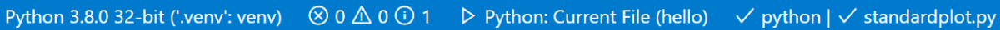

+++
title = "Debugging"
date = 2024-01-12T22:36:24+08:00
weight = 40
type = "docs"
description = ""
isCJKLanguage = true
draft = false
+++

> 原文: [https://code.visualstudio.com/docs/python/debugging](https://code.visualstudio.com/docs/python/debugging)

# Python debugging in VS Code VS Code 中的 Python 调试


The Python extension supports debugging of several types of Python applications. For a short walkthrough of basic debugging, see [Tutorial - Configure and run the debugger](https://code.visualstudio.com/docs/python/python-tutorial#_configure-and-run-the-debugger). Also see the [Flask tutorial](https://code.visualstudio.com/docs/python/tutorial-flask). Both tutorials demonstrate core skills like setting breakpoints and stepping through code.

​​​	Python 扩展支持调试多种类型的 Python 应用程序。有关基本调试的简短演练，请参阅教程 - 配置和运行调试器。另请参阅 Flask 教程。这两个教程都演示了设置断点和逐步执行代码等核心技能。

For general debugging features such as inspecting variables, setting breakpoints, and other activities that aren't language-dependent, review [VS Code debugging](https://code.visualstudio.com/docs/editor/debugging).

​​​	有关检查变量、设置断点以及其他与语言无关的活动等常规调试功能，请查看 VS Code 调试。

This article mainly addresses Python-specific debugging *configurations*, including the necessary steps for specific app types and remote debugging.

​​​	本文主要介绍特定于 Python 的调试配置，包括特定应用类型和远程调试的必要步骤。

## [Initialize configurations 初始化配置](https://code.visualstudio.com/docs/python/debugging#_initialize-configurations)

A configuration drives VS Code's behavior during a debugging session. Configurations are defined in a `launch.json` file that's stored in a `.vscode` folder in your workspace.

​​​	配置驱动 VS Code 在调试会话期间的行为。配置定义在存储在工作区中的 `launch.json` 文件夹中的 `.vscode` 文件中。

> **Note**: To change debugging configuration, your code must be stored in a folder.
>
> ​​​	注意：要更改调试配置，您的代码必须存储在文件夹中。

To initialize debug configurations, first select the **Run** view in the sidebar:

​​​	要初始化调试配置，首先在侧边栏中选择“运行”视图：


If you don't yet have any configurations defined, you'll see a button to **Run and Debug** and a link to create a configuration (launch.json) file:

​​​	如果您尚未定义任何配置，您将看到一个“运行并调试”按钮和一个创建配置 (launch.json) 文件的链接：


To generate a `launch.json` file with Python configurations, do the following steps:

​​​	要生成具有 Python 配置的 `launch.json` 文件，请执行以下步骤：

1. Select the **create a launch.json file** link (outlined in the image above) or use the **Run** > **Open configurations** menu command.

   ​​​	选择创建 launch.json 文件链接（在上图中概述）或使用“运行”>“打开配置”菜单命令。

2. A configuration menu will open from the Command Palette allowing you to choose the type of debug configuration you want for the opened file. For now, in the **Select a debug configuration** menu that appears, select **Python File**.

   ​​​	将从命令面板中打开一个配置菜单，允许您选择要为打开的文件使用的调试配置类型。现在，在出现的“选择调试配置”菜单中，选择“Python 文件”。

   > **Note**: Starting a debugging session through the Debug Panel, F5 or **Run > Start Debugging** when no configuration exists will also bring up the debug configuration menu, but will not create a launch.json file.
   >
   > ​​​	注意：当不存在配置时，通过调试面板、F5 或“运行”>“开始调试”启动调试会话也会打开调试配置菜单，但不会创建 launch.json 文件。

3. The Python extension then creates and opens a `launch.json` file that contains a pre-defined configuration based on what you previously selected, in this case, **Python File**. You can modify configurations (to add arguments, for example), and also add custom configurations.

   ​​​	然后，Python 扩展将创建并打开一个 `launch.json` 文件，其中包含一个预定义的配置，该配置基于您之前选择的配置，在本例中为“Python 文件”。您可以修改配置（例如，添加参数），还可以添加自定义配置。

   

The details of configuration properties are covered later in this article under [Standard configuration and options](https://code.visualstudio.com/docs/python/debugging#_set-configuration-options). Other configurations are also described in this article under [Debugging specific app types](https://code.visualstudio.com/docs/python/debugging#_debugging-specific-app-types).

​​​	本文后面将在“标准配置和选项”下介绍配置属性的详细信息。本文还将在“调试特定应用类型”下介绍其他配置。

## [Additional configurations 其他配置](https://code.visualstudio.com/docs/python/debugging#_additional-configurations)

By default, VS Code shows only the most common configurations provided by the Python extension. You can select other configurations to include in `launch.json` by using the **Add Configuration** command shown in the list and the `launch.json` editor. When you use the command, VS Code prompts you with a list of all available configurations (be sure to select the **Python** option):

​​​	默认情况下，VS Code 仅显示 Python 扩展提供的最常见配置。您可以使用列表中显示的“添加配置”命令和 `launch.json` 编辑器选择要包含在 `launch.json` 中的其他配置。使用该命令时，VS Code 会提示您提供所有可用配置的列表（请务必选择 Python 选项）：


Selecting the **Attach using Process ID** one yields the following result:

​​​	选择“使用进程 ID 附加”会产生以下结果：

See [Debugging specific app types](https://code.visualstudio.com/docs/python/debugging#_debugging-specific-app-types) for details on all of these configurations.

​​​	有关所有这些配置的详细信息，请参阅调试特定应用类型。

During debugging, the Status Bar shows the current configuration and the current debugging interpreter. Selecting the configuration brings up a list from which you can choose a different configuration:

​​​	在调试期间，状态栏会显示当前配置和当前调试解释器。选择配置会显示一个列表，您可以在其中选择不同的配置：



By default, the debugger uses the same interpreter selected for your workspace, just like other features of Python extension for VS Code. To use a different interpreter for debugging specifically, set the value for `python` in `launch.json` for the applicable debugger configuration. Alternately, select the named interpreter on the Status Bar to select a different one.

​​​	默认情况下，调试器使用与工作区选择的解释器相同的解释器，就像 VS Code 的 Python 扩展的其他功能一样。要专门针对调试使用不同的解释器，请在 `launch.json` 中为适用的调试器配置设置 `python` 的值。或者，选择状态栏上的命名解释器以选择不同的解释器。

## [Basic debugging 基本调试](https://code.visualstudio.com/docs/python/debugging#_basic-debugging)

If you're only interested in debugging a Python script, the simplest way is to select the down-arrow next to the run button on the editor and select **Debug Python File in Terminal**.

​​​	如果您只对调试 Python 脚本感兴趣，最简单的方法是在编辑器中点击运行按钮旁边的向下箭头，然后在终端中选择“调试 Python 文件”。


If you're looking to debug a web application using Flask, Django or FastAPI, the Python extension provides dynamically created debug configurations based on your project structure under the **Show all automatic debug configurations** option, through the **Run and Debug** view.

​​​	如果您想使用 Flask、Django 或 FastAPI 调试 Web 应用程序，Python 扩展会通过“运行和调试”视图中的“显示所有自动调试配置”选项，根据您的项目结构动态创建调试配置。


But if you're looking to debug other kinds of applications, you can start the debugger through the **Run** view by clicking on the **Run and Debug** button.

​​​	但如果您想调试其他类型的应用程序，可以通过点击“运行和调试”按钮，在“运行”视图中启动调试器。


When no configuration has been set, you'll be given a list of debugging options. Here, you can select the appropriate option to quickly debug your code.

​​​	如果没有设置任何配置，您将获得一个调试选项列表。在这里，您可以选择合适的选项来快速调试您的代码。

Two common options are to use the **Python File** configuration to run the currently open Python file or to use the **Attach using Process ID** configuration to attach the debugger to a process that is already running.

​​​	两个常见的选项是使用 Python 文件配置来运行当前打开的 Python 文件，或使用使用进程 ID 附加配置将调试器附加到已在运行的进程上。

For information about creating and using debugging configurations, see the [Initialize configurations](https://code.visualstudio.com/docs/python/debugging#_initialize-configurations) and [Additional configurations](https://code.visualstudio.com/docs/python/debugging#_additional-configurations) sections. Once a configuration is added, it can be selected from the dropdown list and started using the **Start Debugging** button.

​​​	有关创建和使用调试配置的信息，请参阅初始化配置和其他配置部分。添加配置后，可以从下拉列表中选择它，并使用“开始调试”按钮启动它。


## [Command line debugging 命令行调试](https://code.visualstudio.com/docs/python/debugging#_command-line-debugging)

The debugger can also be run from the command line. The debugger command line syntax is as follows:

​​​	还可以从命令行运行调试器。调试器命令行语法如下：

```
python -m debugpy
    --listen | --connect
    [<host>:]<port>
    [--wait-for-client]
    [--configure-<name> <value>]...
    [--log-to <path>] [--log-to-stderr]
    <filename> | -m <module> | -c <code> | --pid <pid>
    [<arg>]...
```

As an example, from the command line, you could start the debugger using a specified port (5678) and script using the following syntax. This example assumes the script is long-running and omits the `--wait-for-client` flag, meaning that the script will not wait for the client to attach.

​​​	例如，您可以使用以下语法从命令行启动调试器，并使用指定端口 (5678) 和脚本。此示例假定脚本是长时间运行的，并且省略了 `--wait-for-client` 标志，这意味着脚本不会等待客户端附加。

```
python -m debugpy --listen 5678 ./myscript.py
```

You would then use the following configuration to attach from the VS Code Python extension.

​​​	然后，您可以使用以下配置从 VS Code Python 扩展进行附加。

```
{
  "name": "Python: Attach",
  "type": "python",
  "request": "attach",
  "connect": {
    "host": "localhost",
    "port": 5678
  }
}
```

> **Note**: Specifying host is optional for **listen**, by default 127.0.0.1 is used.
>
> ​​​	注意：指定主机对于侦听是可选的，默认情况下使用 127.0.0.1。

If you wanted to debug remote code or code running in a docker container, on the remote machine or container, you would need to modify the previous CLI command to specify a host.

​​​	如果您想调试远程代码或在 docker 容器中运行的代码，则需要在远程计算机或容器上修改先前的 CLI 命令以指定主机。

```
python -m debugpy --listen 0.0.0.0:5678 ./myscript.py
```

The associated configuration file would then look as follows.

​​​	然后，关联的配置文件将如下所示。

```
{
  "name": "Attach",
  "type": "python",
  "request": "attach",
  "connect": {
    "host": "remote-machine-name", // replace this with remote machine name
    "port": 5678
  }
}
```

> **Note**: Be aware that when you specify a host value other than `127.0.0.1` or `localhost` you are opening a port to allow access from any machine, which carries security risks. You should make sure that you're taking appropriate security precautions, such as using SSH tunnels, when doing remote debugging.
>
> ​​​	注意：请注意，当您指定除 `127.0.0.1` 或 `localhost` 之外的主机值时，您正在打开一个端口以允许从任何计算机访问，这会带来安全风险。进行远程调试时，您应确保采取适当的安全预防措施，例如使用 SSH 隧道。

| Flag 标志                                           | Options 选项      | Description 说明                                             |
| :-------------------------------------------------- | :---------------- | :----------------------------------------------------------- |
| **--listen** or **--connect** --listen 或 --connect | `[<host>:]<port>` | **Required**. Specifies the host address and port for the debug adapter server to wait for incoming connections (--listen) or to connect with a client that is waiting for an incoming connection (--connect). This is the same address that is used in the VS Code debug configuration. By default, the host address is `localhost (127.0.0.1)`. 必需。指定调试适配器服务器等待传入连接（--listen）或与等待传入连接的客户端连接的主机地址和端口。这是 VS Code 调试配置中使用的相同地址。默认情况下，主机地址为 `localhost (127.0.0.1)` 。 |
| **--wait-for-client**                               | none              | **Optional**. Specifies that the code should not run until there's a connection from the debug server. This setting allows you to debug from the first line of your code. 可选。指定在从调试服务器建立连接之前不应运行代码。此设置允许您从代码的第一行开始调试。 |
| **--log-to**                                        | `<path>`          | **Optional**. Specifies a path to an existing directory for saving logs. 可选。指定用于保存日志的现有目录的路径。 |
| **--log-to-stderr**                                 | none              | **Optional**. Enables debugpy to write logs directly to stderr. 可选。启用 debugpy 将日志直接写入 stderr。 |
| **--pid**                                           | `<pid>`           | **Optional**. Specifies a process that is already running to inject the debug server into. 可选。指定一个已在运行的进程，以便将调试服务器注入其中。 |
| **--configure-<name>**                              | `<value>`         | **Optional**. Sets a debug property that must be known to the debug server before the client connects. Such properties can be used directly in *launch* configuration, but must be set in this manner for *attach* configurations. For example, if you don't want the debug server to automatically inject itself into subprocesses created by the process you're attaching to, use `--configure-subProcess false`. 可选。设置一个调试属性，在客户端连接之前，调试服务器必须知道该属性。此类属性可以直接在启动配置中使用，但必须以这种方式在附加配置中设置。例如，如果您不希望调试服务器自动将自身注入到您要附加到的进程创建的子进程中，请使用 `--configure-subProcess false` 。 |

> **Note**: `[<arg>]` can be used to pass command-line arguments along to the app being launched.
>
> ​​​	注意： `[<arg>]` 可用于将命令行参数传递给正在启动的应用。

## [Debugging by attaching over a network connection 通过网络连接附加调试](https://code.visualstudio.com/docs/python/debugging#_debugging-by-attaching-over-a-network-connection)

### [Local script debugging 本地脚本调试](https://code.visualstudio.com/docs/python/debugging#_local-script-debugging)

There may be instances where you need to debug a Python script that's invoked locally by another process. For example, you may be debugging a web server that runs different Python scripts for specific processing jobs. In such cases, you need to attach the VS Code debugger to the script once it's been launched:

​​​	在某些情况下，您可能需要调试由另一个进程在本地调用的 Python 脚本。例如，您可能正在调试为特定处理作业运行不同 Python 脚本的 Web 服务器。在这种情况下，您需要在启动脚本后将 VS Code 调试器附加到该脚本：

1. Run VS Code, open the folder or workspace containing the script, and create a `launch.json` for that workspace if one doesn't exist already.

   ​​​	运行 VS Code，打开包含脚本的文件夹或工作区，如果尚未存在，则为该工作区创建一个 `launch.json` 。

2. In the script code, add the following and save the file:

   ​​​	在脚本代码中，添加以下内容并保存文件：

   ```
   import debugpy
   
   # 5678 is the default attach port in the VS Code debug configurations. Unless a host and port are specified, host defaults to 127.0.0.1
   debugpy.listen(5678)
   print("Waiting for debugger attach")
   debugpy.wait_for_client()
   debugpy.breakpoint()
   print('break on this line')
   ```

3. Open a terminal using **Terminal: Create New Terminal**, which activates the script's selected environment.

   ​​​	使用“终端：创建新终端”打开一个终端，该终端会激活脚本所选的环境。

4. In the terminal, install the debugpy package with `python -m pip install --upgrade debugpy`.

   ​​​	在终端中，使用 `python -m pip install --upgrade debugpy` 安装 debugpy 包。

5. In the terminal, start Python with the script, for example, `python3 myscript.py`. You should see the "Waiting for debugger attach" message that's included in the code, and the script halts at the `debugpy.wait_for_client()` call.

   ​​​	在终端中，使用脚本启动 Python，例如 `python3 myscript.py` 。您应该会看到代码中包含的“等待调试器附加”消息，并且脚本在 `debugpy.wait_for_client()` 调用处停止。

6. Switch to the **Run and Debug** view (Ctrl+Shift+D), select the appropriate configuration from the debugger dropdown list, and start the debugger.

   ​​​	切换到“运行和调试”视图（Ctrl+Shift+D），从调试器下拉列表中选择相应的配置，然后启动调试器。

7. The debugger should stop on the `debugpy.breakpoint()` call, from which point you can use the debugger normally. You also have the option of setting other breakpoints in the script code using the UI instead of using `debugpy.breakpoint()`.

   ​​​	调试器应在 `debugpy.breakpoint()` 调用处停止，从该点开始，您可以正常使用调试器。您还可以选择使用 UI 而非 `debugpy.breakpoint()` 在脚本代码中设置其他断点。

### [Remote script debugging with SSH 使用 SSH 进行远程脚本调试](https://code.visualstudio.com/docs/python/debugging#_remote-script-debugging-with-ssh)

Remote debugging allows you to step through a program locally within VS Code while it runs on a remote computer. It is not necessary to install VS Code on the remote computer. For added security, you may want or need to use a secure connection, such as SSH, to the remote computer when debugging.

​​​	远程调试允许您在 VS Code 中逐步执行本地程序，同时该程序在远程计算机上运行。无需在远程计算机上安装 VS Code。为了增加安全性，您可能希望或需要在调试时使用安全连接（例如 SSH）连接到远程计算机。

> **Note**: On Windows computers, you may need to install [Windows 10 OpenSSH](https://learn.microsoft.com/windows-server/administration/openssh/openssh_install_firstuse) to have the `ssh` command.
>
> ​​​	注意：在 Windows 计算机上，您可能需要安装 Windows 10 OpenSSH 才能使用 `ssh` 命令。

The following steps outline the general process to set up an SSH tunnel. An SSH tunnel allows you to work on your local machine as if you were working directly on the remote in a more secure manner than if a port was opened for public access.

​​​	以下步骤概述了设置 SSH 通道的常规过程。SSH 通道允许您在本地计算机上工作，就好像您直接在远程计算机上工作一样，其安全性高于为公共访问打开端口。

**On the remote computer:
在远程计算机上：**

1. Enable port forwarding by opening the `sshd_config` config file (found under `/etc/ssh/` on Linux and under `%programfiles(x86)%/openssh/etc` on Windows) and adding or modifying the following setting:

   ​​​	通过打开 `sshd_config` 配置文件（在 Linux 上位于 `/etc/ssh/` 下，在 Windows 上位于 `%programfiles(x86)%/openssh/etc` 下）并添加或修改以下设置来启用端口转发：

   ```
   AllowTcpForwarding yes
   ```

   > **Note**: The default for AllowTcpForwarding is yes, so you might not need to make a change.
   >
   > ​​​	注意：AllowTcpForwarding 的默认值为 yes，因此您可能无需进行更改。

2. If you had to add or modify `AllowTcpForwarding`, restart the SSH server. On Linux/macOS, run `sudo service ssh restart`; on Windows, run `services.msc`, select OpenSSH or `sshd` in the list of services, and select **Restart**.

   ​​​	如果必须添加或修改 `AllowTcpForwarding` ，请重新启动 SSH 服务器。在 Linux/macOS 上，运行 `sudo service ssh restart` ；在 Windows 上，运行 `services.msc` ，在服务列表中选择 OpenSSH 或 `sshd` ，然后选择“重新启动”。

**On the local computer:
在本地计算机上：**

1. Create an SSH tunnel by running `ssh -2 -L sourceport:localhost:destinationport -i identityfile user@remoteaddress`, using a selected port for `destinationport` and the appropriate username and the remote computer's IP address in `user@remoteaddress`. For example, to use port 5678 on IP address 1.2.3.4, the command would be `ssh -2 -L 5678:localhost:5678 -i identityfile user@1.2.3.4`. You can specify the path to an identity file, using the `-i` flag.

   ​​​	通过运行 `ssh -2 -L sourceport:localhost:destinationport -i identityfile user@remoteaddress` 创建 SSH 隧道，为 `destinationport` 使用选定的端口，并在 `user@remoteaddress` 中使用适当的用户名和远程计算机的 IP 地址。例如，要使用 IP 地址 1.2.3.4 上的端口 5678，命令应为 `ssh -2 -L 5678:localhost:5678 -i identityfile user@1.2.3.4` 。您可以使用 `-i` 标志指定标识文件路径。

2. Verify that you can see a prompt in the SSH session.

   ​​​	验证您是否可以在 SSH 会话中看到提示符。

3. In your VS Code workspace, create a configuration for remote debugging in your `launch.json` file, setting the port to match the port used in the `ssh` command and the host to `localhost`. You use `localhost` here because you've set up the SSH tunnel.

   ​​​	在 VS Code 工作区中，在 `launch.json` 文件中为远程调试创建配置，将端口设置为与 `ssh` 命令中使用的端口匹配，并将主机设置为 `localhost` 。您在此处使用 `localhost` ，因为您已设置 SSH 隧道。

   ```
   {
     "name": "Python: Attach",
     "type": "python",
     "request": "attach",
     "port": 5678,
     "host": "localhost",
     "pathMappings": [
       {
         "localRoot": "${workspaceFolder}", // Maps C:\Users\user1\project1
         "remoteRoot": "." // To current working directory ~/project1
       }
     ]
   }
   ```

**Starting debugging
开始调试**

Now that an SSH tunnel has been set up to the remote computer, you can begin your debugging.

​​​	现在已向远程计算机设置 SSH 隧道，您可以开始调试。

1. Both computers: make sure that identical source code is available.

   ​​​	两台计算机：确保提供相同的源代码。

2. Both computers: install [debugpy](https://pypi.org/project/debugpy/) using `python -m pip install --upgrade debugpy` into your environment (while using a form of virtual environment is not required, it is a recommended best practice).

   ​​​	两台计算机：使用 `python -m pip install --upgrade debugpy` 将 debugpy 安装到您的环境中（虽然不需要使用虚拟环境形式，但这是推荐的最佳做法）。

3. Remote computer: there are two ways to specify how to attach to the remote process.

   ​​​	远程计算机：有两种方法可指定如何附加到远程进程。

   1. In the source code, add the following lines, replacing `address` with the remote computer's IP address and port number (IP address 1.2.3.4 is shown here for illustration only).

      ​​​	在源代码中，添加以下行，将 `address` 替换为远程计算机的 IP 地址和端口号（此处仅为说明而显示 IP 地址 1.2.3.4）。

      ```
      import debugpy
      
      # Allow other computers to attach to debugpy at this IP address and port.
      debugpy.listen(('1.2.3.4', 5678))
      
      # Pause the program until a remote debugger is attached
      debugpy.wait_for_client()
      ```

      The IP address used in `listen` should be the remote computer's private IP address. You can then launch the program normally, causing it to pause until the debugger attaches.

      ​​​	在 `listen` 中使用的 IP 地址应该是远程计算机的专用 IP 地址。然后，您可以正常启动程序，使其暂停，直到调试器附加。

   2. Launch the remote process through debugpy, for example:

      ​​​	通过 debugpy 启动远程进程，例如：

      ```
      python3 -m debugpy --listen 1.2.3.4:5678 --wait-for-client -m myproject
      ```

      This starts the package `myproject` using `python3`, with the remote computer's private IP address of `1.2.3.4` and listening on port `5678` (you can also start the remote Python process by specifying a file path instead of using `-m`, such as `./hello.py`).

      ​​​	这将使用 `python3` 启动包 `myproject` ，远程计算机的专用 IP 地址为 `1.2.3.4` ，并侦听端口 `5678` （您还可以通过指定文件路径而不是使用 `-m` 来启动远程 Python 进程，例如 `./hello.py` ）。

4. Local computer: **Only if you modified the source code on the remote computer as outlined above**, then in the source code, add a commented-out copy of the same code added on the remote computer. Adding these lines makes sure that the source code on both computers matches line by line.

   ​​​	本地计算机：仅当您按照上述步骤修改了远程计算机上的源代码后，在源代码中添加一个注释掉的副本，该副本与在远程计算机上添加的代码相同。添加这些行可确保两台计算机上的源代码逐行匹配。

   ```
   #import debugpy
   
   # Allow other computers to attach to debugpy at this IP address and port.
   #debugpy.listen(('1.2.3.4', 5678))
   
   # Pause the program until a remote debugger is attached
   #debugpy.wait_for_client()
   ```

5. Local computer: switch to the **Run and Debug** view (Ctrl+Shift+D) in VS Code, select the **Python: Attach** configuration

   ​​​	本地计算机：在 VS Code 中切换到“运行和调试”视图（Ctrl+Shift+D），选择 Python：附加配置

6. Local computer: set a breakpoint in the code where you want to start debugging.

   ​​​	本地计算机：在您想要开始调试的代码中设置一个断点。

7. Local computer: start the VS Code debugger using the modified **Python: Attach** configuration and the Start Debugging button. VS Code should stop on your locally set breakpoints, allowing you to step through the code, examine variables, and perform all other debugging actions. Expressions that you enter in the **Debug Console** are run on the remote computer as well.

   ​​​	本地计算机：使用修改后的 Python: Attach 配置和“开始调试”按钮启动 VS Code 调试器。VS Code 应在您本地设置的断点处停止，允许您逐步执行代码、检查变量并执行所有其他调试操作。您在调试控制台中输入的表达式也会在远程计算机上运行。

   Text output to stdout, as from `print` statements, appears on both computers. Other outputs, such as graphical plots from a package like matplotlib, however, appear only on the remote computer.

   ​​​	来自 `print` 语句的文本输出（例如 stdout）会显示在两台计算机上。但是，其他输出（例如来自 matplotlib 等包的图形化绘图）只会显示在远程计算机上。

8. During remote debugging, the debugging toolbar appears as below:

   ​​​	在远程调试期间，调试工具栏如下所示：

   

   On this toolbar, the disconnect button (Shift+F5) stops the debugger and allows the remote program to run to completion. The restart button (Ctrl+Shift+F5) restarts the debugger on the local computer but does **not** restart the remote program. Use the restart button only when you've already restarted the remote program and need to reattach the debugger.

   ​​​	在此工具栏上，断开连接按钮（Shift+F5）会停止调试器并允许远程程序运行至完成。重新启动按钮（Ctrl+Shift+F5）会在本地计算机上重新启动调试器，但不会重新启动远程程序。仅当您已重新启动远程程序并需要重新附加调试器时，才使用重新启动按钮。

## [Set configuration options 设置配置选项](https://code.visualstudio.com/docs/python/debugging#_set-configuration-options)

When you first create `launch.json`, there are two standard configurations that run the active file in the editor in either the integrated terminal (inside VS Code) or the external terminal (outside of VS Code):

​​​	首次创建 `launch.json` 时，有两个标准配置在编辑器中运行活动文件，分别位于集成终端（VS Code 内部）或外部终端（VS Code 外部）：

```
{
  "configurations": [
    {
      "name": "Python: Current File (Integrated Terminal)",
      "type": "python",
      "request": "launch",
      "program": "${file}",
      "console": "integratedTerminal"
    },
    {
      "name": "Python: Current File (External Terminal)",
      "type": "python",
      "request": "launch",
      "program": "${file}",
      "console": "externalTerminal"
    }
  ]
}
```

The specific settings are described in the following sections. You can also add other settings, such as `args`, that aren't included in the standard configurations.

​​​	具体设置将在以下部分中进行说明。您还可以添加其他设置，例如 `args` ，这些设置未包含在标准配置中。

> **Tip**: It's often helpful in a project to create a configuration that runs a specific startup file. For example, if you want to always launch `startup.py` with the arguments `--port 1593` when you start the debugger, create a configuration entry as follows:
>
> ​​​	提示：在项目中创建运行特定启动文件的配置通常很有用。例如，如果您想在启动调试器时始终使用参数 `--port 1593` 启动 `startup.py` ，请按如下方式创建配置条目：

```
 {
     "name": "Python: startup.py",
     "type": "python",
     "request": "launch",
     "program": "${workspaceFolder}/startup.py",
     "args" : ["--port", "1593"]
 },
```

### [name](https://code.visualstudio.com/docs/python/debugging#_name)

Provides the name for the debug configuration that appears in the VS Code dropdown list.

​​​	提供 VS Code 下拉列表中显示的调试配置的名称。

### [type](https://code.visualstudio.com/docs/python/debugging#_type)

Identifies the type of debugger to use; leave this set to `python` for Python code.

​​​	标识要使用的调试器类型；对于 Python 代码，请将其保留为 `python` 。

### [request](https://code.visualstudio.com/docs/python/debugging#_request)

Specifies the mode in which to start debugging:

​​​	指定启动调试的模式：

- `launch`: start the debugger on the file specified in `program`
  `launch` ：在 `program` 中指定的文件上启动调试器
- `attach`: attach the debugger to an already running process. See [Remote debugging](https://code.visualstudio.com/docs/python/debugging#_remote-script-debugging-with-ssh) for an example.
  `attach` ：将调试器附加到已运行的进程。有关示例，请参阅远程调试。

### [program](https://code.visualstudio.com/docs/python/debugging#_program)

Provides the fully qualified path to the python program's entry module (startup file). The value `${file}`, often used in default configurations, uses the currently active file in the editor. By specifying a specific startup file, you can always be sure of launching your program with the same entry point regardless of which files are open. For example:

​​​	提供 python 程序入口模块（启动文件）的完全限定路径。值 `${file}` 通常用于默认配置，它使用编辑器中当前活动的文件。通过指定特定的启动文件，您可以始终确保使用相同的入口点启动程序，而不管打开了哪些文件。例如：

```
"program": "/Users/Me/Projects/MyProject/src/event_handlers/__init__.py",
```

You can also rely on a relative path from the workspace root. For example, if the root is `/Users/Me/Projects/MyProject` then you can use the following example:

​​​	您还可以依赖于工作区根目录的相对路径。例如，如果根目录是 `/Users/Me/Projects/MyProject` ，则可以使用以下示例：

```
"program": "${workspaceFolder}/src/event_handlers/__init__.py",
```

### [module 模块](https://code.visualstudio.com/docs/python/debugging#_module)

Provides the ability to specify the name of a module to be debugged, similarly to the `-m` argument when run at the command line. For more information, see [Python.org](https://docs.python.org/3/using/cmdline.html#cmdoption-m)

​​​	提供指定要调试的模块名称的功能，类似于在命令行中运行时的 `-m` 参数。有关更多信息，请参阅 Python.org

### [python](https://code.visualstudio.com/docs/python/debugging#_python)

The full path that points to the Python interpreter to be used for debugging.

​​​	指向要用于调试的 Python 解释器的完整路径。

If not specified, this setting defaults to the interpreter selected for your workspace, which is equivalent to using the value `${command:python.interpreterPath}`. To use a different interpreter, specify its path instead in the `python` property of a debug configuration.

​​​	如果未指定，此设置将默认为为您的工作区选择的解释器，这等同于使用值 `${command:python.interpreterPath}` 。要使用不同的解释器，请在调试配置的 `python` 属性中指定其路径。

Alternately, you can use a custom environment variable that's defined on each platform to contain the full path to the Python interpreter to use, so that no other folder paths are needed.

​​​	或者，您可以在每个平台上定义一个自定义环境变量，其中包含要使用的 Python 解释器的完整路径，这样就不需要其他文件夹路径。

If you need to pass arguments to the Python interpreter, you can use the `pythonArgs` property.

​​​	如果需要向 Python 解释器传递参数，可以使用 `pythonArgs` 属性。

### [pythonArgs](https://code.visualstudio.com/docs/python/debugging#_pythonargs)

Specifies arguments to pass to the Python interpreter using the syntax `"pythonArgs": ["<arg 1>", "<arg 2>",...]`.

​​​	指定使用语法 `"pythonArgs": ["<arg 1>", "<arg 2>",...]` 传递给 Python 解释器的参数。

### [args](https://code.visualstudio.com/docs/python/debugging#_args)

Specifies arguments to pass to the Python program. Each element of the argument string that's separated by a space should be contained within quotes, for example:

​​​	指定传递给 Python 程序的参数。用空格分隔的参数字符串的每个元素都应包含在引号中，例如：

```
"args": ["--quiet", "--norepeat", "--port", "1593"],
```

### [stopOnEntry](https://code.visualstudio.com/docs/python/debugging#_stoponentry)

When set to `true`, breaks the debugger at the first line of the program being debugged. If omitted (the default) or set to `false`, the debugger runs the program to the first breakpoint.

​​​	设置为 `true` 时，会在要调试的程序的第一行中断调试器。如果省略（默认值）或设置为 `false` ，调试器会运行程序到第一个断点。

### [console](https://code.visualstudio.com/docs/python/debugging#_console)

Specifies how program output is displayed as long as the defaults for `redirectOutput` aren't modified.

​​​	指定程序输出的显示方式，只要未修改 `redirectOutput` 的默认值。

| Value 值                                                     | Where output is displayed 输出显示位置                       |
| :----------------------------------------------------------- | :----------------------------------------------------------- |
| `"internalConsole"`                                          | **VS Code debug console.** If `redirectOutput` is set to False, no output is displayed. VS Code 调试控制台。如果 `redirectOutput` 设置为 False，则不显示任何输出。 |
| `"integratedTerminal"` (default) `"integratedTerminal"` （默认值） | [VS Code Integrated Terminal](https://code.visualstudio.com/docs/terminal/basics). If `redirectOutput` is set to True, output is also displayed in the debug console. VS Code 集成终端。如果将 `redirectOutput` 设置为 True，输出也会显示在调试控制台中。 |
| `"externalTerminal"`                                         | **Separate console window**. If `redirectOutput` is set to True, output is also displayed in the debug console. 单独的控制台窗口。如果将 `redirectOutput` 设置为 True，输出也会显示在调试控制台中。 |

### [purpose 目的](https://code.visualstudio.com/docs/python/debugging#_purpose)

There is more than one way to configure the **Run** button, using the `purpose` option. Setting the option to `debug-test`, defines that the configuration should be used when debugging tests in VS Code. However, setting the option to `debug-in-terminal`, defines that the configuration should only be used when accessing the **Run Python File** button on the top-right of the editor (regardless of whether the **Run Python File** or **Debug Python File** options the button provides is used). **Note**: The `purpose` option can't be used to start the debugger through F5 or **Run > Start Debugging**.

​​​	有多种方法可以使用 `purpose` 选项来配置“运行”按钮。将该选项设置为 `debug-test` 时，定义了在 VS Code 中调试测试时应使用该配置。但是，将该选项设置为 `debug-in-terminal` 时，定义了仅在访问编辑器右上角的“运行 Python 文件”按钮时才应使用该配置（无论使用该按钮提供的“运行 Python 文件”还是“调试 Python 文件”选项）。注意： `purpose` 选项不能用于通过 F5 或“运行”>“开始调试”来启动调试器。

### [autoReload](https://code.visualstudio.com/docs/python/debugging#_autoreload)

Allows for the automatic reload of the debugger when changes are made to code after the debugger execution has hit a breakpoint. To enable this feature set `{"enable": true}` as shown in the following code.

​​​	允许在调试器执行遇到断点后对代码进行更改时自动重新加载调试器。若要启用此功能，请按以下代码所示设置 `{"enable": true}` 。

```
{
  "name": "Python: Current File",
  "type": "python",
  "request": "launch",
  "program": "${file}",
  "console": "integratedTerminal",
  "autoReload": {
    "enable": true
  }
}
```

> ***Note**: When the debugger performs a reload, code that runs on import might be executed again. To avoid this situation, try to only use imports, constants, and definitions in your module, placing all code into functions. Alternatively, you can also use `if __name__=="__main__"` checks.
>
> ​​​	*注意：当调试器执行重新加载时，导入时运行的代码可能会再次执行。为避免这种情况，请尝试仅在模块中使用导入、常量和定义，将所有代码放入函数中。或者，您还可以使用 `if __name__=="__main__"` 检查。

### [subProcess](https://code.visualstudio.com/docs/python/debugging#_subprocess)

Specifies whether to enable subprocess debugging. Defaults to `false`, set to `true` to enable. For more information, see [multi-target debugging](https://code.visualstudio.com/docs/editor/debugging#_multitarget-debugging).

​​​	指定是否启用子进程调试。默认为 `false` ，设置为 `true` 以启用。有关更多信息，请参阅多目标调试。

### [cwd](https://code.visualstudio.com/docs/python/debugging#_cwd)

Specifies the current working directory for the debugger, which is the base folder for any relative paths used in code. If omitted, defaults to `${workspaceFolder}` (the folder open in VS Code).

​​​	指定调试器的当前工作目录，它是代码中使用的任何相对路径的基础文件夹。如果省略，则默认为 `${workspaceFolder}` （VS Code 中打开的文件夹）。

As an example, say `${workspaceFolder}` contains a `py_code` folder containing `app.py`, and a `data` folder containing `salaries.csv`. If you start the debugger on `py_code/app.py`, then the relative paths to the data file vary depending on the value of `cwd`:

​​​	例如，假设 `${workspaceFolder}` 包含一个包含 `py_code` 的 `app.py` 文件夹，以及一个包含 `data` 的 `salaries.csv` 文件夹。如果您在 `py_code/app.py` 上启动调试器，则数据文件的相对路径会根据 `cwd` 的值而有所不同：

| cwd                                                         | Relative path to data file 数据文件的相对路径 |
| :---------------------------------------------------------- | :-------------------------------------------- |
| Omitted or `${workspaceFolder}` 省略或 `${workspaceFolder}` | `data/salaries.csv`                           |
| `${workspaceFolder}/py_code`                                | `../data/salaries.csv`                        |
| `${workspaceFolder}/data`                                   | `salaries.csv`                                |

### [redirectOutput](https://code.visualstudio.com/docs/python/debugging#_redirectoutput)

When set to `true` (the default for internalConsole), causes the debugger to print all output from the program into the VS Code debug output window. If set to `false` (the default for integratedTerminal and externalTerminal), program output is not displayed in the debugger output window.

​​​	设置为 `true` （internalConsole 的默认值）时，会导致调试器将程序的所有输出打印到 VS Code 调试输出窗口中。如果设置为 `false` （integratedTerminal 和 externalTerminal 的默认值），则程序输出不会显示在调试器输出窗口中。

This option is typically disabled when using `"console": "integratedTerminal"` or `"console": "externalTerminal"` because there's no need to duplicate the output in the debug console.

​​​	通常在使用 `"console": "integratedTerminal"` 或 `"console": "externalTerminal"` 时禁用此选项，因为无需在调试控制台中重复输出。

### [justMyCode](https://code.visualstudio.com/docs/python/debugging#_justmycode)

When omitted or set to `true` (the default), restricts debugging to user-written code only. Set to `false` to also enable debugging of standard library functions.

​​​	省略或设置为 `true` （默认值）时，仅将调试限制为用户编写的代码。设置为 `false` 以启用标准库函数的调试。

### [django](https://code.visualstudio.com/docs/python/debugging#_django)

When set to `true`, activates debugging features specific to the Django web framework.

​​​	设置为 `true` 时，激活特定于 Django Web 框架的调试功能。

### [sudo](https://code.visualstudio.com/docs/python/debugging#_sudo)

When set to `true` and used with `"console": "externalTerminal"`, allows for debugging apps that require elevation. Using an external console is necessary to capture the password.

​​​	设置为 `true` 并与 `"console": "externalTerminal"` 一起使用时，允许调试需要提升权限的应用。使用外部控制台对于捕获密码是必要的。

### [pyramid](https://code.visualstudio.com/docs/python/debugging#_pyramid)

When set to `true`, ensures that a Pyramid app is launched with [the necessary `pserve` command](https://docs.pylonsproject.org/projects/pyramid/en/latest/narr/startup.html?highlight=pserve).

​​​	设置为 `true` 时，确保使用必要的 `pserve` 命令启动 Pyramid 应用。

### [env](https://code.visualstudio.com/docs/python/debugging#_env)

Sets optional environment variables for the debugger process beyond system environment variables, which the debugger always inherits. The values for these variables must be entered as strings.

​​​	除了调试器始终继承的系统环境变量之外，还为调试器进程设置可选的环境变量。这些变量的值必须作为字符串输入。

### [envFile](https://code.visualstudio.com/docs/python/debugging#_envfile)

Optional path to a file that contains environment variable definitions. See [Configuring Python environments - environment variable definitions file](https://code.visualstudio.com/docs/python/environments#_environment-variable-definitions-file).

​​​	包含环境变量定义的文件的可选路径。请参阅配置 Python 环境 - 环境变量定义文件。

### [gevent](https://code.visualstudio.com/docs/python/debugging#_gevent)

If set to `true`, enables debugging of [gevent monkey-patched code](https://www.gevent.org/intro.html).

​​​	如果设置为 `true` ，则启用对 gevent monkey 补丁代码的调试。

### [jinja](https://code.visualstudio.com/docs/python/debugging#_jinja)

When set to `true`, activates debugging features specific to the [Jinja](https://jinja.palletsprojects.com/) templating framework.

​​​	当设置为 `true` 时，激活特定于 Jinja 模板框架的调试功能。

## [Breakpoints and logpoints 断点和日志点](https://code.visualstudio.com/docs/python/debugging#_breakpoints-and-logpoints)

The Python extension supports [breakpoints](https://code.visualstudio.com/docs/editor/debugging#_breakpoints) and [logpoints](https://code.visualstudio.com/docs/editor/debugging#_logpoints) for debugging code. For a short walkthrough of basic debugging and using breakpoints, see [Tutorial - Configure and run the debugger](https://code.visualstudio.com/docs/python/python-tutorial#_configure-and-run-the-debugger).

​​​	Python 扩展支持断点和日志点来调试代码。有关基本调试和使用断点的简短演练，请参阅教程 - 配置和运行调试器。

### [Conditional breakpoints 条件断点](https://code.visualstudio.com/docs/python/debugging#_conditional-breakpoints)

Breakpoints can also be set to trigger based on expressions, hit counts, or a combination of both. The Python extension supports hit counts that are integers, in addition to integers preceded by the ==, >, >=, <, <=, and % operators. For example, you could set a breakpoint to trigger after five occurrences by setting a hit count of `>5` For more information, see [conditional breakpoints](https://code.visualstudio.com/docs/editor/debugging#_conditional-breakpoints) in the main VS Code debugging article.

​​​	还可以根据表达式、命中计数或两者的组合来设置断点。Python 扩展支持整数命中计数，以及带有 ==、>、>=、<、<= 和 % 运算符的整数。例如，您可以通过将命中计数设置为 `>5` 来设置断点，以便在出现五次后触发。有关更多信息，请参阅主 VS Code 调试文章中的条件断点。

### [Invoking a breakpoint in code 在代码中调用断点](https://code.visualstudio.com/docs/python/debugging#_invoking-a-breakpoint-in-code)

In your Python code, you can call `debugpy.breakpoint()` at any point where you want to pause the debugger during a debugging session.

​​​	在 Python 代码中，您可以在希望在调试会话期间暂停调试器的任何位置调用 `debugpy.breakpoint()` 。

### [Breakpoint validation 断点验证](https://code.visualstudio.com/docs/python/debugging#_breakpoint-validation)

The Python extension automatically detects breakpoints that are set on non-executable lines, such as `pass` statements or the middle of a multiline statement. In such cases, running the debugger moves the breakpoint to the nearest valid line to ensure that code execution stops at that point.

​​​	Python 扩展会自动检测设置在不可执行行上的断点，例如 `pass` 语句或多行语句的中间。在这种情况下，运行调试器会将断点移至最近的有效行，以确保代码执行在该位置停止。

## [Debugging specific app types 调试特定应用类型](https://code.visualstudio.com/docs/python/debugging#_debugging-specific-app-types)

The configuration dropdown provides various different options for general app types:

​​​	配置下拉列表为常规应用类型提供了各种不同的选项：

| Configuration 配置 | Description 说明                                             |
| :----------------- | :----------------------------------------------------------- |
| Attach 附加        | See [Remote debugging](https://code.visualstudio.com/docs/python/debugging#_debugging-by-attaching-over-a-network-connection) in the previous section. 请参阅上一部分中的远程调试。 |
| Django             | Specifies `"program": "${workspaceFolder}/manage.py"`, `"args": ["runserver"]`. Also adds `"django": true` to enable debugging of Django HTML templates. 指定 `"program": "${workspaceFolder}/manage.py"` 、 `"args": ["runserver"]` 。还会添加 `"django": true` 以启用 Django HTML 模板的调试。 |
| Flask              | See [Flask debugging](https://code.visualstudio.com/docs/python/debugging#_flask-debugging) below. 请参阅下面的 Flask 调试。 |
| Gevent             | Adds `"gevent": true` to the standard integrated terminal configuration. 向标准集成终端配置添加 `"gevent": true` 。 |
| Pyramid            | Removes `program`, adds `"args": ["${workspaceFolder}/development.ini"]`, adds `"jinja": true` for enabling template debugging, and adds `"pyramid": true` to ensure that the program is launched with [the necessary `pserve` command](https://docs.pylonsproject.org/projects/pyramid/en/latest/narr/startup.html?highlight=pserve). 删除 `program` ，添加 `"args": ["${workspaceFolder}/development.ini"]` ，添加 `"jinja": true` 以启用模板调试，并添加 `"pyramid": true` 以确保程序使用必要的 `pserve` 命令启动。 |

Specific steps are also needed for remote debugging and Google App Engine. For details on debugging tests, see [Testing](https://code.visualstudio.com/docs/python/testing).

​​​	远程调试和 Google App Engine 也需要特定步骤。有关调试测试的详细信息，请参阅测试。

To debug an app that requires administrator privileges, use `"console": "externalTerminal"` and `"sudo": "True"`.

​​​	要调试需要管理员权限的应用，请使用 `"console": "externalTerminal"` 和 `"sudo": "True"` 。

### [Flask debugging Flask 调试](https://code.visualstudio.com/docs/python/debugging#_flask-debugging)

```
{
    "name": "Python: Flask",
    "type": "python",
    "request": "launch",
    "module": "flask",
    "env": {
        "FLASK_APP": "app.py"
    },
    "args": [
        "run",
        "--no-debugger"
    ],
    "jinja": true
},
```

As you can see, this configuration specifies `"env": {"FLASK_APP": "app.py"}` and `"args": ["run", "--no-debugger"]`. The `"module": "flask"` property is used instead of `program`. (You may see `"FLASK_APP": "${workspaceFolder}/app.py"` in the `env` property, in which case modify the configuration to refer to only the filename. Otherwise, you may see "Cannot import module C" errors where C is a drive letter.)

​​​	如您所见，此配置指定 `"env": {"FLASK_APP": "app.py"}` 和 `"args": ["run", "--no-debugger"]` 。 `"module": "flask"` 属性用于代替 `program` 。（您可能会在 `env` 属性中看到 `"FLASK_APP": "${workspaceFolder}/app.py"` ，在这种情况下，请修改配置以仅引用文件名。否则，您可能会看到“无法导入模块 C”错误，其中 C 是一个驱动器号。）

The `"jinja": true` setting also enables debugging for Flask's default Jinja templating engine.

​​​	设置 `"jinja": true` 还为 Flask 的默认 Jinja 模板引擎启用调试。

If you want to run Flask's development server in development mode, use the following configuration:

​​​	如果您想在开发模式下运行 Flask 的开发服务器，请使用以下配置：

```
{
    "name": "Python: Flask (development mode)",
    "type": "python",
    "request": "launch",
    "module": "flask",
    "env": {
        "FLASK_APP": "app.py",
        "FLASK_ENV": "development"
    },
    "args": [
        "run"
    ],
    "jinja": true
},
```


## [Troubleshooting 故障排除](https://code.visualstudio.com/docs/python/debugging#_troubleshooting)

There are many reasons why the debugger may not work. Sometimes the debug console reveals specific causes, but the main reasons are as follows:

​​​	调试器可能无法工作的原因有很多。有时调试控制台会显示具体原因，但主要原因如下：

- The path to the python executable is incorrect: check the path of your selected interpreter by running the **Python: Select Interpreter** command and looking at the current value:

  ​​​	Python 可执行文件的路径不正确：通过运行 Python：选择解释器命令并查看当前值来检查所选解释器的路径：

  

- There are invalid expressions in the watch window: clear all expressions from the Watch window and restart the debugger.

  ​​​	监视窗口中存在无效表达式：清除监视窗口中的所有表达式并重新启动调试器。

- If you're working with a multi-threaded app that uses native thread APIs (such as the Win32 `CreateThread` function rather than the Python threading APIs), it's presently necessary to include the following source code at the top of whichever file you want to debug:

  ​​​	如果您使用的是使用原生线程 API（例如 Win32 `CreateThread` 函数而不是 Python 线程 API）的多线程应用程序，那么目前有必要在您想要调试的任何文件的顶部包含以下源代码：

  ```
  import debugpy
  debugpy.debug_this_thread()
  ```

- If you are working with a **Linux** system, you may receive a "timed out" error message when trying to apply a debugger to any running process. To prevent this, you can temporarily run the following command:

  ​​​	如果您使用的是 Linux 系统，则在尝试将调试器应用于任何正在运行的进程时，您可能会收到“超时”错误消息。为防止这种情况，您可以暂时运行以下命令：

  ```
  echo 0 | sudo tee /proc/sys/kernel/yama/ptrace_scope
  ```

## [Next steps 后续步骤](https://code.visualstudio.com/docs/python/debugging#_next-steps)

- [Python environments](https://code.visualstudio.com/docs/python/environments) - Control which Python interpreter is used for editing and debugging.
  Python 环境 - 控制用于编辑和调试的 Python 解释器。
- [Testing](https://code.visualstudio.com/docs/python/testing) - Configure test environments and discover, run, and debug tests.
  测试 - 配置测试环境并发现、运行和调试测试。
- [Settings reference](https://code.visualstudio.com/docs/python/settings-reference) - Explore the full range of Python-related settings in VS Code.
  设置参考 - 探索 VS Code 中与 Python 相关的全部设置。
- [General debugging](https://code.visualstudio.com/docs/editor/debugging) - Learn about the debugging features of VS Code.
  常规调试 - 了解 VS Code 的调试功能。
