+++
title = "Django Tutorial"
date = 2024-01-12T22:36:24+08:00
weight = 80
type = "docs"
description = ""
isCJKLanguage = true
draft = false
+++

> 原文: [https://code.visualstudio.com/docs/python/tutorial-django](https://code.visualstudio.com/docs/python/tutorial-django)

# Django Tutorial in Visual Studio Code Visual Studio Code 中的 Django 教程


Django is a high-level Python framework designed for rapid, secure, and scalable web development. Django includes rich support for URL routing, page templates, and working with data.

&zeroWidthSpace;Django 是一个高级 Python 框架，专为快速、安全且可扩展的 Web 开发而设计。Django 包括对 URL 路由、页面模板和数据处理的丰富支持。

In this Django tutorial, you create a simple Django app with three pages that use a common base template. You create this app in the context of Visual Studio Code in order to understand how to work with Django in the VS Code terminal, editor, and debugger. This tutorial does not explore various details about Django itself, such as working with data models and creating an administrative interface. For guidance on those aspects, refer to the Django documentation links at the end of this tutorial.

&zeroWidthSpace;在本 Django 教程中，您将创建一个简单的 Django 应用，其中包含使用通用基本模板的三个页面。您将在 Visual Studio Code 的上下文中创建此应用，以便了解如何在 VS Code 终端、编辑器和调试器中使用 Django。本教程不会探讨有关 Django 本身的各种详细信息，例如处理数据模型和创建管理界面。有关这些方面的指导，请参阅本教程末尾的 Django 文档链接。

The completed code project from this Django tutorial can be found on GitHub: [python-sample-vscode-django-tutorial](https://github.com/microsoft/python-sample-vscode-django-tutorial).

&zeroWidthSpace;可以在 GitHub 上找到本 Django 教程的已完成代码项目：python-sample-vscode-django-tutorial。

If you have any problems, you can search for answers or ask a question on the [Python extension Discussions Q&A](https://github.com/microsoft/vscode-python/discussions/categories/q-a).

&zeroWidthSpace;如果您遇到任何问题，可以在 Python 扩展讨论问答中搜索答案或提问。

## [Prerequisites 先决条件](https://code.visualstudio.com/docs/python/tutorial-django#_prerequisites)

To successfully complete this Django tutorial, you must do the following (which are the same steps as in the [general Python tutorial](https://code.visualstudio.com/docs/python/python-tutorial)):

&zeroWidthSpace;要成功完成本 Django 教程，您必须执行以下操作（与常规 Python 教程中的步骤相同）：

1. Install the [Python extension](https://marketplace.visualstudio.com/items?itemName=ms-python.python).

   &zeroWidthSpace;安装 Python 扩展。

2. Install a version of Python 3 (for which this tutorial is written). Options include:

   &zeroWidthSpace;安装 Python 3 版本（本教程为此版本编写）。选项包括：

   - (All operating systems) A download from [python.org](https://www.python.org/downloads/); typically use the **Download Python 3.9.1** button that appears first on the page (or whatever is the latest version).
     （所有操作系统）从 python.org 下载；通常使用页面上最先出现的“下载 Python 3.9.1”按钮（或最新版本）。
   - (Linux) The built-in Python 3 installation works well, but to install other Python packages you must run `sudo apt install python3-pip` in the terminal.
     （Linux）内置的 Python 3 安装效果很好，但要安装其他 Python 包，您必须在终端中运行 `sudo apt install python3-pip` 。
   - (macOS) An installation through [Homebrew](https://brew.sh/) on macOS using `brew install python3` (the system install of Python on macOS is not supported).
     （macOS）使用 `brew install python3` 通过 Homebrew 在 macOS 上进行安装（macOS 上的 Python 系统安装不受支持）。
   - (All operating systems) A download from [Anaconda](https://www.anaconda.com/download/) (for data science purposes).
     （所有操作系统）从 Anaconda 下载（用于数据科学目的）。

3. On Windows, make sure the location of your Python interpreter is included in your PATH environment variable. You can check the location by running `path` at the command prompt. If the Python interpreter's folder isn't included, open Windows Settings, search for "environment", select **Edit environment variables for your account**, then edit the **Path** variable to include that folder.

   &zeroWidthSpace;在 Windows 上，确保您的 Python 解释器的位置包含在您的 PATH 环境变量中。您可以通过在命令提示符下运行 `path` 来检查位置。如果 Python 解释器的文件夹未包含在内，请打开 Windows 设置，搜索“环境”，选择为您的帐户编辑环境变量，然后编辑 Path 变量以包含该文件夹。

## [Create a project environment for the Django tutorial 为 Django 教程创建一个项目环境](https://code.visualstudio.com/docs/python/tutorial-django#_create-a-project-environment-for-the-django-tutorial)

In this section, you create a virtual environment in which Django is installed. Using a virtual environment avoids installing Django into a global Python environment and gives you exact control over the libraries used in an application. A virtual environment also makes it easy to [Create a requirements.txt file for the environment](https://code.visualstudio.com/docs/python/tutorial-django#_create-a-requirementstxt-file-for-the-environment).

&zeroWidthSpace;在本部分中，您将创建一个已安装 Django 的虚拟环境。使用虚拟环境可避免将 Django 安装到全局 Python 环境中，并让您可以完全控制应用程序中使用的库。虚拟环境还可轻松地为环境创建 requirements.txt 文件。

1. On your file system, create a project folder for this tutorial, such as `hello_django`.

   &zeroWidthSpace;在您的文件系统上，为本教程创建一个项目文件夹，例如 `hello_django` 。

2. In that folder, use the following command (as appropriate to your computer) to create a virtual environment named `.venv` based on your current interpreter:

   &zeroWidthSpace;在该文件夹中，使用以下命令（根据您的计算机适当调整）基于当前解释器创建一个名为 `.venv` 的虚拟环境：

   ```
   # Linux
   sudo apt-get install python3-venv    # If needed
   python3 -m venv .venv
   source .venv/bin/activate
   
   # macOS
   python3 -m venv .venv
   source .venv/bin/activate
   
   # Windows
   py -3 -m venv .venv
   .venv\scripts\activate
   ```

   > **Note**: Use a stock Python installation when running the above commands. If you use `python.exe` from an Anaconda installation, you see an error because the ensurepip module isn't available, and the environment is left in an unfinished state.
   >
   > &zeroWidthSpace;注意：运行上述命令时，请使用现成的 Python 安装。如果您从 Anaconda 安装中使用 `python.exe` ，您会看到一条错误消息，因为 ensurepip 模块不可用，并且环境处于未完成状态。

3. Open the project folder in VS Code by running `code .`, or by running VS Code and using the **File** > **Open Folder** command.

   &zeroWidthSpace;通过运行 `code .` ，或运行 VS Code 并使用“文件”>“打开文件夹”命令，在 VS Code 中打开项目文件夹。

4. In VS Code, open the Command Palette (**View** > **Command Palette** or (Ctrl+Shift+P)). Then select the **Python: Select Interpreter** command:

   &zeroWidthSpace;在 VS Code 中，打开命令面板（“视图”>“命令面板”或 (Ctrl+Shift+P)）。然后选择“Python: 选择解释器”命令：

   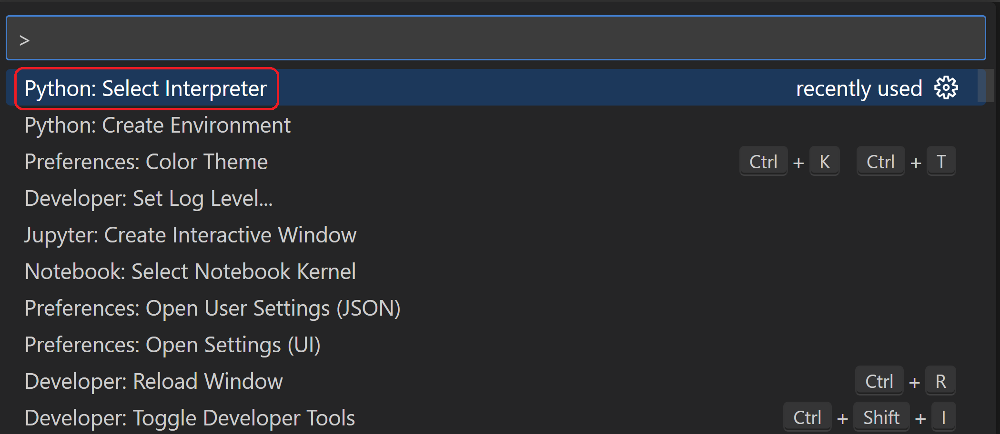

5. The command presents a list of available interpreters that VS Code can locate automatically (your list will vary; if you don't see the desired interpreter, see [Configuring Python environments](https://code.visualstudio.com/docs/python/environments)). From the list, select the virtual environment in your project folder that starts with `./.venv` or `.\.venv`:

   &zeroWidthSpace;该命令列出了 VS Code 可以自动找到的可用解释器的列表（您的列表会有所不同；如果您没有看到所需的解释器，请参阅配置 Python 环境）。从列表中，选择项目文件夹中以 `./.venv` 或 `.\.venv` 开头的虚拟环境：

   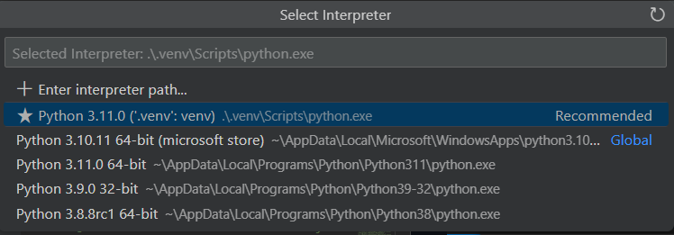

6. Run [**Terminal: Create New Terminal**](https://code.visualstudio.com/docs/terminal/basics) (Ctrl+Shift+`) from the Command Palette, which creates a terminal and automatically activates the virtual environment by running its activation script.

   &zeroWidthSpace;运行终端：从命令面板中创建新终端 (Ctrl+Shift+`)，这将创建一个终端并通过运行其激活脚本自动激活虚拟环境。

   > **Note**: On Windows, if your default terminal type is PowerShell, you may see an error that it cannot run activate.ps1 because running scripts is disabled on the system. The error provides a link for information on how to allow scripts. Otherwise, use **Terminal: Select Default Profile** to set "Command Prompt" or "Git Bash" as your default instead.
   >
   > &zeroWidthSpace;注意：在 Windows 上，如果您的默认终端类型是 PowerShell，您可能会看到一条错误消息，指出它无法运行 activate.ps1，因为系统禁用了运行脚本。该错误提供了一个链接，其中包含有关如何允许脚本的信息。否则，请使用终端：选择默认配置文件，将“命令提示符”或“Git Bash”设置为您的默认值。

7. The selected environment appears on the right side of the VS Code status bar, and notices the **('.venv': venv)** indicator that tells you that you're using a virtual environment:

   &zeroWidthSpace;选定的环境显示在 VS Code 状态栏的右侧，并注意 ('.venv': venv) 指示符，它告诉您您正在使用虚拟环境：

   

8. Update pip in the virtual environment by running the following command in the VS Code Terminal:

   &zeroWidthSpace;通过在 VS Code 终端中运行以下命令来更新虚拟环境中的 pip：

   ```
   python -m pip install --upgrade pip
   ```

9. Install Django in the virtual environment by running the following command in the VS Code Terminal:

   &zeroWidthSpace;在 VS Code 终端中运行以下命令，在虚拟环境中安装 Django：

   ```
   python -m pip install django
   ```

You now have a self-contained environment ready for writing Django code. VS Code activates the environment automatically when you use [**Terminal: Create New Terminal**](https://code.visualstudio.com/docs/terminal/basics) (Ctrl+Shift+`). If you open a separate command prompt or terminal, activate the environment by running `source .venv/bin/activate` (Linux/macOS) or `.venv\Scripts\Activate.ps1` (Windows). You know the environment is activated when the command prompt shows **(.venv)** at the beginning.

&zeroWidthSpace;您现在拥有一个独立的环境，可以编写 Django 代码。当您使用“终端：创建新终端”(Ctrl+Shift+`) 时，VS Code 会自动激活环境。如果您打开单独的命令提示符或终端，请通过运行 `source .venv/bin/activate` (Linux/macOS) 或 `.venv\Scripts\Activate.ps1` (Windows) 来激活环境。当命令提示符开头显示 (.venv) 时，说明环境已激活。

## [Create and run a minimal Django app 创建并运行一个最小的 Django 应用程序](https://code.visualstudio.com/docs/python/tutorial-django#_create-and-run-a-minimal-django-app)

In Django terminology, a "Django project" is composed of several site-level configuration files, along with one or more "apps" that you deploy to a web host to create a full web application. A Django project can contain multiple apps, each of which typically has an independent function in the project, and the same app can be in multiple Django projects. An app, for its part, is just a Python package that follows certain conventions that Django expects.

&zeroWidthSpace;在 Django 术语中，“Django 项目”由多个站点级配置文件以及一个或多个“应用程序”组成，您可以将这些应用程序部署到 Web 主机以创建完整的 Web 应用程序。一个 Django 项目可以包含多个应用程序，每个应用程序通常在项目中具有独立的功能，并且同一个应用程序可以位于多个 Django 项目中。应用程序本身只是一个遵循 Django 预期的某些约定的 Python 包。

To create a minimal Django app, then, it's necessary to first create the Django project to serve as the container for the app, then create the app itself. For both purposes, you use the Django administrative utility, `django-admin`, which is installed when you install the Django package.

&zeroWidthSpace;要创建一个最小的 Django 应用，首先需要创建一个 Django 项目作为应用的容器，然后创建应用本身。对于这两个目的，您需要使用 Django 管理实用程序 `django-admin` ，该实用程序在您安装 Django 包时安装。

### [Create the Django project 创建 Django 项目](https://code.visualstudio.com/docs/python/tutorial-django#_create-the-django-project)

1. In the VS Code Terminal where your virtual environment is activated, run the following command:

   &zeroWidthSpace;在已激活虚拟环境的 VS Code 终端中，运行以下命令：

   ```
   django-admin startproject web_project .
   ```

   This `startproject` command assumes (by use of `.` at the end) that the current folder is your project folder, and creates the following within it:

   &zeroWidthSpace;此 `startproject` 命令假设（通过在末尾使用 `.` ）当前文件夹是您的项目文件夹，并在其中创建以下内容：

   - `manage.py`: The Django command-line administrative utility for the project. You run administrative commands for the project using `python manage.py <command> [options]`.

     &zeroWidthSpace; `manage.py` ：项目的 Django 命令行管理实用程序。您可以使用 `python manage.py <command> [options]` 运行项目的管理命令。

   - A subfolder named `web_project`, which contains the following files:

     &zeroWidthSpace;名为 `web_project` 的子文件夹，其中包含以下文件：

     - `__init__.py`: an empty file that tells Python that this folder is a Python package.
       `__init__.py` ：一个空文件，它告诉 Python 此文件夹是一个 Python 包。
     - `asgi.py`: an entry point for [ASGI-compatible](https://asgi.readthedocs.io/en/latest/) web servers to serve your project. You typically leave this file as-is as it provides the hooks for production web servers.
       `asgi.py` ：ASGI 兼容 Web 服务器为您的项目提供服务的入口点。您通常会原样保留此文件，因为它为生产 Web 服务器提供了挂钩。
     - `settings.py`: contains settings for Django project, which you modify in the course of developing a web app.
       `settings.py` ：包含 Django 项目的设置，您会在开发 Web 应用的过程中对其进行修改。
     - `urls.py`: contains a table of contents for the Django project, which you also modify in the course of development.
       `urls.py` ：包含 Django 项目的目录，您在开发过程中也会对其进行修改。
     - `wsgi.py`: an entry point for WSGI-compatible web servers to serve your project. You typically leave this file as-is as it provides the hooks for production web servers.
       `wsgi.py` ：WSGI 兼容 Web 服务器为您的项目提供服务的入口点。您通常会原样保留此文件，因为它为生产 Web 服务器提供了挂钩。

2. Create an empty development database by running the following command:

   &zeroWidthSpace;通过运行以下命令创建空的开发数据库：

   ```
   python manage.py migrate
   ```

   When you run the server the first time, it creates a default SQLite database in the file `db.sqlite3` that is intended for development purposes, but can be used in production for low-volume web apps. For additional information about databases, see the [Types of databases](https://code.visualstudio.com/docs/python/tutorial-django#_types-of-databases) section.

   &zeroWidthSpace;首次运行服务器时，它会在文件 `db.sqlite3` 中创建一个默认的 SQLite 数据库，该数据库旨在用于开发目的，但可用于流量较少的 Web 应用的生产环境中。有关数据库的其他信息，请参阅数据库类型部分。

3. To verify the Django project, make sure your virtual environment is activated, then start Django's development server using the command `python manage.py runserver`. The server runs on the default port 8000, and you see output like the following output in the terminal window:

   &zeroWidthSpace;要验证 Django 项目，请确保已激活您的虚拟环境，然后使用命令 `python manage.py runserver` 启动 Django 的开发服务器。服务器在默认端口 8000 上运行，您会在终端窗口中看到如下输出：

   ```
   Watching for file changes with StatReloader
   Performing system checks...
   
   System check identified no issues (0 silenced).
   June 13, 2023 - 18:38:07
   Django version 4.2.2, using settings 'web_project.settings'
   Starting development server at http://127.0.0.1:8000/
   Quit the server with CTRL-BREAK.
   ```

   Django's built-in web server is intended *only* for local development purposes. When you deploy to a web host, however, Django uses the host's web server instead. The `wsgi.py` and `asgi.py` modules in the Django project take care of hooking into the production servers.

   &zeroWidthSpace;Django 的内置 Web 服务器仅适用于本地开发目的。但是，当您部署到 Web 主机时，Django 会改用主机的 Web 服务器。Django 项目中的 `wsgi.py` 和 `asgi.py` 模块负责挂接到生产服务器。

   If you want to use a different port than the default 8000, specify the port number on the command line, such as `python manage.py runserver 5000`.

   &zeroWidthSpace;如果您想使用除默认 8000 以外的其他端口，请在命令行中指定端口号，例如 `python manage.py runserver 5000` 。

4. Ctrl+click the `http://127.0.0.1:8000/` URL in the terminal output window to open your default browser to that address. If Django is installed correctly and the project is valid, you see the default page shown below. The VS Code terminal output window also shows the server log.

   &zeroWidthSpace;按住 Ctrl 键并单击终端输出窗口中的 `http://127.0.0.1:8000/` URL，以使用默认浏览器打开该地址。如果 Django 已正确安装且项目有效，您将看到下面显示的默认页面。VS Code 终端输出窗口还会显示服务器日志。

   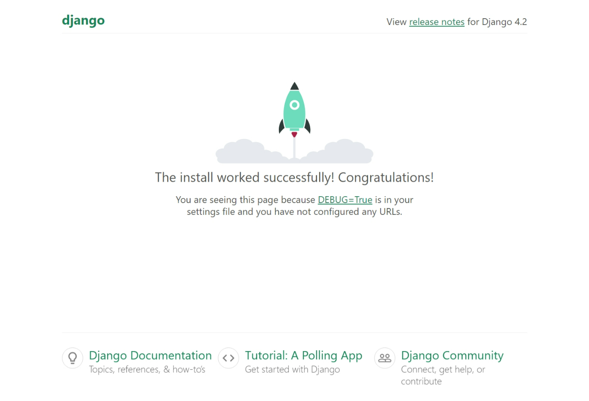

5. When you're done, close the browser window and stop the server in VS Code using Ctrl+C as indicated in the terminal output window.

   &zeroWidthSpace;完成后，关闭浏览器窗口并在 VS Code 中使用 Ctrl+C 停止服务器，如终端输出窗口中所示。

### [Create a Django app 创建 Django 应用](https://code.visualstudio.com/docs/python/tutorial-django#_create-a-django-app)

1. In the VS Code Terminal with your virtual environment activated, run the administrative utility's `startapp` command in your project folder (where `manage.py` resides):

   &zeroWidthSpace;在已激活虚拟环境的 VS Code 终端中，在项目文件夹（其中包含 `manage.py` ）中运行管理实用程序的 `startapp` 命令：

   ```
   python manage.py startapp hello
   ```

   The command creates a folder called `hello` that contains a number of code files and one subfolder. Of these, you frequently work with `views.py` (that contains the functions that define pages in your web app) and `models.py` (that contains classes defining your data objects). The `migrations` folder is used by Django's administrative utility to manage database versions as discussed later in this tutorial. There are also the files `apps.py` (app configuration), `admin.py` (for creating an [administrative interface](https://docs.djangoproject.com/en/3.1/ref/contrib/admin/)), and `tests.py` (for [creating tests](https://docs.djangoproject.com/en/3.1/topics/testing/)), which are not covered here.

   &zeroWidthSpace;该命令创建一个名为 `hello` 的文件夹，其中包含多个代码文件和一个子文件夹。其中，您经常使用 `views.py` （其中包含定义 Web 应用中页面的函数）和 `models.py` （其中包含定义数据对象的类）。Django 的管理实用程序使用 `migrations` 文件夹来管理数据库版本，如本教程后面所述。还有文件 `apps.py` （应用配置）、 `admin.py` （用于创建管理界面）和 `tests.py` （用于创建测试），此处未涉及。

2. Modify `hello/views.py` to match the following code, which creates a single view for the app's home page:

   &zeroWidthSpace;修改 `hello/views.py` 以匹配以下代码，该代码为应用的主页创建单个视图：

   ```
   from django.http import HttpResponse
   
   def home(request):
       return HttpResponse("Hello, Django!")
   ```

3. Create a file, `hello/urls.py`, with the contents below. The `urls.py` file is where you specify patterns to route different URLs to their appropriate views. The code below contains one route to map root URL of the app (`""`) to the `views.home` function that you just added to `hello/views.py`:

   &zeroWidthSpace;创建一个文件 `hello/urls.py` ，内容如下。在 `urls.py` 文件中，您可以指定模式，将不同的 URL 路由到其相应的视图。以下代码包含一个路由，用于将应用的根 URL（ `""` ）映射到您刚刚添加到 `hello/views.py` 的 `views.home` 函数：

   ```
   from django.urls import path
   from hello import views
   
   urlpatterns = [
       path("", views.home, name="home"),
   ]
   ```

4. The `web_project` folder also contains a `urls.py` file, which is where URL routing is actually handled. Open `web_project/urls.py` and modify it to match the following code (you can retain the instructive comments if you like). This code pulls in the app's `hello/urls.py` using `django.urls.include`, which keeps the app's routes contained within the app. This separation is helpful when a project contains multiple apps.

   &zeroWidthSpace;文件夹中还包含一个 `urls.py` 文件，其中实际处理了 URL 路由。打开 `web_project/urls.py` 并将其修改为与以下代码匹配（如果您愿意，可以保留指导性注释）。此代码使用 `django.urls.include` 拉取应用的 `hello/urls.py` ，这使应用的路由包含在应用中。当项目包含多个应用时，这种分离非常有用。

   ```
   from django.contrib import admin
   from django.urls import include, path
   
   urlpatterns = [
       path("", include("hello.urls")),
       path('admin/', admin.site.urls)
   ]
   ```

5. Save all modified files.

   &zeroWidthSpace;保存所有修改过的文件。

6. In the VS Code Terminal, again with the virtual environment activated, run the development server with `python manage.py runserver` and open a browser to `http://127.0.0.1:8000/` to see a page that renders "Hello, Django".

   &zeroWidthSpace;在 VS Code 终端中，再次激活虚拟环境，使用 `python manage.py runserver` 运行开发服务器，然后打开浏览器访问 `http://127.0.0.1:8000/` ，以查看呈现“Hello, Django”的页面。

   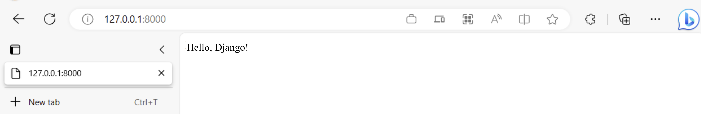

## [Create a debugger launch profile 创建调试器启动配置文件](https://code.visualstudio.com/docs/python/tutorial-django#_create-a-debugger-launch-profile)

You're probably already wondering if there's an easier way to run the server and test the app without typing `python manage.py runserver` each time. Fortunately, there is! You can create a customized launch profile in VS Code, which is also used for the inevitable exercise of debugging.

&zeroWidthSpace;您可能已经想知道有没有更简单的方法来运行服务器并测试应用，而无需每次都键入 `python manage.py runserver` 。幸运的是，有！您可以在 VS Code 中创建一个自定义启动配置文件，它还用于不可避免的调试练习。

1. Switch to **Run** view in VS Code (using the left-side activity bar or F5). You may see the message "To customize Run and Debug create a launch.json file". This means that you don't yet have a `launch.json` file containing debug configurations. VS Code can create that for you if you click on the **create a launch.json file** link:

   &zeroWidthSpace;在 VS Code 中切换到运行视图（使用左侧活动栏或 F5）。您可能会看到消息“要自定义运行和调试，请创建一个 launch.json 文件”。这意味着您还没有包含调试配置的 `launch.json` 文件。如果您单击创建 launch.json 文件链接，VS Code 可以为您创建该文件：

   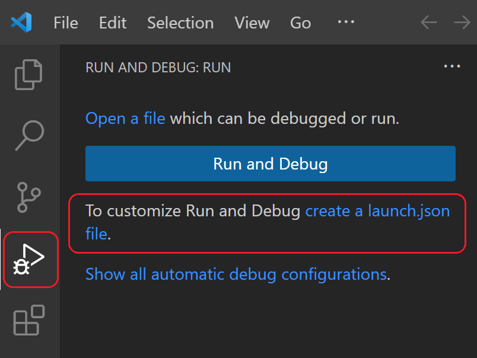

2. Select the link and VS Code will prompt for a debug configuration. Select **Django** from the dropdown and VS Code will populate a new `launch.json` file with a Django run configuration. The `launch.json` file contains a number of debugging configurations, each of which is a separate JSON object within the `configuration` array.

   &zeroWidthSpace;选择该链接，VS Code 将提示您进行调试配置。从下拉列表中选择 Django，VS Code 将使用 Django 运行配置填充一个新的 `launch.json` 文件。 `launch.json` 文件包含许多调试配置，每个配置都是 `configuration` 数组中的一个单独的 JSON 对象。

3. Scroll down to and examine the configuration with the name "Python: Django":

   &zeroWidthSpace;向下滚动并检查名称为“Python: Django”的配置：

   ```
   {
     // Use IntelliSense to learn about possible attributes.
     // Hover to view descriptions of existing attributes.
     // For more information, visit: https://go.microsoft.com/fwlink/?linkid=830387
     "version": "0.2.0",
     "configurations": [
       {
         "name": "Python: Django",
         "type": "python",
         "request": "launch",
         "program": "${workspaceFolder}\\manage.py",
         "args": ["runserver"],
         "django": true,
         "justMyCode": true
       }
     ]
   }
   ```

   This configuration tells VS Code to run `"${workspaceFolder}/manage.py"` using the selected Python interpreter and the arguments in the `args` list. Launching the VS Code debugger with this configuration, then, is the same as running `python manage.py runserver` in the VS Code Terminal with your activated virtual environment. (You can add a port number like `"5000"` to `args` if desired.) The `"django": true` entry also tells VS Code to enable debugging of Django page templates, which you see later in this tutorial.

   &zeroWidthSpace;此配置告诉 VS Code 使用选定的 Python 解释器和 `args` 列表中的参数运行 `"${workspaceFolder}/manage.py"` 。因此，使用此配置启动 VS Code 调试器与在已激活的虚拟环境中使用 VS Code 终端运行 `python manage.py runserver` 相同。（如果需要，您可以在 `args` 中添加端口号，例如 `"5000"` 。） `"django": true` 条目还告诉 VS Code 启用 Django 页面模板的调试，您将在本教程的后面部分看到。

4. Test the configuration by selecting the **Run** > **Start Debugging** menu command, or selecting the green **Start Debugging** arrow next to the list (F5):

   &zeroWidthSpace;通过选择“运行”>“开始调试”菜单命令或选择列表旁边的绿色“开始调试”箭头（F5）来测试配置：

   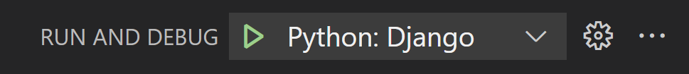

5. Ctrl+click the `http://127.0.0.1:8000/` URL in the terminal output window to open the browser and see that the app is running properly.

   &zeroWidthSpace;Ctrl+单击终端输出窗口中的 `http://127.0.0.1:8000/` URL，以打开浏览器并查看应用程序是否正常运行。

6. Close the browser and stop the debugger when you're finished. To stop the debugger, use the Stop toolbar button (the red square) or the **Run** > **Stop Debugging** command (Shift+F5).

   &zeroWidthSpace;完成后，关闭浏览器并停止调试器。要停止调试器，请使用“停止”工具栏按钮（红色方块）或“运行”>“停止调试”命令（Shift+F5）。

7. You can now use the **Run** > **Start Debugging** at any time to test the app, which also has the benefit of automatically saving all modified files.

   &zeroWidthSpace;现在，您可以随时使用“运行”>“开始调试”来测试应用程序，这还有自动保存所有已修改文件的好处。

## [Explore the debugger 探索调试器](https://code.visualstudio.com/docs/python/tutorial-django#_explore-the-debugger)

Debugging gives you the opportunity to pause a running program on a particular line of code. When a program is paused, you can examine variables, run code in the Debug Console panel, and otherwise take advantage of the features described on [Debugging](https://code.visualstudio.com/docs/python/debugging). Running the debugger also automatically saves any modified files before the debugging session begins.

&zeroWidthSpace;调试使您有机会在特定代码行上暂停正在运行的程序。当程序暂停时，您可以检查变量、在“调试控制台”面板中运行代码，还可以利用“调试”中描述的功能。运行调试器还会在调试会话开始前自动保存所有已修改的文件。

**Before you begin**: Make sure you've stopped the running app at the end of the last section by using Ctrl+C in the terminal. If you leave the app running in one terminal, it continues to own the port. As a result, when you run the app in the debugger using the same port, the original running app handles all the requests and you won't see any activity in the app being debugged and the program won't stop at breakpoints. In other words, if the debugger doesn't seem to be working, make sure that no other instance of the app is still running.

&zeroWidthSpace;开始之前：确保您已在上一节的末尾使用 Ctrl+C 在终端中停止正在运行的应用。如果您让应用在一个终端中运行，它会继续拥有该端口。因此，当您使用相同的端口在调试器中运行应用时，原始运行的应用会处理所有请求，您不会在正在调试的应用中看到任何活动，并且程序不会在断点处停止。换句话说，如果调试器似乎不起作用，请确保没有其他应用实例仍在运行。

1. In `hello/urls.py`, add a route to the `urlpatterns` list:

   &zeroWidthSpace;在 `hello/urls.py` 中，向 `urlpatterns` 列表添加一个路由：

   ```
   path("hello/<name>", views.hello_there, name="hello_there"),
   ```

   The first argument to `path` defines a route "hello/" that accepts a variable string called *name*. The string is passed to the `views.hello_there` function specified in the second argument to `path`.

   &zeroWidthSpace; `path` 的第一个参数定义了一个路由“hello/”，它接受一个名为 name 的可变字符串。该字符串传递给 `path` 的第二个参数中指定的 `views.hello_there` 函数。

   URL routes are case-sensitive. For example, the route `/hello/<name>` is distinct from `/Hello/<name>`. If you want the same view function to handle both, define paths for each variant.

   &zeroWidthSpace;URL 路由区分大小写。例如，路由 `/hello/<name>` 与 `/Hello/<name>` 不同。如果您希望相同的视图函数处理两者，请为每个变体定义路径。

2. Replace the contents of `views.py` with the following code to define the `hello_there` function that you can step through in the debugger:

   &zeroWidthSpace;将 `views.py` 的内容替换为以下代码，以定义您可以在调试器中逐步执行的 `hello_there` 函数：

   ```
   import re
   from django.utils.timezone import datetime
   from django.http import HttpResponse
   
   def home(request):
       return HttpResponse("Hello, Django!")
   
   def hello_there(request, name):
       now = datetime.now()
       formatted_now = now.strftime("%A, %d %B, %Y at %X")
   
       # Filter the name argument to letters only using regular expressions. URL arguments
       # can contain arbitrary text, so we restrict to safe characters only.
       match_object = re.match("[a-zA-Z]+", name)
   
       if match_object:
           clean_name = match_object.group(0)
       else:
           clean_name = "Friend"
   
       content = "Hello there, " + clean_name + "! It's " + formatted_now
       return HttpResponse(content)
   ```

   The `name` variable defined in the URL route is given as an argument to the `hello_there` function. As described in the code comments, always filter arbitrary user-provided information to avoid various attacks on your app. In this case, the code filters the name argument to contain only letters, which avoids injection of control characters, HTML, and so forth. (When you use templates in the next section, Django does automatic filtering and you don't need this code.)

   &zeroWidthSpace;URL 路由中定义的 `name` 变量作为参数提供给 `hello_there` 函数。如代码注释中所述，始终过滤任意用户提供的信息，以避免对应用发起的各种攻击。在此情况下，代码过滤名称参数，使其仅包含字母，从而避免注入控制字符、HTML 等。（在下一部分中使用模板时，Django 会自动过滤，您无需此代码。）

3. Set a breakpoint at the first line of code in the `hello_there` function (`now = datetime.now()`) by doing any one of the following:

   &zeroWidthSpace;通过执行以下任一操作，在 `hello_there` 函数（ `now = datetime.now()` ）的代码第一行处设置断点：

   - With the cursor on that line, press F9, or,
     将光标置于该行，按 F9，或
   - With the cursor on that line, select the **Run** > **Toggle Breakpoint** menu command, or,
     将光标置于该行，选择“运行”>“切换断点”菜单命令，或
   - Click directly in the margin to the left of the line number (a faded red dot appears when hovering there).
     直接单击行号左侧的边距（将鼠标悬停在那里时，会出现一个褪色的红点）。

   The breakpoint appears as a red dot in the left margin:

   &zeroWidthSpace;断点显示为左侧边距中的红点：

   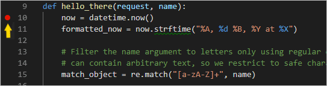

4. Start the debugger by selecting the **Run** > **Start Debugging** menu command, or selecting the green **Start Debugging** arrow next to the list (F5):

   &zeroWidthSpace;通过选择“运行”>“开始调试”菜单命令或选择列表旁边的绿色“开始调试”箭头（F5）来启动调试器：

   

   Observe that the status bar changes color to indicate debugging:

   &zeroWidthSpace;观察到状态栏的颜色发生变化，以指示正在调试：

   

   A debugging toolbar (shown below) also appears in VS Code containing commands in the following order: Pause (or Continue, F5), Step Over (F10), Step Into (F11), Step Out (Shift+F11), Restart (Ctrl+Shift+F5), and Stop (Shift+F5). See [VS Code debugging](https://code.visualstudio.com/docs/editor/debugging) for a description of each command.

   &zeroWidthSpace;VS Code 中还会显示一个调试工具栏（如下所示），其中按以下顺序排列着命令：暂停（或继续，F5）、单步执行（F10）、单步进入（F11）、单步退出（Shift+F11）、重新启动（Ctrl+Shift+F5）和停止（Shift+F5）。有关每个命令的说明，请参阅 VS Code 调试。

   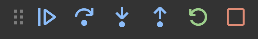

5. Output appears in a "Python Debug Console" terminal. Open a browser and navigate to `http://127.0.0.1:8000/hello/VSCode`. Before the page renders, VS Code pauses the program at the breakpoint you set. The small yellow arrow on the breakpoint indicates that it's the next line of code to run.

   &zeroWidthSpace;输出显示在“Python 调试控制台”终端中。打开浏览器并导航到 `http://127.0.0.1:8000/hello/VSCode` 。在页面呈现之前，VS Code 会在您设置的断点处暂停程序。断点上的小黄色箭头表示它是下一行要运行的代码。

   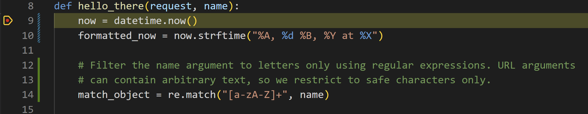

6. Use Step Over to run the `now = datetime.now()` statement.

   &zeroWidthSpace;使用单步执行来运行 `now = datetime.now()` 语句。

7. On the left side of the VS Code window, you see a **Variables** pane that shows local variables, such as `now`, as well as arguments, such as `name`. Below that are panes for **Watch**, **Call Stack**, and **Breakpoints** (see [VS Code debugging](https://code.visualstudio.com/docs/editor/debugging) for details). In the **Locals** section, try expanding different values. You can also double-click values (or use F2) to modify them. Changing variables such as `now`, however, can break the program. Developers typically make changes only to correct values when the code didn't produce the right value to begin with.

   &zeroWidthSpace;在 VS Code 窗口的左侧，您会看到一个变量窗格，其中显示了局部变量（例如 `now` ）以及参数（例如 `name` ）。其下方是监视、调用堆栈和断点窗格（有关详细信息，请参阅 VS Code 调试）。在“局部变量”部分，尝试展开不同的值。您还可以双击值（或使用 F2）来修改它们。但是，更改变量（例如 `now` ）可能会中断程序。通常，开发人员仅在代码一开始未生成正确的值时才进行更改以更正值。

   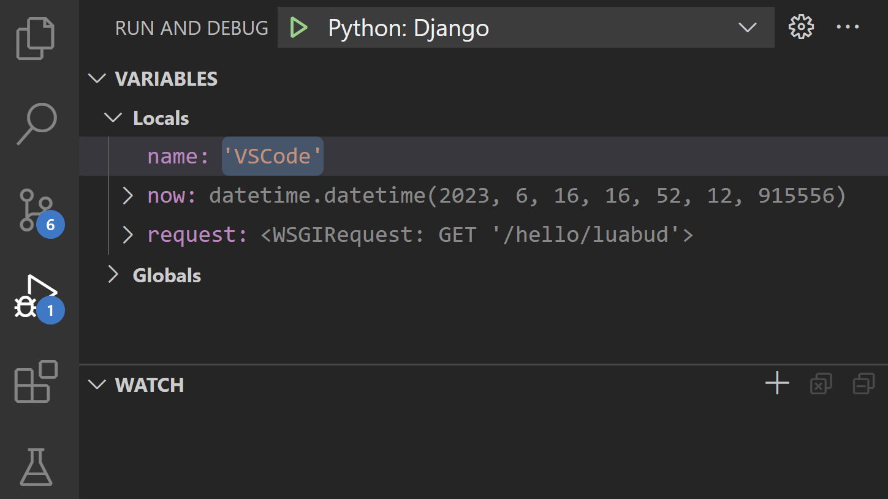

8. When a program is paused, the **Debug Console** panel (which is different from the "Python Debug Console" in the Terminal panel) lets you experiment with expressions and try out bits of code using the current state of the program. For example, once you've stepped over the line `now = datetime.now()`, you might experiment with different date/time formats. In the editor, select the code that reads `now.strftime("%A, %d %B, %Y at %X")`, then right-click and select **Debug: Evaluate** to send that code to the debug console, where it runs:

   &zeroWidthSpace;当程序暂停时，调试控制台面板（不同于终端面板中的“Python 调试控制台”）允许您使用程序的当前状态试验表达式并尝试代码片段。例如，一旦您跨过行 `now = datetime.now()` ，您就可以试验不同的日期/时间格式。在编辑器中，选择读取 `now.strftime("%A, %d %B, %Y at %X")` 的代码，然后右键单击并选择调试：求值以将该代码发送到调试控制台，它将在其中运行：

   ```
   now.strftime("%A, %d %B, %Y at %X")
   'Friday, 07 September, 2018 at 07:46:32'
   ```

   > **Tip**: The **Debug Console** also shows exceptions from within the app that may not appear in the terminal. For example, if you see a "Paused on exception" message in the **Call Stack** area of **Run and Debug** view, switch to the **Debug Console** to see the exception message.
   >
   > &zeroWidthSpace;提示：调试控制台还会显示应用程序中可能不会出现在终端中的异常。例如，如果您在运行和调试视图的调用堆栈区域中看到“暂停异常”消息，请切换到调试控制台以查看异常消息。

9. Copy that line into the > prompt at the bottom of the debug console, and try changing the formatting:

   &zeroWidthSpace;将该行复制到调试控制台底部的 > 提示符中，然后尝试更改格式：

   ```
   now.strftime("%A, %d %B, %Y at %X")
   'Tuesday, 13 June, 2023 at 18:03:19'
   now.strftime("%a, %d %b, %Y at %X")
   'Tue, 13 Jun, 2023 at 18:03:19'
   now.strftime("%a, %d %b, %y at %X")
   'Tue, 13 Jun, 23 at 18:03:19'
   ```

10. Step through a few more lines of code, if you'd like, then select Continue (F5) to let the program run. The browser window shows the result:

    &zeroWidthSpace;如果您愿意，可以逐步执行更多代码行，然后选择继续（F5）以让程序运行。浏览器窗口显示结果：

    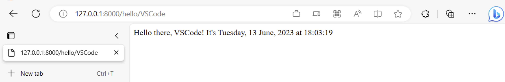

11. Change the line in the code to use different datetime format, for example `now.strftime("%a, %d %b, %y at %X")`, and then save the file. The Django server will automatically reload, which means the changes will be applied without the need to restart the debugger. Refresh the page on the browser to see the update.

    &zeroWidthSpace;更改代码中的行以使用不同的日期时间格式，例如 `now.strftime("%a, %d %b, %y at %X")` ，然后保存文件。Django 服务器将自动重新加载，这意味着无需重新启动调试器即可应用更改。刷新浏览器上的页面以查看更新。

12. Close the browser and stop the debugger when you're finished. To stop the debugger, use the Stop toolbar button (the red square) or the **Run** > **Stop Debugging** command (Shift+F5).

    &zeroWidthSpace;完成后，关闭浏览器并停止调试器。要停止调试器，请使用“停止”工具栏按钮（红色方块）或“运行”>“停止调试”命令（Shift+F5）。

> **Tip**: To make it easier to repeatedly navigate to a specific URL like `http://127.0.0.1:8000/hello/VSCode`, output that URL using a `print` statement somewhere in a file like `views.py`. The URL appears in the VS Code Terminal where you can use Ctrl+click to open it in a browser.
>
> &zeroWidthSpace;提示：为了更轻松地反复导航到特定 URL（如 `http://127.0.0.1:8000/hello/VSCode` ），请在 `views.py` 等文件中的某个位置使用 `print` 语句输出该 URL。URL 会显示在 VS Code 终端中，您可以在其中使用 Ctrl+单击在浏览器中将其打开。

## [Go to Definition and Peek Definition commands 转到定义和查看定义命令](https://code.visualstudio.com/docs/python/tutorial-django#_go-to-definition-and-peek-definition-commands)

During your work with Django or any other library, you may want to examine the code in those libraries themselves. VS Code provides two convenient commands that navigate directly to the definitions of classes and other objects in any code:

&zeroWidthSpace;在使用 Django 或任何其他库时，您可能希望检查这些库中的代码本身。VS Code 提供了两个方便的命令，可直接导航到任何代码中类和其他对象的定义：

- **Go to Definition** jumps from your code into the code that defines an object. For example, in `views.py`, right-click on `HttpResponse` in the `home` function and select **Go to Definition** (or use F12), which navigates to the class definition in the Django library.

  &zeroWidthSpace;转到定义从您的代码跳转到定义对象的代码。例如，在 `views.py` 中，右键单击 `HttpResponse` 中的 `home` 函数并选择转到定义（或使用 F12），这会导航到 Django 库中的类定义。

- **Peek Definition** (Alt+F12, also on the right-click context menu), is similar, but displays the class definition directly in the editor (making space in the editor window to avoid obscuring any code). Press Escape to close the Peek window or use the **x** in the upper right corner.

  &zeroWidthSpace;窥视定义（Alt+F12，也在右键单击上下文菜单中）类似，但直接在编辑器中显示类定义（在编辑器窗口中腾出空间以避免遮挡任何代码）。按 Escape 关闭窥视窗口或使用右上角的 x。

  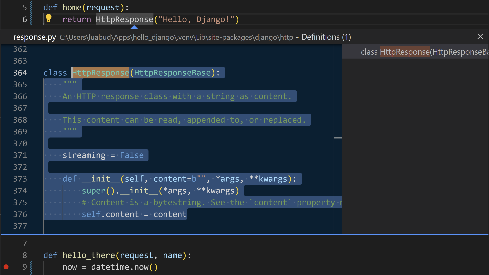

## [Use a template to render a page 使用模板呈现页面](https://code.visualstudio.com/docs/python/tutorial-django#_use-a-template-to-render-a-page)

The app you've created so far in this tutorial generates only plain text web pages from Python code. Although it's possible to generate HTML directly in code, developers avoid such a practice because it opens the app to [cross-site scripting (XSS) attacks](https://en.wikipedia.org/wiki/Cross-site_scripting). In the `hello_there` function of this tutorial, for example, one might think to format the output in code with something like `content = "<h1>Hello there, " + clean_name + "!</h1>"`, where the result in `content` is given directly to a browser. This opening allows an attacker to place malicious HTML, including JavaScript code, in the URL that ends up in `clean_name` and thus ends up being run in the browser.

&zeroWidthSpace;您在此教程中迄今为止创建的应用程序仅从 Python 代码生成纯文本网页。尽管可以直接在代码中生成 HTML，但开发人员避免这样做，因为这会使应用程序面临跨站点脚本 (XSS) 攻击。例如，在此教程的 `hello_there` 函数中，人们可能会想到使用类似 `content = "<h1>Hello there, " + clean_name + "!</h1>"` 的代码格式化输出，其中 `content` 中的结果直接提供给浏览器。这种开放允许攻击者将恶意 HTML（包括 JavaScript 代码）放入最终进入 `clean_name` 的 URL 中，从而最终在浏览器中运行。

A much better practice is to keep HTML out of your code entirely by using **templates**, so that your code is concerned only with data values and not with rendering.

&zeroWidthSpace;一个更好的做法是通过使用模板将 HTML 完全排除在代码之外，以便代码只关注数据值，而不关注渲染。

In Django, a template is an HTML file that contains placeholders for values that the code provides at run time. The Django templating engine then takes care of making the substitutions when rendering the page, and provides automatic escaping to prevent XSS attacks (that is, if you tried using HTML in a data value, you would see the HTML rendered only as plain text). The code, therefore, concerns itself only with data values and the template concerns itself only with markup. Django templates provide flexible options such as template inheritance, which allows you to define a base page with common markup and then build upon that base with page-specific additions.

&zeroWidthSpace;在 Django 中，模板是一个 HTML 文件，其中包含代码在运行时提供的值的占位符。然后，Django 模板引擎负责在渲染页面时进行替换，并提供自动转义以防止 XSS 攻击（也就是说，如果您尝试在数据值中使用 HTML，您将只看到纯文本形式的 HTML）。因此，代码只关注数据值，而模板只关注标记。Django 模板提供了灵活的选项，例如模板继承，它允许您定义一个具有通用标记的基本页面，然后在此基础上构建具有特定于页面的附加内容。

In this section, you start by creating a single page using a template. In subsequent sections, you configure the app to serve static files and then create multiple pages to the app that each contains a nav bar from a base template. Django templates also support control flow and iteration, as you see later in this tutorial in the context of template debugging.

&zeroWidthSpace;在本节中，您首先使用模板创建一个单独的页面。在后续部分中，您将配置应用程序以提供静态文件，然后为应用程序创建多个页面，每个页面都包含来自基本模板的导航栏。Django 模板还支持控制流和迭代，如您在本教程的后面部分在模板调试的上下文中看到的那样。

1. In the `web_project/settings.py` file, locate the `INSTALLED_APPS` list and add the following entry, which makes sure the project knows about the app so it can handle templating:

   &zeroWidthSpace;在 `web_project/settings.py` 文件中，找到 `INSTALLED_APPS` 列表并添加以下条目，这可确保项目了解该应用，以便它可以处理模板化：

   ```
   'hello',
   ```

2. Inside the `hello` folder, create a folder named `templates`, and then another subfolder named `hello` to match the app name (this two-tiered folder structure is typical Django convention).

   &zeroWidthSpace;在 `hello` 文件夹中，创建一个名为 `templates` 的文件夹，然后创建另一个名为 `hello` 的子文件夹以匹配应用名称（这种两层文件夹结构是典型的 Django 约定）。

3. In the `templates/hello` folder, create a file named `hello_there.html` with the contents below. This template contains two placeholders for data values named "name", and "date", which are delineated by pairs of curly braces, `{{` and `}}`. All other invariant text is part of the template, along with formatting markup (such as `<strong>`). As you can see, template placeholders can also include formatting, the expressions after the pipe `|` symbols, in this case using Django's built-in [date filter](https://docs.djangoproject.com/en/3.1/ref/templates/builtins/#date) and [time filter](https://docs.djangoproject.com/en/3.1/ref/templates/builtins/#time). The code, then needs only to pass the datetime *value* rather than a pre-formatted string:

   &zeroWidthSpace;在 `templates/hello` 文件夹中，创建一个名为 `hello_there.html` 的文件，内容如下。此模板包含两个占位符，用于名为“name”和“date”的数据值，它们由一对花括号 `{{` 和 `}}` 划定。所有其他不变文本都是模板的一部分，以及格式化标记（例如 `<strong>` ）。如您所见，模板占位符还可以包括格式化，管道 `|` 符号之后的表达式，在本例中使用 Django 的内置日期过滤器和时间过滤器。然后，代码只需要传递 datetime 值，而不是预格式化的字符串：

   ```
   <!DOCTYPE html>
   <html>
       <head>
           <meta charset="utf-8" />
           <title>Hello, Django</title>
       </head>
       <body>
           <strong>Hello there, {{ name }}!</strong> It's {{ date | date:"l, d F, Y" }} at {{ date | time:"H:i:s" }}
       </body>
   </html>
   ```

4. At the top of `views.py`, add the following import statement:

   &zeroWidthSpace;在 `views.py` 的顶部，添加以下导入语句：

   ```
   from django.shortcuts import render
   ```

5. Also in `views.py`, modify the `hello_there` function to use `django.shortcuts.render` method to load a template and to provide the *template context*. The context is the set of variables for use within the template. The `render` function takes the request object, followed by the path to to the template *relative to the `templates` folder*, then the context object. (Developers typically name the templates the same as the functions that use them, but matching names are not required because you always refer to the exact filename in your code.)

   &zeroWidthSpace;同样在 `views.py` 中，修改 `hello_there` 函数以使用 `django.shortcuts.render` 方法加载模板并提供模板上下文。上下文是模板中使用的变量集。 `render` 函数获取请求对象，然后获取相对于 `templates` 文件夹的模板路径，然后获取上下文对象。（开发人员通常将模板命名为使用它们的函数的名称，但由于您始终在代码中引用确切的文件名，因此不需要匹配名称。）

   ```
   def hello_there(request, name):
       print(request.build_absolute_uri()) #optional
       return render(
           request,
           'hello/hello_there.html',
           {
               'name': name,
               'date': datetime.now()
           }
       )
   ```

   You can see that the code is now much simpler, and concerned only with data values, because the markup and formatting is all contained in the template.

   &zeroWidthSpace;您会看到代码现在简单多了，并且只关注数据值，因为标记和格式都包含在模板中。

6. Start the program (inside or outside of the debugger, using Ctrl+F5), navigate to a /hello/name URL, and observe the results.

   &zeroWidthSpace;启动程序（在调试器内部或外部，使用 Ctrl+F5），导航到 /hello/name URL，并观察结果。

7. Also try navigating to a /hello/name URL using a name like `<a%20value%20that%20could%20be%20HTML>` to see Django's automatic escaping at work. The "name" value shows up as plain text in the browser rather than as rendering an actual element.

   &zeroWidthSpace;还可以尝试使用 `<a%20value%20that%20could%20be%20HTML>` 之类的名称导航到 /hello/name URL，以查看 Django 的自动转义功能。在浏览器中，“name”值显示为纯文本，而不是呈现实际元素。

## [Serve static files 提供静态文件](https://code.visualstudio.com/docs/python/tutorial-django#_serve-static-files)

Static files are pieces of content that your web app returns as-is for certain requests, such as CSS files. Serving static files requires that the `INSTALLED_APPS` list in `settings.py` contains `django.contrib.staticfiles`, which is included by default.

&zeroWidthSpace;静态文件是您的网络应用按原样返回的某些请求的内容片段，例如 CSS 文件。提供静态文件需要 `INSTALLED_APPS` 中的 `settings.py` 列表包含 `django.contrib.staticfiles` ，默认情况下包含此项。

Serving static files in Django is something of an art, especially when deploying to production. What's shown here is a simple approach that works with the Django development server and also a production server like Gunicorn. A full treatment of static files, however, is beyond the scope of this tutorial, so for more information, see [Managing static files](https://docs.djangoproject.com/en/3.1/howto/static-files/) in the Django documentation.

&zeroWidthSpace;在 Django 中提供静态文件是一门艺术，尤其是在部署到生产环境时。此处显示的是一种简单的方法，适用于 Django 开发服务器以及 Gunicorn 等生产服务器。但是，本教程的范围不包括对静态文件的全面处理，因此有关更多信息，请参阅 Django 文档中的管理静态文件。

When switching to production, navigate to `settings.py`, set `DEBUG=False`, and change `ALLOWED_HOSTS = ['*']` to allow specific hosts. This may result in additional work when using containers. For details, see [Issue 13](https://github.com/microsoft/python-sample-vscode-django-tutorial/issues/13).

&zeroWidthSpace;切换到生产环境时，导航到 `settings.py` ，设置 `DEBUG=False` ，然后更改 `ALLOWED_HOSTS = ['*']` 以允许特定主机。使用容器时，这可能会导致额外的工作。有关详细信息，请参阅问题 13。

### [Ready the app for static files 为静态文件准备应用](https://code.visualstudio.com/docs/python/tutorial-django#_ready-the-app-for-static-files)

1. In the project's `web_project/urls.py`, add the following `import` statement:

   &zeroWidthSpace;在项目的 `web_project/urls.py` 中，添加以下 `import` 语句：

   ```
   from django.contrib.staticfiles.urls import staticfiles_urlpatterns
   ```

2. In that same file, add the following line at the end, which includes standard static file URLs to the list that the project recognizes:

   &zeroWidthSpace;在同一文件中，在末尾添加以下行，将标准静态文件 URL 包含到项目识别的列表中：

   ```
   urlpatterns += staticfiles_urlpatterns()
   ```

### [Refer to static files in a template 在模板中引用静态文件](https://code.visualstudio.com/docs/python/tutorial-django#_refer-to-static-files-in-a-template)

1. In the `hello` folder, create a folder named `static`.

   &zeroWidthSpace;在 `hello` 文件夹中，创建一个名为 `static` 的文件夹。

2. Within the `static` folder, create a subfolder named `hello`, matching the app name.

   &zeroWidthSpace;在 `static` 文件夹中，创建一个名为 `hello` 的子文件夹，与应用名称匹配。

   The reason for this extra subfolder is that when you deploy the Django project to a production server, you collect all the static files into a single folder that's then served by a dedicated static file server. The `static/hello` subfolder ensures that when the app's static files are collected, they're in an app-specific subfolder and won't collide with file from other apps in the same project.

   &zeroWidthSpace;创建此额外子文件夹的原因是，当您将 Django 项目部署到生产服务器时，您会将所有静态文件收集到一个文件夹中，然后由专用的静态文件服务器提供服务。 `static/hello` 子文件夹确保在收集应用的静态文件时，它们位于特定于应用的子文件夹中，并且不会与同一项目中其他应用的文件发生冲突。

3. In the `static/hello` folder, create a file named `site.css` with the following contents. After entering this code, also observe the syntax highlighting that VS Code provides for CSS files, including a color preview.

   &zeroWidthSpace;在 `static/hello` 文件夹中，创建一个名为 `site.css` 的文件，其中包含以下内容。输入此代码后，还可以观察 VS Code 为 CSS 文件提供的语法突出显示，包括颜色预览。

   ```
   .message {
       font-weight: 600;
       color: blue;
   }
   ```

4. In `templates/hello/hello_there.html`, add the following lines after the `<title>` element. The `` tag is a custom Django template tag set, which allows you to use `` to refer to a file like the stylesheet.

   &zeroWidthSpace;在 `templates/hello/hello_there.html` 中，在 `<title>` 元素后添加以下行。 `` 标记是一个自定义 Django 模板标记集，它允许您使用 `` 来引用文件，例如样式表。

   ```
   
   <link rel="stylesheet" type="text/css" href="" />
   ```

5. Also in `templates/hello/hello_there.html`, replace the contents `<body>` element with the following markup that uses the `message` style instead of a `<strong>` tag:

   &zeroWidthSpace;同样在 `templates/hello/hello_there.html` 中，使用 `message` 样式而不是 `<strong>` 标记，将 `<body>` 元素的内容替换为以下标记：

   ```
   <span class="message">Hello, there {{ name }}!</span> It's {{ date | date:'l, d F, Y' }} at {{ date | time:'H:i:s' }}.
   ```

6. Run the app, navigate to a /hello/name URL, and observe that the message renders in blue. Stop the app when you're done.

   &zeroWidthSpace;运行应用，导航到 /hello/name URL，并观察消息以蓝色呈现。完成后停止应用。

### [Use the collectstatic command 使用 collectstatic 命令](https://code.visualstudio.com/docs/python/tutorial-django#_use-the-collectstatic-command)

For production deployments, you typically collect all the static files from your apps into a single folder using the `python manage.py collectstatic` command. You can then use a dedicated static file server to serve those files, which typically results in better overall performance. The following steps show how this collection is made, although you don't use the collection when running with the Django development server.

&zeroWidthSpace;对于生产部署，您通常使用 `python manage.py collectstatic` 命令将所有静态文件从您的应用收集到一个文件夹中。然后，您可以使用专用的静态文件服务器来提供这些文件，这通常会带来更好的整体性能。以下步骤演示如何进行此收集，尽管在使用 Django 开发服务器运行时您不会使用该收集。

1. In `web_project/settings.py`, add the following line that defines a location where static files are collected when you use the `collectstatic` command:

   &zeroWidthSpace;在 `web_project/settings.py` 中，添加以下行，该行定义了使用 `collectstatic` 命令收集静态文件的位置：

   ```
   STATIC_ROOT = BASE_DIR / 'static_collected'
   ```

2. In the Terminal, run the command `python manage.py collectstatic` and observe that `hello/site.css` is copied into the top level `static_collected` folder alongside `manage.py`.

   &zeroWidthSpace;在终端中，运行命令 `python manage.py collectstatic` 并观察 `hello/site.css` 被复制到顶级 `static_collected` 文件夹中，与 `manage.py` 并排。

3. In practice, run `collectstatic` any time you change static files and before deploying into production.

   &zeroWidthSpace;在实践中，在您更改静态文件且在部署到生产环境之前，随时运行 `collectstatic` 。

## [Create multiple templates that extend a base template 创建多个扩展基本模板的模板](https://code.visualstudio.com/docs/python/tutorial-django#_create-multiple-templates-that-extend-a-base-template)

Because most web apps have more than one page, and because those pages typically share many common elements, developers separate those common elements into a base page template that other page templates then extend. (This is also called template inheritance, meaning the extended pages inherit elements from the base page.)

&zeroWidthSpace;因为大多数 Web 应用有多个页面，并且因为这些页面通常共享许多常见元素，所以开发人员将这些常见元素分离到一个基本页面模板中，然后其他页面模板再扩展该基本模板。（这也称为模板继承，这意味着扩展的页面从基本页面继承元素。）

Also, because you'll likely create many pages that extend the same template, it's helpful to create a code snippet in VS Code with which you can quickly initialize new page templates. A snippet helps you avoid tedious and error-prone copy-paste operations.

&zeroWidthSpace;此外，由于您可能会创建许多扩展相同模板的页面，因此在 VS Code 中创建一个代码片段很有用，您可以使用该代码片段快速初始化新的页面模板。代码片段可帮助您避免繁琐且容易出错的复制粘贴操作。

The following sections walk through different parts of this process.

&zeroWidthSpace;以下部分将介绍此过程的不同部分。

### [Create a base page template and styles 创建基本页面模板和样式](https://code.visualstudio.com/docs/python/tutorial-django#_create-a-base-page-template-and-styles)

A base page template in Django contains all the shared parts of a set of pages, including references to CSS files, script files, and so forth. Base templates also define one or more **block** tags with content that extended templates are expected to override. A block tag is delineated by `` and `` in both the base template and extended templates.

&zeroWidthSpace;Django 中的基本页面模板包含一组页面的所有共享部分，包括对 CSS 文件、脚本文件等的引用。基本模板还定义一个或多个块标记，其中包含扩展模板应覆盖的内容。块标记由 `` 和 `` 在基本模板和扩展模板中分隔。

The following steps demonstrate creating a base template.

&zeroWidthSpace;以下步骤演示如何创建基本模板。

1. In the `templates/hello` folder, create a file named `layout.html` with the contents below, which contains blocks named "title" and "content". As you can see, the markup defines a simple nav bar structure with links to Home, About, and Contact pages, which you create in a later section. Notice the use of Django's `` tag to refer to other pages through the names of the corresponding URL patterns rather than by relative path.

   &zeroWidthSpace;在 `templates/hello` 文件夹中，创建一个名为 `layout.html` 的文件，其内容如下，其中包含名为“title”和“content”的块。如您所见，标记定义了一个简单的导航栏结构，其中包含指向主页、关于和联系方式页面的链接，您将在后面的部分中创建这些页面。请注意使用 Django 的 `` 标记通过相应 URL 模式的名称而不是相对路径来引用其他页面。

   ```
   <!DOCTYPE html>
   <html>
   <head>
       <meta charset="utf-8"/>
       <title></title>
       
       <link rel="stylesheet" type="text/css" href=""/>
   </head>
   
   <body>
   <div class="navbar">
       <a href="" class="navbar-brand">Home</a>
       <a href="" class="navbar-item">About</a>
       <a href="" class="navbar-item">Contact</a>
   </div>
   
   <div class="body-content">
       
       
       <hr/>
       <footer>
           <p>&copy; 2018</p>
       </footer>
   </div>
   </body>
   </html>
   ```

2. Add the following styles to `static/hello/site.css` below the existing "message" style, and save the file. (This walkthrough doesn't attempt to demonstrate responsive design; these styles simply generate a reasonably interesting result.)

   &zeroWidthSpace;在 `static/hello/site.css` 中现有“message”样式下方添加以下样式，然后保存文件。（本演练不尝试演示响应式设计；这些样式只是生成一个相当有趣的结果。）

   ```
   .navbar {
       background-color: lightslategray;
       font-size: 1em;
       font-family: 'Trebuchet MS', 'Lucida Sans Unicode', 'Lucida Grande', 'Lucida Sans', Arial, sans-serif;
       color: white;
       padding: 8px 5px 8px 5px;
   }
   
   .navbar a {
       text-decoration: none;
       color: inherit;
   }
   
   .navbar-brand {
       font-size: 1.2em;
       font-weight: 600;
   }
   
   .navbar-item {
       font-variant: small-caps;
       margin-left: 30px;
   }
   
   .body-content {
       padding: 5px;
       font-family:'Segoe UI', Tahoma, Geneva, Verdana, sans-serif;
   }
   ```

You can run the app at this point, but because you haven't made use of the base template anywhere and haven't changed any code files, the result is the same as the previous step. Complete the remaining sections to see the final effect.

&zeroWidthSpace;您现在可以运行该应用，但由于您尚未在任何地方使用基本模板，也未更改任何代码文件，因此结果与上一步相同。完成剩余部分以查看最终效果。

### [Create a code snippet 创建代码段](https://code.visualstudio.com/docs/python/tutorial-django#_create-a-code-snippet)

Because the three pages you create in the next section extend `layout.html`, it saves time to create a **code snippet** to initialize a new template file with the appropriate reference to the base template. A code snippet provides a consistent piece of code from a single source, which avoids errors that can creep in when using copy-paste from existing code.

&zeroWidthSpace;因为您在下一部分中创建的三个页面会扩展 `layout.html` ，所以创建一个代码片段来初始化一个新的模板文件，其中包含对基本模板的适当引用，这样可以节省时间。代码片段提供来自单个源的一致的代码块，从而避免了在从现有代码中复制粘贴时可能出现的错误。

1. In VS Code, select the **File** (Windows/Linux) or **Code** (macOS), menu, then select **Preferences** > **User snippets**.

   &zeroWidthSpace;在 VS Code 中，选择“文件”(Windows/Linux) 或“代码”(macOS) 菜单，然后选择“首选项”>“用户代码片段”。

2. In the list that appears, select **html**. (The option may appear as "html.json" in the **Existing Snippets** section of the list if you've created snippets previously.)

   &zeroWidthSpace;在出现的列表中，选择 html。（如果您之前创建过代码片段，该选项可能会在列表的“现有代码片段”部分中显示为“html.json”。）

3. After VS code opens `html.json`, add the code below within the existing curly braces. (The explanatory comments, not shown here, describe details such as how the `$0` line indicates where VS Code places the cursor after inserting a snippet):

   &zeroWidthSpace;VS 代码打开 `html.json` 后，在现有的花括号内添加以下代码。（此处未显示的说明性注释描述了诸如 `$0` 行指示 VS Code 在插入代码片段后将光标置于何处之类的详细信息）：

   ```
   "Django Tutorial: template extending layout.html": {
       "prefix": "djextlayout",
       "body": [
           "",
           "",
           "$0",
           "",
           "",
           ""
       ],
   
       "description": "Boilerplate template that extends layout.html"
   },
   ```

4. Save the `html.json` file (Ctrl+S).

   &zeroWidthSpace;保存 `html.json` 文件（Ctrl+S）。

5. Now, whenever you start typing the snippet's prefix, such as `djext`, VS Code provides the snippet as an autocomplete option, as shown in the next section. You can also use the **Insert Snippet** command to choose a snippet from a menu.

   &zeroWidthSpace;现在，每当您开始键入代码片段的前缀（例如 `djext` ）时，VS Code 都会提供该代码片段作为自动完成选项，如下一部分所示。您还可以使用“插入代码片段”命令从菜单中选择一个代码片段。

For more information on code snippets in general, refer to [Creating snippets](https://code.visualstudio.com/docs/editor/userdefinedsnippets).

&zeroWidthSpace;有关代码片段的更多信息，请参阅创建片段。

### [Use the code snippet to add pages 使用代码片段添加页面](https://code.visualstudio.com/docs/python/tutorial-django#_use-the-code-snippet-to-add-pages)

With the code snippet in place, you can quickly create templates for the Home, About, and Contact pages.

&zeroWidthSpace;有了代码片段，您可以快速创建主页、关于和联系页面模板。

1. In the `templates/hello` folder, create a new file named `home.html`, Then start typing `djext` to see the snippet appear as a completion:

   &zeroWidthSpace;在 `templates/hello` 文件夹中，创建一个名为 `home.html` 的新文件，然后开始键入 `djext` 以查看片段作为自动完成出现：

   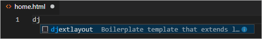

   When you select the completion, the snippet's code appears with the cursor on the snippet's insertion point:

   &zeroWidthSpace;选择自动完成时，片段的代码会显示，光标位于片段的插入点：

   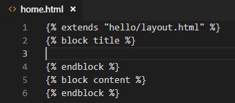

2. At the insertion point in the "title" block, write `Home`, and in the "content" block, write `<p>Home page for the Visual Studio Code Django tutorial.</p>`, then save the file. These lines are the only unique parts of the extended page template:

   &zeroWidthSpace;在“标题”块的插入点处，写 `Home` ，在“内容”块中，写 `<p>Home page for the Visual Studio Code Django tutorial.</p>` ，然后保存文件。这些行是扩展页面模板中唯一的独特部分：

3. In the `templates/hello` folder, create `about.html`, use the snippet to insert the boilerplate markup, insert `About us` and `<p>About page for the Visual Studio Code Django tutorial.</p>` in the "title" and "content" blocks, respectively, then save the file.

   &zeroWidthSpace;在 `templates/hello` 文件夹中，创建 `about.html` ，使用片段插入样板标记，在“标题”和“内容”块中分别插入 `About us` 和 `<p>About page for the Visual Studio Code Django tutorial.</p>` ，然后保存文件。

4. Repeat the previous step to create `templates/hello/contact.html` using `Contact us` and `<p>Contact page for the Visual Studio Code Django tutorial.</p>`.

   &zeroWidthSpace;重复上一步，使用 `Contact us` 和 `<p>Contact page for the Visual Studio Code Django tutorial.</p>` 创建 `templates/hello/contact.html` 。

5. In the app's `urls.py`, add routes for the /about and /contact pages. Be mindful that the `name` argument to the `path` function defines the name with which you refer to the page in the `` tags in the templates.

   &zeroWidthSpace;在应用的 `urls.py` 中，添加 /about 和 /contact 页面的路由。请注意， `path` 函数的 `name` 参数定义了您在模板中的 `` 标记中引用页面的名称。

   ```
   path("about/", views.about, name="about"),
   path("contact/", views.contact, name="contact"),
   ```

6. In `views.py`, add functions for the /about and /contact routes that refer to their respective page templates. Also modify the `home` function to use the `home.html` template.

   &zeroWidthSpace;在 `views.py` 中，添加指向各自页面模板的 /about 和 /contact 路由的函数。还要修改 `home` 函数以使用 `home.html` 模板。

   ```
   # Replace the existing home function with the one below
   def home(request):
       return render(request, "hello/home.html")
   
   def about(request):
       return render(request, "hello/about.html")
   
   def contact(request):
       return render(request, "hello/contact.html")
   ```

### [Run the app 运行应用](https://code.visualstudio.com/docs/python/tutorial-django#_run-the-app)

With all the page templates in place, save `views.py`, run the app, and open a browser to the home page to see the results. Navigate between the pages to verify that the page templates are properly extending the base template.

&zeroWidthSpace;所有页面模板就绪后，保存 `views.py` ，运行应用，然后在浏览器中打开主页以查看结果。在页面之间导航以验证页面模板是否正确扩展了基本模板。

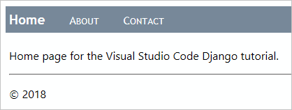

## [Work with data, data models, and migrations 使用数据、数据模型和迁移](https://code.visualstudio.com/docs/python/tutorial-django#_work-with-data-data-models-and-migrations)

Many web apps work with information stored in a database, and Django makes it easy to represent the objects in that database using *models*. In Django, a model is a Python class, derived from `django.db.models.Model`, that represents a specific database object, typically a table. You place these classes in an app's `models.py` file.

&zeroWidthSpace;许多 Web 应用使用存储在数据库中的信息，而 Django 使得使用模型表示该数据库中的对象变得很容易。在 Django 中，模型是一个 Python 类，派生自 `django.db.models.Model` ，它表示一个特定的数据库对象，通常是一个表。您将这些类放在应用的 `models.py` 文件中。

With Django, you work with your database almost exclusively through the models you define in code. Django's "migrations" then handle all the details of the underlying database automatically as you evolve the models over time. The general workflow is as follows:

&zeroWidthSpace;使用 Django，您几乎完全通过在代码中定义的模型来处理数据库。Django 的“迁移”随后会自动处理底层数据库的所有详细信息，因为您会随着时间的推移而不断发展模型。一般工作流如下：

1. Make changes to the models in your `models.py` file.
   在 `models.py` 文件中对模型进行更改。
2. Run `python manage.py makemigrations` to generate scripts in the `migrations` folder that migrate the database from its current state to the new state.
   运行 `python manage.py makemigrations` 以在 `migrations` 文件夹中生成脚本，这些脚本将数据库从当前状态迁移到新状态。
3. Run `python manage.py migrate` to apply the scripts to the actual database.
   运行 `python manage.py migrate` 以将脚本应用于实际数据库。

The migration scripts effectively record all the incremental changes you make to your data models over time. By applying the migrations, Django updates the database to match your models. Because each incremental change has its own script, Django can automatically migrate *any* previous version of a database (including a new database) to the current version. As a result, you need concern yourself only with your models in `models.py`, never with the underlying database schema or the migration scripts. You let Django do that part!

&zeroWidthSpace;迁移脚本有效地记录了您随着时间推移对数据模型所做的所有增量更改。通过应用迁移，Django 会更新数据库以使其与您的模型匹配。由于每个增量更改都有自己的脚本，因此 Django 可以自动将数据库的任何先前版本（包括新数据库）迁移到当前版本。因此，您只需关注 `models.py` 中的模型，而无需关注底层数据库架构或迁移脚本。您可以让 Django 来做这部分工作！

In code, too, you work exclusively with your model classes to store and retrieve data; Django handles the underlying details. The one exception is that you can write data into your database using the Django administrative utility [loaddata command](https://docs.djangoproject.com/en/3.1/ref/django-admin/#loaddata). This utility is often used to initialize a data set after the `migrate` command has initialized the schema.

&zeroWidthSpace;在代码中，您也只使用模型类来存储和检索数据；Django 会处理底层细节。唯一的例外是，您可以使用 Django 管理实用程序 loaddata 命令将数据写入数据库。在 `migrate` 命令初始化架构后，通常使用此实用程序初始化数据集。

When using the `db.sqlite3` file, you can also work directly with the database using a tool like the [SQLite browser](https://sqlitebrowser.org/). It's fine to add or delete records in tables using such a tool, but avoid making changes to the database schema because the database will then be out of sync with your app's models. Instead, change the models, run `makemigrations`, then run `migrate`.

&zeroWidthSpace;在使用 `db.sqlite3` 文件时，您还可以使用 SQLite 浏览器等工具直接操作数据库。使用此类工具添加或删除表中的记录是可以的，但避免对数据库架构进行更改，因为这样会导致数据库与应用程序的模型不同步。相反，更改模型，运行 `makemigrations` ，然后运行 `migrate` 。

### [Types of databases 数据库类型](https://code.visualstudio.com/docs/python/tutorial-django#_types-of-databases)

By default, Django includes a `db.sqlite3` file for an app's database that's suitable for development work. As described on [When to use SQLite](https://www.sqlite.org/whentouse.html) (sqlite.org), SQLite works fine for low to medium traffic sites with fewer than 100 K hits/day, but is not recommended for higher volumes. It's also limited to a single computer, so it cannot be used in any multi-server scenario such as load-balancing and geo-replication.

&zeroWidthSpace;默认情况下，Django 为应用程序的数据库包含一个 `db.sqlite3` 文件，该文件适用于开发工作。如在何时使用 SQLite (sqlite.org) 中所述，SQLite 适用于每天点击量少于 100 K 的低流量到中等流量网站，但不建议用于更高流量的网站。它还仅限于一台计算机，因此无法在任何多服务器场景（例如负载平衡和地理复制）中使用。

For these reasons, consider using a production-level data store such as [PostgreSQL](https://www.postgresql.org/), [MySQL](https://www.mysql.com/), and [SQL Server](https://www.microsoft.com/en-ca/sql-server/). For information on Django's support for other databases, see [Database setup](https://docs.djangoproject.com/en/3.1/intro/tutorial02/#database-setup). You can also use the [Azure SDK for Python](https://learn.microsoft.com/azure/developer/python/sdk/azure-sdk-overview) to work with Azure storage services like tables and blobs.

&zeroWidthSpace;出于这些原因，请考虑使用生产级数据存储，例如 PostgreSQL、MySQL 和 SQL Server。有关 Django 对其他数据库的支持的信息，请参阅数据库设置。您还可以使用适用于 Python 的 Azure SDK 来处理 Azure 存储服务，如表格和 Blob。

### [Define models 定义模型](https://code.visualstudio.com/docs/python/tutorial-django#_define-models)

A Django model is again a Python class derived from `django.db.model.Models`, which you place in the app's `models.py` file. In the database, each model is automatically given a unique ID field named `id`. All other fields are defined as properties of the class using types from `django.db.models` such as `CharField` (limited text), `TextField` (unlimited text), `EmailField`, `URLField`, `IntegerField`, `DecimalField`, `BooleanField`. `DateTimeField`, `ForeignKey`, and `ManyToMany`, among others. (See the [Model field reference](https://docs.djangoproject.com/en/3.1/ref/models/fields/) in the Django documentation for details.)

&zeroWidthSpace;Django 模型再次派生自 `django.db.model.Models` 的 Python 类，您将其放在应用程序的 `models.py` 文件中。在数据库中，每个模型都会自动获得一个名为 `id` 的唯一 ID 字段。所有其他字段都定义为使用 `django.db.models` 中的类型（如 `CharField` （限制文本）、 `TextField` （无限制文本）、 `EmailField` 、 `URLField` 、 `IntegerField` 、 `DecimalField` 、 `BooleanField` 、 `DateTimeField` 、 `ForeignKey` 和 `ManyToMany` 等）的类的属性。（有关详细信息，请参阅 Django 文档中的模型字段参考。）

Each field takes some attributes, like `max_length`. The `blank=True` attribute means the field is optional; `null=true` means that a value is optional. There is also a `choices` attribute that limits values to values in an array of data value/display value tuples.

&zeroWidthSpace;每个字段都会采用一些属性，如 `max_length` 。 `blank=True` 属性表示该字段是可选的； `null=true` 表示值是可选的。还有一个 `choices` 属性，它将值限制为数据值/显示值元组数组中的值。

For example, add the following class in `models.py` to define a data model that represents dated entries in a simple message log:

&zeroWidthSpace;例如，在 `models.py` 中添加以下类以定义一个数据模型，该模型表示简单消息日志中的日期条目：

```
from django.db import models
from django.utils import timezone

class LogMessage(models.Model):
    message = models.CharField(max_length=300)
    log_date = models.DateTimeField("date logged")

    def __str__(self):
        """Returns a string representation of a message."""
        date = timezone.localtime(self.log_date)
        return f"'{self.message}' logged on {date.strftime('%A, %d %B, %Y at %X')}"
```

A model class can include methods that return values computed from other class properties. Models typically include a `__str__` method that returns a string representation of the instance.

&zeroWidthSpace;模型类可以包含从其他类属性计算得出的值的方法。模型通常包含一个 `__str__` 方法，该方法返回实例的字符串表示形式。

### [Migrate the database 迁移数据库](https://code.visualstudio.com/docs/python/tutorial-django#_migrate-the-database)

Because you changed your data models by editing `models.py`, you need to update the database itself. In VS Code, open a Terminal with your virtual environment activated (use the **Terminal: Create New Terminal** command, Ctrl+Shift+`)), navigate to the project folder, and run the following commands:

&zeroWidthSpace;由于您通过编辑 `models.py` 更改了数据模型，因此您需要更新数据库本身。在 VS Code 中，打开一个已激活虚拟环境的终端（使用“终端：创建新终端”命令，Ctrl+Shift+`），导航到项目文件夹，然后运行以下命令：

```
python manage.py makemigrations
python manage.py migrate
```

Take a look in the `migrations` folder to see the scripts that `makemigrations` generates. You can also look at the database itself to see that the schema is updated.

&zeroWidthSpace;查看 `migrations` 文件夹以查看 `makemigrations` 生成的脚本。您还可以查看数据库本身以查看架构是否已更新。

If you see errors when running the commands, make sure you're not using a debugging terminal that's left over from previous steps, as they may not have the virtual environment activated.

&zeroWidthSpace;如果在运行命令时看到错误，请确保您没有使用从先前步骤遗留下来的调试终端，因为它们可能未激活虚拟环境。

### [Use the database through the models 通过模型使用数据库](https://code.visualstudio.com/docs/python/tutorial-django#_use-the-database-through-the-models)

With your models in place and the database migrated, you can store and retrieve data using only your models. In this section, you add a form page to the app through which you can log a message. You then modify the home page to display those messages. Because you modify many code files here, be mindful of the details.

&zeroWidthSpace;模型就绪且数据库迁移后，您可以仅使用模型存储和检索数据。在本节中，您将向应用添加一个表单页面，您可以通过该页面记录消息。然后，您修改主页以显示这些消息。由于您在此处修改了许多代码文件，因此请注意细节。

1. In the `hello` folder (where you have `views.py`), create a new file named `forms.py` with the following code, which defines a Django form that contains a field drawn from the data model, `LogMessage`:

   &zeroWidthSpace;在 `hello` 文件夹（您在其中具有 `views.py` ）中，创建一个名为 `forms.py` 的新文件，其中包含以下代码，该代码定义了一个 Django 表单，其中包含从数据模型 `LogMessage` 绘制的字段：

   ```
   from django import forms
   from hello.models import LogMessage
   
   class LogMessageForm(forms.ModelForm):
       class Meta:
           model = LogMessage
           fields = ("message",)   # NOTE: the trailing comma is required
   ```

2. In the `templates/hello` folder, create a new template named `log_message.html` with the following contents, which assumes that the template is given a variable named `form` to define the body of the form. It then adds a submit button with the label "Log".

   &zeroWidthSpace;在 `templates/hello` 文件夹中，创建一个名为 `log_message.html` 的新模板，其中包含以下内容，假设模板给定了一个名为 `form` 的变量来定义表单的主体。然后添加一个带有标签“日志”的提交按钮。

   ```
   
   
       Log a message
   
   
       <form method="POST" class="log-form">
           
           {{ form.as_p }}
           <button type="submit" class="save btn btn-default">Log</button>
       </form>
   
   ```

   > **Note**: Django's `` tag provides protection from cross-site request forgeries. See [Cross Site Request Forgery protection](https://docs.djangoproject.com/en/3.1/ref/csrf/) in the Django documentation for details.
   >
   > &zeroWidthSpace;注意：Django 的 `` 标签提供跨站点请求伪造保护。有关详细信息，请参阅 Django 文档中的跨站点请求伪造保护。

3. In the app's `static/hello/site.css` file, add a rule to make the input form wider:

   &zeroWidthSpace;在应用的 `static/hello/site.css` 文件中，添加一个规则以使输入表单更宽：

   ```
   input[name=message] {
       width: 80%;
   }
   ```

4. In the app's `urls.py` file, add a route for the new page:

   &zeroWidthSpace;在应用的 `urls.py` 文件中，为新页面添加一个路由：

   ```
   path("log/", views.log_message, name="log"),
   ```

5. In `views.py`, define the view named `log_message` (as referred to by the URL route). This view handles both HTTP GET and POST cases. In the GET case (the `else:` section), it just displays the form that you defined in the previous steps. In the POST case, it retrieves the data from the form into a data object (`message`), sets the timestamp, then saves that object at which point it's written to the database:

   &zeroWidthSpace;在 `views.py` 中，定义名为 `log_message` 的视图（由 URL 路由引用）。此视图处理 HTTP GET 和 POST 案例。在 GET 案例（ `else:` 部分）中，它仅显示您在前几个步骤中定义的表单。在 POST 案例中，它将数据从表单中检索到数据对象（ `message` ）中，设置时间戳，然后保存该对象，此时它将被写入数据库：

   ```
   # Add these to existing imports at the top of the file:
   from django.shortcuts import redirect
   from hello.forms import LogMessageForm
   from hello.models import LogMessage
   
   # Add this code elsewhere in the file:
   def log_message(request):
       form = LogMessageForm(request.POST or None)
   
       if request.method == "POST":
           if form.is_valid():
               message = form.save(commit=False)
               message.log_date = datetime.now()
               message.save()
               return redirect("home")
       else:
           return render(request, "hello/log_message.html", {"form": form})
   ```

6. One more step before you're ready to try everything out! In `templates/hello/layout.html`, add a link in the "navbar" div for the message logging page:

   &zeroWidthSpace;在您准备好尝试所有操作之前，再执行一个步骤！在 `templates/hello/layout.html` 中，为消息记录页面在“navbar”div 中添加一个链接：

   ```
   <!-- Insert below the link to Home -->
   <a href="" class="navbar-item">Log Message</a>
   ```

7. Run the app and open a browser to the home page. Select the **Log Message** link on the nav bar, which should display the message logging page:

   &zeroWidthSpace;运行该应用，并用浏览器打开主页。选择导航栏上的“记录消息”链接，它应显示消息记录页面：

   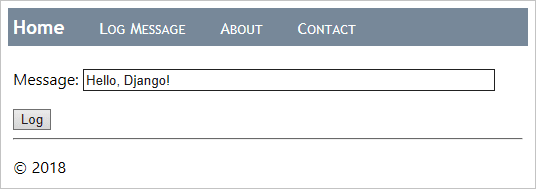

8. Enter a message, select **Log**, and you should be taken back to the home page. The home page doesn't yet show any of the logged messages yet (which you remedy in a moment). Feel free to log a few more messages as well. If you want, peek in the database using a tool like SQLite Browser to see that records have been created. Open the database as read-only, or otherwise remember to close the database before using the app, otherwise the app will fail because the database is locked.

   &zeroWidthSpace;输入一条消息，选择“记录”，您应被带回主页。主页尚未显示任何已记录的消息（您稍后会补救）。您也可以随意记录更多消息。如果您愿意，可以使用 SQLite Browser 等工具窥视数据库，以查看是否已创建记录。以只读方式打开数据库，或记住在使用该应用之前关闭数据库，否则该应用将因数据库被锁定而失败。

9. Stop the app when you're done.

   &zeroWidthSpace;完成后，停止该应用。

10. Now modify the home page to display the logged messages. Start by replacing the contents of app's `templates/hello/home.html` file with the markup below. This template expects a context variable named `message_list`. If it receives one (checked with the `` tag), it then iterates over that list (the `` tag) to generate table rows for each message. Otherwise the page indicates that no messages have yet been logged.

    &zeroWidthSpace;现在修改主页以显示已记录的消息。首先用下面的标记替换应用程序的 `templates/hello/home.html` 文件的内容。此模板需要一个名为 `message_list` 的上下文变量。如果收到一个（使用 `` 标记检查），则它会迭代该列表（ `` 标记）以针对每条消息生成表格行。否则，页面会指示尚未记录任何消息。

    ```
    
    
        Home
    
    
        <h2>Logged messages</h2>
    
        
            <table class="message_list">
                <thead>
                <tr>
                    <th>Date</th>
                    <th>Time</th>
                    <th>Message</th>
                </tr>
                </thead>
                <tbody>
                
                    <tr>
                        <td>{{ message.log_date | date:'d M Y' }}</td>
                        <td>{{ message.log_date | time:'H:i:s' }}</td>
                        <td>
                            {{ message.message }}
                        </td>
                    </tr>
                
                </tbody>
            </table>
        
            <p>No messages have been logged. Use the <a href="">Log Message form</a>.</p>
        
    
    ```

11. In `static/hello/site.css`, add a rule to format the table a little:

    &zeroWidthSpace;在 `static/hello/site.css` 中，添加一条规则以稍微设置表格格式：

    ```
    .message_list th,td {
        text-align: left;
        padding-right: 15px;
    }
    ```

12. In `views.py`, import Django's generic `ListView` class, which we'll use to implement the home page:

    &zeroWidthSpace;在 `views.py` 中，导入 Django 的通用 `ListView` 类，我们将使用它来实现主页：

    ```
    from django.views.generic import ListView
    ```

13. Also in `views.py`, replace the `home` function with a *class* named `HomeListView`, derived from `ListView`, which ties itself to the `LogMessage` model and implements a function `get_context_data` to generate the context for the template.

    &zeroWidthSpace;同样在 `views.py` 中，用一个名为 `HomeListView` 的类替换 `home` 函数，该类派生自 `ListView` ，它将自身绑定到 `LogMessage` 模型并实现一个函数 `get_context_data` 以生成模板的上下文。

    ```
    # Remove the old home function if you want; it's no longer used
    
    class HomeListView(ListView):
        """Renders the home page, with a list of all messages."""
        model = LogMessage
    
        def get_context_data(self, **kwargs):
            context = super(HomeListView, self).get_context_data(**kwargs)
            return context
    ```

14. In the app's `urls.py`, import the data model:

    &zeroWidthSpace;在应用程序的 `urls.py` 中，导入数据模型：

    ```
    from hello.models import LogMessage
    ```

15. Also in `urls.py`, make a variable for the new view, which retrieves the five most recent `LogMessage` objects in descending order (meaning that it queries the database), and then provides a name for the data in the template context (`message_list`), and identifies the template to use:

    &zeroWidthSpace;同样在 `urls.py` 中，创建一个新视图的变量，该变量按降序检索五个最新的 `LogMessage` 对象（意味着它查询数据库），然后在模板上下文中提供数据名称（ `message_list` ），并标识要使用的模板：

    ```
    home_list_view = views.HomeListView.as_view(
        queryset=LogMessage.objects.order_by("-log_date")[:5],  # :5 limits the results to the five most recent
        context_object_name="message_list",
        template_name="hello/home.html",
    )
    ```

16. In `urls.py`, modify the path to the home page to use the `home_list_view` variable:

    &zeroWidthSpace;在 `urls.py` 中，修改主页的路径以使用 `home_list_view` 变量：

    ```
        # Replace the existing path for ""
        path("", home_list_view, name="home"),
    ```

17. Start the app and open a browser to the home page, which should now display messages:

    &zeroWidthSpace;启动应用程序并打开浏览器到主页，现在应显示消息：

    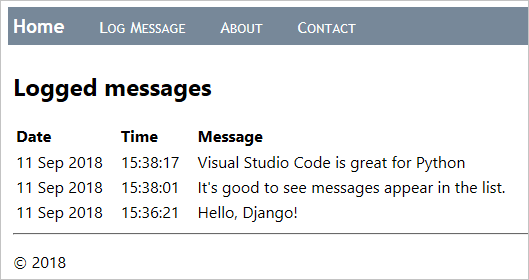

18. Stop the app when you're done.

    &zeroWidthSpace;完成时停止应用程序。

## [Use the debugger with page templates 使用调试器和页面模板](https://code.visualstudio.com/docs/python/tutorial-django#_use-the-debugger-with-page-templates)

As shown in the previous section, page templates can contain procedural directives like `` and ``, rather than only passive, declarative elements like `` and ``. As a result, you can have programming errors inside templates as with any other procedural code.

&zeroWidthSpace;如前一节所示，页面模板可以包含程序指令，如 `` 和 `` ，而不仅仅是被动、声明性元素，如 `` 和 `` 。因此，您可以在模板中像使用任何其他程序代码一样出现编程错误。

Fortunately, the Python Extension for VS Code provides template debugging when you have `"django": true` in the debugging configuration (as you do already). The following steps demonstrate this capability:

&zeroWidthSpace;幸运的是，Python Extension for VS Code 在调试配置中提供模板调试（您已经具备）。以下步骤演示此功能：

1. In `templates/hello/home.html`, set breakpoints on both the `` and `` lines, as indicated by the yellow arrows in the image below:

   &zeroWidthSpace;在 `templates/hello/home.html` 中，在 `` 和 `` 行上设置断点，如下面的图像中用黄色箭头所示：

   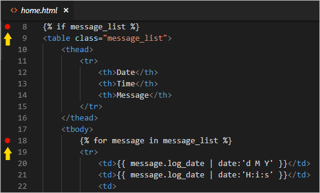

2. Run the app in the debugger and open a browser to the home page. (If you're already running the debugger, you don't have to restart the app after setting breakpoints; just refresh the page.) Observe that VS Code breaks into the debugger in the template on the `` statement and shows all the context variables in the **Variables** pane:

   &zeroWidthSpace;在调试器中运行应用程序并打开浏览器到主页。（如果您已经在运行调试器，则无需在设置断点后重新启动应用程序；只需刷新页面即可。）观察到 VS Code 在模板的 `` 语句中中断调试器，并在“变量”窗格中显示所有上下文变量：

   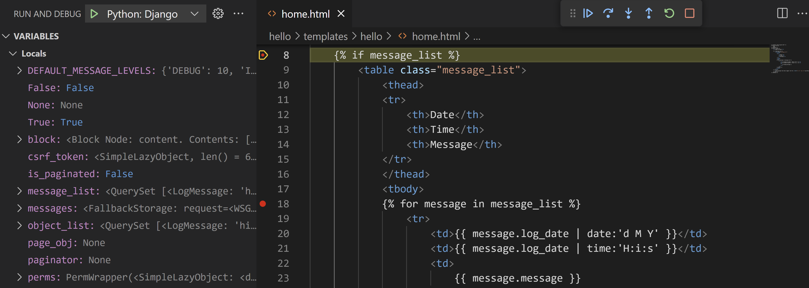

3. Use the Step Over (F10) command to step through the template code. Observe that the debugger steps over all declarative statements and pauses at any procedural code. For example, stepping through the `` loops lets you examine each value in `message` and lets you step to lines like `<td>{{ message.log_date | date:'d M Y' }}</td>`.

   &zeroWidthSpace;使用步进（F10）命令来逐步执行模板代码。观察调试器如何跨过所有声明语句并在任何过程代码处暂停。例如，逐步执行 `` 循环可让你检查 `message` 中的每个值，并可让你步进到 `<td>{{ message.log_date | date:'d M Y' }}</td>` 等行。

4. You can also work with variables in the **Debug Console** panel. (Django filters like `date`, however, are not presently available in the console.)

   &zeroWidthSpace;你还可以使用“调试控制台”面板中的变量。（但是，Django 过滤器（如 `date` ）目前在控制台中不可用。）

5. When you're ready, select Continue (F5) to finish running the app and view the rendered page in the browser. Stop the debugger when you're done.

   &zeroWidthSpace;准备就绪后，选择“继续”（F5）以完成运行应用并查看浏览器中呈现的页面。完成后，停止调试器。

## [Optional activities 可选活动](https://code.visualstudio.com/docs/python/tutorial-django#_optional-activities)

The following sections describe additional steps that you might find helpful in your work with Python and Visual Studio Code.

&zeroWidthSpace;以下部分介绍了在使用 Python 和 Visual Studio Code 时可能对你有所帮助的其他步骤。

### [Create a requirements.txt file for the environment 为环境创建 requirements.txt 文件](https://code.visualstudio.com/docs/python/tutorial-django#_create-a-requirementstxt-file-for-the-environment)

When you share your app code through source control or some other means, it doesn't make sense to copy all the files in a virtual environment because recipients can always recreate that environment themselves.

&zeroWidthSpace;通过源代码管理或其他方式共享应用代码时，复制虚拟环境中的所有文件是没有意义的，因为接收者始终可以自行重新创建该环境。

Accordingly, developers typically omit the virtual environment folder from source control and instead describe the app's dependencies using a `requirements.txt` file.

&zeroWidthSpace;因此，开发人员通常会从源代码管理中省略虚拟环境文件夹，而使用 `requirements.txt` 文件来描述应用的依赖项。

Although you can create the file by hand, you can also use the `pip freeze` command to generate the file based on the exact libraries installed in the activated environment:

&zeroWidthSpace;虽然您可以手动创建文件，但也可以使用 `pip freeze` 命令根据已激活环境中安装的确切库生成文件：

1. With your chosen environment selected using the **Python: Select Interpreter** command, run the **Terminal: Create New Terminal** command (Ctrl+Shift+`)) to open a terminal with that environment activated.

   &zeroWidthSpace;使用 Python：选择解释器命令选择您选择的运行环境，然后运行终端：创建新终端命令（Ctrl+Shift+`）以打开已激活该环境的终端。

2. In the terminal, run `pip freeze > requirements.txt` to create the `requirements.txt` file in your project folder.

   &zeroWidthSpace;在终端中运行 `pip freeze > requirements.txt` 以在您的项目文件夹中创建 `requirements.txt` 文件。

Anyone (or any build server) that receives a copy of the project needs only to run the `pip install -r requirements.txt` command to reinstall the packages on which the app depends within the active environment.

&zeroWidthSpace;收到项目副本的任何人（或任何构建服务器）只需运行 `pip install -r requirements.txt` 命令即可在活动环境中重新安装应用程序所依赖的软件包。

> **Note**: `pip freeze` lists all the Python packages you have installed in the current environment, including packages you aren't currently using. The command also lists packages with exact version numbers, which you might want to convert to ranges for more flexibility in the future. For more information, see [Requirements Files](https://pip.pypa.io/en/stable/user_guide/#requirements-files) in the pip command documentation.
>
> &zeroWidthSpace;注意： `pip freeze` 会列出您在当前环境中安装的所有 Python 软件包，包括您当前未使用的软件包。该命令还会列出具有确切版本号的软件包，您可能希望将其转换为范围以便将来更灵活。有关更多信息，请参阅 pip 命令文档中的需求文件。

### [Create a superuser and enable the administrative interface 创建超级用户并启用管理界面](https://code.visualstudio.com/docs/python/tutorial-django#_create-a-superuser-and-enable-the-administrative-interface)

By default, Django provides an administrative interface for a web app that's protected by authentication. The interface is implemented through the built-in `django.contrib.admin` app, which is included by default in the project's `INSTALLED_APPS` list (`settings.py`), and authentication is handled with the built-in `django.contrib.auth` app, which is also in `INSTALLED_APPS` by default.

&zeroWidthSpace;默认情况下，Django 为受身份验证保护的 Web 应用提供管理界面。该界面通过内置的 `django.contrib.admin` 应用实现，该应用默认包含在项目的 `INSTALLED_APPS` 列表（ `settings.py` ）中，并且身份验证由内置的 `django.contrib.auth` 应用处理，该应用默认也在 `INSTALLED_APPS` 中。执行以下步骤以启用管理界面：

Perform the following steps to enable the administrative interface:

&zeroWidthSpace;在 VS Code 中为虚拟环境打开终端，然后运行命令 ，当然，用你的个人信息替换 和 ，在应用中创建一个超级用户帐户。运行该命令时，Django 会提示你输入并确认你的密码。

1. Create a superuser account in the app by opening a Terminal in VS Code for your virtual environment, then running the command `python manage.py createsuperuser --username=<username> --email=<email>`, replacing `<username>` and `<email>`, of course, with your personal information. When you run the command, Django prompts you to enter and confirm your password.

   &zeroWidthSpace;务必记住你的用户名和密码组合。这些是你用于向应用进行身份验证的凭据。

   Be sure to remember your username and password combination. These are the credentials you use to authenticate with the app.

   &zeroWidthSpace;在项目级 （本教程中的 ）中添加以下 URL 路由，以指向内置的管理界面：

2. Add the following URL route in the project-level `urls.py` (`web_project/urls.py` in this tutorial) to point to the built-in administrative interface:

   &zeroWidthSpace;运行服务器，然后在浏览器中打开应用的 /admin 页面（例如，在使用开发服务器时为 `urls.py` ）。

   ```
   # This path is included by default when creating the app
    path("admin/", admin.site.urls),
   ```

3. Run the server, then open a browser to the app's /admin page (such as `http://127.0.0.1:8000/admin` when using the development server).

   &zeroWidthSpace;登录页面出现，由 `http://127.0.0.1:8000/admin` 提供。输入你的超级用户凭据。

4. A login page appears, courtesy of `django.contrib.auth`. Enter your superuser credentials.

   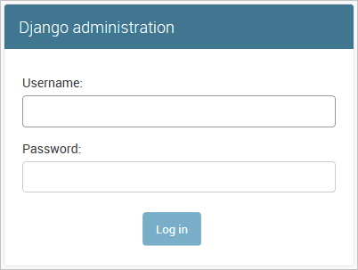

5. Once you're authenticated, you see the default administration page, through which you can manage users and groups:

   &zeroWidthSpace;通过身份验证后，您会看到默认的管理页面，您可以通过该页面管理用户和组：

   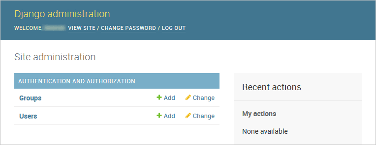

You can customize the administrative interface as much as you like. For example, you could provide capabilities to edit and remove entries in the database. For more information on making customizations, refer to the [Django admin site documentation](https://docs.djangoproject.com/en/3.1/ref/contrib/admin/).

&zeroWidthSpace;您可以根据需要自定义管理界面。例如，您可以提供编辑和删除数据库中条目的功能。有关进行自定义的详细信息，请参阅 Django 管理站点文档。

### [Create a container for a Django app using the Docker extension 使用 Docker 扩展为 Django 应用创建容器](https://code.visualstudio.com/docs/python/tutorial-django#_create-a-container-for-a-django-app-using-the-docker-extension)

The [Docker extension](https://marketplace.visualstudio.com/items?itemName=ms-azuretools.vscode-docker) makes it easy to build, manage, and deploy containerized applications from Visual Studio Code. If you're interested in learning how to create a Python container for the Django app developed in this tutorial, check out the [Python in a container](https://code.visualstudio.com/docs/containers/quickstart-python) tutorial, which will walk you through how to:

&zeroWidthSpace;Docker 扩展使您可以轻松地从 Visual Studio Code 构建、管理和部署容器化应用程序。如果您有兴趣了解如何为本教程中开发的 Django 应用创建 Python 容器，请查看 Python in a container 教程，该教程将指导您完成以下操作：

- Create a `Dockerfile` file describing a simple Python container.
  创建描述简单 Python 容器的 `Dockerfile` 文件。
- Build, run, and verify the functionality of a [Django](https://www.djangoproject.com/) app.
  构建、运行和验证 Django 应用的功能。
- Debug the app running in a container.
  调试在容器中运行的应用程序。

## [Next steps 后续步骤](https://code.visualstudio.com/docs/python/tutorial-django#_next-steps)

Congratulations on completing this walkthrough of working with Django in Visual Studio Code!

&zeroWidthSpace;恭喜您完成在 Visual Studio Code 中使用 Django 的演练！

The completed code project from this tutorial can be found on GitHub: [python-sample-vscode-django-tutorial](https://github.com/microsoft/python-sample-vscode-django-tutorial).

&zeroWidthSpace;本教程中完成的代码项目可以在 GitHub 上找到：python-sample-vscode-django-tutorial。

In this tutorial, we've only scratched the surface of everything Django can do. Be sure to visit the [Django documentation](https://docs.djangoproject.com/en/3.1/) and the [official Django tutorial](https://docs.djangoproject.com/en/3.1/intro/tutorial01/) for many more details on views, templates, data models, URL routing, the administrative interface, using other kinds of databases, deployment to production, and more.

&zeroWidthSpace;在本教程中，我们仅介绍了 Django 的皮毛。务必访问 Django 文档和官方 Django 教程，以获取有关视图、模板、数据模型、URL 路由、管理界面、使用其他类型的数据库、部署到生产环境等更多详细信息。

To try your app on a production website, check out the tutorial [Deploy Python apps to Azure App Service using Docker Containers](https://learn.microsoft.com/azure/developer/python/tutorial-deploy-containers-01). Azure also offers a standard container, [App Service on Linux](https://learn.microsoft.com/azure/developer/python/configure-python-web-app-local-environment), to which you deploy web apps from within VS Code.

&zeroWidthSpace;若要在生产网站上试用您的应用，请查看教程使用 Docker 容器将 Python 应用部署到 Azure 应用服务。Azure 还提供标准容器 App Service on Linux，您可以使用它从 VS Code 中部署 Web 应用。

You may also want to review the following articles in the VS Code docs that are relevant to Python:

&zeroWidthSpace;您可能还希望查看 VS Code 文档中与 Python 相关的以下文章：

- [Editing Python code
  编辑 Python 代码](https://code.visualstudio.com/docs/python/editing)
- [Linting](https://code.visualstudio.com/docs/python/linting)
- [Managing Python environments
  管理 Python 环境](https://code.visualstudio.com/docs/python/environments)
- [Debugging Python
  调试 Python](https://code.visualstudio.com/docs/python/debugging)
- [Testing
  测试](https://code.visualstudio.com/docs/python/testing)
