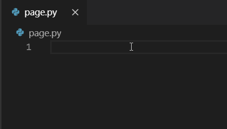
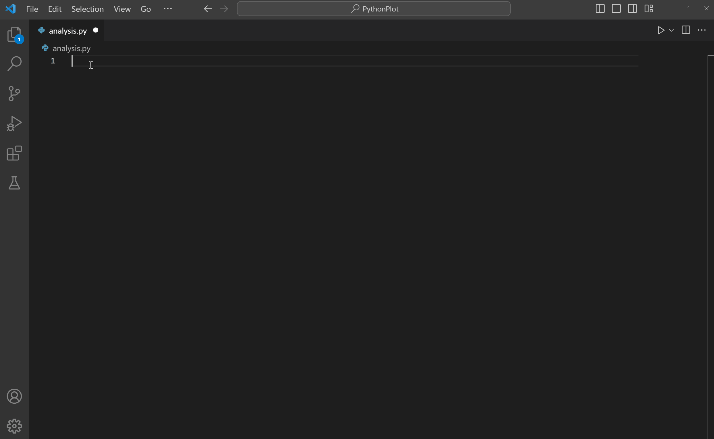
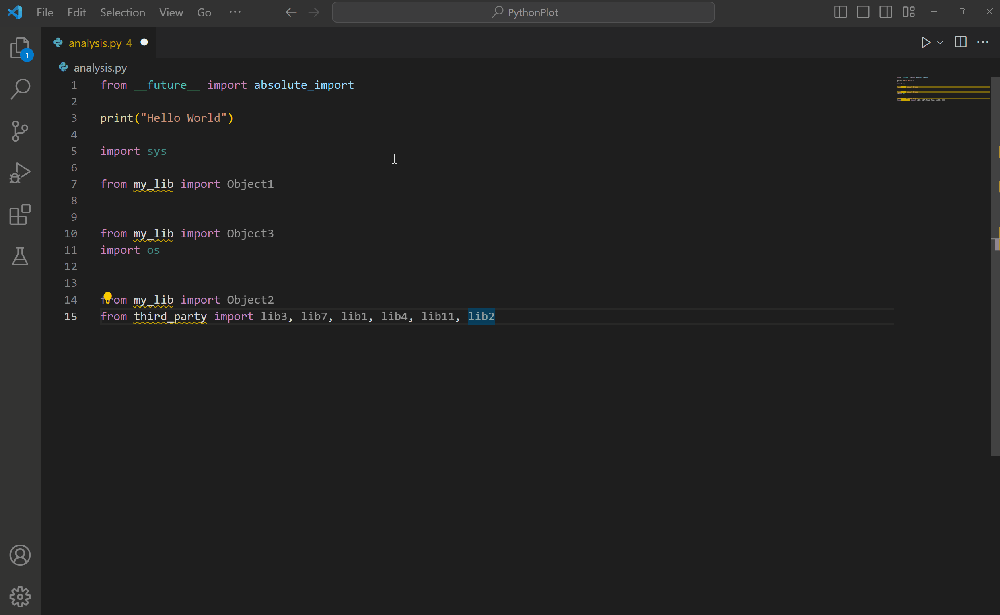

+++
title = "Editing Code"
date = 2024-01-12T22:36:24+08:00
weight = 10
type = "docs"
description = ""
isCJKLanguage = true
draft = false
+++

> 原文: [https://code.visualstudio.com/docs/python/editing](https://code.visualstudio.com/docs/python/editing)

# Editing Python in Visual Studio Code 在 Visual Studio Code 中编辑 Python


Visual Studio Code is a powerful editing tool for Python source code. The editor includes various features to help you be productive when writing code. For more information about editing in Visual Studio Code, see [Basic Editing]() and [Code Navigation]().

​​​	Visual Studio Code 是一个用于 Python 源代码的强大编辑工具。该编辑器包含各种功能，可帮助您在编写代码时提高工作效率。有关在 Visual Studio Code 中进行编辑的详细信息，请参阅基本编辑和代码导航。

In this overview, we will describe the specific editing features provided by the [Python extension](https://marketplace.visualstudio.com/items?itemName=ms-python.python), including steps on how to customize these features via user and workspace [settings]().

​​​	在此概述中，我们将介绍 Python 扩展提供的特定编辑功能，包括如何通过用户和工作区设置自定义这些功能的步骤。

## [Autocomplete and IntelliSense 自动完成和 IntelliSense]()

IntelliSense is a general term for code editing features that relate to code completion. Take a moment to look at the example below. When **print** is typed, notice how IntelliSense populates auto-completion options. The user is also given a list of options when they begin to type the variable named **greeting**.

​​​	IntelliSense 是与代码完成相关的代码编辑功能的通用术语。花点时间看看下面的示例。键入 print 时，请注意 IntelliSense 如何填充自动完成选项。当用户开始键入名为 greeting 的变量时，还会向他们提供一个选项列表。


Autocomplete and IntelliSense are provided for all files within the current working folder. They're also available for Python packages that are installed in standard locations.

​​​	为当前工作文件夹中的所有文件提供自动完成和 IntelliSense。它们还可用于安装在标准位置的 Python 包。

[Pylance](https://marketplace.visualstudio.com/items?itemName=ms-python.vscode-pylance) is the default language server for Python in VS Code, and is installed alongside the Python extension to provide IntelliSense features.

​​​	Pylance 是 VS Code 中 Python 的默认语言服务器，并与 Python 扩展一起安装以提供 IntelliSense 功能。

Pylance is based on Microsoft’s [Pyright](https://github.com/microsoft/pyright) static type checking tool, leveraging [type stubs](https://typing.readthedocs.io/en/latest/source/stubs.html) (`.pyi` files) and lazy type inferencing to provide a highly-performant development experience.

​​​	Pylance 基于 Microsoft 的 Pyright 静态类型检查工具，利用类型存根（ `.pyi` 文件）和惰性类型推断来提供高性能的开发体验。

For more on IntelliSense generally, see [IntelliSense]().

​​​	有关 IntelliSense 的更多信息，请参阅 IntelliSense。

> **Tip**: Check out the [IntelliCode extension for VS Code](https://go.microsoft.com/fwlink/?linkid=2006060). IntelliCode provides a set of AI-assisted capabilities for IntelliSense in Python, such as inferring the most relevant auto-completions based on the current code context. For more information, see the [IntelliCode for VS Code FAQ](https://learn.microsoft.com/visualstudio/intellicode/intellicode-visual-studio-code).
>
> ​​​	提示：查看适用于 VS Code 的 IntelliCode 扩展。IntelliCode 为 Python 中的 IntelliSense 提供了一组 AI 辅助功能，例如根据当前代码上下文推断最相关的自动完成。有关更多信息，请参阅适用于 VS Code 的 IntelliCode 常见问题解答。

### [Customize IntelliSense behavior 自定义 IntelliSense 行为]()

Enabling the full set of IntelliSense features by default could end up making your development experience feel slower, so the Python extension enables a minimum set of features that allow you to be productive while still having a performant experience. However, you can customize the behavior of the analysis engine to your liking through multiple settings.

​​​	默认情况下启用全套 IntelliSense 功能可能会让您的开发体验感觉更慢，因此 Python 扩展启用了一组最少的功能，让您在保持高性能体验的同时提高工作效率。但是，您可以通过多种设置自定义分析引擎的行为以满足您的喜好。

### [Enable Auto Imports 启用自动导入]()

Pylance offers auto import suggestions for modules in your workspace and/or packages you have installed in your environment. This enables import statements to be automatically added as you type. Auto imports are disabled by default, but you can enable them by setting `python.analysis.autoImportCompletions` to `true` in your settings.

​​​	Pylance 为工作区中的模块和/或在环境中安装的软件包提供自动导入建议。这使您可以自动添加导入语句，就像您键入一样。默认情况下，自动导入处于禁用状态，但您可以通过在设置中将 `python.analysis.autoImportCompletions` 设置为 `true` 来启用它们。

### [Enable IntelliSense for custom package locations 为自定义软件包位置启用 IntelliSense]()

To enable IntelliSense for packages that are installed in non-standard locations, add those locations to the `python.analysis.extraPaths` collection in your `settings.json` file (the default collection is empty). For example, you might have Google App Engine installed in custom locations, specified in `app.yaml` if you use Flask. In this case, you'd specify those locations as follows:

​​​	要为安装在非标准位置的软件包启用 IntelliSense，请将这些位置添加到 `settings.json` 文件中的 `python.analysis.extraPaths` 集合（默认集合为空）。例如，您可能在自定义位置安装了 Google App Engine，如果您使用 Flask，则在 `app.yaml` 中指定。在这种情况下，您需要按如下方式指定这些位置：

**Windows:
Windows：**

```
"python.analysis.extraPaths": [
    "C:/Program Files (x86)/Google/google_appengine",
    "C:/Program Files (x86)/Google/google_appengine/lib/flask-0.12"]
```

**macOS/Linux:
macOS/Linux：**

```
"python.analysis.extraPaths": [
    "~/.local/lib/Google/google_appengine",
    "~/.local/lib/Google/google_appengine/lib/flask-0.12" ]
```

For the full list of available IntelliSense controls, you can reference the Python extension [code analysis settings]() and [autocomplete settings]().

​​​	有关可用 IntelliSense 控件的完整列表，您可以参考 Python 扩展代码分析设置和自动完成设置。

You can also customize the general behavior of autocomplete and IntelliSense, even disable the features completely. You can learn more in [Customizing IntelliSense]().

​​​	您还可以自定义自动完成和 IntelliSense 的常规行为，甚至完全禁用这些功能。您可以在“自定义 IntelliSense”中了解更多信息。

## [Enhance completions with AI 使用 AI 增强补全]()

[GitHub Copilot](https://copilot.github.com/) is an AI-powered code completion tool that helps you write code faster and smarter. You can use the [GitHub Copilot extension](https://marketplace.visualstudio.com/items?itemName=GitHub.copilot) in VS Code to generate code, or to learn from the code it generates.

​​​	GitHub Copilot 是一款由 AI 支持的代码完成工具，可帮助您更快速、更智能地编写代码。您可以在 VS Code 中使用 GitHub Copilot 扩展来生成代码，或从它生成的代码中学习。

[](https://marketplace.visualstudio.com/items?itemName=GitHub.copilot)

GitHub Copilot provides suggestions for numerous languages and a wide variety of frameworks, and it works especially well for Python, JavaScript, TypeScript, Ruby, Go, C# and C++.

​​​	GitHub Copilot 为多种语言和各种框架提供建议，它特别适用于 Python、JavaScript、TypeScript、Ruby、Go、C# 和 C++。

You can learn more about how to get started with Copilot in the [Copilot documentation]().

​​​	您可以在 Copilot 文档中了解有关如何开始使用 Copilot 的更多信息。

## [Navigation 导航]()

While editing, you can right-click different identifiers to take advantage of several convenient commands

​​​	在编辑时，您可以右键单击不同的标识符以利用多个便捷命令

- **Go to Definition** (F12) jumps from your code into the code that defines an object. This command is helpful when you're working with libraries.

  ​​​	转到定义 (F12) 从您的代码跳转到定义对象的代码。当您使用库时，此命令非常有用。

- **Peek Definition** (Alt+F12), is similar, but displays the definition directly in the editor (making space in the editor window to avoid obscuring any code). Press Escape to close the Peek window or use the **x** in the upper right corner.

  ​​​	查看定义 (Alt+F12) 类似，但直接在编辑器中显示定义（在编辑器窗口中腾出空间以避免遮挡任何代码）。按 Escape 关闭“查看”窗口或使用右上角的 x。

- **Go to Declaration** jumps to the point at which the variable or other object is declared in your code.

  ​​​	转到声明跳转到变量或其他对象在代码中声明的位置。

- **Peek Declaration** is similar, but displays the declaration directly in the editor. Again, use Escape or the **x** in the upper right corner to close the Peek window.

  ​​​	查看声明类似，但直接在编辑器中显示声明。同样，使用 Escape 或右上角的 x 关闭“查看”窗口。

## [Quick Fixes 快速修复]()

The add imports Quick Fix when using Pylance allows you to quickly complete import statements. First, begin by typing a package name within the editor. You will notice a Code Action is available to automatically complete the line of source code (as long as you have the module installed within the environment). Hover over the text (marked with a squiggle) and then select the Code Action light bulb when it appears. You can then select from a list of potential imports.

​​​	使用 Pylance 时，添加导入快速修复允许您快速完成导入语句。首先，从在编辑器中键入包名称开始。您会注意到有一个代码操作可自动完成源代码行（只要您已在环境中安装了该模块）。将鼠标悬停在文本上（用波浪线标记），然后在出现代码操作灯泡时选择它。然后，您可以从潜在导入列表中进行选择。

This Code Action also recognizes some of the popular abbreviations for the following common Python packages: `numpy` as np, `tensorflow` as tf, `pandas` as pd, `matplotlib.pyplot` as plt, `matplotlib`, as mpl, `math` as m, `scipi.io` as spio, and `scipy` as sp, `panel` as pn, and `holoviews` as hv.

​​​	此代码操作还识别以下常见 Python 包的一些常用缩写： `numpy` 作为 np， `tensorflow` 作为 tf， `pandas` 作为 pd， `matplotlib.pyplot` 作为 plt， `matplotlib` 作为 mpl， `math` 作为 m， `scipi.io` 作为 spio， `scipy` 作为 sp， `panel` 作为 pn， `holoviews` 作为 hv。



The import suggestions list is ordered with import statements for packages (or modules) at the top. It will also include statements for more modules and/or members (classes, objects, etc.) from specified packages.

​​​	导入建议列表按顺序排列，其中包（或模块）的导入语句位于顶部。它还将包含来自指定包的更多模块和/或成员（类、对象等）的语句。

Just like with auto imports, only top-levels symbols are suggested by default. You can customize this behavior through the `python.analysis.packageIndexDepths` setting.

​​​	就像自动导入一样，默认情况下仅建议顶级符号。您可以通过 `python.analysis.packageIndexDepths` 设置自定义此行为。

## [Refactoring 重构]()

The Python extension adds the following refactoring functionalities: **Extract Variable**, **Extract Method** and **Rename Module**. It also supports extensions that implement additional refactoring features such as **Sort Imports**.

​​​	Python 扩展添加了以下重构功能：提取变量、提取方法和重命名模块。它还支持实现其他重构功能（例如排序导入）的扩展。

### [Extract Variable 提取变量]()

Extracts all similar occurrences of the selected text within the current scope, and replaces it with a new variable.

​​​	提取当前作用域内所选文本的所有相似出现，并用新变量替换它。

You can invoke this command by selecting the line of code you wish to extract as a variable. Then select the light-bulb that is displayed next to it.

​​​	您可以通过选择要作为变量提取的代码行来调用此命令。然后选择显示在其旁边的灯泡。


### [Extract Method 提取方法]()

Extracts all similar occurrences of the selected expression or block within the current scope, and replaces it with a method call.

​​​	提取当前作用域中所选表达式或块的所有相似出现，并用方法调用替换它。

You can invoke this command by selecting the lines of code you wish to extract as a method. Then select the light-bulb that is displayed next to it.

​​​	您可以通过选择要作为方法提取的代码行来调用此命令。然后选择旁边显示的灯泡。


### [Rename Module 重命名模块]()

After a Python file/module is renamed, Pylance can find all instances that may need to be updated and provide you with a preview of all the changes.

​​​	在重命名 Python 文件/模块后，Pylance 可以找到所有可能需要更新的实例，并为您提供所有更改的预览。

To customize which references need to be updated, you can toggle the checkboxes at the line or from the file level in **Refactor Preview**. Once you've made your selections, you can select **Apply Refactoring** or **Discard Refactoring**.

​​​	要自定义需要更新的引用，您可以在重构预览中切换行或文件级别的复选框。做出选择后，您可以选择应用重构或放弃重构。


### [Sort Imports 排序导入]()

The Python extension supports extensions such as [isort](https://marketplace.visualstudio.com/items?itemName=ms-python.isort) and [Ruff](https://marketplace.visualstudio.com/items?itemName=charliermarsh.ruff) that implement the **Sort Imports** functionality. This command consolidates specific imports from the same module into a single `import` statement, and organizes `import` statements in alphabetical order.

​​​	Python 扩展支持实现排序导入功能的扩展，例如 isort 和 Ruff。此命令将来自同一模块的特定导入合并到单个 `import` 语句中，并按字母顺序组织 `import` 语句。

You can invoke this by installing an extension that supports sorting imports, then opening the Command Palette (Ctrl+Shift+P) and running **Organize Imports**.

​​​	您可以通过安装支持排序导入的扩展来调用此命令，然后打开命令面板 (Ctrl+Shift+P) 并运行整理导入。

> **Tip**: you can assign a keyboard shortcut to the `editor.action.organizeImports` command.
>
> ​​​	提示：您可以为 `editor.action.organizeImports` 命令分配键盘快捷键。



## [Troubleshooting 故障排除]()

For help with common IntelliSense and Python editing issues, check the table below:

​​​	有关常见 IntelliSense 和 Python 编辑问题的帮助，请查看下表：

| Problem 问题                                                 | Cause 原因                                                   | Solution 解决方案                                            |
| :----------------------------------------------------------- | :----------------------------------------------------------- | :----------------------------------------------------------- |
| Pylance is only offering top-level symbol options when adding imports. 添加导入时，Pylance 仅提供顶级符号选项。 | By default, only top-level modules are indexed (depth=1). 默认情况下，仅对顶级模块编制索引（深度 = 1）。 For example, you may see `import matplotlib` as a suggestion, but not `import matplotlib.pyplot` by default. 例如，您可能会看到 `import matplotlib` 作为建议，但默认情况下看不到 `import matplotlib.pyplot` 。 | Try increasing the depth to which Pylance can index your installed libraries through the `python.analysis.packageIndexDepths`. Check [code analysis settings](). 尝试通过 `python.analysis.packageIndexDepths` 增加 Pylance 可以为您的已安装库编制索引的深度。检查代码分析设置。 |
| Pylance is not automatically adding missing imports Pylance 不会自动添加缺少的导入 | The auto import completion setting may be disabled. 自动导入完成设置可能已禁用。 | Check the [Enable Auto Imports section](). 检查启用自动导入部分。 |
| Auto imports are enabled but Pylance is not automatically importing symbols defined in other files in the workspace. 自动导入已启用，但 Pylance 不会自动导入工作区中其他文件中定义的符号。 | User defined symbols (those not coming from installed packages or libraries) are only automatically imported if they have already been used in files opened in the editor. 仅当用户定义的符号（不是来自已安装的包或库的符号）已在编辑器中打开的文件中使用时，才会自动导入它们。 Otherwise, they will only be available through the [add imports Quick Fix](). 否则，它们只能通过添加导入快速修复来使用。 | Use the add imports Quick Fix, or make sure to open the relevant files in your workspace first. 使用添加导入快速修复，或确保首先在工作区中打开相关文件。 |
| Pylance seems slow or is consuming too much memory when working on a large workspace. 在大型工作区中工作时，Pylance 似乎很慢或消耗了太多内存。 | Pylance analysis is done on all files present in a given workspace. Pylance 分析对给定工作区中存在的所有文件执行。 | If there are subfolders you know can be excluded from Pylance's analysis, you can add their paths to the `python.analysis.exclude` setting. Alternatively, you can try setting `python.analysis.indexing` to `false` to disable Pylance's indexer (**Note**: this will also impact the experience of completions and auto imports. Learn more about indexing in [code analysis settings]()). 如果您知道可以从 Pylance 分析中排除的子文件夹，则可以将它们的路径添加到 `python.analysis.exclude` 设置中。或者，您可以尝试将 `python.analysis.indexing` 设置为 `false` 以禁用 Pylance 的索引器（注意：这也将影响完成和自动导入的体验。了解有关代码分析设置中索引的更多信息）。 |
| You are unable to install a custom module into your Python project. 您无法将自定义模块安装到 Python 项目中。 | The custom module is located in a non-standard location (not installed using pip). 自定义模块位于非标准位置（未使用 pip 安装）。 | Add the location to the `python.autoComplete.extraPaths` setting and restart VS Code. 将位置添加到 `python.autoComplete.extraPaths` 设置并重新启动 VS Code。 |

### [Pylance Diagnostics Pylance 诊断]()

Pylance by default provides diagnostics for Python files in the Problems panel.

​​​	Pylance 默认情况下在“问题”面板中提供 Python 文件的诊断。

The list below are some of the most common diagnostics provided by Pylance and how to fix them.

​​​	以下列出 Pylance 提供的一些最常见的诊断以及如何修复它们。

#### [importResolveSourceFailure]()

This error occurs when Pylance is able to find type stubs for the imported package, but is unable find the package itself. This can happen when the package you are trying to import is not installed in the selected Python environment.

​​​	当 Pylance 能够找到导入包的类型存根，但无法找到包本身时，就会发生此错误。当您尝试导入的包未安装在选定的 Python 环境中时，可能会发生这种情况。

**How to fix it
如何修复**

- If the package is already installed in a different interpreter or kernel, [select the correct interpreter]().
  如果该包已安装在其他解释器或内核中，请选择正确的解释器。
- If the package is not installed, you can install it by running the following command in an activated terminal: `python -m pip install {package_name}`.
  如果该包尚未安装，您可以在已激活的终端中运行以下命令来安装它： `python -m pip install {package_name}` 。

#### [importResolveFailure]()

This error happens when Pylance is unable to find the package or module you're importing, nor its type stubs.

​​​	当 Pylance 无法找到您要导入的包或模块及其类型存根时，就会发生此错误。

**How to fix it
如何修复**

- If you are importing a module, make sure it exists in your workspace or in a location that is included in the `python.autoComplete.extraPaths` setting.
  如果您要导入模块，请确保它存在于您的工作区或包含在 `python.autoComplete.extraPaths` 设置中的位置。
- If you are importing a package that is not installed, you can install it by running the following command in an activated terminal: `python -m pip install {package_name}`.
  如果您要导入未安装的包，可以通过在已激活的终端中运行以下命令来安装它： `python -m pip install {package_name}` 。
- If you are importing a package that is already installed in a different interpreter or kernel, [select the correct interpreter]().
  如果您要导入已安装在其他解释器或内核中的包，请选择正确的解释器。
- If you are working with an editable install and it is currently set up to use import hooks, consider switching to using `.pth` files that only contain file paths instead, to enhance compatibility and ensure smoother import behavior. Learn more in the [Pyright documentation](https://microsoft.github.io/pyright/#/import-resolution?id=editable-installs).
  如果您正在使用可编辑安装，并且当前将其设置为使用导入挂钩，请考虑切换为仅包含文件路径的 `.pth` 文件，以增强兼容性并确保更流畅的导入行为。在 Pyright 文档中了解更多信息。

#### [importCycleDetected]()

This error occurs when Pylance detects a circular dependency between two or more modules.

​​​	当 Pylance 检测到两个或多个模块之间存在循环依赖时，就会发生此错误。

**How to fix it
如何修复**

Try to reorder your import statements to break the circular dependency.

​​​	尝试重新排列您的导入语句以打破循环依赖。

------

The severity of Pylance's diagnostics can be customized through the `python.analysis.diagnosticSeverityOverrides` setting. Check the [settings reference]() for more information.

​​​	可以通过 `python.analysis.diagnosticSeverityOverrides` 设置自定义 Pylance 诊断的严重性。有关更多信息，请查看设置参考。

## [Next steps 后续步骤]()

- [Linting]() - Enable, configure, and apply various Python linters.
  Linting - 启用、配置和应用各种 Python linter。
- [Debugging]() - Learn to debug Python both locally and remotely.
  调试 - 了解如何在本地和远程调试 Python。
- [Testing]() - Configure test environments and discover, run, and debug tests.
  测试 - 配置测试环境并发现、运行和调试测试。
- [Basic Editing]() - Learn about the powerful VS Code editor.
  基本编辑 - 了解功能强大的 VS Code 编辑器。
- [Code Navigation]() - Move quickly through your source code.
  代码导航 - 快速浏览源代码。
- [IntelliSense]() - Learn about IntelliSense features.
  IntelliSense - 了解 IntelliSense 功能。
- [Jupyter Support]() - Learn how to get started with Jupyter Notebooks.
  Jupyter 支持 - 了解如何开始使用 Jupyter Notebooks。
- [Python Extension Template](https://code.visualstudio.com/api/advanced-topics/python-extension-template) - Create an extension to integrate your favorite Python tools.
  Python 扩展模板 - 创建一个扩展来集成您最喜欢的 Python 工具。
