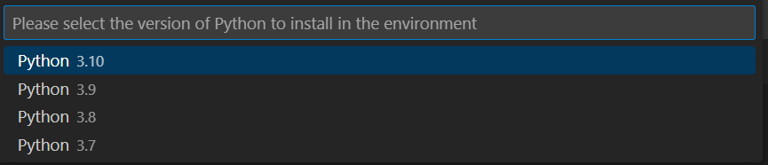
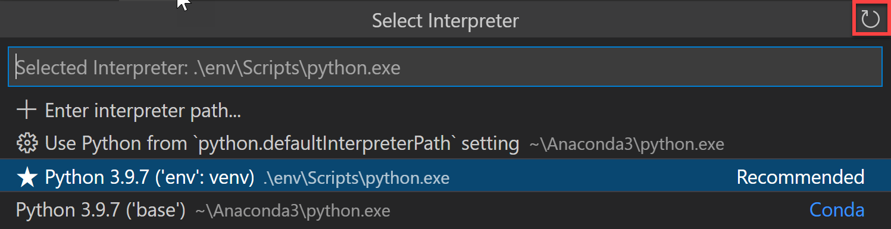
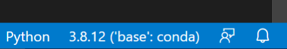
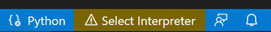
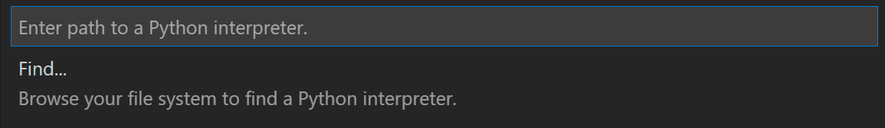

+++
title = "Environments"
date = 2024-01-12T22:36:24+08:00
weight = 50
type = "docs"
description = ""
isCJKLanguage = true
draft = false
+++

> 原文: [https://code.visualstudio.com/docs/python/environments](https://code.visualstudio.com/docs/python/environments)

# Python environments in VS Code VS Code 中的 Python 环境


An "environment" in Python is the context in which a Python program runs that consists of an interpreter and any number of installed packages.

​​​	Python 中的“环境”是指 Python 程序运行的上下文，其中包括解释器和任意数量的已安装软件包。

> **Note**: If you'd like to become more familiar with the Python programming language, review [More Python resources](https://code.visualstudio.com/docs/python/environments#_more-python-resources).
>
> ​​​	注意：如果您想更熟悉 Python 编程语言，请查看更多 Python 资源。

## [Types of Python environments Python 环境的类型](https://code.visualstudio.com/docs/python/environments#_types-of-python-environments)

### [Global environments 全局环境](https://code.visualstudio.com/docs/python/environments#_global-environments)

By default, any Python interpreter installed runs in its own **global environment**. For example, if you just run `python`, `python3`, or `py` at a new terminal (depending on how you installed Python), you're running in that interpreter's global environment. Any packages that you install or uninstall affect the global environment and all programs that you run within it.

​​​	默认情况下，任何已安装的 Python 解释器都在其自己的全局环境中运行。例如，如果您刚刚在新的终端中运行 `python` 、 `python3` 或 `py` （具体取决于您安装 Python 的方式），则您在该解释器的全局环境中运行。您安装或卸载的任何软件包都会影响全局环境以及您在其中运行的所有程序。

> **Tip**: In Python, it is best practice to create a workspace-specific environment, for example, by using a local environment.
>
> ​​​	提示：在 Python 中，最好创建一个特定于工作区的环境，例如，通过使用本地环境。

### [Local environments 本地环境](https://code.visualstudio.com/docs/python/environments#_local-environments)

There are two types of environments that you can create for your workspace: **virtual** and **conda**. These environments allow you to install packages without affecting other environments, isolating your workspace's package installations.

​​​	您可以为工作区创建两种类型的环境：虚拟环境和 conda 环境。这些环境允许您安装软件包而不影响其他环境，从而隔离工作区的软件包安装。

#### [Virtual environments 虚拟环境](https://code.visualstudio.com/docs/python/environments#_virtual-environments)

A [**virtual environment**](https://docs.python.org/3/glossary.html#term-virtual-environment) is a built-in way to create an environment. A virtual environment creates a folder that contains a copy (or symlink) to a specific interpreter. When you install packages into a virtual environment it will end up in this new folder, and thus isolated from other packages used by other workspaces.

​​​	虚拟环境是创建环境的内置方式。虚拟环境会创建一个包含特定解释器副本（或符号链接）的文件夹。当您将软件包安装到虚拟环境中时，它将最终进入这个新文件夹，从而与其他工作空间使用的其他软件包隔离。

> **Note**: While it's possible to open a virtual environment folder as a workspace, doing so is not recommended and might cause issues with using the Python extension.
>
> ​​​	注意：虽然可以将虚拟环境文件夹作为工作空间打开，但这样做并不推荐，并且可能会导致使用 Python 扩展时出现问题。

#### [Conda environments Conda 环境](https://code.visualstudio.com/docs/python/environments#_conda-environments)

A **conda environment** is a Python environment that's managed using the `conda` package manager (see [Getting started with conda](https://conda.io/projects/conda/en/latest/user-guide/getting-started.html)).Choosing between conda and virtual environments depends on your packaging needs, team standards, etc.

​​​	Conda 环境是一个使用 `conda` 包管理器管理的 Python 环境（请参阅 Conda 入门）。在 conda 和虚拟环境之间进行选择取决于您的打包需求、团队标准等。

### [Python environment tools Python 环境工具](https://code.visualstudio.com/docs/python/environments#_python-environment-tools)

The following table lists the various tools involved with Python environments:

​​​	下表列出了与 Python 环境相关的各种工具：

|                      Tool 工具                      | Definition and Purpose 定义和用途                            |
| :-------------------------------------------------: | :----------------------------------------------------------- |
|             [pip](https://pip.pypa.io/)             | The Python package manager that installs and updates packages. It's installed with Python 3.9+ by default (unless you are on a Debian-based OS; install `python3-pip` in that case). 安装和更新软件包的 Python 包管理器。它默认安装在 Python 3.9+ 中（除非您使用的是基于 Debian 的操作系统；在这种情况下，请安装 `python3-pip` ）。 |
| [venv](https://docs.python.org/3/library/venv.html) | Allows you to manage separate package installations for different projects and is installed with Python 3 by default (unless you are on a Debian-based OS; install `python3-venv` in that case) 允许您管理不同项目的单独软件包安装，并且默认情况下随 Python 3 一起安装（除非您使用的是基于 Debian 的操作系统；在这种情况下，安装 `python3-venv` ） |
|           [conda](https://docs.conda.io/)           | Installed with [**Miniconda**](https://docs.conda.io/en/latest/miniconda.html). It can be used to manage both packages and virtual environments. Generally used for data science projects. 随 Miniconda 一起安装。它可用于管理软件包和虚拟环境。通常用于数据科学项目。 |

## [Creating environments 创建环境](https://code.visualstudio.com/docs/python/environments#_creating-environments)

### [Using the Create Environment command 使用“创建环境”命令](https://code.visualstudio.com/docs/python/environments#_using-the-create-environment-command)

To create local environments in VS Code using virtual environments or Anaconda, you can follow these steps: open the Command Palette (Ctrl+Shift+P), search for the **Python: Create Environment** command, and select it.

​​​	若要使用虚拟环境或 Anaconda 在 VS Code 中创建本地环境，可以按照以下步骤操作：打开命令面板 (Ctrl+Shift+P)，搜索 Python: Create Environment 命令，然后选择它。

The command presents a list of environment types: **Venv** or **Conda**.

​​​	该命令会显示一个环境类型列表：Venv 或 Conda。


If you are creating an environment using **Venv**, the command presents a list of interpreters that can be used as a base for the new virtual environment.

​​​	如果您使用 Venv 创建环境，该命令会显示一个解释器列表，这些解释器可用作新虚拟环境的基础。


If you are creating an environment using **Conda**, the command presents a list of Python versions that can be used for your project.

​​​	如果您使用 Conda 创建环境，该命令会显示一个 Python 版本列表，这些版本可用于您的项目。



After selecting the desired interpreter or Python version, a notification will show the progress of the environment creation and the environment folder will appear in your workspace.

​​​	选择所需的解释器或 Python 版本后，一条通知将显示环境创建进度，环境文件夹将显示在您的工作区中。


> **Note**: The command will also install necessary packages outlined in a requirements/dependencies file, such as `requirements.txt`, `pyproject.toml`, or `environment.yml`, located in the project folder. It will also add a `.gitignore` file to the virtual environment to help prevent you from accidentally committing the virtual environment to source control.
>
> ​​​	注意：该命令还将安装 requirements/dependencies 文件中列出的必要软件包，例如 `requirements.txt` 、 `pyproject.toml` 或 `environment.yml` ，这些软件包位于项目文件夹中。它还将在虚拟环境中添加一个 `.gitignore` 文件，以帮助您避免意外地将虚拟环境提交到源代码管理。

### [Create a virtual environment in the terminal 在终端中创建虚拟环境](https://code.visualstudio.com/docs/python/environments#_create-a-virtual-environment-in-the-terminal)

If you choose to create a virtual environment manually, use the following command (where ".venv" is the name of the environment folder):

​​​	如果您选择手动创建虚拟环境，请使用以下命令（其中“.venv”是环境文件夹的名称）：

```
# macOS/Linux
# You may need to run `sudo apt-get install python3-venv` first on Debian-based OSs
python3 -m venv .venv

# Windows
# You can also use `py -3 -m venv .venv`
python -m venv .venv
```

> **Note**: To learn more about the `venv` module, read [Creation of virtual environments](https://docs.python.org/3/library/venv.html) on Python.org.
>
> ​​​	注意：要详细了解 `venv` 模块，请阅读 Python.org 上的创建虚拟环境。

When you create a new virtual environment, a prompt will be displayed in VS Code to allow you to select it for the workspace.

​​​	当您创建新的虚拟环境时，VS Code 中将显示一个提示，允许您为工作区选择它。


> **Tip**: Make sure to update your source control settings to prevent accidentally committing your virtual environment (in for example `.gitignore`). Since virtual environments are not portable, it typically does not make sense to commit them for others to use.
>
> ​​​	提示：确保更新源代码管理设置，以防止意外提交您的虚拟环境（例如 `.gitignore` ）。由于虚拟环境不可移植，因此通常没有必要提交它们供其他人使用。

### [Create a conda environment in the terminal 在终端中创建 conda 环境](https://code.visualstudio.com/docs/python/environments#_create-a-conda-environment-in-the-terminal)

The Python extension automatically detects existing conda environments. We recommend you install a Python interpreter into your conda environment, otherwise one will be installed for you after you select the environment. For example, the following command creates a conda environment named `env-01` with a Python 3.9 interpreter and several libraries:

​​​	Python 扩展自动检测现有的 conda 环境。我们建议您将 Python 解释器安装到您的 conda 环境中，否则在您选择环境后，将为您安装一个。例如，以下命令创建一个名为 `env-01` 的 conda 环境，其中包含 Python 3.9 解释器和多个库：

```
conda create -n env-01 python=3.9 scipy=0.15.0 numpy
```

> **Note**: For more information on the conda command line, you can read [Conda environments](https://conda.io/docs/user-guide/tasks/manage-environments.html).
>
> ​​​	注意：有关 conda 命令行的更多信息，您可以阅读 Conda 环境。

Additional notes:

​​​	其他说明：

- If you create a new conda environment while VS Code is running, use the refresh icon on the top right of the **Python: Select Interpreter** window; otherwise you may not find the environment there.

  ​​​	如果在 VS Code 运行时创建新的 conda 环境，请使用 Python: 选择解释器窗口右上角的刷新图标；否则您可能无法在那里找到环境。

  

- To ensure the environment is properly set up from a shell perspective, use an Anaconda prompt and activate the desired environment. Then, you can launch VS Code by entering the `code .` command. Once VS Code is open, you can select the interpreter either by using the Command Palette or by clicking on the status bar.

  ​​​	为了确保从 shell 角度正确设置环境，请使用 Anaconda 提示符并激活所需的环境。然后，您可以通过输入 `code .` 命令来启动 VS Code。VS Code 打开后，您可以通过使用命令面板或单击状态栏来选择解释器。

- Although the Python extension for VS Code doesn't currently have direct integration with conda `environment.yml` files, VS Code itself is a great YAML editor.

  ​​​	尽管 VS Code 的 Python 扩展目前没有与 conda `environment.yml` 文件直接集成，但 VS Code 本身是一个很棒的 YAML 编辑器。

- Conda environments can't be automatically activated in the VS Code Integrated Terminal if the default shell is set to PowerShell. To change the shell, see [Integrated terminal - Terminal profiles](https://code.visualstudio.com/docs/terminal/profiles).

  ​​​	如果将默认 shell 设置为 PowerShell，则无法在 VS Code 集成终端中自动激活 Conda 环境。若要更改 shell，请参阅集成终端 - 终端配置文件。

- You can manually specify the path to the `conda` executable to use for activation (version 4.4+). To do so, open the Command Palette (Ctrl+Shift+P) and run **Preferences: Open User Settings**. Then set `python.condaPath`, which is in the Python extension section of User Settings, with the appropriate path.

  ​​​	您可以手动指定要用于激活的 `conda` 可执行文件的路径（版本 4.4+）。为此，请打开命令面板 (Ctrl+Shift+P) 并运行首选项：打开用户设置。然后设置 `python.condaPath` ，它位于用户设置的 Python 扩展部分，并带有适当的路径。

## [Working with Python interpreters 使用 Python 解释器](https://code.visualstudio.com/docs/python/environments#_working-with-python-interpreters)

### [Select and activate an environment 选择并激活环境](https://code.visualstudio.com/docs/python/environments#_select-and-activate-an-environment)

The Python extension tries to find and then select what it deems the best environment for the workspace. If you would prefer to select a specific environment, use the **Python: Select Interpreter** command from the **Command Palette** (Ctrl+Shift+P).

​​​	Python 扩展会尝试查找并选择它认为最适合工作区环境。如果您希望选择特定环境，请使用命令面板 (Ctrl+Shift+P) 中的 Python: 选择解释器命令。


> **Note**: If the Python extension doesn't find an interpreter, it issues a warning. On macOS 12.2 and older, the extension also issues a warning if you're using the OS-installed Python interpreter as it is known to have compatibility issues. In either case, you can disable these warnings by setting `python.disableInstallationCheck` to `true` in your user [settings](https://code.visualstudio.com/docs/getstarted/settings).
>
> ​​​	注意：如果 Python 扩展未找到解释器，它会发出警告。在 macOS 12.2 及更早版本中，如果您使用已知存在兼容性问题的 OS 安装的 Python 解释器，该扩展也会发出警告。在任何一种情况下，您都可以通过在用户设置中将 `python.disableInstallationCheck` 设置为 `true` 来禁用这些警告。

The **Python: Select Interpreter** command displays a list of available global environments, conda environments, and virtual environments. (See the [Where the extension looks for environments](https://code.visualstudio.com/docs/python/environments#_where-the-extension-looks-for-environments) section for details, including the distinctions between these types of environments.) The following image, for example, shows several Anaconda and CPython installations along with a conda environment and a virtual environment (`env`) that's located within the workspace folder:

​​​	Python: 选择解释器命令会显示可用全局环境、conda 环境和虚拟环境的列表。（有关详细信息，包括这些类型环境之间的区别，请参阅扩展查找环境的位置部分。）例如，下图显示了几个 Anaconda 和 CPython 安装，以及一个 conda 环境和一个虚拟环境 ( `env` )，该环境位于工作区文件夹中：


> **Note:** On Windows, it can take a little time for VS Code to detect available conda environments. During that process, you may see "(cached)" before the path to an environment. The label indicates that VS Code is presently working with cached information for that environment.
>
> ​​​	注意：在 Windows 上，VS Code 可能需要一点时间才能检测到可用的 conda 环境。在此过程中，您可能会在环境的路径前看到“（已缓存）”。该标签表示 VS Code 当前正在使用该环境的缓存信息。

If you have a folder or a workspace open in VS Code and you select an interpreter from the list, the Python extension will store that information internally. This ensures that the same interpreter will be used when you reopen the workspace.

​​​	如果您在 VS Code 中打开了一个文件夹或工作区，并且从列表中选择了一个解释器，Python 扩展将内部存储该信息。这可确保在您重新打开工作区时使用相同的解释器。

The selected environment is used by the Python extension for running Python code (using the **Python: Run Python File in Terminal** command), providing language services (auto-complete, syntax checking, linting, formatting, etc.) when you have a `.py` file open in the editor, and opening a terminal with the **Terminal: Create New Terminal** command. In the latter case, VS Code automatically activates the selected environment.

​​​	选定的环境由 Python 扩展用于运行 Python 代码（使用 Python：在终端中运行 Python 文件命令），当您在编辑器中打开 `.py` 文件时提供语言服务（自动完成、语法检查、linting、格式化等），并使用终端：创建新终端命令打开终端。在后一种情况下，VS Code 会自动激活选定的环境。

> **Tip**: To prevent automatic activation of a selected environment, add `"python.terminal.activateEnvironment": false` to your `settings.json` file (it can be placed anywhere as a sibling to the existing settings).
>
> ​​​	提示：若要防止自动激活选定的环境，请将 `"python.terminal.activateEnvironment": false` 添加到您的 `settings.json` 文件中（可以将其放在任何位置作为现有设置的同级）。

> **Tip**: If the activate command generates the message "Activate.ps1 is not digitally signed. You cannot run this script on the current system.", then you need to temporarily change the PowerShell execution policy to allow scripts to run (see [About Execution Policies](https://go.microsoft.com/fwlink/?LinkID=135170) in the PowerShell documentation): `Set-ExecutionPolicy -ExecutionPolicy RemoteSigned -Scope Process`
>
> ​​​	提示：如果激活命令生成消息“Activate.ps1 未经过数字签名。您无法在当前系统上运行此脚本。”，那么您需要暂时更改 PowerShell 执行策略以允许脚本运行（请参阅 PowerShell 文档中的关于执行策略）： `Set-ExecutionPolicy -ExecutionPolicy RemoteSigned -Scope Process`

> **Note**: By default, VS Code uses the interpreter selected for your workspace when debugging code. You can override this behavior by specifying a different path in the `python` property of a debug configuration. See [Choose a debugging environment](https://code.visualstudio.com/docs/python/environments#_choose-a-debugging-environment).
>
> ​​​	注意：默认情况下，VS Code 在调试代码时使用为您的工作区选定的解释器。您可以通过在调试配置的 `python` 属性中指定不同的路径来覆盖此行为。请参阅选择调试环境。

The selected interpreter version will show on the right side of the Status Bar.

​​​	选定的解释器版本将显示在状态栏的右侧。



The Status Bar also reflects when no interpreter is selected.

​​​	状态栏还会反映未选择任何解释器的情况。



In either case, clicking this area of the Status Bar is a convenient shortcut for the **Python: Select Interpreter** command.

​​​	无论哪种情况，单击状态栏的此区域都是 Python：选择解释器命令的便捷快捷方式。

> **Tip**: If you have any problems with VS Code recognizing a virtual environment, please [file an issue](https://github.com/microsoft/vscode-python/issues) so we can help determine the cause.
>
> ​​​	提示：如果您在 VS Code 识别虚拟环境时遇到任何问题，请提交问题，以便我们帮助确定原因。

### [Manually specify an interpreter 手动指定解释器](https://code.visualstudio.com/docs/python/environments#_manually-specify-an-interpreter)

If VS Code doesn't automatically locate an interpreter you want to use, you can browse for the interpreter on your file system or provide the path to it manually.

​​​	如果 VS Code 未自动找到您想要使用的解释器，则可以在文件系统中浏览解释器或手动提供其路径。

You can do so by running the **Python: Select Interpreter** command and select the **Enter interpreter path...** option that shows on the top of the interpreters list:

​​​	您可以通过运行 Python：选择解释器命令并选择显示在解释器列表顶部的输入解释器路径... 选项来执行此操作：


You can then either enter the full path of the Python interpreter directly in the text box (for example, ".venv/Scripts/python.exe"), or you can select the **Find...** button and browse your file system to find the python executable you wish to select.

​​​	然后，您可以在文本框中直接输入 Python 解释器的完整路径（例如，“.venv/Scripts/python.exe”），或者可以选择查找... 按钮并浏览文件系统以查找您希望选择的 python 可执行文件。



If you want to manually specify a default interpreter that will be used when you first open your workspace, you can create or modify an entry for the `python.defaultInterpreterPath` setting.

​​​	如果您想在首次打开工作区时手动指定要使用的默认解释器，则可以创建或修改 `python.defaultInterpreterPath` 设置的条目。

> **Note**: Changes to the `python.defaultInterpreterPath` setting are not picked up after an interpreter has already been selected for a workspace; any changes to the setting will be ignored once an initial interpreter is selected for the workspace.
>
> ​​​	注意：在为工作区选择解释器后，对 `python.defaultInterpreterPath` 设置所做的更改不会被采纳；一旦为工作区选择初始解释器，对该设置所做的任何更改都将被忽略。

Additionally, if you'd like to set up a default interpreter to all of your Python applications, you can add an entry for `python.defaultInterpreterPath` manually inside your User Settings. To do so, open the Command Palette (Ctrl+Shift+P) and enter **Preferences: Open User Settings**. Then set `python.defaultInterpreterPath`, which is in the Python extension section of User Settings, with the appropriate interpreter.

​​​	此外，如果您想为所有 Python 应用程序设置默认解释器，可以在用户设置中手动添加 `python.defaultInterpreterPath` 的条目。为此，请打开命令面板 (Ctrl+Shift+P) 并输入首选项：打开用户设置。然后设置 `python.defaultInterpreterPath` ，它位于用户设置的 Python 扩展部分，并使用适当的解释器。

### [How the extension chooses an environment automatically 扩展如何自动选择环境](https://code.visualstudio.com/docs/python/environments#_how-the-extension-chooses-an-environment-automatically)

If an interpreter hasn't been specified, then the Python extension automatically selects the interpreter with the highest version in the following priority order:

​​​	如果尚未指定解释器，则 Python 扩展将自动按照以下优先顺序选择版本最高的解释器：

1. Virtual environments located directly under the workspace folder.
   位于工作区文件夹下方的虚拟环境。
2. Virtual environments related to the workspace but stored globally. For example, [Pipenv](https://pypi.org/project/pipenv/) or [Poetry](https://python-poetry.org/) environments that are located outside of the workspace folder.
   与工作区相关但全局存储的虚拟环境。例如，位于工作区文件夹外部的 Pipenv 或 Poetry 环境。
3. Globally installed interpreters. For example, the ones found in `/usr/local/bin`, `C:\\python38`, etc.
   全局安装的解释器。例如，在 `/usr/local/bin` 、 `C:\\python38` 等中找到的解释器。

> **Note**: The interpreter selected may differ from what `python` refers to in your terminal.
>
> ​​​	注意：所选解释器可能与 `python` 在您的终端中引用的解释器不同。

If Visual Studio Code doesn't locate your interpreter automatically, you can [manually specify an interpreter](https://code.visualstudio.com/docs/python/environments#_manually-specify-an-interpreter).

​​​	如果 Visual Studio Code 未自动找到您的解释器，您可以手动指定一个解释器。

### [Where the extension looks for environments 扩展查找环境的位置](https://code.visualstudio.com/docs/python/environments#_where-the-extension-looks-for-environments)

The extension automatically looks for interpreters in the following locations, in no particular order:

​​​	扩展会自动在以下位置查找解释器，顺序不分先后：

- Standard install paths such as `/usr/local/bin`, `/usr/sbin`, `/sbin`, `c:\\python36`, etc.
  标准安装路径，例如 `/usr/local/bin` 、 `/usr/sbin` 、 `/sbin` 、 `c:\\python36` 等。
- Virtual environments located directly under the workspace (project) folder.
  直接位于工作区（项目）文件夹下的虚拟环境。
- Virtual environments located in the folder identified by the `python.venvPath` setting (see [General Python settings](https://code.visualstudio.com/docs/python/settings-reference#_general-python-settings)), which can contain multiple virtual environments. The extension looks for virtual environments in the first-level subfolders of `venvPath`.
  位于由 `python.venvPath` 设置（请参阅常规 Python 设置）标识的文件夹中的虚拟环境，其中可以包含多个虚拟环境。扩展程序在 `venvPath` 的一级子文件夹中查找虚拟环境。
- Virtual environments located in a `~/.virtualenvs` folder for [virtualenvwrapper](https://virtualenvwrapper.readthedocs.io/).
  位于 `~/.virtualenvs` 文件夹中的虚拟环境，适用于 virtualenvwrapper。
- Interpreters created by [pyenv](https://github.com/pyenv/pyenv), [Pipenv](https://pypi.org/project/pipenv/), and [Poetry](https://poetry.eustace.io/).
  由 pyenv、Pipenv 和 Poetry 创建的解释器。
- Virtual environments located in the path identified by `WORKON_HOME` (as used by [virtualenvwrapper](https://virtualenvwrapper.readthedocs.io/)).
  位于由 `WORKON_HOME` 标识的路径中的虚拟环境（如 virtualenvwrapper 所用）。
- Conda environments found by `conda env list`. Conda environments which do not have an interpreter will have one installed for them upon selection.
  由 `conda env list` 找到的 Conda 环境。对于没有解释器的 Conda 环境，在选择时会为其安装一个解释器。
- Interpreters installed in a `.direnv` folder for [direnv](https://direnv.net/) under the workspace folder.
  安装在工作区文件夹下 `.direnv` 文件夹中的 direnv 解释器。

### [Environments and Terminal windows 环境和终端窗口](https://code.visualstudio.com/docs/python/environments#_environments-and-terminal-windows)

After using **Python: Select Interpreter**, that interpreter is applied when right-clicking a file and selecting **Python: Run Python File in Terminal**. The environment is also activated automatically when you use the **Terminal: Create New Terminal** command unless you change the `python.terminal.activateEnvironment` setting to `false`.

​​​	使用 Python: 选择解释器后，右键单击文件并选择 Python: 在终端中运行 Python 文件时，将应用该解释器。除非您将 `python.terminal.activateEnvironment` 设置更改为 `false` ，否则在您使用终端: 创建新终端命令时，也会自动激活该环境。

Please note that launching VS Code from a shell in which a specific Python environment is activated doesn't automatically activate that environment in the default Integrated Terminal.

​​​	请注意，从已激活特定 Python 环境的 shell 中启动 VS Code 不会自动在默认集成终端中激活该环境。

> **Note:** conda environments cannot be automatically activated in the integrated terminal if PowerShell is set as the integrated shell. See [Integrated terminal - Terminal profiles](https://code.visualstudio.com/docs/terminal/profiles) for how to change the shell.
>
> ​​​	注意：如果将 PowerShell 设置为集成 shell，则无法在集成终端中自动激活 conda 环境。有关如何更改 shell，请参阅集成终端 - 终端配置文件。

Changing interpreters with the **Python: Select Interpreter** command doesn't affect terminal panels that are already open. Thus, you can activate separate environments in a split terminal: select the first interpreter, create a terminal for it, select a different interpreter, then use the split button (Ctrl+Shift+5) in the terminal title bar.

​​​	使用 Python: 选择解释器命令更改解释器不会影响已打开的终端面板。因此，您可以在拆分终端中激活单独的环境：选择第一个解释器，为其创建一个终端，选择另一个解释器，然后使用终端标题栏中的拆分按钮 (Ctrl+Shift+5)。

### [Choose a debugging environment 选择调试环境](https://code.visualstudio.com/docs/python/environments#_choose-a-debugging-environment)

By default, the debugger will use the Python interpreter chosen with the Python extension. However, if there is a `python` property specified in the debug configuration of `launch.json`, it takes precedence. If this property is not defined, it will fall back to using the Python interpreter path selected for the workspace.

​​​	默认情况下，调试器将使用 Python 扩展选择的 Python 解释器。但是，如果在 `launch.json` 的调试配置中指定了 `python` 属性，则该属性优先。如果未定义此属性，它将退回到为工作区选择的 Python 解释器路径。

For more details on debug configuration, see [Debugging configurations](https://code.visualstudio.com/docs/python/debugging).

​​​	有关调试配置的更多详细信息，请参阅调试配置。

## [Environment variables 环境变量](https://code.visualstudio.com/docs/python/environments#_environment-variables)

### [Environment variable definitions file 环境变量定义文件](https://code.visualstudio.com/docs/python/environments#_environment-variable-definitions-file)

An environment variable definitions file is a text file containing key-value pairs in the form of `environment_variable=value`, with `#` used for comments. Multiline values aren't supported, but references to previously defined environment variables are allowed. Environment variable definitions files can be used for scenarios such as debugging and tool execution (including linters, formatters, IntelliSense, and testing tools), but aren't applied to the terminal.

​​​	环境变量定义文件是一个文本文件，其中包含键值对，格式为 `environment_variable=value` ，其中 `#` 用于注释。不支持多行值，但允许引用先前定义的环境变量。环境变量定义文件可用于调试和工具执行（包括 linter、格式化程序、IntelliSense 和测试工具）等场景，但不适用于终端。

> **Note**: Environment variable definitions files are not necessarily cross-platform. For instance, while Unix uses `:` as a path separator in environment variables, Windows uses `;`. There is no normalization of such operating system differences, and so you need to make sure any environment definitions file use values that are compatible with your operating system.
>
> ​​​	注意：环境变量定义文件不一定跨平台。例如，Unix 在环境变量中使用 `:` 作为路径分隔符，而 Windows 使用 `;` 。没有对这种操作系统差异进行规范化，因此您需要确保任何环境定义文件都使用与您的操作系统兼容的值。

By default, the Python extension looks for and loads a file named `.env` in the current workspace folder, then applies those definitions. The file is identified by the default entry `"python.envFile": "${workspaceFolder}/.env"` in your user settings (see [General Python settings](https://code.visualstudio.com/docs/python/settings-reference#_general-python-settings)). You can change the `python.envFile` setting at any time to use a different definitions file.

​​​	默认情况下，Python 扩展会在当前工作区文件夹中查找并加载名为 `.env` 的文件，然后应用这些定义。该文件由用户设置中的默认条目 `"python.envFile": "${workspaceFolder}/.env"` 标识（请参阅常规 Python 设置）。您可以随时更改 `python.envFile` 设置以使用不同的定义文件。

> **Note**: Environment variable definitions files are not used in all situations where environment variables are available for use. Unless Visual Studio Code documentation states otherwise, these only affect certain scenarios as per their definition. For example, the extension doesn't use environment variable definitions files when resolving setting values.
>
> ​​​	注意：并非在所有可以使用环境变量的情况下都会使用环境变量定义文件。除非 Visual Studio Code 文档另有说明，否则这些文件仅会根据其定义影响某些方案。例如，扩展在解析设置值时不会使用环境变量定义文件。

A debug configuration also contains an `envFile` property that also defaults to the `.env` file in the current workspace (see [Debugging - Set configuration options](https://code.visualstudio.com/docs/python/debugging#_set-configuration-options)). This property allows you to easily set variables for debugging purposes that replace variables specified in the default `.env` file.

​​​	调试配置还包含一个 `envFile` 属性，该属性也默认为当前工作区中的 `.env` 文件（请参阅调试 - 设置配置选项）。此属性允许您轻松设置变量以用于调试目的，这些变量会替换默认 `.env` 文件中指定的变量。

For example, when developing a web application, you might want to easily switch between development and production servers. Instead of coding the different URLs and other settings into your application directly, you could use separate definitions files for each. For example:

​​​	例如，在开发 Web 应用程序时，您可能希望轻松地在开发服务器和生产服务器之间切换。您可以为每个服务器使用单独的定义文件，而无需将不同的 URL 和其他设置直接编码到应用程序中。例如：

**dev.env file
dev.env 文件**

```
# dev.env - development configuration

# API endpoint
MYPROJECT_APIENDPOINT=https://my.domain.com/api/dev/

# Variables for the database
MYPROJECT_DBURL=https://my.domain.com/db/dev
MYPROJECT_DBUSER=devadmin
MYPROJECT_DBPASSWORD=!dfka**213=
```

**prod.env file
prod.env 文件**

```
# prod.env - production configuration

# API endpoint
MYPROJECT_APIENDPOINT=https://my.domain.com/api/

# Variables for the database
MYPROJECT_DBURL=https://my.domain.com/db/
MYPROJECT_DBUSER=coreuser
MYPROJECT_DBPASSWORD=kKKfa98*11@
```

You can then set the `python.envFile` setting to `${workspaceFolder}/prod.env`, then set the `envFile` property in the debug configuration to `${workspaceFolder}/dev.env`.

​​​	然后，您可以将 `python.envFile` 设置为 `${workspaceFolder}/prod.env` ，然后将调试配置中的 `envFile` 属性设置为 `${workspaceFolder}/dev.env` 。

> **Note**: When environment variables are specified using multiple methods, be aware that there is an order of precedence. All `env` variables defined in the `launch.json` file will override variables contained in the `.env` file, specified by the `python.envFile` setting (user or workspace). Similarly, `env` variables defined in the `launch.json` file will override the environment variables defined in the `envFile` that are specified in `launch.json`.
>
> ​​​	注意：当使用多种方法指定环境变量时，请注意存在优先级顺序。在 `launch.json` 文件中定义的所有 `env` 变量将覆盖 `.env` 文件中包含的变量，由 `python.envFile` 设置（用户或工作区）指定。同样，在 `launch.json` 文件中定义的 `env` 变量将覆盖在 `launch.json` 中指定的 `envFile` 中定义的环境变量。

### [Use of the PYTHONPATH variable 使用 PYTHONPATH 变量](https://code.visualstudio.com/docs/python/environments#_use-of-the-pythonpath-variable)

The [PYTHONPATH](https://docs.python.org/3/using/cmdline.html#envvar-PYTHONPATH) environment variable specifies additional locations where the Python interpreter should look for modules. In VS Code, PYTHONPATH can be set through the terminal settings (`terminal.integrated.env.*`) and/or within an `.env` file.

​​​	PYTHONPATH 环境变量指定 Python 解释器应在其中查找模块的其他位置。在 VS Code 中，可以通过终端设置 ( `terminal.integrated.env.*` ) 和/或在 `.env` 文件中设置 PYTHONPATH。

When the terminal settings are used, PYTHONPATH affects any tools that are run within the terminal by a user, as well as any action the extension performs for a user that is routed through the terminal such as debugging. However, in this case when the extension is performing an action that isn't routed through the terminal, such as the use of a linter or formatter, then this setting won't have an effect on module look-up.

​​​	当使用终端设置时，PYTHONPATH 会影响用户在终端中运行的任何工具，以及扩展为用户执行的任何通过终端路由的操作，例如调试。但是，在这种情况下，当扩展执行未通过终端路由的操作时，例如使用 linter 或格式化程序，则此设置不会对模块查找产生影响。

## [Next steps 后续步骤](https://code.visualstudio.com/docs/python/environments#_next-steps)

- [Editing code](https://code.visualstudio.com/docs/python/editing) - Learn about autocomplete, IntelliSense, formatting, and refactoring for Python.
  编辑代码 - 了解 Python 的自动完成、IntelliSense、格式化和重构。
- [Debugging](https://code.visualstudio.com/docs/python/debugging) - Learn to debug Python both locally and remotely.
  调试 - 了解如何在本地和远程调试 Python。
- [Testing](https://code.visualstudio.com/docs/python/testing) - Configure test environments and discover, run, and debug tests.
  测试 - 配置测试环境并发现、运行和调试测试。
- [Settings reference](https://code.visualstudio.com/docs/python/settings-reference) - Explore the full range of Python-related settings in VS Code.
  设置参考 - 探索 VS Code 中与 Python 相关的全部设置。

## [More Python resources 更多 Python 资源](https://code.visualstudio.com/docs/python/environments#_more-python-resources)

- [Getting Started with Python in VS Code](https://code.visualstudio.com/docs/python/python-tutorial) - Learn how to edit, run, and debug code in VS Code.
  在 VS Code 中开始使用 Python - 了解如何在 VS Code 中编辑、运行和调试代码。
- [Virtual Environments and Packages (Python.org)](https://docs.python.org/3/tutorial/venv.html) - Learn more about virtual environments and packages.
  虚拟环境和包 (Python.org) - 详细了解虚拟环境和包。
- [Installing Python Modules (Python.org)](https://docs.python.org/3/installing/index.html#installing-index) - Learn how to install Python modules.
  安装 Python 模块 (Python.org) - 了解如何安装 Python 模块。
- [Python tutorial (Python.org)](https://docs.python.org/3/tutorial/index.html) - Learn more about the Python language.
  Python 教程 (Python.org) - 详细了解 Python 语言。
