+++
title = "FastAPI Tutorial"
date = 2024-01-12T22:36:24+08:00
weight = 90
type = "docs"
description = ""
isCJKLanguage = true
draft = false
+++

> 原文: [https://code.visualstudio.com/docs/python/tutorial-fastapi](https://code.visualstudio.com/docs/python/tutorial-fastapi)

# FastAPI Tutorial in Visual Studio Code Visual Studio Code 中的 FastAPI 教程


[FastAPI](https://fastapi.tiangolo.com/) is a modern high-performant web framework for building APIs with Python. It is designed to make it easy to build APIs quickly and efficiently while providing features like automatic validation, serialization, and documentation of your API, making it a popular choice for building web services and microservices.

&zeroWidthSpace;FastAPI 是一个用于构建 Python API 的现代高性能 Web 框架。它旨在让您能够快速高效地构建 API，同时提供 API 的自动验证、序列化和文档化等功能，使其成为构建 Web 服务和微服务的热门选择。

In this FastAPI tutorial, we will create a grocery list app using FastAPI. By the end of the tutorial, you will understand how to work with FastAPI in the Visual Studio Code terminal, editor, and debugger. This tutorial is not a FastAPI deep dive. For that, you can refer to the [official FastAPI documentation](https://fastapi.tiangolo.com/).

&zeroWidthSpace;在本 FastAPI 教程中，我们将使用 FastAPI 创建一个杂货清单应用。在完成本教程后，您将了解如何在 Visual Studio Code 终端、编辑器和调试器中使用 FastAPI。本教程不是 FastAPI 深入教程。为此，您可以参考官方 FastAPI 文档。

If this is your first time using Python, we recommend you to start with our [Python tutorial](https://code.visualstudio.com/docs/python/python-tutorial) to get familiar with the language and VS Code's Python support. This tutorial is more suited for those who are already familiar with Python and want to learn how to work with FastAPI in VS Code.

&zeroWidthSpace;如果您是第一次使用 Python，我们建议您先学习我们的 Python 教程，以熟悉该语言和 VS Code 对 Python 的支持。本教程更适合已经熟悉 Python 并希望学习如何在 VS Code 中使用 FastAPI 的人。

The completed code project from this FastAPI tutorial can be found on GitHub: [python-sample-vscode-fastapi-tutorial](https://github.com/microsoft/python-sample-vscode-fastapi-tutorial).

&zeroWidthSpace;本 FastAPI 教程的完整代码项目可以在 GitHub 上找到：python-sample-vscode-fastapi-tutorial。

If you have any problems, you can search for answers or ask a question on the [Python extension Discussions Q&A](https://github.com/microsoft/vscode-python/discussions/categories/q-a).

&zeroWidthSpace;如果您遇到任何问题，可以在 Python 扩展讨论问答中搜索答案或提问。

## [Set up the project 设置项目](https://code.visualstudio.com/docs/python/tutorial-fastapi#_set-up-the-project)

There are different ways you can set up your project for this tutorial. We will cover how you can set it up in [GitHub Codespaces](https://code.visualstudio.com/docs/python/tutorial-fastapi#_github-codespaces) and in [VS Code on your local machine](https://code.visualstudio.com/docs/python/tutorial-fastapi#_locally-in-vs-code).

&zeroWidthSpace;在本教程中，您可以通过不同的方式来设置项目。我们将介绍如何在 GitHub Codespaces 和本地计算机上的 VS Code 中进行设置。

### [GitHub Codespaces](https://code.visualstudio.com/docs/python/tutorial-fastapi#_github-codespaces)

You can set up this project to develop in [GitHub Codespaces](https://github.com/features/codespaces), where you can code, debug, and run your app remotely in a codespace. A codespace provides a fully configured development environment hosted in the cloud, eliminating the need for local setup. This environment includes your project's dependencies, tools, and extensions, ensuring a consistent and reproducible development experience. It streamlines collaboration by providing real-time editing, integrated version control, and easy access to debugging and testing tools, all while maintaining the security and reliability of your project.

&zeroWidthSpace;您可以将此项目设置为在 GitHub Codespaces 中进行开发，您可以在其中远程编码、调试和运行您的应用。Codespace 提供了一个完全配置的开发环境，托管在云中，无需进行本地设置。此环境包括项目的依赖项、工具和扩展，确保一致且可重现的开发体验。它通过提供实时编辑、集成的版本控制以及对调试和测试工具的轻松访问来简化协作，同时保持项目的安全性和可靠性。

> **Note**: All GitHub.com accounts have a monthly quota of free use of GitHub Codespaces included in the Free or Pro plan. For more information, go to [About billing for GitHub Codespaces](https://docs.github.com/billing/managing-billing-for-github-codespaces/about-billing-for-github-codespaces).
>
> &zeroWidthSpace;注意：所有 GitHub.com 帐户都包含在免费或专业计划中，每月可免费使用 GitHub Codespaces。有关更多信息，请转到关于 GitHub Codespaces 的计费。

To set up a codespace for this tutorial, navigate to [this project's GitHub repository](https://github.com/microsoft/python-sample-vscode-fastapi-tutorial). This codespace contains all the necessary configurations and dependencies to quickly get started with FastAPI development.

&zeroWidthSpace;要为此教程设置 codespace，请导航到此项目的 GitHub 存储库。此 codespace 包含所有必要的配置和依赖项，以便快速开始 FastAPI 开发。

For this tutorial, select the **dictionarybased** branch:

&zeroWidthSpace;对于本教程，选择基于词典的分支：

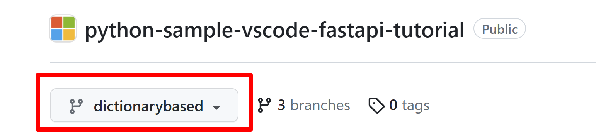

Then, select **Code** > **Codespaces** > **Create Codespace on <dictionarybased>** branch to create and open a codespace for your project.

&zeroWidthSpace;然后，选择代码 > Codespaces > 在 分支上创建 Codespace，为您的项目创建并打开一个 Codespace。

Once you're done, you can continue with the [Replace the database](https://code.visualstudio.com/docs/python/tutorial-fastapi#_replace-the-database) section below.

&zeroWidthSpace;完成后，您可以继续执行下面的替换数据库部分。

### [Locally in VS Code 在 VS Code 中本地](https://code.visualstudio.com/docs/python/tutorial-fastapi#_locally-in-vs-code)

To successfully complete this tutorial in [VS Code](https://code.visualstudio.com/), you first need to set up your Python development environment. Specifically, this tutorial requires:

&zeroWidthSpace;要在 VS Code 中成功完成本教程，您首先需要设置 Python 开发环境。具体来说，本教程需要：

- Python 3 (check the [installation guide](https://code.visualstudio.com/docs/python/python-tutorial#_install-a-python-interpreter) if you don't have it installed)
  Python 3（如果您尚未安装，请查看安装指南）
- [Python extension for VS Code](https://marketplace.visualstudio.com/items?itemName=ms-python.python) (For additional details on installing extensions, you can read [Extension Marketplace](https://code.visualstudio.com/docs/editor/extension-marketplace)).
  VS Code 的 Python 扩展（有关安装扩展的更多详细信息，您可以阅读扩展市场）。

In this section, we will create a folder to open as a workspace in VS Code, set up a Python virtual environment, and install the project's dependencies.

&zeroWidthSpace;在本部分中，我们将创建一个文件夹以在 VS Code 中作为工作区打开，设置 Python 虚拟环境并安装项目的依赖项。

1. In your file system, create a project folder for this tutorial, such as `groceries-plugin`.

   &zeroWidthSpace;在您的文件系统中，为本教程创建一个项目文件夹，例如 `groceries-plugin` 。

2. Open this new folder in VS Code (**File** > **Open Folder…**).

   &zeroWidthSpace;在 VS Code 中打开此新文件夹（文件 > 打开文件夹…）。

3. When the [Workspace Trust](https://code.visualstudio.com/docs/editor/workspace-trust) prompt shows up, select **Yes, I trust the authors** to allow the workspace to access necessary resources and extensions. You can learn more about Workspace Trust in the [documentation](https://code.visualstudio.com/docs/editor/workspace-trust).

   &zeroWidthSpace;当出现 Workspace Trust 提示时，选择是，我信任作者允许工作区访问必要的资源和扩展。您可以在文档中了解有关 Workspace Trust 的更多信息。

Now, let's create a `requirements.txt` file that lists the dependencies we wish to install for the application. The `requirements.txt` file is a common practice in Python development, used to specify the libraries that your project relies on and their versions. This file helps ensure that anyone working on the project can recreate a similar development environment, making it a convenient component for maintaining consistency.

&zeroWidthSpace;现在，让我们创建一个 `requirements.txt` 文件，其中列出我们希望为应用程序安装的依赖项。 `requirements.txt` 文件是 Python 开发中的常见做法，用于指定您的项目依赖的库及其版本。此文件有助于确保项目中的任何人员都可以重新创建类似的开发环境，使其成为维护一致性的便捷组件。

We will install FastAPI for creating the app, [uvicorn](https://www.uvicorn.org/) to work as the server, and [Redis](https://redis.io/) and `type-redis` for handling data storage and interacting with a Redis database.

&zeroWidthSpace;我们将安装 FastAPI 来创建应用程序，uvicorn 作为服务器工作，以及 Redis 和 `type-redis` 来处理数据存储并与 Redis 数据库进行交互。

1. Create a new file in VS Code (**File** > **New Text File** or Ctrl+N).

   &zeroWidthSpace;在 VS Code 中创建一个新文件（文件>新建文本文件或 Ctrl+N）。

2. Add the following content to it:

   &zeroWidthSpace;向其中添加以下内容：

   ```
   fastapi
   redis
   types-redis
   uvicorn
   ```

3. Save the file (Ctrl+S) and name it `requirements.txt`.

   &zeroWidthSpace;保存文件（Ctrl+S）并将其命名为 `requirements.txt` 。

4. Create a virtual environment by opening the Command Palette (Ctrl+Shift+P) and running the **Python: Create Environment** command.

   &zeroWidthSpace;通过打开命令面板（Ctrl+Shift+P）并运行 Python: Create Environment 命令来创建虚拟环境。

   > **Note**: This step may take a couple of minutes to complete.
   >
   > &zeroWidthSpace;注意：此步骤可能需要几分钟才能完成。

5. When asked for the environment type, select **Venv**:

   &zeroWidthSpace;当询问环境类型时，选择 Venv：

   

6. Then select the latest version of Python available on your machine:

   &zeroWidthSpace;然后选择机器上可用的最新版本的 Python：

   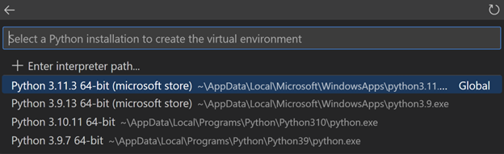

7. Select the `requirements.txt` file from the dropdown list, so the dependencies are automatically installed, and then select **OK**:

   &zeroWidthSpace;从下拉列表中选择 `requirements.txt` 文件，以便自动安装依赖项，然后选择“确定”：

   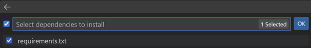

The virtual environment will be created, the dependencies automatically installed, and the environment selected for your workspace to be used by the Python extension. You can confirm it's been selected by checking the bottom right corner of VS Code:

&zeroWidthSpace;将创建虚拟环境，自动安装依赖项，并为工作空间选择环境以供 Python 扩展使用。您可以通过检查 VS Code 的右下角来确认已选择它：


> **Note**: If you don't find the newly created environment information on the Status bar, you can click on the Python interpreter indicator (or run the **Python: Select Interpreter** command from the Command Palette) and manually select the virtual environment.
>
> &zeroWidthSpace;注意：如果您在状态栏上找不到新创建的环境信息，可以单击 Python 解释器指示符（或从命令面板运行 Python: Select Interpreter 命令）并手动选择虚拟环境。

## [Start Coding 开始编码](https://code.visualstudio.com/docs/python/tutorial-fastapi#_start-coding)

Let's create the application!

&zeroWidthSpace;让我们创建应用程序！

1. Create a new Python file by using **File** > **New File…** and then select **Python File**.

   &zeroWidthSpace;通过使用“文件”>“新建文件…”创建一个新的 Python 文件，然后选择“Python 文件”。

2. Save it as `main.py` (Ctrl+Shift+S) in the `groceries-plugin` folder.

   &zeroWidthSpace;将其另存为 `main.py` （Ctrl+Shift+S），位于 `groceries-plugin` 文件夹中。

3. Add the following code to `main.py` and save the file:

   &zeroWidthSpace;将以下代码添加到 `main.py` 并保存文件：

   ```
   from fastapi import FastAPI
   
   app = FastAPI()
   
   @app.get("/")
   def root():
       return {"message": "Hello World"}
   ```

4. Run the code by starting up the debugger (F5).

   &zeroWidthSpace;通过启动调试器 (F5) 来运行代码。

5. From the dropdown menu, select the **FastAPI** configuration option from the list:

   &zeroWidthSpace;从下拉菜单中，从列表中选择 FastAPI 配置选项：

   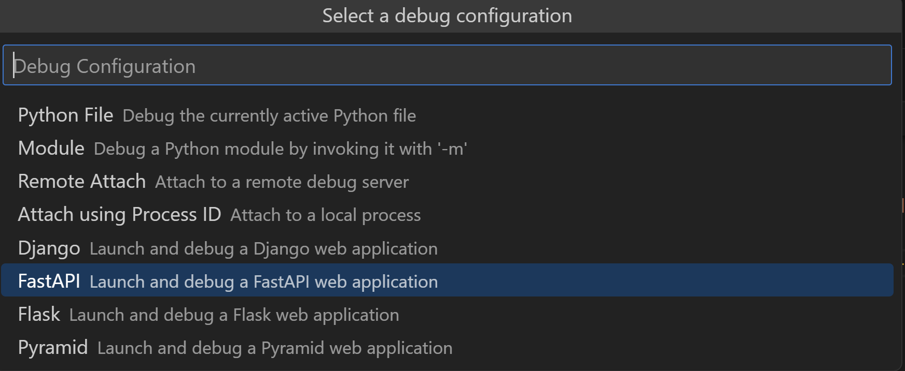

   This invokes uvicorn to start the application server through the debugger and allow you to step through the source code to inspect its behavior. You should see something like the following in the terminal:

   &zeroWidthSpace;这会调用 uvicorn 通过调试器启动应用程序服务器，并允许您逐步浏览源代码以检查其行为。您应该在终端中看到类似以下内容：

   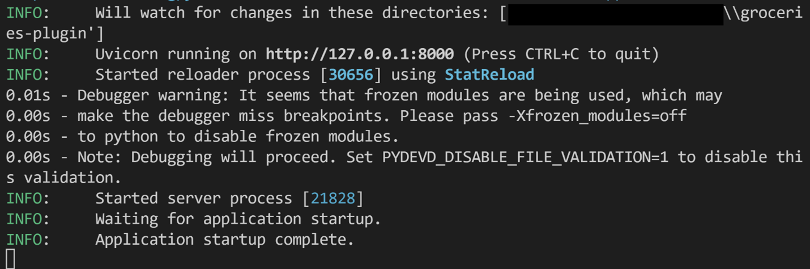

6. Ctrl+Click the `http://127.0.0.1:8000/` URL in the terminal to open your default browser to that address:

   &zeroWidthSpace;Ctrl+单击终端中的 `http://127.0.0.1:8000/` URL，以使用默认浏览器打开该地址：

   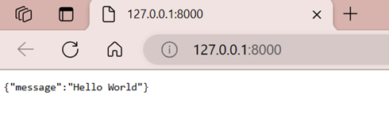

   Congratulations! Your FastAPI app is up and running!

   &zeroWidthSpace;恭喜！您的 FastAPI 应用已启动并正在运行！

7. Stop the debugger by using the **Stop** button in the debug toolbar, or through Shift+F5.

   &zeroWidthSpace;使用调试工具栏中的停止按钮或通过 Shift+F5 停止调试器。

## [Create a model for grocery list items 为杂货清单项目创建模型](https://code.visualstudio.com/docs/python/tutorial-fastapi#_create-a-model-for-grocery-list-items)

Now that we have the FastAPI app working, we can define our grocery list items by using [Pydantic](https://docs.pydantic.dev/latest/), a data validation and parsing library that integrates seamlessly with FastAPI. Pydantic lets you define data models using Python classes with [type hints](https://docs.python.org/3/library/typing.html) for automatic validation and parsing of incoming data (called "payloads") in API requests.

&zeroWidthSpace;现在我们已经让 FastAPI 应用正常工作，我们可以使用 Pydantic（一个与 FastAPI 无缝集成的、用于数据验证和解析的库）来定义我们的杂货清单项目。Pydantic 允许您使用带有类型提示的 Python 类来定义数据模型，以便在 API 请求中自动验证和解析传入的数据（称为“有效负载”）。

Let's create a model for our grocery list items. We will use the `ItemPayload` model to define the data structure of the items to add to the grocery list. This model will have three fields: `item_id`, `item_name`, and `quantity`.

&zeroWidthSpace;让我们为我们的杂货清单项目创建一个模型。我们将使用 `ItemPayload` 模型来定义要添加到杂货清单中的项目的的数据结构。此模型将有三个字段： `item_id` 、 `item_name` 和 `quantity` 。

1. Create a new Python file with **File** > **New File…** and then select **Python File**.

   &zeroWidthSpace;使用文件 > 新建文件… 创建一个新的 Python 文件，然后选择 Python 文件。

2. Add the following lines to the file, and then save it in the `groceries-plugin` folder as `models.py` (Ctrl+Shift+S):

   &zeroWidthSpace;将以下行添加到文件中，然后将其保存在 `groceries-plugin` 文件夹中，文件名 `models.py` (Ctrl+Shift+S)：

   ```
   from typing import Optional
   from pydantic import BaseModel
   
   class ItemPayload(BaseModel):
       item_id: Optional[int]
       item_name: str
       quantity: int
   ```

[Pylance](https://marketplace.visualstudio.com/items?itemName=ms-python.vscode-pylance), the default language server for Python in VS Code, supports type hinting features that can be helpful for working with Pydantic models and FastAPI. This is because Pylance is built on top of [Pyright](https://github.com/microsoft/pyright), a static type checker for Python that can detect type errors in your code to prevent bugs and improve code quality.

&zeroWidthSpace;Pylance 是 VS Code 中 Python 的默认语言服务器，它支持类型提示功能，这对于使用 Pydantic 模型和 FastAPI 很有帮助。这是因为 Pylance 是基于 Pyright 构建的，Pyright 是 Python 的静态类型检查器，它可以在代码中检测类型错误，以防止出现错误并提高代码质量。

The three steps below are optional, but given that FastAPI uses type hints extensively to improve code readability and validation, we can take advantage of Pylance's type checking features to catch errors early on:

&zeroWidthSpace;以下三个步骤是可选的，但鉴于 FastAPI 广泛使用类型提示来提高代码可读性和验证，我们可以利用 Pylance 的类型检查功能尽早发现错误：

1. Open the Settings editor (Ctrl+,).

   &zeroWidthSpace;打开设置编辑器 (Ctrl+,)。

2. Search for "python type checking mode" and set it to `basic` for basic type checking. Pylance will now show diagnostics and warnings to catch simple type-related errors. Alternatively, you can set it to `strict` to enforce more advanced [type checking rules](https://microsoft.github.io/pyright/#/configuration?id=diagnostic-rule-defaults).

   &zeroWidthSpace;搜索“python 类型检查模式”，并将其设置为 `basic` 以进行基本类型检查。Pylance 现在将显示诊断和警告，以捕获简单的类型相关错误。或者，您可以将其设置为 `strict` 以强制执行更高级的类型检查规则。

   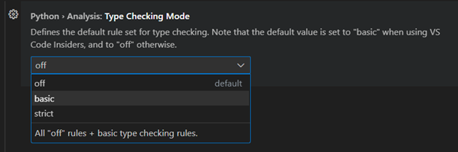

3. Next, search for "Python inlay type hints", and enable inlay hints for **Variable Types** and **Function Return Types**:

   &zeroWidthSpace;接下来，搜索“Python 内嵌类型提示”，并为变量类型和函数返回类型启用内嵌提示：

   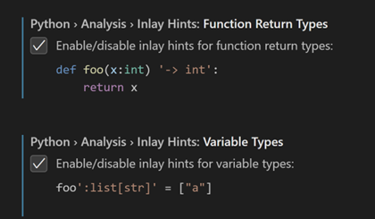

## [Create routes 创建路由](https://code.visualstudio.com/docs/python/tutorial-fastapi#_create-routes)

Now we need a place to store the grocery list items. For simplicity, let's start with an empty dictionary.

&zeroWidthSpace;现在，我们需要一个地方来存储购物清单项目。为了简单起见，我们从一个空字典开始。

1. First, let's import all the packages we need for the sample. Open the `main.py` file and replace the first import line with the following ones:

   &zeroWidthSpace;首先，让我们导入示例所需的所有软件包。打开 `main.py` 文件，并将第一行导入替换为以下内容：

   ```
   from fastapi import FastAPI, HTTPException
   
   from models import ItemPayload
   ```

2. Now add the following line right below `app = FastAPI()`:

   &zeroWidthSpace;现在，在 `app = FastAPI()` 正下方添加以下行：

   ```
   grocery_list: dict[int, ItemPayload] = {}
   ```

   This creates a new empty dictionary that receives keys of type `int` (as item IDs) and values of the `ItemPayload` type.

   &zeroWidthSpace;这将创建一个新的空字典，它接收 `int` 类型（作为项目 ID）的键和 `ItemPayload` 类型的键值。

We'll now define routes in our FastAPI application. In the context of web applications, routes are like pathways that map specific URLs to the code that handles them. These routes serve as the entry points for the different functionality within our application. When a client, such as a web browser or another program, sends a request to our application with a particular URL, FastAPI routes that request to the appropriate function (also known as route handler or view function) based on the URL, and that function processes the request and generates a response.

&zeroWidthSpace;我们现在将在 FastAPI 应用程序中定义路由。在 Web 应用程序上下文中，路由就像将特定 URL 映射到处理它们的代码的路径。这些路由充当应用程序中不同功能的入口点。当客户端（例如 Web 浏览器或其他程序）向我们的应用程序发送带有特定 URL 的请求时，FastAPI 会根据 URL 将该请求路由到适当的功能（也称为路由处理程序或视图功能），该功能处理请求并生成响应。

Let's proceed with defining routes to add and retrieve individual items, as well as return all items in the grocery list.

&zeroWidthSpace;让我们继续定义路由以添加和检索各个项目，以及返回购物清单中的所有项目。

1. Add the following route at the end of the `main.py` file:

   &zeroWidthSpace;在 `main.py` 文件的末尾添加以下路由：

   ```
   # Route to add a item
   @app.post("/items/{item_name}/{quantity}")
   def add_item(item_name: str, quantity: int):
       if quantity <= 0:
           raise HTTPException(status_code=400, detail="Quantity must be greater than 0.")
       # if item already exists, we'll just add the quantity.
       # get all item names
       items_ids = {item.item_name: item.item_id if item.item_id is not None else 0 for item in grocery_list.values()}
       if item_name in items_ids.keys():
           # get index of item_name in item_ids, which is the item_id
           item_id = items_ids[item_name]
           grocery_list[item_id].quantity += quantity
   # otherwise, create a new item
       else:
           # generate an ID for the item based on the highest ID in the grocery_list
           item_id = max(grocery_list.keys()) + 1 if grocery_list else 0
           grocery_list[item_id] = ItemPayload(
               item_id=item_id, item_name=item_name, quantity=quantity
           )
   
       return {"item": grocery_list[item_id]}
   ```

   If you have enabled type hints in the previous section, you might notice Pylance adds inlay hints with the function return type, as well as the types for `item_ids` and `item_id`. You can optionally double-click on each suggestion to insert them into the code:

   &zeroWidthSpace;如果您已在上一个部分中启用了类型提示，您可能会注意到 Pylance 添加了带有函数返回类型以及 `item_ids` 和 `item_id` 的类型的嵌入式提示。您可以选择双击每个建议以将它们插入到代码中：

   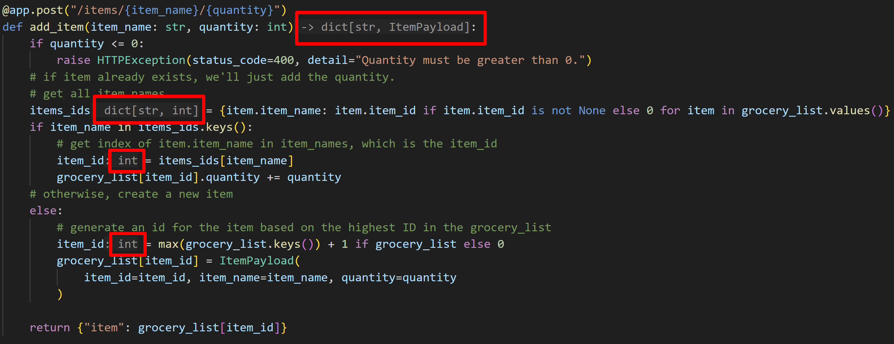

Now let's check if this route is working as expected. The fastest way to do so is to use both VS Code's debugger as well as FastAPI's `/docs` endpoint, which provides information about all the available API routes and lets you interact with the API to explore their parameters and responses. This documentation is generated dynamically based on the metadata and type hints defined in the FastAPI application.

&zeroWidthSpace;现在让我们检查此路由是否按预期工作。最快的做法是同时使用 VS Code 的调试器以及 FastAPI 的 `/docs` 端点，它提供有关所有可用 API 路由的信息，并允许您与 API 交互以探索其参数和响应。此文档是根据 FastAPI 应用程序中定义的元数据和类型提示动态生成的。

1. Add a breakpoint next to the `if quantity <= 0` statement, by clicking on the left margin of the line number (or F9). The debugger will stop prior to the execution of that line, so you can inspect the code line by line.

   &zeroWidthSpace;通过单击行号的左边界（或 F9）在 `if quantity <= 0` 语句旁边添加一个断点。调试器将在执行该行之前停止，以便您可以逐行检查代码。

   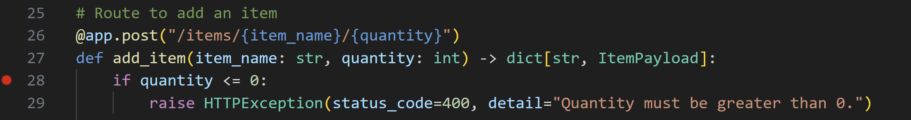

2. Start the debugger (F5), and then navigate to `http://127.0.0.1:8000/docs` in the browser.

   &zeroWidthSpace;启动调试器（F5），然后在浏览器中导航到 `http://127.0.0.1:8000/docs` 。

   There should be a Swagger interface with the two endpoints available in the app: `/items` and root (`/`).

   &zeroWidthSpace;应该有一个 Swagger 界面，其中包含应用程序中可用的两个端点： `/items` 和根（ `/` ）。

   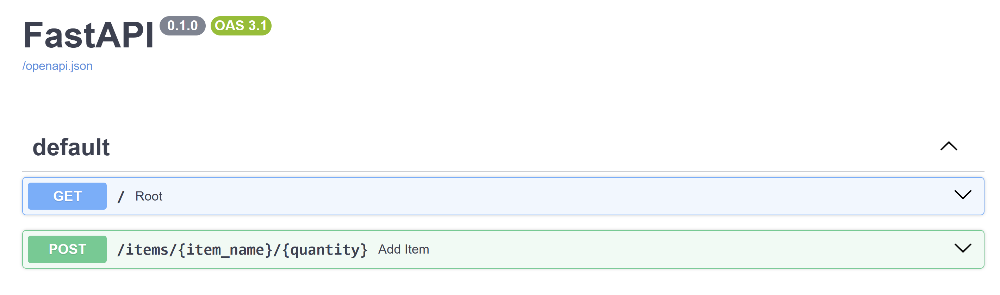

3. Select the down arrow next to the `/items` route to expand it, and then the **Try it out** button that appears on the right side.

   &zeroWidthSpace;选择 `/items` 路由旁边的向下箭头以展开它，然后选择出现在右侧的“试用”按钮。

   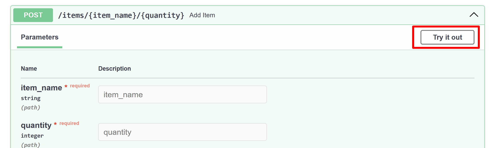

4. Add a grocery list item by passing a string to the `item_name` field and a number to `quantity`. For example, you could provide apple as the `item_name` and 2 as the `quantity`.

   &zeroWidthSpace;通过将字符串传递给 `item_name` 字段和数字传递给 `quantity` 来添加杂货清单项目。例如，您可以提供 apple 作为 `item_name` 和 2 作为 `quantity` 。

5. Select **Execute**.

   &zeroWidthSpace;选择执行。

   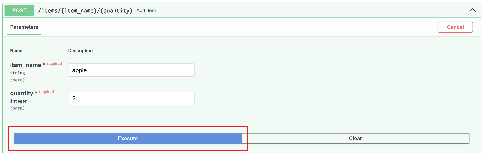

6. Open VS Code again and notice the debugger has stopped at the breakpoint you set earlier.

   &zeroWidthSpace;再次打开 VS Code，并注意调试器已停止在您之前设置的断点处。

   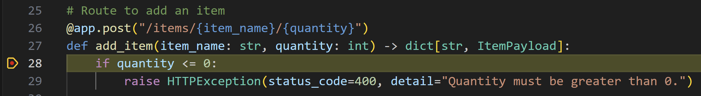

   On the left side, all local and global variables defined at this point are displayed in the Variables window, under the **Run and Debug** view. In our example, `item_name` is set to 'apple' and `quantity` is set to 2 under the locals variable view, as well as an empty `grocery_list` dictionary under the globals variable view.

   &zeroWidthSpace;在左侧，在此点定义的所有本地和全局变量都显示在“变量”窗口中，“运行和调试”视图下。在我们的示例中， `item_name` 设置为“apple”， `quantity` 设置为 2（位于“本地”变量视图下），以及一个空的 `grocery_list` 字典（位于“全局”变量视图下）。

   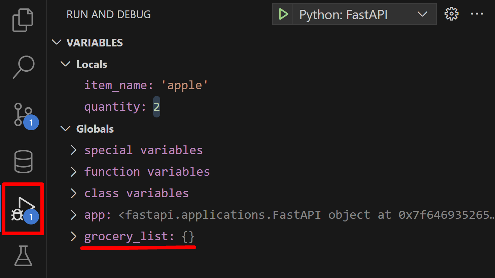

Now let's use VS Code's Debug Console to do some exploration.

&zeroWidthSpace;现在，让我们使用 VS Code 的调试控制台进行一些探索。

1. Select the `quantity <= 0` statement, right-click on the editor and select **Evaluate in Debug Console**:

   &zeroWidthSpace;选择 `quantity <= 0` 语句，右键单击编辑器并选择在调试控制台中求值：

   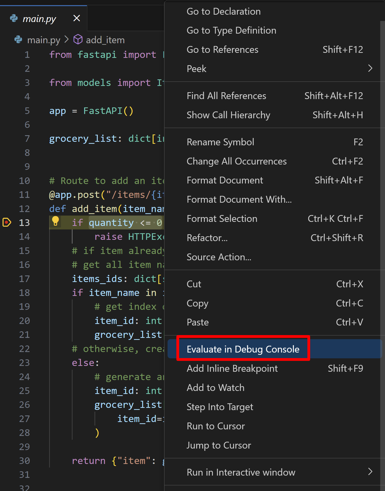

   This opens the Debug Console and runs the selected expression. As expected in our example, the expression evaluates to `False`.

   &zeroWidthSpace;这将打开调试控制台并运行所选表达式。正如我们示例中所料，表达式求值为 `False` 。

The Debug Console can be a powerful tool to quickly test expressions and better understand the state of your code at the time of a breakpoint. You can also use it to run arbitrary code, such as calling functions or printing variables. You can learn more about Python debugging in VS Code in the [Python tutorial](https://code.visualstudio.com/docs/python/python-tutorial#_configure-and-run-the-debugger).

&zeroWidthSpace;调试控制台可以是一个强大的工具，可以快速测试表达式并更好地了解代码在断点时的状态。您还可以使用它来运行任意代码，例如调用函数或打印变量。您可以在 Python 教程中了解有关在 VS Code 中进行 Python 调试的更多信息。

You can now continue the execution of the code by selecting **Continue** in the Debug view tool bar, or by pressing F5.

&zeroWidthSpace;现在，您可以通过选择“调试”视图工具栏中的“继续”或按 F5 来继续执行代码。

Finally, let's add the remaining routes for the application so we can list all items or specific items, as well as remove them from our grocery list. You can leave the debugger running as it will automatically reload the application when you save the changes you make in the next step.

&zeroWidthSpace;最后，让我们为应用程序添加剩余的路由，以便我们可以列出所有项目或特定项目，以及从我们的购物清单中删除它们。您可以让调试器继续运行，因为它会在您保存下一步中所做的更改时自动重新加载应用程序。

1. Replace the content in `main.py` with the code below:

   &zeroWidthSpace;用下面的代码替换 `main.py` 中的内容：

   ```
   from fastapi import FastAPI, HTTPException
   
   from models import ItemPayload
   
   app = FastAPI()
   
   grocery_list: dict[int, ItemPayload] = {}
   
   # Route to add an item
   @app.post("/items/{item_name}/{quantity}")
   def add_item(item_name: str, quantity: int) -> dict[str, ItemPayload]:
       if quantity <= 0:
           raise HTTPException(status_code=400, detail="Quantity must be greater than 0.")
       # if item already exists, we'll just add the quantity.
       # get all item names
       items_ids: dict[str, int] = {
           item.item_name: item.item_id if item.item_id is not None else 0
           for item in grocery_list.values()
       }
       if item_name in items_ids.keys():
           # get index of item_name in item_ids, which is the item_id
           item_id: int = items_ids[item_name]
           grocery_list[item_id].quantity += quantity
       # otherwise, create a new item
       else:
           # generate an ID for the item based on the highest ID in the grocery_list
           item_id: int = max(grocery_list.keys()) + 1 if grocery_list else 0
           grocery_list[item_id] = ItemPayload(
               item_id=item_id, item_name=item_name, quantity=quantity
           )
   
       return {"item": grocery_list[item_id]}
   
   
   # Route to list a specific item by ID
   @app.get("/items/{item_id}")
   def list_item(item_id: int) -> dict[str, ItemPayload]:
       if item_id not in grocery_list:
           raise HTTPException(status_code=404, detail="Item not found.")
       return {"item": grocery_list[item_id]}
   
   
   # Route to list all items
   @app.get("/items")
   def list_items() -> dict[str, dict[int, ItemPayload]]:
       return {"items": grocery_list}
   
   
   # Route to delete a specific item by ID
   @app.delete("/items/{item_id}")
   def delete_item(item_id: int) -> dict[str, str]:
       if item_id not in grocery_list:
           raise HTTPException(status_code=404, detail="Item not found.")
       del grocery_list[item_id]
       return {"result": "Item deleted."}
   
   
   # Route to remove some quantity of a specific item by ID
   @app.delete("/items/{item_id}/{quantity}")
   def remove_quantity(item_id: int, quantity: int) -> dict[str, str]:
       if item_id not in grocery_list:
           raise HTTPException(status_code=404, detail="Item not found.")
       # if quantity to be removed is higher or equal to item's quantity, delete the item
       if grocery_list[item_id].quantity <= quantity:
           del grocery_list[item_id]
           return {"result": "Item deleted."}
       else:
           grocery_list[item_id].quantity -= quantity
       return {"result": f"{quantity} items removed."}
   ```

2. Save the file (Ctrl+S). The application should automatically reload.

   &zeroWidthSpace;保存文件 (Ctrl+S)。应用程序应自动重新加载。

You can now open the `/docs` page again and test the new routes, using the debugger and the Debug Console to better understand the code execution. Once you're done, you can stop the debugger (Shift+F5). You can also remove the breakpoint we added in step 4 by clicking on it.

&zeroWidthSpace;现在，您可以再次打开 `/docs` 页面并测试新路由，使用调试器和调试控制台来更好地理解代码执行。完成后，您可以停止调试器 (Shift+F5)。您还可以通过单击断点来删除我们在步骤 4 中添加的断点。

Congratulations! You now have a working FastAPI application with routes to add, list, and delete items from a grocery list.

&zeroWidthSpace;恭喜！您现在有一个可用的 FastAPI 应用程序，其中包含用于向购物清单中添加、列出和删除项目的路由。

## [Set up the data storage 设置数据存储](https://code.visualstudio.com/docs/python/tutorial-fastapi#_set-up-the-data-storage)

At this point, you already have a working version of the application with the base functionality. This section guides you through setting up data storage for persistence, but you can choose to skip it if you're happy with what you've learned already.

&zeroWidthSpace;此时，您已经拥有一个具有基本功能的应用程序的工作版本。本部分将指导您设置用于持久性的数据存储，但如果您对已经学到的内容感到满意，可以选择跳过此部分。

So far we are storing the data in a dictionary, which is not ideal because all of the data will be lost when the application is restarted.

&zeroWidthSpace;到目前为止，我们一直在字典中存储数据，这不是理想的做法，因为在应用程序重新启动时所有数据都将丢失。

To persist the data, we will use [Redis](https://redis.io/), which is an open source in-memory data structure store. Due to its speed and versatility, Redis is commonly used as a data storage system in a wide range of applications, including web applications, real-time analytics systems, caching layers, this tutorial, and more.

&zeroWidthSpace;为了持久化数据，我们将使用 Redis，它是一个开源的内存数据结构存储。由于其速度和多功能性，Redis 通常用作各种应用程序中的数据存储系统，包括 Web 应用程序、实时分析系统、缓存层、本教程等。

If you are already working on **GitHub Codespaces** with our existing template, you can skip directly to the [Replace the database](https://code.visualstudio.com/docs/python/tutorial-fastapi#_replace-the-database) section.

&zeroWidthSpace;如果您已经在使用我们现有模板的 GitHub Codespaces 工作，则可以直接跳到替换数据库部分。

If you are on Windows, you can work with Redis by setting up either a [Docker container](https://www.docker.com/products/docker-desktop), a [GitHub Codespace](https://github.com/features/codespaces), or through [WSL](https://learn.microsoft.com/windows/wsl) (Windows Subsystem for Linux). In this tutorial we will use a Docker container, but you can refer to the [section above](https://code.visualstudio.com/docs/python/tutorial-fastapi#_github-codespaces) for instructions on how to set up a GitHub Codespace.

&zeroWidthSpace;如果您使用的是 Windows，则可以通过设置 Docker 容器、GitHub Codespace 或通过 WSL（适用于 Linux 的 Windows 子系统）来使用 Redis。在本教程中，我们将使用 Docker 容器，但您可以参考上面的部分了解有关如何设置 GitHub Codespace 的说明。

Otherwise, if you are on a Linux or a macOS machine, you can install Redis by following the [instructions on their website](https://redis.io/docs/install), and then skip to the [Replace the database](https://code.visualstudio.com/docs/python/tutorial-fastapi#_replace-the-database) section.

&zeroWidthSpace;否则，如果您使用的是 Linux 或 macOS 机器，则可以按照其网站上的说明安装 Redis，然后跳到替换数据库部分。

### [Setting up a Docker Container on Windows 在 Windows 上设置 Docker 容器](https://code.visualstudio.com/docs/python/tutorial-fastapi#_setting-up-a-docker-container-on-windows)

The VS Code [Dev Containers](https://marketplace.visualstudio.com/items?itemName=ms-vscode-remote.remote-containers) extension offers a streamlined approach to consolidate your project, its dependencies, and all necessary tools into one tidy container, creating a full-featured development environment. The extension lets you open your project inside (or mounted into) the container in VS Code, where you'll have its full feature set.

&zeroWidthSpace;VS Code Dev Containers 扩展提供了一种简化的方法，可将您的项目、其依赖项和所有必要的工具整合到一个整洁的容器中，从而创建一个功能齐全的开发环境。此扩展允许您在 VS Code 中打开项目（或将其装入容器中），您可以在其中使用其全套功能。

For the steps below, make sure you have the following requirements installed on your machine:

&zeroWidthSpace;对于以下步骤，请确保您的计算机上已安装以下要求：

#### [Requirements 要求](https://code.visualstudio.com/docs/python/tutorial-fastapi#_requirements)

- [Docker for Windows
  适用于 Windows 的 Docker](https://www.docker.com/)
- [Dev Containers](https://marketplace.visualstudio.com/items?itemName=ms-vscode-remote.remote-containers) extension
  Dev Containers 扩展

#### [Create the Dev container configuration 创建 Dev 容器配置](https://code.visualstudio.com/docs/python/tutorial-fastapi#_create-the-dev-container-configuration)

1. Open the Command Palette and run the **Dev Containers: Add Dev Container Configuration Files…**.

   &zeroWidthSpace;打开命令面板并运行 Dev Containers: Add Dev Container Configuration Files….

2. Select **Python 3**:

   &zeroWidthSpace;选择 Python 3：

   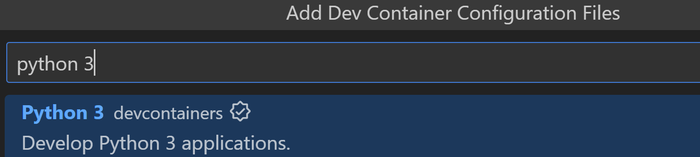

3. Select the default version.

   &zeroWidthSpace;选择默认版本。

We can optionally install [Features](https://github.com/devcontainers/features) to be included in the container. For this tutorial, we will install [Redis Server](https://github.com/itsmechlark/features/tree/main/src/redis-server), a community contributed Feature that installs and adds the proper dev container setup for Redis.

&zeroWidthSpace;我们还可以选择安装要包含在容器中的功能。对于本教程，我们将安装 Redis Server，这是一个社区贡献的功能，可安装并添加适用于 Redis 的适当开发容器设置。

1. Select **Redis Server** as an additional feature to be installed, press **OK**, and then select **Keep Defaults**.

   &zeroWidthSpace;选择 Redis Server 作为要安装的其他功能，按确定，然后选择保留默认值。

   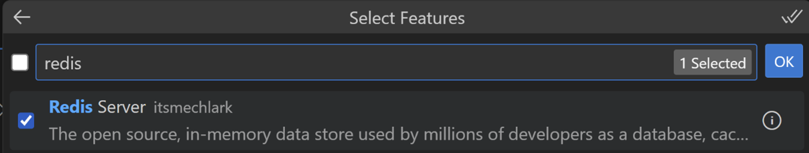

This creates a `.devcontainer` folder in your workspace, with a `devcontainer.json` file. Let's make some edits to this file so the container setup includes steps such as installing the VS Code extensions we need as well as the project dependencies.

&zeroWidthSpace;这会在您的工作区中创建一个 `.devcontainer` 文件夹，其中包含一个 `devcontainer.json` 文件。让我们对该文件进行一些编辑，以便容器设置包括安装我们需要的 VS Code 扩展以及项目依赖项等步骤。

1. Open the `devcontainer.json` file.

   &zeroWidthSpace;打开 `devcontainer.json` 文件。

2. Add a "," after the `"features" : { ... }` entry, so we can add more settings to the file.

   &zeroWidthSpace;在 `"features" : { ... }` 条目后添加一个“,”，以便我们可以向该文件添加更多设置。

Next, we will add the necessary dependency installation commands to the `postCreateCommand` property in the `devcontainer.json` file, so our application is ready to run once the container is set up.

&zeroWidthSpace;接下来，我们将必要的依赖项安装命令添加到 `devcontainer.json` 文件中的 `postCreateCommand` 属性，以便在容器设置好后我们的应用程序就可以运行。

1. Locate the content below and remove the comment (`//`) from that line, so the dependencies can be installed once the container is created:

   &zeroWidthSpace;找到以下内容并从该行中删除注释 ( `//` )，以便在创建容器后可以安装依赖项：

   ```
   "postCreateCommand": "pip3 install --user -r requirements.txt",
   ```

   You can learn about `postCreateCommand` and more lifecycle scripts in the [Development Containers Specification](https://containers.dev/implementors/json_reference/#lifecycle-scripts).

   &zeroWidthSpace;您可以在开发容器规范中了解 `postCreateCommand` 和更多生命周期脚本。

   Now we will use the `customizations` property to add the VS Code extensions we want installed in the container.

   &zeroWidthSpace;现在，我们将使用 `customizations` 属性来添加我们希望在容器中安装的 VS Code 扩展。

2. Add the following setting to `devcontainer.json`:

   &zeroWidthSpace;将以下设置添加到 `devcontainer.json` ：

   ```
       // Use 'postCreateCommand' to run commands after the container is created.
       "postCreateCommand": "pip3 install --user -r requirements.txt",
   
       // Configure tool-specific properties.
       "customizations": {
           "vscode": {
               "extensions": [
                   "ms-python.python", //Python extension ID
                   "ms-python.vscode-pylance" //Pylance extension ID
               ]
           }
       }
   ```

3. Save the file.

   &zeroWidthSpace;保存文件。

4. Select **Reopen in Container** from the notification displayed in the bottom right corner, or run the **Dev Containers: Reopen in Container** command from the Command Palette.

   &zeroWidthSpace;从右下角显示的通知中选择“在容器中重新打开”，或从命令面板中运行“开发容器：在容器中重新打开”命令。

   > **Note**: It may take several minutes to build the container, depending on internet speed and machine performance.
   >
   > &zeroWidthSpace;注意：根据 Internet 速度和计算机性能，构建容器可能需要几分钟时间。

   You can learn more about dev container configuration in the [Dev Containers documentation](https://code.visualstudio.com/docs/devcontainers/containers#_create-a-devcontainerjson-file).

   &zeroWidthSpace;您可以在 Dev Containers 文档中了解有关 dev 容器配置的更多信息。

Once it's done, you will have a fully configured Linux-based workspace with Python 3 and Redis Server installed.

&zeroWidthSpace;完成后，您将拥有一个完全配置的基于 Linux 的工作区，其中安装了 Python 3 和 Redis Server。

Once the container is set up, you will notice an indicator on the bottom left corner of VS Code:

&zeroWidthSpace;容器设置好后，您会注意到 VS Code 左下角有一个指示器：

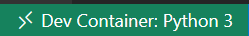

> **Note**: Double check that the Python and Pylance extensions have been successfully installed in the container by opening the Extensions view (Ctrl+Shift+X) and searching for them. If not, you can install them by running **Install in Dev Container**.
>
> &zeroWidthSpace;注意：通过打开扩展视图 (Ctrl+Shift+X) 并搜索 Python 和 Pylance 扩展，仔细检查是否已成功在容器中安装这些扩展。如果没有，您可以通过运行在 Dev Container 中安装来安装它们。

The selected Python interpreter information is available on the Status bar at the bottom right corner, matching the version specified in the `devcontainer.json` file:

&zeroWidthSpace;选定的 Python 解释器信息显示在右下角的状态栏中，与 `devcontainer.json` 文件中指定版本匹配：


> **Note**: If you don't find the Python interpreter information on the Status bar, you can click on the Python interpreter indicator (or run the **Python: Select Interpreter** command from the Command Palette) and manually select the Python interpreter in the container.
>
> &zeroWidthSpace;注意：如果您在状态栏中找不到 Python 解释器信息，可以单击 Python 解释器指示器（或从命令面板中运行 Python: 选择解释器命令），然后手动选择容器中的 Python 解释器。

We are now ready to move on to the next section, where we will replace the data storage.

&zeroWidthSpace;现在，我们准备继续下一部分，在其中我们将替换数据存储。

## [Replace the database 替换数据库](https://code.visualstudio.com/docs/python/tutorial-fastapi#_replace-the-database)

We have a dictionary that stores the grocery list items, but we want to replace it with a Redis database. In this tutorial, we will use Redis hashes to store our data, which is a data structure that can store multiple key-value pairs.

&zeroWidthSpace;我们有一个存储购物清单项目的字典，但我们想用 Redis 数据库替换它。在本教程中，我们将使用 Redis 哈希来存储我们的数据，这是一种可以存储多个键值对的数据结构。

Unlike a traditional database where you can retrieve an item without knowing its ID, you need to know the Redis hash key in order to retrieve a value from it. In this tutorial, we will create a hash called `item_name_to_id` to retrieve items by name, and map them to their IDs. In addition, we'll create other hashes to retrieve items by ID, mapping them to their names and quantities. Each item hash is named `item_id:{item_id}` and has two fields: `item_name` and `quantity`.

&zeroWidthSpace;与传统数据库不同，在传统数据库中，您可以在不知道其 ID 的情况下检索项目，而您需要知道 Redis 哈希键才能从中检索值。在本教程中，我们将创建一个名为 `item_name_to_id` 的哈希来按名称检索项目，并将它们映射到其 ID。此外，我们将创建其他哈希来按 ID 检索项目，并将它们映射到其名称和数量。每个项目哈希都命名为 `item_id:{item_id}` ，并有两个字段： `item_name` 和 `quantity` 。

First, let's start by replacing the dictionary with a Redis client object that connects to a Redis server.

&zeroWidthSpace;首先，让我们从用 Redis 客户端对象替换字典开始，该对象连接到 Redis 服务器。

1. In the `main.py` file, replace the `grocery_list: dict[int, ItemPayload] = {}` in the beginning of the file with the lines below:

   &zeroWidthSpace;在 `main.py` 文件中，用下面的行替换文件开头的 `grocery_list: dict[int, ItemPayload] = {}` ：

   ```
   redis_client = redis.StrictRedis(host='0.0.0.0', port=6379, db=0, decode_responses=True)
   ```

Pylance will display an error message because Redis hasn't been imported yet.

&zeroWidthSpace;Pylance 将显示一条错误消息，因为尚未导入 Redis。

1. Put the cursor on "redis" in the editor, and click on the displayed light bulb (or Ctrl+.). Then select **Add 'import redis'**.

   &zeroWidthSpace;将光标放在编辑器中的“redis”上，然后单击显示的灯泡（或 Ctrl+。）然后选择添加“import redis”。

   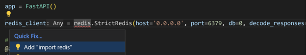

   > **Tip**: You can set up Pylance to automatically add imports by looking for the **Auto Import Completions** setting in the Settings editor (Ctrl+,) and enabling it.
   >
   > &zeroWidthSpace;提示：您可以通过在设置编辑器（Ctrl+，）中查找自动导入补全设置并启用它来设置 Pylance 以自动添加导入。

We now have a Redis client object that connects to a Redis server running on the local host (`host="0.0.0.0"`) and listening on port 6379 (`port=6379`). The `db` parameter specifies the Redis database to use. Redis supports multiple databases, and in this code we're going to use database 0, which is the default database. We're also passing `decode_responses=True` for the responses to be decoded as strings (instead of bytes).

&zeroWidthSpace;我们现在有一个 Redis 客户端对象，它连接到本地主机上运行的 Redis 服务器（ `host="0.0.0.0"` ）并侦听端口 6379（ `port=6379` ）。 `db` 参数指定要使用的 Redis 数据库。Redis 支持多个数据库，在此代码中，我们将使用数据库 0，它是默认数据库。我们还传递 `decode_responses=True` 以将响应解码为字符串（而不是字节）。

Let's do some more replacements in the first route `add_item`. Instead of looking at all the keys from the dictionary to find the item name that has been provided, we can fetch that information directly from a Redis hash.

&zeroWidthSpace;让我们在第一个路由 `add_item` 中做一些更多的替换。我们可以直接从 Redis 哈希中获取该信息，而不是查看字典中的所有键以查找已提供的项目名称。

We'll assume that the `item_name_to_id` hash already exists, mapping item names to their IDs (don't worry, we'll add this code shortly!). We can then get the ID of the item name we're receiving in the request by invoking the `hget` method from Redis, which will return the item ID if the requested name already exists in the hash, or `None` if it doesn't.

&zeroWidthSpace;我们将假设 `item_name_to_id` 哈希已经存在，将项目名称映射到它们的 ID（别担心，我们很快就会添加此代码！）。然后，我们可以通过调用 Redis 的 `hget` 方法来获取我们在请求中收到的项目名称的 ID，如果请求的名称已存在于哈希中，它将返回项目 ID，否则返回 `None` 。

1. Delete the line with the content below:

   &zeroWidthSpace;删除包含以下内容的行：

   ```
   items_ids = {item.item_name: item.item_id if item.item_id is not None else 0 for item in grocery_list.values()}
   ```

   And replace it with:

   &zeroWidthSpace;并用以下内容替换它：

   ```
     item_id = redis_client.hget("item_name_to_id", item_name)
   ```

Notice that Pylance raises a problem with this change. This is because the `hget` method returns either `str`, or `None` (if the item doesn't exist). However, the lines below the code that we haven't replaced yet expect `item_id` to be of type `int`. Let's address this warning by renaming the `item_id` symbol.

&zeroWidthSpace;请注意，Pylance 对此更改提出了问题。这是因为 `hget` 方法返回 `str` 或 `None` （如果项目不存在）。然而，我们尚未替换的代码行下方期望 `item_id` 的类型为 `int` 。让我们通过重命名 `item_id` 符号来解决此警告。

1. Rename `item_id` to `item_id_str`.

   &zeroWidthSpace;将 `item_id` 重命名为 `item_id_str` 。

2. If you have inlay hints enabled, Pylance should show a variable type hint next to `item_id_str`. You can optionally double-click to accept it:

   &zeroWidthSpace;如果启用了内联提示，Pylance 应在 `item_id_str` 旁边显示变量类型提示。您可以选择双击以接受它：

   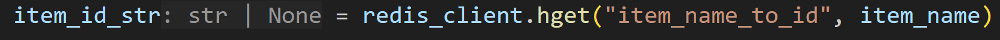

3. If the item doesn't exist, then `item_id_str` is `None`. So now we can delete the line with the following content:

   &zeroWidthSpace;如果项目不存在，则 `item_id_str` 为 `None` 。因此，我们现在可以删除包含以下内容的行：

   ```
   if item_name in items_ids.keys():
   ```

   And replace it with:

   &zeroWidthSpace;并用以下内容替换它：

   ```
   if item_id_str is not None:
   ```

Now that we have the item ID as a string, we need to convert it to an `int` and update the quantity for the item. Currently, our Redis hash only maps item names to their IDs. To also map item IDs to their names and quantities, we will create a separate Redis hash for each item, using `"item_id:{item_id}"` as our hash name to make retrieval by ID easier. We'll also add `item_name` and `quantity` fields for each of these hashes.

&zeroWidthSpace;现在我们已将项目 ID 作为字符串，我们需要将其转换为 `int` 并更新项目的数量。目前，我们的 Redis 哈希仅将项目名称映射到其 ID。为了还将项目 ID 映射到其名称和数量，我们将为每个项目创建一个单独的 Redis 哈希，使用 `"item_id:{item_id}"` 作为哈希名称，以便于按 ID 检索。我们还将为这些哈希中的每一个添加 `item_name` 和 `quantity` 字段。

1. Delete the code within the `if` block:

   &zeroWidthSpace;删除 `if` 块内的代码：

   ```
   item_id: int = items_ids[item_name]
   grocery_list[item_id].quantity += quantity
   ```

   And add the following, to convert the `item_id` to an `int`, and then to increment the quantity of the item by calling the `hincrby` method from Redis. This method increments the value of the `"quantity"` field by the given amount in the request (`quantity`):

   &zeroWidthSpace;然后添加以下内容，将 `item_id` 转换为 `int` ，然后通过调用 Redis 中的 `hincrby` 方法增加商品数量。此方法将 `"quantity"` 字段的值增加请求中给定的数量 ( `quantity` )：

   ```
   item_id = int(item_id_str)
   redis_client.hincrby(f"item_id:{item_id}", "quantity", quantity)
   ```

We now only need to replace the code for when the item does not exist, when `item_id_str` is `None`. In this case, we generate a new `item_id`, create a new Redis hash for the item, and then add the provided item name and quantity.

&zeroWidthSpace;现在，我们只需要替换当商品不存在时的代码，即当 `item_id_str` 为 `None` 时。在这种情况下，我们会生成一个新的 `item_id` ，为商品创建一个新的 Redis 哈希，然后添加提供的商品名称和数量。

To generate a new `item_id`, let's use the `incr` method from Redis, passing a new hash called `"item_ids"`. This hash is used to store the last generated ID, so we can increment it each time we create a new item, ensuring that they all have a unique ID.

&zeroWidthSpace;为了生成一个新的 `item_id` ，我们使用 Redis 中的 `incr` 方法，传递一个名为 `"item_ids"` 的新哈希。此哈希用于存储最后生成的 ID，因此我们可以在每次创建新商品时对其进行递增，确保它们都具有唯一的 ID。

1. Delete the line with the following content:

   &zeroWidthSpace;删除包含以下内容的行：

   ```
   item_id: int = max(grocery_list.keys()) + 1 if grocery_list else 0
   ```

   And add the following:

   &zeroWidthSpace;并添加以下内容：

   ```
   item_id: int = redis_client.incr("item_ids")
   ```

   When this `incr` call is run for the first time with the `item_ids` key, Redis creates the key and maps it to the value `1`. Then, each subsequent time it's run, it increments the stored value by 1.

   &zeroWidthSpace;当此 `incr` 调用首次使用 `item_ids` 键运行时，Redis 会创建该键并将其映射到值 `1` 。然后，每次后续运行时，它都会将存储的值增加 1。

Now we will add the item to the Redis hash, using the `hset` method and by providing a mapping for the fields (`item_id`, `item_name`, and `quantity`), and the values (the item's newly created ID, and its provided name and quantity).

&zeroWidthSpace;现在，我们将使用 `hset` 方法将该项目添加到 Redis 哈希中，并通过提供字段（ `item_id` 、 `item_name` 和 `quantity` ）和值（项目的新创建 ID 及其提供的名称和数量）的映射来实现。

1. Delete the line with the following content:

   &zeroWidthSpace;删除包含以下内容的行：

   ```
   grocery_list[item_id] = ItemPayload(
           item_id=item_id, item_name=item_name, quantity=quantity
       )
   ```

   And replace it with the following:

   &zeroWidthSpace;并用以下内容替换它：

   ```
   redis_client.hset(
               f"item_id:{item_id}",
               mapping={
                   "item_id": item_id,
                   "item_name": item_name,
                   "quantity": quantity,
               })
   ```

Now we only need to map the newly created ID to the item name by setting the hash we referenced in the beginning, `item_name_to_id`.

&zeroWidthSpace;现在，我们只需要通过设置我们在开头引用的哈希 `item_name_to_id` 将新创建的 ID 映射到项目名称。

1. Add this line to the end of the route, inside the `else` block:

   &zeroWidthSpace;将此行添加到路由的末尾，位于 `else` 块内：

   ```
   redis_client.hset("item_name_to_id", item_name, item_id)
   ```

2. Delete the line with the following content:

   &zeroWidthSpace;删除包含以下内容的行：

   ```
   return {"item": grocery_list[item_id]}
   ```

   And replace it with:

   &zeroWidthSpace;并用以下内容替换它：

   ```
   return {"item": ItemPayload(item_id=item_id, item_name=item_name, quantity=quantity)}
   ```

3. If you would like, you can try to do a similar replacement for the other routes. Otherwise, you can just replace the entire content of the file with the lines below:

   &zeroWidthSpace;如果您愿意，可以尝试对其他路由执行类似的替换。否则，您只需用以下几行替换文件的全部内容：

   ```
   import redis
   from fastapi import FastAPI, HTTPException
   
   from models import ItemPayload
   
   app = FastAPI()
   
   redis_client = redis.StrictRedis(host="0.0.0.0", port=6379, db=0, decode_responses=True)
   
   # Route to add an item
   @app.post("/items/{item_name}/{quantity}")
   def add_item(item_name: str, quantity: int) -> dict[str, ItemPayload]:
       if quantity <= 0:
           raise HTTPException(status_code=400, detail="Quantity must be greater than 0.")
   
       # Check if item already exists
       item_id_str: str | None = redis_client.hget("item_name_to_id", item_name)
   
       if item_id_str is not None:
           item_id = int(item_id_str)
           redis_client.hincrby(f"item_id:{item_id}", "quantity", quantity)
       else:
           # Generate an ID for the item
           item_id: int = redis_client.incr("item_ids")
           redis_client.hset(
               f"item_id:{item_id}",
               mapping={
                   "item_id": item_id,
                   "item_name": item_name,
                   "quantity": quantity,
               },
           )
           # Create a set so we can search by name too
           redis_client.hset("item_name_to_id", item_name, item_id)
   
       return {
           "item": ItemPayload(item_id=item_id, item_name=item_name, quantity=quantity)
       }
   
   
   # Route to list a specific item by ID but using Redis
   @app.get("/items/{item_id}")
   def list_item(item_id: int) -> dict[str, dict[str, str]]:
       if not redis_client.hexists(f"item_id:{item_id}", "item_id"):
           raise HTTPException(status_code=404, detail="Item not found.")
       else:
           return {"item": redis_client.hgetall(f"item_id:{item_id}")}
   
   
   @app.get("/items")
   def list_items() -> dict[str, list[ItemPayload]]:
       items: list[ItemPayload] = []
       stored_items: dict[str, str] = redis_client.hgetall("item_name_to_id")
   
       for name, id_str in stored_items.items():
           item_id: int = int(id_str)
   
           item_name_str: str | None = redis_client.hget(f"item_id:{item_id}", "item_name")
           if item_name_str is not None:
               item_name: str = item_name_str
           else:
               continue  # skip this item if it has no name
   
           item_quantity_str: str | None = redis_client.hget(
               f"item_id:{item_id}", "quantity"
           )
           if item_quantity_str is not None:
               item_quantity: int = int(item_quantity_str)
           else:
               item_quantity = 0
   
           items.append(
               ItemPayload(item_id=item_id, item_name=item_name, quantity=item_quantity)
           )
   
       return {"items": items}
   
   
   # Route to delete a specific item by ID but using Redis
   @app.delete("/items/{item_id}")
   def delete_item(item_id: int) -> dict[str, str]:
       if not redis_client.hexists(f"item_id:{item_id}", "item_id"):
           raise HTTPException(status_code=404, detail="Item not found.")
       else:
           item_name: str | None = redis_client.hget(f"item_id:{item_id}", "item_name")
           redis_client.hdel("item_name_to_id", f"{item_name}")
           redis_client.delete(f"item_id:{item_id}")
           return {"result": "Item deleted."}
   
   
   # Route to remove some quantity of a specific item by ID but using Redis
   @app.delete("/items/{item_id}/{quantity}")
   def remove_quantity(item_id: int, quantity: int) -> dict[str, str]:
       if not redis_client.hexists(f"item_id:{item_id}", "item_id"):
           raise HTTPException(status_code=404, detail="Item not found.")
   
       item_quantity: str | None = redis_client.hget(f"item_id:{item_id}", "quantity")
   
       # if quantity to be removed is higher or equal to item's quantity, delete the item
       if item_quantity is None:
           existing_quantity: int = 0
       else:
           existing_quantity: int = int(item_quantity)
       if existing_quantity <= quantity:
           item_name: str | None = redis_client.hget(f"item_id:{item_id}", "item_name")
           redis_client.hdel("item_name_to_id", f"{item_name}")
           redis_client.delete(f"item_id:{item_id}")
           return {"result": "Item deleted."}
       else:
           redis_client.hincrby(f"item_id:{item_id}", "quantity", -quantity)
           return {"result": f"{quantity} items removed."}
   ```

4. Re-run the debugger to test this application by interacting with the `/docs` route. You can stop the debugger once you're done.

   &zeroWidthSpace;重新运行调试器，通过与 `/docs` 路由交互来测试此应用程序。完成后，您可以停止调试器。

Congrats! You now have a working FastAPI application with routes to add, list, and delete items from a grocery list, and the data is persisted in a Redis database.

&zeroWidthSpace;恭喜！您现在拥有一个可正常工作的 FastAPI 应用程序，其中包含用于向购物清单中添加、列出和删除项目的路由，并且数据保存在 Redis 数据库中。

## [Optional: Set up database deletion 可选：设置数据库删除](https://code.visualstudio.com/docs/python/tutorial-fastapi#_optional-set-up-database-deletion)

With the data now persisted by Redis, you might want to create a script to erase all testing data. To do so, create a new file called `flushdb.py` with the following content:

&zeroWidthSpace;现在数据已由 Redis 持久化，您可能希望创建一个脚本来擦除所有测试数据。为此，创建一个名为 `flushdb.py` 的新文件，内容如下：

```
import redis

redis_client = redis.StrictRedis(host='0.0.0.0', port=6379, db=0, decode_responses=True)
redis_client.flushdb()
```

Then when you want to reset the database, you can open the `flushdb.py` file in VS Code and select the **Run** button on the top-right corner of the editor, or run the **Python: Run Python File in Terminal** command from the Command Palette.

&zeroWidthSpace;然后，当您想要重置数据库时，您可以在 VS Code 中打开 `flushdb.py` 文件，然后选择编辑器右上角的“运行”按钮，或从命令面板中运行“Python：在终端中运行 Python 文件”命令。

Note that this should be done with caution because it will delete all the keys in the current database, which could lead to data loss if done in production.

&zeroWidthSpace;请注意，这应谨慎进行，因为它会删除当前数据库中的所有键，如果在生产中进行，可能会导致数据丢失。

## [Optional: Create a ChatGPT plugin 可选：创建 ChatGPT 插件](https://code.visualstudio.com/docs/python/tutorial-fastapi#_optional-create-a-chatgpt-plugin)

With GitHub Codespaces, you can host your application for testing purposes when using [ChatGPT Plugins](https://platform.openai.com/docs/plugins/introduction). ChatGPT Plugins are tools that enable [ChatGPT](https://chat.openai.com/) to interact with existing APIs to enhance ChatGPT's abilities, allowing it to perform a wide range of actions. ChatGPT Plugins are not currently publicly available, but you can join their [wait list](https://openai.com/waitlist/plugins) to get access. Once you do, you can follow along the live stream recording below to create your own grocery list plugin for ChatGPT:

&zeroWidthSpace;使用 GitHub Codespaces，您可以在使用 ChatGPT 插件时托管您的应用程序以进行测试。ChatGPT 插件是使 ChatGPT 能够与现有 API 交互以增强 ChatGPT 功能的工具，从而使其能够执行广泛的操作。ChatGPT 插件目前尚未公开提供，但您可以加入他们的候补名单以获得访问权限。加入后，您可以按照下面的直播录制来为 ChatGPT 创建自己的购物清单插件：

<iframe width="560" height="315" src="https://www.youtube.com/embed/fPCjEbRpK1M?si=mTrthUxW_SgY4grR" title="Build a ChatGPT plugin with VS Code and Codespaces" frameborder="0" allow="accelerometer; autoplay; clipboard-write; encrypted-media; gyroscope; picture-in-picture; web-share" allowfullscreen="" style="box-sizing: border-box; font-family: &quot;Segoe UI&quot;, &quot;Helvetica Neue&quot;, Helvetica, Arial, sans-serif; width: 616.662px; max-width: 100%; height: 400px; color: rgb(36, 36, 36); font-size: 16px; font-style: normal; font-variant-ligatures: normal; font-variant-caps: normal; font-weight: 400; letter-spacing: normal; orphans: 2; text-align: start; text-indent: 0px; text-transform: none; widows: 2; word-spacing: 0px; -webkit-text-stroke-width: 0px; white-space: normal; background-color: rgb(255, 255, 255); text-decoration-thickness: initial; text-decoration-style: initial; text-decoration-color: initial;"></iframe>


> **Note**: All personal GitHub.com accounts have a monthly quota of free use of GitHub Codespaces included in the Free or Pro plan. For more information, go to [About billing for GitHub Codespaces](https://docs.github.com/billing/managing-billing-for-github-codespaces/about-billing-for-github-codespaces).
>
> &zeroWidthSpace;注意：所有个人 GitHub.com 帐户都包含在免费或专业计划中，每月可免费使用 GitHub Codespaces。有关更多信息，请转到关于 GitHub Codespaces 的计费。

## [Next Steps 后续步骤](https://code.visualstudio.com/docs/python/tutorial-fastapi#_next-steps)

Thank you for following along this tutorial! We hope you learned something new about FastAPI and how to use it with VS Code.

&zeroWidthSpace;感谢您关注本教程！我们希望您能学到有关 FastAPI 的新知识，以及如何将其与 VS Code 配合使用。

The completed code project from this tutorial can be found on GitHub: [python-sample-vscode-fastapi-tutorial](https://github.com/microsoft/python-sample-vscode-fastapi-tutorial).

&zeroWidthSpace;本教程中完成的代码项目可以在 GitHub 上找到：python-sample-vscode-fastapi-tutorial。

Learn more about FastAPI at the [official documentation](https://fastapi.tiangolo.com/).

&zeroWidthSpace;在官方文档中了解有关 FastAPI 的更多信息。

To try the app on a production website, check out the tutorial [Deploy Python apps to Azure App Service using Docker Containers](https://learn.microsoft.com/azure/developer/python/tutorial-deploy-containers-01).

&zeroWidthSpace;若要在生产网站上试用该应用，请查看教程使用 Docker 容器将 Python 应用部署到 Azure 应用服务。

You can also review these other VS Code Python articles:

&zeroWidthSpace;您还可以查看以下其他 VS Code Python 文章：

- [Editing Python code
  编辑 Python 代码](https://code.visualstudio.com/docs/python/editing)
- [Managing Python environments
  管理 Python 环境](https://code.visualstudio.com/docs/python/environments)
- [Debugging Python
  调试 Python](https://code.visualstudio.com/docs/python/debugging)
- [Testing
  测试](https://code.visualstudio.com/docs/python/testing)
