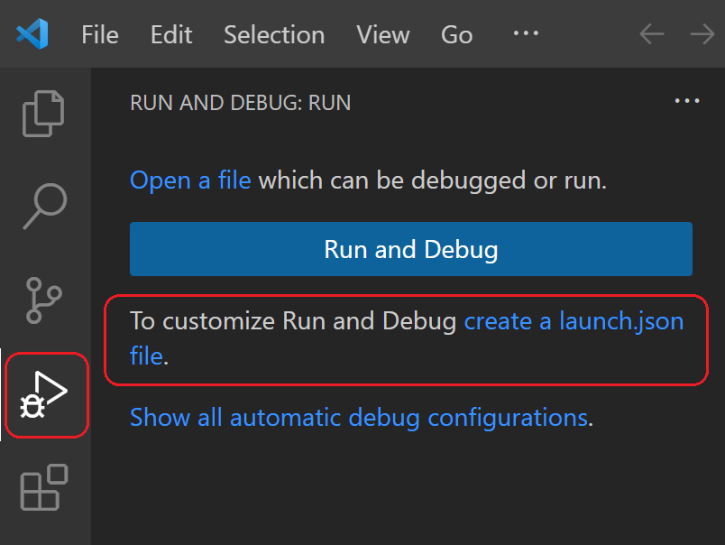

+++
title = "Flask Tutorial"
date = 2024-01-12T22:36:24+08:00
weight = 100
type = "docs"
description = ""
isCJKLanguage = true
draft = false
+++

> 原文: [https://code.visualstudio.com/docs/python/tutorial-flask](https://code.visualstudio.com/docs/python/tutorial-flask)

# Flask Tutorial in Visual Studio Code Visual Studio Code 中的 Flask 教程


Flask is a lightweight Python framework for web applications that provides the basics for URL routing and page rendering.

​​​	Flask 是一个轻量级的 Python 框架，用于提供 URL 路由和页面渲染的基本功能的 Web 应用程序。

Flask is called a "micro" framework because it doesn't directly provide features like form validation, database abstraction, authentication, and so on. Such features are instead provided by special Python packages called Flask extensions. The extensions integrate seamlessly with Flask so that they appear as if they were part of Flask itself. For example, Flask doesn't provide a page template engine, but installing Flask includes the Jinja templating engine by default. For convenience, we typically speak of these defaults as part of Flask.

​​​	Flask 被称为“微”框架，因为它不直接提供表单验证、数据库抽象、身份验证等功能。这些功能由称为 Flask 扩展的特殊 Python 包提供。这些扩展与 Flask 无缝集成，因此它们看起来像是 Flask 本身的一部分。例如，Flask 不提供页面模板引擎，但默认情况下安装 Flask 会包含 Jinja 模板引擎。为了方便起见，我们通常将这些默认值视为 Flask 的一部分。

In this Flask tutorial, you create a simple Flask app with three pages that use a common base template. Along the way, you experience a number of features of Visual Studio Code including using the terminal, the editor, the debugger, code snippets, and more.

​​​	在本 Flask 教程中，您将创建一个简单的 Flask 应用程序，其中包含使用通用基本模板的三个页面。在此过程中，您将体验 Visual Studio Code 的许多功能，包括使用终端、编辑器、调试器、代码片段等。

The completed code project for this Flask tutorial can be found on GitHub: [python-sample-vscode-flask-tutorial](https://github.com/microsoft/python-sample-vscode-flask-tutorial).

​​​	本 Flask 教程的完整代码项目可在 GitHub 上找到：python-sample-vscode-flask-tutorial。

If you have any problems, you can search for answers or ask a question on the [Python extension Discussions Q&A](https://github.com/microsoft/vscode-python/discussions/categories/q-a).

​​​	如果您遇到任何问题，可以在 Python 扩展讨论问答中搜索答案或提问。

## [Prerequisites 先决条件](https://code.visualstudio.com/docs/python/tutorial-flask#_prerequisites)

To successfully complete this Flask tutorial, you must do the following (which are the same steps as in the [general Python tutorial](https://code.visualstudio.com/docs/python/python-tutorial)):

​​​	要成功完成本 Flask 教程，您必须执行以下操作（与常规 Python 教程中的步骤相同）：

1. Install the [Python extension](https://marketplace.visualstudio.com/items?itemName=ms-python.python).

   ​​​	安装 Python 扩展。

2. Install a version of Python 3 (for which this tutorial is written). Options include:

   ​​​	安装 Python 3 版本（本教程为此版本编写）。选项包括：

   - (All operating systems) A download from [python.org](https://www.python.org/downloads/); typically use the **Download** button that appears first on the page.
     （所有操作系统）从 python.org 下载；通常使用页面上首先出现的“下载”按钮。
   - (Linux) The built-in Python 3 installation works well, but to install other Python packages you must run `sudo apt install python3-pip` in the terminal.
     （Linux）内置的 Python 3 安装效果很好，但要安装其他 Python 包，您必须在终端中运行 `sudo apt install python3-pip` 。
   - (macOS) An installation through [Homebrew](https://brew.sh/) on macOS using `brew install python3`.
     （macOS）在 macOS 上通过 Homebrew 安装，使用 `brew install python3` 。
   - (All operating systems) A download from [Anaconda](https://www.anaconda.com/download/) (for data science purposes).
     （所有操作系统）从 Anaconda 下载（用于数据科学目的）。

3. On Windows, make sure the location of your Python interpreter is included in your PATH environment variable. You can check the location by running `path` at the command prompt. If the Python interpreter's folder isn't included, open Windows Settings, search for "environment", select **Edit environment variables for your account**, then edit the **Path** variable to include that folder.

   ​​​	在 Windows 上，确保您的 Python 解释器的位置包含在您的 PATH 环境变量中。您可以通过在命令提示符下运行 `path` 来检查位置。如果 Python 解释器的文件夹未包含在内，请打开 Windows 设置，搜索“环境”，选择为您的帐户编辑环境变量，然后编辑 Path 变量以包含该文件夹。

## [Create a project environment for the Flask tutorial 为 Flask 教程创建一个项目环境](https://code.visualstudio.com/docs/python/tutorial-flask#_create-a-project-environment-for-the-flask-tutorial)

In this section, you will create a virtual environment in which Flask is installed. Using a virtual environment avoids installing Flask into a global Python environment and gives you exact control over the libraries used in an application.

​​​	在本节中，您将创建一个已安装 Flask 的虚拟环境。使用虚拟环境可避免将 Flask 安装到全局 Python 环境中，并让您可以精确控制应用程序中使用的库。

1. On your file system, create a folder for this tutorial, such as `hello_flask`.

   ​​​	在您的文件系统上，为本教程创建一个文件夹，例如 `hello_flask` 。

2. Open this folder in VS Code by navigating to the folder in a terminal and running `code .`, or by running VS Code and using the **File** > **Open Folder** command.

   ​​​	通过在终端中导航到该文件夹并运行 `code .` ，或通过运行 VS Code 并使用“文件”>“打开文件夹”命令，在此文件夹中打开 VS Code。

3. In VS Code, open the Command Palette (**View** > **Command Palette** or (Ctrl+Shift+P)). Then select the **Python: Create Environment** command to create a virtual environment in your workspace. Select `venv` and then the Python environment you want to use to create it.

   ​​​	在 VS Code 中，打开命令面板（“视图”>“命令面板”或 (Ctrl+Shift+P)）。然后选择“Python: 创建环境”命令，以在您的工作区中创建一个虚拟环境。选择 `venv` ，然后选择您想要用于创建它的 Python 环境。

   > **Note**: If you want to create an environment manually, or run into error in the environment creation process, visit the [Environments](https://code.visualstudio.com/docs/python/environments#_create-a-virtual-environment-in-the-terminal) page.
   >
   > ​​​	注意：如果您想手动创建一个环境，或在环境创建过程中遇到错误，请访问“环境”页面。

   

4. After your virtual environment creation has been completed, run [**Terminal: Create New Terminal**](https://code.visualstudio.com/docs/terminal/basics) (Ctrl+Shift+`)) from the Command Palette, which creates a terminal and automatically activates the virtual environment by running its activation script.

   ​​​	虚拟环境创建完成后，从命令面板中运行终端：创建新终端（Ctrl+Shift+`），这将创建一个终端并通过运行其激活脚本自动激活虚拟环境。

   > **Note**: On Windows, if your default terminal type is PowerShell, you may see an error that it cannot run activate.ps1 because running scripts is disabled on the system. The error provides a link for information on how to allow scripts. Otherwise, use **Terminal: Select Default Profile** to set "Command Prompt" or "Git Bash" as your default instead.
   >
   > ​​​	注意：在 Windows 上，如果您的默认终端类型是 PowerShell，您可能会看到一条错误消息，指出它无法运行 activate.ps1，因为系统禁用了运行脚本。该错误提供了一个链接，其中包含有关如何允许脚本的信息。否则，请使用终端：选择默认配置文件，将“命令提示符”或“Git Bash”设置为您的默认值。

5. Install Flask in the virtual environment by running the following command in the VS Code Terminal:

   ​​​	通过在 VS Code 终端中运行以下命令，在虚拟环境中安装 Flask：

   ```
   python -m pip install flask
   ```

You now have a self-contained environment ready for writing Flask code. VS Code activates the environment automatically when you use **Terminal: Create New Terminal**. If you open a separate command prompt or terminal, activate the environment by running `source .venv/bin/activate` (Linux/macOS) or `.venv\Scripts\Activate.ps1` (Windows). You know the environment is activated when the command prompt shows **(.venv)** at the beginning.

​​​	您现在拥有一个可用于编写 Flask 代码的独立环境。当您使用终端：创建新终端时，VS Code 会自动激活环境。如果您打开单独的命令提示符或终端，请通过运行 `source .venv/bin/activate` （Linux/macOS）或 `.venv\Scripts\Activate.ps1` （Windows）来激活环境。当命令提示符开头显示 (.venv) 时，说明环境已激活。

## [Create and run a minimal Flask app 创建并运行一个最小的 Flask 应用程序](https://code.visualstudio.com/docs/python/tutorial-flask#_create-and-run-a-minimal-flask-app)

1. In VS Code, create a new file in your project folder named `app.py` using either **File** > **New** from the menu, pressing Ctrl+N, or using the new file icon in the Explorer View (shown below).

   ​​​	在 VS Code 中，使用文件 > 从菜单新建，按 Ctrl+N，或使用资源管理器视图中的新建文件图标，在项目文件夹中创建一个名为 `app.py` 的新文件（如下所示）。

   

2. In `app.py`, add code to import Flask and create an instance of the Flask object. If you type the code below (instead of using copy-paste), you can observe VS Code's [IntelliSense and auto-completions](https://code.visualstudio.com/docs/python/editing#_autocomplete-and-intellisense):

   ​​​	在 `app.py` 中，添加代码以导入 Flask 并创建一个 Flask 对象的实例。如果您键入以下代码（而不是使用复制粘贴），您可以观察 VS Code 的 IntelliSense 和自动完成功能：

   ```
   from flask import Flask
   app = Flask(__name__)
   ```

3. Also in `app.py`, add a function that returns content, in this case a simple string, and use Flask's `app.route` decorator to map the URL route `/` to that function:

   ​​​	另外在 `app.py` 中，添加一个返回内容（在本例中为一个简单的字符串）的函数，并使用 Flask 的 `app.route` 装饰器将 URL 路由 `/` 映射到该函数：

   ```
   @app.route("/")
   def home():
       return "Hello, Flask!"
   ```

   > **Tip**: You can use multiple decorators on the same function, one per line, depending on how many different routes you want to map to the same function.
   >
   > ​​​	提示：您可以对同一个函数使用多个装饰器，每行一个，具体取决于您希望将多少个不同的路由映射到同一个函数。

4. Save the `app.py` file (Ctrl+S).

   ​​​	保存 `app.py` 文件（Ctrl+S）。

5. In the Integrated Terminal, run the app by entering `python -m flask run`, which runs the Flask development server. The development server looks for `app.py` by default. When you run Flask, you should see output similar to the following:

   ​​​	在集成终端中，通过输入 `python -m flask run` 来运行该应用，这会运行 Flask 开发服务器。开发服务器默认情况下会查找 `app.py` 。当您运行 Flask 时，您应该会看到类似于以下内容的输出：

   ```
   (.venv) D:\py\\hello_flask>python -m flask run
    * Environment: production
      WARNING: Do not use the development server in a production environment.
      Use a production WSGI server instead.
    * Debug mode: off
    * Running on http://127.0.0.1:5000/ (Press CTRL+C to quit)
   ```

   If you see an error that the Flask module cannot be found, make sure you've run `python -m pip install flask` in your virtual environment as described at the end of the previous section.

   ​​​	如果您看到一个错误，即找不到 Flask 模块，请确保您已在虚拟环境中运行 `python -m pip install flask` ，如上一节末尾所述。

   Also, if you want to run the development server on a different IP address or port, use the host and port command-line arguments, as with `--host=0.0.0.0 --port=80`.

   ​​​	此外，如果您想在不同的 IP 地址或端口上运行开发服务器，请使用主机和端口命令行参数，如 `--host=0.0.0.0 --port=80` 所示。

6. To open your default browser to the rendered page, Ctrl+click the `http://127.0.0.1:5000/` URL in the terminal.

   ​​​	要将您的默认浏览器打开到呈现的页面，请在终端中按住 Ctrl 键并单击 `http://127.0.0.1:5000/` URL。

   

7. Observe that when you visit a URL like /, a message appears in the debug terminal showing the HTTP request:

   ​​​	请注意，当您访问像 / 这样的 URL 时，调试终端中会显示一条消息，显示 HTTP 请求：

   ```
   127.0.0.1 - - [11/Jul/2018 08:40:15] "GET / HTTP/1.1" 200 -
   ```

8. Stop the app by using Ctrl+C in the terminal.

   ​​​	通过在终端中使用 Ctrl+C 来停止该应用。

> **Tip**: When using a different filename than `app.py`, such as `webapp.py`, you will need to define an environment variable named FLASK_APP and set its value to your chosen file. Flask's development server then uses the value of FLASK_APP instead of the default file `app.py`. For more information, see [Flask command line interface](https://flask.palletsprojects.com/en/1.1.x/cli/).
>
> ​​​	提示：当使用与 `app.py` 不同的文件名时，例如 `webapp.py` ，您需要定义一个名为 FLASK_APP 的环境变量，并将其值设置为您选择的文件。然后，Flask 的开发服务器将使用 FLASK_APP 的值，而不是默认文件 `app.py` 。有关更多信息，请参阅 Flask 命令行界面。

## [Run the app in the debugger 在调试器中运行应用程序](https://code.visualstudio.com/docs/python/tutorial-flask#_run-the-app-in-the-debugger)

Debugging gives you the opportunity to pause a running program on a particular line of code. When a program is paused, you can examine variables, run code in the Debug Console panel, and otherwise take advantage of the features described on [Debugging](https://code.visualstudio.com/docs/python/debugging). Running the debugger also automatically saves any modified files before the debugging session begins.

​​​	调试使您有机会在特定代码行上暂停正在运行的程序。当程序暂停时，您可以检查变量、在“调试控制台”面板中运行代码，还可以利用“调试”中描述的功能。运行调试器还会在调试会话开始前自动保存所有已修改的文件。

**Before you begin**: Make sure you've stopped the running app at the end of the last section by using Ctrl+C in the terminal. If you leave the app running in one terminal, it continues to own the port. As a result, when you run the app in the debugger using the same port, the original running app handles all the requests and you won't see any activity in the app being debugged and the program won't stop at breakpoints. In other words, if the debugger doesn't seem to be working, make sure that no other instance of the app is still running.

​​​	开始之前：确保您已在上一节的末尾使用 Ctrl+C 在终端中停止正在运行的应用。如果您让应用在一个终端中运行，它会继续拥有该端口。因此，当您使用相同的端口在调试器中运行应用时，原始运行的应用会处理所有请求，您不会在正在调试的应用中看到任何活动，并且程序不会在断点处停止。换句话说，如果调试器似乎不起作用，请确保没有其他应用实例仍在运行。

1. Replace the contents of `app.py` with the following code, which adds a second route and function that you can step through in the debugger:

   ​​​	将 `app.py` 的内容替换为以下代码，其中添加了第二个路由和函数，您可以在调试器中逐步执行这些代码：

   ```
   import re
   from datetime import datetime
   
   from flask import Flask
   
   app = Flask(__name__)
   
   
   @app.route("/")
   def home():
       return "Hello, Flask!"
   
   
   @app.route("/hello/<name>")
   def hello_there(name):
       now = datetime.now()
       formatted_now = now.strftime("%A, %d %B, %Y at %X")
   
       # Filter the name argument to letters only using regular expressions. URL arguments
       # can contain arbitrary text, so we restrict to safe characters only.
       match_object = re.match("[a-zA-Z]+", name)
   
       if match_object:
           clean_name = match_object.group(0)
       else:
           clean_name = "Friend"
   
       content = "Hello there, " + clean_name + "! It's " + formatted_now
       return content
   ```

   The decorator used for the new URL route, `/hello/<name>`, defines an endpoint /hello/ that can accept any additional value. The identifier inside `<` and `>` in the route defines a variable that is passed to the function and can be used in your code.

   ​​​	用于新 URL 路由的装饰器 `/hello/<name>` 定义了一个端点 /hello/，该端点可以接受任何其他值。路由中的 `<` 和 `>` 内部的标识符定义了一个传递给函数的变量，可以在您的代码中使用。

   URL routes are case-sensitive. For example, the route `/hello/<name>` is distinct from `/Hello/<name>`. If you want the same function to handle both, use decorators for each variant.

   ​​​	URL 路由区分大小写。例如，路由 `/hello/<name>` 与 `/Hello/<name>` 不同。如果您希望同一个函数处理这两个路由，请为每个变体使用装饰器。

   As described in the code comments, always filter arbitrary user-provided information to avoid various attacks on your app. In this case, the code filters the name argument to contain only letters, which avoids injection of control characters, HTML, and so forth. (When you use templates in the next section, Flask does automatic filtering and you won't need this code.)

   ​​​	如代码注释中所述，始终过滤任意用户提供的信息，以避免对您的应用进行各种攻击。在这种情况下，代码会过滤 name 参数，使其仅包含字母，从而避免注入控制字符、HTML 等。（在下一部分中使用模板时，Flask 会自动过滤，您将不需要此代码。）

2. Set a breakpoint at the first line of code in the `hello_there` function (`now = datetime.now()`) by doing any one of the following:

   ​​​	通过执行以下任一操作，在 `hello_there` 函数（ `now = datetime.now()` ）的代码第一行处设置断点：

   - With the cursor on that line, press F9, or,
     将光标置于该行，按 F9，或
   - With the cursor on that line, select the **Run** > **Toggle Breakpoint** menu command, or,
     将光标置于该行，选择“运行”>“切换断点”菜单命令，或
   - Click directly in the margin to the left of the line number (a faded red dot appears when hovering there).
     直接单击行号左侧的边距（将鼠标悬停在那里时，会出现一个褪色的红点）。

   The breakpoint appears as a red dot in the left margin:

   ​​​	断点显示为左侧边距中的红点：

   

3. Switch to the **Run and Debug** view in VS Code (using the left-side activity bar or Ctrl+Shift+D). You may see the message "To customize Run and Debug create a launch.json file". This means that you don't yet have a `launch.json` file containing debug configurations. VS Code can create that for you if you click on the **create a launch.json file** link:

   ​​​	在 VS Code 中切换到“运行和调试”视图（使用左侧活动栏或 Ctrl+Shift+D）。您可能会看到消息“要自定义运行和调试，请创建一个 launch.json 文件”。这意味着您还没有包含调试配置的 `launch.json` 文件。如果您单击创建 launch.json 文件链接，VS Code 可以为您创建该文件：

   

4. Select the link and VS Code will prompt for a debug configuration. Select **Flask** from the dropdown and VS Code will populate a new `launch.json` file with a Flask run configuration. The `launch.json` file contains a number of debugging configurations, each of which is a separate JSON object within the `configuration` array.

   ​​​	选择该链接，VS Code 将提示输入调试配置。从下拉列表中选择 Flask，VS Code 将使用 Flask 运行配置填充一个新的 `launch.json` 文件。 `launch.json` 文件包含许多调试配置，每个配置都是 `configuration` 数组中的一个单独的 JSON 对象。

5. Scroll down to and examine the configuration, which is named "Python: Flask". This configuration contains `"module": "flask",`, which tells VS Code to run Python with `-m flask` when it starts the debugger. It also defines the FLASK_APP environment variable in the `env` property to identify the startup file, which is `app.py` by default, but allows you to easily specify a different file. If you want to change the host and/or port, you can use the `args` array.

   ​​​	向下滚动并检查名为“Python: Flask”的配置。此配置包含 `"module": "flask",` ，它告诉 VS Code 在启动调试器时使用 `-m flask` 运行 Python。它还在 `env` 属性中定义了 FLASK_APP 环境变量，以标识启动文件，默认情况下为 `app.py` ，但允许您轻松指定不同的文件。如果您想更改主机和/或端口，可以使用 `args` 数组。

   ```
   {
       "name": "Python: Flask",
       "type": "python",
       "request": "launch",
       "module": "flask",
       "env": {
           "FLASK_APP": "app.py",
           "FLASK_DEBUG": "1"
       },
       "args": [
           "run",
           "--no-debugger",
           "--no-reload"
       ],
       "jinja": true,
       "justMyCode": true
   },
   ```

   > **Note**: If the `env` entry in your configuration contains `"FLASK_APP": "${workspaceFolder}/app.py"`, change it to `"FLASK_APP": "app.py"` as shown above. Otherwise you may encounter error messages like "Cannot import module C" where C is the drive letter where your project folder resides.
   >
   > ​​​	注意：如果配置中的 `env` 条目包含 `"FLASK_APP": "${workspaceFolder}/app.py"` ，请将其更改为如上所示的 `"FLASK_APP": "app.py"` 。否则，您可能会遇到错误消息，例如“无法导入模块 C”，其中 C 是您的项目文件夹所在的驱动器盘符。

   > **Note**: Once `launch.json` is created, an **Add Configuration** button appears in the editor. That button displays a list of additional configurations to add to the beginning of the configuration list. (The **Run** > **Add Configuration** menu command does the same action.).
   >
   > ​​​	注意：创建 `launch.json` 后，编辑器中会显示“添加配置”按钮。该按钮显示要添加到配置列表开头的其他配置的列表。（“运行”>“添加配置”菜单命令执行相同操作。）

6. Save `launch.json` (Ctrl+S). In the debug configuration dropdown list select the **Python: Flask** configuration.

   ​​​	保存 `launch.json` （Ctrl+S）。在调试配置下拉列表中选择 Python: Flask 配置。

   

7. Start the debugger by selecting the **Run** > **Start Debugging** menu command, or selecting the green **Start Debugging** arrow next to the list (F5):

   ​​​	通过选择“运行”>“开始调试”菜单命令或选择列表旁边的绿色“开始调试”箭头（F5）来启动调试器：

   

   Observe that the status bar changes color to indicate debugging:

   ​​​	观察到状态栏的颜色发生变化，以指示正在调试：

   

   A debugging toolbar (shown below) also appears in VS Code containing commands in the following order: Pause (or Continue, F5), Step Over (F10), Step Into (F11), Step Out (Shift+F11), Restart (Ctrl+Shift+F5), and Stop (Shift+F5). See [VS Code debugging](https://code.visualstudio.com/docs/editor/debugging) for a description of each command.

   ​​​	VS Code 中还会显示一个调试工具栏（如下所示），其中按以下顺序排列着命令：暂停（或继续，F5）、单步执行（F10）、单步进入（F11）、单步退出（Shift+F11）、重新启动（Ctrl+Shift+F5）和停止（Shift+F5）。有关每个命令的说明，请参阅 VS Code 调试。

   

8. Output appears in a "Python Debug Console" terminal. Ctrl+click the `http://127.0.0.1:5000/` link in that terminal to open a browser to that URL. In the browser's address bar, navigate to `http://127.0.0.1:5000/hello/VSCode`. Before the page renders, VS Code pauses the program at the breakpoint you set. The small yellow arrow on the breakpoint indicates that it's the next line of code to run.

   ​​​	输出显示在“Python 调试控制台”终端中。Ctrl+单击该终端中的 `http://127.0.0.1:5000/` 链接以在浏览器中打开该 URL。在浏览器的地址栏中，导航到 `http://127.0.0.1:5000/hello/VSCode` 。在页面呈现之前，VS Code 在您设置的断点处暂停程序。断点上的小黄色箭头表示它是下一行要运行的代码。

   

9. Use Step Over to run the `now = datetime.now()` statement.

   ​​​	使用单步执行来运行 `now = datetime.now()` 语句。

10. On the left side of the VS Code window, you see a **Variables** pane that shows local variables, such as `now`, as well as arguments, such as `name`. Below that are panes for **Watch**, **Call Stack**, and **Breakpoints** (see [VS Code debugging](https://code.visualstudio.com/docs/editor/debugging) for details). In the **Locals** section, try expanding different values. You can also double-click values (or use F2) to modify them. Changing variables such as `now`, however, can break the program. Developers typically make changes only to correct values when the code didn't produce the right value to begin with.

    ​​​	在 VS Code 窗口的左侧，您会看到一个变量窗格，其中显示了局部变量（例如 `now` ）以及参数（例如 `name` ）。其下方是监视、调用堆栈和断点窗格（有关详细信息，请参阅 VS Code 调试）。在“局部变量”部分，尝试展开不同的值。您还可以双击值（或使用 F2）来修改它们。但是，更改变量（例如 `now` ）可能会中断程序。通常，开发人员仅在代码一开始未生成正确的值时才进行更改以更正值。

    

11. When a program is paused, the **Debug Console** panel (which is different from the "Python Debug Console" in the Terminal panel) lets you experiment with expressions and try out bits of code using the current state of the program. For example, once you've stepped over the line `now = datetime.now()`, you might experiment with different date/time formats. In the editor, select the code that reads `now.strftime("%A, %d %B, %Y at %X")`, then right-click and select **Evaluate in Debug Console** to send that code to the debug console, where it runs:

    ​​​	当程序暂停时，调试控制台面板（不同于终端面板中的“Python 调试控制台”）允许您使用程序的当前状态试验表达式并尝试代码片段。例如，一旦您跨过行 `now = datetime.now()` ，您可能会尝试不同的日期/时间格式。在编辑器中，选择读取 `now.strftime("%A, %d %B, %Y at %X")` 的代码，然后右键单击并选择在调试控制台中求值以将该代码发送到调试控制台，它将在其中运行：

    ```
    now.strftime("%A, %d %B, %Y at %X")
    'Wednesday, 31 October, 2018 at 18:13:39'
    ```

    > **Tip**: The **Debug Console** also shows exceptions from within the app that may not appear in the terminal. For example, if you see a "Paused on exception" message in the **Call Stack** area of **Run and Debug** view, switch to the **Debug Console** to see the exception message.
    >
    > ​​​	提示：调试控制台还会显示应用程序中可能不会出现在终端中的异常。例如，如果您在运行和调试视图的调用堆栈区域中看到“暂停异常”消息，请切换到调试控制台以查看异常消息。

12. Copy that line into the > prompt at the bottom of the debug console, and try changing the formatting:

    ​​​	将该行复制到调试控制台底部的 > 提示符中，然后尝试更改格式：

    ```
    now.strftime("%a, %d %B, %Y at %X")
    'Wed, 31 October, 2018 at 18:13:39'
    now.strftime("%a, %d %b, %Y at %X")
    'Wed, 31 Oct, 2018 at 18:13:39'
    now.strftime("%a, %d %b, %y at %X")
    'Wed, 31 Oct, 18 at 18:13:39'
    ```

13. Step through a few more lines of code, if you'd like, then select Continue (F5) to let the program run. The browser window shows the result:

    ​​​	如果您愿意，可以逐步执行更多代码行，然后选择继续（F5）以让程序运行。浏览器窗口显示结果：

    

14. Change the line in the code to use different datetime format, for example `now.strftime("%a, %d %b, %y at %X")`, and then save the file. The Flask server will automatically reload, which means the changes will be applied without the need to restart the debugger. Refresh the page on the browser to see the update.

    ​​​	更改代码中的行以使用不同的日期时间格式，例如 `now.strftime("%a, %d %b, %y at %X")` ，然后保存文件。Flask 服务器将自动重新加载，这意味着无需重新启动调试器即可应用更改。刷新浏览器上的页面以查看更新。

15. Close the browser and stop the debugger when you're finished. To stop the debugger, use the Stop toolbar button (the red square) or the **Run** > **Stop Debugging** command (Shift+F5).

    ​​​	完成后，关闭浏览器并停止调试器。要停止调试器，请使用“停止”工具栏按钮（红色方块）或“运行”>“停止调试”命令（Shift+F5）。

> **Tip**: To make it easier to repeatedly navigate to a specific URL like `http://127.0.0.1:5000/hello/VSCode`, output that URL using a `print` statement. The URL appears in the terminal where you can use Ctrl+click to open it in a browser.
>
> ​​​	提示：为了更轻松地重复导航到特定 URL，例如 `http://127.0.0.1:5000/hello/VSCode` ，请使用 `print` 语句输出该 URL。URL 会显示在终端中，您可以在其中使用 Ctrl+单击在浏览器中将其打开。

## [Go to Definition and Peek Definition commands 转到定义和预览定义命令](https://code.visualstudio.com/docs/python/tutorial-flask#_go-to-definition-and-peek-definition-commands)

During your work with Flask or any other library, you may want to examine the code in those libraries themselves. VS Code provides two convenient commands that navigate directly to the definitions of classes and other objects in any code:

​​​	在使用 Flask 或任何其他库时，您可能需要检查这些库中的代码本身。VS Code 提供了两个方便的命令，可直接导航到任何代码中类和其他对象定义：

- **Go to Definition** jumps from your code into the code that defines an object. For example, in `app.py`, right-click on the `Flask` class (in the line `app = Flask(__name__)`) and select **Go to Definition** (or use F12), which navigates to the class definition in the Flask library.

  ​​​	转到定义从您的代码跳转到定义对象的代码。例如，在 `app.py` 中，右键单击 `Flask` 类（在行 `app = Flask(__name__)` 中），然后选择转到定义（或使用 F12），这会导航到 Flask 库中的类定义。

- **Peek Definition** (Alt+F12, also on the right-click context menu), is similar, but displays the class definition directly in the editor (making space in the editor window to avoid obscuring any code). Press Escape to close the Peek window or use the **x** in the upper right corner.

  ​​​	窥视定义（Alt+F12，也在右键单击上下文菜单中）类似，但直接在编辑器中显示类定义（在编辑器窗口中腾出空间以避免遮挡任何代码）。按 Escape 关闭窥视窗口或使用右上角的 x。

  

## [Use a template to render a page 使用模板呈现页面](https://code.visualstudio.com/docs/python/tutorial-flask#_use-a-template-to-render-a-page)

The app you've created so far in this tutorial generates only plain text web pages from Python code. Although it's possible to generate HTML directly in code, developers avoid such a practice because it opens the app to [cross-site scripting (XSS) attacks](https://flask.palletsprojects.com/security/#cross-site-scripting-xss). In the `hello_there` function of this tutorial, for example, one might think to format the output in code with something like `content = "<h1>Hello there, " + clean_name + "!</h1>"`, where the result in `content` is given directly to a browser. This opening allows an attacker to place malicious HTML, including JavaScript code, in the URL that ends up in `clean_name` and thus ends up being run in the browser.

​​​	您在此教程中迄今为止创建的应用程序仅从 Python 代码生成纯文本网页。尽管可以直接在代码中生成 HTML，但开发人员避免这样做，因为这会使应用程序面临跨站点脚本 (XSS) 攻击。例如，在此教程的 `hello_there` 函数中，人们可能会想到使用类似 `content = "<h1>Hello there, " + clean_name + "!</h1>"` 的代码格式化输出，其中 `content` 中的结果直接提供给浏览器。这种开放允许攻击者将恶意 HTML（包括 JavaScript 代码）放入最终进入 `clean_name` 的 URL 中，从而最终在浏览器中运行。

A much better practice is to keep HTML out of your code entirely by using **templates**, so that your code is concerned only with data values and not with rendering.

​​​	一个更好的做法是通过使用模板将 HTML 完全排除在代码之外，以便代码只关注数据值，而不关注渲染。

- A template is an HTML file that contains placeholders for values that the code provides at run time. The templating engine takes care of making the substitutions when rendering the page. The code, therefore, concerns itself only with data values and the template concerns itself only with markup.
  模板是一个 HTML 文件，其中包含代码在运行时提供的值的占位符。模板引擎负责在呈现页面时进行替换。因此，代码只关注数据值，而模板只关注标记。
- The default templating engine for Flask is [Jinja](https://jinja.palletsprojects.com/), which is installed automatically when you install Flask. This engine provides flexible options including automatic escaping (to prevent XSS attacks) and template inheritance. With inheritance, you can define a base page with common markup and then build upon that base with page-specific additions.
  Flask 的默认模板引擎是 Jinja，在安装 Flask 时会自动安装。此引擎提供灵活的选项，包括自动转义（防止 XSS 攻击）和模板继承。通过继承，您可以定义一个带有通用标记的基本页面，然后在此基础上构建具有特定页面新增内容的页面。

In this section, you create a single page using a template. In the sections that follow, you configure the app to serve static files, and then create multiple pages to the app that each contains a nav bar from a base template.

​​​	在本节中，您将使用模板创建一个单独的页面。在随后的部分中，您将配置应用以提供静态文件，然后为应用创建多个页面，每个页面都包含来自基本模板的导航栏。

1. Inside the `hello_flask` folder, create a folder named `templates`, which is where Flask looks for templates by default.

   ​​​	在 `hello_flask` 文件夹中，创建一个名为 `templates` 的文件夹，这是 Flask 默认查找模板的位置。

2. In the `templates` folder, create a file named `hello_there.html` with the contents below. This template contains two placeholders named "name" and "date", which are delineated by pairs of curly braces, `{{` and `}}`. As you can see, you can also include formatting code in the template directly:

   ​​​	在 `templates` 文件夹中，创建一个名为 `hello_there.html` 的文件，内容如下。此模板包含两个名为“name”和“date”的占位符，它们由一对花括号 `{{` 和 `}}` 划定。如您所见，您还可以在模板中直接包含格式化代码：

   ```
   <!DOCTYPE html>
   <html>
       <head>
           <meta charset="utf-8" />
           <title>Hello, Flask</title>
       </head>
       <body>
           
               <strong>Hello there, {{ name }}!</strong> It's {{ date.strftime("%A, %d %B, %Y at %X") }}.
           
               What's your name? Provide it after /hello/ in the URL.
           
       </body>
   </html>
   ```

   > **Tip**: Flask developers often use the [flask-babel](https://pythonhosted.org/Flask-Babel/) extension for date formatting, rather than `strftime`, as flask-babel takes locales and timezones into consideration.
   >
   > ​​​	提示：Flask 开发人员通常使用 flask-babel 扩展名进行日期格式化，而不是 `strftime` ，因为 flask-babel 会考虑语言环境和时区。

3. In `app.py`, import Flask's `render_template` function near the top of the file:

   ​​​	在 `app.py` 中，在文件顶部附近导入 Flask 的 `render_template` 函数：

   ```
   from flask import render_template
   ```

4. Also in `app.py`, modify the `hello_there` function to use `render_template` to load a template and apply the named values (and add a route to recognize the case without a name). `render_template` assumes that the first argument is relative to the `templates` folder. Typically, developers name the templates the same as the functions that use them, but matching names are not required because you always refer to the exact filename in your code.

   ​​​	同样在 `app.py` 中，修改 `hello_there` 函数以使用 `render_template` 加载模板并应用命名值（并添加一个路由来识别没有名称的情况）。 `render_template` 假设第一个参数相对于 `templates` 文件夹。通常，开发人员将模板命名为使用它们的函数的名称，但由于您始终在代码中引用确切的文件名，因此不需要匹配的名称。

   ```
   @app.route("/hello/")
   @app.route("/hello/<name>")
   def hello_there(name = None):
       return render_template(
           "hello_there.html",
           name=name,
           date=datetime.now()
       )
   ```

   You can see that the code is now much simpler, and concerned only with data values, because the markup and formatting is all contained in the template.

   ​​​	您会看到代码现在简单多了，并且只关注数据值，因为标记和格式都包含在模板中。

5. Start the program (inside or outside of the debugger, using Ctrl+F5), navigate to a /hello/name URL, and observe the results.

   ​​​	启动程序（在调试器内部或外部，使用 Ctrl+F5），导航到 /hello/name URL，并观察结果。

6. Also try navigating to a /hello/name URL using a name like `<a%20value%20that%20could%20be%20HTML>` to see Flask's automatic escaping at work. The "name" value shows up as plain text in the browser rather than as rendering an actual element.

   ​​​	还可以尝试使用 `<a%20value%20that%20could%20be%20HTML>` 之类的名称导航到 /hello/name URL，以查看 Flask 的自动转义功能。在浏览器中，“name”值显示为纯文本，而不是呈现实际元素。

## [Serve static files 提供静态文件](https://code.visualstudio.com/docs/python/tutorial-flask#_serve-static-files)

Static files are of two types. First are those files like stylesheets to which a page template can just refer directly. Such files can live in any folder in the app, but are commonly placed within a `static` folder.

​​​	静态文件有两种类型。首先是那些页面模板可以直接引用的文件，例如样式表。此类文件可以位于应用程序中的任何文件夹中，但通常放置在 `static` 文件夹中。

The second type are those that you want to address in code, such as when you want to implement an API endpoint that returns a static file. For this purpose, the Flask object contains a built-in method, `send_static_file`, which generates a response with a static file contained within the app's `static` folder.

​​​	第二种类型是您希望在代码中处理的文件，例如当您想要实现返回静态文件的 API 端点时。为此，Flask 对象包含一个内置方法 `send_static_file` ，它会生成一个包含在应用的 `static` 文件夹中的静态文件的响应。

The following sections demonstrate both types of static files.

​​​	以下部分演示了两种类型的静态文件。

### [Refer to static files in a template 在模板中引用静态文件](https://code.visualstudio.com/docs/python/tutorial-flask#_refer-to-static-files-in-a-template)

1. In the `hello_flask` folder, create a folder named `static`.

   ​​​	在 `hello_flask` 文件夹中，创建一个名为 `static` 的文件夹。

2. Within the `static` folder, create a file named `site.css` with the following contents. After entering this code, also observe the syntax highlighting that VS Code provides for CSS files, including a color preview:

   ​​​	在 `static` 文件夹中，创建一个名为 `site.css` 的文件，其中包含以下内容。输入此代码后，还可以观察 VS Code 为 CSS 文件提供的语法突出显示，包括颜色预览：

   ```
   .message {
       font-weight: 600;
       color: blue;
   }
   ```

3. In `templates/hello_there.html`, add the following line before the `</head>` tag, which creates a reference to the stylesheet.

   ​​​	在 `templates/hello_there.html` 中，在 `</head>` 标记之前添加以下行，这会创建一个对样式表的引用。

   ```
   <link rel="stylesheet" type="text/css" href="{{ url_for('static', filename='site.css')}}" />
   ```

   Flask's [url_for](https://flask.palletsprojects.com/api/#flask.url_for) tag that is used here, creates the appropriate path to the file. Because it can accept variables as arguments, `url_for` allows you to programmatically control the generated path, if desired.

   ​​​	此处使用的 Flask 的 url_for 标记会创建到该文件的适当路径。由于它可以接受变量作为参数，因此 `url_for` 允许您以编程方式控制生成的路径（如果需要）。

4. Also in `templates/hello_there.html`, replace the contents `<body>` element with the following markup that uses the `message` style instead of a `<strong>` tag (and also displays a message if you just use a hello/ URL without a name):

   ​​​	同样在 `templates/hello_there.html` 中，使用以下标记替换内容 `<body>` 元素，该标记使用 `message` 样式而不是 `<strong>` 标记（并且如果您仅使用不带名称的 hello/ URL，还会显示一条消息）：

   ```
   
       <span class="message">Hello there, {{ name }}!</span> It's {{ date.strftime("%A, %d %B, %Y at %X") }}.
   
       <span class="message">What's your name? Provide it after /hello/ in the URL.</span>
   
   ```

5. Run the app, navigate to a /hello/name URL, and observe that the message renders in blue. Stop the app when you're done.

   ​​​	运行应用，导航到 /hello/name URL，并观察消息以蓝色呈现。完成后停止应用。

### [Serve a static file from code 从代码提供静态文件](https://code.visualstudio.com/docs/python/tutorial-flask#_serve-a-static-file-from-code)

1. In the `static` folder, create a JSON data file named `data.json` with the following contents (which are meaningless sample data):

   ​​​	在 `static` 文件夹中，创建一个名为 `data.json` 的 JSON 数据文件，其中包含以下内容（这些内容是无意义的示例数据）：

   ```
   {
     "01": {
       "note": "This data is very simple because we're demonstrating only the mechanism."
     }
   }
   ```

2. In `app.py`, add a function with the route /api/data that returns the static data file using the `send_static_file` method:

   ​​​	在 `app.py` 中，添加一个带有路由 /api/data 的函数，该函数使用 `send_static_file` 方法返回静态数据文件：

   ```
   @app.route("/api/data")
   def get_data():
       return app.send_static_file("data.json")
   ```

3. Run the app and navigate to the /api/data endpoint to see that the static file is returned. Stop the app when you're done.

   ​​​	运行该应用并导航到 /api/data 端点，以查看是否已返回静态文件。完成后，停止该应用。

## [Create multiple templates that extend a base template 创建多个扩展基本模板的模板](https://code.visualstudio.com/docs/python/tutorial-flask#_create-multiple-templates-that-extend-a-base-template)

Because most web apps have more than one page, and because those pages typically share many common elements, developers separate those common elements into a base page template that other page templates can then extend (this is also called template inheritance.)

​​​	由于大多数网络应用有多个页面，并且这些页面通常共享许多通用元素，因此开发人员会将这些通用元素分离到一个基本页面模板中，然后其他页面模板可以扩展该基本页面模板（这也称为模板继承。）

Also, because you'll likely create many pages that extend the same template, it's helpful to create a code snippet in VS Code with which you can quickly initialize new page templates. A snippet helps you avoid tedious and error-prone copy-paste operations.

​​​	此外，由于您可能会创建许多扩展相同模板的页面，因此在 VS Code 中创建一个代码片段很有用，您可以使用该代码片段快速初始化新的页面模板。代码片段可帮助您避免繁琐且容易出错的复制粘贴操作。

The following sections walk through different parts of this process.

​​​	以下部分将介绍此过程的不同部分。

### [Create a base page template and styles 创建基本页面模板和样式](https://code.visualstudio.com/docs/python/tutorial-flask#_create-a-base-page-template-and-styles)

A base page template in Flask contains all the shared parts of a set of pages, including references to CSS files, script files, and so forth. Base templates also define one or more **block** tags that other templates that extend the base are expected to override. A block tag is delineated by `` and `` in both the base template and extended templates.

​​​	Flask 中的基本页面模板包含一组页面的所有共享部分，包括对 CSS 文件、脚本文件等的引用。基本模板还定义一个或多个块标记，预期扩展基本模板的其他模板会覆盖这些块标记。块标记在基本模板和扩展模板中均由 `` 和 `` 划定。

The following steps demonstrate creating a base template.

​​​	以下步骤演示如何创建基本模板。

1. In the `templates` folder, create a file named `layout.html` with the contents below, which contains blocks named "title" and "content". As you can see, the markup defines a simple nav bar structure with links to Home, About, and Contact pages, which you will create in a later section. Each link again uses Flask's `url_for` tag to generate a link at runtime for the matching route.

   ​​​	在 `templates` 文件夹中，创建一个名为 `layout.html` 的文件，其内容如下，其中包含名为“title”和“content”的块。如您所见，标记定义了一个简单的导航栏结构，其中包含指向主页、关于和联系页面（您将在后面的部分中创建这些页面）的链接。每个链接再次使用 Flask 的 `url_for` 标记在运行时为匹配的路由生成链接。

   ```
   <!DOCTYPE html>
   <html>
       <head>
           <meta charset="utf-8" />
           <title></title>
           <link rel="stylesheet" type="text/css" href="{{ url_for('static', filename='site.css')}}" />
       </head>
   
       <body>
           <div class="navbar">
               <a href="{{ url_for('home') }}" class="navbar-brand">Home</a>
               <a href="{{ url_for('about') }}" class="navbar-item">About</a>
               <a href="{{ url_for('contact') }}" class="navbar-item">Contact</a>
           </div>
   
           <div class="body-content">
               
               
               <hr/>
               <footer>
                   <p>&copy; 2018</p>
               </footer>
           </div>
       </body>
   </html>
   ```

2. Add the following styles to `static/site.css`, below the existing "message" style, and save the file. Note that this walkthrough doesn't attempt to demonstrate responsive design; these styles simply generate a reasonably interesting result.

   ​​​	将以下样式添加到 `static/site.css` 中，位于现有的“message”样式下方，然后保存文件。请注意，本演练不会尝试演示响应式设计；这些样式只是生成一个相当有趣的结果。

   ```
   .navbar {
       background-color: lightslategray;
       font-size: 1em;
       font-family: 'Trebuchet MS', 'Lucida Sans Unicode', 'Lucida Grande', 'Lucida Sans', Arial, sans-serif;
       color: white;
       padding: 8px 5px 8px 5px;
   }
   
   .navbar a {
       text-decoration: none;
       color: inherit;
   }
   
   .navbar-brand {
       font-size: 1.2em;
       font-weight: 600;
   }
   
   .navbar-item {
       font-variant: small-caps;
       margin-left: 30px;
   }
   
   .body-content {
       padding: 5px;
       font-family:'Segoe UI', Tahoma, Geneva, Verdana, sans-serif;
   }
   ```

You can run the app at this point, but because you haven't made use of the base template anywhere and haven't changed any code files, the result is the same as the previous step. Complete the remaining sections to see the final effect.

​​​	您现在可以运行该应用，但由于您尚未在任何地方使用基本模板，也未更改任何代码文件，因此结果与上一步相同。完成剩余部分以查看最终效果。

### [Create a code snippet 创建代码段](https://code.visualstudio.com/docs/python/tutorial-flask#_create-a-code-snippet)

Because the three pages you create in the next section extend `layout.html`, it saves time to create a **code snippet** to initialize a new template file with the appropriate reference to the base template. A code snippet provides a consistent piece of code from a single source, which avoids errors that can creep in when using copy-paste from existing code.

​​​	因为您在下一部分中创建的三个页面会扩展 `layout.html` ，所以创建一个代码片段来初始化一个新的模板文件，其中包含对基本模板的适当引用，这样可以节省时间。代码片段提供来自单个源的一致的代码块，从而避免了在从现有代码中复制粘贴时可能出现的错误。

1. In VS Code, select **File** > **Preferences** > **Configure User Snippets**.

   ​​​	在 VS Code 中，选择文件 > 首选项 > 配置用户代码段。

2. In the list that appears, select **html**. The option may appear as "html.json" in the **Existing Snippets** section of the list if you've created snippets previously.

   ​​​	在出现的列表中，选择 html。如果您之前创建过代码段，该选项可能会显示为列表的现有代码段部分中的“html.json”。

3. After VS Code opens `html.json`, add the following entry within the existing curly braces (the explanatory comments, not shown here, describe details such as how the `$0` line indicates where VS Code places the cursor after inserting a snippet):

   ​​​	在 VS Code 打开 `html.json` 后，在现有的花括号内添加以下条目（说明性注释未在此处显示，描述了诸如 `$0` 行如何指示 VS Code 在插入代码段后将光标置于何处等详细信息）：

   ```
   "Flask Tutorial: template extending layout.html": {
       "prefix": "flextlayout",
       "body": [
           "",
           "",
           "$0",
           "",
           "",
           ""
       ],
   
       "description": "Boilerplate template that extends layout.html"
   },
   ```

4. Save the `html.json` file (Ctrl+S).

   ​​​	保存 `html.json` 文件（Ctrl+S）。

5. Now, whenever you start typing the snippet's prefix, such as `flext`, VS Code provides the snippet as an autocomplete option, as shown in the next section. You can also use the **Insert Snippet** command to choose a snippet from a menu.

   ​​​	现在，每当您开始键入代码片段的前缀（例如 `flext` ）时，VS Code 都会提供该代码片段作为自动完成选项，如下一部分所示。您还可以使用“插入代码片段”命令从菜单中选择一个代码片段。

For more information on code snippets in general, refer to [Creating snippets](https://code.visualstudio.com/docs/editor/userdefinedsnippets).

​​​	有关代码片段的更多信息，请参阅创建片段。

### [Use the code snippet to add pages 使用代码片段添加页面](https://code.visualstudio.com/docs/python/tutorial-flask#_use-the-code-snippet-to-add-pages)

With the code snippet in place, you can quickly create templates for the Home, About, and Contact pages.

​​​	有了代码片段，您可以快速创建主页、关于和联系页面模板。

1. In the `templates` folder, create a new file named `home.html`, Then start typing `flext` to see the snippet appear as a completion:

   ​​​	在 `templates` 文件夹中，创建一个名为 `home.html` 的新文件，然后开始键入 `flext` 以查看片段作为自动完成出现：

   

   When you select the completion, the snippet's code appears with the cursor on the snippet's insertion point:

   ​​​	选择自动完成时，片段的代码会显示，光标位于片段的插入点：

   

2. At the insertion point in the "title" block, write `Home`, and in the "content" block, write `<p>Home page for the Visual Studio Code Flask tutorial.</p>`, then save the file. These lines are the only unique parts of the extended page template:

   ​​​	在“标题”块的插入点处，写 `Home` ，在“内容”块中，写 `<p>Home page for the Visual Studio Code Flask tutorial.</p>` ，然后保存文件。这些行是扩展页面模板中唯一的独特部分：

3. In the `templates` folder, create `about.html`, use the snippet to insert the boilerplate markup, insert `About us` and `<p>About page for the Visual Studio Code Flask tutorial.</p>` in the "title" and "content" blocks, respectively, then save the file.

   ​​​	在 `templates` 文件夹中，创建 `about.html` ，使用片段插入样板标记，在“标题”和“内容”块中分别插入 `About us` 和 `<p>About page for the Visual Studio Code Flask tutorial.</p>` ，然后保存文件。

4. Repeat the previous step to create `templates/contact.html` using `Contact us` and `<p>Contact page for the Visual Studio Code Flask tutorial.</p>` in the two content blocks.

   ​​​	重复上一步，使用 `Contact us` 和 `<p>Contact page for the Visual Studio Code Flask tutorial.</p>` 在两个内容块中创建 `templates/contact.html` 。

5. In `app.py`, add functions for the /about/ and /contact/ routes that refer to their respective page templates. Also modify the `home` function to use the `home.html` template.

   ​​​	在 `app.py` 中，添加指向各自页面模板的 /about/ 和 /contact/ 路由的函数。还要修改 `home` 函数以使用 `home.html` 模板。

   ```
   # Replace the existing home function with the one below
   @app.route("/")
   def home():
       return render_template("home.html")
   
   # New functions
   @app.route("/about/")
   def about():
       return render_template("about.html")
   
   @app.route("/contact/")
   def contact():
       return render_template("contact.html")
   ```

### [Run the app 运行应用](https://code.visualstudio.com/docs/python/tutorial-flask#_run-the-app)

With all the page templates in place, save `app.py`, run the app, and open a browser to see the results. Navigate between the pages to verify that the page templates are properly extending the base template.

​​​	所有页面模板就位后，保存 `app.py` ，运行应用，然后打开浏览器查看结果。在页面之间导航以验证页面模板是否正确扩展了基本模板。


> **Note**: If you're not seeing the latest changes, you might need to do a hard refresh on the page to avoid seeing a cached file.
>
> ​​​	注意：如果您没有看到最新更改，您可能需要对页面进行强制刷新以避免看到缓存文件。

## [Optional activities 可选活动](https://code.visualstudio.com/docs/python/tutorial-flask#_optional-activities)

The following sections describe additional steps that you might find helpful in your work with Python and Visual Studio Code.

​​​	以下部分介绍了在使用 Python 和 Visual Studio Code 时可能对你有所帮助的其他步骤。

### [Create a requirements.txt file for the environment 为环境创建 requirements.txt 文件](https://code.visualstudio.com/docs/python/tutorial-flask#_create-a-requirementstxt-file-for-the-environment)

When you share your app code through source control or some other means, it doesn't make sense to copy all the files in a virtual environment because recipients can always recreate the environment themselves.

​​​	当您通过源代码控制或其他方式共享应用代码时，复制虚拟环境中的所有文件是没有意义的，因为接收者始终可以自己重新创建环境。

Accordingly, developers typically omit the virtual environment folder from source control and instead describe the app's dependencies using a `requirements.txt` file.

​​​	因此，开发人员通常会从源代码管理中省略虚拟环境文件夹，而使用 `requirements.txt` 文件来描述应用的依赖项。

Although you can create the file by hand, you can also use the `pip freeze` command to generate the file based on the exact libraries installed in the activated environment:

​​​	虽然您可以手动创建文件，但也可以使用 `pip freeze` 命令根据已激活环境中安装的确切库生成文件：

1. With your chosen environment selected using the **Python: Select Interpreter** command, run the **Terminal: Create New Terminal** command (Ctrl+Shift+`)) to open a terminal with that environment activated.

   ​​​	使用 Python：选择解释器命令选择您选择的运行环境，然后运行终端：创建新终端命令（Ctrl+Shift+`）以打开已激活该环境的终端。

2. In the terminal, run `pip freeze > requirements.txt` to create the `requirements.txt` file in your project folder.

   ​​​	在终端中运行 `pip freeze > requirements.txt` 以在您的项目文件夹中创建 `requirements.txt` 文件。

Anyone (or any build server) that receives a copy of the project needs only to run the `pip install -r requirements.txt` command to reinstall the packages in the original environment. (The recipient still needs to create their own virtual environment, however.)

​​​	收到项目副本的任何人（或任何构建服务器）只需运行 `pip install -r requirements.txt` 命令即可重新安装原始环境中的软件包。（但是，接收者仍然需要创建自己的虚拟环境。）

> **Note**: `pip freeze` lists all the Python packages you have installed in the current environment, including packages you aren't currently using. The command also lists packages with exact version numbers, which you might want to convert to ranges for more flexibility in the future. For more information, see [Requirements Files](https://pip.pypa.io/en/stable/user_guide/#requirements-files) in the pip command documentation.
>
> ​​​	注意： `pip freeze` 会列出您在当前环境中安装的所有 Python 软件包，包括您当前未使用的软件包。该命令还会列出具有确切版本号的软件包，您可能希望将其转换为范围以便将来更灵活。有关更多信息，请参阅 pip 命令文档中的需求文件。

### [Refactor the project to support further development 重构项目以支持进一步开发](https://code.visualstudio.com/docs/python/tutorial-flask#_refactor-the-project-to-support-further-development)

Throughout this Flask tutorial, all the app code is contained in a single `app.py` file. To allow for further development and to separate concerns, it's helpful to refactor the pieces of `app.py` into separate files.

​​​	在整个 Flask 教程中，所有应用代码都包含在一个 `app.py` 文件中。为了允许进一步开发并分离关注点，将 `app.py` 的各个部分重构为单独的文件非常有用。

1. In your project folder, create a folder for the app, such as `hello_app`, to separate its files from other project-level files like `requirements.txt` and the `.vscode` folder where VS Code stores settings and debug configuration files.

   ​​​	在您的项目文件夹中，为应用创建一个文件夹，例如 `hello_app` ，以将其文件与其他项目级文件（如 `requirements.txt` 和 VS Code 存储设置和调试配置文件的 `.vscode` 文件夹）分隔开。

2. Move the `static` and `templates` folders into `hello_app`, because these folders certainly contain app code.

   ​​​	将 `static` 和 `templates` 文件夹移入 `hello_app` ，因为这些文件夹肯定包含应用代码。

3. In the `hello_app` folder, create a file named `views.py` that contains the routings and the view functions:

   ​​​	在 `hello_app` 文件夹中，创建一个名为 `views.py` 的文件，其中包含路由和视图函数：

   ```
   from flask import Flask
   from flask import render_template
   from datetime import datetime
   from . import app
   
   @app.route("/")
   def home():
       return render_template("home.html")
   
   @app.route("/about/")
   def about():
       return render_template("about.html")
   
   @app.route("/contact/")
   def contact():
       return render_template("contact.html")
   
   @app.route("/hello/")
   @app.route("/hello/<name>")
   def hello_there(name = None):
       return render_template(
           "hello_there.html",
           name=name,
           date=datetime.now()
       )
   
   @app.route("/api/data")
   def get_data():
       return app.send_static_file("data.json")
   ```

4. In the `hello_app` folder, create a file `__init__.py` with the following contents:

   ​​​	在 `hello_app` 文件夹中，创建一个文件 `__init__.py` ，其中包含以下内容：

   ```
   import flask
   app = flask.Flask(__name__)
   ```

5. In the `hello_app` folder, create a file `webapp.py` with the following contents:

   ​​​	在 `hello_app` 文件夹中，创建一个文件 `webapp.py` ，其中包含以下内容：

   ```
   # Entry point for the application.
   from . import app    # For application discovery by the 'flask' command.
   from . import views  # For import side-effects of setting up routes.
   ```

6. Open the debug configuration file `launch.json` and update the `env` property as follows to point to the startup object:

   ​​​	打开调试配置文件 `launch.json` ，并按如下方式更新 `env` 属性以指向启动对象：

   ```
   "env": {
       "FLASK_APP": "hello_app.webapp"
   },
   ```

7. Delete the original `app.py` file in the project root, as its contents have been moved into other app files.

   ​​​	删除项目根目录中的原始 `app.py` 文件，因为其内容已移入其他应用文件中。

8. Your project's structure should now be similar to the following:

   ​​​	您的项目结构现在应类似于以下内容：

   

9. Run the app in the debugger again to make sure everything works. To run the app outside of the VS Code debugger, use the following steps from a terminal:

   ​​​	再次在调试器中运行应用程序以确保一切正常。若要在 VS Code 调试器外部运行应用程序，请从终端使用以下步骤：

   1. Set an environment variable for `FLASK_APP`. On Linux and macOS, use `export set FLASK_APP=webapp`; on Windows use `$env:FLASK_APP=webapp` if you're using PowerShell, or `set FLASK_APP=webapp` if you're using Command Prompt.
      为 `FLASK_APP` 设置环境变量。在 Linux 和 macOS 上，使用 `export set FLASK_APP=webapp` ；在 Windows 上，如果使用的是 PowerShell，则使用 `$env:FLASK_APP=webapp` ，如果使用的是命令提示符，则使用 `set FLASK_APP=webapp` 。
   2. Navigate into the `hello_app` folder, then launch the program using `python -m flask run`.
      导航到 `hello_app` 文件夹，然后使用 `python -m flask run` 启动程序。

### [Create a container for a Flask app using the Docker extension 使用 Docker 扩展为 Flask 应用程序创建容器](https://code.visualstudio.com/docs/python/tutorial-flask#_create-a-container-for-a-flask-app-using-the-docker-extension)

The [Docker extension](https://marketplace.visualstudio.com/items?itemName=ms-azuretools.vscode-docker) makes it easy to build, manage, and deploy containerized applications from Visual Studio Code. If you're interested in learning how to create a Python container for the Flask app developed in this tutorial, check out the [Python in a container](https://code.visualstudio.com/docs/containers/quickstart-python) tutorial, which will walk you through how to:

​​​	Docker 扩展可以轻松地从 Visual Studio Code 构建、管理和部署容器化应用程序。如果您有兴趣了解如何为本教程中开发的 Flask 应用程序创建 Python 容器，请查看 Python in a container 教程，该教程将指导您完成以下操作：

- Create a `Dockerfile` file describing a simple Python container.
  创建描述简单 Python 容器的 `Dockerfile` 文件。
- Build, run, and verify the functionality of a [Flask](https://flask.palletsprojects.com/) app.
  构建、运行和验证 Flask 应用程序的功能。
- Debug the app running in a container.
  调试在容器中运行的应用程序。

If you have any problems, you can search for answers or ask a question on the [Python extension Discussions Q&A](https://github.com/microsoft/vscode-python/discussions/categories/q-a).

​​​	如果您遇到任何问题，可以在 Python 扩展讨论问答中搜索答案或提问。

## [Next steps 后续步骤](https://code.visualstudio.com/docs/python/tutorial-flask#_next-steps)

Congratulations on completing this walkthrough of working with Flask in Visual Studio Code!

​​​	恭喜您完成在 Visual Studio Code 中使用 Flask 的演练！

The completed code project from this tutorial can be found on GitHub: [python-sample-vscode-flask-tutorial](https://github.com/microsoft/python-sample-vscode-flask-tutorial).

​​​	本教程中完成的代码项目可以在 GitHub 上找到：python-sample-vscode-flask-tutorial。

Because this tutorial has only scratched the surface of page templates, refer to the [Jinja2 documentation](https://jinja.palletsprojects.com/) for more information about templates. The [Template Designer Documentation](https://jinja.palletsprojects.com/templates/#synopsis) contains all the details on the template language. You might also want to review the [official Flask tutorial](https://flask.palletsprojects.com/tutorial) as well as the documentation for Flask [extensions](https://flask.palletsprojects.com/extensions/).

​​​	由于本教程仅介绍了页面模板的皮毛，有关模板的更多信息，请参阅 Jinja2 文档。模板设计器文档包含模板语言的所有详细信息。您可能还想查看官方 Flask 教程以及 Flask 扩展的文档。

To try your app on a production website, check out the tutorial [Deploy Python apps to Azure App Service using Docker Containers](https://learn.microsoft.com/azure/developer/python/tutorial-deploy-containers-01). Azure also offers a standard container, [App Service on Linux](https://learn.microsoft.com/azure/developer/python/configure-python-web-app-local-environment), to which you deploy web apps from within VS Code.

​​​	若要在生产网站上试用您的应用，请查看教程使用 Docker 容器将 Python 应用部署到 Azure 应用服务。Azure 还提供标准容器 App Service on Linux，您可以使用它从 VS Code 中部署 Web 应用。

You may also want to review the following articles in the VS Code docs that are relevant to Python:

​​​	您可能还希望查看 VS Code 文档中与 Python 相关的以下文章：

- [Editing Python code
  编辑 Python 代码](https://code.visualstudio.com/docs/python/editing)
- [Linting](https://code.visualstudio.com/docs/python/linting)
- [Managing Python environments
  管理 Python 环境](https://code.visualstudio.com/docs/python/environments)
- [Debugging Python
  调试 Python](https://code.visualstudio.com/docs/python/debugging)
- [Testing
  测试](https://code.visualstudio.com/docs/python/testing)
