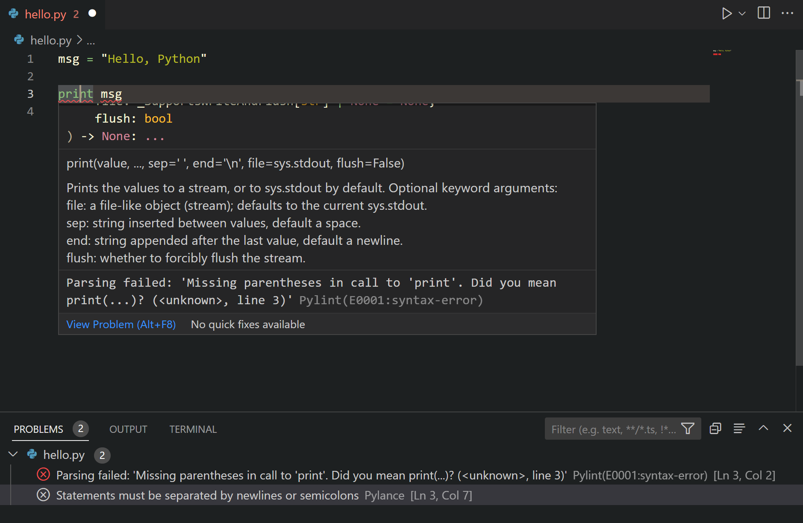

+++
title = "Linting"
date = 2024-01-12T22:36:24+08:00
weight = 20
type = "docs"
description = ""
isCJKLanguage = true
draft = false

+++

> 原文: [https://code.visualstudio.com/docs/python/linting](https://code.visualstudio.com/docs/python/linting)

# Linting Python in Visual Studio Code 在 Visual Studio Code 中对 Python 进行 linting

Linting highlights syntactical and stylistic problems in your Python source code, which often helps you identify and correct subtle programming errors or unconventional coding practices that can lead to errors. For example, linting detects use of an uninitialized or undefined variable, calls to undefined functions, missing parentheses, and even more subtle issues such as attempting to redefine built-in types or functions. Linting is distinct from [Formatting](https://code.visualstudio.com/docs/python/formatting) because linting analyzes how the code runs and detects errors whereas formatting only restructures how code **appears**.

&zeroWidthSpace;Linting 突出显示 Python 源代码中的语法和风格问题，这通常有助于您识别和更正可能导致错误的细微编程错误或非常规编码做法。例如，linting 检测使用未初始化或未定义的变量、调用未定义的函数、缺少括号，甚至更细微的问题，例如尝试重新定义内置类型或函数。Linting 与 Formatting 不同，因为 linting 分析代码的运行方式并检测错误，而 formatting 仅重构代码的显示方式。

> **Note**: Stylistic and syntactical code detection is enabled by the Language Server. To enable third-party linters for additional problem detection, you can enable them by using the **Python: Select Linter** command and selecting the appropriate linter.
>
> &zeroWidthSpace;注意：语言服务器启用了风格和语法代码检测。若要启用第三方 linter 以进行其他问题检测，可以使用 Python: Select Linter 命令并选择合适的 linter 来启用它们。

## [Choose a linter 选择 linter](https://code.visualstudio.com/docs/python/linting#_choose-a-linter)

Install the linting tool of your choice from the VS Code [Marketplace](https://marketplace.visualstudio.com/vscode).

&zeroWidthSpace;从 VS Code Marketplace 安装您选择的 linting 工具。

Microsoft publishes the following linting extensions:

&zeroWidthSpace;Microsoft 发布了以下 linting 扩展：

| Linter | Extension 扩展                                               |
| :----- | :----------------------------------------------------------- |
| Pylint | https://marketplace.visualstudio.com/items?itemName=ms-python.pylint |
| flake8 | https://marketplace.visualstudio.com/items?itemName=ms-python.flake8 |
| mypy   | https://marketplace.visualstudio.com/items?itemName=ms-python.mypy-type-checker |

Linting extensions offered by the community:

&zeroWidthSpace;社区提供的 linting 扩展：

| Linter | Extension 扩展                                               |
| :----- | :----------------------------------------------------------- |
| Ruff   | https://marketplace.visualstudio.com/items?itemName=charliermarsh.ruff |
| mypy   | https://marketplace.visualstudio.com/items?itemName=matangover.mypy |

> **Note**: If you don't find your preferred linter in the table above or in the Marketplace, you can add support for it via an extension. You can use the [Python Extension Template](https://code.visualstudio.com/api/advanced-topics/python-extension-template) to integrate new Python tools into VS Code.
>
> &zeroWidthSpace;注意：如果您在上面的表格或市场中找不到您首选的 linter，您可以通过扩展为其添加支持。您可以使用 Python 扩展模板将新的 Python 工具集成到 VS Code 中。

## [General Settings 常规设置](https://code.visualstudio.com/docs/python/linting#_general-settings)

| Setting 设置   | Default 默认 | Description 说明                                             |
| :------------- | :----------- | :----------------------------------------------------------- |
| args           | `[]`         | Arguments to be passed to the linter. **Note**: The officially supported linters run on individual open files. Make sure your configuration applies in that scenario. 要传递给 linter 的参数。注意：官方支持的 linter 在单独的打开文件中运行。确保您的配置适用于该方案。 |
| importStrategy | `useBundled` | When set to `useBundled`, the extension uses the version of the tool that it ships with. When set to `fromEnvironment`, it attempts to load from your selected Python environment first, otherwise it falls back to the bundled version. 当设置为 `useBundled` 时，扩展使用它附带的工具版本。当设置为 `fromEnvironment` 时，它首先尝试从您选择的 Python 环境中加载，否则它会回退到捆绑版本。 |

## [Disable linting 禁用 linting](https://code.visualstudio.com/docs/python/linting#_disable-linting)

Linters, if installed, are enabled by default. You can disable them by [disabling the extension](https://code.visualstudio.com/docs/editor/extension-marketplace#_disable-an-extension) per workspace.

&zeroWidthSpace;如果已安装，则默认启用 Linters。您可以通过禁用每个工作区的扩展来禁用它们。

## [Run linting 运行 linting](https://code.visualstudio.com/docs/python/linting#_run-linting)

Linting will automatically run when a Python file is opened or saved.

&zeroWidthSpace;在打开或保存 Python 文件时，linting 将自动运行。

Errors and warnings are shown in the **Problems** panel (Ctrl+Shift+M) for open files, and are also highlighted in the code editor. Hovering over an underlined issue displays the details:

&zeroWidthSpace;错误和警告显示在打开文件的“问题”面板（Ctrl+Shift+M）中，也会在代码编辑器中突出显示。将鼠标悬停在带下划线的问题上会显示详细信息：

## [Code Actions 代码操作](https://code.visualstudio.com/docs/python/linting#_code-actions)

Some linters may offer [Code Actions](https://code.visualstudio.com/docs/editor/refactoring#_code-actions-quick-fixes-and-refactorings) that can help address reported problems. You can refer to the [Feature Contributions](https://code.visualstudio.com/docs/editor/extension-marketplace#_extension-details) section under your preferred linter extension to find out what Code Actions it offers.

&zeroWidthSpace;某些 linter 可能提供代码操作，可帮助解决报告的问题。您可以参考首选 linter 扩展下的“功能贡献”部分，以了解它提供的代码操作。

## [Logging 日志记录](https://code.visualstudio.com/docs/python/linting#_logging)

Logs for linters are available in the **Output** panel (Ctrl+Shift+U) when you select `<linter name>` from the drop down menu.

&zeroWidthSpace;当您从下拉菜单中选择 `<linter name>` 时，linting 的日志记录可在“输出”面板（Ctrl+Shift+U）中找到。

You can change the log level for a linter extension by running the **Developer: Set Log Level** command from the Command Palette (Ctrl+Shift+P). Select the extension from the **Extension Logs** group, and then select the desired log level.

&zeroWidthSpace;您可以通过从命令面板（Ctrl+Shift+P）运行“开发人员：设置日志级别”命令来更改 linter 扩展的日志级别。从“扩展日志”组中选择扩展，然后选择所需的日志级别。

## [Severity 严重性](https://code.visualstudio.com/docs/python/linting#_severity)

Linters report issues with some predefined severity. This can be changed using `severity` setting for the linter. Refer to each linter extension's README for more details on the supported values and severity levels.

&zeroWidthSpace;Linters 报告了一些预定义严重性的问题。可以使用 `severity` 设置更改此设置。有关支持的值和严重性级别的更多详细信息，请参阅每个 linter 扩展的 README。

## [Troubleshooting linting 排查 linting](https://code.visualstudio.com/docs/python/linting#_troubleshooting-linting)

| Issue 问题                          | Cause 原因                                                   | Solution 解决方案                                            |
| :---------------------------------- | :----------------------------------------------------------- | :----------------------------------------------------------- |
| No problems reported 未报告任何问题 | No Python has been selected for your workspace. 您的工作区未选择任何 Python。 | Look at the logs for the linter you are using and check the path to the Python environment it's using. If there is no Python selected, run the **Python: Select Interpreter** command from the Command Palette and select an existing interpreter for your workspace. 查看您正在使用的 linter 的日志，并检查它正在使用的 Python 环境的路径。如果未选择任何 Python，请从命令面板运行 Python: 选择解释器命令，并为您的工作区选择一个现有的解释器。 |

## [Next steps 后续步骤](https://code.visualstudio.com/docs/python/linting#_next-steps)

- [Formatting](https://code.visualstudio.com/docs/python/formatting) - Learn about how to format your Python code.
  格式化 - 了解如何格式化您的 Python 代码。
- [Debugging](https://code.visualstudio.com/docs/python/debugging) - Learn to debug Python both locally and remotely.
  调试 - 了解如何在本地和远程调试 Python。
- [Testing](https://code.visualstudio.com/docs/python/testing) - Configure test environments and discover, run, and debug tests.
  测试 - 配置测试环境并发现、运行和调试测试。
- [Basic Editing](https://code.visualstudio.com/docs/editor/codebasics) - Learn about the powerful VS Code editor.
  基本编辑 - 了解功能强大的 VS Code 编辑器。
- [Python Extension Template](https://code.visualstudio.com/api/advanced-topics/python-extension-template) - Create an extension to integrate your favorite linter into VS Code.
  Python 扩展模板 - 创建一个扩展，将您最喜欢的 linter 集成到 VS Code 中。
